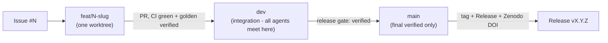

# AGENTS.md — Trading Strategy Finder · multi-agent operating manual

**This repository is developed primarily by AI agents working in parallel. This file is the contract
that lets them do so without colliding. Read it fully before touching anything. GitHub renders it, and
non-Claude agents read it too — it is the single source of truth for *how we work*, not just *what the
code does*.**

> Historical note: an earlier `AGENTS.md` described the frozen **v1.x** architecture (`src/main/`,
> `1min.csv`). That era is preserved under the `v1.0.0` / `v1.0-working` tags and `docs/V1-FROZEN.md`.
> The current project is the box-strategy engine under `subprojects/Parametric-Indicators/`.

---

## 1 — THE GOLDEN RULE OF PARALLEL WORK

**One workstream = one Issue = one branch = one worktree = one server section.** Never share any of
these across two agents. This single rule prevents almost every collision.

```
Issue #N  ->  branch feat/N-slug  ->  worktree .worktrees/N-slug  ->  server dir ~/Mulham/<slug>
   (the plan)      (the code)              (isolated files)            (isolated compute)
```

Before you start ANY work:
1. **Search open Issues and remote branches** (`gh issue list`, `git branch -r`). If your task already
   has an Issue or a branch, join it — do not open a parallel one. *(This is not hypothetical: four
   regime-research branches were once opened for overlapping questions.)*
2. **Claim the Issue** — assign yourself and comment the branch + worktree you will use.
3. Only then create the branch and worktree.

---

## 2 — THE BRANCH MODEL



| Branch | Rule |
|---|---|
| **`main`** | Final, **verified** versions only. Protected: no direct pushes; merges via PR only. |
| **`dev`** | The integration branch. Every workstream merges here by PR. Where parallel agents converge. |
| **`feat/<issue>-<slug>`** | One per Issue, in its own worktree. Deleted after merge — the Issue + merge commit are the record. |
| **`research-<topic>`** | Long-lived exploratory workstreams (regime, timesfm, …). Same rules; merge findings to `dev`. |

- **Checkpoints are NOT branches.** "Save this state" = a **tag + GitHub Release** (§6), never a lingering
  branch. Branch-per-checkpoint is retired.
- Rebase your feature branch on `dev` before opening the PR; keep PRs small and single-purpose.
- Reference the Issue in commits and the PR (`Closes #N`) so the trail is automatic.

---

## 3 — ISSUES ARE THE COORDINATION BOARD

Every plan, TODO, research question, bug, and champion proposal is a **GitHub Issue**. The Issue's
timeline *is* the workstream's history.

**Labels** (apply at least one `workstream:` and one `type:`):
- `workstream:fundamentals` · `workstream:l2` · `workstream:optimizer` · `workstream:regime` ·
  `workstream:dashboard` · `workstream:infra`
- `type:research` · `type:bug` · `type:feature` · `type:champion` · `type:infra`
- `status:blocked` · `status:frozen` · `status:in-progress` · `status:needs-verification`
- `agent:claimed` (with an assignee) so no two agents grab the same work.

**Findings and verdicts get filed as Issues too** — and closed with the verdict + a link to the report
in `docs/superpowers/`. A closed Issue is a permanent, searchable record (the Asia-cell FLUKE, the
gap-fills result, etc.). Use the templates in `.github/ISSUE_TEMPLATE/`.

---

## 4 — VERIFICATION GATES (what makes "main = verified" real)

Two layers, because **the price data is NOT in the repo** (server-only, gitignored), so CI alone cannot
fully verify.

1. **CI (GitHub Actions, `.github/workflows/ci.yml`)** — on every PR: byte-compiles the whole tree and
   runs the **data-free** unit/parity tests. This catches the syntax/import/interface breakage that is
   the most common failure (mangled edits, renamed kwargs, unmigrated call sites). Required green on PRs
   to `main`.
2. **The GOLDEN GATE (server-side, manual pre-merge)** — the byte-identical regression on the champion
   set (`perf/check_golden.py`) needs the price data, so it runs on the **server**, not CI. The PR author
   confirms it green in the PR checklist before a `dev -> main` merge. **A change that moves any golden
   hash without an intended, documented reason does not merge.**

`main` is branch-protected to require CI. `dev` is intentionally left open (parallel agents push to it) —
the gate is at the `dev -> main` boundary.

---

## 5 — THE RESEARCH DISCIPLINE (non-negotiable — this is why our results are trustworthy)

Every one exists because skipping it produced a wrong, confident result that had to be retracted:

| Rule | Why |
|---|---|
| **Power analysis is mandatory for any NEGATIVE result** | A null at low power says nothing. A whole workstream was retracted for reporting "priced in" at 12% power. |
| **Dumb control + noise check for any POSITIVE result** | 2/3 of an "$18k microstructure edge" was just a wider stop; an "$80/trade edge" was noise against a ±$1,600 swing. |
| **NEVER read a strategy parameter with a silent default** | `dict.get(k, default)` cannot fail, so a typo'd key silently backtests a *different strategy*. This invalidated two workstreams (`BUG-01`). Use a strict lookup; **print the params actually used**; a finding that equals its own input is a tautology alarm. |
| **Verify, don't assume** | Never conclude from truncated output (`ls \| head`), a wrongly-scoped search, or memory. Three wrong confident claims came from this in one session. |
| **Deep-research-first** | Every new workstream starts with a prior-art research pass before implementing. |
| **Rank correlation alongside Pearson on fat-tailed data** | Pearson was blind to gold's −0.19 macro reaction (fat tails swamp it). |
| **Measure at the resolution of the DECISION** | A 1-minute study "proved" a release prices in a minute; at 1-second only 60% did. |
| **Cross-instrument replication when the time-split is blocked** | The Asia-cell finding died the moment it met independent indices. |
| **Gap-aware fills are the default** (`gap_fills=True`) | Filling a gapped stop at the line understates *risk*, not profit (drawdown +10%, NG +148%). |
| **A pre-committed decision rule must gate on EDGE before it gates on SIZE** | `DAILY-BOX-01`: the rule branched on supply first (≥20% new trades ⇒ ship) and only consulted the edge test if supply was *small*. Daily boxes then returned **large supply with zero edge** — a case the rule never contemplated, so read literally it said "ship". More trades is not a result; more trades **that beat a dumb control** is. Order the branches so a failed edge test kills the option no matter how big the supply. |
| **Test the DIFFERENCE, not two overlapping error bars** | `DAILY-BOX-01`: eyeballing per-arm CIs suggested "probably nothing"; bootstrapping *(real − control)* directly turned that into a firm **0 of 9**. Two CIs can overlap while their difference is significant, and vice versa — comparing them by eye is not a test. |
| **Name the question your measurement does NOT answer** | `DAILY-BOX-01` measured whether *breaking through* a zone predicts continuation, which says nothing about whether *entering toward* one gets rejected. Closing "daily boxes" wholesale on that evidence would have buried an untested option. State the unanswered variant explicitly in the report. |

Reports live in `docs/superpowers/`; the running standup is
`subprojects/Parametric-Indicators/DAILY_REPORTS.md`.

**The cost analogue of these rules is [`docs/EXPANSION_ROUND_PLAYBOOK.md`](docs/EXPANSION_ROUND_PLAYBOOK.md)
— read it before ANY expansion round** (new indicators, instruments, timeframes, layers). Correctness is
gated on every PR; **cost is gated on none**, which is how one indicator (`dfa`) silently became 81% of
all optimizer compute — 12.6 minutes for a single compute — while the performance report still blamed
three indicators that had already been fixed (#54).

---

## 6 — CHECKPOINTS ARE RELEASES (with DOIs)

A **GitHub Release** (tag + full notes) — never a branch — marks anything we **agree and verify**: a
milestone, a frozen finding, or a **new champion set** (only once verified).

- Bump `version` + `date-released` in `CITATION.cff`, then `gh release create vX.Y.Z --title … --notes …`.
- The repo is enabled in **Zenodo**, so every published Release auto-mints a **version DOI** under a
  stable **concept DOI** — citable and permanent. This is the checkpoint *and* citation mechanism.
- Data too large for git (the price frames) is archived as a **Zenodo dataset**, not committed.

---

## 7 — SHARED RESOURCES (the other collision surface)

- **Server = the AMD box** (`ssh amd-trading`). Never run heavy compute on the user's local 12c/14GB
  machine without explicit permission. Each workstream gets its own dir under `~/Mulham/<slug>`.
- **Heavy-timeframe backtests (2m/5m) run on the server only** — they OOM-froze the local box once.
- **The L1 disk cache** (`/tmp/wsh_l1_cache`) keys on params, **not** engine behaviour. **Clear it after
  any P/L-affecting engine change**, or the causal path serves a stale ledger (this caused a $14k phantom
  parity divergence).
- **`--ind-1min` always** for the box optimizer. The 4h/`ind_1min=False` frame is a wrong-frame trap.
- **Dashboard** runs as a supervised shared service; backend changes need a `server.py` restart, not just
  a browser refresh.
- Long runs get a **live progress monitor**, never a blind blocking wait.

---

## 8 — WHAT STAYS OUT OF GIT

- **Secrets** (`keys.env`, `*.ovpn`, credentials) — gitignored; live outside the tree. Never commit.
- **Price/box data** (`*.csv` frames), **venvs**, **node_modules**, **dashboard outputs** (`*.html`/`*.pdf`),
  **bundle zips** — gitignored. Data → Zenodo; binaries → Release attachments.
- The **golden baselines** (`perf/golden/*.json`, `*.npz`) DO stay — the small regression contract.

---

## 9 — STARTER CHECKLIST (for every new workstream)

- [ ] Found/opened the Issue; assigned myself; commented the branch + worktree I will use
- [ ] Checked no other open Issue/branch already covers this
- [ ] `git worktree add .worktrees/<slug> -b feat/<issue>-<slug> dev`
- [ ] Server dir `~/Mulham/<slug>` if compute is needed
- [ ] Deep-research pass first (for a new question)
- [ ] **If this is an EXPANSION round** (more indicators / instruments / timeframes / layers):
      run the start-of-round checklist in [`docs/EXPANSION_ROUND_PLAYBOOK.md`](docs/EXPANSION_ROUND_PLAYBOOK.md)
      — re-profile first (an old profile is invalid after growth), record the "before" number, and
      multiply any per-bar cost by **486,969** before committing to it
- [ ] Work; print params actually used; power / dumb-control / noise checks as applicable
- [ ] Golden gate green on the server; CI green on the PR
- [ ] PR to `dev` with `Closes #N`; delete the branch after merge
- [ ] Milestone / finding / verified-champion → tag + Release (+ DOI)
