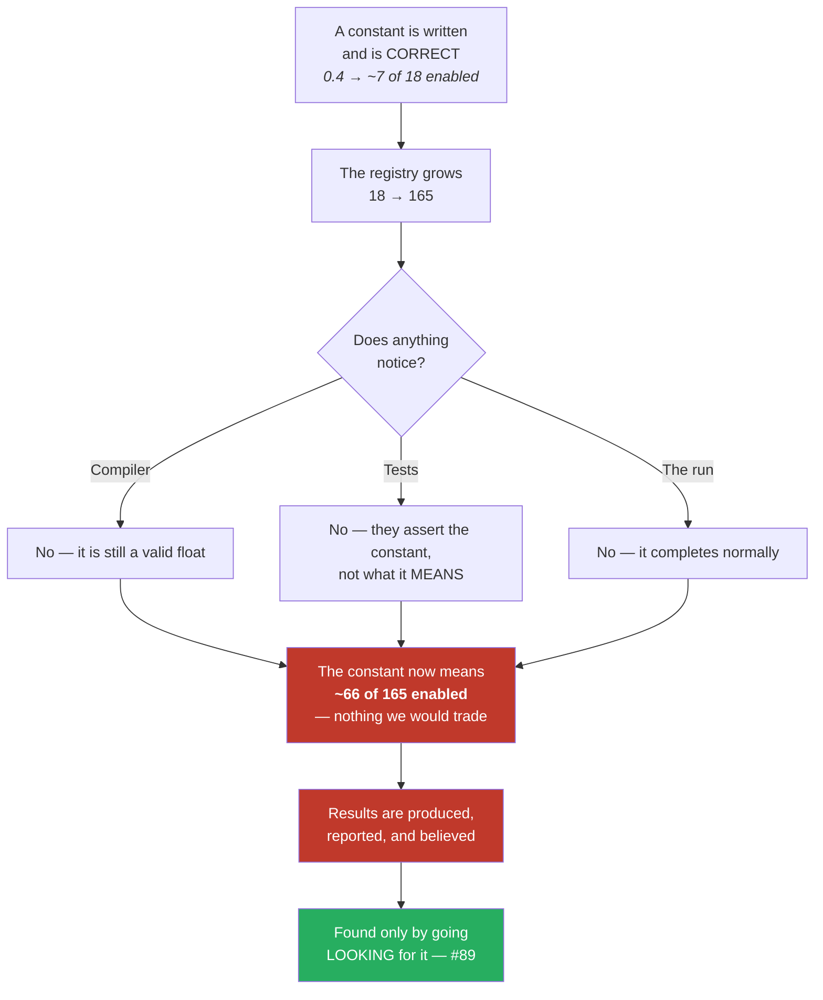

# Audit — constants calibrated when the indicator registry was small

**What this document is.** A complete list of every place in the search path where a number's meaning
depends on **how many indicators the library happens to contain**. For each one: what it was calibrated
against, what it means today, and whether it has been fixed, exposed to you as a choice, or checked and
found genuinely safe.

**Why it exists.** The library grew 15 → 18 → 143 → 165. Nothing in the code errors when that number
changes. Constants that were correct at 18 kept compiling, kept passing their tests, and quietly came
to mean something else. This audit is the deliverable of issue #89 and the evidence behind playbook
rules **S1–S7**.

---

## 1. The shape of the whole problem, in one sentence

**A constant that is really a ratio.**

`0.4` looks like a probability. It is not — it is *"about 7 indicators enabled"*, and only at 18.
`1–2 bits` looks like a small mutation. It is not — it is *"8% of the genome"*, and only at 18.
`47,100 trials` looks like a budget. It is not — it is *"100 trials per dimension"*, and only if the
dimension count matches the search you are actually launching.

When the denominator moves, the numerator keeps its old value and the *meaning* silently changes. There
is no error, no warning, no failing test. The run completes and looks exactly like a normal run.

---

## 2. The inventory

Status key — **DERIVED**: now computed from `len(library.REGISTRY)` or from the actual scope, so it
cannot go stale. **EXPOSED**: it encodes a judgement, so it is a human's choice rather than a hidden
constant. **SAFE**: checked and genuinely independent of registry size. **OPEN**: known wrong or
unverified, tracked as its own issue.

### 2.1 Search-space shape (MAP-Elites)

| Constant | Calibrated at | What it silently became at 165 | Status |
|---|---|---|---|
| `map_elites` bootstrap genome — was `rng.random() < 0.4` | 18 indicators ⇒ **~7 enabled**, a plausible strategy | **~66 enabled**. Measured over a standard 400-evaluation run: the archive spanned 50–83 enabled and **never reached** the 3–10 region where every deployed champion lives. Mutation moves ±1, so it could not walk there within any realistic budget. | **DERIVED + EXPOSED** — now samples a *count* (`RAND_N_IND = (1, 15)`), independent of registry size, overridable with `--rand-n-ind LO,HI` |
| `map_elites` mutation width — was a fixed 1–2 bits | 18 indicators ⇒ **~8% of the genome** | **~1%** — the operator silently weakened ~9× as the library grew | **DERIVED** — `MUT_FRAC = 0.02`, a fraction of the genome, keeping the old 1–1–2 shape scaled |
| `behavior()` second axis = indicator count | 18 ⇒ 9 × 19 = **171 niches** against 400 evaluations (~2.3/niche) | 9 × 166 = **1,494 niches** against the same 400 (~0.27/niche). "Keep the best per niche" degenerates into "keep the first thing that lands there". | **OPEN — #88** |
| `DD_BIN = 2000.0`, `DD_BIN_CAP = 8` | — | Dollar-denominated drawdown buckets. Nothing to do with how many indicators exist. | **SAFE** |
| `rng.random() < 0.5` (bootstrap `flip`), `rng.random() < 0.10` (mutate `flip`) | — | Both apply to `flip`, a **single boolean**, not a per-indicator draw. A probability is the right representation for one coin. | **SAFE** |

### 2.2 Trial budgets — the defect found at four separate call sites

`--auto-trials` sizes a run as `total_search_dimensions × TRIALS_PER_DIM`. When a run is restricted with
`--only-indicators`, the dimension count must shrink with it. It did not.

| Call site | What it did | Status |
|---|---|---|
| `optimizer.main()` | Budgeted **47,100 trials for a 59-dimension search** — 8× over. ~20 hours per study instead of ~45 minutes; ~10 days for a twelve-study campaign instead of ~9 hours. | **DERIVED** (#2) |
| `control.plan()` / `preview_command` | The control-centre UI displayed "471 dims / 47,100 trials" for a search that could only ever touch 18 indicators, and launched that number | **DERIVED** |
| `runner.target_trials()` — **the watchdog** | Chased a target of **47,000** for a run that needed **5,800** (8.1×). This one drives the respawn loop, so it would have restarted the optimizer over and over pursuing a target the search was never sized for. | **DERIVED** (#89 sweep) |
| `optimize/server/remote_wsi.sh` | The server launcher recomputed the same budget in shell. Root cause was one level deeper: `REMOTE_ENV` never exported `WSH_ONLY`/`WSH_EXCLUDE`, so the remote side **could not have honoured the scope even in principle**. Fixed at the export. | **DERIVED** (#89 sweep) |
| `two_stage` Stage-A budget — was a literal `200` | `(len(REGISTRY) + 1) × TRIALS_PER_DIM`. At 18 the literal was ~10.5 trials/dimension; at 165 it was **1.2** — a shortlist chosen almost at random. | **DERIVED** |

**Four sites, one defect, found one at a time over two days.** The lesson is playbook rule **S3**:
fixing a bug at one call site is not fixing the bug. `optimize/test_budget_scope_everywhere.py` now
enumerates every consumer — spec, UI plan, watchdog — and asserts they resolve identically across four
indicator scopes, plus an AST check that no module resolves a budget without passing the scope.

> **A note on how that test was built.** The first version of the AST check was a regex over source
> text and produced **five false positives**: `stage_a_recommended_trials(...)` is a different function
> that merely ends with the same name, and one "offender" was the phrase sitting inside a *docstring
> documenting this very bug*. Parsing the syntax tree means the check sees **calls**, not text.
> Verified in both directions — it catches a reintroduced unscoped call, and it does not flag
> `stage_a_recommended_trials`.

### 2.3 What gets reported

| Constant | Problem | Status |
|---|---|---|
| `report_wsi` header — "Search = box params + **all 15 indicators**" | `15` was a literal, true on the day it was typed. The registry went to 18 and then 165 and the sentence never moved. It was also wrong in the *other* direction: campaigns deliberately restricted with `--only-indicators` still got a report claiming "all". The wshgap4 report rescued from the server on 2026-07-31 says "all 15 indicators" for a run that searched the original **18** — a durable record describing a search that never happened. | **DERIVED** — `_scope_sentence()` resolves through the same `searchable_indicators()` the optimizer uses, from the same `WSH_ONLY`/`WSH_EXCLUDE` the runners export. Reports a restriction as a restriction and names the flag that caused it. Six tests, including that a typo cannot inflate the published count. |
| `optimizer` run header | Now prints `indicator scope: N of 165 searchable`, the trial-store backend, and the end-of-day stance at run start | **DERIVED** |
| `contributors/votes.py` docstring — "the FULL 18-indicator registry" | Describes live behaviour: the contributor committee computes the whole registry on the contributor's own bars. At 165 that is 165 indicators, not 18 — and it is a second full-registry search stacked on top of the strategy's own. | **DERIVED** (wording now points at `len(library.REGISTRY)`); the cost consequence is **#80/#95** |

### 2.4 Exclusions — measurements with an expiry date

| Constant | Problem | Status |
|---|---|---|
| `contributor_search.SMC_COMMITTEE_KEYS` | Six structural indicators withheld from the cross-instrument committee search because `ifvg`=58.1 s and `breaker`=37.9 s were **90% of a 106.4 s trial**. Issue #62 then rewrote that family as Numba state machines: `ifvg` **29.90 s → 0.314 s (95×)**, `order_block` **2.82 s → 0.118 s (24×)**. The rationale describes code that has since been replaced. | **OPEN — #95.** Documented in place; **deliberately not flipped**, because changing a default changes what every contributor search explores, and that is a measured decision rather than a cleanup. |
| `contributor_search.L1_ES_EXCLUDE` — adds `stochastic`, `adx` | Their ≈2.2 s figures are pre-#62 as well | **OPEN — #95** |
| `--max-enabled` repair order | Keeping "the first `max_enabled` in registry order" sounds neutral and is not: originals occupy positions 0–17, so an original always won the tie. Measured on a live 16,000-trial adopt-gate study: **0 of 1,500 sampled trials kept a single new-library indicator** — a search whose whole purpose was to evaluate the new library was testing only the old one. | **DERIVED** (#12) — unbiased repair; `check_max_enabled_bias.py` re-checks any historical study |

### 2.5 Cross-round comparability

| Item | Status |
|---|---|
| Campaign results produced before a growth round are **not comparable** to results after it, even from an identical command line. The July `wshgap` run searched 18 indicators (59 dims, 5,900 trials, 44 min/study) because its worktree predated the 143-indicator library; the same command on today's tree searches 165 (471 dims, 47,100 trials) over a differently-shaped space. **Same flags, different experiment.** | **DOCUMENTED** — playbook rule S7; `test_trial_budget_scope.py` reproduces July's exact numbers (59 dims / 5,900 trials) with its configuration pinned explicitly, so it keeps reproducing *history* rather than silently tracking today's defaults |

---

## 3. What is still open after this sweep

| # | Item | Why it is not closed here |
|---|---|---|
| **#88** | MAP-Elites archive is 1,494 niches against a 400-evaluation budget | Needs a re-derived archive size and a re-run, not a constant edit |
| **#90** | MAP-Elites and two-stage results predate the recalibration | Their accepted results were produced by the mis-calibrated versions, so they are **unvalidated**, not wrong — they have to be re-run |
| **#95** | SMC exclusion rests on a pre-acceleration cost | Requires a fresh worst-case measurement on the real ES 1-minute frame before the default can honestly move |
| **#94** | The repo root is hardcoded as `/mnt/data/projects/trading` in 49 places | Found while syncing the server for this audit's regression run — different defect class, same *shape*: a machine-specific fact frozen as a literal |

---

## 4. Verification

- Full suite on the server, with the complete data base: **1,126 passed, 1 skipped, 0 failed.**
- The first server run showed 32 failures. **Not regressions** — every one was a `FileNotFoundError` on
  ES/instrument data, because the server keeps **three** different roots (`code`, `wsg-h` for candles,
  `wsg-i` for `ALL_STOCKS`) behind a single `WSH_DATA_BASE` variable. Re-running against the root that
  has all of it: zero failures. That conflation is now issue **#94**.
- Targeted: 36 passed across the budget-scope, report-scope and report-instrument suites.

---

## 5. See also

- `docs/EXPANSION_ROUND_PLAYBOOK.md` §4 — registry-scaling rules **S1–S7**, each pointing back to an
  entry in this audit
- `optimize/test_budget_scope_everywhere.py` — the sweep test that catches a fifth budget call site
- `optimize/test_report_scope_sentence.py` — the generated report cannot assert a scope from a literal
- `docs/CLOSEOUT-2026-07-28-indicator-budget.md` — the #62 acceleration measurements that expired the
  SMC exclusion
