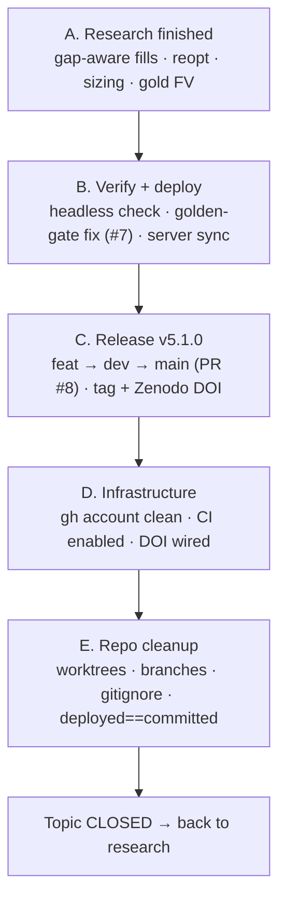
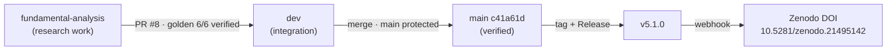

# Closeout — Structural project update & v5.1.0 release (2026-07-22)

**Purpose.** This report closes the *structural* work-topic — turning a research branch into a released,
verified, cleanly-organized project — so we can return to the actual trading-strategy research. It covers
everything from the start of this arc (finishing the gap-aware-fills research) through the v5.1.0 release,
enabling CI, and the full repo cleanup. Written for later re-reading: every term is spelled out, and the
current state is stated plainly so research can resume without archaeology.

---

## 0. One-paragraph summary

We finished the **gap-aware-fills** research (the backtest engine now books a gapped stop/take-profit at the
honest price, not the stop line), **re-optimized** the champion strategies on that honest engine and adopted
the three that genuinely improved, **re-cut the position-sizing budget** honestly, and **forward-validated**
gold's macro reaction (real but un-tradeable). All of that was then promoted through a proper GitHub flow
(feature → integration → verified main), **released as v5.1.0 with a permanent citation DOI**, protected by a
**verification gate (golden regression) that we fixed and proved green on the merge**, backed by **continuous
integration (CI)** we switched on, and finished with a **repo cleanup** that took the workspace from 9
worktrees / 24 branches down to 1 / 5 and made the live server match the released code exactly.

| Outcome | Result |
|---|---|
| Release | **v5.1.0** on `main` (`c41a61d`), tag + GitHub Release |
| Citation | Zenodo version DOI **10.5281/zenodo.21495142** (concept DOI `…21473312` resolves to latest) |
| Champions adopted | **3** (NQ 1h, NQ 2h, GC 15m) · **2 rejected** on out-of-sample grounds · **7 held** |
| Portfolio effect (honest engine) | full **+$52,443**, 2026 out-of-sample **+$35,475 (+13.6%)** |
| Sizing budget | **~0.25–0.5% of capital per trade** (unchanged by the re-optimization) |
| Verification | golden regression gate **6/6 green on the merged tree** |
| CI | enabled, **green** (byte-compile + core-import, data-free) |
| Cleanup | worktrees **9 → 1**, branches **24 → 5**, server **deployed == committed** |

---

## 1. The arc

---

## 2. Phase A — the research that fed the release

Four research threads, each written up in its own report under `docs/superpowers/` (repo root) or
`subprojects/Parametric-Indicators/docs/superpowers/`.

### A1. Gap-aware fills (reports `GAP-01`, `GAP-02`)
When a one-minute bar **gaps** — opens beyond a stop or take-profit without ever trading *at* it — the old
engine pretended we escaped *at the line*. Reality fills at the bar's **open** (worse on a stop). We turned
that on as the default (`gap_fills=True`). Across all 54 champions, total profit barely moved (−0.2%) but
**drawdown got ~10% worse** — meaning the old model understated **risk**, not profit. Because champions were
*tuned* on the too-optimistic engine, that motivated a re-optimization.

### A2. Champion re-optimization + adoption (report `GAP-03`)
We re-optimized NQ and GC across all six timeframes on the honest engine, warm-started so a result can never
be worse than the incumbent, and scored **both** the old and new champions through the *same* honest engine
(apples-to-apples). Verdict per slot:

| Slot | Full P&L (deployed → adopted) | 2026 out-of-sample | Decision |
|---|---|---|---|
| NQ 1h | 75,919 → **110,038** (+34,119) | 18,603 → **38,008** (+19,405) | ✅ **adopt** |
| NQ 2h | 88,478 → **101,517** (+13,039) | 12,882 → **26,728** (+13,846) | ✅ **adopt** (drawdown ~halved) |
| GC 15m | 82,616 → **87,901** (+5,285) | 37,899 → **40,123** (+2,224) | ✅ **adopt** |
| GC 4h | 79,015 → 113,466 (+34,451) | 11,816 → **9,344** (−2,472) | ❌ reject (over-fit) |
| NQ 5m | 20,092 → 23,056 (+2,964) | 282 → **−581** | ❌ reject (OOS turns negative) |
| 7 other slots | unchanged | unchanged | ⏸ held (incumbent best) |

**The teaching point:** chasing the biggest *in-sample* number ("take every re-opt") would have added ~+$37k
in-sample but **lost ~$3.3k out-of-sample**, because the two rejected slots are over-fits. The disciplined,
out-of-sample-gated set earns **less on the past and more on the future** — full **+$52,443**, out-of-sample
**+$35,475 (+13.6%)**.

### A3. Honest risk re-cut (reports `RISK-01` + a plain-language explainer)
"How much do we bet per trade?" We fixed a hidden bug — every trade had been normalized by a **hardcoded 40
points** regardless of its real stop (8–151 points) — so the risk fraction is now a *true* fraction of
capital. A Monte-Carlo over bet-sizes, checked across **8 random seeds**, showed the "best" size **wanders
randomly** — i.e. there is a broad flat plateau, **~0.25–0.5% of capital per trade** (hard ceiling ~1%), and
the re-optimization **did not change it**. The mandatory noise check killed a spurious "size-up 33%" that a
single simulation had suggested.

### A4. Gold's inverse macro reaction — forward-validated (report `GC-02`)
A walk-forward, no-peek test (766 out-of-sample trades) confirmed gold **really does** move inversely to
macro-release surprises (sign-stable, gold-specific, NQ control null) — **but it is not tradeable**: the
entire edge is the release-instant jump you can't enter in time to catch (a causal entry earns ~\$0, dead at
cost). A look-ahead bug in the first cut made it *look* tradeable (+\$131/trade); catching and fixing that
before reporting is the whole point of the discipline.

---

## 3. Phase B — verification & deployment

- **Headless verification** replayed each adopted champion through the dashboard's exact causal backend and
  reproduced its recorded P&L to the dollar (NQ 1h $110,038 · NQ 2h $101,517 · GC 15m $87,901). *(The final
  human browser click-through was waived — the browser extension was offline.)*
- **Golden-gate fix (Issue #7).** The golden regression gate re-runs the engine and asserts every champion
  reproduces **byte-for-byte**. It was broken on `dev` because a prior precision-fix had **orphaned** a
  `best_champions_full.json` and moved the real registry aside, so the gate couldn't find its champions. We
  resolved it by making the adopted `wsh4` set **canonical**, then **re-captured** the 1h/2h baselines (which
  legitimately changed) — and proved the four *untouched* slots still match, isolating the change to exactly
  the adoption.
- **Server sync.** The live dashboard is supervised by `~/Mulham/wsg-i/dash.sh __supervise`, which launches
  from the `~/Mulham/code` dev checkout. That checkout had **drifted 123 commits behind** and was serving the
  *pre-gap-fills* build. We synced it to the release, cleared the P&L cache, and refreshed — **deployed now
  equals committed.**

---

## 4. Phase C — the v5.1.0 release

The feature branch merged into `dev` and the **golden gate ran green (6/6) on the merged tree** — proving
dev's own 59 commits plus the gap-fills work reproduce every champion exactly. It then went to `main` via
**PR #8** (main is branch-protected, PR-only), was tagged and **released as v5.1.0**, and the release-publish
minted the **Zenodo version DOI**. The only manual conflict in the whole merge was `.gitignore`; the engine
files auto-merged with the critical `gap_fills` fix intact (verified).

---

## 5. Phase D — infrastructure (account + CI)

- **GitHub account cleaned.** The token was still authenticated under the pre-rename handle `molhamfetnah`
  and lacked the `workflow` permission. You did a full logout / cache-clear / re-login → now **`mulhamfetna`**
  with scopes `repo, workflow, read:org, gist`.
- **CI enabled.** `.github/workflows/ci.yml` runs on every push/PR to `dev`/`main`: **byte-compile the whole
  engine tree** (syntax) + **import-smoke-test the core** (catches renamed kwargs / bad imports). It is
  deliberately **data-free** — the price data isn't in the repo, so the data-dependent backtests and the
  golden gate stay server-side. First run went **green** after one fix (point `WSH_DATA_BASE` at the checkout
  root, since a module loads a registry at import time).
- **DOI wired** into `CITATION.cff` (concept + v5.0.0 + v5.1.0 identifiers); the README badge auto-resolves.

---

## 6. Phase E — repo cleanup

| Dimension | Before | After |
|---|---|---|
| Local worktrees | 9 | **1** (root on `dev`) |
| Local branches | 24 | **5** (`dev`, `main`, `stable-v2`, `v4.0/v4.1`) |
| Deleted branches' commits | — | **preserved as tags** (incl. 6 new `archive/*`) |
| Untracked junk (data zips, dumps) | in git status | **gitignored** |
| Personal notes / research subprojects | in git status | **local-ignored** (not published) |
| Server dashboard | serving stale pre-v5.1.0 build | **serving v5.1.0 (deployed == committed)** |

Nothing was lost — every deleted branch's commits live on as a tag, in line with the project rule
*"checkpoints are tags & releases, not lingering branches."*

---

## 7. What went well / what to watch

**Went well**
- **Out-of-sample discipline paid off twice** — it rejected two in-sample-only "improvements" (GC 4h, NQ 5m),
  and the noise check killed a fake "size-up 33%."
- **The verification gate did its job** — the merge only counted as done once the golden gate was green on the
  merged tree.
- **Honest engine throughout** — old and new champions were always scored on the same (honest) engine, so no
  comparison was flattered by optimistic fills.

**Watch (honest self-critique)**
- I hit the *"verify, don't assume"* trap several times during cleanup — wrong directory for the reports (they
  were at the repo root, not the subproject), and a stale dashboard I'd assumed was current. Each was caught
  by actually checking, but the lesson is to verify *first*.
- `best_champions_full.json` remains an **archived orphan** in the tree (kept, not deleted) — a future
  decision, not a live risk.
- Local git is slow because a shell status-daemon walks the large (now-ignored) data tree; it should ease now.

---

## 8. Current state to resume from (the handoff)

- **Branches:** `main c41a61d` (= v5.1.0, verified) · `dev efafb99` (= v5.1.0 + CI + gitignore) · feature
  branches created off `dev` per workstream.
- **Deployed:** the server dashboard serves v5.1.0 (gap-aware fills + adopted champions). Deploy recipe:
  `cd ~/Mulham/code && git pull` → `rm /tmp/wsh_l1_cache/*.pkl` → `~/Mulham/wsg-i/dash.sh refresh`.
- **Champions live:** the adopted set (deployed + NQ 1h/2h + GC 15m). Sizing guidance: ~0.25–0.5% risk/trade.
- **CI:** green on `dev`; reaches `main` on the next release.
- **Open decisions (not blockers):** the two local research subprojects (`MY-RESEARCHS`,
  `trends_agenitic_analysis`) are kept local — commit here, spin into their own repos, or leave, your call.

## 9. References

- Reports: `GAP-01`, `GAP-02`, `GAP-03`, `RISK-01` (+ plain-language explainer), `GC-01`, `GC-02` in
  `docs/superpowers/` (root) and `subprojects/Parametric-Indicators/docs/superpowers/`.
- Key commits: `e535325` (reports) · `105a2da` (champion adoption) · `96eb8de` (golden re-capture) ·
  `13eb339` (fa→dev merge) · `0ff0203` (v5.1.0 bump) · `36317d5` (CI) · `5c00876` (DOI) · `efafb99` (gitignore).
- Release: `v5.1.0` — https://github.com/mulhamfetna/trading-strategy-finder/releases/tag/v5.1.0 ·
  DOI `10.5281/zenodo.21495142`.

---

**Topic status: CLOSED.** The project is released, verified, deployed, and cleanly organized. Ready to return
to trading-strategy research.
