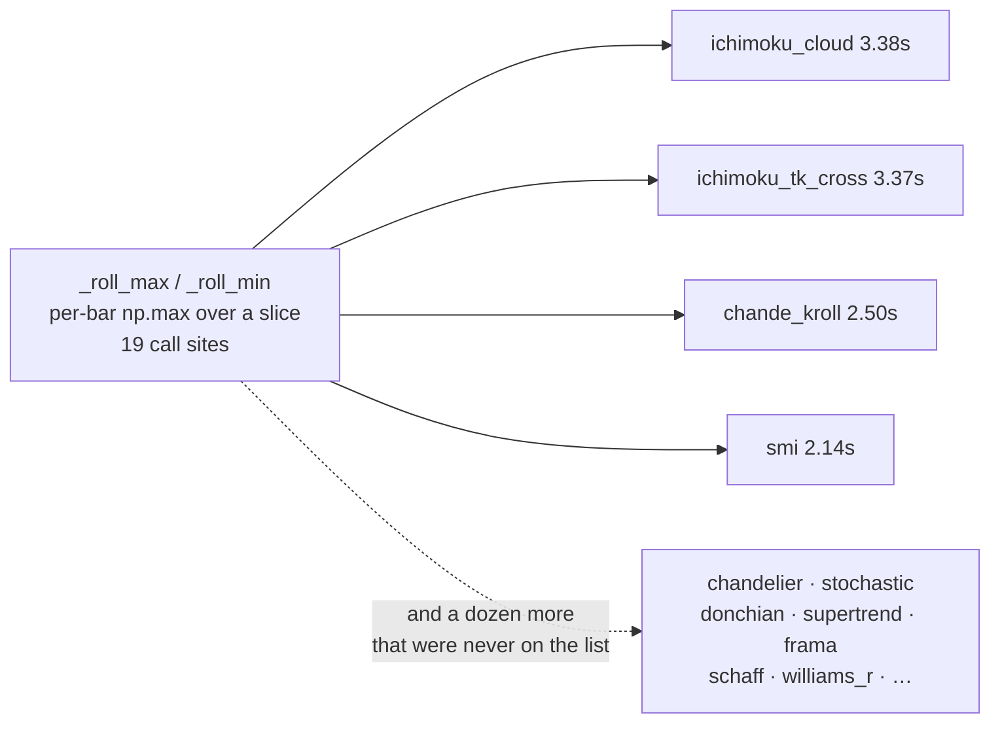

# Closeout — Every Indicator Inside the 2 s Budget (2026-07-28)

**Issue:** #62 · **Branch:** `feat/62-worstcase-budget` · **Follows:** #54 → #56/#57/#58
**Status:** ✅ **CLOSED — stopping rule met**

---

## 1. The task, and the finish line it came with

#56 established a **budget**: *no indicator may cost more than 2 s per compute on the full 486,969-bar
1-minute frame, at ANY point in its parameter grid.* It also left the bill: **17 of 165 indicators over
that budget, 60.3 s between them.** #62 was to work them down, and the stopping rule was explicit — stop
when nothing exceeds 2 s, do not chase diminishing returns past it.

**Result: 0 of 165 over budget.** The whole library's worst case fell **110.2 s → 22.4 s (4.9×)**. The new
slowest indicator is `rsi_connors` at **1.53 s**, which was never on the list and was never touched.

---

## 2. The headline: it was a shared LEAF, not an indicator

The single biggest win is not in any indicator file. `_roll_max` / `_roll_min` in
`indicators/classic.py` — five lines, a per-bar `np.max(x[t-n+1:t+1])` loop — has **19 call sites**. On
its own it put **four** indicators over budget:

`ichimoku_cloud` at its **default** parameters is six rolling extremes over ~487k bars: ~2.9 million
Python-level iterations, each calling into numpy to scan at most 52 values. The window size was never the
problem — the interpreter was. A monotonic-deque kernel is **O(N) regardless of `n`**, and because
max/min are *exact selections* with no arithmetic to reassociate, it is **bit-identical**.

> **Rule earned (playbook P11):** rank by **function**, not by indicator. Four "slow indicators" were one
> slow primitive, and the cost table that named them pointed at the wrong file four times.

The same applies to `ema` / `rma` / `nan_ema` — sequential recurrences, compiled, also bit-identical, and
paid by dozens of indicators.

---

## 3. Every indicator that was over budget

Measured with `optimize/perf/bench_worstcase.py` at defaults / all-min / all-max, projected to the full
frame. "worst cfg" is the grid point that produced the *before* number.

| indicator | before | after | speed-up | worst cfg |
|---|---:|---:|---:|---|
| `sinewave` | 6.53 s | 0.04 s | **163×** | default |
| `ifvg` | 5.29 s | 0.06 s | **88×** | default |
| `proj_bands` | 4.82 s | 0.26 s | 19× | all_max |
| `cmo_chande_dmi` | 4.42 s | 0.06 s | 74× | all_min |
| `ou_halflife` | 4.17 s | 0.27 s | 15× | all_max |
| `linreg_channel` | 3.69 s | 0.25 s | 15× | all_max |
| `frama` | 3.45 s | 0.02 s | **173×** | default |
| `ichimoku_cloud` | 3.38 s | 0.03 s | 113× | default |
| `ichimoku_tk_cross` | 3.37 s | 0.02 s | 169× | all_max |
| `schaff_trend_cycle` | 3.31 s | 0.01 s | **331×** | all_min |
| `lsma` | 3.08 s | 0.31 s | 10× | all_max |
| `linreg_r2` | 3.01 s | 0.21 s | 14× | all_max |
| `order_block` | 2.77 s | 0.04 s | 69× | all_min |
| `chande_kroll` | 2.50 s | 0.02 s | 125× | all_min |
| `mama_fama` | 2.31 s | 0.02 s | 116× | default |
| `smi` | 2.14 s | 0.02 s | 107× | all_min |
| `ulcer` | 2.10 s | 0.12 s | 18× | all_max |
| **all 165, worst case** | **110.2 s** | **22.4 s** | **4.9×** | |
| **over the 2 s budget** | **17** | **0** | | |

At **default** parameters, on the full frame, reference vs accelerated (`bench_budget --phases timing`):

| indicator | reference | accelerated | speed-up |
|---|---:|---:|---:|
| `ifvg` | **29.98 s** | 0.314 s | 95× |
| `sinewave` | 6.20 s | 0.043 s | 144× |
| `proj_bands` | 4.56 s | 0.013 s | **362×** |
| `ou_halflife` | 4.10 s | 0.022 s | 185× |
| `cmo_chande_dmi` | 3.95 s | 0.019 s | 208× |
| `linreg_channel` | 3.51 s | 0.051 s | 68× |
| `linreg_r2` | 2.80 s | 0.014 s | 204× |
| `lsma` | 2.90 s | 0.021 s | 136× |
| `order_block` | 2.85 s | 0.154 s | 19× |

`ifvg` at 30 s per compute at its *defaults* is the one that would have hurt most: it independently
corroborates the ES-committee finding in `docs/PERFORMANCE.md` §9, where `ifvg` was 58 s of a 106 s trial.

---

## 4. This round was NOT an algorithms problem

#54's `dfa` needed a genuine algorithmic replacement — `np.polyfit` per segment per scale per bar has a
closed form that costs a few sums. **Almost nothing here did.** Two structural changes were needed:

* `_roll_max`/`_roll_min` → monotonic deque (O(N·n) → O(N)),
* `hilbert_sinewave` → hoist `sin`/`cos` into a lookup table (they depend only on two small integers),

and everything else is **the same arithmetic, compiled**. The tell is whether the per-bar work is
*heavyweight* (a LAPACK solve) or merely *numerous* (a few multiply-adds, 10⁸ times). Ten to the eighth
interpreted steps is minutes; the same steps compiled are milliseconds.

> **Rule earned (playbook P12):** before writing a clever algorithm, check whether the cost is the
> algorithm or the interpreter.

---

## 5. Parity — what was proven, and two things the gate caught

Contract, unchanged from #54: the original implementation is kept **verbatim** as a `*_reference` oracle,
the accelerator dispatches to it when Numba is absent, and equivalence is proven on the **real** frame.
What changed in #62 is that most of it is now provable at the *strongest* level.

### 5.1 Finding 1 — a differently-rounded sum flipped real votes

A left-to-right window sum is exactly as *accurate* as numpy's, and differently *rounded*. That is
invisible right up until the value meets a comparison:

* `ou_halflife` vetoes on **`b >= 0`** — a sign test,
* `lsma` / `frama` vote **`sign(close − line)`** — price touching the line exactly.

On the real 486,969-bar frame this flipped **1 bar in `ou_halflife`** and **2 bars in `frama`**. Three
changed trading decisions is not "identical", so it was fixed rather than documented away.

`indicators/_numba.pw_sum` now reproduces **numpy's pairwise summation order bit-for-bit** — verified
against `ndarray.sum()` over 456 length/offset combinations including the >128 recursive case. Building
`mean` and numpy's two-pass `var` on top of it makes the **entire window-statistic family bit-identical**:

| accelerator | bars differing on the real frame | max \|Δ\| |
|---|---:|---:|
| `frama`, `ou_coefficient`, `ulcer`, `proj_bands`, `dynamic_dmi`, `linreg_dev`, `linreg_slope`, `linreg_r2`, `lsma`, `schaff_trend_cycle` | **0** | **0.0** |
| `_roll_max`, `_roll_min`, `ema`, `rma`, `nan_ema` (40 cases) | **0** | **0.0** |
| `ifvg`, `order_blocks` (pure comparisons, int8 out) | **0** | **0.0** |

> **Rule earned (playbook C14):** when a reduction feeds a comparison, sum the way numpy sums. Matching
> the order removed the whole class instead of measuring it away one indicator at a time.

### 5.2 Finding 2 — `frama`'s 1-ULP `log`/`exp`, and the three that keep it

Numba's libm differs from numpy's by ~1 ULP. In `frama` that fed a recursive filter and flipped 2 bars.
The fix: `frama`'s `log`/`exp` are **hoisted back into numpy** (the fractal ranges come from the exact
`_roll_max`/`_roll_min`, and only the multiply-add recurrence is compiled) — verified bit-identical.

Three cannot be fixed that way, because the transcendental sits **inside a loop-carried recurrence**:

| filter | bars differing | max \|Δ\| | closest bar to its decision boundary | safety factor |
|---|---:|---:|---:|---:|
| `dominant_cycle` | 18,970 | 4.26e-14 | 6.50e-07 | **1.5 × 10⁷** |
| `mama_fama` | 2,329 | 1.09e-11 | 3.88e-05 | **3.6 × 10⁶** |
| `hilbert_sinewave` | 125 | 9.99e-16 | 5.13e-09 | **5.1 × 10⁶** |

Zero vote flips — but "zero flips" alone would be luck. The shippable claim is the **margin**: over the
whole frame and the whole threshold grid, the closest any bar ever comes to changing its vote is between
3.5 and 15 **million** times further away than the drift. Reproduce with
`bench_budget.py --phases exactness`.

> **Rule earned (playbook C15):** if a transcendental is inside a loop-carried recurrence you cannot make
> it bit-identical — so measure the margin, not just the flip count.

### 5.3 `vote_cache.CACHE_VERSION` — deliberately NOT bumped

The playbook's END checklist says to bump `CACHE_VERSION` on any **non-vote-identical** maths change,
because the disk cache keys on *parameters*, not on the implementation. This change is vote-identical, and
what the cache stores is the **vote** (`runner._ind_vote`'s discretized direction arrays), not the raw
float series — so a stale entry cannot carry the 1 ULP drift into a decision. **No bump.** Recorded here
as a reasoned decision rather than an omission; if a future change moves a vote on any bar, bump it.

### 5.4 The gates themselves

| gate | result |
|---|---|
| `bench_budget --phases votes` — emitted confirm/veto arrays, fast vs reference, swept across the searched grid on the real frame | **0 flips** across all 25 checked indicators |
| `bench_budget --phases control` — the same machinery comparing every function to **itself** | **0** (must be, or the harness is broken) |
| `bench_budget --phases primitives` | **40/40 bit-identical** |
| `optimize/perf/test_budget_accel_parity.py` | 84 tests, green |
| full `pytest` | *(see §7)* |
| `perf/check_golden.py` | *(see §7)* |

---

## 6. Three ways this nearly shipped a false pass

Recorded because each one produced a *green* result that meant nothing.

1. **The harness reported 19,146 phantom `smi` vote flips.** The memo that made threshold sweeps
   affordable keyed on the array's **data pointer**; a freed temporary was reallocated at the same
   address and it served a stale array. Caught by the **dumb control** — comparing each function to
   itself must report exactly zero. → playbook **C10**
2. **84 local tests passed and the deploy immediately SEGFAULTED.** CI and the laptop have no Numba, so
   `njit` is a no-op and every dispatcher was falling back to its own reference: the tests were comparing
   the reference to itself. The crash (a *recursive* `@njit` called from inside another kernel, fixed
   with an explicit-stack emulation) only exists where Numba is live. Tests now force `_HAVE_NUMBA = True`
   so the kernel body runs even without Numba, and carry a deliberately-wrong-implementation test so the
   gate cannot silently go vacuous. → playbook **C11**, **C13**
3. **Swapping `classic._roll_max` did not swap `calc/levels.py`'s.** The leaves are bound at import time,
   so a name-based patch would have "verified" the fast path against itself. The harness swaps by
   **identity across every loaded `indicators.*` module** and prints `NOTHING WAS SWAPPED` when a swap
   matches nothing. → playbook **C12**

---

## 7. Verification results

*(filled from the final server run — `optimize/perf/logs/issue62_*.log`)*

---

## 8. Known blind spot, honestly stated

`bench_worstcase.py` builds its context from **one** instrument. The four cross-series indicators —
`rolling_corr`, `rolling_beta`, `cointegration`, `pca_factor` (`indicators/calc/xseries.py`) —
short-circuit on the missing reference and time at **0.00 s**. That is a pass meaning *"never ran"*, not
*"cheap"*: they still carry live per-bar `np.mean` / `np.std`-over-a-slice loops, the exact shape this
workstream exists to remove. **The 0/165 claim does not cover them.** Before enabling a cross-instrument
contributor, time them with a reference series attached. Recorded in the playbook's red-flag section and
as a follow-up on #62.

---

## 9. What changed

| file | change |
|---|---|
| `indicators/_numba.py` | **new** — the single optional-Numba import guard, plus `pw_sum` / `pw_mean` / `pw_var` (numpy's pairwise reduction, reproduced) |
| `indicators/classic.py` | `_roll_max`/`_roll_min` → O(N) monotonic deque; `ema`/`rma` → compiled recurrences |
| `indicators/_reference.py` | frozen oracles for `roll_max`/`roll_min`/`ema`/`rma` |
| `indicators/smc.py` | `ifvg` and `order_blocks` → Numba state machines, pure-Python fallbacks kept |
| `indicators/calc/{dsp,ma,osc,quant,tier2,trend,vol}.py` | 15 accelerators, each with a verbatim `*_reference` and a numba-absent fallback |
| `optimize/perf/bench_budget.py` | **new** — the five-phase evidence harness |
| `optimize/perf/test_budget_accel_parity.py` | **new** — the CI gate (84 tests) |
| `optimize/perf/bench_worstcase.py` | now **exits non-zero** over budget, so it is a gate |
| `docs/EXPANSION_ROUND_PLAYBOOK.md` | END-checklist wired to the one-command scan; new rules **P11, P12, C10–C15**; red-flag baseline refreshed; the cross-series blind spot recorded |
| `.gitignore` | stop dropping `optimize/perf/logs/*.log` — the README cited a directory that had never been committed |

---

## 10. One paragraph

The 2 s budget is met at **0 of 165**, and the library's worst case fell **110.2 s → 22.4 s**. The biggest
single win was a five-line shared primitive that no indicator's name mentions, and almost nothing here
needed a cleverer algorithm — it needed the same arithmetic out of the interpreter. The parity story is
stronger than the round it inherited: everything except three Ehlers filters is now **bit-identical** on
the real frame rather than merely vote-identical, and those three ship with a *measured* decision-boundary
margin of 10⁶–10⁷×, not an anecdote. Two would-be silent failures were caught only because the harness was
made to test itself and the tests were made to run the code they claim to test.
