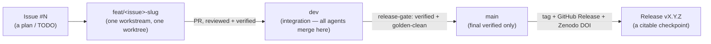

# Development-Workflow Upgrade — Proposal (for review, 2026-07-20)

**This is a PROPOSAL, not a change. Nothing here is implemented. It exists for you to read, edit, and
approve. Once you agree, we update `CLAUDE.md` / `AGENTS.md`, add the new rules to memory, and execute in
a dedicated branch.**

The ask: move from a single-user, branch-as-checkpoint habit to a full-GitHub research-software workflow —
Issues for plans, feature-branches → `dev` → verified `main`, Releases (with DOIs) as checkpoints, AGPL-3.0,
Zenodo archival. Below is what I found about the repo as it is today, then the proposed model, then the
decisions I need from you.

---

## 0 — WHAT THE REPO ACTUALLY IS TODAY (measured, not assumed)

| Fact | Value | Comment |
|---|---|---|
| Remote | `github.com/mulhamfetna/trading-strategy-finder` | recently moved from `molhamfetnah/...` — the old URL still redirects; **update the local remote** |
| Visibility | **PUBLIC** | ⚠️ a live trading strategy is world-readable — a deliberate decision to confirm |
| License | **none** | public + no license = legally "all rights reserved" but source is exposed. You want AGPL-3.0 |
| Description | empty | needs the research framing |
| Default branch | **`master`** | your mental model says "main". Rename is a one-liner |
| Issues | enabled | good — unused so far |
| Releases | **0** | the checkpoint mechanism you want, currently unused |
| Tags | 18 | mix of real milestones (`v4.2-wsg-...-winner`) and noise (`brainstorming`, `docs-pre-wipe`, `right-graphs-wrong-logs`) |
| Branches | **~40** | many are checkpoints (`v1.0-working`, `stable-v2`, `two-layers-time-capped`, `test-sample-last-week`, …) — exactly the clutter you described |
| **Files tracked in git** | **1,748** | the repo itself is SMALL and healthy |
| Files in the working tree | **132,227** | ⚠️ this is your "150k" — it is DATA / venvs / node_modules / artifacts, **not** git. Different problem |
| Secrets in git *history* | none found (initial scan) | needs a proper `gitleaks`/`trufflehog` pass to be certain |
| Secrets in the working *tree*, **un-ignored** | **5 files** | 🚨 `keys.env`, `login.txt`, `keypass.txt`, `SERVER_DETIALS.md`, `kw-full.ovpn` — one `git add -A` from committing to a public repo |

**The two reframings that matter:**
1. **The repo is not bloated — your disk is.** 1,748 tracked files is fine. The 132k is working-tree
   clutter that a `.gitignore` audit + a `data/` convention solves; it is not a git-history problem.
2. **This is not really single-user.** Multiple Claude agents already work in parallel on `research-*`
   branches merged into `dev`. The workflow must be **multi-agent-safe**, which is mostly about branch
   discipline and Issues-as-coordination — you already have the "one workstream = one branch = one
   worktree" rule; we formalize it.

---

## 1 — 🚨 SECURITY / HYGIENE (must happen first, before any workflow change)

Independent of everything else, and blocking:

1. **`.gitignore` the 5 secret files immediately** and move them out of the repo tree (to `~/.secrets/` or
   a `.env` outside the repo). A public repo with un-ignored secrets in its tree is a single-command leak.
2. **Run a real secret scan over full history** (`gitleaks detect` / `trufflehog git`). If anything is
   found in history, it needs history rewrite (`git filter-repo`) + credential rotation *before* we invite
   more eyes via Zenodo/DOI.
3. **Confirm the public/private decision (below).** If it stays public, treat the whole history as already
   disclosed and rotate anything that ever touched it.
4. **`.gitignore` audit** — data (`*.csv` bundles), `*.zip`, venvs, `node_modules`, PDFs, golden `*.pkl`
   caches. 14 zips and 43 csvs are currently tracked; decide which are genuine artifacts (release/Zenodo)
   vs accidental (drop from git).

---

## 2 — THE BRANCHING MODEL (your ask, formalized)

**Rules:**
- **`main`** (renamed from `master`) — only ever holds **verified** versions. Nothing lands on `main`
  except via a release-gate merge from `dev`. Protected branch (no direct pushes).
- **`dev`** — the integration branch. Every workstream merges here via PR. This is where the parallel
  agents already meet.
- **`feat/<issue-number>-<slug>`** — one branch per Issue/workstream, in its own worktree (your existing
  rule). Named after the Issue so the link is automatic. Merged to `dev` by PR, then the branch is deleted
  (the Issue + the merge commit are the durable record, not the branch).
- **Branch-per-checkpoint is retired.** "I want to save this state" is no longer a branch — it is a **tag +
  Release** (§3).

**Branch protection to set on GitHub:** `main` and `dev` require a PR; `main` additionally requires the
golden gate / test suite green (a CI check — §6).

---

## 3 — RELEASES REPLACE CHECKPOINT-BRANCHES (your core ask)

**The new checkpoint primitive is a GitHub Release, anchored on a tag, with full notes — never a branch.**

A Release is created (one-by-one, with full details) whenever we **agree and verify** on:
- a **milestone** (a workstream closed, a subsystem shipped),
- a **finding** worth freezing (a verdict, a discovery),
- a **new champion set** (only once verified — the "we agree on new champions" gate you named).

**Migration of the existing ~40 branches:**
| Bucket | Action |
|---|---|
| Real checkpoints (`v1.0-working`, `stable-v2`, `two-layers-time-capped`, `retuned-4h-champion-…`, `best-of-4h-…`, the `v4.x` approvals) | For each: create a **Release** from its tag (or mint a tag at its tip) with notes reconstructed from its commits → then **delete the branch**. **Tags are kept forever.** |
| Throwaway experiments (`test-sample-last-week`, `test-sample-last-three-months`, `right-graphs-wrong-logs`) | Tag if you want the pointer, else just delete. No Release. |
| Active workstreams (`dev`, `fundamental-analysis`, `research-*`, `study/kalman-*`) | **Keep** — these are live, not checkpoints |
| Noise tags (`brainstorming`, `docs-pre-wipe`) | Leave or prune — cosmetic |

**Result:** the branch list collapses from ~40 to the handful of *active* branches; every historical state
survives as a tag + a browsable, documented Release.

---

## 4 — ISSUES REPLACE TODO PLANS (your ask)

- **Every plan / TODO becomes a GitHub Issue.** The open threads currently living in
  `MASTER-STATUS PART 4` become issues on day one (champion re-optimization, risk-budget re-cut, gold
  forward-validation, the `.gitignore`/secrets cleanup, etc.).
- **Labels** carry the structure this project already has: `workstream:fundamentals`, `workstream:l2`,
  `workstream:optimizer`, `type:research`, `type:bug`, `type:infra`, `status:blocked`, `status:frozen`.
- **Milestones** (GitHub's, distinct from our release tags) group issues into the arcs
  (e.g. "Gap-aware fills", "Sizing").
- **Commits/PRs reference issues** (`Closes #12`) so the trail is automatic — an Issue's timeline becomes
  the workstream's history, replacing the hand-maintained MASTER-STATUS tables (which become a generated
  summary, not the source of truth).
- **Findings/verdicts** (like today's Asia-cell FLUKE) get filed as an Issue that is *closed with the
  verdict comment + a link to the report* — a permanent, searchable record.

---

## 5 — LICENSE, CITATION, DOI (your ask: AGPL-3.0 + Zenodo)

Handled via the **`research-publishing` skill** at implementation time. Contents:

- **`LICENSE`** — **AGPL-3.0** (strong copyleft; network-service derivatives must stay open — the right
  default for a strategy engine someone might run as a service). *Adding a license to an existing public
  repo is fine; there is nothing to relicense since there was none.*
- **`CITATION.cff`** — you as author, ORCID `0009-0006-4432-798X`, the contact/profile links from your
  global `CLAUDE.md`. Title + abstract framing it as the research it is.
- **`.zenodo.json`** — metadata for archival:
  - `upload_type: software` (it is runnable research code; Zenodo still mints a DOI and it is citable),
  - `keywords`: quantitative finance, algorithmic trading, backtesting, quantitative analysis, data science,
    extreme value theory, market microstructure, …
  - creators, license `AGPL-3.0`, the description you specify.
- **Zenodo ↔ GitHub integration** — switch the repo "on" in Zenodo, and **every published GitHub Release
  automatically gets its own DOI**, plus a **concept DOI** that always points to the latest. This is exactly
  the "DOI-stamped milestones" you want, with zero manual steps after setup.
- **`README` DOI badge** + a "How to cite" section.

**Research categorization** (for Zenodo/description): *"A reproducible quantitative-analysis research
codebase for futures trading-strategy discovery and validation — box-level signal engines, multi-objective
optimization, extreme-value risk modelling, and a discipline of pre-registered, power-analysed,
cross-instrument-replicated backtests."* — you edit to taste; this drives the repo description, the CFF
abstract, and the Zenodo record.

---

## 6 — CI / VERIFICATION GATE (the piece that makes "main = verified" real)

"`main` holds only verified versions" needs an automatic check, or it is just a promise:
- A **GitHub Action** runs the test suite + the golden gate on every PR to `dev` and `main`.
- `main` is **branch-protected** to require that check green. This is what mechanically prevents an
  unverified champion or a golden-breaking change from ever reaching the verified branch.
- (Optional, later) the Action can also run a fast subset of the causal-engine parity on champion changes.

---

## 7 — WHAT STAYS OUT OF GIT (the 132k-file answer)

- **Data** (`*.csv` price/box/1-second frames) → never in git. They live on the server + are **archived to
  Zenodo as a dataset DOI** if you want them citable. (This is the clean home for the 16-year frames.)
- **Bundles / zips / PDFs** → attached to the relevant **Release** (GitHub Releases hold binaries), not
  committed.
- **Golden `*.pkl` caches, venvs, node_modules** → gitignored (the `*.json`/`*.npz` golden *baselines*
  stay, as they already do — they are small and are the regression contract).

---

## 8 — DECISIONS I NEED FROM YOU (before implementing anything)

| # | Decision | Why it matters | My recommendation |
|---|---|---|---|
| **D1** | **PUBLIC or PRIVATE?** | A live, working trading strategy is currently world-readable. AGPL+Zenodo assumes open. But an *edge* loses value when public. | **Your call — this is the big one.** Common answer for tradeable research: **private repo now**, and open **specific published artifacts** (papers, methods, sanitized results) via Zenodo when you choose. AGPL still applies whenever you do open it. |
| **D2** | Rename `master` → **`main`**? | Matches your mental model; one command; updates all clones | **Yes** |
| **D3** | Zenodo DOI scope | Every release, or milestone releases only? | **Every published Release** (automatic; you control which tags become *published* releases vs drafts) |
| **D4** | Checkpoint-branch migration depth | Convert all to releases, or only the meaningful `v*` ones and delete the rest? | **Release the `v*`/named champions; delete the throwaway `test-sample-*` outright** |
| **D5** | Secrets | gitignore + move the 5 files out of the tree now | **Yes, immediately — independent of the rest** |
| **D6** | Do the secret-history scan + (if needed) rotation | Public repo hygiene | **Yes** |

**Nothing is executed until you answer these.** Once you do, the sequence is: (1) secrets + gitignore,
(2) secret scan, (3) license + CFF + Zenodo via the `research-publishing` skill, (4) rename + branch
protection + CI gate, (5) migrate checkpoint-branches → releases, (6) open the current threads as Issues,
(7) update `CLAUDE.md`/`AGENTS.md` + memory with the new rules.
