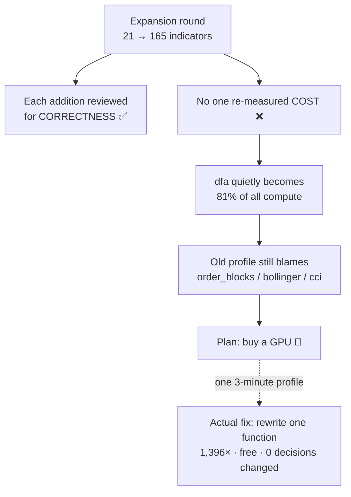

# Expansion-Round Playbook

**Read this BEFORE adding indicators, instruments, timeframes, or layers — and again when you finish.**
**Issue:** #57 · **Origin:** the `dfa` incident in #54 · **Status:** standing rules, not a one-off.

---

## 0. What an "expansion round" is, and why it has its own playbook

An **expansion round** is any change that makes the system *do more of the same thing*:

- adding indicators (21 → 165 is the one that bit us),
- onboarding an instrument (NQ → ES/GC/CL/NG/HG/…),
- adding a timeframe or a decision layer (L1 → L2, MTF fusion),
- widening a parameter grid on something that already exists.

Expansion rounds are dangerous in a specific, repeatable way: **each addition looks individually cheap,
nobody re-measures the whole, and the cost profile silently moves somewhere nobody is looking.** Feature
work has a natural verification gate (does it produce the right numbers?). Expansion has none for *cost*.

> **In one line:** correctness is tested on every PR; **cost is tested on no PR at all**. This playbook is
> that missing gate.

---

## 1. The incident this playbook exists to prevent

**What happened (#54).** The indicator library grew **21 → 165**. Nobody re-profiled. Eight months later
the optimizer spent **~98% of its wall-clock computing indicators**, and we set out to fix it with
exotic storage and a GPU.

**What was actually true, once measured:**

| Fact | Number |
|---|---|
| Share of ALL indicator compute spent in **one** indicator (`dfa`) | **81%** |
| Cost of a single `dfa` compute at its default `n=100` | **248 s** |
| Cost of a single `dfa` compute at grid-max `n=400` | **756 s — 12.6 minutes** |
| Cause | a triple-nested Python loop calling `np.polyfit` ~10⁸ times |
| Fix | closed-form linear detrend + Numba → **1,396×**, **zero** decision changes |
| Effect on the whole profile | **208 s → 40 s (5.1×)** on identical work |

**The three near-misses — each one is a rule below:**

1. **We nearly optimized from a stale report.** The existing performance report named
   `order_blocks`/`bollinger`/`cci`. All were already fixed or no longer dominant. It was written *before*
   the library tripled. Following it would have wasted the entire effort. → **Rule P1**
2. **We nearly bought hardware to fix a Python loop.** The plan of record was "GPU-first". A GPU would
   have delivered maybe 100×, at real cost, on a problem a one-function rewrite solved at 1,396× for
   free. → **Rule P9**
3. **We nearly built a cache that already existed, and nearly attempted one that was impossible.**
   Two levels of caching were already in the repo; and "pre-compute every combination" would have needed
   **3.9 PB** — 32,000× the server disk. Both were answerable by *reading and multiplying*, before any
   code. → **Rules P5, P10**



---

## 2. START-of-round checklist

Copy this into the round's tracking Issue and tick it before writing code.

- [ ] **Is the current performance profile still valid?** Find the newest profile artifact. If the library
      / instrument set / timeframe set changed since it was produced, it is **INVALID** — re-run it before
      trusting any statement about what is slow.
- [ ] **Record the "before" number.** One command, one artifact, committed
      (`optimize/perf/run_baseline.py` produces `baseline_<inst>_<tf>.json`). You cannot claim an
      improvement or detect a regression without it.
- [ ] **Know the amplification factor.** Indicators are computed on the **1-minute frame ≈ 486,969 bars**,
      not the decision frame (4h ≈ 2,119 bars). That is **~230×**. A "harmless" 1 ms per bar is **8
      minutes**. Do this multiplication *before* writing the indicator, not after.
- [ ] **Set a per-item cost budget.** State the number the round must not exceed (e.g. "no single
      indicator over 2 s per compute on the 1-minute frame at ANY point in its parameter grid").
- [ ] **If the round proposes storing/precomputing anything: multiply the grid out FIRST.** (§4, Rule P5.)
- [ ] **Deep-research pass** for genuinely new questions (AGENTS.md §5).

---

## 3. END-of-round checklist

- [ ] **Re-run the profile** and commit the "after" artifact next to the "before".
- [ ] **Publish the new top-10 cost table** — the hot list *changes* after every round; that table is the
      only thing the next round should trust.
- [ ] **Retire or date-stamp the old performance report.** Add a header line: *"Profile valid as of
      <date>, at <N> indicators / <M> instruments. Re-profile before using."* A stale perf report is
      worse than none, because it is confidently wrong.
- [ ] **Worst-case parameter check** — run it, do not eyeball it (§4, Rule P4). This is now one command
      and it covers the WHOLE registry, not just what you added:

      ```bash
      WSH_DATA_BASE=<data> python3 -m optimize.perf.bench_worstcase \
          --bars 20000 --budget-s 2.0 --reference ES
      ```

      It scans every registered indicator at defaults / all-min / all-max, projects to the full
      486,969-bar frame, and **exits non-zero if anything is over the budget**. Commit the JSON next to
      the previous round's. Standing budget: **no indicator over 2 s per compute at any point in its
      grid** (met at 0/165; the worst is `rsi_connors` at ~1.5 s).

      **`--reference` is not optional.** Without it the four cross-series indicators short-circuit on a
      missing `ref_close`, return instantly, and are reported at **0.00 s** — a pass meaning "never
      ran". That hid **27.4 s** of real cost through the whole of #62. The scan now **exits non-zero**
      rather than reporting a budget claim that silently excludes indicators (#74).
- [ ] **Update `vote_cache.CACHE_VERSION`** if any indicator's maths changed in a non-vote-identical way.
- [ ] **Record what moved** in the round's Issue: what got slower, what got faster, what is now #1.

---

## 4. The rules (each earned, with the incident behind it)

### Performance rules

| # | Rule | Why (the incident) |
|---|---|---|
| **P1** | **Never optimize from an old profile. Re-profile after every expansion round.** | The report in the repo blamed `order_blocks`/`bollinger`/`cci`; by then the real answer was `dfa` at 81%. The report was not wrong when written — it was wrong *by the time it was read*. |
| **P2** | **No heavyweight NumPy call inside a per-bar loop.** Banned in that position: `np.polyfit`, `np.corrcoef`, `np.linalg.*`, and `np.std`/`np.mean`/`np.max` over a slice. Use a closed form, a vectorized rolling op, or Numba. | `dfa` called `np.polyfit` (which builds a matrix and calls LAPACK) hundreds of millions of times to fit a straight line — something that has a closed form costing a few sums. Result: 756 s for one compute. `autocorr`, `hurst_exp`, `linreg_r2` still carry this pattern (#56). |
| **P3** | **Multiply by 486,969 before you commit.** Indicator cost is paid per **1-minute** bar (~230× the 4h decision frame), and `--ind-1min` is the production default. | Every per-bar cost in this system is amplified ~230×. This is why an indicator that feels instant in a notebook can cost 12 minutes in the sweep. |
| **P4** | **Profile the WORST CASE of the parameter grid, not the default.** | `dfa` cost 57 s at `n=20` and **756 s at `n=400` — 13× spread**. An indicator can look mid-table at defaults and be pathological at a grid edge the optimizer *will* eventually sample. Average-case profiling cannot see this. |
| **P5** | **Before proposing any "precompute / store everything" design, multiply the parameter grid out.** | Ours: ~4.0 **billion** combinations × ~1 MB ≈ **3.9 PB** for one instrument — 32,000× the disk. Two minutes of arithmetic killed an entire proposed architecture. |
| **P9** | **Measure before you buy hardware or adopt infrastructure.** Compare every proposal against the dumb controls: *the cache we already have* and *just add more CPU workers*. | We were one decision away from provisioning a GPU box to accelerate a problem that was an interpreted loop, not an arithmetic-throughput limit. The CPU rewrite beat the published GPU speed-ups for comparable work — at zero cost. |
| **P10** | **Read the code before building the thing you assume is missing.** | Two levels of caching (`core._VOTE_MEMO`, `optimize/vote_cache.py`) already existed and already worked. The proposed work was to build them again. |
| **P11** | **Rank by FUNCTION, not by indicator. The most expensive thing is often a shared leaf that no indicator's name mentions.** | #62: `_roll_max`/`_roll_min` — a five-line per-bar `np.max(slice)` loop with **19 call sites** — was on its own enough to put `ichimoku_cloud`, `ichimoku_tk_cross`, `chande_kroll` and `smi` over the 2 s budget. Four "slow indicators" were one slow primitive. Fixing it also halved the cost of a dozen indicators that were never on the list. |
| **P12** | **Before writing a clever algorithm, check whether the cost is the ALGORITHM or the INTERPRETER.** Ranked O(N·n) work at 486,969 bars is ~10⁸ Python-level steps; a JIT of the identical loop is often the whole fix. | #62: 17 indicators went under budget with **no algorithmic change at all** except `_roll_max`/`_roll_min` (deque, O(N)) and a trig lookup table in `sinewave`. The rest were the same arithmetic, compiled. Contrast #54, where `dfa` genuinely needed a closed form — the tell is whether the per-bar work is heavyweight (`polyfit`) or just numerous. |

### Correctness-under-optimization rules

| # | Rule | Why |
|---|---|---|
| **C1** | **Define the parity contract BEFORE optimizing, and make it the weakest true statement.** Usually the contract is the **discretized decision** (the vote), not raw float equality. | `np.polyfit` goes through LAPACK, so no rewrite can be bit-identical in the last float digits. Demanding float-identity would have blocked a safe 1,396× win; demanding *nothing* would have risked silently changing trades. The right contract — "the veto decision is identical across every threshold in the searched grid" — was both provable and sufficient. |
| **C2** | **Keep the original implementation verbatim as a `*_reference` oracle. Never delete it.** | `dfa_reference` is now the thing every future change is tested against. Deleting the slow version destroys the only ground truth you have. |
| **C3** | **Prove parity on REAL data across the WHOLE searched grid, not on a toy example at one setting.** | Synthetic tests passed first, but the claim that mattered was *zero* differing decisions over the real 486,969-bar series at every threshold from 0.30 to 0.70. |
| **C4** | **An optional dependency must fall back to the reference, never to a different answer.** | If `numba` is absent, `dfa()` returns the original implementation's result. A missing optional package can slow things down; it must never change a number. |
| **C5** | **Attribute test failures with a CONTROL run before claiming "pre-existing".** | The suite had 25 failures. Rather than assume they predated the change, the same suite was run on an identical tree with the original code: same 25, empty diff both directions ⇒ provably zero regressions. Assuming would have been indistinguishable from hiding a real break. |
| **C6** | **Bump `vote_cache.CACHE_VERSION` on any non-vote-identical maths change.** | The disk cache keys on *parameters*, not on the implementation. Change an indicator's maths without bumping the version and every worker silently loads arrays computed by the old code. |
| **C7** | **When you adopt a champion or move a default, re-baseline the tests that pin it — in the SAME change.** | #66: the 2026-07-22 gap-fill adoption moved the 4h champion (214→277 trades) and the L1 default (lean→champion). ~20 tests pinned the old values and quietly failed for months, so "the suite is red" stopped meaning anything. An adoption is not finished until the pins move with it. |
| **C8** | **A pinned number is meaningless without knowing WHICH path produced it. Verify per assertion — never `sed` across a directory.** | #66: a blanket `255 → 277` replace broke three *passing* tests, because `run_l1_cached()` serves the frozen **lean** oracle (255) while `run_causal(l1_default_params())` serves the **champion** (277). Two different L1s, one number. |
| **C9** | **"Frozen" anchors are frozen only against the ENGINE that produced them.** | #66: gap-aware fills moved the frozen lean anchor's P/L $149,989 → $154,646 while its trade count and DD held. An engine change re-bases every anchor, including the ones named "frozen". |
| **C10** | **Run the parity harness against ITSELF before believing anything it says.** A comparison of a function to itself must report exactly zero differences; if it does not, you are debugging your harness, not your code. | #62: the harness memoized the reference keyed on the array's *data pointer*. A freed temporary got reallocated at the same address, the memo served a stale array, and it reported **19,146 phantom `smi` vote flips**. A self-control phase (`bench_budget.py --phases control`) caught it in one run; without it the next hour goes into "debugging" correct code. |
| **C11** | **A gate that runs where the accelerator is absent tests nothing. Force the fast path on in the tests.** | #62: CI has no Numba, so every dispatcher fell back to its own reference and the parity tests compared the reference to itself — 59 green assertions proving nothing. `test_budget_accel_parity.py` monkeypatches `_HAVE_NUMBA = True`, which turns `njit` into a no-op and runs the **kernel body in pure Python**, so the logic is checked in both environments. It also carries a deliberately-wrong-implementation test, so a vacuous gate fails loudly. |
| **C12** | **Patch by IDENTITY across every module, not by name in one.** | #62: leaves are bound at import time (`from ..classic import _roll_max`), so swapping `classic._roll_max` leaves `calc/levels.py` still pointing at the fast one. The harness scans every loaded `indicators.*` module for attributes that *are* the target object, and reports "NOTHING WAS SWAPPED" when a swap matched nothing. |
| **C13** | **A green local suite does not mean the kernel runs. Run the accelerated path on the box that HAS the accelerator before believing anything.** | #62: 84 local tests passed and the deploy immediately **SEGFAULTED** — a *recursive* `@njit` function called from inside another kernel crashes under Numba 0.65. Locally `njit` is a no-op decorator, so the recursion was plain Python and worked perfectly. The fix (an explicit-stack emulation) is fine; the lesson is that the local run and the server run test different programs. |
| **C14** | **When a reduction feeds a comparison, sum the way numpy sums.** `pw_sum` in `indicators/_numba.py` reproduces numpy's pairwise order bit-for-bit. | #62: a plain left-to-right window sum is *equally accurate* and *differently rounded*. That is invisible until the value is compared to something: `ou_halflife` vetoes on `b >= 0` and `lsma`/`frama` vote `sign(close − line)`. It flipped 1 real bar in `ou_halflife` and 2 in `frama` on the 486,969-bar frame. Matching numpy's order removed the entire class instead of measuring it away one indicator at a time. |
| **C15** | **If a transcendental sits inside a loop-carried recurrence you cannot make it bit-identical — so measure the MARGIN, not just the flip count.** | #62: `frama`'s `log`/`exp` were hoistable into numpy and it became bit-identical. `dominant_cycle`/`mama_fama`/`hilbert_sinewave`'s `arctan`/`sin` are not — Numba's libm differs from numpy's by ~1 ULP. "Zero flips" alone would be luck; the shippable claim is that the closest any bar comes to its decision boundary is **3.5–15 million times** the observed drift (`bench_budget.py --phases exactness`). |
| **C16** | **Check a result file's TIMESTAMP before quoting it. A log is not evidence of the code you think wrote it.** | #62: a run crashed at step 1 of 4 but its last step still completed, leaving a **complete, green golden-gate log** on disk from the broken build. The next poll read it as the current result. Only `stat` on the file, compared against the run actually in progress, caught it. Applies to every re-used artifact path. |
| **C17** | **Never let a COST subset leak into a CORRECTNESS gate. A parity claim is only as big as the data it ran on — print the bar count next to the verdict.** | #74: the parity phase reused the cost scan's 20,000-bar context while its own log said "on the real 1-minute frame". It reported `pca_factor` drift 3e-14 and **0 flips**. Rebuilt on the full 486,969 bars, the same code showed drift **0.156** and **12 flipped stances**. The harness was not lying about the numbers, only about the population. |
| **C18** | **When an accelerator replaces a numerically-delicate library call, gate the fallback on the CONDITION NUMBER, not on the output looking small.** | #74: `pca_factor`'s per-bar LAPACK `eigh` was replaced with a closed-form 2×2 solve. Three *independent* failure modes, each found only by measuring: the score sits on the sign boundary; the two eigenvalues nearly coincide so the eigenvector is undefined (drift **1.33** on a matrix whose score was nowhere near zero); and the principal LOADING is near zero so `sign(pc1[0])` is noise (a **well-conditioned** matrix, gap/trace = 0.14, came out exactly negated). Guarding only the output magnitude caught the first and missed the other two. Falling back to the reference on any of the three makes disagreement *impossible* rather than merely unobserved — and it fired on 0.4% of bars, so it was free. |

---

## 5. Red flags — grep for these in any new indicator

If a review turns up any of these, ask for a measurement before approving:

```python
for i in range(n, N):            # a Python loop over the FULL series ...
    win = x[i-n:i]
    np.polyfit(...)              # ❌ P2 — least-squares solve per bar
    np.corrcoef(...)             # ❌ P2 — covariance matrix per bar
    np.linalg.lstsq(...)         # ❌ P2
    np.std(win) / np.mean(win)   # ❌ P2 — use a rolling/cumsum form
```

**Cheap greps for a review or CI step:**

```bash
# heavyweight solvers anywhere in the indicator tree
grep -rnE "np\.(polyfit|corrcoef|linalg\.|cov)\(" indicators/ --include='*.py'

# the shape that actually hurts: a full-series per-bar loop
grep -rnE "for [a-z]+ in range\(.*len\(|for [a-z]+ in range\(n" indicators/ --include='*.py'
```

**What that grep returns today (2026-07-28, after #62) — your baseline for "expected vs new":**

```
indicators/calc/quant.py:~61  np.polyfit(t, seg, 1)          # inside dfa_reference       — EXPECTED (oracle, not called)
indicators/calc/quant.py:~67  np.polyfit(np.log(ls), ...)    # inside dfa_reference       — EXPECTED (oracle, not called)
indicators/calc/quant.py:~179 np.corrcoef(a, b)[0, 1]        # inside autocorr_reference  — EXPECTED (oracle, not called)
```

**Three hits, all three deliberate — every one is inside a kept `*_reference` oracle, none on a live
path.** If a round adds a fourth, that is the thing to measure.

**The blind spot, and how it was closed (#74).** `bench_worstcase.py` built its context from ONE
instrument, so the four cross-series indicators (`rolling_corr`, `rolling_beta`, `cointegration`,
`pca_factor` in `indicators/calc/xseries.py`) short-circuited on a missing reference and timed at
**0.00 s** — a pass meaning "never ran". Measured properly they were **27.4 s**, all four over budget.
The scan now takes `--reference` and **exits non-zero if any indicator was not actually measured**, so a
budget claim can no longer silently exclude anything. Always pass it.

> **The general rule: a 0.00 s result is a red flag, not a pass.** Ask what the indicator returned, not
> just how long it took. An indicator that emitted nothing may have short-circuited on a missing input
> rather than run fast — and the two are indistinguishable from the clock alone.

**The honest counter-rule:** a per-bar loop is *not* automatically wrong — some indicators are genuinely
sequential (order blocks, structure trend, anything carrying state). The rule is not "no loops"; it is
**"no heavyweight per-bar call that has a closed form"**, and **"if it must loop, compile it"** (Numba),
**"and measure it"**.

---

## 6. Worked example — how `dfa` would have been caught in 90 seconds

Had this playbook existed when `dfa` was added:

1. **START checklist, amplification (P3):** "this computes a fit per segment per scale per bar; on
   486,969 bars that is ~10⁸ fits" → flagged before merge.
2. **Red-flag grep (P2):** `np.polyfit` inside `for i in range(...)` → automatic review stop.
3. **Worst-case parameter check (P4):** time it at `n=400`, not `n=100` → **756 s**, instantly over any
   sane budget.
4. **Cost budget:** "no indicator over 2 s per compute" → rejected, sent back for a closed-form version.

Total cost of catching it: **one timing run.** Actual cost of missing it: **eight months of every sweep
paying up to 12.6 minutes per compute**, a stale performance report, and a near-miss hardware purchase.

---

## 7. The one-sentence version

> **Correctness is gated on every PR; cost is gated on none — so at the start of every expansion round,
> re-measure before you trust, multiply before you store, and profile before you buy.**

---

## 8. See also

- `subprojects/Parametric-Indicators/optimize/REPORT_indicator_cache_acceleration.md` — the full #54
  investigation and every number quoted here.
- `subprojects/Parametric-Indicators/docs/PRIOR_ART_indicator_caching_gpu.md` — how vectorbt, Qlib,
  talipp/wickra and RAPIDS handle the same problems.
- `AGENTS.md` §5 (research discipline) and §9 (starter checklist) — this playbook is the **cost** analogue
  of those **correctness** rules.
- Open follow-ups: **#56** (is the post-`dfa` tail really diffuse? worst-case parameter sweep) ·
  **#58** (cache substrate + cache-level re-keying, measured rather than reasoned).
