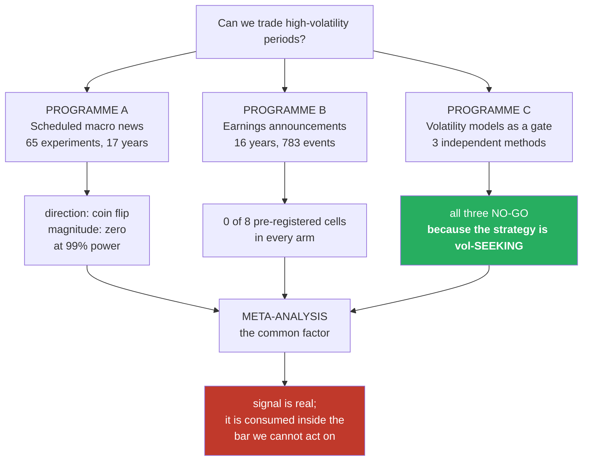
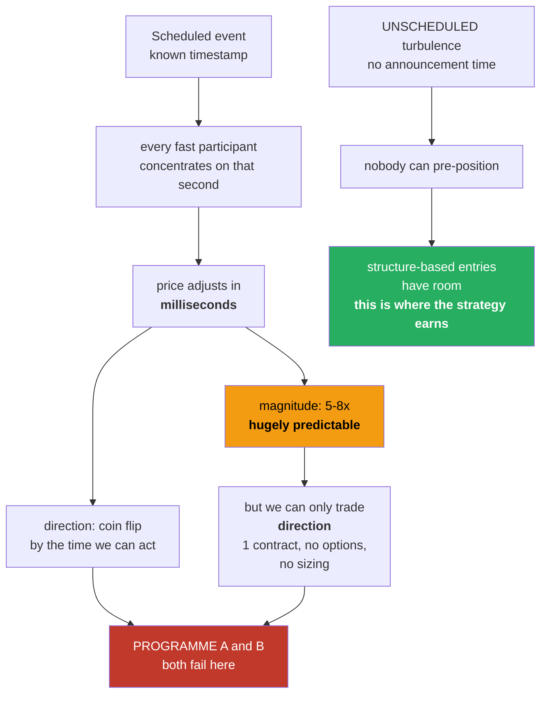

# Trading high volatility: why two programmes failed, and what that actually proves

**A meta-study of every experiment run across two independent attempts to build a trading system for
high-volatility periods — scheduled macro news (2026-07) and earnings announcements (2026-08).**

Nothing in this document is a new experiment. Every number is quoted from a completed run whose report
already exists in this repository. Where a claim is an interpretation rather than a measurement, it is
labelled as such.

---

# PART 0 — THE SHORT ANSWER

**The question:** two programmes, same category, both failed. Is high volatility impossible to predict,
or is our system structurally aimed somewhere else so that it never meets these structures?

**It is neither, exactly — and the evidence points somewhere more specific and more useful.**

### 1. It is emphatically NOT unpredictable

| what we found | strength |
|---|---|
| Gold moves **inverse** to macro surprises | Spearman **−0.193**, p<0.00001; sign-hit **39.5%** against a 49.0%±1.7% null = **5.5σ**; negative in **15 of 16 years** |
| The macro release-bar **jump** | **−$132.39 per event, t = +7.13** |
| Earnings-minute **volatility** | **4.98×** a matched normal minute |

These are among the strongest signals this project has ever measured, at 99% power over 17 years.

### 2. The failure is CAPTURE, not prediction — and it is measured, not inferred

The decisive number in the whole programme:

```
Gold, macro release:   the jump itself          −$132.39   t = +7.13   ← enormous, real
                       everything we could act on  +$5.37   t =  0.52   ← noise
```

**$132 of the $137 total reaction happens inside the release minute.** The published earnings literature
says the same from a different angle: price discovery completes in **milliseconds to seconds**, and a
**5-second delay alone** makes the profit insignificant.

The signal is real, and it is finished before an order can exist.

### 3. We keep predicting the half we cannot monetise

What is hugely predictable at these events is **magnitude**. What our system needs is **direction**.
Magnitude is monetised through **options** or **position sizing**. We have neither: futures only,
**one contract, always, with no sizing layer in the engine**. So even a perfect volatility forecast has
no route into profit and loss.

### 4. The system is not missing high volatility. It already lives there.

Three independent methods — TimesFM, Chronos-2, and an HMM/Jump model — all concluded the deployed
strategy is **volatility-SEEKING**: its edge is strongest in the most turbulent regimes, and gating it
on volatility **hurts**.

> **The distinction is not volatile versus calm. It is SCHEDULED versus UNSCHEDULED.**
>
> Both failures were on scheduled events. A scheduled event has a published timestamp, so every fast
> participant concentrates on it and the price adjusts in milliseconds. Unscheduled turbulence has no
> announcement time — nobody can pre-position — and that is where the strategy actually earns.

⚠️ **This last point is an interpretation of the pattern, not a tested result.** §7 sets out the
experiment that would settle it.

### 5. The one positive result in the entire programme was sizing, not entry

A regime-based size ramp (calm 0.5× → turbulent 1.5×) improved return/drawdown **5.52 → 5.90**, beat
**95%** of random multiplier assignments, and helped all three years. Classic inverse-volatility
targeting **hurt** (4.06). For a volatility-seeking strategy, **size WITH volatility.**

That is volatility predictability converting into money — and it is blocked by an architectural fact,
not a research one.

---

# PART 1 — WHAT WAS ACTUALLY ATTEMPTED



---

# PART 2 — PROGRAMME A: SCHEDULED MACRO NEWS

**Branch `fundamental-analysis`, 2026-07-11 → 07-19. 65 logged experiments. Total spend: $0.**

Question: do scheduled US economic releases — payrolls, CPI, PPI, retail sales, PCE — tell you which way
the Nasdaq goes, how far, for how long, or in what shape?

## 2.1 The headline, and the retraction that made it worth having

This programme was **closed once on a wrong verdict and re-opened**. That episode is the reason the
final answer can be believed.

| | first attempt (RETRACTED) | after more data (EARNED) |
|---|---|---|
| price history | 16 months | **17 years** (2010-06 → 2026-07) |
| 1-minute bars | 486,969 | **5,452,534** |
| releases priced | 52–117 | **871** |
| chance of detecting a tradeable effect | **12–18%** ❌ | **99.4%** ✅ |
| verdict | *"we cannot tell"* | **"scheduled US macro is priced in"** |

> A null from a blind instrument means nothing. A null from a 99%-powered instrument is a finding.
> Same sentence, completely different standing.

## 2.2 Result 1 — DIRECTION: four coin flips (n = 870)

| held | correlation with surprise | sign-hit rate | shuffled baseline | p |
|---|---:|---:|---:|---:|
| 5 min | **−0.004** | **49.3%** | 0.019 ± 0.028 | 0.807 |
| 15 min | **−0.011** | **49.7%** | 0.020 ± 0.026 | 0.549 |
| 30 min | **−0.009** | **50.6%** | 0.021 ± 0.028 | 0.595 |
| 60 min | **+0.024** | **51.7%** | 0.022 ± 0.028 | 0.291 |

A coin gets 50%. **The real signal is weaker than randomly-shuffled noise** — the shuffled baseline
(~0.020) exceeds three of the four real correlations.

What died with it: a **−0.322** correlation that had looked significant at n=52, and a **−0.432** in
2025 with a persuasive economic story attached ("good news is bad news, the Fed stays hawkish"). At
n=870 it is **−0.004**.

## 2.3 Result 2 — MAGNITUDE: how +0.187 became −0.018

This was the survivor, and it mattered most, because magnitude is the one thing efficient markets do
*not* forbid — the market can price the expected value perfectly and still not know how big the shock
will be. If it had held, it is a volatility trade needing no directional call at all.

| measure | at n = 117 | **at n = 871** |
|---|---|---|
| \|move\| at +5 min | **+0.187** (p = 0.044) ⭐ | **−0.018** (p = 0.347) |

### Why it looked real: the luckiest year in seventeen

Correlation between |surprise| and |move|, computed separately per year:

| year | n | corr | | year | n | corr |
|---|---:|---:|---|---|---:|---:|
| 2010 | 24 | +0.105 | | 2019 | 59 | −0.069 |
| 2011 | 46 | −0.252 | | 2020 | 61 | −0.096 |
| 2012 | 46 | −0.119 | | 2021 | 59 | −0.065 |
| 2013 | 44 | −0.092 | | 2022 | 63 | +0.167 |
| 2014 | 51 | +0.242 | | 2023 | 58 | −0.003 |
| 2015 | 57 | −0.112 | | 2024 | 60 | +0.021 |
| 2016 | 51 | +0.111 | | **2025** | **51** | **+0.281** 🔴 |
| 2017 | 52 | +0.077 | | 2026 | 31 | +0.029 |
| 2018 | 58 | +0.231 | | | | |

- years positive / negative: **9 / 8** — a coin flip
- **17-year mean: +0.027** — nothing
- **2025 was the single highest of seventeen years — and 2025 is the year our data happened to cover**

The split that settles it:

| window | n | corr | power |
|---|---:|---:|---:|
| 2024–2026 (what we had tested) | 142 | **+0.111** | **26%** ❌ blind |
| 2010–2023 (newly added) | **729** | **−0.006** | **100%** ✅ |

Across fourteen years where we can see essentially anything, the effect is **zero**. It exists only in
the narrow window where we were blind. **That is not a regime. That is where flukes live.**

## 2.4 Results 3 & 4 — persistence and shape

| test | result |
|---|---|
| persistence (does the initial move hold?) | **48.2%** — coin flip |
| shape (does the surprise pick a path archetype?) | **p = 0.880** — null |

## 2.5 The gold replication — and the discovery inside it

**n = 866 releases, 99% power, on an instrument with a completely different economic driver.**

| test | NQ (n=871) | GC (n=866) | verdict |
|---|---|---|---|
| direction @ +5m | −0.004 (p=0.812) | −0.018 (p=0.432) | both null |
| direction @ +30m | −0.009 (p=0.583) | +0.011 (p=0.635) | both null |
| magnitude @ +5m | −0.018 (p=0.347) | −0.036 (p=0.110) | both null |
| magnitude → path range | −0.015 (p=0.712) | +0.013 (p=0.649) | both null |
| persistence | 48.2% | 46.9% | both coin flips |
| shape | p=0.880 | p=0.866 | both null |

**The verdict replicates.** It is no longer an NQ quirk.

### ⭐ But a number looked wrong, and chasing it found something real

Gold's sign-hit rate was **39.5%** where a coin flip is 50%.

| | |
|---|---|
| sign-hit | **39.5%** vs a shuffle null of **49.0% ± 1.7%** = **5.5σ** |
| Pearson correlation | **−0.012, p=0.73** — sees nothing, because gold's fat tails swamp it |
| **Spearman (rank) correlation** | **−0.193, p < 0.00001** |
| consistency | negative in **15 of 16 years**; significant in both halves (−0.274 / −0.124) |
| NQ control | −0.007 — null, as it should be |
| economics | textbook: strong data → higher real yields → gold down |

**A methodological lesson with teeth: Pearson was blind and Spearman was not.** On fat-tailed data,
rank correlation must be run alongside Pearson, or a 5.5σ effect is invisible.

### And the decomposition that explains everything

| component | value | t |
|---|---:|---:|
| the release-minute **jump** | **−$132.39** | **+7.13** |
| **everything after the print** (what we could act on) | **+$5.37** | **0.52** |

**$132 of the $137 total reaction is inside the release minute**, and it turns negative at longer holds.

> The Nasdaq genuinely does not react predictably. **Gold reacts hard, coherently, and prices the entire
> reaction inside 60 seconds.** Two opposite routes to the same unusable conclusion.

## 2.6 The stop-loss thread — the one that could have cut the other way

Chased to the bottom at 1-second resolution.

| # | finding | result |
|---|---|---|
| 56 | giveback | **158 of 373 losers (42%) were once +20 points up** — **$145,640** given back |
| 57 | winner heat | median **11.2**, 99th pct **37.9** (stop sits at 40) |
| 58 | loser heat | median **41.5** |
| 59 | separability | P(winner heat > loser heat) = **0.014** |
| 60 | ignore the stop (3× floor) | **46.8% recovered to target, +$20,000** ⭐ looked real |
| 61 | **sweep the floor** | recovery is **gambler's ruin at every floor**; dev **+0.34 pp** ❌ **DEAD** |
| 62 | post-stop drift, 7 horizons | **all negative** (−0.02 to −5.31 pts) |
| 63 | the skew | **median POSITIVE, mean NEGATIVE** 🔴 the trap |
| 64 | max-favourable-excursion as predictor | 43.9 / 44.2 / 55.8 / 46.3% — no monotone relationship |
| — | **1-second re-test** | **94% of stop-outs are genuine sub-second sweeps** — and **the verdict stands anyway** |

The sweeps are real. The money is not. Experiment 63 is the trap in one line: the median outcome of
ignoring a stop is positive, and the mean is negative. A strategy that is usually right and occasionally
ruinous is not a strategy.

## 2.7 The context-dependence follow-up (NEWS-CTX-01)

Asked whether the pooled null hides two opposite effects cancelling out — the same announcement pushing
one way in one market state and the other way in another.

**One of twelve tests survived both dumb controls, and it was the theory-backed one.** It then failed the
pre-registered temporal-stability gate: **+0.236 in the second half of the data, −0.112 in the first.**
By the rule fixed before looking, that is a fluke. **Pooled null confirmed.**

## 2.8 Complete experiment index — Programme A (65 trials)

| group | # | outcome |
|---|---|---|
| Data acquisition | 1–8 | BLS blocked (403); FRED/BEA/Fed routes found; 177-event calendar built |
| Verification | 9–15 | timezone confirmed US-Eastern; **volatility 8.32× at offset 0**; **pre-release the market goes QUIET (0.78× at −2 min)**; **no lockup leak** |
| Engine safety | 16–21 | golden 6/6 byte-identical throughout; 11/11 engine parity; 16/16 unit tests |
| Head 1 — news veto | 22–27 | **DEAD.** p = 0.548 / 0.290 / 0.290; veto fires on only 3–4% of trades; flat for 77% of releases; **4h bars cannot even see 08:30 — 88% of events invisible** |
| Head 2 — trade the reaction | 28–29 | **DEAD.** 0 of 30 cells significant (1.5 expected by luck); the "$72,170 fade edge" **reproduced by fakes** — ordinary mean-reversion |
| Head 3 — trade the content | 30–32 | **DEAD.** in-sample −0.322 → out-of-sample sign **flipped 2 of 4** |
| Robustness, 9 markets | 33–38 | equity bloc correlation **0.95**; **effective markets = 3.2, not 9**; 0 of 36 survive Bonferroni |
| The pattern (n=52) | 39–41 | all inconclusive — later shown to be the underpowered window |
| 🚨 **Power analysis** | 42–45 | **12% power. Needed 647 events, had 52. VERDICT RETRACTED**, 4 artifacts corrected |
| Extended (n=117) | 46–50 | magnitude significant at +0.187 ⭐ — later killed at n=871 |
| Stop-loss tracker | 51–55 | `reduceat` batch implementation, +14.6% CPU, 0% when off; **one benchmark was self-inflicted garbage (load average 49–53)** |
| Stop-loss findings | 56–65 | see §2.6 |

**Programme A verdict: scheduled US macro is priced in. Measured at 99% power on two instruments.**

---

# PART 3 — PROGRAMME B: EARNINGS ANNOUNCEMENTS

**Worktree `legacy18`, 2026-08-04 → 08-06. Issues #109–#113. Total spend: $0.**

Question: do earnings announcements by the largest Nasdaq companies move the Nasdaq price in a way we
can predict or trade?

## 3.1 Stage 1 — building the instrument (#110)

783 earnings events, 12 companies, 2010-06 → 2026-07, timestamped **to the second** in the same clock
the price data uses.

**Eleven silent data defects had to be found and fixed.** Every one produced plausible-looking output
with no error message. Listed in full because the reliability of everything downstream rests on them:

| # | defect | consequence if missed |
|---|---|---|
| 1 | **EDGAR's JSON timestamps are inconsistent** — UTC for some filers, US-Eastern mislabelled as UTC for others | 22 events placed **4–5 hours wrong**, into the wrong trading session |
| 2 | Applied Materials filed a quarter under **Item 2.01** instead of 2.02 | a whole quarter silently deleted |
| 3 | **Tesla files Item 2.02 for delivery reports too** | 44 non-earnings events counted as earnings |
| 4 | Foreign issuers file **Form 6-K** with no item codes | ASML unclassifiable by metadata |
| 5 | I read EDGAR's **index pages** as if they were filings | **Lam Research silently zeroed, 11 → 0** |
| 6 | SpaceX has **no earnings history** despite 3.73% index weight | a phantom company in the universe |
| 7 | **Corporate reorganisations change the CIK** | GOOGL lost 2010–2015, AVGO lost 2010–2018 (~52 events, all early-era) |
| 8 | **Intel files the same earnings twice**, the duplicate dated the next morning | double-count **and** a wrong announcement time |
| 9 | Two Tesla misclassifications (threshold too strict; delivery markers outranking earnings) | 11 real earnings lost |
| 10 | A single socket timeout killed a multi-hour job | silent partial data |
| 11 | **`-index-headers.html` returns 404 for filings before ~2013** | **26% of the 16-year set** fell back to the untrusted timestamp |

Defects **7 and 11 could not appear at all** in the 2.4-year pilot — they only exist once history is
extended. Both were caught by the **time-of-day stability check**, not by inspection: a company that
announces on a schedule has a tight release time, so a median of 12:03 with a ±60-minute spread is a
broken pipeline, not a strange company.

### Verification: five independent checks, all passed

| check | result |
|---|---|
| structural (duplicates, cadence, period alignment) | 0 duplicates; **19/19** companies on regular quarterly cadence |
| the filing's own prose vs our timestamp | **43/43 agree (100%)** |
| price-tape alignment (falsification only) | **3.05×** normal volatility at the announcement minute vs **~1.00×** at ±1h/±4h/±5h |
| classification audit (random sample of 12) | clean |
| timestamp re-fetch from a different EDGAR endpoint | **60/60 identical** |

⚠️ Two of these checks were **wrong on first run** and are recorded as such. One was reading Apple's
*dividend payable* date and produced a confident-looking "67% agreement" while measuring the wrong
sentence entirely. The other compared 06:00 pre-market events against an all-hours baseline, making them
look like a 1.06× non-event; time-of-day matched, the same events read 1.36×.

> **Carry forward: the baseline must be time-of-day matched, or every pre-market event is understated.**

### An external limit, measured not assumed

Criterion C3 — an independent source agreeing to within 60 seconds — **could not be run**. No free vendor
publishes announcement times:

| Nasdaq API `time` field | rows | share |
|---|---:|---:|
| `time-not-supplied` | 18,657 | **99.3%** |
| `time-pre-market` | 68 | 0.4% |
| `time-after-hours` | 61 | 0.3% |

Scraping company IR sites was tested rather than dismissed: **4 of 19** publish machine-readable clock
times, and Apple's field is a *modification* timestamp that bulk site republishes overwrite — so the
signal **degrades with age**, backwards from what a historical study needs.

But it found something: comparing those 4 companies' own sites to our filing times measured the
**announcement-versus-filing gap** directly.

| company | its own IR site | our EDGAR time | gap |
|---|---|---|---|
| AMD | 16:15:00 every quarter | 16:16–16:17 | **+91 s** |
| **Intel** | 16:01:00 every quarter | 16:04–16:13 | **+404 s ≈ 7 min** |

And the **price tape**, which has no connection to either, agreed:

| company | IR-site gap | tape volatility peak | ratio at our timestamp |
|---|---|---|---|
| AAPL | publishes no times | **+0 min** | 6.95× |
| AMD | +91 s | **−1 min** | 2.99× |
| **INTC** | +404 s | **−7 min** ✓✓ exact agreement | **1.32×** |

Three unconnected sources triangulating. At Intel's recorded timestamp you sample a nearly quiet minute
(1.32×) and miss the real event at 3.22×.

## 3.2 Stage 2 — power analysis, run BEFORE searching (#111)

The project's own history is the reason this came second and not last: a sibling programme ran
4,000–47,100 optimiser trials against a sample supporting **~5** independent ones, and 1 of 8
pre-registered criteria passed.

### Effective sample size depends on the horizon, not the event list

| horizon | 1 min | 5 min | 15 min | 30 min | 60 min |
|---|---:|---:|---:|---:|---:|
| **effective n** | 113 | 104 | 94 | 85 | **83** |

Two companies reporting 30 minutes apart are two observations at a 5-minute horizon and **one** at a
60-minute horizon. Two independent methods agreed exactly at 60 minutes: gap-collapse **83**, distinct
announcement days **83**.

### What the moves look like (NQ index points, 116 events)

| window | mean signed | SD | mean absolute | worst | best |
|---|---:|---:|---:|---:|---:|
| 1 min | +2.86 | 26.21 | **16.95** | −84.5 | +128.5 |
| 5 min | +2.47 | 40.28 | **26.78** | −153.8 | +155.8 |
| 60 min | +19.02 | 93.49 | **68.20** | −203.5 | +350.0 |

At $20/point the average 5-minute move is **$536 per contract**, worst −$3,076, best +$3,116.

### ⚠️ The framing error I made, and corrected

My first analysis compared the minimum detectable effect ($138+) against round-trip cost ($9.50) and
called it good news — *"any detectable edge would clear costs."* **That is the wrong comparison.** The
question is not whether a detectable edge would pay; it is whether an edge that large could exist.

Reframed as the share of the average move a rule must convert into signed profit:

| window | share needed | **implied directional accuracy** |
|---|---:|---:|
| 1 min | 40.7% | **70.4%** |
| 5 min | 41.3% | **70.7%** |
| 60 min | 42.2% | **71.1%** |

> **A rule must call direction correctly ~71% of the time to be detectable.** Remarkably constant across
> every horizon. For a liquid, fully-scheduled event that is not plausible.

### The multiple-testing budget

Using Bailey, Borwein, López de Prado & Zhu (2014) Prop. 1 — verified 3-for-3 against the authors' own
worked examples — a search of N independent approaches finds, **from pure noise**, a best result of
about E[max_N]:

| accuracy | \|t\| | **approaches affordable** |
|---:|---:|---:|
| 55% | 0.68 | **2** |
| 60% | 1.36 | **6** |
| 70% | 2.71 | 169 |
| 75% | 3.39 | 1,619 |

**"Try 2,000 approaches" is only justified if the edge is already ~75% accurate** — in which case you
would not need 2,000 attempts to find it. Realistic budget: **2 to 6.**

### The dumb control — separating the two questions cleanly

**(a) size** — announcement minutes vs matched non-announcement minutes:

| window | real | control | **ratio** |
|---|---:|---:|---:|
| 1 min | 16.95 | 3.41 | **4.98×** |
| 5 min | 26.78 | 8.40 | **3.19×** |
| 15 min | 42.22 | 17.47 | 2.42× |
| 60 min | 68.20 | 55.83 | **1.22×** |

**Unambiguous — and it decays fast.** Whatever is tradeable lives in the first **1–15 minutes**.

**(b) direction** — the confound check that mattered: NQ rose over 2024–2026, so any long-measured
window shows positive drift.

| window | real mean signed | \|t\| | control mean signed |
|---|---:|---:|---:|
| 1 min | +2.86 | 1.16 | −0.25 |
| 30 min | +13.03 | 1.83 | −2.96 |
| 60 min | +19.02 | 1.85 | −6.90 |

**No window reaches significance.** Without the time-of-day-matched control, the market's own trend
would have been reported as a discovery.

### The projection that set the next step

Minimum detectable effect shrinks as 1/√n. Only more events change it.

| history | n_eff | **accuracy needed** | |
|---|---:|---:|---|
| 2.4 years | 104 | **70.7%** | ❌ implausible |
| 10 years | 343 | 61.4% | ✅ plausible |
| **16 years** | **550** | **59.0%** | ✅ plausible |

## 3.3 Stage 3 — prior art, and the plan it overturned (#112)

**Christensen, Timmermann & Veliyev (2025), *Journal of Financial Economics* 167** — 2008–2020, 50
stocks, **89+ billion after-hours quotes**, microstructure-noise-robust jump test.

| finding | consequence for us |
|---|---|
| Earnings announcements **significantly raise co-jump probability in the market index**, after controlling for the mechanical constituent effect | **our 4.98× is independently confirmed** — no budget need be spent establishing the effect exists |
| Price discovery completes in **milliseconds to seconds** | **our 1-minute design was aimed at the wrong resolution** |
| 2008–2015: 2.30%/trade frictionless, 0.80% with a 10-second delay (significant) | an edge existed |
| **2016–2020: insignificant or negative** once spreads or a 5-second delay apply | **the window closed — and our sample sits entirely inside that regime** |

Also independently confirmed: our finding that **pre-market events are weak** (1.36× vs ~3× after the
close). The literature reports pre-open announcements have lower response coefficients, lower volatility
and lower volume than post-close ones. We had flagged it as an unexplained n=18 oddity rather than
dismissing it.

**Recorded as NOT APPLICABLE:** the earnings-announcement-premium literature (7–18%/year) is a
**cross-sectional stock strategy**. Our system trades one instrument, one contract, with no sizing
layer. Citing it as encouragement would be a category error.

**The one gap the literature leaves open** — and therefore the hypothesis worth our single test: that
paper tests a strategy on the **announcing firm's own stock**. It documents the index co-jumping but
never tests an **index-level** strategy.

## 3.4 Stage 4 — the pre-registered test (#113)

> **H1 — index aggregation lag.** After a mega-cap earnings release, does NQ keep moving in the direction
> established in the first seconds, by enough to pay for the trade?
>
> Rationale: the announcing stock has one price to discover. The index must aggregate one constituent's
> news into a 100-name basket. If a lag exists anywhere, that is where it is.

**Design fixed in writing before the data existed:** 4 delays (5/10/30/60 s) × 2 holds (60/300 s) = **8
cells, the whole search**. Threshold **Bonferroni |t| > 2.734**, not 1.96. Cost $9.50 round trip.
Tested on **1-second bars**, because the effect is smaller than one 1-minute bar.

**Filed prediction: all eight cells fail.**

### Result: 0 of 8, in every arm

| arm | events | passing |
|---|---:|---:|
| **A — all events** (headline) | 783 | **0 of 8** |
| B — flagged outliers excluded | 732 | **0 of 8** |
| Dumb control | 783 | **0 of 8** |
| era 2010–2015 | 177 | 0 of 8 |
| era 2016–2026 | 421 | 0 of 8 |

Arm A in full:

| delay | hold | n | n_eff | gross $ | net $ | t | win % |
|---|---|---:|---:|---:|---:|---:|---:|
| 5 s | 60 s | 519 | 512 | −26.43 | −35.93 | −2.99 | 45.3% |
| 5 s | 300 s | 519 | 477 | −28.72 | −38.22 | −1.57 | 49.1% |
| 10 s | 60 s | 555 | 549 | −20.59 | −30.09 | −2.65 | 50.5% |
| 10 s | 300 s | 555 | 512 | −39.02 | −48.52 | −2.14 | 45.0% |
| 30 s | 60 s | 579 | 568 | −8.74 | −18.24 | −1.37 | 49.1% |
| 30 s | 300 s | 579 | 533 | −42.36 | −51.86 | −2.30 | 46.8% |
| 60 s | 60 s | 598 | 580 | **+15.88** | +6.38 | 0.58 | 49.7% |
| 60 s | 300 s | 598 | 550 | −15.58 | −25.08 | −1.22 | 49.5% |

**Win rates 45–51%.** Coin flips.

### ⚠️ The negative t-statistics are NOT a reversal edge

Several cells cross |t| > 2.734 negative — the **control** reaches **t = −3.68**. Testing **gross**
return, before costs, settles it:

| set | cell | gross $ | **t (gross)** | t (net) |
|---|---|---:|---:|---:|
| Arm A | 5 s/60 s | −26.43 | **−2.20** | −2.99 |
| **Control** | 30 s/60 s | −1.79 | **−0.58** | **−3.68** |
| **Control** | 60 s/60 s | +0.32 | **+0.11** | **−3.08** |

**Maximum |t_gross| anywhere is 2.20 — below threshold.** The control rows are decisive: gross t of
−0.58 and +0.11 are nothing at all, yet net t of −3.68 and −3.08. That is entirely the fixed $9.50 cost
divided by the small variance of quiet periods.

> **A significant negative net-t means "you paid costs and earned nothing", not "you found a reversal."**
> Without the dumb control this was publishable as a t = −3.68 discovery.

**Programme B verdict: H1 rejected. Budget spent: 1 of the 2–6 approaches available.**

---

# PART 4 — PROGRAMME C: THE VOLATILITY-MODEL LINE

Not a "trade the event" programme, but decisive for the meta-analysis, because it establishes what the
deployed strategy actually is.

| workstream | what was tested | result |
|---|---|---|
| **TimesFM fusion** | forecast-uncertainty band as a veto | **NO-GO.** +$20.7k reproduced but robustness killed it — 0 of 3 years |
| **Chronos-2 vol gate** | the leading TimesFM successor, 21 quantiles | **NO-GO.** p85 **5.52 → 4.63**; drawdown unchanged; hurts 0/3 years; bootstrap **P(helps) = 18%**; beats only **37%** of random vetoes; **corr(Chronos band, TimesFM band) = 0.71** — same forward volatility, identical failure |
| **Regime HMM / Jump model** | regime detection → policy | **NO-GO** for vetoing |

> ⭐ **Programme-level conclusion, from three independent methods:** volatility gating does not help,
> because **the strategy is volatility-SEEKING — its edge lives in turbulent regimes.**

## 4.1 And then the one positive result in the entire programme

**Regime-edge Exp2 — sizing, not veto:**

| | |
|---|---|
| a-priori regime ramp (calm 0.5× → turbulent 1.5×) | return/drawdown **5.52 → 5.90**, **+$31k** |
| beats random multiplier assignments | **95%** |
| helps | **all 3 years** |
| classic inverse-volatility targeting | **hurts (4.06)** |

**For a volatility-seeking strategy, size WITH volatility.**

Tempered honestly: n=1, borderline at 95%, arbitrary ramp scale, and absolute max drawdown rose
$27.5k → $31.0k.

## 4.2 The architectural fact that blocks it

| check | evidence |
|---|---|
| does the engine compute a position size? | **NO** — `strategy.py:424`, `pnl = pnl_points * pv`. No quantity term anywhere. |
| does the engine know the account balance? | **NO** — no capital/equity input exists |
| standing constraint | *"1 contract only, NQ, pv $20 — no scaling/ladder"* |
| where `f` lives | 5 **offline** scripts only |

**There is no position-sizing layer. One contract, always.**

---

# PART 5 — META-ANALYSIS

## 5.1 The five findings that repeat across both programmes

**1. Volatility at scheduled events is enormous, real, and replicated.**

| | |
|---|---|
| macro release volatility envelope | **8.32×** at offset 0 |
| earnings announcement minute | **4.98×** |
| both | confirmed on a second instrument / by independent literature |

**2. Direction at scheduled events is a coin flip, every time, at high power.**

| programme | sign-hit / win rate | power |
|---|---|---|
| macro news, NQ | 49.3 / 49.7 / 50.6 / 51.7% | 99.4% |
| macro news, GC | replicated null on all four tests | 99% |
| earnings, NQ | 45–51% across 8 cells × 5 arms | 783 events |

**3. Where a real directional signal DOES exist, it is consumed inside the bar we cannot act on.**

This is the mechanism, and gold is the only place we could see it cleanly because gold is the only
instrument that reacts coherently at all:

```
GC:  jump inside the release minute   −$132.39   t = 7.13
     everything after the print         +$5.37   t = 0.52
     ⇒ $132 of $137 is gone before we can act
```

Independently corroborated: the JFE study finds a **5-second delay alone** makes the profit
insignificant.

**4. The strategy is volatility-SEEKING, established by three independent methods.** It is not avoiding
turbulence; it earns most there. Volatility gating consistently hurts.

**5. The only positive result in the entire programme was a SIZING result, and sizing does not exist in
the engine.**

## 5.2 The synthesis



> **We have been trying to extract DIRECTION, at human latency, from the most competitively-priced
> moments in the calendar, using an instrument that can only express direction.**
>
> Each of those three clauses is independently fatal. Together they explain both failures without
> requiring high volatility to be unpredictable — which the evidence says it plainly is not.

## 5.3 Answering the question as asked

| the question | the answer |
|---|---|
| *Is it impossible to predict?* | **No.** 5.5σ effects, 99% power, replicated on two instruments. Volatility is among the most predictable things we have ever measured. |
| *Is our system pointed somewhere else so it never meets these structures?* | **Half right — and the important half is the other way round.** The system already lives in high volatility and profits from it. What it never meets is **scheduled** high volatility. |
| *So what is the actual barrier?* | **Three stacked constraints: latency (the move is finished in <1 minute), instrument (we can only monetise direction), and competition (scheduled = maximally arbitraged).** |

---

# PART 6 — WHAT WENT WELL, AND WHAT WENT WRONG

## Went well

- **Both programmes reached high power before concluding.** Programme A retracted its own verdict at 12%
  power and re-earned it at 99%. Programme B ran its power analysis *before* searching.
- **Pre-registration held.** Programme B filed a prediction before the run and it was correct — a small
  thing on its own, but it means the apparatus is calibrated rather than hopeful.
- **The dumb controls repeatedly saved us.** The "$72,170 fade edge" was reproduced by fakes. The
  earnings t = −3.68 would have been a false discovery. In both cases the control was the only thing
  standing between a plausible number and a wrong report.
- **Chasing an anomaly rather than dismissing it produced the one genuine discovery** — gold's 5.5σ
  inverse response, invisible to Pearson and obvious to Spearman.
- **Total spend across both programmes: $0.**

## Went wrong

- **A verdict was published at 12% power and had to be retracted**, with four downstream artifacts
  corrected. The lesson is now enforced in code: every study prints its power and labels its null.
- **A persuasive economic story was written around noise.** "Good news is bad news, the Fed stays
  hawkish" fitted a −0.432 that was −0.004 at full power. *A story that fits any number is not evidence.*
- **The magnitude signal was 2025 being 2025** — the luckiest of seventeen years, and the only one our
  data covered.
- **Eleven silent data defects** in Programme B, two of which could not appear until history was
  extended.
- **Framing errors of mine, corrected in the record:** comparing detectable effect against cost instead
  of against plausibility; asserting the time-of-day spreads came from unresolved timestamps (they did
  not); overstating a consequence in a commit message and having to issue a correction commit.
- **A benchmark was self-inflicted garbage** (load average 49–53, one process at 1602% CPU) and briefly
  reported as a 74% regression.

**The through-line:** in nearly every case the failure mode was **a plausible-looking number**, not an
error message. Nothing crashed. That is why the controls, the power analysis and the pre-registration are
not bureaucracy — they are the only instruments that detect this class of problem.

---

# PART 7 — WHAT WOULD ACTUALLY CHANGE THE ANSWER

Ranked. Each is a single pre-registered test; 5 of the 2–6 approach budget remain.

### 1. ⭐ Scheduled versus unscheduled — the test this study implies

Compare the deployed strategy's per-trade edge on **announcement days** against **matched
high-volatility non-announcement days**. Same volatility, different schedulability.

- If the edge is equal → the scheduled/unscheduled distinction is wrong, and the barrier is purely
  latency.
- If the edge is lower on announcement days → **confirmed**, and the strategy should arguably *avoid*
  scheduled events rather than seek them.

Cheap: both event lists already exist, and the 16-year 1-second frame is already assembled.

### 2. Build the sizing layer

The single positive result in the whole programme is a sizing result the engine cannot express. This is
an **architectural** gap, not a research one. Until it exists, every volatility finding is unmonetisable
by construction — which means further volatility research has **zero expected value**.

⚠️ Note the standing constraint is deliberate ("1 contract only, no scaling/ladder"). Changing it is the
owner's decision, not a research conclusion.

### 3. Accept that direction at scheduled events is closed

Two programmes, 17 years, two instruments, 99% power, plus independent published literature on 89
billion quotes. **This question is answered.** Further direction-at-scheduled-events work has negative
expected value and should not consume any of the remaining budget.

### 4. If volatility is to be traded, it needs a different instrument

Magnitude is predictable and unmonetisable with futures alone. Options (straddles) express it directly.
That is a change of instrument class, not a change of model — and out of scope for the current system.

---

# PART 8 — WHAT THIS STUDY DOES NOT CLAIM

- **Not** that earnings or macro releases fail to move markets. They move them **5–8×** normal. That is
  measured, replicated, and independently confirmed.
- **Not** that no edge exists in high volatility. The deployed strategy's edge is *already there* — in
  unscheduled turbulence.
- **Not** that the scheduled/unscheduled distinction is established. It is an **interpretation of a
  pattern across programmes**, and §7.1 is the test that would settle it.
- **Not** that the sizing result is proven. Exp2 was n=1, borderline at 95%, on an arbitrary ramp.
- **Not** anything about pre-market announcements at scale — only 20 such events existed before the
  universe narrowed, and they were then out of scope.
- **Not** that any of this transfers to instruments we did not test. Two were tested: NQ and GC.

---

## Sources

Every number is quoted from a completed run in this repository.

| programme | reports |
|---|---|
| Macro news | `docs/superpowers/06-VERDICT-at-full-power.md` · `01-RETRACTION-verdict-withdrawn.md` · `02-EXPERIMENT-LOG-all-65-trials.md` · `GC-01-REPLICATION-verdict.md` · `NEWS-CTX-01-context-dependence-results.md` |
| Earnings | `optimize/earnings/STAGE-1-REPORT.md` · `STAGE-2-REPORT.md` · `STAGE-3-PRIOR-ART.md` · `STAGE-4-REPORT.md` · `VERIFICATION-ROUND-2.md` · `SOURCES.md` · issues #109–#113 |
| Volatility models | TimesFM fusion · Chronos-2 vol-gate · regime HMM/Jump · regime-edge Exp1–3 |
| External | Christensen, Timmermann & Veliyev (2025), *JFE* 167, [arXiv:2601.08962](https://arxiv.org/abs/2601.08962) · Bailey, Borwein, López de Prado & Zhu (2014), *Notices of the AMS* 61(5) |
