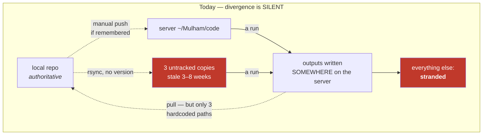

# #94 — Why local and server keep drifting, and what actually fixes it

**Your observation, restated:** the same class of error keeps happening — something is stale, something
is missing, something ran against the wrong copy — and each time it gets patched individually.

**The finding:** these are not recurrences of one bug. They are **six independent defects that all
produce the same symptom**, which is why fixing one never stops the next. Below is the evidence, each
root cause with the incident that proves it, and a design whose goal is not "keep the two in sync" —
that has been attempted and has failed repeatedly — but **make divergence impossible to ignore**.

---

## 1. The evidence — what is actually on the two machines

Not from memory. Measured today, 2026-07-31.

### 1.1 There are FIVE copies of the code on the server

| path | version control | last modified | what it is |
|---|---|---|---|
| `~/Mulham/code` | **git**, branch `dev`, tracks origin | current | the dashboard + the copy I pull to |
| `~/Mulham/wsg-i` | **git**, branch `master`, **no remote**, **578 dirty files** | 2026-07-13 | server-local audit repo — *cannot be pushed anywhere* |
| `~/Mulham/wsg-h/wsg-strategy` | none — rsync copy | **2026-06-03** | 8 weeks stale |
| `~/Mulham/l2v2/Parametric-Indicators` | none — rsync copy | **2026-06-19** | 6 weeks stale |
| `~/Mulham/fa-m1/Parametric-Indicators` | none — rsync copy | **2026-07-11** | 3 weeks stale |

**Three of the five cannot answer the question "am I current?"** They are rsync copies. There is no
`git status` to run. Nothing in them records which commit they came from.

### 1.2 The data lives in three different roots, behind ONE variable

| root | contains |
|---|---|
| `~/Mulham/code/subprojects/Parametric-Indicators/data` | `full_data`, per-year data |
| `~/Mulham/wsg-h` | `Full_Canldes_Data` (raw NQ candles) |
| `~/Mulham/wsg-i` | `Full_Canldes_Data` **and** `ALL_STOCKS` (ES/GC/SI/HG/CL/NG/RTY/YM) |

All three are selected by the same environment variable, `WSH_DATA_BASE`, which is *also* used as the
**repo root** (to locate `subprojects/all-stocks-signals/instruments.py`). One variable, two meanings,
three candidate values.

### 1.3 Study results live in at least four places

Per-timeframe SQLite files under `wsg-i/…/optimize/studies/`, under `wsg-h/…/studies/`, under
`fa-m1/…/studies/`, **and** a Postgres container `wsh-pg`. I have twice reported studies "gone" after
searching only one of them. All were intact.

### 1.4 There is no automation whatsoever

No git hooks. No cron job. No systemd unit. Every sync step in this system is a human remembering to
type something.

---

## 2. Six root causes

### RC-1 — "The code" is not a thing that exists

There is no single artifact you can point at and say *that is what the server runs*. There are five,
and three of them are untracked copies whose provenance is unrecoverable.

> **Incident:** today's full test suite produced **32 failures** that looked exactly like regressions
> from my own changes. Every one was a `FileNotFoundError`, because I chose the wrong root. Re-run
> against the root that has the data: **1,126 passed, 0 failed**. Nothing in the failure output said
> "you picked the wrong root" — it said my code was broken.

### RC-2 — Sync is a convention, not a mechanism

The deploy procedure is *"commit → push → pull → refresh"*, written in a notes file. Nothing enforces
it, nothing verifies it happened, and nothing detects that it did not.

> **Incident:** today the server checkout was **9 commits behind** and carried modified files. I only
> found out because I happened to run `git status` before using it. Had I not, the suite would have run
> against nine-commit-old code and I would have attributed the results to today's tree.

### RC-3 — A machine-specific fact is frozen into the source in 49 places

`Path(os.environ.get("WSH_DATA_BASE", "/mnt/data/projects/trading"))` — the environment variable is an
*override*; the **default is my laptop's path**. Nine files in `meta-prophet/scripts/` do not even have
the override (`PROJ = Path("/mnt/data/projects/trading")`).

> **Incident:** on the server, `optimize/l2/contributors/registry.py` executes `_load_instruments()` at
> **module import**. Wrong root ⇒ `FileNotFoundError` at import ⇒ pytest loses the entire file **at
> collection**. That is not a failing test. **It is an absent test** — it does not appear in the pass
> count, and it does not appear in the skip count either. The contributors tests had silently never run
> on the server.

### RC-4 — The two environments are genuinely different programs, and nothing says so

- There is **no local virtualenv at all**. The suite can only run on the server. (`python` is not even
  on the local `PATH`.)
- Local has no Numba, so `@njit` is a no-op decorator and the *reference* implementation runs.
- CI has no Numba either — so the accelerator parity tests once compared the reference to itself:
  **59 green assertions proving nothing** (playbook C11).
- A recursive `njit` function ran fine locally as plain Python and **segfaulted** on the server
  (playbook C13).

> "Green locally" has, historically, been compatible with "segfaults in production". The environments
> differ in ways that change behaviour, and nothing announces the difference.

### RC-5 — Outputs are born on the server and the return path is a hardcoded allow-list

`remote_wsi.sh cmd_pull` brings results home — but only from three hardcoded paths:
`optimize/results/`, `logs/`, and the single file `WS-I_RESULTS.md`.

> **Incident, exact:** the string `WS-I_RESULTS_GC` appears **0 times** in that script. When gold was
> onboarded, the GC report was written on the server and the return path never learned about it. That
> is why I found it stranded today. Same mechanism stranded GC-02's walk-forward scripts (`bd8b229`),
> #2's re-optimization (`8e4f2cf`), and the v5.1.0 closeout (`06c9dc3`).
>
> Worse: `WS-I_RESULTS.md` is a **"latest run" file overwritten in place**. Campaign B destroys
> campaign A's report, and if neither was pulled and committed, both are gone.

### RC-6 — No output records the code that produced it

Nothing stamps a result with the commit, host, data root, or library size it was computed under. So
"is this artifact current?" is never answerable from the artifact — only guessable from timestamps.

> **Incident:** a crashed run left a **complete, green golden-gate log** on disk from a broken build,
> and the next poll read it as the current result (playbook C16). Only `stat` on the file caught it.

---

## 3. Why "be more careful" cannot work



Every dotted arrow is a step a human must remember. There are **five** of them, they are needed on
**every** piece of work, and missing any one produces a result that looks completely normal.

A process that requires five correct manual steps per task, where failure is invisible, will fail. It
has failed roughly eight times that we have written down. **The problem is not attention. It is that
the system has no way to tell you it has diverged.**

---

## 4. The design principle

> **Do not try to keep two copies in sync. Make it impossible for them to diverge quietly.**

Three properties, in priority order:

1. **Attributable** — every artifact says what produced it. Then staleness is a fact you can read, not
   a thing you have to remember.
2. **Fail-fast** — a run that *would* be unattributable refuses to start, instead of producing a
   plausible number.
3. **Exhaustive return** — bringing work home is "everything not tracked", never a list of paths that
   has to be maintained.

Note the order. **(1) is worth more than the rest combined**, and it is the cheapest. Even if nothing
else changes, an artifact that carries its own commit hash ends the entire "is this current?" class.

---

## 5. The proposal, in four layers

### Layer 1 — Provenance stamp *(highest value, lowest cost, no workflow change)*

Every run writes a `_provenance.json` beside its output:

```json
{
  "git_commit": "23999a9", "git_branch": "dev", "git_dirty": false,
  "host": "amd-server", "repo_root": "/home/dev/Mulham/code",
  "data_root": "/home/dev/Mulham/wsg-i",
  "python": "3.12.3", "numba": "0.65.0", "registry_size": 165,
  "started_utc": "2026-07-31T16:04:11Z", "argv": ["...the exact command..."]
}
```

Kills RC-6 outright, and makes RC-1/RC-2 *detectable*: a report whose stamp says `git_dirty: true` or
names a commit you do not recognise is self-evidently suspect. **This is the one I would ship first
regardless of what you decide about the rest.**

### Layer 2 — Preflight gate

Before a long run starts, assert and print: checkout is clean, not behind `origin/dev`, the data root
resolves and contains what this run needs, and the accelerator is present. Any failure stops the run
with a message naming the fix. `--i-know` to override, recorded in the stamp.

Kills RC-2 and RC-4 — and converts RC-1 from "silent wrong answer" into "refuses to start".

### Layer 3 — One root, derived; data root separate

- Repo root derived from `__file__`, never a literal. Fixes all 49 sites.
- **Split the variable**: `WSH_REPO_ROOT` (derived, essentially never set) vs `WSH_DATA_ROOT` (genuinely
  machine-specific). Startup asserts the data root contains what it must and, on failure, prints the
  candidates it knows about.
- An AST test that no module resolves a project path from a literal absolute path.

Kills RC-3, and the "three roots behind one variable" half of RC-1.

### Layer 4 — Exhaustive harvest, and retire the copies

- `harvest` = *everything* under the server repo that git does not know about, brought home and shown
  as a diff for review. Not an allow-list. Kills RC-5 permanently.
- Run it automatically at the end of every server run.
- Stop overwriting "latest run" filenames: outputs go to a per-campaign directory named by the study
  prefix, so campaign B cannot destroy campaign A.
- **Retire the three untracked copies.** Either delete them or convert them to git worktrees of the one
  repo. This is the only item that reduces the number of things that can drift, rather than making
  drift visible.

---

## 6. What needs your decision

| # | question | my recommendation |
|---|---|---|
| **D1** | Ship Layer 1 (provenance) on its own first? | **Yes** — largest gain, no workflow change, and it makes every later layer verifiable |
| **D2** | Should the preflight gate **block** a dirty/behind run, or only warn loudly? | **Block, with `--i-know`.** A warning in a long log is a warning nobody reads |
| **D3** | The three untracked copies — delete, or convert to worktrees? | **Convert `wsg-h`/`l2v2`/`fa-m1` to worktrees** if any is still live; delete otherwise. Needs your answer on which are still in use |
| **D4** | `~/Mulham/wsg-i` is a git repo on `master` with **no remote** and **578 dirty files** — it holds ALL_STOCKS data and a server-local audit history | Needs a decision of its own: harvest what matters and retire it, or give it a remote. **578 files is too many to sweep silently** |
| **D5** | One study store, or keep SQLite + Postgres? | Keep both, but route **every** lookup through `storage.find_study` (already built in #89) so "gone" can never mean "I searched one backend" |

---

## 7. Suggested order

1. **Layer 1** — provenance stamp + a test that every result-writing path emits one.
2. **Layer 3** — derived repo root, split data root, AST test. Fixes the defect as filed, and makes a
   fresh clone runnable on any machine with no environment setup.
3. **Layer 2** — preflight gate.
4. **Layer 4** — exhaustive harvest; then the copies decision (D3/D4).

Layers 1–3 are mechanical and testable. Layer 4 changes how you work, so it comes last and only after
you have answered D3/D4.

---

## 8. What this does **not** fix

Sync discipline for things that are not files — a restarted dashboard serving old code in memory, a
Postgres study written by a build that no longer exists. Provenance makes those *visible* but cannot
prevent them. Also: none of this recovers the 578 uncommitted files in `wsg-i`; that needs a human
decision about what is worth keeping.

## 9. See also

- `docs/AUDIT-2026-07-31-registry-sensitive-constants.md` — the sibling defect class: a machine-specific
  or size-specific fact frozen as a literal
- `docs/EXPANSION_ROUND_PLAYBOOK.md` §4 — rules C5, C11, C13, C16 are all sync/environment incidents
- `optimize/server/INCIDENT_ssh_connection_reset.md`, `INCIDENT_wsh4_sqlite_contention.md`
