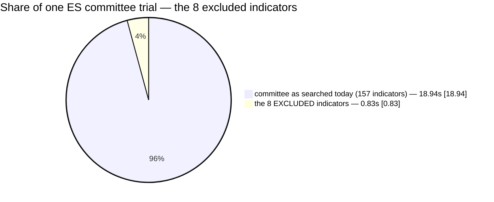
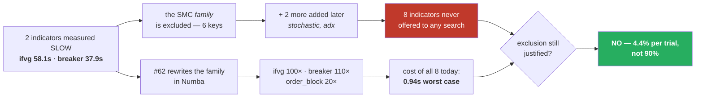

# #95 — The SMC exclusion, measured

**One-line answer.** The exclusion was justified by "these are 90% of a trial". Measured today on the
real ES committee frame: they are **4.2% of a trial**, and admitting all eight costs **+4.4%**. The
reason for the exclusion no longer exists.

---

## 1. What was excluded, and why

`optimize/contributor_search.py` withholds eight indicators from the cross-instrument contributor
committee **search space**. Not from display, not from the backtester — from the search. No contributor
search has ever been able to select them.

```python
SMC_COMMITTEE_KEYS = ("structure_trend", "order_block", "fvg", "ifvg", "breaker", "cisd")
L1_ES_EXCLUDE      = SMC_COMMITTEE_KEYS + ("stochastic", "adx")
```

The stated reason was **cost**, and it was a good reason when it was written: on the 486,954-bar ES
frame `ifvg` was measured at **58.1 s** and `breaker` at **37.9 s**, together **90% of a 106.4 s
committee trial** (`docs/PERFORMANCE.md` §9).

### In plain language

The strategy asks a committee of indicators to vote on each candidate trade. The *cross-instrument*
committee runs that same vote on a **second** instrument's price history — ES (the S&P 500 future) —
to ask "does the other market agree?". Because it runs on the full one-minute history, ~487,000 bars,
anything slow gets very slow. Two indicators were so slow that they dominated the whole trial, so the
family they belong to was switched off in the search.

Then issue #62 rewrote that family in Numba (a compiler for numerical Python). The question this
document answers is whether the switch should still be off.

---

## 2. Why #62's numbers did not already settle it

#62 measured on the **NQ** frame through `directions()`. The exclusion is about the **ES contributor
frame** reached through a different call path — compute on the one-minute source, then sample at
aligned decision bars (`runner._vote_from_1min`). Quoting #62 at this decision would be answering a
question with a measurement of something else. So it was measured directly:
`optimize/perf/bench_smc_committee.py`.

---

## 3. What was measured

All numbers below are on the **full 486,954-bar ES one-minute frame** — measured, not extrapolated —
through the production committee call path, warmed (the first call pays Numba compilation, which is a
one-off cost amortized over a whole sweep, so only the second call is timed).

### 3.1 Per indicator, at the worst corner of its parameter grid

An indicator can be cheap at its defaults and pathological at a grid edge the optimizer *will*
eventually sample, so every one was measured at defaults, all-parameters-minimum and
all-parameters-maximum (playbook rule P4).

| indicator | default | **worst grid corner** | reference path (control) | speed-up |
|---|---:|---:|---:|---:|
| `ifvg` | 0.224 s | **0.224 s** (default) | 22.506 s | **100×** |
| `breaker` | 0.133 s | **0.198 s** (all_min) | 14.702 s | **110×** |
| `adx` | 0.126 s | 0.129 s (all_min) | 0.125 s | — |
| `fvg` | 0.100 s | 0.101 s (all_max) | 0.097 s | — |
| `structure_trend` | 0.091 s | 0.096 s (all_min) | 0.094 s | — |
| `cisd` | 0.092 s | 0.092 s (default) | 0.094 s | — |
| `order_block` | 0.058 s | 0.081 s (all_min) | 1.189 s | **20×** |
| `stochastic` | 0.021 s | 0.021 s (default) | 0.019 s | — |
| **all eight** | | **0.94 s** | | |

### 3.2 The number that actually decides

The exclusion was never argued per indicator — it was argued as *"90% of a trial"*. So the trial is
what had to be measured:

| | measured on the full frame |
|---|---:|
| committee as searched today (157 indicators) | **18.94 s** |
| the 8 excluded indicators | **0.83 s** |
| **admitting them costs** | **+4.4% per trial** |
| **they would be** | **4.2% of the trial** |
| the original claim | **90%** |



---

## 4. The control — is the win really the acceleration?

A positive result needs a dumb control, so the same eight were re-measured with the Numba dispatch
forced off (`smc._HAVE_NUMBA = False`), which makes every one fall back to its frozen reference oracle.

**Two things fell out of that control, and the second one is the more interesting.**

**(a) The acceleration is real and it is the whole story for two indicators.** `ifvg` 22.506 s → 0.224 s
(100×) and `breaker` 14.702 s → 0.198 s (110×). Nothing about hardware, caching or frame length
explains that; the reference path was measured on the same box, same frame, same minute.

**(b) Four of the six SMC indicators were NEVER expensive.** `structure_trend`, `fvg`, `cisd` — and
`stochastic` and `adx` from the L1 list — cost **the same with the accelerator off as on** (0.019–0.129 s).
They were never accelerated because there was never anything to accelerate.

> **They were excluded by family membership, not by measurement.** Only `ifvg` and `breaker` were ever
> genuinely expensive. The other six were swept up because they sit in the same module. Six indicators
> have been kept out of every contributor search since, on a cost that was never theirs.



---

## 5. Three honest caveats

**The old numbers do not reproduce exactly.** The historical claim was `ifvg`=58.1 s and
`breaker`=37.9 s. The reference path today measures **22.5 s** and **14.7 s** — about 2.5× lower. That
gap is unexplained: it could be a faster box, a slightly different frame, or a reference implementation
that was itself improved along the way. It does not change the conclusion (the accelerated path is
100× faster than *either* number), but the discrepancy is recorded rather than smoothed over.

**Subset extrapolation was unreliable per indicator.** The first run projected `ifvg` at 0.06 s from a
40,000-bar subset; the full-frame measurement is **0.224 s** — under-predicted by 3.7×. An
extrapolation wrong in the *cheap* direction is exactly the one you must not lean on when the argument
is "cheap enough to admit", so every headline number here is a full-frame measurement. (The committee
*total* extrapolated well — 18.7 s projected vs 18.94 s measured — which is why the per-indicator error
had to be caught separately.)

**This measures COST, and cost only.** It says the exclusion's stated reason is gone. It does **not**
say these indicators help. That is a separate question with a separate answer, and §6 keeps them apart.

---

## 6. Implementation plan

The goal is to remove a restriction that is no longer justified **without** silently widening the
search space and calling the result an improvement.

### Phase 0 — DECIDED 2026-08-01: **option A**, remove the exclusion entirely ✅

Three options, and they are not equivalent:

| option | what it does | argument for |
|---|---|---|
| **A — remove the exclusion entirely** | all 8 become searchable in the contributor committee | the cost reason is gone; a search that cannot reach an indicator can never learn it is useless |
| **B — remove it for the 6 that were never slow, keep `ifvg`/`breaker` excluded** | the two genuinely-expensive ones stay out | most conservative; but they are now 0.22 s and 0.20 s, so the caution has no measurement behind it either |
| **C — make it a searchable/​dashboard-controlled option, default unchanged** | you choose per run | matches the standing rule that a decision layer must be controllable from the control centre, and nothing changes until you ask |

**Recommendation: C first, then A.** Ship the control, run the comparison, and let the measurement
decide the default — rather than flipping a default and measuring afterwards.

### Phase 1 — make the exclusion a parameter instead of a constant

1. `SMC_COMMITTEE_KEYS` / `L1_ES_EXCLUDE` stop being the hard default of
   `suggest_contributor(exclude_committee=...)`; the caller must pass a scope.
2. `--contrib-exclude` / `--contrib-only` on the optimizer CLI, threaded through `RunSpec` and
   `build_argv` so the control centre's preview and the launched command remain the same call (#91).
3. Dashboard control exposes it, per the standing rule that a decision layer is controllable by the
   human running the backtest.
4. The run header prints the contributor committee scope, next to the indicator scope it already
   prints. **A restriction that is not printed is a restriction nobody can audit.**

### Phase 2 — a cost gate, so this cannot rot again

5. A test that fails when the committee's measured worst-case cost exceeds a stated budget — the
   exclusion's *reason* becomes an assertion instead of a comment. This is rule S4: a cost-based
   exclusion is a measurement with an expiry date.
6. `bench_smc_committee.py` joins the perf suite so the number is refreshed every acceleration round.

### Phase 3 — the question cost cannot answer: do they help?

7. Run the contributor search **with** and **without** the eight, same seed, same budget, same folds.
8. Judge on out-of-sample fold scores, not on in-sample fit — and per the standing rule, only if the
   holdout is a holdout **for both sides**.
9. Report both outcomes honestly. "The search was allowed to reach them and did not choose them" is a
   real, useful result — and it is the result the exclusion has been *preventing* anyone from getting.

### Phase 4 — sweep for siblings

10. Every other cost-based exclusion in the search path gets the same treatment: is its measurement
    still true? Known candidate — `--auto-trials`-adjacent defaults and any `exclude` list whose
    comment cites a timing.

### What is explicitly NOT in the plan

Flipping the default as part of the cleanup. The measurement says the *reason* is gone; it does not say
the *outcome* improves. Those are two claims and only one of them has evidence.

---

## 7. Reproducing this

```bash
# on the server — ES data lives under wsg-i
cd ~/Mulham/code/subprojects/Parametric-Indicators
WSH_DATA_BASE=/home/dev/Mulham/wsg-i /home/dev/Mulham/.venv/bin/python3 \
    -m optimize.perf.bench_smc_committee --bars 40000 --full-confirm
```

Artifacts: `optimize/perf/results/smc_committee.json`, `optimize/perf/results/smc95b.log`.

## 8. See also

- `docs/AUDIT-2026-07-31-registry-sensitive-constants.md` §2.4 — this exclusion in the wider audit
- `docs/EXPANSION_ROUND_PLAYBOOK.md` §4 rule **S4** — a cost-based exclusion has an expiry date
- `docs/CLOSEOUT-2026-07-28-indicator-budget.md` — the #62 acceleration that expired it


---

## 9. Shipped — 2026-08-01

**Decision: option A.** The exclusion is removed. Full suite **1,170 passed, 1 skipped, 0 failed**.

| what | now |
|---|---|
| `DEFAULT_COMMITTEE_EXCLUDE` | `()` — nothing withheld |
| `SMC_COMMITTEE_KEYS`, `L1_ES_EXCLUDE` | kept as **names**, so a pre-2026-08-01 run reproduces by asking for them explicitly |
| control | `--contrib-exclude` on both optimizers **and** a `RunSpec` field, so the control centre can express it |
| removed | `--contrib-include-smc`. An opt-**IN** only makes sense while withholding is the default; leaving it would let a run silently mean the opposite of what it says |
| cost gate | `test_committee_cost_budget.py` turns the justification into assertions (rule **S4**) |

> **The test that pins the removed flag had to be rewritten.** Its first version searched the source
> text and failed on the **comment documenting the removal** — the identical false positive a regex
> produced in #89. It now reads `add_argument` calls and attribute accesses through the AST, so prose
> about the flag is invisible to it. Twice now, in two different issues: **a code-shape check must look
> at code shapes.**

### What is still NOT known

**Whether these eight indicators help.** Option A removes a restriction whose stated *reason* no longer
exists; it does not claim a benefit. The remaining phase is the comparison:

- run the contributor search **with** and **without** the eight — same seed, same budget, same folds
- judge on out-of-sample fold scores, and only where the holdout is a holdout **for both sides** (#87)
- report either outcome: *"the search could reach them and did not choose them"* is a real result, and
  it is the result the exclusion has been preventing anyone from obtaining

Cost: a contributor-search campaign, server-side, hours. Not launched — it is a resource commitment
worth deciding separately from the code change.
