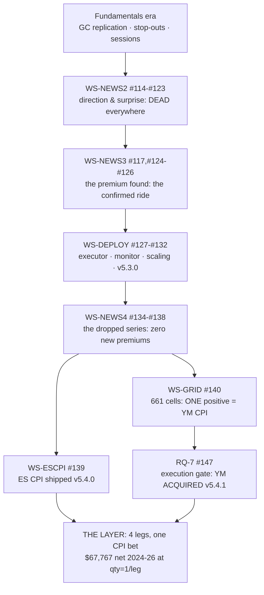

# The News Programme — Master Experiment Record

**Every experiment, its result and its finding, across the entire programme (2026-06 → 2026-08-19).
Compiled at the programme's completion point: all profitable news deployed (v5.4.1), the premium
grid literally closed, ledger 39/39 on both machines.**

This is the master index. Each workstream's full detail lives in its own record —
`NEWS-PROGRAMME-FULL-RECORD.md` (WS-NEWS2/3), `WS-NEWS4-FULL-RECORD.md`,
`WS-ESCPI-FULL-RECORD.md` (+ 2 addenda), `WS-GRID-RESULTS.md` — and every number below is
bound to the claims ledger (`optimize/verify/run.py`, 39/39) or a committed evidence file.

---

## Era 0 — the fundamentals prelude (pre-programme)

| # | experiment | result → finding |
|---|---|---|
| 0.1 | Fundamental analysis (macro levels vs the box strategy) | CLOSED: macro IS priced in; no entry edge. **94% of stop-outs are 1-second sweeps** — the fact that later justified 1-second data everywhere. |
| 0.2 | GC replication of macro-surprise sensitivity | Gold reacts INVERSELY to macro surprises (Spearman −0.193; Pearson blind — fat tails) but un-tradeable at cost. Finding: report rank correlation beside Pearson on fat-tailed data. |
| 0.3 | Session/own-distribution studies | Session structure is real in tape and risk, not a tradeable entry edge; the per-trade tail (±$1,600) defeats every weak edge. |
| 0.4 | h1a pre-event stop-out scan (8 instruments) | Pre-event stop-out risk quantified per instrument — the input that later shaped GAP-01 fills. |
| 0.5 | EIA/API mechanism probe (CL) | The inventory releases move CL violently — the observation that kept energy in every later funnel. |

## Era 1 — WS-NEWS2 (#114–#123): the calendar and the death of direction

| # | experiment | result → finding |
|---|---|---|
| 1.1 | Source evaluation (8 calendar providers) | 7 rejected (403s / no timestamps / date bugs). **TradingView chosen**: real UTC per event, DST correctly encoded. |
| 1.2 | Calendar verification (`tv_calendar.py --verify`) | ⚠️⚠️ **2013-2015 summer timestamps are one hour late** (fixed-offset back-fill; 87 series affected) → the programme-wide **≥2016 rule**. NFP alone passes even when 90% is broken — single-series checks don't generalize. |
| 1.3 | Provenance battery (#119/#120) | `previous` proven point-in-time vs ALFRED on 4 series; `forecast` unverifiable (no archive) — the honest blind spot every later study inherits. |
| 1.4 | Phase-2 pre-registration + the 643-pair direction scan (82 series × 8 instruments) | **Direction is DEAD everywhere**: surprise explains the release-minute JUMP (ρ to −0.63) and NOTHING after; edge excluded at 95% on all pairs. Four attacks, four real effects, none tradeable. Finding: the fix is SIZING, not prediction. |
| 1.5 | YM row | ⛔ Excluded — the YM 1m frame was 0 bytes (repaired much later, era 6). |

## Era 2 — WS-NEWS3 (#117, #124–#126): the premium found

| # | experiment | result → finding |
|---|---|---|
| 2.1 | Goal re-audit vs the owner's goal statement | The premium/ride had never actually been tested — POWER had been conflated with PREMIUM. Meta-rule: close workstreams against the GOAL STATEMENT. |
| 2.2 | M1 ride-through grid (5 series × 5 instruments, 1s bars) | Only **CPI** carries a ride premium (NQ grid-cell +$463 gross at no-TP); Retail is NEGATIVE (−$98 — flagged, resolved era 5); NFP weak; FOMC ≈ 0. Controls: quiet-minute placebos vs the FULL 39k calendar; the 8:30 seasonality floor declared. |
| 2.3 | M2 power model | Move SIZE is predictable night-before (ρ≈0.5); **POWER ≠ PREMIUM** becomes the programme's central law. |
| 2.4 | M3 the confirmed trade (pre-registered, Bonferroni α/54 + half-split) | **LONG NQ/RTY at release−300s, S 0.10%, TP 0.40%, tie⇒STOP, exit +900s over {CPI,NFP,FOMC}: NQ +$155.56/ev gross t=4.13, net +$133.06 stressed; RTY holdout (never loaded before filing) confirms.** Win 36.4%, median loses, the +4R tail pays. One-sided: the straddle's short leg loses 18/18. |
| 2.5 | Controls & falsifiers battery | Consensus numbers fully dead pre-release; clean-day controls ≈ $0; the “no release that day ≠ no news at that minute” lesson. |

## Era 3 — WS-DEPLOY (#127–#132, → v5.3.0)

| # | experiment | result → finding |
|---|---|---|
| 3.1 | D1 release executor + schedule | Replay parity **NQ 327/327, RTY 238/238 exact**. Found: the study's same-minute tie-break was per-instrument unstable (2026-03-06 NFP+Retail minute) — pandas non-stable sort as a scientific instrument. |
| 3.2 | Engine qty hook | `pnl = pnl × pv × qty`, byte-identical at qty=1; linearity to the cent. |
| 3.3 | D2 regime monitor | Rolling 24-CPI net-stressed mean < 0 ⇒ STAND_DOWN, sticky; GO at build (+$1,231). Registration error kept honestly: 2016-19 was expected to stand down and did not. |
| 3.4 | With/without measurement | The overlay adds +31.1% profit for +6.6% DD on the 1h slot; daily correlation +0.098 — near-orthogonal to the box book. |
| 3.5 | D3 scaling (qty 5/10/20) | **The constraint is the QUIET ENTRY SECOND** (NQ median 7 contracts) not the violent exit (231); worked entry over 300s is easily fed (1,531 median). |
| 3.6 | D4 worked entry validation | VWAP entry keeps 96% of NQ's edge; RTY IMPROVES +24%; combined qty=20 pace ≈ $330k/yr. Ship v5.3.0 after golden 6/6 + dashboard parity. |

## Era 4 — WS-NEWS4 (#134–#138): the dropped series

| # | experiment | result → finding |
|---|---|---|
| 4.1 | N1 coverage matrix (evidence-generated) | Premium had been tested on **5 of 237** series; **11,822 untested moments** in 92 groups. Traps recorded: Jobless Claims is TV-importance 0; title renames split series; the scan unit is the MINUTE. |
| 4.2 | N2 pre-registration + wide scan (Tier-1: 10 blocks × NQ/RTY at α=0.05/20; Tier-2 ~79 blocks) | **0/20 new premiums.** All Tier-1 jump-gates pass (1.6–4.7×) yet nothing pays — POWER ≠ PREMIUM at full-calendar scale. NQ MDEs $67–$234 all below the CPI-sized +$309: **powered zeros**. |
| 4.3 | The positive control | The deployed set through the identical pipeline reproduces **+$133.06 to the cent** — and caught a live bug pre-results (two-sided control gate wrongly vetoed CPI; fixed to the registered wording, all re-run). |
| 4.4 | CPI concentration measurement | CPI alone confirms on BOTH deployed instruments (NQ +$309, RTY +$78 net); NFP/FOMC alone never confirm anywhere. |
| 4.5 | N3 deep-dives (8 pre-registered tests, 5 instruments) | ⭐ **Retail anti-premium REAL** (gross −$86.10 NQ / −$32.41 RTY, both halves negative, series-specific); Durables powered nulls; **EIA/API definitive NO** (gross ≈ $0 at n=551/433 while jumping 5–8×); ES/GC pooled: no new surface; **ES CPI-alone +$151 t≈3.0 filed as the promotion candidate**. |
| 4.6 | N4 reports | The bilingual leveled report + the full record; both programme reports cross-linked. |

## Era 5 — WS-ESCPI (#139): ES shipped, the YM saga

| # | experiment | result → finding |
|---|---|---|
| 5.1 | E1 pre-registration (before opening YM) | YM named the true holdout; the ship rule fixed: *"ES ships only if YM PASSES or the owner explicitly accepts descriptive grade."* |
| 5.2 | I1+E3 the corrupt YM file → rebuilt from raw | YM_1s ended 2016-01-15 mid-row + 41MB NULs; re-assembled from the 10.8GB Databento raw. **Side effect: the 0-byte YM 1m frame is fixed — YM fully studyable.** |
| 5.3 | E4 ES robustness battery | PASS every gate: net +$151.37/ev, p=0.0027, jump 20.5×; Retail falsifier correctly negative. 2024→2026: +$529.44/ev, +$15,353.82/contract. |
| 5.4 | E5 YM holdout | **VOID-DATA** — thin tape vs the registered 150s line (median 101 traded pre-release seconds); descriptive +$107.64 t=3.15 agrees but confirms nothing. Gate NOT loosened after seeing data. |
| 5.5 | E6-E10 ship stages | Executor learns ES + `--series`; two-implementation parity to the cent; golden 6/6; dashboard branch ≡ production with screenshots. |
| 5.6 | E8 integration & joint risk | +36.5% layer profit at qty=1; ES↔NQ same-event corr **0.78**; 24% of CPI events lose all legs — **SCALING the CPI bet, not diversifying**. |
| 5.7 | The ship (owner word) → v5.4.0 | Playbook v1.2.0, portable `--verify` PASS, PR #148, release with bundle. |

## Era 6 — WS-GRID (#140): the literal closure

| # | experiment | result → finding |
|---|---|---|
| 6.1 | Pre-registration + the 661-cell sweep (all 9 instruments) | **ONE positive in the entire sweep: YM CPI (+$107.64, p=0.0016, jump 9.8×).** Census: 370 VOID-TIMESTAMP · 179 significant negatives (41% pure cost drag, 29% gross-POSITIVE — the fee schedule measured) · 106 powered nulls · 5 underpowered. |
| 6.2 | Structural findings | **CPI premium = equity-index phenomenon ordered by beta (NQ > ES > YM > RTY)**; metals gross-positive but cost-drowned (HG +$80, SI +$48 gross → RQ-5); **Retail gross-negative on 7 instruments**; NG's own inventory release jumps 8.5× and grosses −$4.89 (POWER ≠ PREMIUM, final form). |
| 6.3 | The research queue instituted | RQ-1..RQ-8 → issues #141-#147; the standing intake rule: *an observation without an RQ number does not exist.* |

## Era 7 — RQ-7 (#147): the execution gate and the acquisition → v5.4.1

| # | experiment | result → finding |
|---|---|---|
| 7.1 | E12-E14 the YM walk (owner-ordered) | Executor parity to the cent (full era +$107.64; 2024-26 +$355.72); golden 6/6; dashboard re-captured. |
| 7.2 | E15 the execution study (pre-registered ACQUIRE rule) | **ALL FOUR layers PASS**: fill staleness median 0.0s/p95 7.2s · next-open fill Δ**$0.58**/event · entry-window depth **364 contracts** median · exit tape 638s/4,081 contracts. **Lesson: traded-seconds density ≠ fill quality** — liquidity concentrates exactly at the entry second on CPI mornings. |
| 7.3 | The acquisition → v5.4.1 | Playbook v1.3.0, portable `--verify` PASS on YM, PR #149, release with bundle. ⛔ qty>1 on YM forbidden (entry BAR median 2 contracts) pending its own D3/D4. |

## The programme's laws (what every era kept re-proving)

1. **POWER ≠ PREMIUM** — violence is everywhere; payment lives in one place.
2. **The premium is an inflation-print, equity-index phenomenon**, ordered by index beta.
3. **Retail Sales is the calendar's one confirmed anti-premium**, market-wide.
4. **Read gross beside net** — on a $22.50–$102.50 cost line, low variance makes the fee schedule look like an anti-premium.
5. **Pre-register or perish** — every gate that embarrassed us (the two-sided control, the 150s line) was survivable *because* it was written down first.
6. **Positive controls are not optional** — one caught a live bug that would have silently hardened a zero.
7. **A verdict for every cell** — VOID-with-cause and powered-null are recorded states; silence is the only forbidden outcome.

## Era 8 — RQ-1 + RQ-9 (#141/#150): the scaling of the new legs → v5.4.2

| # | experiment | result → finding |
|---|---|---|
| 8.1 | Pre-registration of the scaled-deploy rule (before any run) | Participation median ≤2.5%/p95 ≤5% (worked mode) + retention ≥80% + the D3/D4 hard gates; "deploy each leg at the highest passing tier"; YM's borderline (≈5.5% naive estimate at q20) called out in advance — *the rule decides, not preference*. |
| 8.2 | D3 participation battery (ES, YM; CPI-only via the new `--series` filter) | Hard gates green both legs (V1 linearity to the cent; volume physics 48.8×/51.0×). The entry-second wall replicates: single-shot dies above qty=1 on both (ES q5 = 33% of the entry second; YM q1 already 50%). |
| 8.3 | D4 worked-entry validation (ES, YM) | Gates green (dual-path VWAP 0 mismatches; shifted-window falsifiers flip by $943/$616). Retention: ES **85.9%** (+$454.96 of +$529.44), YM **84.3%** (+$299.87 of +$355.72) — both clear the 80% line. |
| 8.4 | Window-participation measurement | ES window median **3,389 contracts** ⇒ q20 = **0.59%/0.98%** — approved at **20**. YM window median 375 ⇒ q5 = 1.33%/3.05% ✓ but q10 = **2.67%/6.11% breaches both lines** ⇒ **capped at 5**. The rule rejected a tier — it is not a rubber stamp. |
| 8.5 | Scaled deployment (v5.4.2) | Per-leg quantity rules shipped in playbook v1.4.0. Worked-entry window economics 2024→2026: ES q20 +$263,880 · YM q5 +$43,481 · NQ+RTY q20 +$859,141 ⇒ **layer at max approved tiers ≈ $1.167M/window (≈$450k/yr pace)** — a model-grade figure (VWAP fills at ≤2.5% participation), margin owner-side. Reconciliation recorded: YM single-shot qty=1 stays governed by RQ-7's direct fill measurement (Δ$0.58), which supersedes the participation heuristic at that size. |
