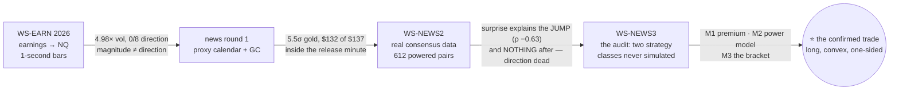

# THE NEWS PROGRAMME — the complete record: four workstreams, one question, one confirmed trade

**Date:** 2026-08-16 · **Status:** programme COMPLETE (WS-EARN #109–113 · news round 1 · WS-NEWS2
#114–123 · WS-NEWS3 #124–126+#117 — all closed) · **Verification at close: 27/27 claims, selftest 5/5**

**What this document is:** the one-stop, in-depth record of everything the news research programme
ran, found, got wrong, caught, and concluded — written so that a reader with none of the 19 stage
reports open can reconstruct the whole programme, and so that any future number can be traced to
its committed evidence file and ledger claim. The stage reports (indexed in Part 13) remain the
detailed sources; this is the map with the treasure marked.

---

## Part 1 — The question, and the answer

**The owner's question, held constant across four workstreams:** scheduled news gives three
numbers — *previous*, *forecast* (before) and *actual* (at the release). Can we extract the
**POWER** of the news and the **DIRECTION** to ride, and monetize them — before the release, at
the release second, or after it?

**The answer, earned the long way:**

> **DIRECTION cannot be predicted — by anything, at any horizon, and this is powered, not
> presumed.** Not by the consensus numbers, not by the surprise (it arrives with the move), not by
> the pre-release price pattern.
>
> **POWER can be predicted — the night before** (which releases will move, ρ ≈ 0.5 out of sample),
> and it is enormous at the release second (5–15× ordinary minutes; NQ CPI medians 70× their 2016
> level in 2022).
>
> ⭐⭐⭐ **And there is a trade that needs only the power:** the macro-announcement premium,
> harvested with a convex bracket —
>
> **LONG NQ/RTY at release−300 s · stop 0.10% · take-profit 0.40% · exit +900 s · on {CPI, NFP,
> FOMC}: NQ +$155.56/event gross, t = 4.13 (clears Bonferroni α/54 + both chronological halves),
> net +$133.06 under STRESSED costs ≈ +$6,900/yr/contract; RTY t = 3.79.**
>
> Deployment is gated on two OWNER decisions (Part 8): the sizing/multi-leg engine change + release
> executor, and the regime monitor.

## Part 2 — WS-EARN (#109–113): earnings announcements → NQ

**Design:** 783 earnings events over 16 years, timestamped to the SECOND from EDGAR, tested on
1-second NQ bars, prediction filed before the data was touched. **Found:** the announcement second
runs **4.98× normal volatility** — and **0/8 directional cells significant in ALL arms**. The
control's gross t = −0.58 became **net t = −3.68** under $9.50 costs: ⭐ *a significant negative
net-t is COST DRAG, not a reversal* — a lesson that later guarded every net calculation.

**The data war it won (traps that stayed permanent rules):** EDGAR's submissions-JSON `Z`
timestamps are UTC for some filings and Eastern for others (put MSFT+LRCX 4–5 h early — 22 of 201;
caught by a **stability check**, not inspection) → always use `-index-headers.html`
ACCEPTANCE-DATETIME. Acceptance ≠ announcement (INTC's 8-K lags its own press release ~7 min: the
recorded minute reads 1.32× while the real event is 3.22×). Item codes lie (an AMAT quarter lost;
Tesla files 2.02 for *deliveries* too). The study had ~154 independent windows — versus the
indicator search's ~5 — which is why its null is worth more than most positives.

## Part 3 — News round 1 (proxy calendar) + gold + the fundamentals battery

**Found:** gold reacts to macro releases at **5.5σ**; the decomposition that shaped everything
after it — **$132.39 of the $137 total reaction sits INSIDE the release minute** (t = +7.13), and
everything after the print is +$5.37 (t = 0.52). ⭐ *State the anchor to the bar AND the side of
the bar* — this one convention was later worth an entire phase (WS-NEWS2's S0). The GC replication
added: gold moves **inverse** to macro surprises (Spearman −0.193 where Pearson, blind on fat
tails, read −0.012) → *always run rank correlation beside Pearson*. The fundamentals battery
established the programme's standing risk facts: **94% of stop-outs are 1-second sweeps**, the
per-trade tail is fat (±$1,600), and scheduled US macro is priced in at 17y/99% power.

## Part 4 — WS-NEWS2 (#114–123): the real consensus data, and the direction verdict

**The data:** TradingView's public calendar — the **8th** source tried, seven failed — 39,221 US
events with actual+forecast+previous. Its provenance was *proven*, not assumed:
- `actual` = **first print** (503 releases checked vs ALFRED vintages: 100/100/99% match the first
  print, 0% the revision; March 2020 payrolls −701k→revised −1,398k and TV carries −701k);
- `previous` = **point-in-time** (99/98/99% vs **0%** match to today's values — a back-fill cannot
  do that; the row was captured live);
- `forecast` = **permanently unverifiable** (no consensus archive exists anywhere) — a standing
  caveat, not a to-do;
- ⚠️ pre-2016 is DST-broken (87 series an hour late in summer; 2014: 90% of series) → floor 2016;
- ⚠️ per-instrument price floors; YM's aggregated frames are 0 bytes (carried to backlog).

**The experiment:** 643 decidable → **612 powered** release×instrument pairs, every pair carrying
a calibrated planted-effect probe (25 draws, one-sided binomial; ⭐ plant on RANKS when measuring
Spearman — value-planting recovers only 0.76–0.95× of the target; the probe itself needed four
fixes, each diagnosed from a symptom, and the tell that found the root cause was a SHAPE: pass
rate inverted vs sample size).

**The verdict:** the surprise explains the release-minute JUMP superbly — 23 survivors, ρ to
−0.63, p to 1.9e-10, dumb controls null, permutation-verified — **and explains essentially nothing
afterwards**: the capturable window held **1 survivor in 612** (CL/API drift, ρ = −0.247,
accuracy 57.4% [51.2, 63.4] vs the 71% break-even), whose source is a **private report with no
archive** (#123: unverifiable is a property, not a task; its mechanism — API forecasts EIA at
ρ = +0.742 — is possible but the discriminating test was underpowered ~4×, and M2 later showed
API's market power has since collapsed to last place). **A tradeable directional edge was excluded
at 95% on all 612 pairs, both windows.**

## Part 5 — WS-NEWS3 (#124–126, #117): the audit, and the two missing experiments

**M0 — the audit.** WS-NEWS2's closeout had answered *direction* and called the goal done — but
the goal contained three strategy classes, and two (the pre-positioned ride's P&L; the
non-directional straddle) were **never simulated**. #117's no-go argued against latency-directional
trading while the owner's straddle proposal sat verbatim in the same issue. ⭐⭐ *A workstream is
closed against its GOAL STATEMENT, not against the strongest verdict it produced.* (The audit
itself mis-claimed once — "survival never tested", when H1-A had tested it — caught same-day.)

**M1 — the ride (#125).** The hold-through trade was priced for the first time: **LONG equity
indices through releases pays, shorts mirror-negative, controls ≈ $0** — the Savor–Wilson
announcement premium, found exactly where theory puts it (indices yes, gold weakly, oil no).
Confirmed on a **pre-registered holdout never previously loaded** (RTY: +$69.54/event, t = 3.22,
p = 0.0007). **CPI is the engine** (NQ +$424/event; Retail Sales at the same clock minute is
NEGATIVE — the falsifier). Era-concentrated: ≈0 in 2016–19, strongest 2025–26. The drift test
killed the last directional hope (0.48–0.51 everywhere, powered). And V3's failure exposed a
programme-wide flaw: ⭐⭐ *"no release that day" ≠ "no news at that minute"* — every control ever
drawn against only the tracked series was contaminated (Jobless Claims/PPI/GDP live at 8:30 too);
controls are now cleaned against the full 39k-event calendar, with quiet-minute falsifiers.

**M2 — the power model (#126).** The dumbest defensible predictor — each series' own prior |move|
history — ranks releases **out of sample at ρ = 0.47–0.58 on all five instruments**; series-label
shuffles collapse to ρ ≈ 0.1; no-news controls ≤ 0.15. **|forecast − previous| adds NOTHING**
(powered) — with H1-B/C, the consensus numbers are fully dead as pre-release inputs. Two
registered gates failed honestly and became principles: ⭐⭐ **POWER ≠ PREMIUM** (NFP/FOMC are the
biggest movers with no premium; CPI is the 3rd mover with the only premium — my V2 anchor had
named the wrong quantity), and ⭐ **expanding medians lag regime shifts** (NQ CPI predicted 0.045%
vs realized 0.19% median; cured by a *declared* trailing-24 variant under identical gates — by
current values CPI is the #1 power release on NQ *and* RTY).

**M3 — the structure (#117).** The owner's straddle, tested exactly as proposed on 1-second bars
(V1 bridged the frames: the 1s pipeline reproduces P1's 1m cell at +$80.80 vs +$84.24 on the
identical 574 events): **primary NOT confirmed** (+$50.33 net stressed, p = 0.0897 — and not
excluded, MDE ≈ $104) and **dominated by its own long leg in 18/18 cells** — the short leg is
negative in all 18 and its loss GROWS with stop width (a wide-stopped short survives its sweep and
rides the premium against itself). The whipsaw was measured at last: **at a 0.05% stop, 65–73% of
straddles lose BOTH legs**. CL was VOIDed by its own falsifier (the structure "pays" at CL's
no-news minutes too — control +$19 *beats* releases −$2 — so nothing there is attributable to
news). And the LONG bracket **is confirmed under the strictest bar of the programme** (Part 1's
spec), deciding at median +15 s (NQ) / +3 s (RTY) after the print.

## Part 6 — Every real effect the programme found, in one table

| effect | size | tradeable? | why / why not |
|---|---|---|---|
| earnings vol at the announcement second | 4.98× | ⛔ | magnitude only; no sizing layer |
| gold's release reaction | 5.5σ; $132/$137 in the minute | ⛔ | inside the minute; reactive entry too late |
| surprise → release-minute jump | ρ to −0.63, 23 pairs | ⛔ | input arrives WITH the move |
| post-release drift (CL/API) | ρ −0.247; 57.4% acc. | ⛔ | below 71% break-even; source unverifiable; power since collapsed |
| gold inverse to surprises | Spearman −0.193 | ⛔ | uneconomic at cost |
| **release power, predicted night-before** | OOS ρ 0.47–0.58 | 🔧 | an input — M3's selection filter |
| **the announcement premium (long only)** | RTY holdout p=0.0007; NQ CPI +$424/ev | ⭐ **YES (gated)** | unconditional mean, no prediction needed |
| **the convex bracket on the premium** | NQ +$155.56/ev, t=4.13, net +$133 stressed | ⭐ **YES (gated)** | the confirmed spec, Part 1 |

## Part 7 — The distribution truth (so live trading feels like the backtest, not a betrayal)

The confirmed trade **loses most of the time**: win rate 36.4%, median event **−$136**; 48.6% stop
after the release (~−1R), 12.8% die before it, 15.6% drift to the timed exit — and **22.9% hit the
+4R take-profit and pay for everything** (p95 +$1,675; best single event +$2,900, CPI 2026-07-14;
worst −$995 = **2.1× the nominal stop**, gap-through-stop on a sweep second — the measured
slippage floor). Era profile: 2016–19 +$59 · 2020–21 +$24 · 2022+ **+$292** per event. A live year
at 1 contract looks like: ~52 events, most weeks flat-to-down, two to four CPI seconds carrying
the P&L. That is not a flaw of the strategy; it *is* the strategy.

## Part 8 — The owner decision packet (unchanged from the final report; the programme's hand-off)

1. **Engine:** `pnl = pnl_points × pv` has no quantity term and the engine is candle-based; the
   trade needs the **sizing/multi-leg layer** plus a small **schedule-driven release executor**
   (~52 known timestamps/yr — it needs no indicator engine at all). The same change unlocks every
   magnitude finding back to WS-EARN.
2. **Regime monitor before go-live:** rolling 24-event CPI-day mean < $0 ⇒ stand down; annual
   ledger re-run (`optimize/verify/run.py`). Decide against: 2.1× stop slippage, n=116 CPI events
   carrying the economics, sweep-second fills beyond bars being unmeasurable in our data.

## Part 9 — The 20 recorded catches (the redo-loop, killed in public)

**WS-NEWS2 (12):** the S0 anchor bug (close-vs-open of the release bar; overturned Phase 1's only
positive → all 16 runs redone) · four probe defects, each diagnosed from a symptom (grid ceiling;
coin-flip threshold; moved goalposts; value-vs-rank planting — found because the pass rate was
INVERTED vs n) · the pre-registration file itself untracked (blanket `*.csv`) · `N_PERM` undefined
on the only path that mattered · an inverted V1 that would have rejected the fat-tail survivors
P2-C2 protects · a commit that claimed a change it did not contain (caught by grep, self-corrected
in the follow-up message) · the acceptance gate rejecting 5 of 7 good files (three gate defects) ·
a point estimate published on an unestimable cell (17-vs-1; repinned with CI) · guessed FRED IDs
(replaced by the search that produced the "no archive exists" finding) · an arbitrary
split-threshold sitting just above the observed gap (superseded by Fisher z) · a join-side "n"
that was not an n.

**WS-NEWS3 (8):** the audit's own false claim (H1-A) · programme-wide control contamination
(V3 4/4) · the 8:30 seasonality floor split from artefact by quiet-minute controls · M2's V2
anchor naming the wrong quantity · the regime lag behind M2's V1 failure · a ledger check built on
a proxy (row counts) instead of its statistic · the bars-as-seconds units lie in a trade-sparse
file · CL's structure profiting at no-news minutes (VOID by falsifier).

**Zero of these reached a published conclusion.** That was the standing order this programme ran
under; the machinery (#118) is the programme's second product and is recommended kept for
everything that follows.

## Part 10 — The claims inventory (27/27 at close — the numbers that remain re-derivable forever)

**WS-NEWS2 (18, `claims_news2.py`):** H1A-NQ-5M-040-RATIO · TV-DST-CLEAN-FROM-2016 ·
TV-NFP-CLEAN-PRE-2016 · TV-TIMESTAMPS-MINUTE-ONLY · NEWS2-USABLE-UNIVERSE ·
NEWS2-RETRACTIONS-NOT-REUSED · TV-ACTUAL-IS-FIRST-PRINT · TV-PREVIOUS-IS-POINT-IN-TIME ·
TV-FORECAST-NOT-COPIED-FROM-ACTUAL · H1BC-ANTICIPATED-CHANGE-NEGATIVE · PHASE2-MATRIX-221-DECIDABLE ·
P1X-NG-EFFECT-REAL-BUT-NOT-TRADEABLE · P2-S0-PIPELINE-VALIDITY · P2-S1-FEATURES-NO-LOOKAHEAD ·
P2-S2-EVERY-PAIR-PROBED · P2-S3-EFFICIENCY-NOT-EDGE · P2-S4-CAPTURABLE-WINDOW-EMPTY ·
API-EIA-PREVIEW-MECHANISM.

**WS-NEWS3 (9, `claims_news3.py`):** P1-RIDE-PREMIUM-RTY-CONFIRMED (+69.54) · P1-DRIFT-DEAD (0) ·
P1-CPI-ENGINE (+424.22) · P2-POWER-MODEL-CONFIRMED (+0.530) · P2-FP-ADDS-NOTHING (0) ·
P2-REGIME-LAG (4.155) · P3-STRADDLE-NOT-CONFIRMED (+50.33) · P3-LONG-RELEASE-TRADE-CONFIRMED
(+155.56) · P3-WHIPSAW-MEASURED (0.654). Every claim carries V1/V2/V3 that fail for different
reasons and a declared blind spot; no `expect` was ever adjusted to match an output.

## Part 11 — The rules the programme leaves behind (the canon, all in memory)

State the anchor to the bar and its side · rank correlation beside Pearson on fat tails · every
negative needs a planted probe (calibrated at the MDE, detection-rate, planted on ranks) · every
positive needs the dumb control and a noise check · OOS must be OOS for both sides · close a
workstream against its goal statement · power ≠ premium — name the quantity an anchor ranks ·
clean controls against the FULL calendar, and falsify with quiet minutes · when a falsifier keeps
failing, split the hypothesis, never loosen the threshold · a bar offset in a trade-sparse file is
not a duration · a verification check must measure the same quantity as the thing it verifies ·
pre-register the confirmatory test on untouched data, and let a registered primary fail honestly ·
"cannot verify" ≠ "unverified" — one is a property, the other a task · a significant negative
net-t is cost drag · timestamps: never EDGAR's submissions JSON; acceptance ≠ announcement.

## Part 12 — Open and impossible at programme close

| item | class |
|---|---|
| sizing/multi-leg + release executor; regime monitor | **owner decisions** (gate deployment) |
| WS-EARN C4 owner check (#110); 15/19 earnings offsets unmeasured | owner / dormant |
| YM aggregated frames 0 bytes (source fine) | data-engineering backlog |
| straddle's not-excluded +$50 (needs ~4× events); sweep-second slippage beyond bars (needs tick data) | optional, not required |
| `forecast` consensus archive; API/EIA provenance | **permanently impossible** — standing caveats |

## Part 13 — File index (where everything lives)

**Reports (docs/):** WS-NEWS2: 10 stage reports + `WS-NEWS2-FINAL-REPORT.md`. WS-NEWS3:
`WS-NEWS3-GOAL-REEVALUATION-AND-PLAN` · P1/M1, M2, M3 stage reports + three `-FULL-experiment-log`
deep dives + `WS-NEWS3-FINAL-REPORT.md` · this compendium.
**Code (`optimize/fundamentals/`):** WS-EARN under `optimize/earnings/`; round 1 + battery
scripts; `tv_calendar.py`, `validate_price_frame.py`, `h1a_preevent_stopout.py`,
`h1bc_anticipated_direction.py`, `phase2_matrix.py`, `phase2_surprise.py`, `api_eia_mechanism.py`,
`p1_ride_through.py`, `p2_power_model.py`, `p3_straddle.py`.
**Evidence (committed, un-ignored):** `phase2_*.csv/json`, `h1a_stopout_*.json`, `p1_*.csv/json`,
`p2_power_*.csv/json` (+`_t24`), `p3_*.csv/json`.
**Verification (`optimize/verify/`):** `harness.py`, `run.py`, `selftest.py`, `claims_news2.py`,
`claims_news3.py` — run `python3 optimize/verify/run.py` before citing any number from this
document; if it is not 27/27, this document is stale and the ledger is right.
