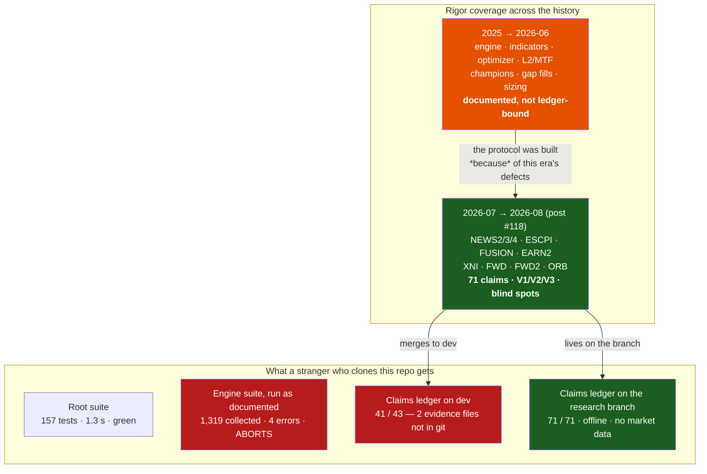

# POSITIONING AUDIT — round 2, re-evaluated against the WHOLE codebase

**Date:** 2026-08-29 · **Scope:** the entire `trading` repo (branch `dev` working tree + the
`research/legacy-18-baseline` worktree at `legacy18/`), not one workstream.
**Supersedes:** the initial positioning read given in chat on 2026-08-23 (session `034b5f77`, asked from
inside `legacy18` right after WS-ORB closed). That first pass was written from the *recent research* view.
This one was written after measuring the repository.

---

## 0. What I actually did this time (method)

The first audit was an informed opinion. This one is an audit: every claim below is a command that ran on
this machine today, and the counts are its output — not recollection.

| # | What I ran | Why |
|---|---|---|
| 1 | `git ls-files` inventories, `wc -l` over tracked Python | measure the real size and composition |
| 2 | `python3 -m pytest --collect-only` at the repo root | does the documented test suite work? |
| 3 | `python3 -m pytest --collect-only` inside `subprojects/Parametric-Indicators/` | does it work *the way the docs tell you to run it*? |
| 4 | `python3 optimize/verify/run.py` in **both** trees | can an outsider re-derive the published numbers? |
| 5 | `python3 optimize/verify/run.py --selftest` | is the verification gate itself capable of failing? |
| 6 | `git grep` secret scan over tracked files; `git check-ignore` on `keys.env`, `*.ovpn` | is a PUBLIC repo safe to be public? |
| 7 | `gh repo view`, `gh release list`, `git tag`, `CITATION.cff`, `.zenodo.json` | is the citable artefact actually citable, and current? |

Two of those runs changed the verdict materially (items 3 and 4). That is the point of doing it twice.

---

## 1. The bottom line, in one paragraph

**The original audit was right about the ceiling and wrong about the floor.** The evaluation machine is
even better than I claimed — I ran it, offline, with no market data on this box, and it re-derived
**71 out of 71 published numbers from committed evidence**, then proved it can still fail by rejecting
**5 out of 5 real historical defects**. Almost nothing in quantitative finance, and very little in any
research field, can do that. But that machine is **an era of this repository, not a property of it**.
It covers the ten workstreams since 2026-07; it does not cover the engine, the optimizer, the indicator
library, the champions, or the sizing work that make up the bulk of the code and most of the years. And
on `dev` — the branch that becomes `main`, gets tagged, and receives the Zenodo DOI — **the same ledger
is red: 41/43**, because two claims' evidence files are excluded by a hand-maintained `.gitignore`
allowlist and exist only as untracked files in one local worktree. The strong positioning sentence is
defensible about **the method**; it is not yet defensible about **the artefact people would download**.

---

## 2. Verdict on each claim in the original audit

| Original claim | Verdict | Evidence measured today |
|---|---|---|
| "Below institutional quant in infrastructure and breadth" | **CONFIRMED** | 9 instruments, 1-minute/1-second bars, no order-book data, no execution venue. Unchanged. |
| "Above published academic backtests in rigor, and it's not close" | **CONFIRMED — for the post-#118 era only** | 35 pre-registration documents in `legacy18/docs/`, 13 on `dev`; verdict rules frozen before runs; ORB's 0/225 null got the full apparatus. |
| "A 71-claim ledger where every number re-derives from committed evidence" | **CONFIRMED AND UPGRADED** | `optimize/verify/run.py` → `71/71 claims pass`, **run offline on this laptop with zero market data**, reading committed JSON/CSV. 118 tracked evidence files for WS-FWD alone; 8 for ORB. |
| "Three verifications that must fail for different reasons; V3 the falsifier" | **CONFIRMED, and enforced in code** | `harness.py` refuses a claim with no declared `blind_spot`; `Check.__post_init__` rejects any kind outside V1/V2/V3. It is a schema, not a convention. |
| "A gate that has never failed is untested" | **CONFIRMED** | `run.py --selftest` → `5/5 historical defects correctly rejected`, each for the right stated reason (missing blind spot, points-vs-percent units, reuse of a retracted figure…). |
| "Negative results as first-class citizens" | **CONFIRMED** | ORB: prior-art pass → pre-registration → 225-cell grid → claim → report → shareable bundle → release, for a result of *nothing works*. |
| "Outsiders can verify logic but not numbers" | **CORRECTED — this understated the repo** | Outsiders **can** re-verify every published number against its evidence file (that is exactly what I did). What they cannot do is recompute the evidence from raw price data, which is licensed and server-only. Those are two different tiers and the repo does not currently say so. |
| "The most methodologically rigorous *open* futures-strategy research program in existence" | **DOWNGRADED to: the most rigorous open *evaluation protocol* — applied to the ten workstreams since 2026-07, not to the repo's history** | The ledger's 71 claims all belong to workstreams NEWS2/NEWS3/NEWS4/ESCPI/FUSION/EARN2/XNI/FWD/FWD2/ORB — i.e. 2026-07 onward. The box engine, the 165-indicator registry, MAP-Elites, L2/MTF fusion, gap-aware fills, champion selection and the sizing studies are documented in ~190 `docs/*.md` + ~363 engine `*.md` — and **none of those numbers are ledger-bound**. |
| "Single team, no external replication" | **CONFIRMED, and starker than stated** | Repo is PUBLIC with **0 stars**. No external eyes have looked at it at all — not a rigor problem, a distribution problem. |
| "Headline finding is negative space" | **CONFIRMED** | ORB 0/225 positive; regime HMM, Chronos-2 vol gate, TimesFM fusion, daily boxes all NO-GO; WS-FWD forward window −$63.5k at $25/rt. The confirmed positives remain the CPI news premium, forecastable move size, and the vol-seeking nature of the box edge. |

---

## 3. What the whole-codebase view adds (the seven findings)

### 3.1 The ledger is GREEN where the work happened and RED where it ships ⚠️⚠️

```
legacy18 (research/legacy-18-baseline):  71/71 claims pass
dev      (what merges to main + DOI):    41/43 claims pass
```

The two failures are `TV-PREVIOUS-IS-POINT-IN-TIME` and `TV-FORECAST-NOT-COPIED-FROM-ACTUAL` (#120).
Both die the same way:

```
FileNotFoundError: .../optimize/fundamentals/forecast_previous_nfp.csv
```

Root cause, traced: `.gitignore:44` ignores `*.csv` wholesale, and evidence files are re-admitted one at a
time by explicit `!` negations — there are 24 such negation lines. `forecast_previous_nfp.csv` was simply
never added to that allowlist, so it exists **only as an untracked file in the `legacy18` worktree**,
generated 2026-08-08 and never version-controlled anywhere.

Why this matters more than a missing file: the harness's own docstring says `value_fn` *must read the
committed artefact*. Two claims currently read an uncommitted one. It is precisely the defect class #118
was created to kill — a check that passes in the place it was written and cannot pass anywhere else — and
the ledger caught it the moment it was run in a second location. **The machine works; the allowlist has a
hole.**

### 3.2 The test suite does not run the way the docs tell you to run it

| How you run it | Result |
|---|---|
| From the repo root (`pytest`) | **157 tests collected in 1.28 s**, clean |
| From `subprojects/Parametric-Indicators/` — what `CLAUDE.md` and `README.md` both instruct | **1,319 collected, 4 collection errors, `Interrupted`** — the run aborts |

Three separate causes, all verified:

1. `pytest.ini` lives at the repo root, and its `testpaths` / `norecursedirs` protection only applies when
   pytest is *invoked* from the root. Started from inside the engine, it collected **103 items from
   `server-audit/`** — the archived historical copies the config comments explicitly warn about.
2. One error is a hard `FileNotFoundError` for `ALL_STOCKS/.../GC_4h.csv` at **import** time. Since the
   market data went server-only (2026-08-22), a data-dependent test that used to skip now kills
   *collection*. The root suite handles this correctly ("skipped automatically if data files are
   missing"); the engine suite does not.
3. At least one test module prints a full scraped earnings comparison report **during collection** —
   import-time side effects in test files.

Net effect for the positioning: a stranger who clones this repo cannot get a green test run, from either
of the two documented entry points, without insider knowledge. For a repo whose central claim is
verifiability, that is the single most damaging gap on the list — larger than 3.1, because 3.1 is one file
and this one is the first thing any reviewer does.

### 3.3 A third of the tracked Python is copies of the other two-thirds

```
141,341 tracked Python LOC
 ├── 89,570 (63%)  live code
 ├── 42,978 (30%)  shareable/ bundle snapshots — 265 files, their own engine.py / strategy.py / payload.py
 └──  8,793 ( 6%)  server-audit/ historical archive — 108 files, deliberately frozen
```

Both copy sets are *intentional and defended in writing* (the `.gitignore` comment explains the
server-audit archive was requested so the deployed champions stayed reproducible; the bundles are what
gets handed to other people). That is a good reason — but the consequence is that a reader cannot tell the
live engine from its snapshots without reading `pytest.ini`'s comments, and `shareable/playbooks_backtester/engine.py`
(625 LOC) will silently drift from `engine.py` (774 LOC). Add ~19 committed `.zip` bundles in `playbooks/`
and `shareable/`. A repo positioned as a *framework* should not ship three engines and nine zips of itself.

### 3.4 There are two live stacks and the front door describes only one

`README.md` says: *"The frozen v1.x era (`src/main/`) is preserved under the v1.0.0 tags."* In fact
`src/` on `dev` holds the **live deployment layer**:

- `src/deploy/release_executor.py` — the news-release executor (ES/YM/NQ/RTY), shipped v5.3.0–v5.4.2
- `src/deploy/power_forecast.py` — the M2 power model, **deployed** in v5.4.3 (last commit `71db660`, FU-14)
- `src/deploy/regime_monitor.py`, `schedule.py`, and the 157-test root suite that covers `src/strategy/`

`src/deploy` is referenced by 4 docs, the `news-release-long` playbook and its `champion.json` — and is
mentioned **zero times** in `README.md`, `AGENTS.md`, or `START-HERE.md`. The claim `FU14-POWER-FORECAST-DEPLOYED`
in the ledger literally cites `src/deploy/power_forecast.py` as its source. So the citable artefact's front
page misdescribes the location of the only code that touches a live account.

### 3.5 Rigor coverage is very uneven across subprojects

| Subproject | Python files | Test files | Under the claims ledger? |
|---|---:|---:|---|
| `Parametric-Indicators` (the engine) | 889 | 193 | partially — post-#118 workstreams only |
| `meta-prophet` | 48 | 6 | no |
| `timesfm-fusion` | 23 | **0** | no (NO-GO verdict, unverified) |
| `wsg-strategy` | 21 | 2 | no |
| `signals` | 17 | 6 | no |
| `all-stocks-signals` | 13 | 4 | no |
| `regime-edge` | 13 | **0** | no (one file *is* cited by FU-13's claim) |
| `regime-hmm` | 3 | **0** | no (NO-GO verdict, unverified) |
| `chronos2-vol` | 2 | **0** | no (NO-GO verdict, unverified) |
| `frontend/` (Vue + Vite) | — | 12 vitest specs | n/a |

The three parked NO-GO studies (Chronos-2 vol gate, regime HMM, TimesFM fusion) are *conclusions the
project acts on* — they closed off whole research directions — and they have neither tests nor claims.
They are the pre-protocol era's outputs, trusted on the strength of their write-ups.

### 3.6 What the repo gets right that the first audit never checked

- **Secret hygiene:** a scan of every tracked file for key/secret/password/token literals returns **0
  hits**. `keys.env` (`.gitignore:147`) and `kw-full (2).ovpn` (`.gitignore:154`, `*.ovpn`) are both
  ignored and untracked. For a PUBLIC repo carrying a live-trading VPN profile and API keys in the working
  directory, this is the failure that would have ended the project, and it did not happen.
- **Open-science metadata is real, not decorative:** AGPL-3.0-or-later, `CITATION.cff` with ORCID,
  `.zenodo.json`, concept DOI `10.5281/zenodo.21473312`, 36 tags, GitHub Releases with written notes
  through v5.5.1, CI running on `dev` and `main`.
- **CI is honest about its own limits:** `ci.yml` states in comments that it byte-compiles and
  import-smokes only, because the data is server-side, and names where the real gates run instead. Most
  projects let a green badge imply more than it means; this one writes the disclaimer into the workflow.

### 3.7 The citation metadata is three releases stale

`CITATION.cff` says `version: 5.2.0`, `date-released: 2026-07-27`. The latest release is **v5.5.1
(2026-08-20)** — v5.3.0, v5.4.x and v5.5.x shipped since. `README.md`'s sample citation still quotes the
v5.2.0 DOI. Anyone citing the repo today, using the button GitHub renders from that file, cites software
that is three minor versions behind what they downloaded. Cheap to fix; embarrassing in a paper.

---

## 4. The picture



---

## 5. The revised positioning

### In algorithmic trading specifically

> **An open, pre-registered, self-falsifying research programme in systematic futures trading —
> sub-institutional in resources, super-academic in method — whose contribution is not a strategy but a
> referee: an executable claims ledger that re-derives every published number from committed evidence and
> is itself proven to fail on known defects. Applied in full since 2026-07; the earlier engine, optimizer
> and champion work is documented to an ordinary-good standard and is not yet under the ledger.**

That sentence is defensible line by line, *including* the concession — and the concession is what makes
the rest credible. The original sentence claimed the whole repo; a reviewer who ran `pytest` from the
engine directory would have found the soft floor in ten minutes and discounted everything else.

### In data science generally

Unchanged in substance, sharpened in claim:

> **A worked instance of registered-report methodology and claims-as-code, carried out in one of the most
> hostile inferential domains that exists (non-stationary, adversarial, near-zero signal-to-noise), where
> the null results receive the same apparatus as the positive ones.**

The strongest single artefact to point at is not any finding — it is `optimize/verify/harness.py` +
`selftest.py`. A verification harness that ships with a proof of its own ability to fail is genuinely rare
outside safety-critical engineering, and the "declare your blind spot or the claim will not run" rule is a
better idea than most of what the reproducibility literature proposes, because it is enforced by an
exception rather than by a reviewer's goodwill.

### The honest weakness sentence (say this before someone else does)

> Single author plus agents; zero external replication; the price data is licensed and cannot be
> redistributed, so evidence is re-checkable but not recomputable; the deployed strategies decay forward
> (WS-FWD: +$29.8k raw → −$63.5k at $25/round-trip); and the rigor is an era, not yet the whole history.

---

## 6. What would make the strong version true, in order

Ordered by *how much positioning each unlocks per hour of work*, not by size.

1. **Make the engine suite collectible from a fresh clone.** Add a `pytest.ini` (or `conftest.py`) inside
   `subprojects/Parametric-Indicators/` carrying the same `norecursedirs`, and make the data-dependent
   modules skip instead of raising at import. This is the first thing any reviewer touches.
2. **Turn `dev`'s ledger green.** Add `!subprojects/Parametric-Indicators/optimize/fundamentals/forecast_previous_nfp.csv`
   to the allowlist and commit the file. Then **replace the allowlist with a rule**: every path a `Claim.source`
   names must be tracked — a five-line check inside `run.py` that fails the ledger when its own evidence is
   untracked. That closes the class, not the instance.
3. **Run the ledger in CI.** It needs no market data — proven today. A public green "71/71 claims re-derive"
   badge is the single highest-value signal this repo could show a stranger, and it is nearly free.
4. **Fix the front door.** `README.md`: describe `src/deploy/` as the live deployment layer, not the frozen
   v1 era; state the two reproducibility tiers explicitly (evidence re-derivation = anyone, offline · raw
   recomputation = server-only, licensed data); name where the tests actually run from.
5. **Refresh `CITATION.cff` to v5.5.1** and update the README citation block.
6. **Label the copies.** A one-paragraph `README` in `shareable/` and `server-audit/` saying "snapshot,
   not live — the live file is X" would remove the largest source of reader confusion for 20 minutes of work.
7. **Backfill claims for the load-bearing older results** — the deployed champion set, the gap-fill model,
   the three NO-GO verdicts. Not all of it; just the results the project still *acts on*. Each one moves a
   slice of history from "documented" to "ledger-bound", and each one directly buys back the word that had
   to be removed from the positioning sentence.

Items 1–5 are hours, not days, and together they convert the caveat in §5 from "the rigor is an era" to
"the rigor is the repo".

---

## 7. What went well / what went wrong (this audit)

**Went well**
- Re-running instead of re-remembering changed two verdicts. The offline 71/71 upgraded a claim I had
  understated; the 41/43 on `dev` demolished a claim I had overstated. Neither was visible from reading.
- The repository's own instrument found the repository's own defect: the ledger flagged its missing
  evidence file the first time it was executed somewhere other than where it was written.
- The safety-critical checks (secrets, licence, data leakage into a public repo) came back clean.

**Went wrong / what I'd flag about the first audit**
- The first audit was written from inside `legacy18` immediately after a triumphant workstream, and it
  generalised that workstream's standard to the whole repository. That is exactly the sampling error
  `harness.py` demands every claim declare — *"verified with no denominator is not a result"* — and the
  audit itself had no denominator. It stated a population-level claim ("this repo is…") from a sample of
  one era.
- It also never checked the three things a hostile reviewer checks first: does the test suite run, does
  the verification run outside its home directory, and is the citation metadata current. All three had
  problems.

---

*Method note: every number in this document was produced by a command run on 2026-08-29 against this
working tree; the two ledger runs and the collection runs are saved in the session scratchpad. No number
here is quoted from memory or from a previous report.*

---

# ROUND 3 — re-measured after the merge (2026-08-30)

**Scope:** the single root `/mnt/data/projects/trading` on `dev` = `main` = **v5.6.0** (the research branch
merged and deleted 2026-08-23; the `legacy18` worktree removed). Every number below is the output of a
command run on 2026-08-30 against this tree. Tracking issue **#189**; backfill parked as **#190**.

## R3.1 What the merge changed on its own — and what it broke

| audit item | before (2026-08-29) | after the merge, before fixes | after fixes (2026-08-30) |
|---|---|---|---|
| ledger on the branch that ships | `dev` 41/43 (2 claims read an untracked file) | **69/71** — the untracked file was **lost** with the worktree (it existed nowhere else: not on the server, not in any archive) | **71/71**, and the ledger now *refuses* untracked evidence |
| ledger self-test | 5/5 | 5/5 | 5/5 |
| engine suite from the documented entry point | 1,319 collected, 4 errors, aborts | 1,331 collected, **5** errors, aborts (a hard-coded `legacy18/…` path in one test + the archive) | **1,069 collected, 0 errors; full run 908 passed / 162 skipped / 0 failed** (first clean run: 104 failed + 5 errors, every one a missing server-only data file → now an explicit SKIP naming the path) |
| root suite | 157 collected, green | 157 collected, green | 131 passed / 26 skipped (data absent), green |
| CITATION.cff | 5.2.0 | 5.6.0 (bumped in the merge) | 5.6.0 **with the v5.6.0 Zenodo DOI** `10.5281/zenodo.22161256` (minted 2026-08-29) |
| README citation block / front door | v5.2.0 DOI; `src/` described as frozen v1 | unchanged | v5.6.0 DOI; `src/deploy/` = live layer; two reproducibility tiers; where tests run; CI badge |
| ledger in CI | no | no | `claims-ledger` job (self-test + ledger, data-free) |
| snapshot copies labelled | `server-audit/` only | same | `shareable/README.md` added |

The merge made §3.1 *worse* before it got better: the evidence file that round 2 found untracked in the
`legacy18` worktree was deleted with that worktree. It was not "in one local worktree" any more — it was
gone. Recovery: `optimize/fundamentals/forecast_previous_check.py` regenerates it from ALFRED point-in-time
vintages (the St. Louis Fed archive is immutable), and the regenerated NFP file re-derived the two ledger
values **to the digit** — 0.992 (point-in-time match rate) and 0.0079 (exact-zero-surprise rate). The
sibling series (durables, retail, CPI) were regenerated the same way; all four are now committed and
allowlisted. That the numbers came back identical is itself evidence the original evidence was what the
claims said it was.

## R3.2 The class fix, not the instance fix

`optimize/verify/run.py` gained `evidence_tracked()`: every path-like token in every claim's `source`
must resolve (braces and `{INST}` placeholders as wildcards, bare `shots/`-style tokens relative to the
previous path) to at least one **git-tracked** file, or the ledger exits non-zero. On the tree as merged it
reported exactly the two real offenders and nothing else; after the commit it reports none. The rule runs
in CI on every push and PR, so the defect class that round 2 found — *"passes where it was written, cannot
pass anywhere else"* — is now structurally impossible to merge.

## R3.3 Why the engine suite needed three layers, not one

`norecursedirs` in an engine-local `pytest.ini` did **not** stop pytest 9 from walking `server-audit/`
(96 archive items still collected); neither did `--ignore` in `addopts`, nor `collect_ignore_glob` in an
engine-root `conftest.py` — all three measured. What holds is `testpaths` naming the live test directories
(`indicators optimize research tests test_provenance.py test_roots.py`): collection never enters the
archive at all. The other two layers stay as belt-and-braces. The two live-tree import-time failures were
real defects, both fixed at the source: a test with an absolute path into the retired worktree (now relative
to its own file and skipping when the table is absent) and the dashboard test that preloads market data on
import (now skips when the data root is absent, as the root suite already did).

Collecting clean was not the same as running clean. The first full run from the engine directory gave
**104 failed + 5 errors** — re-run with one-line tracebacks: 208 `FileNotFoundError`s and 2 path-existence
assertions, **all** pointing at the server-only market data (`Full_Canldes_Data/…` ×193, `data/…` ×10,
`ALL_STOCKS/…` ×4). Not one genuine defect. The root suite already treats "the data file this test needs is
not here" as a skip, test by test; the engine suite now does the same through one `conftest.py` hook that
converts a data-path `FileNotFoundError` into a SKIP naming the path (any other `FileNotFoundError` still
fails). Result: **908 passed, 162 skipped, 0 failed**. The 162 skips are the honest count of tests that can
only run on the server — visible, not hidden.

One more defect the run surfaced: the repo's own #94 guard (`test_roots.py`) failed because **my** WS-FWD and
WS-ORB scripts (and two older FU scripts) carried server paths as literals. Fixed to env-driven roots
(`WSH_16Y_ROOT`, `WSH_DATA_BASE`); the guard passes again.

## R3.4 The revised positioning, round 3

The concession in §5 ("the rigor is an era, not yet the repo") stands — #190 is what would retire it. But
the **artefact** caveat from §1 is gone: what a stranger downloads at v5.6.0 now (a) collects and runs its
tests green from both documented entry points with no data (908 passed / 162 skipped engine; 131 / 26 root), (b) re-derives all 71 published numbers offline,
(c) proves its own gate can fail, and (d) will not accept a claim whose evidence is missing — and CI says so
on every commit. The sentence that round 2 could defend only about *the method* is, for the post-#118 era,
now defensible about *the download*.

> **An open, pre-registered, self-falsifying research programme in systematic futures trading — sub-institutional
> in resources, super-academic in method — whose contribution is a referee: an executable claims ledger that
> re-derives every published number from committed evidence, refuses evidence that is not in the repository,
> and ships with a proof of its own ability to fail. Applied in full since 2026-07 (71 claims); the earlier
> engine, optimizer and champion work is documented to an ordinary-good standard and is not yet under the
> ledger (#190).**

## R3.5 What went wrong in this round

- Retiring a worktree with `git worktree remove` (the owner used the forced form) silently deleted the only
  copy of an evidence file that a committed claim depended on. The ledger noticed within an hour, and the
  file was recoverable only because its producer is deterministic against an immutable public archive. Rule
  added to memory: **before removing any checkout, run the ledger's evidence-tracked check from a second
  checkout.** The rule now exists in code precisely so this cannot recur unnoticed.
- The first audit's positioning sentence was written from inside one era; round 2 corrected it; round 3 had
  to fix the artefact the sentence describes before the correction could be reversed. Three passes for one
  sentence is the right number when the sentence is going into a citation.
