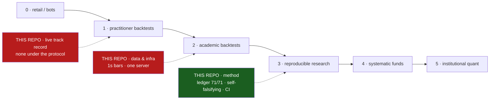

# POSITIONING — where this repository sits in the field, rung by rung

**Date:** 2026-08-30 · **Basis:** the measured positioning audit (`docs/POSITIONING-AUDIT-2026-08-29.md`,
rounds 2–3, issue #189) and the claims ledger (`subprojects/Parametric-Indicators/optimize/verify/`, 71/71,
re-run in CI on every commit). Every cell below names the evidence it rests on. Issue #192.

## 1. The ladder

The field is a ladder of six rungs. What moves a project up a rung is not a better idea — it is what the
project can *prove*, and to whom.

| rung | who lives here | what gets you onto the rung | what the rung cannot do |
|---|---|---|---|
| **0 · Retail / bot culture** | signal sellers, "profitable EA" pages, prop-firm marketing | a screenshot | show a verified track record. Persistent futures day-traders lose ~97% of the time (Chague, De-Losso & Giovannetti, Brazilian index futures). |
| **1 · Practitioner backtests** | blogs, TradingView/QuantConnect scripts, vendor "playbooks" | code that runs on one window | model costs, control for selection, replicate. In our ORB prior-art pass (`docs/WS-ORB-PRIOR-ART.md` §2) the practitioner claims were refuted 0-3. |
| **2 · Published academic backtests** | SSRN / journal strategy papers | editor review, a citation | out-of-sample, slippage, pre-registration, replication. The canonical ORB paper assumed zero slippage; its edge is ≈ 7 ¢/share and disappears at 2 ¢; 76% of its P/L came from one year (`docs/WS-ORB-PRIOR-ART.md` §1, rows 1–6). |
| **3 · Reproducible research programmes** | open quant-research groups; registered-report style work | evidence + code + falsifiable claims; null results published | trade at size; own proprietary data or latency |
| **4 · Systematic funds / CTAs** | mid-size quant funds, trend-followers, systematic prop desks | **audited live returns over years**, real execution, a risk desk | market-make; hold edges at sub-second timescales |
| **5 · Institutional quant / market makers** | Renaissance (Medallion), Citadel, Jane Street, Virtu, Jump, Optiver | audited decades (Virtu's IPO filing: 1 losing day in 1,238), colocation, order-book data, hundreds of researchers | let outsiders in (Medallion capped near $10B and closed) |

## 2. Where this repository sits — per dimension

| dimension | rung | evidence |
|---|---|---|
| **Method / verifiability** | **3 — top of the rung** | 71 claims re-derive offline from committed evidence (`optimize/verify/run.py`, CI job `claims-ledger`); the gate proves it can fail (`--selftest`: 5/5 historical defects rejected); it refuses evidence not in git (`evidence_tracked()`); 35+ pre-registrations filed before runs; every claim carries V1/V2/V3 (the third a falsifier) and a declared blind spot (`harness.py` enforces both); null results get the full apparatus (`docs/WS-ORB-REPORT.md`: 0/225 cells, prior art → prereg → grid → controls → claim → bundle → release). Rung-2 papers do none of this; no rung-5 firm does it *in the open*. Since #190 the load-bearing pre-protocol results are ledger-bound too, as explicit RECORDS (`BEST-SET-SELECTION-RECORD`, `GAP-FILLS-RISK-TRUTH`, `NOGO-VERDICTS-ON-RECORD` — 74 claims total): what was decided is pinned and falsifiable even where the original study predates the protocol. |
| **Breadth tested to a verdict** | 3 | 9 futures; a 16-year 1-second/1-minute tape; a 165-indicator registry; ~15 workstreams; six literature strategies carried to a verdict (ORB, regime HMM/Jump, Chronos-2 vol gate, TimesFM fusion, daily boxes, intra-candle veto — `docs/PROGRESS-RECORD.md`). Rung 5 tests thousands of signals; per signal, most rung-2 work tested less carefully. |
| **Data and infrastructure** | 2–3 | 1-second bars, one compute server, no order-book data, no venue, no colocation (`docs/DATA-AND-KNOWLEDGE-MAP.md`). This is a ceiling: rung 5 is not reachable on minute bars. |
| **Live track record** | **1** | One live account, run *outside* the protocol — the superseded `wsh4` parameter set, a sizing rule the engine never had (qty 2–9), bracket exits: −$22.5k over six weeks; the engine on his own parameters, same window, 1 contract: +$17.5k (WS-LIVE-PARITY #182; analysis local-only). There is **no audited live curve run under the protocol**. This single fact holds the repo below rung 4. |
| **Edge found, after costs** | 2–3 | Confirmed positives are small and specific: the CPI release premium (`P1-CPI-ENGINE`, `ESCPI-ES-BATTERY-PASS`), forecastable move size (`P2-POWER-MODEL-CONFIRMED`, `EP1-EARNINGS-POWER-FORECASTABLE`), the 4h rung and ES surviving $25/round-trip on the forward window (`FWD2-FRESH-WINDOW`). The deployed champions decayed forward to 17.6% of their selection-window rate (t = −2.53). Honest; not yet a business. |
| **Recognition / distribution** | 0 | Public, AGPL-3.0, DOI-versioned (concept DOI `10.5281/zenodo.21473312`, v5.6.0 `10.5281/zenodo.22161256`); 0 stars; no external replication. Nobody has looked. |

## 3. The position, in one sentence

> **Rung 3 — the top of the reproducible-research rung: above essentially every published strategy paper on
> method, and below every real fund on the two things funds are judged by, an audited live curve and
> execution infrastructure. A referee of rung-5 quality strapped to a trader with a rung-1 track record and
> rung-2 data.**

## 4. The two gaps, and whether they close

Both gaps are gaps of *process*, not of ideas — and only one of them has a ceiling.

### Gap A — the live curve (rung 3 → 4). Closable.
What rung 4 requires is not a new strategy; it is **the existing protocol run live, unchanged, long enough to
be judged**:
1. one contract, the deployed champion set, the engine's own exits (the three things the live account
   changed — WS-LIVE-PARITY §4);
2. every fill reconciled against the engine by the live-parity tool (`optimize/live_parity/`, local), so
   execution slippage is measured rather than assumed;
3. the stressed-cost verdict rules applied to the live book as they are to backtests (no positive without
   controls, no negative without power) — 6–12 months at the 4h/ES rung is the first window that can carry a
   verdict at all (per-trade MDE ≈ $1,000 on 4h slots over 2.5 months: `docs/WS-FWD-ROUND2-REPORT.md` §3.1);
4. the recalibration cadence decided (#179 queue: vol-gate quantiles, ES re-selection) and pre-registered
   as part of the recipe — or #186's walk-forward study run first, so the recipe is the thing being tested.

The honest caveat: the process is closable; the *outcome* is not guaranteed. The forward window says the
fleet's edge after friction is thin. A live curve run under the protocol may come back flat or negative —
that would be a rung-3 result of the highest quality and still not rung 4. What it cannot do any more is
come back *unverifiable*.

### Gap B — data and infrastructure (rung 4 → 5). Bounded.
Rung 4 needs execution and a risk desk, which a broker gateway and the existing risk findings (RISK-02
single-trade ruin, 1-contract sizing) supply. Rung 5 needs order-book data, colocation and the capital to
make markets — none of which a research programme on minute bars can build its way into. This gap is a
choice of sport, not a defect: the repository's edge is being the referee, and the referee does not need a
microwave link.

### What "our real position" therefore means
- **Reachable, on the current road:** rung 4 in the honest sense — a *verified* systematic track record under
  a public protocol, positive or not. Every prerequisite except time and a gateway already exists.
- **Not reachable, and not the goal:** rung 5.
- **Already true today, and citable:** rung-3 top on method (`docs/POSITIONING-AUDIT-2026-08-29.md` R3.4).
  The method-side concession was retired on 2026-08-30: the load-bearing pre-protocol results (the deployed
  champion set, the gap-fill risk model, the three NO-GO verdicts) are ledger-bound as **records** (#190,
  claims ×3, ledger 74/74) — pinned and falsifiable, honestly labelled as the ledger's weakest tier because
  their studies predate pre-registration. The gap-filling programme itself is `docs/RUNG4-ROADMAP.md` (#194).

## 5. The honest-weakness sentence (say it before someone else does)

> Single author plus agents; zero external replication; the price data is licensed and cannot be redistributed,
> so evidence is re-checkable but not recomputable by outsiders; the deployed strategies decay forward; the only
> live account so far was not run under the protocol; and the rigor covers the workstreams since 2026-07, not
> yet the whole history.
