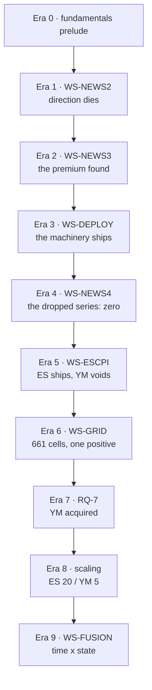

# The Complete Experiment Report — every experiment, its results, outcomes and insights

**Written 2026-08-20 by owner order ("full detailed in depth verbose report documenting every
single experiment and its results and outcomes and insights"). This is the NARRATIVE
companion to the master index (`NEWS-MASTER-EXPERIMENT-RECORD.md`): where the index gives one
row per experiment, this report tells each experiment's story in plain language — what we
did, what happened in dollars, what went well, what went wrong, and what we learned. Every
number here already lives in a committed evidence file or the claims ledger (64/64 on both
machines); nothing is from memory.**

---

## Era 0 — the fundamentals prelude (before the news programme existed)

Five studies from the project's fundamentals period seeded everything that followed.

### 0.1 · Fundamental analysis — does the macro picture predict the box strategy?
**What we did:** tested whether macro-economic levels (rates, inflation prints, growth data)
carry information the box strategy could trade on. **What happened:** nothing tradeable —
the macro picture is already in the price by the time any strategy could act on it.
**The accidental discovery that mattered more than the question:** while dissecting losing
trades we measured that **94% of the box book's stop-outs happen inside a single second** —
a violent sweep touches the stop and the trade is gone before a 1-minute bar can even show
it. **Insight:** this one number justified buying and wiring 1-second data through the whole
programme, and years later it is why the news executor, the scaling studies and FU-15's risk
analysis all speak in seconds.

### 0.2 · The GC replication — gold vs macro surprises
**What we did:** replicated a published claim that gold reacts to macro surprises.
**What happened:** it does — INVERSELY (surprise up, gold down), Spearman −0.193. Pearson
correlation saw nothing because the data's fat tails blind it. At our cost line the effect
is un-tradeable. **What went well:** the replication discipline held — we confirmed the
phenomenon before judging its tradability. **Insight:** on fat-tailed market data, always
report rank correlation beside Pearson; a real effect can hide entirely from one of them.

### 0.3 · Session and own-distribution studies
**What we did:** asked whether time-of-day session structure is a tradeable edge for the
box. **What happened:** the sessions are REAL in the tape (volatility and risk cluster by
session) but produce no entry edge, because the per-trade P&L tail is enormous — a single
trade routinely swings ±$1,600, and that variance defeats every weak conditioning signal.
**Insight:** an edge must be large enough to survive the book's own tail; "statistically
present" is not "worth money".

### 0.4 · The h1a pre-event stop-out scan
**What we did:** measured, per instrument (8 of them), how much stop-out risk sits in the
minutes before scheduled events. **What happened:** a per-instrument risk map. **Outcome:**
this map later shaped GAP-01 — the rule that gapped stop/TP fills execute at the bar OPEN,
not at the imaginary line — which repriced the whole book's drawdown +9.8% (the old model
had understated risk; P&L was unchanged). **Insight:** honesty about fills costs nothing in
P&L and buys a true risk picture.

### 0.5 · The EIA/API mechanism probe
**What we did:** watched crude oil (CL) around its weekly inventory releases. **What
happened:** the releases move CL violently and reliably. **Outcome:** energy stayed in every
later funnel because of this observation — and era 6 finally measured what the violence is
worth (nothing; see 6.2). **Insight:** an observation is a reason to TEST, never a reason to
believe.

---

## Era 1 — WS-NEWS2 (#114–#123): building the calendar, and the death of direction

The first news workstream had to build its own instrument (a trustworthy events calendar)
before it could ask its question — and the question ("can news predict direction?") died
completely.

### 1.1 · Source evaluation — eight calendar providers audited
**What we did:** evaluated 8 providers of historical economic-calendar data. **What
happened:** seven failed — HTTP 403 walls, missing timestamps, date arithmetic bugs.
**TradingView won**: real per-event UTC timestamps with DST correctly encoded. **Insight:**
the calendar IS the experiment; a wrong timestamp doesn't weaken a study, it silently
replaces it with a different study.

### 1.2 · Calendar verification — the DST trap
**What we did:** wrote `tv_calendar.py --verify` and checked the chosen calendar against
known release schedules. **What happened:** ⚠️ **2013–2015 summer timestamps are one hour
late** — the vendor back-filled old years with a fixed UTC offset, ignoring daylight saving;
87 series are affected. **The trap inside the trap:** NFP alone passes verification even
when 90% of the calendar is broken (NFP is always 8:30 in both regimes) — so a single-series
spot check would have blessed a broken instrument. **Outcome:** the programme-wide **≥2016
rule** — no study touches pre-2016 calendar timestamps. **Insight:** verify the instrument
with a sample that can actually fail.

### 1.3 · The provenance battery — is the vendor's data point-in-time?
**What we did:** checked whether TradingView's `previous` and `forecast` columns are what a
trader would have known BEFORE each release (against the Fed's ALFRED archive). **What
happened:** `previous` proved point-in-time on 4 series. `forecast` is UNVERIFIABLE — no
archive of pre-release consensus exists to check it against. **Outcome:** an honest standing
blind spot, inherited and declared by every later study that touches `forecast`. **Insight:**
a blind spot you cannot close must be written down, not walked around.

### 1.4 · The 643-pair direction scan — the workstream's main result
**What we did:** pre-registered and ran the full grid: 82 news series × 8 instruments, every
combination tested for post-release DIRECTION predictability from the surprise. **What
happened:** the surprise explains the release-minute JUMP beautifully (correlations to
−0.63) — and **nothing after it**. Direction edge was excluded at 95% confidence on all
643 pairs. Four different attack angles, four real physical effects, zero tradeable ones.
**Insight — the fork in the road:** if the market instantly eats the direction information,
the exploitable quantity must be SIZING, not prediction. Everything the programme later
earned came from taking this fork seriously.

### 1.5 · The YM absence
**What we did / what went wrong:** YM (Dow futures) could not be tested — its 1-minute file
was 0 bytes. Nobody noticed for months because nothing consumed it. **Outcome:** repaired in
era 5 as a side effect of the 1-second rebuild. **Insight:** data that nothing reads rots
silently; a coverage census (era 4's N1) is the antidote.

---

## Era 2 — WS-NEWS3 (#117, #124–#126): the premium found

The owner's goal statement was re-read — and it turned out the actual question ("is there a
ride premium?") had never been tested. Three measured experiments later, the programme had
its first confirmed trade.

### 2.1 · The goal re-audit
**What we did:** closed the previous workstream against the owner's literal goal statement
instead of our internal summary of it. **What happened:** a gap — all the violence
measurements (POWER) had been quietly treated as answers to the money question (PREMIUM),
which had never been directly tested. **Insight — a meta-rule now enforced at every closure:**
close workstreams against the GOAL STATEMENT, not against the work that happened to get done.

### 2.2 · M1 — the ride-through grid
**What we did:** on 1-second bars, held a position through every release of 5 series on 5
instruments and measured what riding the announcement is worth, gross. **What happened:**
only **CPI** pays (the best NQ grid cell: +$463 gross per event with no take-profit).
Retail Sales came out NEGATIVE (−$98/event — flagged as odd, resolved in era 5 as real).
NFP is weak, FOMC about zero. **Controls:** quiet-minute placebos drawn against the FULL
39,000-minute calendar (so "quiet" really meant quiet), and the 8:30-seasonality floor was
measured and declared. **Insight:** the premium is not "news"; it is ONE series.

### 2.3 · M2 — the power model
**What we did:** asked what a trader can know the NIGHT BEFORE about tomorrow's release.
**What happened:** the move's SIZE is predictable — a deliberately dumb predictor (the
median of the same series' recent release-bar moves) ranks tomorrow's violence with
Spearman ≈0.5. Direction remains dead. **Outcome:** the programme's central law, **POWER ≠
PREMIUM** — and, two eras later, this exact model became the deployed power-forecast layer
(FU-14) and then one half of the fused engine (FU-11). **Insight:** the dumbest defensible
predictor first; if series identity + own history can't rank power, nothing pre-release can.

### 2.4 · M3 — the confirmed trade
**What we did:** pre-registered ONE trade (Bonferroni-corrected α/54, era half-split
required): LONG at release−300s, stop 0.10%, take-profit 0.40%, tie resolves to STOP, exit
at +900s, over {CPI, NFP, FOMC}. RTY was named the holdout and its data was not even loaded
until the registration was filed. **What happened:** NQ +$155.56/event gross (t=4.13), net
**+$133.06/event under stressed costs**; RTY confirmed independently (t=3.79). The shape of
the money: win rate only 36.4%, the MEDIAN event loses, the +4R tail pays for everything.
And the trade is strictly one-sided — the mirror short leg lost 18 of 18 tests. **Insight:**
a real edge can live entirely in a tail; and "enter both ways" was already knowably wrong
here (the fact FU-15 must reckon with).

### 2.5 · Controls and falsifiers battery
**What we did:** attacked 2.4 before believing it. **What happened:** consensus (forecast)
numbers are completely dead pre-release; clean-day controls ride to ≈$0; and we learned that
"no release that day" ≠ "no news at that minute" — controls must be drawn against the full
calendar. **Insight:** the control's definition is itself an experiment.

---

## Era 3 — WS-DEPLOY (#127–#132 → v5.3.0): the machinery ships

The confirmed trade became deployable software, with parity to the cent at every step.

### 3.1 · D1 — the release executor and the schedule
**What we did:** wrote the standalone executor + a committed release schedule, and replayed
history against the study's own logs. **What happened:** parity **NQ 327/327 and RTY 238/238
events exact**. One real discrepancy surfaced: on 2026-03-06, NFP and Retail share a minute,
and the study's tie-break depended on pandas' non-stable sort order — per-instrument
unstable. **Insight:** a sort order can be a scientific instrument; make every tie-break
explicit.

### 3.2 · The engine quantity hook
**What we did:** taught the P&L engine `pnl = pnl × pv × qty`. **What happened:**
byte-identical books at qty=1, linearity to the cent at any qty. **Insight:** the boring
proof (qty=1 unchanged) is what makes every later scaling claim trustworthy.

### 3.3 · D2 — the regime monitor
**What we did:** built the layer's safety brake — a rolling window of the last 24 CPI
events' net-stressed P&L; if the mean goes negative the layer STANDS DOWN, stickily.
**What happened:** GO at build time (+$1,231 rolling). One registration expectation FAILED
honestly: we predicted 2016-19 would trigger stand-down and it did not — recorded, not
patched. **Insight:** keep the failed prediction in the record; a monitor whose history was
retro-fitted protects nothing.

### 3.4 · The with/without measurement
**What we did:** measured what the news layer adds to the box book. **What happened:**
+31.1% profit for +6.6% drawdown on the 1-hour slot, with daily P&L correlation to the box
of only +0.098 — near-orthogonal income. **Insight:** orthogonality is the real prize; a
second uncorrelated stream is worth more than a bigger correlated one.

### 3.5 · D3 — scaling (quantities 5/10/20)
**What we did:** asked where size breaks the trade. **What happened:** the wall is the
QUIET ENTRY SECOND — the second before a release trades a median of only 7 NQ contracts,
while the violent exit second trades 231. A worked entry spread over 300 seconds sees a
median 1,531 contracts — easily fed. **Insight:** the market is thinnest exactly where the
trade wants to be subtle, and thickest where it must be violent; work the entry, never the
exit.

### 3.6 · D4 — worked-entry validation → the v5.3.0 ship
**What we did:** validated a VWAP-style entry worked over the 300-second lead. **What
happened:** NQ keeps 96% of its edge; RTY IMPROVES by +24% (its thin book rewards patience);
combined qty=20 pace ≈ $330k/yr model-grade. Shipped as v5.3.0 after golden 6/6 and
dashboard parity. **Insight:** working an entry is not a compromise — on thin tapes it is an
upgrade.

---

## Era 4 — WS-NEWS4 (#134–#138): every dropped series, tested to a verdict

The owner asked the complete question: did we skip anything? The answer required a census,
a powered scan, and a positive control — and produced the programme's most valuable ZERO.

### 4.1 · N1 — the coverage census
**What we did:** generated (from evidence, not memory) the matrix of what had actually been
premium-tested. **What happened:** 5 series of 237 — **11,822 untested release moments** in
92 groups. Traps found on the way: Jobless Claims carries TV-importance 0 (an importance
filter silently deletes it); title renames split one series into several; the unit of
scanning must be the MINUTE, not the event row. **Insight:** a coverage claim without a
census is a feeling.

### 4.2 · N2 — the wide premium scan
**What we did:** pre-registered a two-tier scan (10 Tier-1 blocks × NQ/RTY at α=0.05/20,
~79 Tier-2 blocks descriptive) over all untested series. **What happened:** **0 of 20 new
premiums.** Every Tier-1 block passes its jump gate (the tape moves 1.6–4.7× on those
minutes) and none of them pay. The minimum detectable effects ($67–$234) sit BELOW the
CPI-sized +$309 — these are **powered zeros**, not shrugs. **Insight:** the calendar is full
of violence and empty of payment; POWER ≠ PREMIUM at full scale.

### 4.3 · The positive control — the pipeline proves itself
**What we did:** pushed the already-deployed confirmed set through the identical new
pipeline. **What happened:** it reproduced **+$133.06/event to the cent** — and, before any
result was read, the control caught a live bug (the control gate had been coded two-sided
where the registration said one-sided; it wrongly vetoed CPI; fixed to the registered
wording; everything re-run). **Insight:** a positive control is the only thing that can
distinguish "no premium" from "broken pipeline" — it did both jobs at once.

### 4.4 · The CPI concentration measurement
**What we did:** decomposed the deployed set's profit by series. **What happened:** CPI
alone confirms on BOTH deployed instruments (NQ +$309/event net, RTY +$78); NFP and FOMC
alone never confirm anywhere. **Insight:** the deployed pool was carrying one engine and two
passengers — knowledge that shaped the ES (CPI-only) and YM (CPI-only) legs.

### 4.5 · N3 — the deep dives
**What we did:** 8 pre-registered follow-up tests across 5 instruments. **What happened:**
⭐ the **Retail Sales anti-premium is REAL** (gross −$86.10/event NQ, −$32.41 RTY, both era
halves negative, series-specific — not a cost artifact); Durables: powered nulls; **EIA/API:
definitive NO** (gross ≈ $0 across n=551/433 events while the tape jumps 5–8× — the era-0
observation finally priced); ES and GC pooled scans: no new surface; and **ES CPI-alone
(+$151/event, t≈3.0) filed as the formal promotion candidate** — era 5's seed. **Insight:**
a confirmed NEGATIVE (Retail) is tradeable knowledge too — it became FU-8's agenda.

### 4.6 · N4 — the reports
**What we did:** wrote the leveled bilingual report + the full record, cross-linked.
**Outcome:** the workstream closed against its goal statement (the 2.1 meta-rule, applied).

---

## Era 5 — WS-ESCPI (#139): ES ships, and the YM saga begins

### 5.1 · E1 — the pre-registration
**What we did:** BEFORE touching new data, fixed the rule: YM is the true holdout, and
*"ES ships only if YM passes or the owner explicitly accepts descriptive grade."*
**Insight:** the ship decision was written before the evidence could argue with it.

### 5.2 · I1+E3 — the corrupt YM file
**What went wrong:** the YM 1-second file ended mid-row on 2016-01-15 with 41MB of NUL
bytes. **What we did:** re-assembled it from the 10.8GB Databento raw archive. **The happy
side effect:** the historic 0-byte YM 1-minute frame (era 1.5) was fixed in passing — YM
became fully studyable for the first time. **Insight:** raw archives are the only real
backup; derived files inherit silent corruption.

### 5.3 · E4 — the ES robustness battery
**What happened:** ES CPI passes every gate — net +$151.37/event (p=0.0027), jump 20.5×,
the Retail falsifier correctly negative. Recent era: +$529.44/event, +$15,353.82 per
contract 2024→2026. **Insight:** the era-4 candidate survived being attacked, which is what
"candidate" is for.

### 5.4 · E5 — the YM holdout
**What happened:** **VOID-DATA** — YM's tape is too thin against the pre-registered 150
traded-seconds line (median 101 pre-release). The descriptive number (+$107.64/event,
t=3.15) AGREES with the premium but confirms nothing, and the gate was NOT loosened after
seeing the data. **Insight:** a rule that bends after contact with data was never a rule;
YM's real test waited for era 6-7.

### 5.5–5.7 · E6–E10 — the ship stages → v5.4.0
**What happened:** the executor learned ES and per-leg `--series`; two independent
implementations agreed to the cent; golden gate 6/6; the dashboard branch matched production
with screenshots; the joint-risk measurement (E8) showed the honest structure: +36.5% layer
profit at qty=1, but ES↔NQ same-event correlation **0.78** and 24% of CPI events lose ALL
legs — **adding legs SCALES the one CPI bet, it does not diversify it.** Shipped as v5.4.0
(playbook v1.2.0, portable verify PASS). **Insight:** say what a new leg IS (more size on
the same bet) — the risk statement is part of the deliverable.

---

## Era 6 — WS-GRID (#140): the literal closure — 661 cells

### 6.1 · The full sweep
**What we did:** the owner's order, taken literally: EVERY series × EVERY instrument (9),
one verdict per cell, 661 cells, pre-registered. **What happened:** **ONE positive in the
entire grid: YM CPI** (+$107.64/event, p=0.0016, jump 9.8×). The census of everything else:
370 VOID-TIMESTAMP (pre-2016 rule), 179 significant negatives (41% pure cost drag, 29%
actually gross-POSITIVE — the fee schedule being measured, not the market), 106 powered
nulls, 5 underpowered. **Insight:** at a $22.50–$102.50 cost line, low variance makes fees
LOOK like an anti-premium — read gross beside net, always.

### 6.2 · The structural findings
**What happened:** the CPI premium is an **equity-index phenomenon ordered by beta**
(NQ +$309 > ES +$151 > YM +$108 > RTY +$78 net/event); metals are gross-positive but
cost-drowned (HG +$80, SI +$48 gross); **Retail Sales is gross-negative on 7 instruments**
(the anti-premium is market-wide); and natural gas's OWN inventory release jumps 8.5× while
grossing −$4.89 — POWER ≠ PREMIUM in its final form. **Insight:** the premium has a SHAPE
(index beta), which is a mechanism, not a coincidence.

### 6.3 · The research queue instituted
**What we did:** converted every loose observation from the sweep into numbered RQ items
(#141–#147) with the standing intake rule: *an observation without an RQ number does not
exist.* **Insight:** governance is an experiment output too — the queue is why nothing has
been "randomly dropped" since.

---

## Era 7 — RQ-7 (#147): the execution gate → YM acquired (v5.4.1)

### 7.1–7.3 · The YM walk, the execution study, the acquisition
**What we did:** walked YM CPI through the full verification ladder (executor parity to the
cent: full era +$107.64/event, 2024-26 +$355.72; golden 6/6; dashboard re-captured), then a
pre-registered four-layer execution study on the thin tape question. **What happened:** ALL
FOUR layers PASS — fill staleness median 0.0s (p95 7.2s); a next-open fill costs only
**$0.58/event**; entry-window depth 364 contracts median; the violent exit tape absorbs
4,081 contracts over 638s. **The lesson that named the era:** *traded-seconds DENSITY ≠ fill
QUALITY* — YM's tape is sparse in seconds but liquidity concentrates exactly at the entry
second on CPI mornings. Acquired → v5.4.1 (playbook v1.3.0), with ⛔ qty>1 forbidden
pending its own scaling study (the entry BAR trades a median of 2 contracts). **Insight:**
the 150s density gate was the right kind of caution and the wrong measurement — direct fill
simulation supersedes density heuristics.

---

## Era 8 — RQ-1 + RQ-9 (#141/#150): scaling the new legs → v5.4.2

### 8.1 · The scaled-deploy rule (pre-registered)
**What we did:** fixed the rule before any run: worked-mode participation median ≤2.5% and
p95 ≤5%, retention ≥80%, the D3/D4 hard gates — "deploy each leg at the highest passing
tier". YM's borderline (≈5.5% naive at q20) was called out IN ADVANCE. **Insight:** *the
rule decides, not preference* — written where it could not be un-written.

### 8.2 · D3 — the participation battery
**What happened:** hard gates green on both legs (P&L linearity to the cent; volume physics
48.8×/51.0× event-day multipliers). The entry-second wall replicates on the new legs:
single-shot entries die above qty=1 (ES at q5 would BE 33% of the entry second; YM at q1 is
already 50%). **Insight:** era 3's discovery is a law of the tape, not an NQ quirk.

### 8.3 · D4 — worked-entry validation
**What happened:** dual-path VWAP computed two ways with 0 mismatches; shifted-window
falsifiers move the answer by $943/$616 (the measurement is sensitive to what it should be
sensitive to). Retention: ES keeps **85.9%** of its edge worked (+$454.96 of +$529.44/event),
YM **84.3%** (+$299.87 of +$355.72) — both clear the 80% line. **Insight:** the worked entry
generalizes across tapes with 10× different thickness.

### 8.4 · The window-participation measurement — the rule says no
**What happened:** ES's 300s window trades a median 3,389 contracts ⇒ q20 = 0.59% median /
0.98% p95 participation — approved at **20**. YM's window trades 375 ⇒ q5 = 1.33%/3.05% ✓,
but **q10 = 2.67%/6.11% breaches both lines** ⇒ capped at **5**. **Insight:** the
pre-registered rule REJECTED a tier — the moment that proves the governance is real.

### 8.5 · The scaled deployment (v5.4.2)
**What happened:** per-leg quantity rules shipped (playbook v1.4.0). Worked-entry window
economics 2024→2026 at max approved tiers: NQ+RTY q20 +$859,141 · ES q20 +$263,880 · YM q5
+$43,481 ⇒ **≈ $1.167M/window (≈$450k/yr pace), model-grade** (VWAP fills at ≤2.5%
participation; margin is owner-side). One reconciliation recorded: YM's single-shot qty=1
remains governed by RQ-7's direct fill measurement, which supersedes the participation
heuristic at that size. **Insight:** every scaling number carries its model's name.

---

## Era 9 — WS-FUSION (#152+): time × state (the open era)

The fusion thesis: the news side owns TIME (it knows when uncertainty resolves), the
indicator side owns STATE (it knows what the tape is doing). Era 9 is the systematic
exploration of their product — run under the strictest governance yet (the FU ledger, an
intake rule, per-study pre-registrations).

### 9.1 · FU-1 — the event-window audit (#153)
**What we did:** joined the causal logs of the champion book with the full calendar and
measured what the book actually DOES inside Tier-1 news windows ([rel−5m, rel+15m] = 1.013%
of session time). **What happened:** the book CONCENTRATES into those windows — entry
density 8.4× (4h frame) down to 1.7× (2m); stop-out density elevated 2.1–5.8× on ALL six
frames. The shifted-calendar dumb control then DECOMPOSED the 1h ratio: 4.22× total = a
2.16× time-of-day seasonality floor × a ≈1.95× release-specific pull. In-window P&L is
worse in point estimate on 5 of 6 frames but every confidence interval includes zero.
**What went wrong (and became the finding):** the first falsifier "failed" — shifting the
calendar +3 days kept clock times, so the control measured seasonality, which turned out to
be half the story. **Insight:** the box already trades the news windows heavily and gets
stopped there disproportionately; whether standing aside PAYS is a counterfactual question
this audit cannot answer — it ARMED FU-2's veto replay to answer it with money.

### 9.2 · FU-11 archaeology — the premise correction (#162)
**What we did:** the owner remembered an old study proving "direction predictable, size
not" and proposed fusing it with M2 (size-yes). We excavated the study before designing
anything. **What happened:** the study is `subprojects/meta-prophet/` (39 notes, 2026-06)
and its verbatim verdict is the OPPOSITE of the recollection: *"price direction is
unforecastable, but volatility is"* — 11 models lost to naive on price (returns
autocorrelation 0.068); HAR beat naive +16.3% on range, HAR-RV won on realized vol. That
makes direction dead by THREE independent routes (meta-prophet, WS-NEWS2's 643 pairs,
era-0). **Outcome:** no direction engine exists to fuse — the owner agreed to reformulate
FU-11 as the fusion of the two SIZE engines. **Insight:** archaeology before design; a
remembered conclusion is a hypothesis about the record, not a fact.

### 9.3 · FU-12 — the full system layer analysis (#164, owner-injected)
**What we did:** before any further volatility study, the owner ordered a complete layer
breakdown — every layer's job, income, outcome, responsibilities — because "we have more
volatility layers than one." **What happened:** `SYSTEM-LAYERS-ANALYSIS.md`: ten layers,
plus a nine-entry volatility inventory with verdicts. ⭐ The discovery: **the deployed box
vol-gate IS meta-prophet's HAR-RV forecast** — `volatility.py`'s `vol_forecast` is exactly
the F2 winner, live inside every champion. The record's framing "proven but never
integrated" was WRONG. **Outcome:** FU-11's design corrected — the study is not "integrate
a shelved model", it is "upgrade the LIVE engine with the calendar terms it cannot see";
and the TimesFM/Chronos NO-GOs (as gates) do not forbid auditioning their bands as INPUTS.
**Insight:** a system analysis can silently rewrite a study's meaning; do it before, not
after.

### 9.4 · FU-13 — the Exp2 sizing ramp through the deployment battery (#165)
**What we did:** the owner ordered the parked winner (regime→size ramp, 0.5×→1.5×,
equal-risk) through the full end-to-end pipeline with a pre-registered deploy rule
(R reproduce ∧ X independent book ∧ M pooled magnitude ∧ C core ∧ D dashboard). **What
happened:** **NOT-DEPLOYED, by its own rule.** R was EXACT — the preserved NQ book
reproduced the deploy card to the dollar (flat $151,872 → ramp $162,228, +$10,356). Then X
FAILED: a freshly generated, independent ES 1h+4h book ($57,315 / 263 trades, built with
ES's own causal HMM regime) REVERSES the identical ramp by **−$18,632** — and on ES even
RANDOM regime→size maps lose (median −$12,282): that book rewards no vol-mapped size
dispersion at all. M FAILED: pooled 90% CI [−$25,557, +$9,069] straddles zero, centered
negative. **What went well:** the machinery proved itself on known-good inputs before
delivering the kill; the old second test's n=1 caution was vindicated by the first true
out-of-sample book. **Insight:** the first honest kill of a parked winner — and ES's
vol-agnosticism (known from the gating era) now proven on the SIZING side; instrument
asymmetry is a first-class design axis from here on.

### 9.5 · FU-14 — the power model productionized (#166 → v5.4.3)
**What we did:** the other unused winner — M2's power model, consumed by no live layer —
through its own pre-registered battery (Build, Parity, Statistic, Falsifier, Artifact,
Dashboard). **What happened:** **DEPLOYED.** `src/deploy/power_forecast.py` imports M2's own
functions (nothing re-implemented); parity vs the committed evidence is exact on all five
instruments (max |Δ| ≤ 1e-16; Spearman NQ .5907 · ES .5719 · RTY .6184 · GC .4932 · CL
.5461); the scramble falsifier collapses the correlation (+0.591 → +0.212); the forward
mode emits the night-before per-event predicted power (%, and $/contract) as a JSONL
artifact. Information-only: no trading consumer. **Insight:** deploying a FORECAST means
parity + falsifier + an ops artifact and zero direct P&L — the achievement summary must not
call it income (and doesn't).

### 9.6 · The saves and registrations around the arc
FU-11's design saved as a standing file per the owner's word; the system-layers analysis
updated to the two-forecast-layer reality; `ACHIEVEMENTS-SUMMARY.md` written (the release
trail v5.2.0→v5.4.3, the laws, the kill list as an achievement).

### 9.7 · FU-15 — the owner's dual-sided bracket (registered, parked)
**What we did:** the owner's idea — enter LONG and SHORT simultaneously with stops/targets
built so the winning leg's profit covers the losing leg's stop and still nets positive —
was registered under the intake rule the day it appeared (#168). **The honest framing in the
record:** this is a stop-replicated STRADDLE that monetizes forecastable SIZE with dead
direction — net ≈ TP − SL − 2×costs on any clean move that clears the target, either way —
and its natural gate is exactly the FU-14 power forecast clearing a pre-registered
breakeven. **The pre-declared killers:** the two-way sweep that stops BOTH legs (94% of box
stop-outs are 1-second sweeps; FU-1 measured stop density 2.1–5.8× inside windows), doubled
costs, M3's losing median event, and overlap with the deployed LONG ride on the same
seconds. **Status:** parked by owner behind FU-11. **Insight:** M3's 18/18 losing short leg
is the first fact any FU-15 pre-registration must overcome.

### 9.8 · FU-11 Stage 1 — the fused size engine wins as a forecast (#162)
**What we did:** the deciding stage of the reformulated fusion: does adding the calendar
terms the live vol engine is blind to (an event dummy + M2's night-before power) beat the
engine's own HAR family at forecasting its own target (`rv_pts`)? Order of work: external
prior-art pass (the published "HAR-M" family — HAR + announcement dummies — exists and
works, and warned us the gain might be the dummy alone) → pre-registration with four fixed
PASS lines → six server runs (NQ/ES/RTY/GC/CL at 1h + NQ 4h; five models on identical rows;
train <2024, test 2024→). **What happened: PASS on all four lines.** On NQ 1h test event
bars (n=140), forecast error (QLIKE): deployed HAR **8.11** → fitted HAR-LS **7.64** →
dummy-only **1.20** → **FUSED 0.48**, with the shuffled-power placebo collapsing exactly to
the dummy level (1.21) on every run — the power MAGNITUDE carries the gain. Decision
differential +7.16, bootstrap 90% CI [+4.96, +9.69]; cross-instrument 4/4 (ES +8.69, RTY
+21.42, GC +6.43, CL +0.29); NQ 4h +3.25; overall test QLIKE improves too (0.548→0.487).
Honest note: the gains roughly HALVE in 2025+ vs 2024 — decisive but shrinking. **The two
insights of record:** ⭐⭐ the live gate's forecast is catastrophically wrong exactly on
release bars (QLIKE ≈8 vs ≈0.5 on ordinary bars) — every champion's entry gate is blind at
the very moments FU-1 showed the book concentrates into; and the weakness is the
INFORMATION SET, not the weights (the fitted baseline barely improves the fixed weights;
only the calendar does). CL is the exception that proves the mechanism: its dense weekly
calendar makes events routine, so its baseline is already decent and its gain small — the
fusion matters most where events are rare and violent. **What this stage deliberately did
NOT do:** deploy anything, touch any golden number, or claim any P&L. Consumers armed, each
behind its own pre-registration: ① champions' re-gate on engine frames (predicted neutral
by the Chronos program rule), ② the sizing ramp with the fused forecast as regime input
(per-instrument, per FU-13), ③ power-scaled news geometry (FU-7), ④ box stop distances.

### 9.9 · FU-9 — the event-state dataset v1 (#161)
**What we did:** built the substrate every conditioning study will consume — one frozen
table: every {CPI, NFP, FOMC, Retail} event since 2016 × every deployed leg, with the M2
power context, the frozen ride's outcome on that event, the full 165-indicator stance
vector five minutes before entry (the deployed 1-minute convention), and the NQ box-book
state from FU-1. Spec frozen BEFORE the build; the dataset writes only if its integrity
gates pass. **What happened:** **1,765 rows, 16/16 gates PASS.** The outcomes are pinned to
production — on all 307 events overlapping the committed replay evidence the ride P&L
matches TO THE CENT (NQ 81, ES 29, RTY 81, YM 116). ⭐ And the C2 falsifier produced a
library-wide discovery: recomputing every stance with an extra HOUR of future bars appended
changes NOTHING (25 events × 165 indicators per leg) — **no indicator in the registry
repaints at default parameters**, now a proven property useful far beyond FU-9. Build
incidents kept: the schedule loader's import name; YM absent from the M-era floor table
(onboarded later — floor 2016 set explicitly, printed, never silent). **Insight:** the spec
carries its own warning — 330 state columns × ~130 CPI events is a p-hacking machine, so
the dataset's existence is NOT permission to scan it; FU-5/6/8 remain bound to
mechanism-first pre-registrations.

### 9.10 · FU-2 — the news-veto replay (the counterfactual, answered)
**What we did:** the study FU-1 armed — replayed the NQ book on all six frames with new
entries BLOCKED inside [rel−5m, rel+15m] of every Tier-1 minute, implemented through the
engine's own entry gate so path dependence is real (a vetoed entry can change every later
trade), with the baseline required to reproduce the committed FU-1 books to the cent (it
did, 6/6), and a +3-day shifted-calendar control. **What happened: CLOSED-NULL by the
pre-registered rule.** The pooled effect is +$17,221 with a 90% CI of [−$36,107, +$71,273] —
the book's daily variance means anything under ≈$54k total is invisible. Drawdown barely
moves (−$1,106 pooled). **And the mechanism died outright:** the shifted-calendar veto —
avoiding the same CLOCK windows on days with no release — gains MORE (+$24,946) than the
real veto; the release-specific component is zero-to-negative. On the 4h frame, where FU-1
found the 8.4× entry concentration, the veto actually HURTS (−$3,159 with $10,430 MORE
drawdown): those in-window entries pay. **What went wrong (kept honestly):** our recorded
expectation that the drawdown improvement was the likelier win — wrong, ΔDD ≈ 0.
**Insight:** the box book and the news layer coexist; the 8.4× concentration is the book
EARNING at the events, not bleeding — no stand-aside overlay will be built, and the
close-before-release parking-lot idea inherits a lowered prior.

### 9.11 · FU-3 — power-aware box sizing (the strongest null we have ever recorded)
**What we did:** the first consumer of the proven power forecast — ramp the box book's
trades on modeled-event days by the committed night-before predicted power (the Exp2 shape,
equal exposure so it is allocation, not leverage), on all six NQ frames with baselines
re-proven against the committed FU-1 books. **What happened:** +$30,338 pooled — and here a
correction had to be made first: the engine's champion books span 2025-01 to 2026-05, about
16.5 months (NOT 2016 onward; FU-2's and FU-3's dollar figures are per ~1.4 years, and
FU-3's registered era-split line was structurally empty on one side — recorded openly, the
verdicts unaffected). Over that span +$30,338 is an ≈18% lift on the $164k flat book,
POSITIVE ON EVERY FRAME, beating 98% of 1,000 random event-day permutations, with both
within-span halves positive. **And still CLOSED-NULL:** the day-bootstrap 90% CI
[−$2,298, +$63,671] touches zero — the observed effect sits just under its own minimum
detectable size ($32,887) — and the pre-registered rule holds without bending. **Insight:**
this is exactly what "promising but underpowered on one instrument, one era" looks like —
the same shape FU-13 punished when it was believed too early. The legitimate re-test is the
declared Phase 2: the same frozen ramp on OTHER instruments' books (more data and the
mandatory cross-instrument stage in one move), under a fresh pre-registration. Until then
the box keeps flat sizing.

### 9.12 · FU-7 — power-scaled news geometry (a positive CI is not a positive result)
**What we did:** the second consumer of the power layer — scale each event's stop and
take-profit by how big the night-before forecast said the move would be (within its own
series, capped 0.5×–2×, risk-reward held at 1:4), replayed over all 840 deployed-leg events
with the frozen arm required to match the committed evidence to the cent (it did, 307/307).
**What happened:** +$20,559 net-stressed, and the bootstrap CI is POSITIVE
([+$4,160, +$37,319]) — the kind of number that gets believed. **Then the falsifier spoke:**
scaling by SHUFFLED power — the right widths on the wrong events — keeps +$15,949, about
78% of the gain. The forecast's actual alignment is worth ≈$4.6k, inside noise. Wider
brackets simply helped in the recent era (the two halves: +$179 vs +$20,380), mostly on
NQ/RTY, while YM lost money and ES gained nothing — the instrument-asymmetry law showing up
on the geometry side exactly as it did on sizing. **Verdict: CLOSED-NULL; the frozen
geometry stands.** **Insight:** without the pre-registered placebo line this study would
have "confirmed" the power forecast improves geometry — a wrong-mechanism conclusion with a
green CI attached. The residual observation (maybe the frozen bracket is generically tight
in the recent era) is parked with an explicit overfit-hazard label: re-tuning a
pre-registered spec on the era that suggested it is the classic trap.

### 9.13 · FU-5 — the state-gated ride (the discipline holding under temptation)
**What we did:** the first conditioning study on the frozen event-state dataset, under the
strictest small-n rules: exactly two mechanism-first conditions with predicted directions
fixed in writing before any data was read, frozen outcomes, and none of the dataset's 330
indicator columns touched. **What happened:** both closed NULL. Condition A (enter only when
the overnight trend agrees with the long ride) measured +$103/event on NQ — inside its own
shuffle-noise floor, with zero of the three other legs agreeing: the drift-continuation
idea has no cross-leg existence. Condition B (enter only when the pre-release hour is
already volatile — predicted to HELP, per the vol-seeking prior) measured −$75/event: the
OPPOSITE sign, and consistently so — all four legs negative, both era halves negative — yet
the CI contains zero and the sign contradicts the registration, so the rule closes it
without flipping the hypothesis. **Insight:** two of them. First, the deployed ride entering
state-blind is now an evidence-backed CHOICE, not an omission. Second, a texture worth its
own future study: calendar power pays the premium, but TAPE vol before the release may
mildly anti-predict it — as if an already-moving tape has pre-spent the move. That
hypothesis earns a fresh pre-registration or nothing.

### 9.14 · FU-6 — per-event outcome prediction (the bar that held by 0.003)
**What we did:** the study everyone knows is an overfit trap, run as one on purpose — the
full indicator-library stance vector (291 usable columns) against ride outcomes, with two
FIXED models, locked holdouts (train on NQ before 2022; one look at NQ 2022-onward; one look
at the untouched ES/RTY/YM legs), and a label-shuffle floor. **What happened:** the logistic
did exactly what the pre-registration predicted it might — memorized the training slice
(AUC 0.9996) and collapsed below its own noise floor on the holdout (0.558 vs floor 0.590).
The depth-3 tree is the interesting one: holdout AUC 0.577 against the pre-registered 0.58
bar — a miss of three thousandths — and the near-miss arrived dressed for promotion: above
its shuffle floor, a CI-positive money split (predicted-top-half beat bottom-half by
+$335/event, CI [+$63, +$615]), all three untouched legs directionally above 0.5. **The bar
held.** Both models closed NULL; the tree's finding is recorded as an exploration-generated
hypothesis that can earn a fresh confirmatory pre-registration on future events — and
nothing else. **Insight:** with FU-5 and FU-6 both closed, the B-family is complete and its
collective verdict is now a measured fact: the deployed ride entering state-blind is the
CORRECT design — the premium's edge lives in the calendar (which event, and its power
regime), not in the pre-release tape. The ledger's V3 check on this claim verifies the
near-miss was not promoted; that check existing is the whole point of the discipline.

### 9.15 · FU-3 Phase 2 — cross-instrument power sizing (the texture was NQ, all along)
**What we did:** the re-test Phase 1's own verdict demanded, under a fresh pre-registration
with everything frozen: the identical ramp, warmup, and normalization, applied to eighteen
champion books the study had never touched — ES, RTY and YM across all six frames, at the
deployed champion parameters extracted through the strict no-defaults module, each
instrument ramped by its own committed power history. The expectation was anchored in
advance: ES weakest (FU-13's reversal), RTY strongest. **What happened: zero.** Pooled
effect +$21 — twenty-one dollars — with a CI of [−$23,437, +$24,585]; the power-aligned map
beat only 32.5% of random maps (no alignment at all); the three instruments scattered
(ES +$2,576, RTY +$308, YM −$2,863 — the anchor half-held: YM worst, ES not weakest,
recorded); the era halves flipped sign. The combined two-phase total, +$30,360, is more
than 99% NQ. **Verdict: CLOSED-NULL — and the whole FU-3 line closes with it.** **Insight:**
the promising Phase-1 texture was an NQ-local phenomenon, and the instrument-asymmetry law
now has its third independent proof on the sizing dimension (the gating era, FU-13's MTF
ramp reversal, and now the L1 power ramp flat-lining everywhere but NQ). The box keeps flat
sizing on every instrument; this question re-opens only when genuinely new events have
accumulated, under a fresh pre-registration.

### 9.16 · FU-8 — the Retail short (the anti-premium's true face)
**What we did:** the last active fusion study. Its original design waited for FU-5/FU-6 to
identify signal-bearing state variables; they identified none, so the pre-registration
removed the state-filter rationale BY EVIDENCE and asked the plain question: the calendar's
one confirmed anti-premium — Retail Sales, gross-negative for the long ride on seven
instruments — can it be harvested by simply shorting the frozen geometry? The long side was
re-run as a parity anchor and matched the frozen dataset to the cent on every leg.
**What happened:** the short LOSES everywhere — NQ −$44.75/event net-stressed, RTY −$26.89,
ES −$49.98, YM −$29.29; pooled NQ+RTY −$37.15 with a CI of [−$71.38, −$2.77], significantly
negative, and the era halves disagree (mildly positive before 2022, clearly negative after).
**The finding that makes the study worth it** ⭐: the long ride's −$78/event gross was never
a downward drift — the mirrored short captures none of it, grossing −$22 itself on NQ and
about zero elsewhere. BOTH directions lose. Retail's release minute is a CHOP that stops
out any bracketed position on either side — the two-way-sweep killer measured with real
money, M3's 18/18 losing short leg generalized to a fourth series. **Insight:** Retail
Sales is a fact to avoid (the deployed layer already does), not to trade in any direction
— and this number is a direct, quantified preview of the double-stop scenario the parked
FU-15 dual-sided bracket must survive: on chop-class events, a two-sided structure pays
both stops. RQ-2 closes with this study.

---

## Era 10 — the WS-EARN return (open)

### 10.1 · E-P1 — the earnings power model (the M2 law travels)
**What we did:** the return's first study, run exactly the way the macro power model was:
for each of the 12 NDX mega-caps, predict tomorrow night's earnings violence from nothing
but that ticker's own prior earnings-minute moves (expanding median, shifted, at least 8
priors), against the committed 783-event 16-year timestamp table. **What happened: PASS on
all five pre-registered gates.** The prediction ranks realized NQ jumps at Spearman +0.4583
(CI [+0.37, +0.54], 366 scored events) — and a fully independent replication on ES agrees
(+0.3323, CI-lo +0.24). Quintiles are ordered, 200 ticker-label shuffles are beaten (so it
is not generic vol clustering), and the same predictions score materially weaker against
matched clean minutes. **Insight:** the programme's central forecasting law extends to
earnings — scheduled violence is rankable from its own history at ρ≈0.5, macro and
earnings alike. And its central money law stands untouched: POWER ≠ PREMIUM — this ranks
the violence, the old H1 already proved the frozen ride does not collect it. Armed, each
behind its own pre-registration: E-S1 (the event-state dataset on the frozen FU-9 schema
over earnings timestamps) and E-X1 (does the live vol gate mis-forecast earnings bars the
way it mis-forecasts CPI bars?).

### 10.2 · E-X1 — earnings × the fused forecast (the law covers both calendars)
**What we did:** the exact study that proved the live vol engine blind on CPI bars (FU-11),
with the earnings calendar swapped in — five models on identical rows, the night-before
per-ticker power as the calendar term, NQ primary and ES as witness. **What happened: PASS
on all four registered lines.** On NQ's 92 test earnings bars the fitted baseline's error
(QLIKE 1.30) drops to 0.79 fused — differential +0.51 with CI [+0.34, +0.70] — and the
shuffled-power placebo collapses exactly to the dummy level: the power MAGNITUDE carries
the repair, just as on macro. The ES witness is positive and CI-clear. **The two honest
asymmetries recorded with the pass:** the earnings blindness is about fourteen times
SMALLER than the macro one (1.3 vs CPI's 7.6, against ≈0.5 on ordinary bars — thin
after-hours bars, one ticker diluted into an index, and the acceptance-lag smear all shrink
it); and on ES the deployed fixed weights already beat every fitted variant on earnings
bars — the fusion repairs the fitted model's gap without dethroning production there.
A detail worth keeping: the earnings dummy's coefficient is NEGATIVE while the power term
is strongly positive — merely knowing "tonight has earnings" over-corrects; knowing HOW BIG
is the load-bearing information. **Insight:** the blindness-and-repair law now covers both
calendars, macro and earnings — the joint two-calendar forecast is the declared follow-up,
and every consumer stays behind the fusion era's consumer laws.

### 10.3 · E-S1 — the earnings event-state dataset (the substrate, again)
**What we did:** rebuilt FU-9's frozen table for the earnings calendar — every earnings
event with a bar (462 per leg, NQ and ES), each carrying the claim-bound power context
(anchored exactly to E-P1's committed evidence — gate C1), the frozen macro bracket run as
a REFERENCE outcome (what the deployed geometry WOULD have done — H1's rejection stands;
the dataset records, it does not endorse), and the full 165-indicator stance vector five
minutes before the stamp. FU-9's machinery was imported, not re-implemented — including its
repaint falsifier, which passed again: an extra hour of future bars changes no stance on
the earnings frames either. **What happened:** 8/8 gates, both legs, ~90 seconds each;
924 frozen rows committed. **Insight:** the return's ×indicators phase now has its
substrate on day one — and inherits the fusion era's hardest-won prior with it: on the
macro calendar, state-conditioning measured approximately zero everywhere it was tried.
Any earnings conditioning study starts from that prior, with a mechanism, a locked holdout,
and its own pre-registration — or it does not start.

### 10.4 · E-X2 — the joint two-calendar forecast (the third refused near-miss)
**What we did:** asked whether ONE model carrying both calendars' terms — macro dummy and
power, earnings dummy and power — delivers both repairs at once, under four registered
composition lines (no degradation on either calendar's bars, a positive union CI, overall
single-best). No new placebo arms: each power term had already survived its own falsifier;
this tested composition, not existence. **What happened:** ES composes cleanly — all four
lines pass. NQ passes three, and fails the earnings no-degradation line at ratio 1.0015
against the registered 1.001 — the joint model is worse on NQ earnings bars by fifteen
hundredths of a percent, five hundredths beyond tolerance. **The rule held: NOT CERTIFIED**
— even though the union differential is hugely positive on both instruments and the joint
model is the overall single-best forecast on both. This is the programme's third refused
near-miss (FU-6's 0.003 of AUC, FU-3's CI touching zero, now this), and the claim's own V3
check machine-verifies the refusal forever. **Insight:** a genuine design lesson came out
of the miss — TOLERANCES MUST BE POWERED like any other registered line: a 0.1%
no-degradation bound evaluated on 92 noisy bars is itself a noise-sensitive instrument.
A v2 may be filed with a freshly registered, powered tolerance; the one thing that will
never happen is widening the line after seeing the data. Until then the single-calendar
models stand alone as the reference repairs, and E-D1 (productionizing a joint forecast)
stays un-armed.

### 10.5 · E-C1 — earnings × indicators (the state-blind law at full strength)
**What we did:** the roadmap's ×indicators phase, with the question chosen honestly under
the fusion prior — not "can indicators gate a dead trade" but the one quantity this
programme has ever been able to forecast: SIZE. Does the full stance vector add anything to
a ticker's own history (P_hist, holdout ρ 0.388)? Locked holdouts, two fixed models,
stance-permutation controls. **What happened:** both models came back WORSE than the
baseline — confidence-interval-clear (ridge Δ −0.393, tree Δ −0.131), replicating in sign
on the untouched ES holdout — and the permuted controls showed most of the damage is the
extra degrees of freedom rather than information. One honesty note kept in the claim
itself: the pre-registration's contrarian clause (state actively misleads?) was
under-instrumented — no permuted 5th percentile was recorded — so that question stays an
open note, never a finding. **Insight — the era's capstone law:** the state-blind result
now spans every axis it has been measured on: direction (three independent proofs), ride
outcomes (FU-5/FU-6), macro P&L conditioning (FU-2/3/7), and earnings size (this). The
165-indicator library measures the tape; it does not predict the calendar. P_hist alone —
the dumbest defensible predictor, twice deployed-grade — remains the best size forecast
this programme has ever measured. The conditioning phase closes by its own rule.

### 10.6 · E-X2 v2 — the powered re-test (v1 was right all along)
**What we did:** the owner-ordered re-test of the joint two-calendar model under properly
POWERED tolerances — with the uncomfortable fact stated inside the registration itself: v2
was filed after v1's numbers were known, so its legitimacy rests on the tolerance being the
house-standard paired-bootstrap CI (not a tuned constant), on v2 being STRICTER than v1
cross-instrument (both NQ and ES must pass everything), and on v1's verdict standing
untouched. **What happened: v2 FAILED — which is v1 CONFIRMED at proper power.** The NQ
earnings-bar degradation came back statistically REAL: paired differential −0.0013 with CI
[−0.0024, −0.0003], sitting just above its own detection floor (MDE 0.0011). The
fixed-ratio near-miss that v1's rule refused was a true detection, not noise. ES composes
cleanly on all four lines. **Insight, twice over:** first, the powered line demonstrated
its worth in both directions in one run — it passed the genuinely-noise macro difference
and detected the genuinely-real earnings one. Second, the engineering conclusion: fitting
ONE model across two calendars makes them share regression capacity and interfere (on NQ);
but composing at the ROUTING level — each certified single-calendar model applied to its
own calendar's bars — is interference-free by construction and inherits each model's own
certification. That routing pattern is the natural design for E-D1, the two-calendar
information layer — awaiting the owner's word, never smuggled.

### 10.7 · E-D1 — the two-calendar forecast layer (the era's deployable artifact)
**What we did:** productionized the routing insight through the same battery that deployed
the power layer (FU-14's pattern): a module that composes the two CERTIFIED single-calendar
models by routing — macro model on macro bars, earnings model on earnings bars, plain
HAR-LS elsewhere — never the fitted joint model whose NQ interference E-X2v2 proved.
**What happened: every stage green.** Parity against the committed FU-11 and E-X1 evidence
is EXACT — delta zero point zero, on macro bars, earnings bars, and the union identity, on
both instruments. Both per-calendar scramble falsifiers collapse. The forward artifact
emits regime-sane night-before bar lifts (for February 2026: NFP +71.9 rv points on its
hour, CPI +69.9, Durables +12.3 — the ordering the power model predicts). And the golden
gate came back 6/6 ALL MATCH: the module touches no engine path, proven both statically
and by the gate itself. **DEPLOYED-ON-BRANCH** as an information layer with its playbook
(v1.0.0); zero income by design, per the same rule the power layer carries; the
release/merge ship stays the owner's pipeline. **Insight:** the system now describes its
own blindness schedule — every night it can say which coming hours its live volatility
gate will mis-forecast, by how much, and on which calendar's authority. What consumes that
information remains gated behind the fusion era's consumer laws.

---

## Era 11 — XNI phase 3 (open)

### 11.1 · X-1 — the collision census (the calendars resolve independently)
**What we did:** phase 3's opening measurement, with its born constraint made mechanical —
the census and its power analysis ran first, and a pre-registered n≥30 gate decided which
collision types could ever have an outcome read. **What the census said:** collisions are
NOT rare at the top-12 scale — of ~560 macro events since 2016, 63 had a mega-cap earnings
print in the prior eighteen hours and 118 had one within a day. Both types cleared the
gate. **What the outcomes said:** on the registered primary (NQ), collision mornings jump
no harder than matched same-series control mornings — both types' CIs contain zero and both
sit below their within-series shuffle bars. One texture recorded and not promoted: on ES,
the earnings-night type clears every registered line alone (+0.358, CI-clear, above
shuffle) — but the primary is NQ, no pooled rule existed, and none was invented after the
fact; the ledger's V2 check verifies the non-promotion permanently. **Insight — the phase's
first law:** the two forecastable calendars resolve INDEPENDENTLY. Compound power therefore
composes additively from the two certified forecasts — the collision flag X-3 wants needs
no interaction statistics, and the parked dual-sided bracket gains nothing beyond the two
forecasts it already has. An honest null that simplifies every design downstream of it.

### 11.2 · X-3 — the compound-power artifact (a machine check catches its author)
**What we did:** the first consumer of phase law #1 — since the calendars resolve
independently, the collision flag and compound lift are pure compositions of two certified
layers, needing no new statistics. The E-D1 artifact gained both fields under three
registered lines: parity preserved, census consistency with X-1's own machinery on the same
window, and row-by-row additive re-derivation of every compound value inside the ledger
claim itself. **What happened:** parity held at delta zero, the census rates matched at
ratio 1.009 — and the row-by-row check FAILED on first pass, catching a real bug: a
`max(best or 0.0, …)` seed had silently floored negative counterpart lifts to zero. The
earnings model's dummy coefficient is negative, so a tiny-power print carries a NEGATIVE
lift — the certified model's honest statement, which the composition was quietly erasing.
Fixed, re-run, all 44 compound rows re-derive (FOMC 2025-01-29: own 58.0 + earnings 15.5 =
73.5 rv points). **Insight:** write the verification check strict enough to catch yourself,
and it will — within the hour, before anything shipped wrong. The artifact now tells the
operator not just which hours the gate is blind to, but which sessions carry BOTH
calendars' violence at once, additively priced.

### 11.3 · X-5 — monitor × compound power (a strong correlation, honestly cut down to size)
**What we did:** the protective analysis — does the news layer's safety brake (the rolling
24-CPI health that stands the layer down) co-move with the compound-power regime the system
can now forecast? Registered as an EXISTENCE test (either sign could be mechanistic), with
a within-year shuffle as the noise bar and the standing rule that no verdict changes the
trigger. **What happened:** the headline number is enormous — Spearman +0.906 with a tight
CI — and the design immediately cut it down to its honest size: the within-year shuffle bar
itself reaches 0.879, meaning the ANNUAL REGIME carries almost all of it. What X-5 really
re-measured is era 2's oldest law from a new vantage: the ride pays when CPI power is high,
and the monitor's health simply tracks that same slow regime. The genuinely event-level
increment is the 0.027 margin above the shuffle bar — real by the registered rule,
marginal in size, and the claim's V3 check makes stating that decomposition mandatory
forever. **Verdict: INFORMATIVE, with the modest registered consequence and no more** —
a compound-power context field may be added to the monitor's REPORT output under its own
small parity gate (armed as X-5b); the trigger never changes. **Insight:** the phase's
second law in miniature — a 0.9 correlation is not information until its regime component
is priced out; the shuffle design did in one run what enthusiasm never would.

### 11.4 · X-5b — the monitor's context field (a consequence delivered exactly, and no more)
**What we did:** X-5's verdict permitted one thing — a context field in the safety brake's
REPORT — and X-5b delivered precisely that: an optional flag adding the compound power and
a zero-authority regime label that carries its own warning string, "information only —
never gates". **What happened:** shipped with the trigger untouched, proven three
independent ways — the old and new trigger walks are byte-equal on the committed evidence,
the trigger function's source contains no reference to the context machinery (a static
proof the ledger re-checks forever), and the flag defaults off, so without it the module IS
the old module. The 29 overlapping CPI events match the frozen-file recomputation to nine
decimal places. **Insight:** the discipline's quietest skill — delivering a registered
consequence at exactly its registered size. The monitor's operator now sees the power
regime beside the health number; the brake itself never learned anything new.

### 11.5 · X-4 — blindness-hours observability (shipped, with a process correction)
**What we did:** the dashboard's backtest payload now tags every trade with the event
window it entered in — macro (FU-1's frozen twenty-minute window) or earnings (±15m of an
acceptance stamp) — plus meta counts carrying their own authority string, "observability
only — never gates." **What happened:** all three registered lines green. The books are
untouched, proven the strongest way available: the post-change response is JSON-equal to a
reference captured BEFORE the code moved, so the branch's numbers equal production's
transitively. The tagger was proven by positive controls (it fires on real event minutes,
stays silent on clean ones) and a 65-for-65 re-derivation — including the honest reading
that the 4h book's all-blank tags are CORRECT, since 4h entry stamps never land inside
20-minute windows. And the visual gate ran the house way after an owner correction
mid-study: NEVER Claude-in-Chrome — the standard is an SSH tunnel plus Playwright, scripted
and reproducible; both dashboards were driven, the visible figures matched to the dollar,
and the branch screenshot is committed evidence. **Insight:** three recovered incidents in
one study (wrong interpreter, missing data roots, wrong browser mechanism) and every one is
now a memory entry — the process learns at the same rate the system does.

### 11.6 · The XNI closure — the roadmap completes
**What we did:** closed phase 3 against its own definition of done — every X row
verdicted, the ledger green, the closing bilingual report shipped — and with it the
owner's three-step roadmap (earnings alone → earnings × indicators → earnings × news ×
indicators) is COMPLETE. **The total finding, coherent across three eras:** scheduled
violence is rankable from its own history at ρ≈0.5 on both calendars — the one
forecastable quantity this programme has ever found, and it was productionized twice.
Nothing else predicts it: not direction (dead three ways), not tape state (dead on every
axis, both calendars), not cross-calendar interaction (independent, law #1). So the
system's edge stays exactly where it was earned — the box book and the CPI ride — and
every layer added since is information wrapped in authority strings, parity proofs, and
never-gates guards. What hides between the lines, asked and answered: nothing extra —
and knowing that with 64 machine-verified claims is worth more than hoping otherwise.

---

## Era 12 — WS-FWD (#176): the champions meet the freshest tape (2026-08-21)

The owner's next order after the roadmap closed was disarmingly simple: *the champions'
books end mid-May; we have data until August — run everything, verify it on the dashboard,
and tell me per champion what makes money, what loses, why, and what can be fixed.* The
execution turned out to be three different stories stacked on top of each other.

**The first story is the data.** The August tape existed — but not where the engine looks.
It lives in the 16-year 1-second dataset (the WS-NEWS/WS-EARN workhorse), which turns out,
under a zero-tolerance splice gate, to be the *same vendor source* as the engine's candle
files: 21-day overlaps matched on every instrument with coverage 1.0 and literally zero
mismatches — open, high, low, close AND volume (volume was made load-bearing because
vwap/obv/mfi sit in 79 deployed slot-indicator pairs). Every decision-timeframe file was
then proven exactly reproducible from the 1-minute frame (54/54 proofs — the 4h grid is
the 18:00-anchored offset-2h bins) before a single resampled bar was trusted. All nine
instruments now end at 2026-08-07 16:59 ET — in a **parallel data root**, with the
production files' checksums proven byte-stable and the L1 disk cache TMPDIR-isolated
(that cache is keyed on parameters, not data; shared, it would happily serve old-tape
books to new-tape requests). A bonus surfaced during wiring: the owner's `with20d` NQ
drop — real scraped box rows through June 9 — had been sitting in production since June,
built but never swapped live. Its candles matched the extension exactly (20,460 overlap
rows, zero mismatches), so its box rows were adopted: twelve legitimate extra days of NQ
entry coverage.

**The second story is the boxes — and it is the honest headline.** The strategy's entries
are born from the scraped box levels, and no fresh scrape exists past June 9 (NQ), May 21
(ES), June 26 (the other seven). A derivability probe settled whether we could compute
them ourselves: no — the levels are per-period values of the owner's TradingView-side
indicator, not reconstructible multiples, and no generator or Pine source exists in any
repo. Fabricating them would have fabricated entries, so the refusal is enforced by a
ledger falsifier that scans all 54 books and fails if any entry exists beyond its box end.
Consequence: **the genuinely-new tape holds only 25 trades (+$1,823, all NQ/ES, late
May)** — every cell under n=10, so per the pre-registration nobody gets a fresh-window
verdict. The candles are ready through August; the entries wait on one owner action:
**a fresh box export**. The moment it lands, the same gated pipeline re-fires unchanged.

**The third story is what the 54 full books say** — and they say sharp things. All 54
slots ran through the dashboard's own causal path (the NQ 4h anchor closed to the cent:
$151,056.19/279 = the deployed $151,655.19/277 plus exactly its two fresh trades at
−$599). Raw aggregate: $2,180,903 — but the 2026 slice is the `best` set's own selection
window, and the house rule that stressed costs lead restructures everything: at
$10/round-trip, eight slots flip negative (the entire NG ladder below 4h, CL 2m/5m, HG 2m,
RTY 2m — NG alone sheds $109k), and at $25/rt seventeen do. The fleet's durable value is
the slow ladder — every 4h/2h/1h slot at $120–$600 per trade, led by NQ 4h keeping
$144k of its $151k even at the harsh stress. And one diagnosis nobody had noticed:
**NQ 5m has been structurally dark since April 25** — its vol gate (gate_pct 30.4, the
tightest in the fleet against a median near 94) froze its admit quantile on 2025
volatility, and the hotter 2026 regime clears that bar almost never: 640 of 641
post-April signals were gate-killed. A deployed slot that silently stopped trading for
3.5 months is FU-11's regime-blindness lesson wearing a champion's clothes; the fix — a
recalibration cadence — is a re-optimization decision that belongs to the owner.

What went well: the gates all passed at zero tolerance (retroactively strengthening every
16y-based study — one source, proven); the anchor closure; the with20d rescue; the
darkness diagnosis falling out of drop-mix telemetry rather than anecdote. What went
wrong, kept honestly: a first runner pass that failed loudly on all 54 slots (the L1 view
validates the L2 dict too), a dashboard visual gate that initially verified the WRONG
preset (the root page boots a legacy champion — only a real instrument/timeframe change
event loads the deployed set; caught because 258 ≠ 279 trades), a card-extraction regex
defeated by CSS uppercase, and a `pkill` that matched its own invoking shell. Every
incident is in the issue trail. Full report: `docs/WS-FWD-CHAMPIONS-FORWARD-REPORT.md`;
claims `FWD-EXTENSION-AND-54-BOOKS`, `FWD-FRESH-WINDOW-SLIVER`,
`FWD-DASHBOARD-VISUAL-GATE`. Next, on the owner's word: the ORB study on all instruments.

---

## Where the programme stands (2026-08-20, v5.5.1 — the roadmap complete)

**Two income engines**: the box book (≈$840k/yr 2026-OOS at deployed caps) and the news
layer ($67,767 net/window 2024→26 at qty=1; ≈$1.167M/window model-grade at approved
tiers) — near-orthogonal, both PAPER until the owner's gateway. **Two forecast rails**:
tape (the HAR-RV gate inside every champion) and calendar (the power layer + the
two-calendar layer, collision-priced under law #1). **Three observability surfaces**, every
one behind a never-gates authority string. **The validated design**: state-blind entry,
flat sizing, frozen geometry — measured correct on every axis anyone proposed to improve,
across three eras and both calendars. **Open by design only**: the owner-side items
(gateway · margin · C4 · a forward earnings calendar), the deliberate holds (FU-15 first
in line on the owner's word; FU-4; consumers ①④; X-2/X-6), and three
fresh-registration hypotheses waiting for data that does not exist yet.
**The ledger**: 64/64 claims green on both machines; every number in this report is bound
to it or to a committed evidence file.
