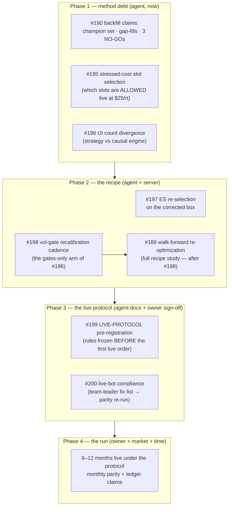

# RUNG-4 ROADMAP — filling every fillable gap between here and a verified systematic track record

**Date:** 2026-08-30 · **Basis:** `docs/POSITIONING.md` §4 (gap A closable, gap B bounded) · **Tracking
issue:** #194 (the board) · **Scope decision by the owner:** *"we can fill rung 4; rung 5 is impossible
given the current resources"* — so this roadmap contains every gap that is fillable with the current
resources, and explicitly lists what stays out of scope.

## 0. The claim being pursued, stated falsifiably

> Within 6–12 months of the live start, there exists a **live trade book, executed under the pre-registered
> protocol, reconciled fill-by-fill against the engine, judged by the same stressed-cost verdict rules as
> every backtest** — and the ledger can re-derive its headline numbers. Whether that book is positive is the
> market's decision; that it is *verifiable* is ours.

Rung 4 in the honest sense = that artefact plus the risk/process discipline around it. Nothing in this
roadmap requires new alpha; everything is protocol, evidence, and two owner-side resources (a broker
gateway, calendar time).

## 1. The board (phases, owners, acceptance)

| # | item | owner | acceptance criterion (what closes it) |
|---|---|---|---|
| **Phase 1 — method debt (no owner input needed)** ||||
| #190 | Backfill ledger claims for the pre-protocol results the project still acts on: the deployed `best` champion set, the gap-aware fill model, the three NO-GO verdicts (Chronos-2 vol gate, regime HMM, TimesFM fusion) | agent | each result has a V1/V2/V3 claim with a declared blind spot, evidence committed under the evidence-tracked rule; ledger stays green; the POSITIONING concession sentence ("the rigor is an era") is retired |
| #195 | Stressed-cost slot selection: from the round-2 forward books, the pre-registered rule that decides **which of the 54 slots are allowed live at $25/rt** (4h rung + ES were the survivors — turn that observation into a frozen, ledger-bound allowlist) | agent | a committed `live_allowlist.json` + claim; the LIVE-PROTOCOL (#199) imports it by reference |
| #196 | The strategy-vs-causal UI trade-count divergence (gate failure on ES 15m, −12%; 25 non-NQ slots off by −25…+94): diagnose which engine the status line should read, fix or document, so no live surface ever reads the wrong ledger | agent | dashboard gate count-leg green on all 54, or the divergence root-caused and the UI labelled; claim updated |
| **Phase 2 — the recipe (server compute, bounded)** ||||
| #197 | ES re-selection on the corrected box (#179 finding: the 6 ES champions were selected on a double-shifted box) — re-run the champion selection pipeline for ES only, cost-gated, fresh seeds (#88 lesson) | agent (server) | 6 new ES champions with selection evidence committed; golden/parity green; `best` set updated or the incumbent explicitly retained with cause |
| #198 | Vol-gate recalibration cadence — the cheap arm of #186: refresh ONLY the gate quantile on a rolling window at cadences {monthly, quarterly, frozen}, replay the champions, measure how much of the forward decay it recovers (NQ 5m dark-slot finding) | agent (server) | a pre-registered verdict on cadence; if positive, the recalibration rule enters the LIVE-PROTOCOL; claim + report |
| #186 | Walk-forward re-optimization (full recipe study, already specced) — run AFTER #198, informed by it; cost-gate estimate before launch | agent (server) + owner go on the compute estimate | verdict on the recipe (frozen vs adaptive); the winning recipe becomes the protocol's re-fit rule |
| **Phase 3 — the live protocol (docs now, sign-off before any order)** ||||
| #199 | LIVE-PROTOCOL pre-registration: instruments/slots (from #195), 1 contract, engine exits, the recalibration cadence (from #198/#186), kill rules (RISK-02 single-trade ruin, drawdown halt), the monthly reconciliation procedure (`optimize/live_parity/`), the verdict rules and their power windows, and what may NEVER be changed mid-run | agent drafts, owner signs | the document is frozen and hash-pinned in the ledger before the first order; any later change is a dated amendment |
| #200 | Live-bot compliance: the team leader's executor brought under the protocol — the six-item fix list from WS-LIVE-PARITY (1 contract; deployed set; engine exits/one position per root; rolling gate; cap semantics; no foreign strategies in the account) — then the scrape → live_vs_engine → side-by-side loop re-run until the decomposition's A/B/C/D terms are ≈ 0 | owner + team leader execute; agent verifies | live-parity decomposition shows entries ≥95% shared, exits within slippage, qty=1 always — BEFORE the clock of #199 starts |
| **Phase 4 — the run (time does the work)** ||||
| RUN | 6–12 months live (or broker-paper if no gateway) under #199; monthly: parity re-run, ledger claim per month, no mid-run edits outside amendments | owner (account/gateway) + agent (verification) | the live book claim re-derives in the ledger; at month 6 the first powered verdict window opens (4h rung MDE math: `docs/WS-FWD-ROUND2-REPORT.md` §3.1) |
| **Recognition (parallel, cheap)** ||||
| #201 | Distribution: cut the next release with POSITIONING + this roadmap in the Zenodo record; the announcement itself (posting anywhere) is an **owner action** under the local-only rule | agent prepares, owner publishes | release tagged; DOI carries the positioning; anything outward-facing left to the owner |

## 2. Explicitly out of scope (the rung-5 list, so nobody re-litigates it)
Order-book data, colocation, market-making, sub-second execution, outside capital. Also out of scope until
their own decision: adding instruments/TFs (expansion-round cost gate), any position sizing beyond 1
contract (RISK-02: 21.8% of trades lose more than their stop; ruin is single-trade), and any strategy work
not already queued (the box edge + news layers are what goes live; research continues on its own track).

## 3. Standing dependencies and owner decisions still open (from #179)
- **Box export cadence** — monthly owner scrape; without it the engine's entry signal dies at the box
  frontier (2026-08-06 today). The LIVE-PROTOCOL must state the cadence as a hard dependency.
- **Prod-root swap** (extended root → production) — owner decision; cosmetic for this roadmap (the live
  engine reads the deployed set + current boxes either way).
- **Broker gateway** — the only hard resource gap between "broker-paper" and "live" phase 4.

## 4. Sequencing note
Phase 1 starts immediately (no dependencies). Phase 2 items are independent of each other; #198 before
#186 because the cheap arm may make the expensive study unnecessary. Phase 3's document can be drafted in
parallel but is signed only after #195/#197/#198 land (it imports their outputs). Phase 4 starts the day
#199 is signed and #200's decomposition is clean — every month before that is a month the track-record
clock is not running.
