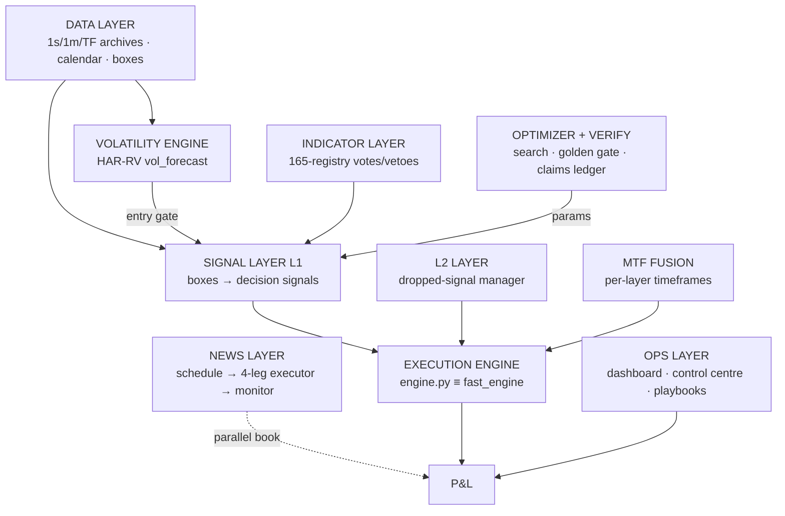

# SYSTEM LAYERS — the Full Breakdown (FU-12; UPDATED to v5.4.3)

> **Update 2026-08-19 (v5.4.3):** since first publication the pipeline resolved both of §3's
> open items — **3.7 (M2 power model) is now DEPLOYED** as the system's second forecast layer
> (`src/deploy/power_forecast.py`, information-only), and **3.6 (the Exp2 sizing ramp) was
> tested to destruction and NOT deployed** (the independent ES book reversed it). The tables
> below carry the updated statuses; §4's study (FU-11) now has BOTH of its ingredients live.

**Owner instruction, verbatim intent: before any further fusion study, "full system analysis —
layers breakdown — each layer of the system: job, income and outcome and responsibilities" —
because the volatility picture has more layers than one ("the google one and chronos2 and
others"). This document is that analysis; its final section corrects FU-11's context.**

Every row is sourced from the code or a memory-record with its verdict; nothing is from
recollection alone. The featured section (§3) is the volatility inventory the owner asked for.

---

## 1 · The system, layer by layer

| layer | job | income (inputs) | outcome (outputs) | responsibilities | status |
|---|---|---|---|---|---|
| **Data** | one truth for prices & events | Databento raw → 1s/1m/TF continuous frames (9 instruments, 2010→); TradingView calendar (≥2016 usable); box CSVs; ALL_STOCKS registry | aligned frames every layer consumes | continuity rules (volume-dominant contract), ET wall-clock convention, completeness (the YM corruption lesson) | LIVE; YM rebuilt 2026-08-18 |
| **Signal (L1)** | turn weekly/monthly BOXES into long/short/hold per decision bar | box CSV + decision frame | `decision_signals` → int stream | the strategy's identity: box direction, 1 entry/candle, flip=reverse-only | LIVE (55 champions / 9 markets, ≈$840k/yr 2026-OOS) |
| **Volatility engine** | forecast next-bar realized vol | 1m returns → `compute_rv_pts` → `har_forecast` (`volatility.py`) | `vf` array; gate threshold = causal in-sample percentile | **the ONLY deployed forecast in the system** — entries allowed only when `vf ≤ gate_pct` threshold (skips the top forecast-vol tail) | LIVE inside every champion (§3.1) |
| **Power-forecast layer** (NEW, v5.4.3) | forecast each scheduled release's move SIZE, night-before | committed M2 evidence pipeline (calendar + 1m realized jumps) | nightly JSONL: per-event predicted power (%, $/contract), expanding + trailing-24 | INFORMATION ONLY — no trading consumer; parity-bound to the M2 evidence (5/5 exact); consumers are separate gated studies | LIVE v5.4.3 (`power_forecast.py`, playbook bundle v1.0.0) |
| **Indicator (165-registry)** | per-bar confirm/veto votes on L1 entries | decision+1m frames (1-min indicator frame DEFAULT) | vote/veto masks folded into `entry_gate` | budget ≤2s/full pass; nan-safe warmup; adopt-gate default-OFF | LIVE (champions use subsets) |
| **L2** | manage L1's DROPPED signals (a second book on the leftovers) | L1's dropped-signal stream | additional trades, own SL/TP | never touch L1's own trades | LIVE (optimize/l2) |
| **MTF fusion** | fuse layers across timeframes (e.g. 1h+4h) | per-layer TF books | the fusion book (NQ $173,789 reference) | residual default byte-identical | LIVE |
| **Execution engine** | fills, stops, caps, qty | signals+gates+1m stream | trades with GAP-01-honest fills; `exit_reason`; qty-linear P&L | engine.py ≡ fast_engine parity; golden gate 6/6 is its lock | LIVE |
| **News layer** | the 4-leg CPI ride beside the box book | `release_schedule.csv` → executor (`--series` per leg) | replay evidence / paper intents; net-stressed feed | frozen spec; regime monitor sticky-halt; per-leg qty rules (NQ/RTY/ES ≤20 worked, YM ≤5) | LIVE v5.4.2, paper-only |
| **Optimizer + verify** | find params; keep every number honest | search spaces, archives | champions; golden baselines; claims ledger (41/41) | cold-start default; fresh-seed replication; `expect` never adjusted | LIVE (research arm has its own open queue #81-#108) |
| **Ops** | run & inspect | all of the above | dashboard :8200/:8250, control centre :8350, playbook bundles, releases | dashboard restart on backend change; UI-verification rule; LOCAL=truth | LIVE |

## 2 · Who earns what (the income map, 2024→2026 window, qty=1 units)

Box book: ≈ $840k/yr at deployed caps (2026-OOS, all 55 champions). News layer: $67,767/window
at qty=1/leg (≈$26k/yr recent pace; ≈$1.167M/window at max approved tiers, worked-entry model).
L2/MTF are inside the box figures. Every other layer earns nothing directly — it protects
(monitor, verify), decides (vol gate, indicators), or reveals (ops).

## 3 · THE VOLATILITY INVENTORY — every layer that models, predicts or consumes vol

The owner is right that there are many. Nine, with verdicts:

| # | vol layer | kind | verdict / status | the one-line truth |
|---|---|---|---|---|
| 3.1 | **HAR-RV `vol_forecast`** (`volatility.py`) | tape-memory forecast | **DEPLOYED — the live entry gate of every champion** | `vf = har_forecast(compute_rv_pts(1m))`; gate = causal percentile; skips the top forecast-vol tail. ⭐ Discovered by this analysis: meta-prophet's F2 winner IS in production — the F-2 record framing "proven, never integrated" was WRONG and is corrected here |
| 3.2 | **Meta-prophet F1/F2 research** (HAR range +16.3%, HAR-RV RV; GARCH/EWMA lost) | research origin of 3.1 | CLOSED-WON | the project's first lift-over-naive; "model the quantity you want directly" |
| 3.3 | **TimesFM band** (the Google one) | foundation-model forecast band | **NO-GO as a gate** (robustness 0/3 yrs on our replication; direction use FAILS outright) | the vendor-claimed +$20.7k NQ gate did not survive the regime-robustness battery |
| 3.4 | **Chronos-2 band** (Amazon) | foundation-model forecast band | **NO-GO as a gate** (P(helps)=18%, beats 37% of random vetoes; DD unchanged) | corr 0.71 with the TimesFM band — same forward vol, same failure. ⭐ Program-level conclusion: **vol/uncertainty GATING does not help this vol-seeking book** |
| 3.5 | **Regime HMM / jump models** | regime classifier | NO-GO | no durable regime edge; the box IS vol-seeking |
| 3.6 | **Regime-edge Exp2 — size WITH vol** | sizing ramp on realized regime | ⛔ **NOT-DEPLOYED (FU-13, v5.4.3)** — R exact on the NQ book (+$10,356) but the independent ES book REVERSES it (−$18,632; even random regime→size maps hurt on ES, median −$12,282); pooled 90% CI [−$25.6k,+$9.1k] ∋ 0. Overlay stays experimental-off; re-open only via the 2010-23 bear book + fresh pre-reg | the SECOND TEST's n=1 caution vindicated; the ES vol-agnostic asymmetry now proven on the SIZING side too |
| 3.7 | **M2 news power model** | calendar forecast of event-day size (night-before, ρ≈0.5; t24 variant) | ⭐ **DEPLOYED (FU-14, v5.4.3)** as `src/deploy/power_forecast.py` — parity 5/5 exact vs the committed evidence; nightly forward artifact; information-only | knows tomorrow's scheduled violence today — information 3.1 cannot see; now a live layer awaiting its consumers |
| 3.8 | **News regime monitor** | rolling P&L-regime guard (24-CPI net-stressed) | DEPLOYED (news legs) | vol-adjacent but P&L-defined; sticky halt |
| 3.9 | Era-0 vol studies (vol-scaled stops, vol targeting, Kelly, session shape) | research probes | CLOSED (fat per-trade tail ±$1,600 defeats weak edges; session real in tape+risk, not entries) | background facts |

**The structural read (v5.4.3)**: the system now has TWO deployed forecast layers — 3.1
(tape-memory HAR-RV, driving every champion's entry gate) and 3.7 (the calendar power
forecast, information-only) — one deployed P&L-regime guard (3.8), one KILLED sizing ramp
(3.6, by its own pre-registered rule), and two foundation-model bands whose gating use is
dead but whose band accuracy was never tested as a forecast INPUT (3.3/3.4). The two live
forecasters read DIFFERENT information and have never been combined — §4's study.

## 4 · FU-11's corrected context (what the fused-size study now actually is)

**Before this analysis**: "fuse HAR-RV (a shelved research result) with the M2 power model."
**After**: HAR-RV is not shelved — it is the live gate. So the study becomes:

> **Upgrade the system's ONE deployed volatility engine with the calendar information it is
> blind to.** `vf` today sees only tape memory; it cannot know that tomorrow 08:30 is a CPI
> print. M2 knows that the night before. A fused forecast (HAR-RV × event-power terms —
> optionally auditioning the FM bands of 3.3/3.4 as additional inputs, which their NO-GOs do
> not forbid) is scored FIRST as a forecast (QLIKE/RMSE vs 3.1 alone, the meta-prophet
> methodology), and only THEN through its consumers, each its own gated step:
> ① the champions' entry gate (re-gate with fused vf — golden-locked default-off);
> ② the Exp2 sizing ramp (3.6's promotion path, which demanded a better regime input);
> ③ FU-7's bracket geometry on the news legs; ④ box stop distances.
> Guard-rails: the 3.4 program conclusion (gating doesn't help) predicts ① may be neutral —
> the forecast-quality stage decides whether consumers are even attempted; every consumer
> stage is its own pre-registration.

This ordering — forecast quality first, consumers second — is what the owner's injected
analysis bought: without §3, the study would have re-derived a deployed component and
mis-framed two NO-GOs as dead information sources.

**v5.4.3 addendum**: both FU-11 ingredients are now LIVE layers (3.1 and 3.7), and the FU-13
verdict sharpened the consumer list — the Exp2 ramp (consumer ②) is dead as-is on
cross-instrument grounds, so a fused-forecast revival of it must treat instrument asymmetry
as a first-class design axis (per-instrument ramps or NQ-only), not an afterthought. The
design of record: `docs/FU11-FUSED-SIZE-DESIGN-DRAFT.md`.
