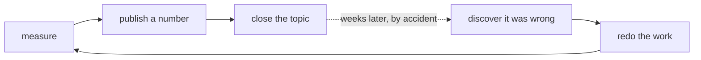

# Verification protocol

**Status: built, self-tested, and in force.** Harness at
`subprojects/Parametric-Indicators/optimize/verify/`.

```bash
cd subprojects/Parametric-Indicators
python3 optimize/verify/run.py             # re-derive every published number   (~18 s)
python3 optimize/verify/run.py --selftest  # prove the harness rejects known defects
```

---

## Part 1 — The problem this solves

The repeated failure in this project has never been getting an answer wrong. It is this loop:



Ten such defects are catalogued in #118. **Every one produced plausible output and no error message.**
None of them were caught by code failing. They were caught later, incidentally, or by a control that
happened to be present.

### The single property they share

> **A check was run, it passed, and the check was not capable of failing.**

<!-- RETRACTION-CATALOGUE: the rows below QUOTE retracted figures deliberately; this marker is what
     stops the retraction scanner flagging its own defect catalogue. It expires at the blank line. -->
| defect | the check that "passed" | why it could not fail |
|---|---|---|
| TradingView pre-2016 rows one hour late | "NFP is 164/164 at 08:30 ET" | looked at **1 series of 649** — and picked the one that is clean |
| Nasdaq "date parameter off by one, verified 3×" | three dates tested | **never tested their neighbours**, so nothing could disagree |
| H1-A "1.31–2.92×" danger ratio | "checked" | checked against **my notes**, not against the file |
| `Inflation Rate Mom` casing trap | published as "verified" | **never measured at all** |
| Stage 4 net t = −3.68 read as an edge | the headline arm | **no control**, so any drag looked like signal |

**This is why running the same check three times is worthless.** Three repetitions of a check that
cannot fail is still a check that cannot fail.

---

## Part 2 — V1 / V2 / V3: three verifications that must fail for *different* reasons

| | name | question it asks | what it catches | ⚠️ what it is blind to |
|---|---|---|---|---|
| **V1** | **Re-derivation** | compute the same quantity by a **different code path** | implementation bugs, arithmetic slips, copy errors | **bad input** — a perfect calculation on wrong data passes V1 every time |
| **V2** | **Independent source** | does a **different dataset, instrument or publisher** agree? | bad input, source-specific artefacts | **a shared convention error** — if both sources use the same wrong timezone rule, both agree |
| **V3** | **Falsification** | state something that **must be FALSE** and check that it is | an instrument that cannot fail | it needs imagination — you must be able to name how you could be fooled |

### V3 is the one that was missing every single time

V3 inverts the question. Instead of *"does my check pass?"* it asks *"what would be true if my
instrument were broken, and is that thing false?"*

| defect | the V3 that would have caught it |
|---|---|
| TradingView DST | *"some series sits at a different ET time in winter than in summer"* must be FALSE — for **all 649**, not one |
| Nasdaq date parameter | *"the neighbouring date returns identical content"* must be FALSE — never asked |
| Stage 4 t = −3.68 | *"the dumb control shows the same effect"* must be FALSE — it was TRUE |
| `--max-enabled` (#14) | *"a trial exists that enabled zero new indicators"* must be FALSE — 100% of trials did |
| H1-A units | *"a 40-point stop is the same percentage of price on NQ and GC"* — it is **0.56% vs 2.52%**, a 4.5× difference |

⭐ **Write the falsifier before running the measurement.** If you cannot name a way the result could be
fake, you do not yet understand what you are measuring.

---

## Part 3 — The rule that would have prevented the most damage

> **A check that passes on a sample must state the sample and the population.
> "Verified" with no denominator is not a result.**

The DST defect was a *true statement about one series* published as a *statement about the file*. Every
claim in the ledger is therefore required to declare its **blind spot** in writing, and the runner
**refuses to pass a claim that does not**. This is structural, not documentation: it fails before any
measurement runs.

Writing *"this cannot see the other 648 titles"* makes the generalisation impossible to make silently.

---

## Part 4 — The claims ledger: no number is publishable unless a script re-derives it

Every published figure is registered with the file it came from and a function that reads it back:

```
claim id | statement | source file | producer fn | expected | tolerance | blind spot | V1 V2 V3
```

**A figure that cannot be produced by a function in the ledger has no standing** — regardless of
whether it happens to point the same way as the truth. "1.31–2.92×" pointed the same way as the truth
and was published three times; it appears in no result file.

The ledger doubles as a regression test: when data or code changes, a claim that has quietly stopped
being true becomes loud instead of staying invisible until someone stumbles on it.

### ⚠️ The one rule that keeps a ledger honest

> **When a claim fails, fix the document or fix the code. Never adjust `expect` to match.**

Editing the expected value to match the new output converts the ledger into a rubber stamp that
records whatever happened. The runner prints this warning on every failure.

---

## Part 5 — The harness is tested by being made to fail

**A gate that has never failed is untested.** A verification harness whose own failure path is
unexercised reproduces the exact disease it was built to cure, one level up.

`--selftest` reconstructs five real historical defects **as they were originally published** and
requires the harness to reject each one:

| replay | defect | rejected by |
|---|---|---|
| fabricated number | H1-A "1.31×" | ledger: re-derived **4.27**, published 1.31 |
| single-series generalisation | TradingView DST | ledger (3 broken years) **and** V3 — while V1 passes on the original evidence, because NFP really is clean |
| no falsifier / no denominator | the structural half | structural gate, before any measurement |
| units flaw | points vs percent | V3: 40 pts = **0.56% of NQ, 2.52% of GC — 4.5× different risk** |
| retracted figure reused | publication drift | retraction scanner |

⭐ **The second replay is the important one.** Its V1 check *passes* — NFP genuinely is 164/164 at
08:30 ET, which is why the original claim was believed — and the claim is rejected anyway, because the
ledger value and the V3 falsifier look at the **population** rather than the sample.

### ⚠️⚠️ The self-test itself passed for the wrong reason on its first run

Two replays reported "correctly REJECTED" — by a `FileNotFoundError` from a bad path constant, not by
the defect they were replaying. **A green self-test that is green for an unrelated reason is the same
disease again.** `_expect_rejected` now requires the rejection line to *match the expected reason*, and
explicitly fails a rejection caused by a crash.

---

## Part 6 — The fact-check pass, before anything is published

Defects 2, 3 and 7 were **publication-time** failures, not measurement failures. They would each have
been caught by a pass over the text itself:

1. **Every figure traced to the file that produced it** — if it is not in the ledger, it is not
   published.
2. **Every "verified / confirmed / all / never / always" checked for a denominator.**
3. **Every retracted figure checked for unmarked reuse** — automated, `NEWS2-RETRACTIONS-NOT-REUSED`.

### ⭐ The scanner caught a real one on its first run

`tv_calendar.py:89` still carried the comment *"Verified against the data, not guessed —
`Inflation Rate Mom` is TradingView's own casing"*, sitting directly above the dictionary I had already
corrected. **I fixed the code and left the comment asserting the retracted claim** — which is exactly
how a corrected file goes on publishing a wrong statement indefinitely.

⚠️ It also produced **5 false positives out of 6 hits** initially, because it looked for the retraction
marker only on lines *above* the figure while "That was wrong" often lands *below*. That was fixed
(context window ±3 lines) — a gate that cries wolf is a gate everyone learns to skip, which is strictly
worse than no gate.

---

## Part 7 — Current ledger status

**6/6 claims pass · 5/5 defect replays rejected · ~18 s**

| claim | issue | statement |
|---|---|---|
| `H1A-NQ-5M-040-RATIO` | #115 | NQ 5-min / 0.40% stop: **4.27×** the control |
| `TV-DST-CLEAN-FROM-2016` | #114 | no year ≥ 2016 fails the DST audit |
| `TV-NFP-CLEAN-PRE-2016` | #114 | NFP is clean pre-2016 (**36/36**) although most of the file is not |
| `TV-TIMESTAMPS-MINUTE-ONLY` | #117 | **0** rows carry non-zero seconds — scheduled minute, not observed instant |
| `NEWS2-USABLE-UNIVERSE` | #116 | **103** series ⇒ **927** pairs, not ~270 |
| `NEWS2-RETRACTIONS-NOT-REUSED` | #118 | no retracted figure reused unmarked |

### ⚠️ What this protocol does NOT do

- It does **not** re-run the studies. `H1A-NQ-5M-040-RATIO` proves the published figure matches
  `h1a_stopout_NQ.json`; it cannot detect an error inside the backtest that wrote that file.
- It does **not** scan GitHub issue comments — where two of the three retracted figures were originally
  published.
- It does **not** catch a wrong number that was never formally retracted, or a paraphrase that dodges
  the pattern.

These limits are stated here for the same reason each claim states its blind spot: an unstated limit
becomes an assumed guarantee.

---

## Part 8 — How to add a claim

1. Write the **falsifier first**. If you cannot name one, stop — you do not understand the measurement.
2. Write the **blind spot**. Name the population your evidence does not cover.
3. Point `value_fn` at the **committed artefact**, not at a recomputation and never at a literal.
4. Make V1 use a **genuinely different code path**, and V2 a **genuinely different source**. Two calls
   into the same function are one check, not two.
5. Run `--selftest` after any harness change.
