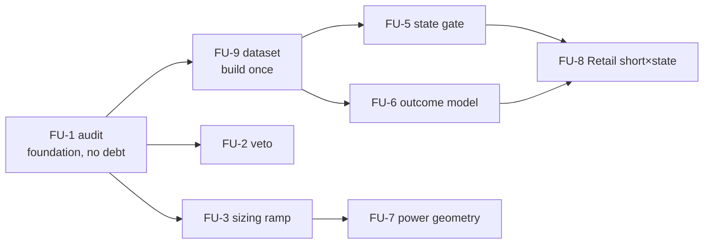

# WS-FUSION — Indicators × News: the Opening Brainstorm and the Use-Case Ledger

**Opened 2026-08-19 by owner instruction ("proceed to newsxindicators workstream"), per the
pipeline rule set on 2026-08-18: WS-FUSION "must OPEN with deep brainstorming + a strong
follow-up system so use-cases with potential are never dropped." Tracking issue: #152 · use-cases #153–#161.**

---

## 1 · What each side brings to the table (the raw materials)

**The news side owns TIME**: it knows, days ahead, the exact second uncertainty resolves.
Assets: the verified schedule (timestamps + series identity); the deployed 4-leg CPI ride and
its per-event P&L history; the M2 power model (move SIZE predictable night-before, ρ≈0.5);
the regime monitor; the confirmed Retail anti-premium; 1-second tape machinery around events;
the hard negatives (direction is dead; consensus numbers are dead pre-release).

**The indicator side owns STATE**: it knows, at any second, what the tape has been doing.
Assets: the 165-indicator registry; the box strategy (55 champions / 9 markets) with its L1/L2
layers and causal log; MTF fusion; cross-instrument state features; the optimizer + verify
harness; the dashboard.

**The fusion thesis**: TIME × STATE. Every use-case below is one of three couplings —
news protecting/steering the box book (A), tape state steering the news ride (B), or shared
substrate (C).

## 2 · The integrity constraints (read before proposing anything)

1. **Small n is the enemy on the news side**: CPI is n=116 full-era, n=29 in the operative
   window. Conditioning a 116-event sample on a 165-indicator library is a p-hacking machine.
   Rules: mechanism-first (a condition must have a WHY before it is measured); at most 1–2
   pre-registered binary conditions per study; cross-instrument holdout (the 4-leg structure
   means a condition found on NQ can be confirmed on ES/YM/RTY events — different price files,
   same moments — declared as semi-independent); era half-splits mandatory.
2. **The box side has no such problem** (thousands of trades) — A-family studies are the
   statistically safe ground and should go first.
3. All standing gates apply: pre-registration before runs, dumb control + noise check for
   positives, power analysis for negatives, V1/V2/V3 + ledger, stressed costs lead.
4. **Never risk the deployed layers**: every fusion experiment runs beside, never inside, the
   shipped executor/engine until its own ship gate.

## 3 · The use-case ledger (FU-#) — the follow-up system

**Intake rule (mirrors the RQ rule): every fusion idea — from any session, report, or
conversation — gets an FU number, a ledger row here, and a GitHub issue THE DAY IT APPEARS.
An idea without an FU number does not exist. Rows are never renumbered; statuses move
QUEUED → ACTIVE → CLOSED-<verdict>. This file is the index; design detail lives in each issue.**

### Family A — news protecting/steering the box book (statistically safe, cheap, first)

| ID | use-case | mechanism ("why would this work?") | design sketch | status |
|---|---|---|---|---|
| **FU-1** (#153) | **Event-window interaction audit** — what does the box book actually DO inside news windows? | Foundation, not a bet: 94% of box stop-outs are 1-second sweeps (era-0 finding); release minutes are where sweeps live. Nobody has measured the book's P&L/stop-out density inside [rel−5m, rel+15m] across all champions. | Join the causal logs of all 55 champions with the full calendar; per-window stats (entries taken, P&L, stop-out rate, DD contribution) vs matched quiet baseline. Pure measurement — no multiple-testing debt. **Every other A-case consumes this.** | **ACTIVE** (started 2026-08-19) |
| **FU-2** (#154) | **News-veto / stand-aside** — block new box entries near Tier-1 releases | If FU-1 shows release windows are net-negative or sweep-heavy for the book, standing aside is free money and lower DD. Precedent: the intracandle-veto study machinery exists. | Replay all champions with an entry-veto in [rel−X, rel+Y] (X,Y pre-registered, e.g. −5m/+15m, Tier-1 only); measure P&L/DD delta per champion; golden-gate discipline (default OFF, byte-identical). | QUEUED |
| **FU-3** (#155) | **Power-aware sizing ramp** — scale box size by night-before predicted event power | The M2 power model predicts tomorrow's move size (ρ≈0.5) TODAY; the regime-edge programme proved sizing-WITH-vol beats inverse-vol for this vol-seeking book. Marries the two. | Size multiplier as a function of next-day predicted power (2–3 pre-registered breakpoints); replay champions; compare vs flat and vs random-ramp dumb control. | QUEUED |
| **FU-4** (#156) | **Event-day champion switching** — different box params on CPI/NFP days | Riskiest A-case: per-event-day params invite overfitting on ~12 days/yr. Only justified if FU-1 shows event days are structurally different for the book. | Gated behind FU-1; would need optimizer runs + fresh-seed replication (the MAP-Elites #88 lesson). | QUEUED (gated on FU-1) |

### Family B — tape state steering the news ride (the declared blind spot; careful, high ceiling)

| ID | use-case | mechanism | design sketch | status |
|---|---|---|---|---|
| **FU-5** (#157) | **State-gated CPI ride** — take/skip (or scale) the ride by pre-release tape state | M3's "smart entries" arm hinted state matters; the ride's median event LOSES — if a cheap state variable separates the +4R tail days from the chop days, the same premium arrives with half the bleed. | 1–2 mechanism-first conditions ONLY (candidates: overnight trend sign; pre-release realized vol percentile), fixed at pre-registration; evaluated per-leg with cross-instrument confirmation (found on NQ ⇒ must hold sign on ES/YM/RTY); era split. | QUEUED |
| **FU-6** (#158) | **Per-event outcome prediction** — can indicator votes at rel−300s classify win/lose events? | The 165-library sees the tape the ride enters blind. Even a small true lift on a 36–62% win rate is large in $. Danger: the classic overfit trap — treat as EXPLORATION with a locked holdout. | Build on FU-9's dataset; simple models only (logistic / single trees); train on NQ 2016-21, test on NQ 2022+ AND on ES/YM/RTY untouched; promotion only via fresh pre-registration. | QUEUED |
| **FU-7** (#159) | **Power-scaled geometry** — S/TP scaled by the predicted move size | Mechanistic, no classification: the frozen 0.10/0.40% geometry is one-size; the M2 model predicts per-event power night-before. A bigger predicted move justifies a proportionally wider bracket (same R:R). | Pre-registered mapping (e.g. S = 0.10% × power-quintile factor); replay per leg; compare vs frozen geometry; the falsifier is a shuffled-power placebo. ⚠️ This CHANGES the confirmed spec — runs as a study, ships only via the full gate. | QUEUED |
| **FU-8** (#160) | **Retail short × state confirmation** (absorbs RQ-2) | The anti-premium is real on 7 instruments but its short side was never designed; a state filter could be what makes it tradeable at cost. Fresh-design requirement stands (its history is consumed). | Design AFTER FU-5/FU-6 teach us which state variables carry signal; pre-register geometry a priori; forward-era element required. | QUEUED (absorbs #142) |

### Family C — substrate and system

| ID | use-case | mechanism | design sketch | status |
|---|---|---|---|---|
| **FU-11** (#162) | **Direction × Size fusion — the owner's breakthrough candidate** (registered 2026-08-19, flagged by the owner) | The news side predicts SIZE without direction (M2 power model, ρ≈0.5 night-before, confirmed); an early-era study claimed price-side DIRECTION prediction without size — if BOTH claims survive modern scrutiny, size × direction = a complete forecast. ⚠️ The old direction claim is IMMATURE-ERA and must first be located and re-audited with today's data/power/discipline (WS-NEWS2 killed *surprise-based* direction — the old claim is price/indicator-based, a different mechanism, not yet contradicted). | Step 1: locate the old study artifacts + extract its exact claim/method. Step 2: re-audit that claim alone (modern data, controls, holdouts). Step 3: only if it survives — the fusion design (direction from tape, size from the power model, geometry from both). | REFORMULATED (owner agreed) + CONTEXT CORRECTED by FU-12: HAR-RV is the LIVE gate, not a shelved result — the study = upgrade the deployed vol engine with the calendar terms it is blind to (M2 power; FM bands auditionable as inputs); forecast-quality stage FIRST (QLIKE/RMSE), consumers each gated after. Design **SAVED** (`docs/FU11-FUSED-SIZE-DESIGN-DRAFT.md`, owner: "save your suggestions") — queued behind FU-13/FU-14 |
| **FU-13** (#165) | **Exp2 size-WITH-vol ramp — end-to-end verification & deployment** (owner-ordered 2026-08-19) | The parked winner: Ret/DD 5.52→5.90, beats 95% of random ramps, all 3 years; a dashboard overlay already exists OFF-default | R exact; X FAILED (ES −$18,632 — even random maps hurt on ES); M FAILED (pooled CI includes 0) | **CLOSED-NOT-DEPLOYED** — magnitude does not generalize; overlay stays experimental-off; re-open only via new data + fresh pre-reg |
| **FU-14** (#166) | **M2 power model productionization** (owner-ordered 2026-08-19) | Confirmed forecast (ρ≈0.5 night-before), consumed by NO live layer — ship the ENGINE (nightly forward forecasts, parity-bound), consumers stay separate gated studies | parity 5/5 exact (≤1e-16); scramble collapses; forward artifact live | **CLOSED-DEPLOYED** (v5.4.3, information layer, no trading consumer) |
| **FU-12** (#164) | **Full system layer analysis** (owner-injected 2026-08-19, before any further vol study) | Context correction: the vol picture has many layers (TimesFM, Chronos-2, HAR-RV, regime work…) and studies must not re-derive deployed components or mis-frame NO-GOs | `docs/SYSTEM-LAYERS-ANALYSIS.md`: every layer's job/income/outcome/responsibilities + the 9-entry volatility inventory + FU-11's corrected framing. ⭐ Found: the deployed box vol-gate IS the meta-prophet HAR-RV forecast (`volatility.py`) | **CLOSED-DONE** (2026-08-19) |
| **FU-9** (#161) | **The event-state dataset** — one table: per (event, instrument): pre-release indicator vector + ride outcome + box-book state | Build once, every B-case consumes it; prevents each study from re-touching (and re-consuming) the data differently. Also the natural bridge to WS-EARN (same schema, earnings timestamps). | Per CPI/NFP/FOMC/Retail event × 4 legs: the 165 indicators evaluated at rel−300s (1m frame, the deployed convention), ride P&L (have), box-book open-position state (from FU-1). Versioned, committed, ledger-bound. | QUEUED (proposed second) |
| **FU-10** | **This ledger + intake rule** | The owner's "strong follow-up system". | This document + one issue per FU + the intake rule above. | ACTIVE (this doc) |

### Parking lot (ideas noted, deliberately NOT numbered until they earn a design sketch)
Post-release L2-style continuation signals on news minutes · cross-instrument lead-lag inside
the release minute (ES leads YM?) · news-aware exit for the box (close-before-release instead
of veto) · VIX/breadth exogenous fusion (parked programme) tie-in. Promote by giving one an FU
number + issue — never by silently starting work.

## 4 · Execution order — ✅ APPROVED, ▶️ UNPAUSED (owner, 2026-08-19: "proceed with the newsxindicators")

**Execution began 2026-08-19** in the approved order: FU-1 (the audit) first, FU-9 (the dataset) second. FU-11's stage-1 archaeology (pure search, no statistical cost) runs alongside. Statuses move in the ledger rows as work lands.

**Start with FU-1** (pure measurement, zero statistical debt, feeds everything) and **FU-9**
(the substrate). Then the cheap book-protection wins (FU-2/FU-3), then the mechanism-first
geometry (FU-7), and only then the conditioning studies (FU-5/FU-6) on the substrate with the
cross-instrument holdout discipline. FU-4/FU-8 stay gated.

## 5 · What "done" looks like for WS-FUSION

Every FU row CLOSED with a verdict (deployed / powered-null / parked-with-cause); anything
deployed passed the three-stage ship gate; the ledger 100% green; a closing bilingual report in
the house style; hand-off notes to the WS-EARN return (which reuses FU-9's schema on earnings
timestamps — the owner's "same high-volatility nature, something hiding between the lines").
