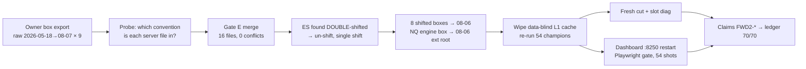

# WS-FWD Round 2 (#179) — the deployed champions on the REAL forward window

**Date:** 2026-08-23 · **Issue:** #179 (continues #176) · **Pre-registration:** `docs/WS-FWD-PREREGISTRATION.md` §Round 2 (filed before the run) · **Ledger:** claims `FWD2-*` in `optimize/verify/claims_fwd2.py`, 70/70 pass · **Evidence:** `subprojects/Parametric-Indicators/optimize/fwd/data_r2/` (54 books, fresh cut, slot diagnostics, dashboard gate JSON, 54 screenshots, `fleet_table.txt`, `fresh_stats.txt`, `deepdive_inputs.txt`)

## 0. One paragraph for the owner

Round 1 (#176) could not test the champions forward: the candles reached August but the box
feed — the thing the entry signal is built from — stopped in late May/June, so only 25 trades
were truly new. Your box export closed that gap. After merging it (with a zero-conflict proof
on every overlapping day) and fixing one data defect found on the way (the ES box had been
shifted twice, so every ES Friday row carried next week's levels — one day of lookahead), all
54 champions were re-run on candles AND boxes through 2026-08-06/07. The result is the first
honest forward window: **3,733 new trades, raw +$29,807 — but −$7,523 once each trade pays
$10 round-trip, and −$63,518 at $25.** The fleet's fresh per-trade result ($7.98) is
statistically indistinguishable from zero and statistically *below* the $31.29/trade the same
champions showed inside their selection window (t = −2.53): the window returned 17.6% of what
the selection-window rate predicted. That is the classic shape of selection-window optimism,
not of a broken engine — every book was dashboard-verified on screen. Where the money is and
is not: the 4h rung is the only one that survives $25/rt friction (+$10,106 on 181 trades), ES
is the only instrument positive at $25/rt (on the corrected box), and the 1h rung lost across
the board (−$17,769). Per slot, almost nothing is provable either way yet — 2.5 months is too
short for 4h slots (a 4h slot would need a ~$1,000/trade effect to be detectable). Three slots
are measurably below their own in-sample rate (CL 2h, NQ 2m, SI 1h); seven have fewer than 10
trades and get no verdict.

## 1. What was done, in order



### 1.1 The merge (gate E)
Every existing box file was compared with the export on the days both carry. For the seven
instruments delivered raw (GC SI HG CL NG RTY YM) the 31 overlapping days agree on **all 53
columns**. NQ's engine box and ES's server file agree with the export only when the export is
shifted back one business day — i.e. those two files were stored in the engine's shifted
convention. The only disagreements anywhere are NaN-vs-value on the sparse "trend" level
columns (a W-TH box on one NQ date present in the August scrape but not in June's): a scrape
repaint observation; existing rows were kept. Report: `optimize/fwd/data/fwd_box_merge_report.json`.

### 1.2 The ES defect
The server's "raw" ES box was already shifted (its row for 2026-05-18 carries `dOpen` 7410.0 =
the open at 05-17 18:00, i.e. its *own* session), and the onboarding script shifted it again.
So the engine's ES row for Friday 05-15 carried `wOpen` 7410 — the open of the week that only
starts on Sunday evening. Friday rows saw next week's weekly levels; month-end rows saw next
month's. NQ and the other seven are single-shifted (verified against the 1m opens). Fix: ES
un-shifted to raw convention, merged, shifted once. Every ES row moves one day.

What it did to the ES full books (2025-01 → 2026-08, raw):

| ES slot | round 1 (double-shifted) | round 2 (corrected) | Δ |
|---|---|---|---|
| 4h | $74,237 | $40,432 | **−$33,805** |
| 2h | $67,026 | $73,527 | +$6,500 |
| 1h | $63,063 | $70,553 | +$7,490 |
| 15m | $25,589 | $28,905 | +$3,316 |
| 5m | $5,080 | $3,164 | −$1,917 |
| 2m | $12,042 | **−$435** | **−$12,478** |
| total | $246,038 | $215,145 | −$30,893 |

ES 4h and ES 2m were the slots leaning on the lookahead; the middle rungs did not care. These
champions were *selected* on the wrong box; their parameters are now mis-tuned by one day of
box geometry. Re-selection for ES is the clean fix (owner decision — see §6).

### 1.3 A second finding about round 1
Round-1 NQ books never saw the with20d box: the round-2 NQ books are identical before 2026-05-25
and then contain entries (NQ 4h: 5 more by 06-02) that round 1 did not have, although round 1
was supposed to run on the with20d box. The L1 disk cache is params-keyed and data-blind; the
NQ re-run in round 1 was served from cache. Round 2 wiped the cache first (`FWD_EXTENDED/tmp`).
The round-1 "NQ 4h anchor closure to the cent" is therefore a closure on the 05-22 box, not on
with20d. Round-1 claims stay as they are (their numbers are what was measured); this note is the
correction of what they measured.

### 1.4 Integrity of the re-run
For the 42 slots whose boxes only gained rows (everything except NQ/ES), the round-2 book is
**identical** to round 1 for every entry before the old box end — entry times and P/L to the
cent (ledger check `FWD2-BOX-MERGE-AND-54-BOOKS` V2). The refresh added history; it did not
rewrite it.

## 2. The fresh window — what it is

Per instrument, a trade is "fresh" if it *entered* after that instrument's pre-extension engine
end (NQ/ES 2026-05-19; GC/SI 07-02; RTY/YM 07-05; HG 07-07; CL/NG 07-08) — the same definition
as round 1, frozen in the pre-registration. Fresh entries now run to 2026-08-06. So NQ/ES have
~2.5 months of fresh tape, the others ~1 month. The 2025 part of every book is training data;
the 2026-to-May part is the *selection* window of the `best` set — neither is out-of-sample.

## 3. The fleet result

| | trades | raw | at $10/rt | at $25/rt |
|---|---|---|---|---|
| **Fresh window, all 54** | 3,733 | **+$29,807** | **−$7,523** | **−$63,518** |
| by rung: 4h | 181 | +$14,631 | +$12,821 | **+$10,106** |
| 2h | 187 | +$3,749 | +$1,879 | −$926 |
| 1h | 303 | **−$17,769** | −$20,799 | −$25,344 |
| 15m | 789 | +$5,346 | −$2,544 | −$14,379 |
| 5m | 823 | +$11,240 | +$3,010 | −$9,335 |
| 2m | 1,450 | +$12,609 | −$1,891 | −$23,641 |

By instrument (fresh, raw / $10 / $25): ES **+$20,419 / +$19,099 / +$17,119** · NG +$6,997 /
+$97 / −$10,253 · SI +$5,847 / −$2,993 / −$16,253 · HG +$4,278 / −$1,852 / −$11,047 · NQ +$2,054 /
+$764 / −$1,171 · CL +$1,030 / −$3,040 / −$9,145 · YM −$2,425 / −$4,585 / −$7,825 · RTY −$3,755 /
−$5,995 / −$9,355 · GC −$4,637 / −$9,017 / −$15,587.

By month (fleet, raw): May −$2,098 (49 trades, NQ/ES only) · June +$18,104 (91) · July +$1,490
(3,052 — all nine instruments live) · August (to the 6th) +$12,310 (541).

```mermaid
xychart-beta
  title "Fresh window by rung — raw vs $25/rt (USD)"
  x-axis ["4h","2h","1h","15m","5m","2m"]
  y-axis "USD" -30000 --> 20000
  bar [14631, 3749, -17769, 5346, 11240, 12609]
  bar [10106, -926, -25344, -14379, -9335, -23641]
```



### 3.1 The honesty checks the rules require

- **Noise check (is +$29,807 different from zero?)** No. Fleet mean $7.98/trade, sd $554,
  n = 3,733 → t = 0.88. At $10/rt the mean is −$2.02 (t = −0.22); at $25/rt −$17.02 (t = −1.87).
  The raw positive number is not evidence of an edge.
- **Dumb control (is it different from what the selection window promised?)** Yes, downward.
  If fresh trades had the in-sample per-trade rate of each slot, the fleet would have made
  ≈ $169,814 on these 3,733 trades (2025-only rate gives the same, $168,778). It made $29,807 —
  17.6%. Fleet decay t = −2.53. This is the pre-registered falsifier for "the window is really
  out-of-sample": had the books been a re-reading of the selection window, the ratio would sit
  near 1.
- **Power (may any slot be called negative?)** Mostly no. 44/54 slots are "consistent with
  in-sample" only because their minimum detectable effect is huge: $1,254/trade for NQ 4h,
  $1,359 for ES 4h, $865 for GC 4h, $100–$700 for most 1h/2h slots. Only the high-count small-TF
  slots are powered (MDE $4–$60/trade). Three slots are below their own in-sample rate at
  t < −2: **CL 2h** (−$118/trade vs +$37), **NQ 2m** (−$105 vs +$61), **SI 1h** (−$185 vs +$100).
  Seven slots have n < 10 and get no verdict: NQ 5m (4), ES 5m (6), RTY 15m (1), RTY 1h (6),
  RTY 2h (4), YM 2h (4), YM 4h (9).

## 4. Dashboard verification (Phase 3, server-side Playwright)

:8250 was restarted on the extended root (it caches data at start), then the scripted gate
drove all 54 (instrument, timeframe) runs and screenshotted each L1 view
(`optimize/fwd/data_r2/shots/fwd_dash_<slot>.png`).

- **Money leg — PASS 54/54.** The on-screen Total P/L equals the book within the cent-rounding
  bound (0.005·n + $1): 26 slots exact to the dollar, 36 within $1, worst Δ $25 on the 8,867-trade
  NG 2m slot (bound $45). NQ counts exact 6/6.
- **Count leg — FAIL 1/54.** The status-line trade count is the STRATEGY engine's ledger; the
  cards and books are the CAUSAL engine. Pre-registered bound: ≤ 3% apart. ES 15m shows 180 vs
  the book's 205 (−12%). 25 non-NQ slots differ by −25…+94 (all others ≤ 3%). Round 1 recorded
  this divergence as an observation; on the corrected ES box it is now a gate failure. It is
  pinned in the ledger (claim `FWD2-DASHBOARD-VISUAL-GATE` V3 requires the failure list to be
  exactly `["ES_15m"]`) so it cannot be absorbed quietly. It needs its own issue before anything
  live reads a UI count.
- The gate's regex could not read a negative P/L (the dashboard renders `$-437`, not `-$437`);
  fixed, ES 2m re-gated: seen `-$437` vs book `-$435` (n = 459, bound $3.30).

## 5. Per-slot deep dives (fresh window; raw / $25 per trade; verdict by the power rule)

Reading guide: *er60* = share of box signals that became entries in the last 60 days (the rest
were killed by the vol gate or the indicator veto); *exits* = how the fresh trades ended.

### NQ (fresh window 05-19 → 08-06)
- **4h** — 31 trades, +$5,521 raw (+$178/trade; +$4,746 at $25). 14 take-profits, 7 soft stops, 6
  time-caps. Shorts made +$10,587, longs lost −$5,066. July +$1,665, August +$4,197. Entry rate
  fell 32% → 16% (vol gate took 98 of 109 drops). *Verdict: consistent with in-sample (MDE
  $1,254 — unpowered). Still the fleet's best dollar-per-trade slot at $25/rt.*
- **2h** — 15 trades, +$5,872 (+$392/trade). 8 TP / 5 soft-SL. Entry rate 14% → 4%; idle 10 days at
  the end. *Consistent; unpowered. Watch the entry-rate collapse.*
- **1h** — 10 trades, **−$4,175** (−$418/trade; in-sample +$611). 7 soft stops of 10, one +$2,500
  winner. Entry rate 7% → 2% (235 vol-gate drops vs 10 entries). *t_vs_ins −1.95 — just short of
  a verdict. The gate is choking it the same way it choked 5m.*
- **15m** — 49 trades, −$1,988. Longs −$8,349 (32 trades), shorts +$6,361 (17). 24 soft stops.
  *Consistent (MDE $421). Direction asymmetry worth a look, not a conclusion.*
- **5m** — 4 trades, −$1,084. Gate 30.4; 1,134 vol-gate drops vs 1 entry in 60 days; idle 53 days.
  *No verdict (n < 10). The structural darkness from round 1 stands: this slot is switched off by
  its own 2025 volatility quantile.*
- **2m** — 20 trades, **−$2,091** (−$105/trade vs +$61 in-sample; t −2.35). 14 hard stops of 20;
  1,402 vol-gate drops vs 20 entries (entry rate 4.5% → 0.5%). *BELOW in-sample. Same disease as
  5m, one stage earlier.*

### ES (corrected box; fresh 05-19 → 08-06)
- **4h** — 17 trades, +$6,678 (+$393/trade; +$6,253 at $25). 7 TP, 6 time-caps, 4 soft stops.
  June +$6,329, July +$5,029, August −$3,487 (3 trades). *Consistent; unpowered (MDE $1,359).*
- **2h** — 33 trades, **+$9,239** (+$280/trade; +$8,414 at $25) — the fleet's best fresh dollar
  total. June +$10,219 on 9 trades; July +$469 on 18; longs +$7,852. *Consistent; unpowered.*
- **1h** — 31 trades, +$1,176 (+$38/trade; +$401 at $25). 17 hard stops. Longs +$2,377, shorts
  −$1,202. *Consistent with in-sample $281/trade only because MDE is $633.*
- **15m** — 26 trades, +$2,959 (+$114; +$2,309 at $25). Shorts +$3,269 / longs −$310. Entry rate
  6%. *Consistent. This is the slot with the 12% UI count divergence.*
- **5m** — 6 trades, −$122. *No verdict.*
- **2m** — 19 trades, +$489 (16 TP of 19; +$26/trade vs −$2 in-sample). Entry rate 4.6% → 1.5%.
  *Consistent; note the full book is now negative (−$435) on the corrected box.*

### GC (fresh 07-02 → 08-06)
- **4h** — 30 trades, +$7,501 (+$250; +$6,751 at $25). August +$5,701 on 6 trades. *Consistent;
  unpowered (MDE $865).*
- **2h** — 39 trades, −$6,767 (−$174 vs +$246 in-sample; t −1.60). 24 hard stops of 39; July −$8,425.
  *Consistent (just). Longs −$4,846.*
- **1h** — 72 trades, −$5,110 (−$71 vs +$159). 40 soft stops. August −$4,110 on 18. *Consistent
  (t −1.34, MDE $451).*
- **15m** — 183 trades, −$4,057 raw, −$8,632 at $25. Shorts −$5,655 on 61 trades. *Consistent
  (t −1.42, MDE $115) — and negative at every cost level.*
- **5m** — 43 trades, +$2,877 (+$67; +$1,802 at $25). Longs +$3,246 on 9. *Consistent.*
- **2m** — 71 trades, +$918 raw, −$857 at $25. 70 of 71 short. *Consistent; friction-negative.*

### SI (fresh 07-02 → 08-06)
- **4h** — 25 trades, −$6,178 (−$247 vs +$313; t −1.55). Shorts −$10,658 on 18, longs +$4,480.
  July −$7,839. *Consistent (MDE $970). Direction-skewed loss.*
- **2h** — 16 trades, −$416. *Consistent; unpowered.*
- **1h** — 41 trades, **−$7,585** (−$185 vs +$100; t −2.40). 24 soft stops of 41; both sides lose.
  *BELOW in-sample.*
- **15m** — 198 trades, +$7,810 raw (+$39), +$2,860 at $25. July +$8,664, August −$853. Longs +$6,864.
  *Consistent (t −0.03, MDE $88) — the one small-TF slot still positive at $25.*
- **5m** — 254 trades, +$6,079 raw (+$24), −$271 at $25. *Consistent; friction-neutral.*
- **2m** — 350 trades, +$6,137 raw (+$18), −$2,613 at $25. *Consistent; friction-negative.*

### HG (fresh 07-07 → 08-06)
- **4h** — 17 trades, +$1,922 (+$113; +$1,497 at $25). 16 of 17 long. *Consistent; unpowered.*
- **2h** — 32 trades, −$698. 26 hard stops of 32 (win rate 19%). *Consistent (t −1.13).*
- **1h** — 24 trades, +$201 raw, −$399 at $25. All long. *Consistent.*
- **15m** — 149 trades, +$632 raw (+$4), **−$3,093 at $25**. 126 hard stops of 149. *Consistent
  (MDE $27); a friction illusion — it earns $4 a trade.*
- **5m** — 73 trades, +$173 raw, −$1,652 at $25. *Same.*
- **2m** — 318 trades, +$2,048 raw (+$6), **−$5,902 at $25**. *Same; the round-1 verdict stands.*

### CL (fresh 07-08 → 08-06)
- **4h** — 11 trades, +$728 (one −$2,180 loser against 9 TPs). *Consistent; unpowered (MDE $670).*
- **2h** — 16 trades, **−$1,888** (−$118 vs +$37; t −2.21). 6 soft + 2 hard stops, 7 TPs; July
  −$2,222. *BELOW in-sample.*
- **1h** — 26 trades, +$360 raw, −$290 at $25. *Consistent.*
- **15m** — 20 trades, +$488 raw, −$12 at $25. Entry rate 28% → 9% (477 vol-gate drops). *Consistent.*
- **5m** — 133 trades, −$6 raw, −$3,331 at $25. 101 hard stops of 133. *Consistent; friction-negative.*
- **2m** — 201 trades, +$1,347 raw (+$7), −$3,678 at $25. *Friction illusion, as in round 1.*

### NG (fresh 07-08 → 08-06)
- **4h** — 23 trades, +$2,022 (+$88; +$1,447 at $25). 12 TP, win rate 70%. *Consistent; unpowered.*
- **2h** — 28 trades, +$543 raw, −$157 at $25. *Consistent.*
- **1h** — 64 trades, +$1,234 raw (+$19), −$366 at $25. Entry rate 85% → 100% (zero drops — the
  gate and veto are fully open). *Consistent.*
- **15m / 5m / 2m** — 105 / 198 / 272 trades, +$773 / +$782 / +$1,643 raw = $7 / $4 / $6 per trade;
  at $25: −$1,852 / −$4,168 / −$5,157. Max win on 2m = $30, max loss $30. *All consistent with
  in-sample (these are powered, MDE $4–19) — and that in-sample rate is below any realistic
  friction. The NG ladder below 4h is confirmed a friction illusion.*

### RTY (fresh 07-05 → 08-06)
- **4h** — 18 trades, −$1,654 (−$92 vs +$121; t −1.30). 11 soft stops of 18; 13 of 18 long, longs
  −$1,822. *Consistent; unpowered.*
- **2h / 1h / 15m** — 4 / 6 / 1 trades. *No verdict.* RTY 15m: 1 entry in a month, entry rate 1%,
  idle 16 days (271 vol-gate drops). Same darkness pattern as NQ 5m.
- **5m** — 70 trades, −$964 raw, −$2,714 at $25. *Consistent (t −1.42).*
- **2m** — 125 trades, −$204 raw, −$3,329 at $25. *Consistent; negative at every cost level.*

### YM (fresh 07-05 → 08-06)
- **4h** — 9 trades, −$1,908. *No verdict.*
- **2h** — 4 trades, −$1,503 (3 hard stops). Gate 56; the round-1 "sniper slot" fired 4 times.
  *No verdict.*
- **1h** — 29 trades, −$3,720 (−$128 vs +$120; t −1.86). 15 soft stops; longs −$3,744 on 19.
  July −$5,373, August +$1,652. *Consistent (barely), unpowered.*
- **15m** — 58 trades, −$1,121 raw, −$2,571 at $25. *Consistent.*
- **5m** — 42 trades, **+$3,504** (+$83/trade vs +$32; t +1.81; +$2,454 at $25). 32 TPs of 42 (76%).
  *Consistent/above; the best small-TF slot of the window — and too few trades to call it.*
- **2m** — 74 trades, +$2,323 raw (+$31), +$473 at $25. *Consistent.*

## 6. What went wrong, what went well, what to fix

**Went well.** The box merge had a proof of agreement on every overlapping day; the 42
untouched slots reproduced round 1 to the cent before the old box end; the dashboard money leg
passed 54/54 with 26 exact dollar matches; the pre-registered falsifier (fresh ≠ in-sample rate)
fired exactly as designed; NQ counts stayed golden-exact; the cache trap from round 1 was caught
by the integrity diff rather than by luck.

**Went wrong / found.**
1. **ES box double-shifted** (one day of lookahead on week/month boundaries) since onboarding;
   selection of the 6 ES champions and every ES number since (incl. round 1, and possibly the ES
   legs of WS-ESCPI) ran on it. Corrected now; ES 4h −$33,805 and ES 2m −$12,478 over the full book.
2. **Round-1 NQ books were cache-served** (data-blind L1 cache) — the with20d box never reached
   them. Round 2 wipes the cache; the rule "clear the cache after any data change" is now also
   "…after any BOX change".
3. **Strategy-vs-causal UI count divergence** became a gate failure on ES 15m (−12%).
4. **The champions decay out of sample.** 17.6% of the selection-window rate, fleet t −2.53.
   Per-slot, only three are individually provable; the aggregate is.
5. **Small-TF ladders are friction illusions** (NG/HG/CL 2m–15m earn $4–$7/trade).
6. **Vol-gate darkness spreads**: NQ 5m (1 entry/60d), NQ 2m (0.5%), NQ 1h (2%), RTY 15m (1%),
   ES 2m (1.5%) — frozen 2025 quantiles admit almost nothing in the 2026 regime.

**Fix / enhance ledger (owner decisions; nothing below is done).**
- **ES re-selection on the corrected box** (6 slots) — the only clean remedy for finding 1.
- **Vol-gate recalibration cadence** (finding 6) — re-fit the quantile on a rolling window or
  re-optimise; the dark slots are not "bad champions", they are switched off.
- **Stressed-cost slot selection before any gateway**: at $25/rt only 15 of 54 fresh slots are
  positive; the 4h rung and ES carry the fleet.
- **Own issue for the UI count divergence** (finding 3) before live routing touches UI counts.
- **Longer forward tape**: at the current trade rates, a 4h slot needs ~1 year of fresh tape
  to be individually powered at the $300–500/trade level. The monthly box export cadence is the
  unlock — and the export must be checked for convention before shifting (`fwd_merge_boxes.py --probe`).
- **Direction asymmetry** (NQ 15m/4h, SI 4h, GC 15m, ES 15m) is recorded, not acted on: n is
  too small and there was no pre-registered hypothesis.

## 7. Reproduce

```
# server, extended root (boxes → 08-06), cache wiped first
rm -rf ~/Mulham/wsg-i/FWD_EXTENDED/tmp/wsh_l1_cache ~/Mulham/wsg-i/FWD_EXTENDED/tmp/wsh_vote_cache
env WSH_DATA_BASE=~/Mulham/wsg-i/FWD_EXTENDED WSG_DATA_ROOT=~/Mulham/wsg-i/FWD_EXTENDED/data \
    WSH_16Y_ROOT=~/Mulham/data_2010_1s TMPDIR=~/Mulham/wsg-i/FWD_EXTENDED/tmp \
    python3 optimize/fwd/fwd_run_champions.py --out .../fwd_books_r2 --jobs 8
python3 optimize/fwd/fwd_fresh_cut.py --books .../fwd_books_r2 --out .../fwd_fresh_cut.json
python3 optimize/fwd/fwd_slot_diag.py --out .../fwd_slot_diag.json
# restart :8250 on the extended root, then
WSH_GATE_URL=http://127.0.0.1:8250/ python3 optimize/fwd/fwd_dashboard_gate.py --books ... --shots ... --out ...
# ledger
python3 optimize/verify/run.py   # 70/70, FWD2-* included
```
