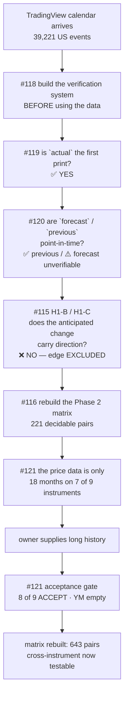
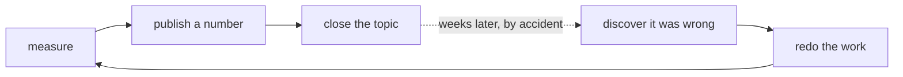

# WS-NEWS2 — verification, data provenance, and Phase 1

**Everything since the TradingView calendar arrived.** Nothing below is a plan. Every number is
re-derived on demand from a committed file by `optimize/verify/run.py` (currently **11/11**), and the
harness that does the re-deriving is itself tested by being made to fail (**5/5**).

---

# PART 0 — THE ONE-PAGE VERSION

| | |
|---|---|
| **What we set out to test** | does a scheduled news release let us trade *before* it, using only the numbers known in advance? |
| **Answer** | ❌ **No.** A tradeable edge is **excluded at 95% confidence**, not merely undetected. |
| **What made the answer trustworthy** | a planted-effect probe proving the pipeline *can* find an edge if one exists |
| **What the data turned out to be** | ✅ sound — but only after **five separate provenance checks**, three of which found something |
| **What I got wrong along the way** | **six** published figures or checks, every one caught before it mattered |
| **Where we are now** | Phase 1 closed; the price data for all 9 instruments is in and 8 of 9 accepted; Phase 2 matrix rebuilt at **643 decidable pairs** |



---

# PART 1 — THE VERIFICATION SYSTEM (#118)

## 1.1 Why it was built before anything else was run

The repeated failure in this project has never been getting an answer wrong. It is a loop:



Ten such defects are catalogued in #118. **Every single one produced plausible output and no error
message.** None was caught by code failing. They were caught later, incidentally, or by a control that
happened to be present.

They share exactly one property:

> **A check was run, it passed, and the check was not capable of failing.**

That is why running the same check three times is worthless — three repetitions of a check that cannot
fail is still a check that cannot fail.

## 1.2 The three verifications, and why they must differ

| | name | what it asks | what it catches | ⚠️ what it is **blind to** |
|---|---|---|---|---|
| **V1** | **Re-derivation** | compute the same quantity by a **different code path** | implementation bugs, arithmetic slips, transcription errors | **bad input** — a flawless calculation on wrong data passes every time |
| **V2** | **Independent source** | does a **different dataset, instrument or publisher** agree? | bad input, source-specific artefacts | **a shared convention error** — two sources using the same wrong timezone rule agree perfectly |
| **V3** | **Falsification** | state something that must be **FALSE**, then check that it is | **an instrument that cannot fail** | it requires imagination — you must be able to name how you could be fooled |

**V3 was missing in every one of the ten defects.** In plain terms: instead of asking *"did my check
pass?"*, V3 asks *"what would be true if my instrument were broken — and is that thing false?"*

## 1.3 Two structural gates that fail before any measurement runs

1. **No declared blind spot ⇒ FAIL.** A check that passes on a *sample* must state the sample **and the
   population**. "Verified" with no denominator is not a result.
2. **No V3 ⇒ FAIL.**

## 1.4 The claims ledger

Every published figure is bound to the file it came from and to a function that reads it back. **A
figure no function in the ledger can produce has no standing** — even if it happens to point the same
way as the truth.

> ⚠️ **When a claim fails, fix the document or fix the code. Never adjust `expect` to match the
> output.** That converts the ledger into a rubber stamp that records whatever happened.

*(There is one legitimate exception, exercised in Part 6: when the underlying **evidence file** changes
for a real reason, `expect` moves **with the reason recorded in the code**. The rule bars fudging a
wrong claim, not tracking a file that legitimately changed.)*

## 1.5 The harness is tested by being made to fail

`--selftest` reconstructs five real historical defects **exactly as they were originally published** and
requires rejection. **5/5.**

⭐ The most instructive replay: the TradingView daylight-saving defect. Its **V1 check passes** — the
original evidence (Nonfarm Payrolls, 164/164 correct) genuinely *is* true — and the claim is **still
rejected**, because the ledger value and the V3 falsifier look at the **population** rather than the
sample.

### ⚠️⚠️ The self-test itself passed for the wrong reason on its first run

Two replays reported *"correctly REJECTED"* — by a `FileNotFoundError` from a bad path constant, **not
by the defect they were replaying.** A green self-test that is green for an unrelated reason is the
same disease, one level up. Rejections must now **match an expected reason**, and a rejection caused by
a crash is explicitly failed.

---

# PART 2 — EXPERIMENT 1: is `actual` the first print? (#119)

## 2.1 The question, and why it gates everything

Phase 2's features are built on `actual`:

```
surprise      = actual − forecast
level change  = actual − previous
```

If TradingView back-fills **revised** values, both contain information that did not exist at the release
second. The study would then produce a clean, well-controlled, **look-ahead contaminated** result —
the most expensive failure available to us, because nothing about the output would look wrong.

**The magnitude is not hypothetical.** March 2020 payrolls were later revised from **−701,000 to
−1,398,000 jobs**. The value doubled.

## 2.2 Method

ALFRED (FRED's vintage archive) stores what a trader actually saw on a given morning. So each release
gives **three** numbers instead of two:

| | source | meaning |
|---|---|---|
| **first print** | ALFRED vintage as of the release date | what was published that morning |
| **current** | FRED today | after every revision to date |
| **TV actual** | TradingView | the number under test |

⭐ **The discriminating subset.** For many months the first print and today's value are nearly
identical, and those releases **cannot tell the two hypotheses apart at all**. Including them dilutes
the answer toward "matches both", which is not an answer. The verdict is computed **only** where the two
differ materially, and that subset's size is reported **before** the verdict.

## 2.3 Result — FIRST PRINT

| series | n discriminating | median revision | matches **first print** | matches **revised** | verdict |
|---|---|---|---|---|---|
| Non Farm Payrolls | **116** | 66,000 jobs | **100%** | **0%** | FIRST PRINT |
| Retail Sales MoM | **88** | 0.44 pp | **100%** | **0%** | FIRST PRINT |
| Durable Goods Orders MoM | **111** | 0.95 pp | **99%** | **0%** | FIRST PRINT |
| Inflation Rate MoM | 4 | 0.22 pp | — | — | ⚠️ **CANNOT TELL** |

The largest revisions make the point without statistics:

| reference month | TV `actual` | first print | value today | revision |
|---|---|---|---|---|
| 2020-03 | **−701** | **−701** | −1,398 | 697 |
| 2021-11 | **210** | **210** | 658 | 448 |
| 2022-01 | **467** | **467** | 190 | 277 |

## 2.4 ⭐ Why CPI's "cannot tell" is the rule working, not a disagreement

CPI is revised by **less than the 0.1 percentage point it is reported to**. On 121 of 125 releases the
first print and today's value are *the same number*, so the release carries no information about which
hypothesis is true. Only 4 discriminate — below the pre-registered threshold of 20, so the rule
**withholds a verdict**.

**This is an absence of power, not evidence of disagreement.** Reporting it as "CPI agrees" would have
been exactly the error the power-analysis rule exists to prevent. It is also why I did not stop at one
independent series: retail sales and durable goods are percent-change series that *are* materially
revised.

## 2.5 The verification

| | check | result |
|---|---|---|
| **V1** | the first-published **level** via a different mechanism (FRED `output_type=4`, initial-release-only) vs the point-in-time query | ✅ **100% agreement on all 503 events** |
| **V2** | two further statistics, different publishers, percent-change rather than level-difference | ✅ retail 88 → 100%/0%; durables 111 → 99%/0% |
| **V3a** | ⚠️⚠️ **shifted-month control** — TV `actual` vs the **wrong month's** first print | ✅ collapses to **1–5%** |
| **V3b** | ⭐ *"the decision rule always returns a verdict"* must be FALSE | ✅ CPI returns CANNOT TELL |

⭐ **V1 was load-bearing.** The live risk was that `realtime_start=<release date>` returns the state
*before* the 08:30 release — an off-by-one that would have had me comparing TradingView against the
**previous month's** vintage, with every number looking reasonable.

⭐⭐ **V3a is what makes the 100% mean anything.** A matcher loose enough to match a neighbouring month
would score 100% against *anything*.

## 2.6 The one mismatch in 503, traced rather than waved off

Durable Goods, reference month 2018-07: TradingView **−1.7%**, our level-derived first print
**−1.838%**, today's value **−3.278%**. Vintages on four consecutive dates all give −1.838, so the
release-morning vintage is stable and the residual is in **our reconstruction** — TradingView carries the
headline percentage as published, while differencing the seasonally-adjusted index gives −1.84. It sits
**0.14 pp from the first print and 1.58 pp from the revised value**, so it does not favour the revision
hypothesis. ⚠️ I have not verified the Census headline directly and do not claim to.

## 2.7 A defect found during the run

FRED's `output_type=4` **requires an explicit realtime span**. Without one it defaults to `today..today`
and answers `400 "No vintage dates exist for the specified real-time period"` — which reads like a fact
about the data. Our `alfred.py` legitimately maps HTTP 400 to `SeriesNotInAlfred` (permanent, expected),
so inside a `try/except` this would have **silently reported "no vintages" and skipped V1 entirely**,
leaving the off-by-one risk unchecked while the run looked complete.

---

# PART 3 — EXPERIMENT 2: are `forecast` and `previous` point-in-time? (#120)

## 3.1 Why #119 was not enough

#119 cleared **one** of three numbers. And **H1-B/H1-C rest entirely on `forecast − previous`** — the one
feature where *neither* input had been checked. Stopping at `actual` would have left the Phase 1
hypothesis resting on wholly unverified data **while looking validated**.

## 3.2 Test A — `previous` is point-in-time. Direct and decisive.

⭐ **The test works because of how the statistical agencies revise.** At release N for reference month
`m`, the calendar's `previous` shows month `m−1`, and three genuinely different numbers are candidates:

| candidate | who would show it |
|---|---|
| the **first print** of m−1 | a naive copy of the prior `actual` |
| m−1 **as it stood at release N** | ⭐ a real-time calendar |
| **today's** value of m−1 | ⛔ a back-filled database |

The BLS revises the prior two months with **every** release, so these are routinely different numbers.

| series | n discriminating | matches **point-in-time** | matches **today's** | shifted-release control | verdict |
|---|---|---|---|---|---|
| Non Farm Payrolls | **119** | **99%** | **0%** | 0.9% | POINT-IN-TIME |
| Durable Goods MoM | **103** | **98%** | **0%** | 2.9% | POINT-IN-TIME |
| Retail Sales MoM | **92** | **99%** | **0%** | 2.2% | POINT-IN-TIME |
| Inflation Rate MoM | 4 | — | — | — | ⚠️ CANNOT TELL |

⭐⭐ **A back-fill cannot produce this.** Reproducing the prior month's value *as of a past morning*
requires a per-series vintage archive, which calendar vendors do not keep. **The row was captured live.**

## 3.3 ⭐ Test C — an unexpected finding that changes what a Phase 2 feature MEANS

How often `previous` simply equals the prior release's `actual`:

| Non Farm Payrolls | Durable Goods | Retail Sales | **CPI** |
|---|---|---|---|
| **3%** | 8% | 15% | **95%** |

So `actual − previous` is **not the same quantity across series**:

- For **payrolls** it is this month's print against the **revised** prior month — what the market reacts to.
- For **CPI** it is effectively **first print vs first print**, because CPI is barely revised.

⚠️ #116 described this feature as the revised-basis change for *all* series. Right for payrolls, wrong
for CPI. **Pooling them puts two different quantities in one column**, in a way correlated with *which
series* — systematic, not noise.

## 3.4 ⚠️⚠️ Test B — the part I got wrong, caught before publishing

### What I pre-registered

**B2:** does `forecast − first_print` correlate with the **later revision**? A consensus formed *before*
the release cannot know a revision published *months afterwards*, so any correlation is future
information.

**It fired.** CPI Spearman **+0.380 (p<0.001)**, payrolls **+0.193 (p=0.030)**, durables Pearson
**+0.244 (p=0.006)**. The script printed **"EVIDENCE OF CONTAMINATION"**.

### Why that conclusion is wrong

**B2 is confounded, and I did not see it when I wrote the pre-registration.** If forecasters are better
informed than the first print, then when the print lands too low the consensus sits *above* it **and**
the statisticians later revise *up*. **The innocent hypothesis predicts the same sign as the
contaminated one.** *"Consensus forecasts contain information about future data revisions"* is a
standard result, not a sign of cheating.

### Two attempts to rescue it, neither of which fixed the logic

- **B2b — split the revision by horizon.** Short-run (driven by late survey responses forecasters partly
  have) vs long-run (annual benchmark revisions nobody could know). With Bonferroni over 16 tests
  (α = 0.00313), only CPI's long-run term fired.
- **B2c — control for `actual`.** Partial correlation of `forecast` with the long-run revision,
  controlling for `actual`: CPI **+0.261 (p=0.0036)**, retail **+0.283 (p=0.0016)**, payrolls +0.063
  (p=0.49), durables +0.141 (p=0.12).

⚠️⚠️ **The same innocent story survives every version.** If the consensus carries information the first
print lacks, then conditional on the print a higher consensus implies the truth is higher — so later
revisions move that way **at every horizon**. Three tests, one undecidable question.

### And there is no archive to appeal to

Round 1's Nasdaq consensus file covers **2010 only**; TradingView starts **2013**. **They do not
overlap.** No official body archives consensus.

> ⚠️ **So `forecast` cannot be verified by this workstream.** The verdict is **"no evidence of
> contamination"**, never "verified" — and that is enforced in the code, not just the prose.

### What *is* established for `forecast`

| | |
|---|---|
| exact-zero-surprise rate | payrolls **0.8%**, durables 0.8%, retail 10.6%, CPI 36% — **not a copy of `actual`** |
| ⭐ **planted-contamination probe** | a forecast copied from `actual` is detected at **100%** — so the low reading is a real negative, not a dead detector |
| dumb control | shuffling forecasts within a series inflates the spread of surprises **2.5–3.0×** |
| ⭐ **indirect but strong** | Test A proves the **row was captured live** |

---

# PART 4 — EXPERIMENT 3: PHASE 1 — does the anticipated change carry direction? (#115)

## 4.1 The hypotheses

| | question | outcome measured |
|---|---|---|
| **H1-A** | can we survive the wait to the release without being stopped out? | worst adverse excursion in `[T−X, T)` |
| **H1-B** | does the market drift toward the anticipated change **before** the print? | return over `[T−X, T)` |
| **H1-C** | does the anticipated change predict direction **after** the print? | return over `[T, T+h)` |

**Feature:** `A = forecast − previous` — the *anticipated change*, the only number available before the
release that could carry direction.

⚠️ **Strong prior against, recorded before the run** so a null would be no surprise and a hit no fluke:
round 1 found **no information leak** before the print (07:45–08:28 runs 0.81–0.89× a control);
`forecast` is **public**, so an efficient market has already priced it; and round 1 measured the reward
side of scheduled news as **zero** on a proxy surprise.

## 4.2 H1-A — survival is not the blocker, but the window is not safe either

| instrument | wait | stop | survive | vs a time-of-day-matched control |
|---|---|---|---|---|
| NQ | 5 min | 0.40% | **98.3%** | **4.37× more likely to be stopped** |
| GC | 5 min | 0.40% | **98.1%** | **2.48×** |

⚠️ **My original framing was wrong, and only the dumb control exposed it.** I predicted the pre-release
window would be *quieter* (round 1 measured 0.78× in the immediate pre-window). Measured, the window is
**never safer** than a matched ordinary window, at any stop width, on either instrument.

⭐ **And the danger rises with the width of the stop** — NQ 1.19× / 1.56× / 2.60× / **4.37×** across
stops of 0.05% / 0.10% / 0.20% / 0.40%. That is the signature of a **rare large excursion**, not of
generally choppier trading: a wide stop is only reachable by a big move, so a ratio that grows with stop
width says the extra events are concentrated in the tail.

This reconciles two facts that looked contradictory: round 1's *average* move size in the window
(**0.78×** — "the market goes quiet") and this *worst excursion* (**up to 4.37×**). **The window is
typically quiet and occasionally violent.** A design that reads "quiet" from the average will size stops
for a distribution it does not face.

## 4.3 H1-B / H1-C — pre-registered design

| | value | tests |
|---|---|---|
| H1-B window `X` | 5, 15, 30, 60 min | 2 instruments × 4 = 8 |
| H1-C horizon `h` | 5, 15, 60 min | 2 instruments × 3 = 6 |
| correlation types | Pearson **and** Spearman | ×2 |

**14 primary tests × 2 = 28 ⇒ Bonferroni α = 0.00179**, fixed before running.

**Universe deliberately restricted to the four series whose `actual`, `previous` and `forecast` went
through #119/#120.** Running on the other 99 would have tested a hypothesis on data of unchecked
provenance — the habit this whole sequence exists to break. **Coverage traded for verified inputs, on
purpose, and stated rather than discovered later.**

⚠️⚠️ **Normalisation is expanding, never full-sample.** `A` is in thousands of jobs for payrolls and
percent for CPI, so it must be normalised before pooling — but a full-sample z-score uses the mean and
spread of events that had not happened yet. That is look-ahead, and it is invisible in the output.

## 4.4 Result — NEGATIVE, and a tradeable edge is EXCLUDED

**0 of 7 cells clear Bonferroni on either instrument.** The strongest cells:

| | | Pearson | Spearman | permutation | control |
|---|---|---|---|---|---|
| NQ | H1-B 60m | +0.085 (0.087) | **+0.115 (0.020)** | 0.017 | −0.020 |
| GC | H1-B 15m | **+0.154 (0.002)** | +0.051 (0.312) | **0.308** | −0.017 |

⭐⭐ **But the decision-relevant number is directional accuracy, not correlation.** A rule would trade the
**sign** of the anticipated change, and converting a correlation to an accuracy needs a
bivariate-normal assumption that this data's fat tails violate. So it was measured directly:

| | best cell | **highest 95% upper bound, any cell** | required to break even (#111) |
|---|---|---|---|
| **NQ** | 53.5% | **58.3%** | **71%** |
| **GC** | 52.3% | **57.1%** | **71%** |

**At 95% confidence the true accuracy is below 58.3%. That is far below 71%.** So this is not *"we
looked and did not find an edge"* — **a tradeable edge is ruled out.** Absence of evidence has become
evidence of absence, for the decision that matters.

⚠️ **50% is a coin flip.** An accuracy of 53.5% whose interval contains 50 is not a weak edge worth
refining — it is **no edge**, and it would still pay the full round trip (~$9.50 on NQ) plus the
elevated tail risk H1-A measured during the wait.

## 4.5 ⭐⭐⭐ Why the null is worth anything: the planted-effect probe

**A null from a broken pipeline is indistinguishable from a null from an absent edge** — and this
workstream produced a **manufactured null the same week** (the daylight-saving defect, Part 5). So the
pipeline was handed a synthetic feature that *is* the outcome plus noise, across a range of effect
sizes, and required to find it:

| planted correlation | NQ | GC |
|---|---|---|
| 0.05 | missed | missed |
| 0.10 | missed | missed |
| **0.15** | ✅ **DETECTED** | missed |
| **0.20** | ✅ DETECTED | ✅ **DETECTED** |
| 0.30 / 0.40 | ✅ DETECTED | ✅ DETECTED |

**Study resolution ≈ 0.195. Smallest detected: NQ 0.15, GC 0.20.** The pipeline finds effects **at and
below its own stated resolution**. The absence is an absence, not a failure to look.

⚠️ Disclosure: the probe is calibrated on a Pearson correlation under a Gaussian assumption while the
statistic measured is Spearman on a fat-tailed outcome, so the measured value does not track the target
monotonically. It is a **detection floor, not a calibration table**.

## 4.6 ⭐ A rule that paid off in the opposite direction from round 1

GC H1-B 15m: **Pearson +0.154 (p=0.002)** — the only cell in either instrument that came close.
**Spearman +0.051 (p=0.31)**, permutation control **p=0.308**. A **fat-tail artefact that Pearson alone
would have published as a finding.**

Round 1's gold result was the mirror image — Spearman −0.193 while Pearson read −0.012, p=0.73.
**Requiring both is what catches it in either direction**, and this is the first time the rule has paid
off the other way.

## 4.7 The GO / NO-GO

| | |
|---|---|
| **H1-A** | ✅ survival is fine |
| **H1-B / H1-C** | ❌ direction is absent |

⭐ **A pre-positioned trade is therefore a coin flip that pays a full round trip plus an elevated tail
risk during the wait** — negative expectancy by construction, with no directional edge to offset it.

**Phase 1 produces no tradeable entry.** It does produce two facts Phase 2 needs: the pre-release window
is quiet-but-fat-tailed, and the **public** part of the news is already in the price — exactly the
efficient-market prediction — which sharpens Phase 2's question to whether the **surprise** does better.

---

# PART 5 — THE SIX CORRECTIONS TO MY OWN WORK

Listed in full, because the point of this report is that none of them survived to become a redo.

| # | what I published | what was true | how it was caught |
|---|---|---|---|
| 1 | *"daylight saving is correctly encoded at source"* | **87 pre-2016 series are one hour late in summer**; 2014: 90% of series inconsistent, 2015: 91% | I verified **one series** (payrolls) and generalised — and payrolls is the one that is clean. Caught by auditing **all** series |
| 2 | *"the pre-release window is 1.31–2.92× more dangerous"* | that range **appears in no result file**, either-side or per-side | re-reading my own numbers against the JSON that produced them |
| 3 | *"`Inflation Rate Mom` is TradingView's own casing, verified"* | **no such title exists** — 161 rows are `Inflation Rate MoM`; the 1-row neighbour is a different release | counting the actual title values |
| 4 | *"the Phase 2 matrix is 927 pairs"* | **I counted the event side and never checked the price side** — 7 of 9 instruments had 18 months | checking the price frames |
| 5 | *"EIA Crude Oil → CL, ~510 releases — the best pair available"* | the calendar has ~510; **the CL frame reached 79**. Wrong by ~6×. And EIA → **NQ** reached 545, so the oil release was best tested on the *index* | same check |
| 6 | *"EVIDENCE OF CONTAMINATION"* (the B2 revision test) | **the test was confounded** and could not distinguish contamination from competence | thinking through what the innocent hypothesis predicts |

## ⭐ The through-line

Three of the six (2, 3, 5) are the same error: **a number quoted from memory, from one side of a join,
or from an example I never measured.** Two (1, 4) are the same error: **a true statement about a sample
published as a statement about the population.** One (6) is a falsifier whose two hypotheses predicted
the same sign.

> **Design the falsifier so the innocent explanation and the claimed one predict DIFFERENT signs** —
> otherwise the test decides nothing, however cleanly it runs.

---

# PART 6 — THE PRICE DATA (#121)

## 6.1 The gap, found while amending #116

Seven of nine instruments held **eighteen months** of 1-minute history. A monthly release gives **18
observations** there — not a weak test, an **impossible** one. **The cross-instrument premise of this
entire round** — *"a release may move oil a lot but not Nasdaq, so we trade oil"* — was unanswerable for
every monthly release.

## 6.2 The acceptance gate, built before the data arrived

Six checks plus a falsification probe, **each stating what it is blind to**.

⭐⭐ **The strongest is the overlap.** We already held 18 months per instrument and it is what the engine
trades — so a new long frame has a **ready-made answer key**. If it disagrees on shared timestamps, one
of the two is wrong and nothing proceeds until we know which.

**Calibrated on known-good data before being trusted on unknown data**, which immediately exposed a
false positive: the first timezone check required the busiest minute to be the 09:30 equity open.
Payrolls-driven NQ passed; **gold failed** — its volume peaks at 13:29 (COMEX floor close) and 08:30.
But the gold frame is provably correct. **A false positive on known-good data**, fixed by comparing the
volume profile against the existing frame instead of hardcoding session knowledge.

## 6.3 Result — 8 of 9 ACCEPT

| instrument | rows | span | overlap vs the engine frame | volume-profile ρ | full coverage from |
|---|---|---|---|---|---|
| **ES** | 4,898,150 | 2010-06-06 → 2026-08-07 | 486,954 @ **100.0000%** | **1.000** | 2016 |
| **CL** | 4,829,557 | 2010-06-06 → 2026-08-07 | 529,775 @ **100.0000%** | **1.000** | 2016 |
| **NG** | 4,170,641 | 2010-06-06 → 2026-08-07 | 491,633 @ **100.0000%** | **1.000** | 2017 |
| **HG** | 5,253,664 | 2010-06-06 → 2026-08-07 | 500,923 @ **100.0000%** | **1.000** | 2011 |
| **SI** | 5,250,736 | 2010-06-06 → 2026-08-07 | 518,753 @ **100.0000%** | **1.000** | 2011 |
| **RTY** | 3,007,189 | 2017-07-09 → 2026-08-07 | 519,492 @ **100.0000%** | **1.000** | 2019 |
| NQ / GC | unchanged | | **100.0000%** | **1.000** | 2016 / 2011 |
| **YM** | **0** | — | — | — | ⛔ **BLOCKED** |

RTY starting 2017-07 is consistent with the contract's own listing history, not a gap.

## 6.4 ⛔ YM is blocked

`YM_1s.csv` holds **14,544,125 rows (830 MB)** — the source is fine. **Every** aggregated frame (1m, 2m,
5m, 15m, 1h, 2h, 4h and the sub-minute ones) is **0 bytes**. The resample produced nothing and **raised
no error** — this project's signature failure mode, arriving in a new place.

## 6.5 Three real findings in the data

### 1. Pre-2016 is sparse, and differently per instrument

Whole trading **days** are missing early on — in 2010 only **33 sessions** have any 08:00–10:00 data.

⭐ **But within the days that are present, coverage is complete: 118.8–120.0 of 120 minutes.** So this is
**sample loss, not measurement error**. The study floor is therefore **per instrument** (2016 for
NQ/ES/CL, 2017 NG, 2019 RTY, 2011 GC/HG/SI) rather than one global cut that would either discard good
years or admit thin ones.

### 2. A pre-2016 volume-attribution artefact

Share of each year's volume sitting in the 18:59 / 19:59 closing bars:

| 2010 | 2011 | 2012 | 2013 | 2014 | 2015 | 2016+ |
|---|---|---|---|---|---|---|
| **62–65%** | 53–58% | 42–47% | 15–18% | 15–22% | 11–13% | **0%** |

Identical signature on CL, NQ and ES — so it is **the aggregator, not the market**. Prices are
unaffected (the overlap is 100%), but **any volume-based analysis on those years is meaningless**.

### 3. Unadjusted contract rolls

NG **68**, CL **11** — all at the **18:00–18:02 session open** on roll days, so **structurally outside
any window** around an 08:30 / 10:00 / 10:30 / 14:00 release. The remaining intraday jumps are **real
market history**: CL's 2020 OPEC/COVID collapse, HG's 2025 copper-tariff crash.

## 6.6 ⚠️⚠️ The gate had three defects of its own, and the real data exposed all three

It initially **rejected five of seven good files**:

| # | defect | consequence |
|---|---|---|
| 1 | the timezone check compared the **full 16-year** profile against an **18-month** one | failed CL and NG, whose clocks are provably correct — restricted to the overlap their profiles are identical **to the unit** |
| 2 | price continuity **conflated rolls with crashes** | failed CL, NG and HG for contract rolls and for the 2020 oil collapse |
| 3 | thin early years treated as **corruption** | would have discarded ten good years to avoid three sparse ones |

**A gate that cries wolf is one everyone learns to skip** — the third time that lesson has come up in
this project, and this time it fired on five of seven good files.

## 6.7 ⚠️⚠️ The ledger caught a published number going stale

The NQ frame was regenerated on 2026-08-12, so H1-A had to be re-run:

| | before | after |
|---|---|---|
| releases matching a bar | 1,165 | **998** |
| NQ 5-min / 0.40% danger ratio | 4.27× | **4.37×** |
| GC | 2.05× | **2.48×** |

The conclusion is unchanged and slightly **stronger**. `expect` was updated **with the reason recorded in
the code**. **Without the ledger this would have gone unnoticed until someone re-ran the study by
accident** — precisely the loop #118 exists to break.

⚠️ Also found: **210 of 1,208 calendar releases have no bar and are silently dropped**, almost all
pre-2013 (66 in 2010, 57 in 2011, 47 in 2012). **H1-A is effectively a 2013+ result**, now stated in its
blind spot.

⭐ And a suspicion of mine that turned out to be **wrong**, checked rather than assumed: I believed the
window arithmetic was positional rather than temporal and would span gaps. **Measured: it does not.** A
nominal 5- or 60-minute wait realises 5 or 60 minutes at the median and never exceeds 7 or 70.

---

# PART 7 — THE PHASE 2 MATRIX (#116)

## 7.1 The rule: not "big enough sample" but "can this pair DECIDE the question?"

#111 established that a rule needs **~71% directional accuracy** to cover costs. For a monotone
association that is a correlation of `r = sin(π × (0.71 − 0.5)) = 0.613`.

> **A pair qualifies iff its minimum detectable effect at the Bonferroni α is BELOW 0.613.**

**Why this is the right rule and not a convenience:** a pair whose resolution is *worse* than the
tradeable threshold can only ever return a null that is **uninformative by construction** — while
consuming correction budget and thereby weakening every pair that *could* have decided something.
**Running it is worse than not running it.**

⚠️ The rule is self-referential (α depends on how many pairs qualify) and is solved to a fixed point.

## 7.2 The number, and its history

| | |
|---|---|
| candidates | **1,515** |
| ⭐ **decidable** | **643** — Bonferroni **α = 0.000078** |
| excluded as undecidable | 872 |
| by instrument | NQ 82, GC 82, ES 82, CL 82, HG 82, SI 82, NG 81, RTY 70 |

**270** (guessed, before we had a calendar) → **927** (wrong — assumed all nine instruments had the 2016+
era) → **221** (under the 18-month constraint) → **643** (now).

> ⭐ **The lesson that survives all of it: a join has two sides, and an `n` quoted from one of them is
> not an `n`.**

## 7.3 ⚠️ Blind spots of the matrix itself

- The 71% → r = 0.613 conversion uses a **bivariate-normal orthant approximation**, and **fat tails
  violate normality**. It is used to *set a threshold*, never to report a result.
- The rule assumes the **correlation** is the statistic of interest. A **threshold effect** ("only huge
  surprises matter") could be decidable in a pair this filter excludes.
- Price spans were read on **2026-08-15**. If YM is fixed or more history arrives, the matrix must be
  **recomputed, not patched** — and α will tighten, so more coverage demands larger effects.

---

# PART 8 — WHAT WENT WELL, WHAT WENT WRONG

## What went well

1. **The verification system was built before the data was used**, and it earned its cost immediately —
   the retraction scanner caught a real defect in its first minute, and the ledger caught a published
   number going stale weeks later.
2. **Every negative result carries a planted-effect probe.** The Phase 1 null is trustworthy *because*
   the pipeline demonstrably finds effects at and below its own resolution.
3. **The decision-relevant number was measured, not converted.** Reporting directional accuracy with a
   confidence interval turned "no effect detected" into "a tradeable edge is excluded".
4. **The acceptance gate was calibrated on known-good data first**, which exposed three of its own
   defects before they could reject the owner's real data permanently.
5. **The data itself is excellent** — 100.0000% agreement on every overlap, ρ = 1.000 on every volume
   profile.

## What went wrong

1. **I published six figures or conclusions that were wrong**, and every one was caught by a check
   rather than by luck — but they should not have been published.
2. **Three of the six were the same error**: quoting a number from memory, from one side of a join, or
   from an example never measured.
3. **My gate rejected five of seven good files** on its first contact with real data. A gate that cries
   wolf gets ignored, which is worse than no gate — and this is the third occurrence in this project.
4. **A pre-registered falsifier was confounded.** B2 could not have decided the question it was written
   for, and I only saw it after it fired.
5. **`forecast` remains unverifiable.** No consensus archive exists. Every Phase 2 result will inherit
   that caveat, and it cannot be resolved from inside this workstream.

---

# PART 9 — WHERE THIS LEAVES THE PROGRAMME

| | status |
|---|---|
| `actual` | ✅ **first print** (#119) |
| `previous` | ✅ **point-in-time** (#120) |
| `forecast` | ⚠️ **not verifiable**; no evidence of contamination |
| **Phase 1** | ✅ **CLOSED — no tradeable entry.** Survival fine, direction absent, edge excluded at 95% |
| Price data | ✅ 8 of 9 accepted; ⛔ YM blocked on an empty aggregation |
| **Phase 2 matrix** | ✅ **643 decidable pairs**, α = 0.000078 |
| Phase 3 | ⏳ blocked on deriving the release **second** from the tape |

**Next:** re-run H1-A across all eight accepted instruments (Phase 1 completion at full coverage), then
Phase 2 against the 643-pair matrix.
