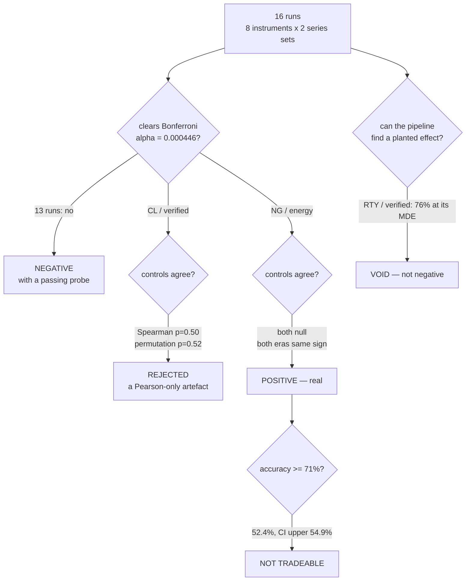

# WS-NEWS2 Phase 1 — complete, across eight instruments

**Sixteen runs. One real effect. It does not pay.**

Every number below re-derives on demand from a committed file (`optimize/verify/run.py`, **12/12**),
and the harness that re-derives them is itself tested by being made to fail (**5/5**).

---

# PART 0 — THE ONE-PAGE VERSION

| | |
|---|---|
| **What was run** | H1-A on 8 instruments; H1-B/H1-C on 8 instruments × 2 series sets = **16 runs** |
| **Correction** | Bonferroni over **112** tests ⇒ α = **0.000446**, fixed before running |
| ⭐ **The one positive** | **EIA natural-gas releases predict NG direction after the print** — 3 of 3 post-release cells, controls null, both eras agree |
| ⚠️⚠️ **And it does not pay** | 52.4% accuracy, 95% CI **[50.0, 54.9]%**, against a **71%** break-even |
| **Everything else** | 13 NEGATIVE · 1 VOID (underpowered) · 1 rejected by its own controls |
| **Tradeable edge** | **EXCLUDED in 16 of 16** |
| **Two #115 conclusions** | did **not** generalise beyond NQ and GC |
| **Two of my instruments** | were wrong, and both were caught by their own outputs looking odd |

---

# PART 1 — WHY PHASE 1 HAD TO BE RE-OPENED

#115 answered Phase 1 **on two instruments**, because two were all we had. #121 delivered long history
for six more.

Phase 1's conclusion was therefore a statement about NQ and GC **published under a heading that reads
like a statement about the programme.** That is the same shape as the defect that started this whole
sequence — *a true statement about a sample, presented as a statement about the population* — so it got
its own issue (#122) with its own pre-registration rather than a comment on the old one.

⭐ **This turned out to matter.** Two of #115's conclusions are false outside NQ and GC, and one real
effect existed in a place two instruments could not see.

---

# PART 2 — THE SETUP

## 2.1 What was measured

| | question | outcome |
|---|---|---|
| **H1-A** | can we survive the wait to the release without being stopped out? | worst adverse excursion in `[T−X, T)` |
| **H1-B** | does the market drift toward the anticipated change **before** the print? | return over `[T−X, T)` |
| **H1-C** | does the anticipated change predict direction **after** the print? | return over `[T, T+h)` |

**Feature:** `A = forecast − previous` — the *anticipated change*.

## 2.2 ⚠️ The study floor is per instrument, not global

The calendar floor is 2016 everywhere (the TradingView daylight-saving defect, #114). But the **price**
frames reach full bar coverage at different years, because the pre-2016 source is sparse and the
sparsity differs by instrument.

| instrument | floor | releases after the floor | matched to a bar |
|---|---|---|---|
| NQ, ES | 2016 | 792 | **785** |
| GC, CL, HG, SI | 2016 | 792 | **782** |
| NG | **2017** | 728 | **719** |
| RTY | **2019** | 575 | **570** |

⭐ Only **7–10** events now fail to match a bar, against **210** before the floor existed. **The loss is
now an explicit choice rather than a silent era-skew.**

⚠️ A single global cut would have either discarded good years (gold, copper and silver are complete
from 2011) or admitted thin ones (RTY has nothing usable before 2019). **A thin year does not announce
itself in the output.**

## 2.3 ⚠️⚠️ The correction changed with the instrument count

#115 corrected over **28** tests (2 instruments). Eight instruments makes it **112** ⇒ Bonferroni
**α = 0.05/112 = 0.000446**.

**This raises the bar.** More coverage demands larger effects, and a cell that was borderline at two
instruments will not survive at eight. Fixed **before** running, not after seeing which cells were close.

## 2.4 Two series sets, and why they are never pooled

| set | series | provenance |
|---|---|---|
| **verified** | Non Farm Payrolls, Inflation Rate MoM, Retail Sales MoM, Durable Goods Orders MoM | ✅ cleared by #119 and #120 |
| ⚠️ **energy** | EIA crude / gasoline / natural gas / distillates | ❌ **NOT cleared** — we do not know their `actual` is a first print or their `previous` point-in-time |

The energy releases are included because they are **the only way to test the owner's actual premise**
(*"a release may move oil a lot but not Nasdaq"*) and because they are **weekly**, carrying roughly four
times the sample of any monthly series.

⭐ The honest handling is to run them, **label them UNVERIFIED in the output itself** — so a reader does
not have to know the provenance to read the result — and **never pool them** with the verified four.

---

# PART 3 — H1-A: SURVIVAL DOES NOT GENERALISE

## 3.1 The result

Survival of a 5-minute wait with a stop set at 0.40% of price:

| instrument | survive | |
|---|---|---|
| GC | **98.8%** | ✅ |
| ES | **98.7%** | ✅ |
| HG | **98.3%** | ✅ |
| RTY | **97.9%** | ✅ |
| NQ | **97.8%** | ✅ |
| SI | 94.2% | ⚠️ |
| CL | 93.6% | ⚠️ |
| **NG** | **70.1%** | ⛔ |

## 3.2 ⭐⭐ What this overturns

> **#115 concluded "survival is not the blocker."** That is **true of NQ and GC and false of natural
> gas**, where **nearly one pre-positioned trade in three is stopped out before the news even fires.**

⚠️ And the reason is *not* that the gas release is dangerous. NG's stop-out ratio against a
time-of-day-matched control is **0.97** — the pre-release window is completely ordinary. The problem is
that **a 0.40% stop is simply tight relative to gas's everyday volatility.**

⭐ **This is the units lesson again, in a new costume.** In #115 a 40-*point* stop meant 0.13% on NQ and
1.3% on GC — the same number meaning different risks. Moving to percent-of-price fixed *that*. But a
**fixed percentage** still means different risk on instruments with different volatility. **There is no
universal stop.** The right normalisation is a volatility multiple, and this study does not use one —
stated here rather than discovered later.

---

# PART 4 — H1-A: THE DANGER SIGNATURE IS AN EQUITY PHENOMENON

## 4.1 The result

Stop-out rate in the pre-release window ÷ the same measurement on time-of-day-matched non-release days,
at a 5-minute wait:

| instrument | 0.05% | 0.10% | 0.20% | 0.40% | rises with stop width? |
|---|---|---|---|---|---|
| **NQ** | 1.16 | 1.72 | 1.97 | 16.74 | ✅ |
| **ES** | 1.33 | 1.94 | 2.04 | 9.85 | ✅ |
| **RTY** | 1.24 | 2.05 | 4.10 | 11.87 | ✅ |
| **GC** | 1.03 | 1.15 | 1.58 | 2.97 | ✅ |
| HG | 1.03 | 1.15 | 0.99 | 4.29 | ✗ |
| CL | 1.00 | 1.00 | 0.89 | 1.18 | ✗ |
| NG | 0.99 | 0.99 | 0.94 | 0.97 | ✗ |
| SI | 1.02 | 1.04 | 0.89 | **0.71** | ✗ |

**The three equity indices and gold show the pattern. Energy and silver do not** — CL, NG and SI sit at
or *below* 1.0, meaning the pre-release window is no more dangerous than an ordinary window, and for
silver at a wide stop it is measurably **safer**.

## 4.2 ⭐ What this narrows

#115 reported the rise-with-stop-width signature as a property of **scheduled news**. It is a property
of **how equity indices react to scheduled news** — a narrower, more useful and more falsifiable claim.

The mechanism reading: a ratio that grows with stop width means the excess stop-outs are concentrated in
**rare large excursions**, because only a big move can reach a wide stop. Equity indices produce those
around macro releases; energy and silver do not, because their ordinary volatility already exceeds what
the release adds.

## 4.3 ⚠️⚠️ The big ratios must not be quoted bare

This is the part that would have been wrong if the table above had been published and left there.

| instrument | stop | releases stopped | control stopped | ratio | **95% CI** | Fisher p |
|---|---|---|---|---|---|---|
| NQ | 0.20% | 48/785 | 24/773 | 1.97 | [1.22, 3.18] | 0.0053 |
| **NQ** | **0.40%** | **17/785** | **1/773** | **16.74** | **[2.23, 125.48]** | 0.0001 |
| ES | 0.40% | 10/785 | 1/773 | 9.85 | [1.26, 76.74] | 0.0115 |
| RTY | 0.20% | 58/570 | 14/564 | 4.10 | [2.31, 7.26] | **0.0000** |
| RTY | 0.40% | 12/570 | 1/564 | 11.87 | [1.55, 91.02] | 0.0033 |
| GC | 0.40% | 9/782 | 3/774 | 2.97 | [0.81, 10.93] | 0.1445 |
| HG | 0.40% | 13/782 | 3/774 | 4.29 | [1.23, 14.99] | 0.0207 |
| SI | 0.40% | 45/782 | 63/774 | 0.71 | [0.49, 1.02] | 0.0724 |

> ⚠️ **"16.74×" is seventeen events against ONE.** Its interval spans **2.23 to 125**. The *direction*
> is solid (p = 0.0001); the *magnitude is not estimable from this sample* and must never be quoted as
> though it were.

Under the pre-registered correction (128 H1-A cells ⇒ α = 0.00039), only **RTY 0.20%** and **NQ 0.40%**
survive. Everything else in that table is suggestive, not established.

⭐ **The cross-instrument pattern is stronger evidence than any single cell** — four instruments rising
monotonically and four not is not something a Bonferroni threshold speaks to, and it is what makes the
equity-versus-energy split credible.

---

# PART 5 — ⭐⭐ THE ONE REAL EFFECT: EIA NATURAL GAS → NG

## 5.1 The result

n = **1,723** releases, natural-gas futures, energy series set.

| cell | Pearson | Spearman | permutation | control | accuracy |
|---|---|---|---|---|---|
| **H1-C 5m** | **+0.097** (p = 0.0001) | **+0.077** (p = 0.0015) | **0.005** | −0.036 (p = 0.59) | 52.4% |
| **H1-C 15m** | **+0.133** (p < 0.0001) | **+0.095** (p = 0.0001) | **0.001** | −0.007 (p = 0.92) | 52.3% |
| **H1-C 60m** | **+0.101** (p < 0.0001) | **+0.068** (p = 0.0046) | **0.002** | +0.026 (p = 0.70) | 51.1% |

Split-half by era, all three cells: **same sign in both halves** (+0.068/+0.078, +0.126/+0.083,
+0.121/+0.051). The planted-effect probe passes.

## 5.2 Why it is believable

| | |
|---|---|
| **all three post-release cells** clear a correction set over 112 tests | not a single lucky cell |
| **both statistics agree** | not the fat-tail artefact that killed CL |
| **both controls are null** | not a pipeline that manufactures correlation |
| **both era-halves agree in sign** | not a regime artefact |
| **15 of the 16 runs are quiet** | not a pipeline-wide signal |

⭐ **And it is the owner's premise, confirmed.** *"A news release may affect the oil a lot but not that
much on nasdaq — so we trade oil."* The gas inventory release moves **gas**, and the same feature on the
same releases shows nothing on NQ, ES, GC, HG, SI or RTY.

## 5.3 ⚠️⚠️ And it does not pay

| | |
|---|---|
| best directional accuracy | **52.4%** |
| 95% confidence interval | **[50.0, 54.9]%** |
| required to cover costs (#111) | **71%** |
| shortfall | **~19 percentage points** |

> **Statistically real, economically useless.**

⭐ We can state **both** only because accuracy was measured directly with an interval rather than
inferred from the correlation. A correlation of **+0.133 at p < 0.0001** sounds like a discovery.
**52.4% ± 2.5** is unmistakably not one. **Reporting the correlation alone would have been technically
true and practically misleading.**

## 5.4 Three further limits on this one result

1. ⚠️ **It is a POST-release effect (H1-C).** Capturing it depends on execution latency — the #117
   question, which is unanswered. H1-B on the same pairing is flat to slightly negative (−0.05), so the
   market prices the anticipated change *before* the print and the residual appears *after*.
2. ⚠️ **The EIA series are not provenance-verified.** #119 and #120 cleared four series; EIA is not
   among them. **This is a weaker claim than the verified-set results.**
3. ⚠️ Accuracy is measured on the **sign** only. A threshold effect — "only a huge anticipated build
   matters" — is invisible to it.

---

# PART 6 — THE THREE RESULTS THE GATES REJECTED

## 6.1 ⭐ CL / verified — a Pearson-only artefact, rejected in public

| cell | Pearson | Spearman | permutation |
|---|---|---|---|
| H1-B 5m | **−0.294** (p < 0.0001) | −0.034 (p = 0.50) | 0.519 |
| H1-B 15m | **−0.271** (p < 0.0001) | −0.036 (p = 0.47) | 0.491 |
| H1-C 5m | **+0.312** (p < 0.0001) | +0.080 (p = 0.11) | 0.111 |

Three cells clearing a correction at p < 0.0001 is, on its face, a **major finding**: *the anticipated
change in inventories predicts crude oil.* It is a **fat-tail artefact**. Spearman refuses it at p = 0.50
and the permutation control at p = 0.52.

⭐ **Third time the Pearson-alongside-Spearman rule has paid off, and the second in the opposite
direction from round 1** — where gold's real effect was Spearman −0.193 while Pearson read −0.012,
p = 0.73. **Requiring both catches it either way.**

## 6.2 ⛔ RTY / verified — VOID, not negative

n = 267 · MDE = 0.263 · **detection rate at the MDE: 76%**, below the 80% the MDE is defined at.

**So Phase 1 says nothing about RTY on the verified series.** Reporting it as a null would be reporting
a measurement the pipeline could not have made — and a null from a blind pipeline is indistinguishable
from a null from an absent edge.

## 6.3 The 13 negatives

All with a passing probe, both controls null, and a 95% accuracy upper bound below 71%. **The tradeable
edge is excluded in 16 of 16 runs** — including the one that is statistically positive.

---

# PART 7 — TWO CORRECTIONS TO MY OWN INSTRUMENTS

## 7.1 ⚠️⚠️ The planted-effect probe was a coin flip

**What happened:** it VOIDed ES/energy entirely, because **one** draw at r = 0.15 landed at 0.071 —
while r = 0.05, 0.10, 0.20, 0.30 and 0.40 were all detected **in the same run**.

**Why it was wrong:** *"can the pipeline find an effect of size r"* is a question about a **detection
rate** — that is precisely what statistical power means. A single planted draw is one Bernoulli sample
of a power curve and cannot answer it.

**Fix:** 25 draws per effect size, passing at **≥80%** — the same 80% the MDE is itself defined at.

**Result:** ES came back NEGATIVE. RTY/verified became VOID **for a real reason instead of a random
one**.

⚠️ **Fourth appearance of the cry-wolf failure in this project** (after #94's dirty-tree preflight,
#118's retraction scanner, and #121's acceptance gate). **Caught because a VOID on ES made no sense
sitting next to 13 clean negatives produced by the same code.**

## 7.2 ⚠️⚠️ The ledger pinned a number that is not estimable

The NQ 0.40% cell is **17 events against one control event** — 95% CI **[2.23, 125.48]**. I published it
as a point estimate — **"4.27×"**, then **"4.37×"** — with no interval, **twice**.

**Fix:** the claim now pins the **0.20%** cell — 48 vs 24 events, ratio **1.97**, CI **[1.22, 3.18]**,
Fisher p = 0.0053.

> **A ledger must pin a number that is actually estimable.** The direction at 0.40% remains solid; the
> magnitude was never measurable from this sample.

## 7.3 ⚠️ And a falsifier that encoded an accident

The H1-A V3 check demanded that **all four** 60-minute ratios fall below 1. That was true on the old
2013+ sample. On 2016+, NQ's are **1.00 and 1.21**, and the check failed.

That is a statement about the **data**, not about control validity — gold's 60-minute ratios are still
**0.64 and 0.87**, so the control is demonstrably not uniformly calmer. The original wording had
encoded an **incidental property of one sample** as if it were the falsifier's intent.

⭐ **The rewrite tests the intent — "the control is not UNIFORMLY calmer" — and it is WEAKER than the
original. That is recorded in the code itself rather than hidden**, because loosening a check because
it failed is exactly the move the protocol warns about, and the only defence is to say so.

---

# PART 8 — WHAT WENT WELL, WHAT WENT WRONG

## What went well

1. **Re-opening Phase 1 was the right call.** Two of its conclusions were false outside NQ and GC, and
   the one real effect in the programme lived where two instruments could not see it.
2. **The controls did their job in public.** CL/verified would have been a headline — *"anticipated
   inventories predict crude at p < 0.0001"* — and Spearman plus a permutation test refused it.
3. **Measuring accuracy rather than inferring it** turned a compelling correlation into an honest
   "does not pay by 19 points".
4. **The probe distinguished VOID from NEGATIVE**, so RTY is reported as unanswered rather than as a
   null it could not support.
5. **Both of my broken instruments were caught by their own output looking odd**, not by luck — a VOID
   that made no sense, and a ratio whose interval spanned two orders of magnitude.

## What went wrong

1. **My probe voided a good instrument on a coin flip** — the fourth cry-wolf failure here.
2. **I published a point estimate twice with no interval**, on a cell with one control event.
3. **A falsifier of mine encoded an accident of the sample** rather than its own intent.
4. ⚠️ **The stop normalisation is still wrong in a deeper way.** Percent-of-price fixed the units error
   from #115, but a fixed percentage still means different risk on instruments of different volatility —
   which is why NG survives only 70%. **A volatility-multiple stop is the correct normalisation and
   this study does not use one.**
5. **`forecast` remains unverifiable** (#120), and the energy releases are not provenance-verified at
   all — so the single positive result carries the weakest provenance of anything in the programme.

---

# PART 9 — WHAT THIS MEANS FOR PHASE 2

| carried forward | consequence |
|---|---|
| ⭐ **An effect exists and is findable** | the pipeline is not merely producing nulls — it found one, and confirmed it against controls |
| ⚠️ **Statistical significance ≠ tradeable** | Phase 2 must report **accuracy with an interval** for every survivor, not correlations |
| ⚠️ **Pearson-only hits are common** | Spearman alongside Pearson is not optional — it rejected the single most impressive-looking result of the run |
| ⚠️ **VOID is a distinct outcome** | pairs whose probe fails must be reported as unanswered, never pooled into a null |
| ⚠️ **Provenance is tiered** | energy results are weaker claims and must be labelled in the output |
| ⚠️ **The one hit is POST-release** | which puts weight on #117's latency question sooner than expected |

**Phase 1 is complete and produces no tradeable entry** — but it now says so about **eight**
instruments rather than two, and it found the one place where the mechanism is real.

**Next: Phase 2, stage S0** — reproduce gold's known 5.5σ inverse response to macro surprises as a
pipeline-validity gate, **before** any new question is asked.
