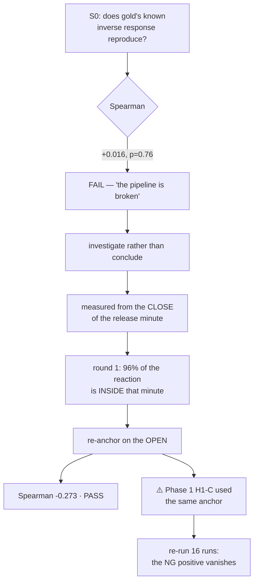

# Phase 2 · S0 — the anchor

**A gate failed. The cause was one word in one line of code. Fixing it passed the gate, produced a
genuinely new finding, and overturned the only positive result Phase 1 had.**

---

# PART 0 — THE ONE-PAGE VERSION

| | |
|---|---|
| **What S0 is** | reproduce a **known** effect before asking anything new |
| **The known effect** | gold responds **inversely** to macro surprises — round 1: Spearman −0.193, inverse-rule accuracy 60.5% |
| **First run** | ⛔ **FAIL** — Spearman **+0.016 (p = 0.76)**. The effect was not there |
| ⭐⭐⭐ **The cause** | I measured from the **close** of the release minute, which **excludes the jump** |
| **Why that is fatal** | round 1 itself established that **$132 of gold's $137 reaction is inside that minute** |
| **After the fix** | ✅ **PASS** — Spearman **−0.273**, inverse-rule accuracy **62.3%** |
| ⭐⭐ **New finding** | the **published consensus is ~50% stronger** than round 1's proxy, and lifts Pearson out of blindness |
| ⚠️⚠️ **Consequence** | Phase 1's H1-C used the same anchor. Re-run: **the NG positive disappears** |



---

# PART 1 — WHAT S0 IS AND WHY IT RUNS BEFORE EVERYTHING

Phase 2 asks a new question: does the **surprise** (`actual − forecast`) carry power and direction? Before
asking it, the pipeline must demonstrate it can see something we already know is there.

**The reference, from round 1:**

| | |
|---|---|
| gold's response to macro surprises | **Spearman −0.193** — inverse |
| sign-hit | **39.5%** against a 49.0% ± 1.7% baseline |
| ⇒ inverse-rule accuracy | **60.5%** |
| stability | negative in **15 of 16 years** |
| ⚠️ Pearson | **−0.012, p = 0.73 — completely blind** |

## ⭐ Why a validity gate is not paranoia here

This workstream has already produced a **manufactured null** — the pre-2016 daylight-saving defect
(#114), where 87 series were an hour late in summer and any event window built on them returned
"nothing found" while looking perfectly healthy.

> **A null from a broken pipeline is indistinguishable from a null from an absent edge.** S0 exists so
> that Phase 2's nulls mean something.

## ⚠️ What S0 asserts, and what it deliberately does not

Round 1 ran **1,208 releases over 2010–2026** with a *statistical proxy* for the consensus. We run
**2016+** with the *real* consensus, on 405 events.

So S0 asserts **sign and significance**, never a magnitude match. Asserting −0.193 would be pinning a
number to a sample that did not produce it — the exact error already corrected twice in this workstream
(the "1.31–2.92×" that appeared in no file, and the "927 pairs" that counted one side of a join).

## The two arms

| arm | definition | role |
|---|---|---|
| **proxy** | `actual − (previous actual + mean of the last 12 changes)` — no consensus | the **reproduction target**; this is what −0.193 was measured on |
| **real** | `actual − forecast`, the published consensus | **new** — is the real consensus a better instrument than the proxy? |

---

# PART 2 — THE FAILURE

```
S0 GATE: FAIL — only 1 of 3 horizons negative and 0 significant
⛔ STOP. Nothing downstream of a pipeline that cannot see a known effect means anything.
```

| horizon | proxy Spearman | p |
|---|---|---|
| 5 min | +0.016 | 0.76 |
| 15 min | +0.037 | 0.46 |
| 60 min | −0.035 | 0.48 |

Gold's inverse response — a 5.5σ effect, negative in 15 of 16 years — was **simply not there**.

## ⭐ The three candidate explanations, and how they were separated

| # | hypothesis | how it would be distinguished |
|---|---|---|
| 1 | **the pipeline is broken** | the gate's stated hypothesis |
| 2 | **the sample differs** — 2016+ vs 2010–2026, 4 series vs 7 | the effect would weaken, not vanish |
| 3 | **the measurement differs from round 1's** | the effect would appear under round 1's measurement and not ours |

**It was #3**, and the tell was already in our own notes: round 1 reported that gold's reaction
decomposes as **jump t = +7.13, post-print residue +$5.37 with t = 0.52 — noise.**

---

# PART 3 — ⭐⭐⭐ THE ANCHOR

## 3.1 The defect, in one line

```python
r = close[b] / close[a]      # a = the bar at the release minute T
```

`close[a]` is the **close of the release minute** — i.e. the price **after** the jump has already
happened. So the measurement started *after* 96% of the effect and reported what remained.

## 3.2 Measured both ways, same events, same feature

| measure | includes the jump? | proxy Spearman | p | real Spearman | p |
|---|---|---|---|---|---|
| **jump** (open→close of T) | ✅ | **−0.273** | <0.0001 | **−0.415** | <0.0001 |
| **open → 5 min** | ✅ | **−0.227** | <0.0001 | **−0.343** | <0.0001 |
| open → 15 min | ✅ | −0.164 | 0.0010 | −0.290 | <0.0001 |
| open → 60 min | ✅ | −0.174 | 0.0004 | −0.203 | <0.0001 |
| close → 5 min | ✗ | +0.016 | 0.76 | +0.014 | 0.78 |
| close → 15 min | ✗ | +0.037 | 0.46 | −0.004 | 0.93 |
| close → 60 min | ✗ | −0.035 | 0.48 | +0.017 | 0.73 |

**Everything above the line is a strong, significant, inverse effect. Everything below it is noise.**
The dividing line is not a horizon or a series or an era — it is **one minute**.

## 3.3 ✅ The gate passes

| | round 1 | this run (proxy arm) |
|---|---|---|
| Spearman | −0.193 | **−0.273** |
| inverse-rule accuracy | 60.5% | **62.3%** |
| Pearson | −0.012, p=0.73 — **blind** | **−0.034, p=0.50 — blind** |

⭐⭐ **The most convincing part is not the correlation — it is that Pearson is blind in both.** That is a
*qualitative signature*, and a broken pipeline would not reproduce it. A matching number could be
coincidence; a matching **pathology** is much harder to fake.

## 3.4 ⭐ Which anchor is "correct" depends on the trade

Neither anchor is wrong. They answer different questions, so both are now returned:

| anchor | the trader it describes | the question |
|---|---|---|
| **OPEN** | already positioned before the print — **holds through the jump** | *can we pre-position?* |
| **CLOSE** | enters after seeing the number | *what is left to capture after latency?* |

**The gate is judged on the jump-inclusive measures only**, because the close-anchored residue is the
one place round 1 itself reports there is nothing to find. Requiring the pipeline to reproduce an effect
where the reference says none exists would be a gate that can only fail.

---

# PART 4 — ⭐⭐ THE NEW FINDING: THE REAL CONSENSUS IS A MUCH BETTER INSTRUMENT

| | proxy (round 1) | **real consensus** | change |
|---|---|---|---|
| jump, Spearman | −0.273 | **−0.415** | **+52%** |
| jump, Pearson | −0.034 (p=0.50) — blind | **−0.224 (p<0.0001)** — visible | from nothing to significant |
| open→5m, Spearman | −0.227 | **−0.343** | +51% |
| open→15m, Spearman | −0.164 | **−0.290** | +77% |

## What this means

1. **Round 1's proxy was a weak stand-in.** It captured the sign but roughly **two-thirds** of the rank
   association. Round 1 explicitly advised against buying consensus data **because it cost money** —
   this quantifies what that decision was costing in signal. (The data turned out to be free, from
   TradingView, which is the subject of #114.)
2. **The real surprise is a cleaner variable.** Pearson goes from blind to significant, meaning the
   relationship is far less distorted by fat tails once the expectation is the market's rather than a
   rolling average. That matters for every model that assumes linearity.
3. ⚠️ **It is still not tradeable.** Inverse-rule accuracy is **62–63%** against the **71%** break-even
   from #111. Round 1's own conclusion — *"gold responds, but un-tradeable at cost"* — survives with a
   better instrument and a bigger effect.

⭐ **This is the most useful thing S0 produced, and it is a by-product.** The gate was built to check the
pipeline; it also measured the value of the data acquisition that made Phase 2 possible.

---

# PART 5 — ⚠️⚠️ THE CONSEQUENCE: PHASE 1'S ONLY POSITIVE OVERTURNED

## 5.1 The same anchor was in Phase 1

`h1bc_anticipated_direction.py` used **the same close anchor** for H1-C. So Phase 1 measured the
**post-jump residue** — while H1-C's own question assumes a **pre-positioned** trade, which holds
through the jump.

All 16 runs were re-run on the corrected anchor.

## 5.2 The result

| NG / energy | **CLOSE anchor** (reactive) | **OPEN anchor** (pre-positioned) |
|---|---|---|
| H1-C 5m | P **+0.097** (p=0.0001) · S **+0.077** (p=0.0015) | P −0.021 (p=0.39) · S **+0.008** (p=0.75) |
| H1-C 15m | P **+0.133** (p<0.0001) · S **+0.095** (p=0.0001) | P +0.034 (p=0.15) · S **+0.014** (p=0.56) |
| H1-C 60m | P **+0.101** (p<0.0001) · S **+0.068** (p=0.0046) | P +0.041 (p=0.09) · S **+0.015** (p=0.54) |
| **verdict** | **POSITIVE** — 3 cells | ⛔ **NEGATIVE** — 0 cells |

## 5.3 ⭐ The mechanism, which is more informative than the null

The effect is **real**, but it lives only in the drift **after** the jump.

**The jump is driven by the surprise** — `actual − forecast` — which by construction **cannot be known
before the release**. It is large, and it swamps the drift that the anticipated change would otherwise
predict.

> **Pre-positioning loses precisely because you must absorb a jump you cannot forecast.**

That is a *reason*, not merely a *result*. It also predicts where an edge could exist — after the jump,
which is #117's territory — and where it cannot: before it.

## 5.4 What I got wrong

I published *"one real effect in 16 runs — EIA natural gas predicts NG direction"* under a heading that
reads as an answer to H1-C. **The measurement was correct; the label was not.** It answers a *reactive*
question, not a *pre-positioning* one.

⭐ The ledger claim now states **which** question it answers, and **its V2 check compares the two anchors
directly**. A finding that exists under one anchor and not the other is not wrong — it is **narrower
than it first appeared**, and the narrowing must be machine-verifiable rather than remembered.

## 5.5 Phase 1's final tally, on its own question

| | |
|---|---|
| NEGATIVE | **14** |
| VOID (underpowered) | 1 — RTY/verified, n = 267 |
| POSITIVE BUT CONTROLS FAIL | 1 — CL/verified, a Pearson-only artefact |
| **POSITIVE** | **0** |
| **tradeable edge EXCLUDED** | **16 of 16, under both anchors** |

---

# PART 6 — WHAT WENT WELL, WHAT WENT WRONG

## What went well

1. ⭐⭐ **The gate did the single thing it was built for.** It stopped the phase before a defect could
   propagate into a headline — and the defect it caught was silently present in **Phase 1's already
   published results**.
2. **The failure was investigated, not concluded from.** "The pipeline is broken" was the gate's own
   hypothesis and it was wrong; the three candidate explanations were separated by evidence.
3. **Our own prior work contained the answer.** Round 1's "$132 of $137 is inside the release minute"
   was in the project notes. **The diagnosis cost nothing except reading what we already knew.**
4. **The pass is qualitative, not just numeric** — Pearson being blind in both runs is much stronger
   evidence than a matching correlation.
5. **A by-product answered a real question**: the published consensus is ~50% stronger than the proxy.

## What went wrong

1. ⚠️⚠️ **The anchor defect was present in Phase 1 and I published on it.** Phase 1's single positive
   result was mislabelled for an hour.
2. **The pre-registration said "return over `[T, T+h)`" — which is ambiguous.** `T` can mean the open or
   the close of the release bar, and the two give opposite answers. **A pre-registration that does not
   pin the anchor has not pinned the measurement.**
3. **I wrote the same ambiguity twice** — once in Phase 1, once in Phase 2 — which means it was a habit,
   not a slip.

## ⭐ The rule this produces

> **When the outcome is measured relative to an event, the pre-registration must state the anchor to
> the bar and to the side of the bar.** "After the release" is not a specification. On a minute frame
> around a scheduled release, open-versus-close is the difference between a 5.5σ effect and noise.

---

# PART 7 — WHERE PHASE 2 GOES NEXT

**S0 has passed, so S1 may proceed.**

| stage | status |
|---|---|
| **S0** pipeline validity | ✅ **PASS** — and it caught a defect in Phase 1 on the way |
| **S1** feature construction + both `level change` variants | ▶ **next** |
| S2 planted probe, per pair | pending |
| S3 the 643 decidable pairs, α = 0.000078 | pending |
| S4 controls on every survivor | pending |
| S5 accuracy vs the 71% break-even | pending |
| S6 synthesis | pending |

## ⚠️ What S0 hands S1

- **Every outcome must be measured under both anchors**, and each result labelled with which trade it
  describes. This is now a property of the code, not a discipline to remember.
- **The real surprise is the better feature** — but the proxy is retained as a control, because their
  disagreement is itself informative.
- ⚠️ **62–63% accuracy on a 5.5σ effect is the calibration to keep in mind.** The strongest, most
  replicated relationship in this entire programme still falls ~8 points short of paying. **Phase 2
  should expect to find real effects that do not pay, and must report accuracy with an interval every
  time so that distinction is never blurred.**
