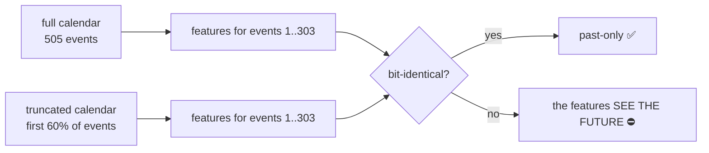

# Phase 2 · S1 — features, and the one defect that has no reference

**S1 built the Phase 2 feature set and proved it cannot see the future.** The interesting part is *how*
that was proved, because look-ahead is the one defect this project's entire verification apparatus was
structurally unable to catch.

---

# PART 0 — THE ONE-PAGE VERSION

| | |
|---|---|
| **What S1 is** | build the surprise features, and prove they are strictly past-only |
| **Sample** | 505 events · 4 provenance-verified series · 2016+ |
| **Features** | 5, including **two** `level change` variants |
| ⭐⭐⭐ **The key check** | **prefix invariance** — a past-only feature cannot change when later events are appended |
| **Result** | **0 mismatches on 303 overlapping rows** |
| ⭐⭐ **And it can fail** | a planted full-sample z-score is caught on **207 of 207** |
| ⭐ **A replication fell out of it** | the two level-change variants diverge per series exactly as #120 predicted — on a different code path |
| **Cost** | the 24-event warm-up discards 96 of 505 events (19%) |
| **Verdict** | ✅ **PASS** — S2 may proceed |

---

# PART 1 — THE FEATURE SET

## 1.1 What was built, and what each is for

| feature | formula | what it captures |
|---|---|---|
| **surprise** | `actual − forecast` | **what the market did NOT price.** The core Phase 2 variable |
| **level change (published)** ⭐ primary | `actual − previous` | the direction the data itself moved, as the calendar showed it |
| **level change (first print)** | `actual − prior release's actual` | the same, measured against the prior *unrevised* print |
| **anticipated change** | `forecast − previous` | what was already priced. **Answered NEGATIVE in Phase 1 (#122)** |
| **confirmation** | `sign(surprise) == sign(anticipated change)` | did the surprise reinforce the expected direction, or reverse it? |

⭐ **`confirmation` is deliberately sign-only.** Every other feature has to be normalised because the
units differ wildly — payrolls in thousands of jobs, CPI in percent, inventories in barrels. A sign
comparison is immune to that, so it is the one feature that needs no normalisation and therefore no
warm-up.

## 1.2 ⚠️⚠️ Why TWO level-change variants are mandatory

This comes directly out of #120 Test C, and it is not a refinement — it is a correctness requirement.

TradingView's `previous` equals **the prior release's `actual`** only sometimes, and how often depends
entirely on **how much the agency revises**:

| series | `previous` == prior `actual` | so `actual − previous` really means |
|---|---|---|
| **Non Farm Payrolls** | **2.4%** | this print against the **REVISED** prior month |
| Durable Goods Orders MoM | 7.9% | mostly the revised basis |
| Retail Sales MoM | 15.1% | mostly the revised basis |
| **Inflation Rate MoM** | **95.1%** | effectively **first print vs first print** |

The BLS revises payrolls with **every** release; CPI is barely revised at the 0.1 percentage point it is
reported to.

> ⚠️ **Pooling these into one column puts two different quantities in the same variable — and does so in
> a way correlated with *which series it is*.** That is systematic contamination, not noise, and it
> would be invisible in every summary statistic.

Both are therefore computed. **The as-published variant is primary**, because it is the number a trader
actually saw on the screen.

## 1.3 ⚠️ The normalisation, and what it costs

Features are z-scored **within each series**, using an **expanding window with `shift(1)`** — strictly
past-only — and require **24 prior observations**.

| | |
|---|---|
| events in the sample | 505 |
| events with a usable normalised feature | **409** |
| **discarded by the warm-up** | **96 (19%)** |
| `confirmation` (sign-only, no warm-up) | 420 |

⭐ **The 19% is a real cost and it is stated rather than absorbed.** With four series and a 24-event
requirement, roughly the first two years of each series is spent building the normaliser. That is the
price of not using a full-sample statistic — and Part 2 is about why that price is worth paying.

---

# PART 2 — ⭐⭐⭐ PREFIX INVARIANCE: A CHECK THAT WORKS DIFFERENTLY

## 2.1 The problem: leakage has no reference

Every other guard in this project compares **a number against something**:

| guard | compares against |
|---|---|
| the claims ledger | the committed file the number came from |
| V1 re-derivation | a second code path |
| V2 independent source | a different dataset or instrument |
| the S0 validity gate | a known published effect |
| the acceptance gate's overlap check | the frame the engine already trades |

**Look-ahead has none of these.** A feature computed with a full-sample mean and standard deviation:

- produces **sane-looking values** in the right range;
- **correlates normally** with everything;
- **raises no error, no warning, no NaN**;
- and there is **no reference value** to compare it against, because the leaked version is what you get
  every time you run it.

> **You cannot catch leakage by checking a number. There is no correct number to check against.**

## 2.2 The idea: check a *property* instead

A strictly past-only feature has a property that a leaked feature cannot have:

> ⭐⭐⭐ **Its value for event *i* depends only on events 1…*i*. So appending more data CANNOT change it.**

That is testable without any reference at all. Recompute the features on a **truncated** calendar and
require the overlapping rows to be **bit-identical**.



## 2.3 The result

```
303 overlapping rows compared

mismatches:  surprise_z 0 · level_change_published_z 0 ·
             level_change_firstprint_z 0 · anticipated_change_z 0

-> PASS — no leakage
```

## 2.4 ⭐⭐ And the check demonstrably works

**A gate that has never failed is untested.** So the exact defect it exists for was planted — a
**full-sample z-score**, using the mean and spread of events that had not yet happened:

| construction | rows compared | mismatches | |
|---|---|---|---|
| correct — expanding + `shift(1)` | 207 | **0** | clean |
| **planted leak — full-sample z** | 207 | **207** | ⭐ **CAUGHT, every row** |

**A demonstrated true positive and true negative on the one defect the check is aimed at.** The probe is
now built into S1 itself, so it runs every time rather than being a thing I did once.

## 2.5 ⚠️ What prefix invariance does NOT catch

Stated because an unstated limit becomes an assumed guarantee:

- **Leakage present identically in every prefix.** If a feature were built from a *revised* value rather
  than a first print, every prefix would contain the same contamination and the check would pass
  happily. **That is #119's job**, and it is why #119 ran first.
- **An outcome window that starts before the event.** The check covers the *feature* side, not the
  *outcome* side — which is exactly the defect S0 caught, by a completely different route.
- **The energy series**, which are not provenance-cleared at all (#120).

⭐ **The three checks are complementary and none of them is redundant**: #119 verifies the *inputs* are
point-in-time, S1 verifies the *features* are past-only, S0 verifies the *outcome window* is anchored
correctly. **A defect in any one of the three is invisible to the other two.**

---

# PART 3 — ⭐ A REPLICATION THAT FELL OUT OF V2

The V2 check requires the two level-change variants to **diverge, and to diverge per series**. It is
written to fail in **both** directions:

- if they agreed **everywhere**, one variant would be redundant and #120's Test C would be wrong;
- if they differed **everywhere**, `previous` would never be the prior print, which is also false.

**The per-series split is the substance, not the average.**

| series | S1 (this run) | #120 Test C | |
|---|---|---|---|
| Inflation Rate MoM | **95.1%** | 95% | ✅ |
| Retail Sales MoM | 15.1% | 15% | ✅ |
| Durable Goods Orders MoM | 7.9% | 8% | ✅ |
| Non Farm Payrolls | **2.4%** | 3% | ✅ |

⭐ **This is an independent replication, not a re-read.** #120 computed it from the ALFRED vintage
comparison; S1 computes it from the calendar alone, through `build_features`. Two different code paths,
two different data joins, the same four numbers.

⚠️ The small differences (2.4 vs 3, 7.9 vs 8) are the **sample**: #120 ran on the ALFRED-matched subset,
S1 on the full 2016+ calendar. **They should not match exactly, and it would be mildly suspicious if
they did.**

---

# PART 4 — THE OTHER TWO CHECKS

## V1 — re-derivation by a different code path

`surprise` recomputed **straight from the raw CSV columns**, bypassing `load_calendar` and
`build_features` entirely: **identical on all 505 rows.**

⚠️ This is the weakest of the three checks, and it is worth being explicit about why: `actual − forecast`
is a subtraction. There is very little for a second implementation to disagree about. Its real value is
catching a **join** error — a mis-keyed merge, a duplicated row, a series mapped to the wrong title —
not an arithmetic one.

## Coverage accounting

| feature | non-null | of 505 |
|---|---|---|
| `surprise_z` | 409 | 81% |
| `level_change_published_z` | 409 | 81% |
| `level_change_firstprint_z` | 409 | 81% |
| `anticipated_change_z` | 409 | 81% |
| `confirmation` | 420 | 83% |

⚠️ `confirmation` is higher because it needs no warm-up; it is lower than 505 because it is undefined
when either sign is exactly zero.

---

# PART 5 — WHAT WENT WELL, WHAT WENT WRONG

## What went well

1. ⭐⭐⭐ **A defect class that was structurally uncatchable is now caught.** Every prior guard in this
   project needs a reference value; leakage has none. Prefix invariance needs no reference at all.
2. **The check is exercised, not asserted.** 207/207 on a planted leak, 0/207 on the correct build — and
   the probe is permanent, not a one-off.
3. **V2 produced a free replication of #120** on an independent code path.
4. **The warm-up cost is stated, not absorbed** — 19% of events discarded so that no statistic uses the
   future.
5. **The three verification layers were shown to be non-overlapping**: inputs (#119), features (S1),
   outcome window (S0). Each is blind to the others' defects, which is why all three exist.

## What went wrong

1. ⚠️ **Nothing failed in S1 — and that is worth being suspicious of.** The stage passed on the first
   run, which in this project has usually meant the checks were too weak. The planted-leak probe is the
   answer to that suspicion: it converts "nothing failed" into "the check would have noticed".
2. ⚠️ **V1 is nearly vacuous as written.** Re-deriving a subtraction by a second subtraction proves
   little. It is retained for its join-checking value, but it should not be counted as a strong check,
   and the ledger claim says so.
3. ⚠️ **19% of the sample is spent on the warm-up**, and with only four verified series that is a real
   constraint on Phase 2's power. It is the correct trade — a full-sample normaliser would recover those
   96 events by leaking — but it is a cost, not a free choice.

---

# PART 6 — WHAT S1 HANDS S2

| | |
|---|---|
| **Features** | 5, past-only, with both level-change variants, on 409 usable events |
| **Both anchors** | every outcome measured from the release bar's open **and** close, labelled by which trade it describes — a property of the code after S0, not a discipline to remember |
| **The better instrument** | the real consensus, ~50% stronger than round 1's proxy in rank terms (S0) |
| ⚠️ **The calibration** | **62–63% accuracy on a 5.5σ effect.** The strongest, most replicated relationship in the programme falls ~8 points short of the 71% break-even |

> ⚠️⚠️ **Phase 2 should EXPECT to find real effects that do not pay**, and must report directional
> accuracy **with a confidence interval** every time — so that "statistically significant" and
> "tradeable" are never allowed to blur into each other.

**Next: S2 — the planted-effect probe, per pair, across the 643-pair matrix. A pair whose probe fails is
VOID, not negative.**
