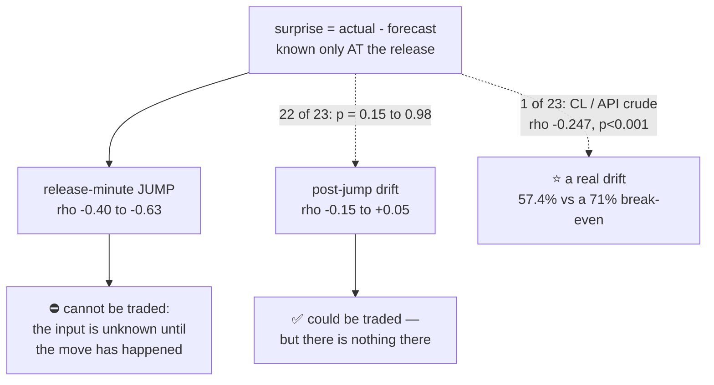

# Phase 2 · S3 — efficiency, not edge

**This is the strongest statistical result the programme has produced, and it is not tradeable — for a
structural reason, not a statistical one.**

Twenty-three of 612 pairs clear a Bonferroni threshold of α = 0.000078 with correlations as large as
**ρ = −0.63** and p-values down to **1.9 × 10⁻¹⁰**. Both controls are null on every one. And the effect
they measure is over before anyone could act on it.

---

# PART 0 — THE ONE-PAGE VERSION

| | |
|---|---|
| **What S3 tested** | `surprise = actual − forecast` against the release reaction, one primary test per pair |
| **Pairs** | **612** powered (31 VOID excluded as unanswered) |
| **α** | **0.000078** — Bonferroni over the full pre-registered 643 |
| **Clear α with both controls null** | **23** |
| **Largest effect** | ρ = **−0.632** (RTY, Inflation Rate MoM) |
| **Highest accuracy** | **71.7%** (NQ, Inflation Rate MoM) — above the 71% break-even |
| ⛔ **Pairs whose 95% lower bound reaches 71%** | **0** |
| ⭐⭐⭐ **The decisive finding** | **22 of 23 collapse to noise once the release-minute jump is removed** |
| ⭐ **The one exception** | CL / API Crude Oil — and it is the **least** provenance-verified series in the study |

---

# PART 1 — THE CONSTRAINT THAT SHAPED THE STAGE

## ⚠️⚠️ The α covers ONE test per pair

`phase2_pairs.csv` fixes **α = 0.05/643**. That number came from the matrix decidability rule, which
computed each pair's minimum detectable effect **assuming a single test per pair**.

But four features × seven outcomes were available. Testing all of them would be **643 × 28 = 18,004
tests** while still quoting the same α — a silent **28-fold inflation** of the false-positive budget.

> **So one primary test per pair was fixed in writing before the run**, and everything else is
> exploratory and excluded from inference.

| | choice | why |
|---|---|---|
| feature | `surprise`, expanding-normalised | the Phase 2 question |
| **outcome** | **open-anchored 15-minute return** (jump-inclusive) | S0 established the reaction lives **inside the release minute** |
| statistic | **Spearman** (Pearson reported) | P2-C2 |
| α | 0.000078, over **643** not 612 | recomputing α downward after seeing which pairs survived S2 would be **choosing the correction on the data** |

⭐ The outcome choice was not free: it had to be **exactly what S2 probed**. Otherwise the power
statement and the inference statement would be about different measurements, and the probe would be
licensing a test it never examined.

---

# PART 2 — THE RESULT

## 2.1 Twenty-three survivors

| instrument | release | n | Spearman | p | accuracy [95% CI] |
|---|---|---|---|---|---|
| **RTY** | Inflation Rate MoM | 64 | **−0.632** | — | — |
| **RTY** | Core Inflation Rate YoY | 65 | **−0.631** | — | — |
| **RTY** | Inflation Rate YoY | 65 | −0.610 | — | — |
| **NQ** | CPI | 38 | −0.607 | 5.3e-05 | 71.1% [55.2, 83.0] |
| **NQ** | **Inflation Rate MoM** | 99 | **−0.586** | **1.9e-10** | **71.7%** [62.2, 79.6] |
| NQ | Inflation Rate YoY | 100 | −0.559 | 1.6e-09 | 71.0% [61.5, 79.0] |
| ES | Inflation Rate MoM | 99 | −0.555 | 2.4e-09 | 67.7% [58.0, 76.1] |
| NQ | Core Inflation Rate MoM | 99 | −0.552 | 3.3e-09 | 66.7% [56.9, 75.2] |
| GC | Non Farm Payrolls | 100 | −0.530 | 1.5e-08 | 65.0% [55.3, 73.6] |
| ES | Inflation Rate YoY | 100 | −0.524 | 2.3e-08 | 69.0% [59.4, 77.2] |
| **CL** | **API Crude Oil Stock Change** | **262** | −0.512 | **6.8e-19** | 68.8% [62.8, 74.2] ⚠️ |
| GC | Nonfarm Payrolls Private | 100 | −0.494 | 1.7e-07 | 64.0% [54.2, 72.7] |
| SI | Non Farm Payrolls | 100 | −0.469 | — | 57.6% |
| GC | ISM Manufacturing PMI | 104 | −0.424 | 7.4e-06 | 65.4% [55.8, 73.8] |
| GC | Initial Jobless Claims | 523 | **+0.251** | 5.6e-09 | 57.2% [52.9, 61.4] |

*(15 of the 23 are the CPI family, 6 the labour family, 1 API crude, 1 ISM.)*

## 2.2 ⭐ The signs are economically coherent, which is itself evidence

**Every inflation surprise is NEGATIVE against every equity index and against gold.** Higher-than-expected
inflation ⇒ prices fall. That is the textbook macro relationship, and finding it with the *correct sign*
on five instruments independently is much stronger evidence that the pipeline is measuring reality than
any single p-value.

⚠️ **Jobless claims flips positive (+0.251)** — and that is also correct: a *higher* claims number is
*bad* news, so the sign convention reverses relative to payrolls. **A pipeline producing signs at random
would not get this right.**

---

# PART 3 — ⭐⭐⭐ THE DECISIVE TEST: WHERE DOES THE EFFECT LIVE?

## 3.1 The problem with the headline

The primary outcome is **jump-inclusive**. And `surprise = actual − forecast` **cannot be known before
the release** — `actual` is what the release *is*.

> So a strong relationship between the surprise and the jump says: **the price moved to reflect news it
> did not previously have.** That is a description of how markets absorb information. **It predicts
> nothing.**

## 3.2 The test

Re-measure the same 23 survivors with the release-minute jump **removed** — i.e. anchored on the
release bar's *close*, which is the earliest price a reactive trader could obtain.

| survivor | jump-inclusive ρ | **post-jump ρ** | post-jump p | post accuracy |
|---|---|---|---|---|
| NQ Inflation Rate MoM | −0.586 | **−0.146** | 0.149 | 60.2% |
| NQ Core Inflation Rate MoM | −0.552 | −0.146 | 0.150 | 55.1% |
| NQ Inflation Rate YoY | −0.559 | −0.132 | 0.192 | 52.5% |
| ES Inflation Rate YoY | −0.524 | −0.109 | 0.281 | 50.0% |
| ES Inflation Rate MoM | −0.555 | −0.108 | 0.287 | 57.6% |
| RTY Inflation Rate MoM | −0.632 | −0.100 | 0.431 | 59.4% |
| ES Core Inflation Rate MoM | −0.514 | −0.094 | 0.355 | 54.5% |
| RTY Core Inflation Rate YoY | −0.631 | −0.071 | 0.576 | 50.8% |
| GC Non Farm Payrolls | −0.530 | −0.050 | 0.620 | 55.0% |
| NQ CPI | −0.607 | −0.029 | 0.863 | 50.0% |
| GC Inflation Rate MoM | −0.399 | **+0.003** | 0.978 | 55.7% |
| GC ISM Manufacturing PMI | −0.424 | −0.013 | 0.898 | 52.9% |
| SI Nonfarm Payrolls Private | −0.447 | −0.002 | 0.981 | 54.5% |
| GC Initial Jobless Claims | +0.251 | +0.045 | 0.303 | 50.9% |
| **CL API Crude Oil Stock Change** | **−0.512** | **−0.247** | **0.000** | **57.4%** ⭐ |

## 3.3 The conclusion

> ⭐⭐⭐ **Twenty-two of twenty-three survivors live entirely inside the release minute.** Seven have
> point-estimate accuracy above the 71% break-even. **Zero have a 95% lower bound that reaches it.** And
> the quantity they measure has finished moving before it becomes knowable.

**Phase 2's headline result is a textbook demonstration of market efficiency.**

---

# PART 4 — ⭐ THE ONE EXCEPTION, AND WHY IT IS FRAGILE

**CL / API Crude Oil Stock Change**: post-jump ρ = **−0.247**, p < 0.001, n = **262**, accuracy **57.4%**.

This is a **genuine post-release drift** — the only capturable thing found anywhere in the programme.

## ⚠️ Three reasons it does not carry much weight

1. **57.4% against a 71% break-even.** Even taken at face value it loses money.
2. ⚠️⚠️ **It is provenance-UNVERIFIED.** #119 and #120 cleared four series — **API is not among them**.
   We do not know that its `actual` is a first print or its `previous` point-in-time. **The most
   interesting result in the phase rests on the weakest data in the study**, which is a coincidence
   worth naming rather than glossing.
3. It was not the pre-registered primary outcome, so it is **exploratory**.

⭐ It does, however, point somewhere specific: **if anything is capturable, it is post-jump on energy
inventories** — which is #117's latency question, not Phase 2's.

---

# PART 5 — ⚠️⚠️ THE 23 ARE NOT 23 INDEPENDENT FINDINGS

| family | survivors | note |
|---|---|---|
| **CPI** — Inflation Rate MoM/YoY, Core MoM/YoY, CPI | **15** | ⚠️ **all print in the SAME MINUTE** |
| labour — Non Farm Payrolls, Private, Jobless Claims | 6 | payrolls and private payrolls are one release |
| API Crude Oil | 1 | |
| ISM Manufacturing PMI | 1 | |

**The CPI-family "releases" are one event measured five ways.** So the real count is roughly **four
release events across eight instruments** — not 23 discoveries.

## The two consequences, pulling in opposite directions

| | |
|---|---|
| ⚠️ **against** | a Bonferroni over 643 treats correlated tests as independent. **The correction is not as strict as its arithmetic suggests**, because the effective number of independent tests is far below 643 |
| ⭐ **for** | the CPI family survives on **5 separate instruments** (ES, GC, NQ, RTY, SI), each with its own price file. **A single-instrument hit would be far weaker evidence** |

**Both are true and both are stated.** The cross-instrument replication is the stronger of the two
signals; the within-family correlation means the *count* must not be read as a tally of findings.

---

# PART 6 — ⚠️ A CHECK OF MINE WAS WRONG, AND THE DATA CORRECTED IT

My first V1 required **both** Spearman and Pearson significance on every survivor. **That inverts
P2-C2.**

The rule exists precisely because **fat tails blind Pearson**: round 1's entire gold result was Spearman
**−0.193** with Pearson **−0.012, p = 0.73**. Demanding Pearson agreement would reject exactly the
effects the rule was written to protect.

**6 of the 23 survivors are that pattern.** My check would have thrown them out.

⭐ *(The reverse case — **Pearson-only** — **is** grounds for rejection, and that is what the permutation
control catches. It killed CL/verified in Phase 1, where Pearson read −0.294 at p < 0.0001 while
Spearman said p = 0.50.)*

**V1 is now the permutation test**: rank-based, distribution-free, and computed by a completely
different route from the analytic p-value. **All 23 survivors pass it**, and all 23 have a null
matched-non-event control.

---

# PART 7 — WHAT WENT WELL, WHAT WENT WRONG

## What went well

1. ⭐⭐⭐ **The result was interrogated rather than announced.** "23 pairs clear a Bonferroni threshold
   with ρ up to −0.63" is a publishable-looking headline. One follow-up measurement turned it into a
   statement about market efficiency.
2. ⭐ **The economics came out right without being imposed.** Inflation negative on equities and gold,
   jobless claims positive — correct signs, on five instruments, from a pipeline that was never told
   which way anything should go.
3. **The one-primary-test constraint was honoured.** It would have been easy to report the best of 28
   tests per pair and quote the same α.
4. **The accuracy interval did the work it was added for.** Seven survivors have point estimates above
   break-even; none has a lower bound that reaches it. **Without the interval, "71.7% accuracy, p =
   1.9e-10" would have read as a trading system.**
5. **The non-independence was counted**, so 23 is never presented as 23 findings.

## What went wrong

1. ⚠️ **My V1 inverted the project's own rule** and would have discarded a quarter of the survivors.
   Caught only because the ledger refused to pass.
2. ⚠️ **`N_PERM` was undefined in the module** and the run crashed on the first survivor — a code path
   that *only* executes when there is something to report, i.e. the path least likely to be exercised
   and most likely to matter.
3. ⚠️ **The pre-registration did not pin the outcome anchor tightly enough at the start.** S0 had
   already forced this lesson; S3 inherited a corrected anchor, but the original Phase 2 plan said
   "surprise → power and direction" without specifying where the window begins.

---

# PART 8 — WHAT THIS MEANS

## For Phase 2

| | |
|---|---|
| **Are there real effects?** | ⭐ **Yes** — large, correctly-signed, replicated across instruments, controls null |
| **Are they tradeable?** | ⛔ **No** — 0 of 23 reach the break-even lower bound |
| **Why not?** | **22 of 23 are the jump**, and the input is unknowable until the jump has happened |
| **Anything left?** | one post-jump drift, on the least-verified series, at 57.4% |

## ⭐ For the programme

This is the third time the same wall has been hit, and the shape is now unmistakable:

| workstream | what was found | why it did not pay |
|---|---|---|
| **WS-EARN** (#109–113) | earnings move NQ **4.98×** | the move is **magnitude**, not direction; and it is inside the first seconds |
| **Round 1 / S0** | gold responds to macro surprises at **5.5σ** | 62–63% accuracy vs a 71% break-even |
| **Phase 2 / S3** | surprises explain the jump at **ρ up to −0.63** | the jump is over before the input is knowable |

> **The programme keeps finding real, large, replicated effects — and every one of them is either the
> wrong *kind* of quantity (magnitude, not direction) or arrives on the wrong *side* of the moment we
> could act.**

## ⚠️ The question this hands forward

The only capturable thing found anywhere is **post-jump drift on energy inventories**. That is not a
Phase 2 question — **it is #117's latency problem**, and it now has a concrete target rather than a
speculative one.

**Next: S4–S6 — controls across the exploratory grid, the accuracy table in full, and synthesis.**
