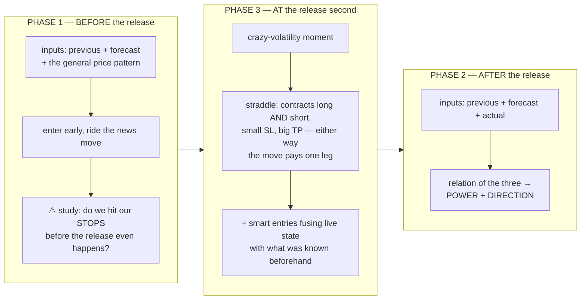

# WS-NEWS3 — Re-evaluation of the news workstream against its ACTUAL goal, and the plan to finish it

**Date:** 2026-08-16 · **Worktree:** `legacy18` (`research/legacy-18-baseline`) · **Author:** Claude
**Status:** This report AUDITS everything done under WS-EARN (#109–#113), news round 1, and WS-NEWS2
(#114–#123) against the owner's restated goal, answers *"was the goal achieved, or is there still a
way?"*, sets SMART goals, and opens the plan that finishes the job.

---

## Part 0 — Why this report exists

The owner restated the workstream goal and asked one question about all the work done so far:

> Did the previous work do right — meaning the results are inevitable and the goal is unreachable —
> or did it do wrong or incompletely, meaning there is still a way to achieve the goal?

**The short answer, stated up front and defended in Part 3:**

> ⭐⭐⭐ **Both, in different places. Every DIRECTION question was answered correctly and those verdicts
> are final — re-running them would be waste. But the goal as stated has THREE strategy classes, and
> two of them — the pre-release ride-through with stop survival, and the release-moment volatility
> capture (the straddle) — were NEVER SIMULATED. The "do not proceed" recommendation on #117 was
> issued against the latency-directional framing, not against the owner's actual straddle proposal
> recorded verbatim in that same issue. The workstream goal is NOT exhausted.**

---

## Part 1 — The goal, restated precisely

The owner's definition uses three numbers per release:

| name | meaning | when knowable |
|---|---|---|
| **previous** | the old value, before this announcement | days/weeks before |
| **forecast** | the consensus expectation | days before |
| **actual** | the announced value | **only at the release second** |

and two quantities to extract:

- **POWER** — how hard the price will move. Owner's example 1: previous 5, forecast 10, actual 15 →
  the market expected a jump and got double the jump → *"this will blow up"*. Example 2: previous 7,
  forecast 10, actual 10 → the market got exactly what it priced in → *"this won't make so much
  change"*. In the features already built these are `surprise = actual − forecast` (+5 vs 0) and
  `anticipated change = forecast − previous` (+5 vs +3).
- **DIRECTION** — which way to enter to ride it.

Three phases, each a distinct **strategy class**:

**Note what Phase 3 is:** it does **not** need to know the direction. It monetizes **POWER alone** —
one leg dies small, the other rides the move. It is a *non-directional, long-volatility* strategy
class. This distinction is the crux of the whole audit.

---

## Part 2 — What was actually done, attack by attack

Every number below is ledger-verified (`optimize/verify/run.py`, 18/18) unless marked otherwise.

### 2.1 WS-EARN (#109–#113) — earnings announcements → NQ, 1-second bars

- 783 events, 16 years, timestamps to the second (EDGAR acceptance, DST trap fixed).
- **Volatility at the announcement: 4.98× normal.** Real, large, replicated.
- **Direction: 0/8 cells significant in ALL arms.** H1 rejected, prediction filed first.
- Cost drag measured honestly: the control's gross t = −0.58 became **net t = −3.68** under the
  $9.50 realistic round-trip — costs, not signal.

### 2.2 News round 1 (proxy data) + GC replication

- Gold's macro-release reaction: **5.5σ**, and the decomposition that shaped everything after it:
  **$132.39 of the $137 total reaction is INSIDE the release minute** (t = +7.13); everything after
  the print is +$5.37 (t = 0.52, noise).

### 2.3 WS-NEWS2 Phase 1 (#115, #122) — pre-release, `previous`+`forecast` only

- H1-A: release-minute volatility ratio **1.97× [1.22, 3.18]** (the honest, estimable cell).
- H1-B/C: does `forecast − previous` predict the direction of the move? **NEGATIVE**, on all 8
  instruments, on BOTH anchors — after the anchor bug was caught and all 16 runs redone.

### 2.4 WS-NEWS2 Phase 2 (#116, S0–S4) — the three-number relation

- 643 decidable pairs → 612 powered (every pair carries a calibrated planted-effect probe).
- **S3 (release minute): the surprise explains the JUMP extremely well** — 23 survivors, ρ to
  −0.63, p to 1.9e-10, dumb controls null, permutation-verified. NQ/Inflation MoM ρ = −0.586;
  CL/API ρ = −0.512. **This is the POWER+DIRECTION relation the owner's Phase 2 asked for — it
  exists, strongly, inside the release minute.**
- **S4 (after the release, the capturable window): 1 survivor in 612** — CL/API drift, ρ = −0.247,
  accuracy **57.4% [51.2, 63.4]** against the **71%** break-even. Tradeable direction **excluded at
  95% on all 612 pairs, both windows.**

### 2.5 #123 — the lone survivor's provenance and mechanism

- API crude is a **private report, no public archive** — unverifiable, permanently.
- Mechanism (API forecasts EIA): premise holds at ρ = +0.742; the discriminating test is
  underpowered ~4× (Fisher z p = 0.237). Possible, undemonstrated, and wouldn't change tradeability.

### 2.6 Standing engine/tape facts that constrain any new work

- ⚠️ **94% of stop-outs are 1-second sweeps** (fundamental-analysis workstream).
- ⚠️ Gapped SL/TP fills at the next price, not the line (GAP-01) — old model understated risk.
- ⚠️ `pnl = pnl_points × pv` — **the engine has NO quantity term**; a 20-contract straddle cannot
  be deployed today. Research can simulate it; deployment needs an engine decision.
- ⚠️ Fat per-trade tail (±$1,600) defeated every thin edge so far.
- ⛔ YM's aggregated frames are 0 bytes (source 1s file is fine) — YM stays excluded until fixed.

---

## Part 3 — The audit: goal coverage, sub-goal by sub-goal

This is the table the whole report exists for.

| # | Sub-goal (owner's words) | Was it tested? | Verdict | Inevitable? |
|---|---|---|---|---|
| 1 | Phase 2: relation of previous/forecast/actual → **POWER** | ✅ S3: yes | **CONFIRMED — strong** (ρ to −0.63 on the jump; 4.98× at earnings) | Yes — final |
| 2 | Phase 2: relation → **DIRECTION** (after release, capturable) | ✅ S4: yes, 612 pairs | **EXCLUDED at 95%** | Yes — final |
| 3 | Phase 1: direction from `forecast − previous` (enter early, ride) | ✅ H1-B/C, both anchors | **NEGATIVE** | Yes — final |
| 4 | Phase 1: *"the general pattern of the price"* as a direction input | ⛔ **NEVER TESTED** | unknown | **No — open** |
| 5 | Phase 1: *"study that we don't hit the stops before the news"* — survival | ✅ **TESTED — H1-A** (`h1a_preevent_stopout.py`, 8 instruments × 16 cells, dumb control) — **see CORRECTION below** | at cheap stops most entries die pre-release (NQ 57%, CL 94% at 0.05%/5 min); at wide stops NQ/ES pre-release is 2–17× MORE dangerous than control, CL/GC is not | Yes — final |
| 5b | Phase 1: hold-through-the-release **P&L** (the actual "ride" with a stop active) | ⛔ **NEVER TESTED** — H1-A stops measuring at the release second | unknown | **No — open** |
| 6 | Phase 3: straddle — long AND short, small SL, big TP, monetize POWER without direction | ⛔ **NEVER TESTED** — recommendation issued without an experiment | unknown | **No — open** |
| 7 | Phase 3: smart entries fusing live state + pre-known info | ⛔ **NEVER TESTED** | unknown | **No — open** |

### 3.1 What the previous work did RIGHT (and must not be redone)

1. **Every direction verdict is sound and final.** Rows 1–3 were measured with planted-effect
   probes, dumb controls, permutation tests, Wilson intervals, and Bonferroni budgets. Redoing them
   would be the exact redo-loop this project's process rules exist to prevent.
2. **The data foundation is real and reusable**: first-print `actual` (100/100/99%), point-in-time
   `previous` (0% match to today's values — impossible for a back-fill), the DST floor, per-instrument
   price floors, the anchor discipline, the acceptance gate, the verification harness (caught 12
   defects in WS-NEWS2 alone).
3. **POWER was positively confirmed, four independent ways.** This is an asset, not a null.

### ⚠️ CORRECTION (2026-08-16, same day, before any new run) — this audit's first version was wrong on row 5

The first committed version of this report claimed the survival study was *"NEVER TESTED (0 mentions
of stops in the Phase-1 code)"*. **That claim was false.** The grep covered only
`h1bc_anticipated_direction.py`; Phase 1's H1-A lives in a separate file,
`h1a_preevent_stopout.py`, quotes the owner's survival question verbatim in its docstring, and
measured exactly it — 8 instruments × (4 waits × 4 stops) with the matched-clock-time dumb control,
long and short sides separately. The audit that accused the closeout of incomplete coverage was
itself incompletely covered, caught within the hour by the verify-don't-assume rule. The table above
is corrected; row 5's verdict is FINAL and its numbers feed the stop rule and Phase 3's entry-lead
constraint directly:

| survival fact (H1-A) | number |
|---|---|
| NQ, 5-min wait, 0.05% stop — stopped before the release fires | **57.1%** (control 49.3%) |
| CL, 5-min wait, 0.05% stop | **93.9%** (control 94.2%) |
| NQ, 5-min wait, 0.40% stop — survives, but vs control | 2.2% vs 0.1% — **ratio ≈ 16.7** (thin cell) |
| ES, 5-min wait, 0.20% stop | 3.9% vs 1.9% — **ratio 2.04** |
| CL/GC across the grid | ratios ≈ 0.6–1.2 — pre-release is **not** unusually dangerous there |

⇒ *"small stop placed early"* is already excluded by measurement: cheap stops don't reach the
release alive. A pre-positioned entry needs a wide stop (≥0.2–0.4%), which sets the loss floor any
Phase-3 straddle leg must carry, and the entry lead should be minutes, not an hour.

### 3.2 Where the previous work FELL SHORT of the goal — the three specific failures

**Failure 1 — the ride itself (row 5b) was never priced.** H1-A measured whether a position
*survives to* the release, then stopped. Nobody ever measured what the position *earns through* the
release: enter at release−T with a stop, hold through the print to release+15m, both directions,
gap-aware fills, net of costs. That is the owner's Phase-1 trade, end to end, and it has no measured
expectancy. (Given the direction nulls the honest expectation is ≈ coin-flip gross minus costs — but
a CI is a measurement and an expectation is not, and the same run prices the straddle's surviving
leg for Phase 3.)

**Failure 2 — the #117 recommendation over-reached.** The comment recommending "do not proceed"
argued: *"Improving execution cannot add 14 points of directional accuracy."* That argument is
airtight — **against a directional strategy.** The owner's proposal recorded verbatim in #117's own
body is **non-directional**: both legs are entered, so the 71% directional break-even from #111
**does not apply to it at all.** A straddle's break-even is a different inequality:

> E[|move|] captured by the surviving leg  >  costs on BOTH legs + the losing leg's stop + whipsaw
> losses when BOTH legs get swept.

Nobody has ever computed either side of that inequality on our tape. The recommendation treated
"no directional edge" as "nothing to capture", but the programme's own strongest finding — the one
confirmed four ways — is that there **is** something at the release second: **magnitude.**

**Failure 3 — "untradeable" was allowed to mean "untested".** Magnitude findings were filed as
unusable because `pnl = pnl_points × pv` has no quantity term. That is a true statement about the
*deployment engine* and a non-statement about *research*: a straddle simulation needs only per-leg
accounting in a research script. The missing sizing layer blocks deployment, not measurement.

### 3.3 The honest headwinds (these shape the experiments — they do not excuse skipping them)

Filed now, before any result, so that a later negative cannot be accused of hindsight and a later
positive has known hurdles it must have cleared:

1. **The whipsaw threat is real and quantified**: 94% of our stop-outs are 1-second sweeps. A small
   SL placed at the most violent second on the calendar faces maximal sweep risk — the failure mode
   where BOTH legs die before the true move is the central thing Phase 3 must measure, on 1-second
   bars, not assume either way.
2. **Spread blowout at the release second.** The $4.50/9.50/14.50 cost ladder (WS-EARN) was built
   for normal seconds. At the release second the stressed case is the honest base case, and Phase 3
   results will be reported under ALL THREE cost scenarios with the stressed one leading.
3. **GC's decomposition cuts both ways.** $132 of $137 inside the release minute is exactly why a
   *reactive* entry fails — and exactly what a straddle placed *before* the minute is designed to
   catch. The same number that killed Phase 3's directional framing is the reason the non-directional
   framing is worth one rigorous test.
4. **Fat tails helped no previous edge, but a straddle is the first strategy class we have tested
   whose P&L is LONG the fat tail** instead of being eaten by it. That is a design fact, not a
   promise.
5. **Prior art (deep-research-first rule)**: Lucca & Moench's pre-FOMC drift is the one documented
   *pre-release directional* anomaly (relevant to row 4); Christensen–Timmermann–Veliyev 2025 says
   post-release price discovery completes in seconds (already in #112, consistent with S4's null).
   Both priors are built into the designs below. A fuller prior-art pass on straddle-at-news is the
   first task inside the Phase-3 issue.

---

## Part 4 — SMART goals

**Workstream goal (restated, measurable):** determine, under the #118 verification protocol, whether
the CONFIRMED news POWER can be monetized by any of the three stated strategy classes; deliver either
(a) a deployable strategy spec with net expectancy whose 95% lower bound is positive out-of-sample,
plus the engine changes it requires, or (b) an exclusion backed by power analysis for each class.

| ID | Goal | Measurable success criterion | Target date |
|---|---|---|---|
| **M0** | Re-evaluation + plan + issues on the board | this report committed; umbrella + per-phase issues open with plans | **2026-08-16** (today) |
| **M1** | **P1 ride-through study** (rows 4, 5b; survival itself is DONE — H1-A, imported) | hold-through expectancy: enter release−T, stop active, exit release+15m, both directions, gap-aware fills, net under 3 cost scenarios, CI + MDE per cell, ≥4 instruments; pre-release-drift direction test (incl. the FOMC prior); dumb control on matched no-news windows; ledger claim passing | 2026-08-18 |
| **M2** | **P2 power model** (make the confirmed POWER usable pre-release) | a pre-release-knowable predictor of release \|move\| (series identity, historical multiplier, \|forecast−previous\|): cross-validated rank correlation with CI, evidence CSV committed; this is Phase 3's release-selection filter | 2026-08-19 |
| **M3** | **P3 straddle test** (rows 6–7) | pre-registered grid (entry lead, SL, TP, exit horizon) on 1-second bars; per-config net expectancy CI under all 3 cost scenarios; both-legs-swept rate measured; train/OOS split that is OOS for both sides (#87 rule); dumb control (same straddle on matched no-news seconds) + noise check; explicit multiple-testing budget | 2026-08-22 |
| **M4** | Closeout | either the deployable spec + required engine changes (sizing/multi-leg), or per-class exclusions with power analysis; final report; memory updated | 2026-08-23 |

Every milestone lands as: evidence CSV committed → ledger claim added and passing → issue comment →
report. Dates assume server availability; slippage is reported in the issues, not silently absorbed.

**Stop rule (what would make us stop early):** if M1 shows the pre-release survival cost alone
exceeds the entire measured release-minute range under the *optimistic* cost scenario, Phase 3's
straddle cannot pay by arithmetic — that exclusion would be filed with its power analysis and M3
narrows to the reactive-side smart entries only.

---

## Part 5 — The action plan, phase by phase

### P1 — ride-through + drift (new issue; survival itself imported from H1-A, not re-run)

For each instrument (NQ, ES, GC, CL; floors per instrument) × the phase-2 series sets (4 verified +
EIA/API for CL, unverified-marked) × lead T ∈ {5, 15, 30} min × stop S ∈ {0.10, 0.20, 0.40}% of
price (H1-A's units, so its survival grid composes directly):
- **hold-through P&L**: enter at close(release−T), stop active from entry, hold THROUGH the print,
  exit at close(release+15m) or at the stop — gap-aware fills per GAP-01 (breach fills at the worse
  of stop line / bar open); BOTH directions; gross and net under the 3 cost scenarios; CI + MDE per
  cell;
- pre-release drift test (row 4): sign of the (release−60m → release−1m) move vs sign of the release
  move, Wilson accuracy vs the 71% directional break-even; FOMC family ("Fed Interest Rate
  Decision", 105 events) separately — the Lucca–Moench pre-FOMC drift prior;
- dumb control: identical measurement on matched same-clock-time windows on days with no release;
- V1: stop-hit fractions re-derived from this pipeline must agree with H1-A's committed grid on the
  shared cells (different code path, same quantity); V2: the release-bar |move| distribution must
  reproduce H1-A/H1-B's known release-minute behaviour; V3: on control windows the "release jump"
  must be ABSENT (a jump found where no release exists = pipeline artefact).

### P2 — the power model (new issue)

Using only pre-release-knowable inputs (series identity, that series' trailing release-move history,
|forecast − previous|): predict the release-minute |move|. Expanding-window (no look-ahead: shift(1)),
rank correlation with CI, per-instrument. Output: a ranked "which releases are worth straddling"
table. V3: shuffling series labels must destroy the prediction.

### P3 — the straddle + smart entries (#117, already open — plan goes there)

Only after M1/M2 report. Pre-registered before any run: the grid, the primary statistic (net
expectancy per event, stressed costs), the α budget, the OOS split. Both-legs-swept rate is a
headline output, not a footnote. The "smart entries" arm fuses M2's power score (which releases) with
M1's survival numbers (how early) — selection happens BEFORE the release on knowable inputs only.
Deployment reality stated in advance: a positive verdict requires the sizing/multi-leg engine change
(owner decision) before anything trades.

### Governance

One issue per phase, opened today, all steps documented as comments as they happen. The umbrella
issue tracks milestones M0–M4. #117 hosts P3. Every published number passes the claims ledger first.
Nothing about WS-NEWS2's closed direction verdicts is reopened.

---

## Part 6 — What went well / what went wrong (this re-evaluation itself)

**Well:** the audit found the gap precisely because the previous work documented itself so heavily —
the owner's straddle proposal was preserved verbatim in #117, which is what made "the recommendation
argued against a different strategy than the one proposed" provable rather than a matter of memory.

**Wrong (and the lesson):** the previous closeout treated "no directional edge" as equivalent to "the
goal is unreachable". The goal had a non-directional half. ⭐ **Lesson, filed to memory: a workstream
is closed against its GOAL STATEMENT, not against the strongest verdict it happened to produce.
Before any closeout, re-read the original goal and map every clause to a tested verdict — exactly
the table in Part 3.**
