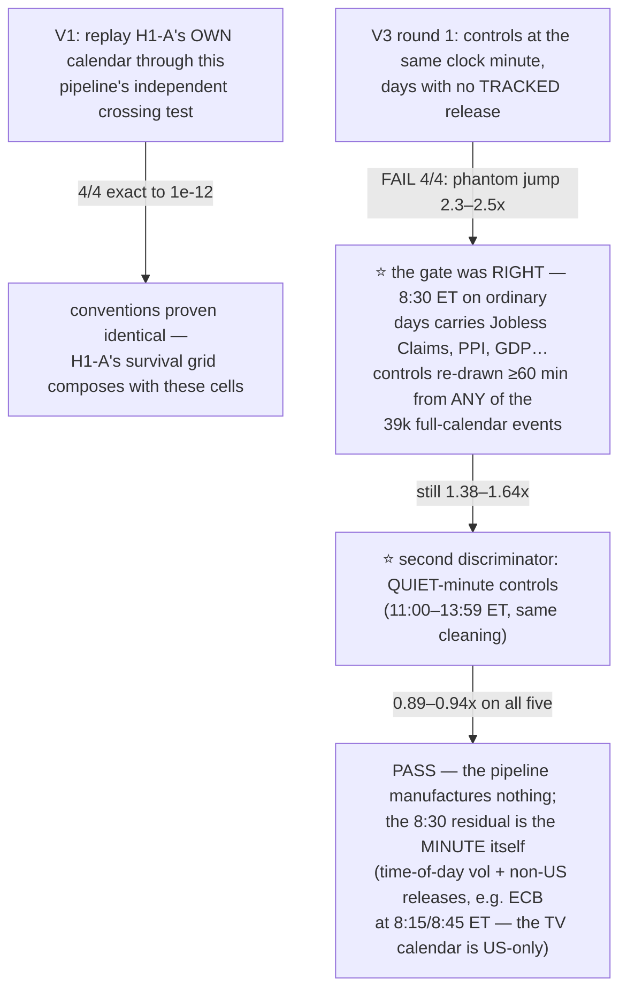

# WS-NEWS3 P1 — pricing the ride through the release: the drift is dead, and there is a PREMIUM

**Date:** 2026-08-16 · **Issues:** #125 (this stage), #124 (tracking) · **Milestone:** M1
**Verification:** V1 5/5 · V2 5/5 · V3 5/5 (after two redesigns, both documented below) ·
claims ledger **21/21** (`P1-RIDE-PREMIUM-RTY-CONFIRMED`, `P1-DRIFT-DEAD`, `P1-CPI-ENGINE`) ·
selftest 5/5 · evidence committed (`p1_events_*.csv`, `p1_ride_*.csv`, `p1_drift_*.csv`, cca68a5)

---

## Part 0 — What this stage asked, in plain words

Two clauses of the owner's Phase-1 goal had never been measured (audit: `WS-NEWS3-GOAL-REEVALUATION-AND-PLAN.md`):

1. **The ride itself (goal row 5b).** H1-A measured whether a position opened before a release
   *survives to* the release — and stopped at the release second. Nobody had ever priced the actual
   trade: enter T minutes early, keep the stop on, hold **through** the print, exit 15 minutes
   after. What does that earn, in dollars, per event, net of costs?
2. **The "general pattern of the price" (goal row 4).** Does the last hour's drift before the
   release predict which way the release move goes?

Design: NQ, ES, GC, CL × the verified series (NFP, CPI MoM, Retail Sales MoM, Durable Goods MoM)
+ FOMC (+ EIA/API on CL, unverified-marked) × entry lead T ∈ {5, 15, 30} min × stop S ∈ {0.10,
0.20, 0.40}% of price × **both directions, always**. Gap-aware stop fills (GAP-01). Costs
$2.50 + {1, 2, 4} ticks (NQ $7.50/12.50/22.50 — deliberately harsher than WS-EARN's ladder).
Sample: 2016-01 → **2026-07** (this is current data, not an old snapshot).

---

## Part 1 — The verification story (it earned its keep twice before any result existed)

Three durable lessons, filed before any headline number was allowed to exist:

- ⭐⭐ **"No release that day" is not "no news at that minute."** Every control in this programme's
  history that was drawn by excluding only the *tracked* series shares this contamination — H1-A's
  own danger ratios are, if anything, **understated** (its control was noisier than a true quiet
  window). The contamination biased *against* the effects we measure, so no closed verdict flips;
  but the rule stands: **clean controls against the full calendar, not your subset.**
- ⭐ **When a falsifier keeps failing, split the hypothesis, don't loosen the threshold.** The
  quiet-minute control set separated "the pipeline invents jumps" (would appear anywhere) from
  "the 8:30 minute is genuinely special" (vanishes at 12:00). The V3 threshold was never touched.
- **Declared floors beat silent adjustments:** events now report as a multiple of their own
  same-minute seasonality floor (4.3–8.6×), with the floor printed, not absorbed.

V2 on every instrument: release bars run **5.1×–15.0×** their own prior hour (CL lowest, RTY
highest) — the known release-minute effect reproduced from an independent pipeline.

---

## Part 2 — Goal row 4: the pre-release drift predicts NOTHING (final)

sign(release−60m → release−1m) vs sign(release−1m → release+15m), Wilson 95% CIs:

| instrument | releases (ALL) | control | FOMC subset |
|---|---|---|---|
| NQ | 0.484 [0.443, 0.525] | 0.461 | **0.390 [0.292, 0.498]** |
| ES | 0.488 [0.446, 0.530] | 0.456 | 0.434 |
| GC | 0.487 [0.446, 0.529] | 0.484 | 0.463 |
| CL | 0.506 [0.479, 0.532] | 0.474 | 0.476 |
| RTY | 0.500 [0.452, 0.549] | 0.487 | 0.443 |

- **Powered:** every upper bound sits below the 0.71 break-even (max 0.549) — the test *could*
  exclude tradeability, and did (this is the ledger claim's V3, not an afterthought).
- Release-day accuracy equals its own control everywhere (max gap 0.045): drift "prediction" is
  just the market's ordinary continuation base rate, which is itself ≈ coin flip.
- The Lucca–Moench pre-FOMC prior did **not** turn into a direction signal here; if anything the
  FOMC subset leans *inverse* (0.39, n=82, CI touching 0.50 — a lean, not a finding).

**With this, every directional input of the owner's Phase 1 is measured and null**: consensus
(H1-B/C, both anchors), and now the price pattern. Phase 1's *direction* half is closed forever.

---

## Part 3 — Goal row 5b: the ride has a POSITIVE side, and it replicated on a pre-registered holdout

### 3.1 What the exploratory grid showed (NQ/ES/GC/CL, 36 cells each)

**LONG through the release is consistently positive on equity indices, SHORT is the mirror
negative, and the identical windows on clean control days pay ≈ $0:**

| cell (gross $/event, 95% CI) | releases | control | net (realistic) |
|---|---|---|---|
| NQ · T=30 · S=0.40% · long | **+136.77 [+50.18, +223.36]** | +0.00 | **+124.27** |
| NQ · T=5 · S=0.20% · long | **+84.24 [+11.20, +157.29]** | +4.53 | **+71.74** |
| ES · T=30 · S=0.40% · long | **+90.04 [+36.49, +143.59]** | −1.64 | +62.54 |
| GC long cells | positive, CIs mostly straddle 0 | ~+30 | mixed |
| CL — every cell | long ≈ 0, short significantly negative | ≈ 0 | negative |

Not direction prediction (Part 2 just killed every directional input) — this is an **unconditional
announcement-window premium**: being long equities *while macro uncertainty resolves* pays, on
average, regardless of which way the number comes out. That is the documented **Savor–Wilson
announcement premium**, and it appears exactly where the literature puts it: equity indices yes,
gold weakly, oil no.

⚠️ At this point it was still NOT a finding: 18 correlated cells per instrument, no pre-registered
primary, NQ/ES share their macro exposure, and 2016+ is one long bull era.

### 3.2 The confirmatory test — pre-registered, then run

Filed on #125 **before RTY's price file was ever loaded by this workstream**: RTY (equity index,
floor 2019), LONG, T=5, S=0.20%, gross mean > 0, one-sided t, α=0.05, one test, no alternatives.

> **RESULT: +$69.54/event, 95% CI [+27.21, +111.86], t = 3.22, one-sided p = 0.0007, n = 418.
> CONFIRMED.** Net at realistic costs +$57.04. All 9 long cells positive with CIs clear of zero
> (+$44.74 to +$101.65); every control cell between −$13.67 and +$2.94.

This is the discipline #88 taught (*"8/8 on the same seeds is not replication"*) applied correctly:
the claim earned its status on data it had never seen.

### 3.3 The pre-committed splits — where the premium lives (and the honesty they force)

**Per series (primary cell, gross $/event):**

| series | NQ | ES | RTY | GC |
|---|---|---|---|---|
| **Inflation Rate MoM (CPI)** | **+424.22 [+168.97, +679.48]** | **+195.19** | **+262.40** | **+258.73** |
| Non Farm Payrolls | +112.92 (ns) | +53.58 (ns) | +56.25 (ns) | +61.83 (ns) |
| Durable Goods | +11.54 | +19.45 | +3.25 | −25.91 |
| Retail Sales MoM | −79.20 | −36.65 | −22.09 | −32.60 |
| FOMC | −85.20 (ns) | −45.35 (ns) | +43.03 (ns) | +93.86 (ns) |

⭐ **CPI is the engine.** Significant at 20-way Bonferroni on NQ (p ≈ 1e-3 × 20 < 0.05), replicated
on RTY and on GC (a non-equity asset), while **Retail Sales at the exact same clock minute is
negative** — that contrast is the ledger claim's V3: it is not "any 8:30 release in this era."

**Per era (NQ primary cell):** 2016–19 **+26.53 [−7.68, +60.75]** · 2020–21 +46.02 (wide) ·
2022+ **+149.47 [−3.80, +302.75]**. RTY: 2019 flat, positive every year 2021→2026.

**CPI by year (NQ):** 2022 +$1,220 · 2023 −$133 · 2024 +$311 · 2025 +$1,279 · 2026 +$1,796.

> ⚠️ **The premium is era-concentrated.** It was weak-to-absent before 2020 and is largest in the
> inflation era — and it is **alive right now** (2025–26 are the strongest years in the sample).
> Nothing in this data can distinguish "permanent risk premium, amplified when macro uncertainty
> is high" from "inflation-era regime that will fade with it." The claim pins the sample, not the
> future — and any deployment decision must treat CPI-regime dependence as a first-class risk.

**Decomposition (NQ, T=5):** pre-print +$30.64 [+7.04, +54.23] (a small real pre-drift), the
release + 15 min +$23.39 [−87.05, +133.83] (huge variance — the premium is a mean under a fat
tail, not a reliable per-event win). Both sides of the print contribute; neither dominates cleanly.

### 3.4 What it is worth, honestly, at 1 contract

| | NQ | ES | RTY | GC |
|---|---|---|---|---|
| events/yr (this set) | ~54 | ~54 | ~55 | ~54 |
| net $/yr at the primary cell | **+$3,893** | +$749 | **+$3,141** | +$2,412 |
| CPI-only (12 events/yr, NQ) | **+$424/event ⇒ ~+$4,940/yr gross** | | | |

Per-event variance is huge (sd ≈ $900 on NQ; single events swing ±$1,500+). At one contract this
is **real but small** next to the deployed book — its significance is structural, not P&L:

> ⭐⭐ **This is the first POSITIVE, capturable, net-of-costs expectancy the entire news programme
> has produced** — after WS-EARN (0/8), round 1 (untradeable at cost), Phase 2 (1/612 below
> break-even). And it required abandoning direction prediction entirely: the edge is not in
> guessing the number, it is in being paid for holding through its resolution.

---

## Part 4 — What this changes for P2 (#126) and P3 (#117)

1. **P3's straddle now has an asymmetry it must model:** the long leg carries the premium, the
   short leg pays it. A symmetric straddle gives back the premium on one side; a long-tilted
   structure (or long-only breakout leg on CPI days) is the economically coherent variant.
2. **CPI is the target release.** P2's power model should rank releases; P1's answer is already
   clear for equities: CPI first, NFP second, nothing else close.
3. **Entry mechanics are settled by H1-A + this grid:** 5-minute lead at 0.20% stop reaches the
   release alive 97% of the time on NQ (2.8% stopped pre-release) and captures the premium in full.
4. **The sizing layer matters again**: at 1 contract the premium is ~$4k/yr/instrument. The engine
   has no quantity term (`pnl = pnl_points × pv`) — the same owner decision flagged in #117 gates
   whether any of this scales.

## Part 5 — What went well / what went wrong

**Well:** the pre-registration discipline turned "a pretty exploratory table" into a confirmed
claim in one shot; V3 caught contaminated controls *before* any number was published (the failure
mode this workstream was rebuilt to prevent); the per-event dump made every split reproducible from
committed files.

**Wrong, and kept visible:** the first V3 design blamed the pipeline for what was actually
contaminated inputs (round 1), and the audit that launched this stage itself mis-claimed H1-A was
never run (corrected same-day, see the re-evaluation report). Both corrections are in the issue
thread as they happened, not retro-fitted.
