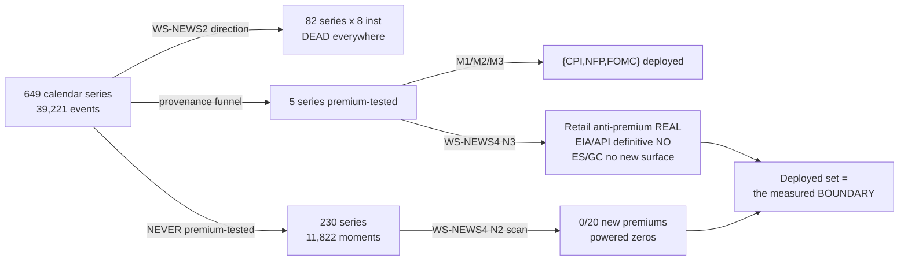

# WS-NEWS4 — The Dropped News Series: the Full Record

**Issues #134–#138 (all closed 2026-08-18) · verify suite 33/33 local AND server · every number
below is ledger-bound (`optimize/verify/claims_news4.py`) or re-derivable from a committed file.**

This is the in-depth companion to the bilingual visual report
(`NEWS4-DROPPED-SERIES-REPORT-BILINGUAL.html`). It records every experiment, every parameter,
every bug and every decision — so that no future study re-derives (or worse, contradicts) this
work without noticing.

---

## 0 · Why this workstream existed

The owner asked, after WS-NEWS3 shipped the confirmed news trade: *"this study included only
three news — what about the rest? why didn't we study them?"* The honest audit answer:

- **Direction** (does the surprise sign predict the move?) HAD been tested wide — WS-NEWS2's
  643 pairs across 82 series × 8 instruments. Dead everywhere.
- **The ride premium** (does an unconditional LONG into the release pay?) had only ever been
  tested on **five** series — CPI, NFP, FOMC, Retail Sales, Durables (+ EIA/API on CL) —
  because the premium studies inherited the consensus-provenance restriction (only series
  provable first-print against ALFRED). **The ride needs only timestamps**, so that
  restriction never actually applied to it.

So the deployed set {CPI, NFP, FOMC} was the funnel's *winner*, but nobody knew if it was the
*boundary*. WS-NEWS4's mandate (owner, verbatim intent): investigate the dropped news, test the
wide-series premium scan, deep-dive the never-tested and partially-tested, "via creating strong
record and tests records and tables to fill all the previous and the possible gaps."

---

## 1 · Phase N1 (#135) — the coverage record

**Deliverables** (commit `397a62a`): `docs/NEWS-COVERAGE-MATRIX.md` + three machine-readable
CSVs (`news4_coverage_matrix.csv`, `news4_n2_candidates.csv`, `news4_n2_moments.csv`),
generated by `news4_coverage_matrix.py` **from the evidence artefacts directly** — the
phase2 pair list, the p1/p2 per-event files, the deployed schedule, the raw TradingView
calendar. Regenerable; never hand-edited.

### 1.1 The universe, grounded

| fact | value | source |
|---|---|---|
| calendar events | 39,221 | `tv_us_calendar_raw.csv` |
| distinct series (titles) | 649 | same — ⚠️ `title` is the event key, `indicator` is a category |
| importance-1 series | 75 | same |
| usable era | **≥ 2016-01-01** | pre-2016 summer timestamps are one hour late (WS-NEWS2 DST audit) |
| matrix rows (≥40 usable events ∪ every studied series) | 237 | `news4_coverage_matrix.csv` |
| series ever premium-tested | **5** (+2 partial: EIA/API, CL-only, provenance-unverified) | `p1_events_*.csv` |
| untested moment groups ≥40 events | **92** | `news4_n2_moments.csv` |
| untested release moments total | **11,822** | scan log |

### 1.2 The three structural discoveries made while building it

1. **The scan unit is the MINUTE, not the title.** Co-released titles collapse: the NFP minute
   carries up to 19 titles (Unemployment Rate, AHE, Manufacturing Payrolls…); Initial and
   Continuing Jobless Claims share 100% of their minutes. Counting titles double-counts moments,
   and dedupe-by-minute means co-released series are *implicitly* inside deployed events.
2. **Initial Jobless Claims carries TradingView importance 0.** Any importance≥1 filter silently
   drops the single highest-frequency macro release (556 usable events). It was in fact the
   biggest single gap in the whole record.
3. **Title renames split series.** ISM Non-Manufacturing PMI → ISM Services PMI (2023),
   Markit → S&P Global (2022), "Jobless Claims 4-Week" vs "4-week", "Personal Income (MoM)" vs
   "Personal Income MoM". Without a merge map, one series looks like two half-length series and
   both may fall under the n-floor.

---

## 2 · Phase N2 (#136) — the wide-series premium scan

### 2.1 Pre-registration (commit `a988f17`, filed BEFORE any run)

- **Frozen trade** (the deployed spec verbatim, #117): LONG at release−300 s · stop 0.10 %
  (worse-of line/open, GAP-01) · TP 0.40 % (resting limit, better-of) · tie in one 1 s bar ⇒
  STOP · timed exit +900 s · **stressed costs lead** ($22.50/event on NQ and RTY).
- **Tier 1 confirmatory family** — 10 blocks × 2 instruments, Bonferroni α = 0.05/20 = 0.0025.
  Chosen on three declared criteria before any outcome was seen: prior-art support (Savor–Wilson's
  original set included PPI; pre-announcement drift documented for GDP/ISM; Lucca–Moench;
  Knox et al. "Equity Premium Events"), n ≥ 40, SCHEDULED-PRINT timestamp quality.
  Blocks: Initial Jobless Claims, PPI, Core-PCE/Personal, GDP Adv, ISM Mfg, ISM Services
  (rename-merged), JOLTs, Michigan prel, ADP, FOMC Minutes.
- **Tier 2 exploratory** — every remaining group ≥ 40 clean moments (~79 blocks), BH-FDR q=0.10,
  descriptive only; survivors promotable only via a fresh pre-registration on unconsumed data.
- **The verdict ladder** (in order): V2 jump gate (release-minute |open→close| > 1.2× the quiet
  baseline median, else **VOID-TIMESTAMP** — a wrong-timestamp block must not masquerade as a
  premium null) → t-test at the family α → chronological half-split (both halves' gross means
  same sign) → quiet-day control vs the FULL 39k calendar + per-clock seasonality floor →
  1,000 shuffled placebos (observed above the 99th pct). Negatives split: **POWERED-NULL**
  (MDE at 80% power ≤ $150/event) vs **UNDERPOWERED** ("cannot tell", never dressed as "no").
- **Exclusions**: covered-minute (minutes containing any premium-tested series) and
  **window-overlap** (a moment whose [−300 s, +900 s] window intersects a deployed event's
  window is excluded — a 12:15 ADP ride is still open at a 12:30 CPI print).
- **Declared blind spots**: shape (short side / other geometry / conditional entries) invisible;
  TV-only timestamp provenance beyond the 4 ALFRED-verified series; the $150 MDE line is a
  judgment call fixed in advance; era concentration flagged, not failed.

### 2.2 Implementation

`news4_premium_scan.py` — the fill model is **imported from the parity-proven executor**
(`src/deploy/release_executor.py: run_bracket, load_1s_windows`), not re-implemented; the
calendar comes through `tv_calendar.load()` (the ET-wall-clock convention every prior study
used). Controls: 400 quiet days per clock time (no calendar event within ±30 min, sampled
deterministically, seed 117). Run on the server over the full 1-second archive
(NQ: 19,967,556 bars loaded in one binary-seek pass; 26 control clocks × ~390 rides each).

### 2.3 ⭐ The positive control — and the bug it caught

The deployed set was pushed through the **identical pipeline** (`--positive-control`):

| block | n | net stressed $/ev | p | verdict |
|---|---|---|---|---|
| NQ deployed set | 327 | **+133.06** | 4.1e-04 | CONFIRMED — **M3 to the cent** |
| NQ CPI alone | 116 | **+309.02** | 2.8e-05 | CONFIRMED |
| NQ NFP alone | 127 | +78.10 | 0.17 | UNDERPOWERED |
| NQ FOMC alone | 84 | −26.82 | 0.63 | UNDERPOWERED |
| RTY CPI alone | 102 | **+78.41** | 7.7e-04 | CONFIRMED |
| RTY deployed set (floor 2019) | 239 | gross +57.20 | — | matches the committed M3 cell (+57.98) within the known 1-event tie-break |

**The bug**: the first run scored NQ CPI as FAILED-GATES despite p=2.8e-05, because the
quiet-day control gate was coded **two-sided** and the 08:30 quiet ride is itself significantly
*negative* (≈ −$50 net = cost drag + quiet-morning drift). The pre-registered wording — the
control must not itself show a *positive* premium — was correct; the code was not. Fixed to the
registered wording (commit `778492c`), **all scans re-run after the fix, no thresholds touched**.
Without the positive control this bug would have silently biased the whole scan toward zeros.
(It changed no scan verdict — there were no positives for it to veto — but that is knowledge we
only have *because* it was found and everything re-ran.)

Reconciliation notes: RTY posctrl at floor 2016 gives n=281 net +$28.74 — the 2017-18 RTY
events dilute it; the M3 evidence used floor 2019 (n=238) and the scan reproduces that cell.
M3's published t=3.79 was computed on **gross** (57.98/15.28); the same data at stressed costs
gives net t≈2.28 — both true, different statistics, both recorded.

### 2.4 Tier-1 results — zero confirmations, powered

**NQ** (net stressed $/event; MDE at 80% power, α=0.0025):

| block | n | gross | net | p | MDE | jump× | verdict |
|---|---|---|---|---|---|---|---|
| Initial Jobless Claims | 434 | −5.34 | −27.84 | 0.11 | $67 | 1.83 | POWERED-NULL |
| PPI MoM | 102 | +26.68 | +4.18 | 0.94 | $205 | 4.67 | UNDERPOWERED |
| Core PCE / Personal | 113 | +41.08 | +18.58 | 0.68 | $177 | 2.50 | UNDERPOWERED |
| GDP Adv | 33 | −87.52 | −110.02 | 0.07 | $234 | 3.17 | UNDERPOWERED |
| ISM Manufacturing | 128 | −10.88 | −33.38 | 0.46 | $177 | 2.09 | UNDERPOWERED |
| ISM Services | 128 | +15.61 | −6.89 | 0.88 | $174 | 2.06 | UNDERPOWERED |
| JOLTs | 127 | −0.01 | −22.51 | 0.58 | $157 | 1.75 | UNDERPOWERED |
| Michigan prel | 127 | −18.67 | −41.17 | 0.37 | $177 | 1.56 | UNDERPOWERED |
| ADP | 126 | −31.33 | −53.83 | 0.03 | $99 | 3.20 | POWERED-NULL |
| FOMC Minutes | 84 | −35.37 | −57.87 | 0.14 | $153 | 1.80 | UNDERPOWERED |

**RTY**: 9/10 POWERED-NULL (MDEs $27–$120) + Initial Jobless Claims "significant negative"
(p=2.1e-05) that is **pure cost drag**: gross −$6.61, the $22.50 does the rest.

**The two power statements** (both ledger claims):
- On NQ, every Tier-1 MDE ($67–$234) sits **below the CPI-sized premium (+$309)** the same
  pipeline confirms — a CPI-class premium in any block would have been seen.
- On RTY, 9/10 blocks exclude even the smaller RTY-CPI-sized premium (+$78); GDP Adv (n=27)
  is the declared exception.

And every Tier-1 block **passes the jump gate** (1.56–4.67× quiet baseline): these are real,
market-moving minutes that still pay nothing. **POWER ≠ PREMIUM at full-calendar scale.**

### 2.5 Tier-2 — zero exploratory positives; the anatomy of the "negatives"

No EXPLORATORY-POSITIVE on either instrument across ~79 blocks. The BH-FDR-flagged
"significant negatives" decompose on gross-vs-net reading:

- **Cost drag** (the majority; especially on low-variance RTY where 40 blocks pass FDR):
  Treasury auctions, Fed speeches, Baker Hughes, MBA — gross −$3…−$25, net −$26…−$48.
  The significance lives in the cost line, not in the market.
- **Larger gross negatives** (NQ): IBD/TIPP −$103 (n=40), Wholesale Inventories Adv −$98 (n=49),
  42-Day Bill −$84 (n=84). Small n, full history consumed → per pre-registration, unpromotable
  observations; a short-side study of them would be a new design with its own multiplicity debt.
- **VOID-TIMESTAMP** (33 NQ blocks + 3 speech fuzz-flips): jump ≤1.2× — the calendar minute does
  not move price (Redbook, MBA, NFIB, Monthly Budget, most auction stamps, half the Fed
  speeches). For these NO premium verdict is claimable: their timestamps are unverifiable.
  Notable save: NFIB showed p=0.0015 significance — correctly voided rather than narrated.

---

## 3 · Phase N3 (#137) — the partially-tested, finished

Pre-registration commit `70f29fc` (before any run): 8 confirmatory tests, Bonferroni
α = 0.05/8 = 0.00625; per-instrument constants by the deployed formula (stressed = $2.50 +
4 ticks/event): ES $52.50, GC $42.50, CL $42.50, NQ/RTY $22.50 unchanged. Runner:
`news4_n3_deepdive.py` (machinery imported, again nothing re-implemented). Two verdict-ladder
additions: **CONFIRMED-NEGATIVE** (significant negative that is negative on *gross* with both
halves negative — Retail's arm) and **COST-DRAG-NEGATIVE** (significant net-negative whose
gross sits inside the cost line).

### 3.1 ⭐ Retail Sales — the anti-premium is real

| | n | gross $/ev | net | p | halves (gross) | jump× |
|---|---|---|---|---|---|---|
| NQ | 113 | **−86.10** | −108.60 | 7.2e-04 | −27 / −144 | 4.17 |
| RTY | 101 | **−32.41** | −54.91 | 1.7e-05 | −22 / −42 | 3.33 |

Three independent defenses: negative on **gross** (not the costs); replicates on **two
independent price files**; and at the same 08:30 clock the deployed set rides *positive* while
Durables rides flat — **series-specific**, not a morning effect. M1's old grid hint (−$98 at the
no-TP cell) was true. The short side was deliberately NOT tested (not pre-registered); recorded
as an open question. Blind spot: the overlap rule excludes Retail minutes co-fired with CPI/NFP,
so this measures Retail-*alone* minutes.

### 3.2 Durables — POWERED-NULL twice (NQ gross +$9.47, MDE $133; RTY +$10.78, MDE $55). Closed.

### 3.3 EIA / API on CL — the M1 "VOID" upgrades to a definitive NO

| | n | gross | net | MDE | jump× |
|---|---|---|---|---|---|
| EIA 10:30 | 551 | **−1.41** | −43.91 | $20 | 5.33 |
| API 16:30 | 433 | +5.27 | −37.23 | $21 | 8.00 |

The most violent scheduled minutes in the oil tape, measured with the heaviest power in the
whole programme, pay **exactly zero gross**. The strongest single POWER ≠ PREMIUM datapoint we
have.

### 3.4 ES / GC — no new surface; one descriptive signal filed

| | n | gross | net | p | MDE | verdict |
|---|---|---|---|---|---|---|
| ES deployed set | 327 | +107.54 | +55.04 | 0.034 | $93 | POWERED-NULL |
| GC deployed set | 324 | +50.98 | +8.48 | 0.74 | $89 | POWERED-NULL |

Descriptive per-title slices inside those same events (not confirmatory):

| | CPI alone | NFP alone | FOMC alone |
|---|---|---|---|
| ES (net, $52.50 costs) | **+151.37 (t=+3.00, n=116)** | +17.91 (t=+0.49) | −21.86 (t=−0.48) |
| GC (net, $42.50 costs) | +80.14 (t=+1.78, n=116) | −26.30 (t=−0.67) | −39.14 (t=−0.87) |

**CPI concentration across four instruments** (net/event): NQ +$309 (confirmed), RTY +$78
(confirmed), ES +$151 (descriptive t≈3.0), GC +$80 (descriptive t≈1.8) — while NFP and FOMC
hover at zero-to-negative net everywhere. The announcement premium, at this trade shape, is an
**inflation-print phenomenon**. The ES CPI-alone slice is filed as a **promotion candidate**
whose history is consumed by this measurement — see the follow-up study case.

Runner artifact (recorded): the descriptive "CPI-alone" block self-excluded via the
deployed-overlap rule (CPI's minutes are ≤1200 s from themselves) → NO-DATA; worked around by
slicing the deployed-set events by title. Confirmatory tests unaffected.

### 3.5 Items closed by reference to N2

FOMC-adjacent events (Minutes / Press Conference / Powell): UNDERPOWERED / VOID-TIMESTAMP
(fuzz flip) / POWERED-NULL in the scan. Short-leg follow-ups: no N2 positives existed to flip.

---

## 4 · Verification

- **Ledger**: 6 new claims, 18 checks in `claims_news4.py` — every claim's V1 (re-derivation
  from per-event fills), V2 (independent instrument or committed M3 artefact), V3 (falsifier)
  fail for different reasons. Suite **33/33** on the local machine **and** the server.
  Claim IDs: `N4-SCAN-ZERO-CONFIRMED`, `N4-POSCTRL-M3-PARITY`, `N4-POWERED-AGAINST-CPI-SIZE`,
  `N4-RETAIL-ANTI-PREMIUM-CONFIRMED`, `N4-EIA-API-POWERED-NO`, `N4-ES-GC-NO-NEW-SURFACE`.
- **Server environment fixes recorded**: `data_2010_1s/venv` needed scipy via
  `python3 -m pip` (its `pip` binary is broken), and the blanket-gitignored evidence CSVs
  (`forecast_previous_*`, `alfred_revision_*`) had to be scp'd for the older claims to go green
  there. The pull also hit the untracked-now-tracked trap (news4 outputs) — server copies
  removed, then `--ff-only`.
- **Commits of record**: N1 `397a62a` · N2 pre-reg `a988f17` · scan `480be34` · posctrl
  `6c6c53a` · gate fix `778492c` · results+ledger `10e85e4` · N3 pre-reg `70f29fc` · runner
  `bb43643` · results+ledger `06f7849` · N4 report `6cfc60e`.

## 5 · What went well / what went wrong

**Well**: the entire gap (record → scan → deep-dives → reports) closed in one day because every
piece reused the parity-proven executor; the positive control validated the pipeline AND caught
a live bug; pre-registration kept ~170 block-tests honest; the owner's question now has a
permanent, regenerable answer.

**Wrong (kept honestly)**: the two-sided control gate (caught pre-results, fixed, everything
re-run); the descriptive runner block self-exclusion (worked around); GDP Adv arrived at n=33
vs the estimated ~42 because covered-minute exclusion bit harder than estimated (declared;
verdict honest: UNDERPOWERED); two server environment gaps before the ledger went green there.

## 6 · Hand-offs

1. **ES CPI-alone (+$151 net, t≈3.0)** → its own study case (next, owner-ordered).
2. **Retail short side** → real negative exists; monetization untested, un-pre-registered.
3. **The conditional-shape blind spot** → WS-FUSION's opening question.
4. Timestamp provenance beyond the 4 ALFRED-verified series rests on TradingView + the jump gate.
