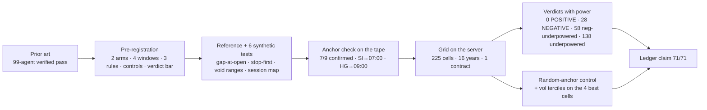
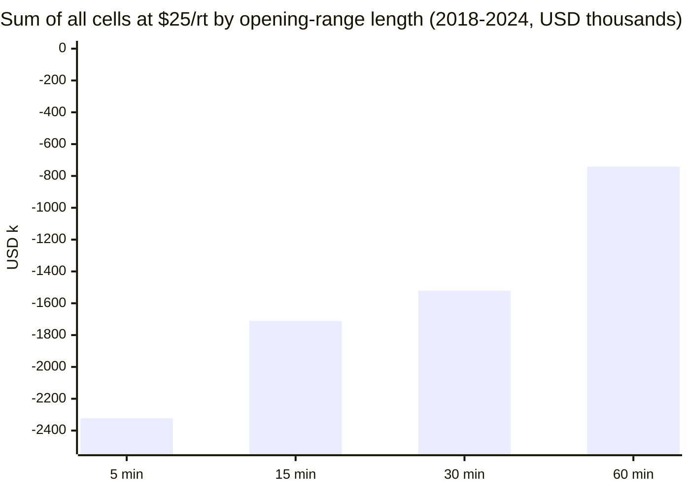

# WS-ORB (#183) — opening-range breakout on all nine instruments: the report

**Date:** 2026-08-23 · **Pre-registration:** `docs/WS-ORB-PREREGISTRATION.md` (filed before any run; one pre-run
note for the anchor check) · **Prior art:** `docs/WS-ORB-PRIOR-ART.md` · **Code:** `optimize/orb/` (reference +
6 synthetic-session tests, anchor check, grid runner, controls, verdicts) · **Evidence:** `optimize/orb/data/grid1/`
(225 trade books, `orb_summary.json`, `grid_table.csv`, `verdicts.csv`, `controls_top.json`) + `anchor_check.json`
· **Ledger:** `ORB-GRID-NO-POSITIVE-CELL`, 71/71.

## 0. The answer in one paragraph

Over sixteen years of 1-minute data (2010-06 → 2026-08-07), nine instruments, two session anchors (the cash/pit
open and the 18:00 Globex open), four opening-range lengths (5/15/30/60 min) and three exit rules from the
literature — 216 cells plus the 2013 volatility-threshold comparator — **not one cell meets the pre-registered bar
for a positive result** (t ≥ 2.5 at $25 per round-trip on 2018–2024, same sign in 2010–2017, stable across years).
Before costs, 118 of 225 cells are positive on 2018–2024 (+$1.57M in total); at $25 per round-trip, 39 are
positive and the grid sums to **−$6.49M**. The median gross edge is **−0.01 ticks per trade**; 155 of 225 cells have
a gross edge smaller than two ticks either way — the breakout, where it earns anything, earns it inside the
spread, exactly as the prior art warned. 28 cells are negative *with* power (the test could have seen a $25
edge and saw a loss instead), 58 more are negative at t ≤ −2 but below the power bar, 138 are simply
under-powered — even 16 years of daily trades cannot resolve a per-trade effect smaller than ~$50 against the
per-trade noise. The 5-minute range, the literature's favourite, is the worst window here; the "50% of range"
target is the worst rule. The best cells are all NQ (or NG on 148 trades): $47–$73 per trade after costs at t ≈
1.5 — and the best of them, NQ 60-minute Globex, earns no more than a 60-minute range placed at a *random* hour,
so the opening anchor carries no information there. Verdict, in plain words: **ORB as defined in the literature
is not a trading strategy on these markets at realistic costs.** What survives is a weak, unproven, NQ-only
tendency for wide (60-min) range breakouts to continue, which is the volatility-expansion effect the box
strategy already trades.

## 1. What was run



- **Anchor check (pre-run):** the declared cash opens show the expected volume step on 7/9 instruments (NQ ×9.2,
  ES ×9.7, RTY ×15.7, YM ×10.8 at 09:30; GC ×3.0 at 08:20; CL ×4.6, NG ×4.2 at 09:00). SI's strongest step is
  07:00 and HG's is 09:00; both anchors were moved per the pre-registered rule before any P/L existed.
- **Fills:** entry at the next 1-minute open after the breakout close; stops/targets on bar high/low, stop first
  when both touch, gap-through filled at the bar's open; flat at the session end. One contract, no fitting.
- **Windows:** exploration 2010-06 → 2017 (sign check), confirmation 2018 → 2024 (verdict), fresh 2025 → 2026-08-07.

## 2. The grid at a glance (confirmation window 2018–2024)

| cut | cells | sum @ $25/rt | note |
|---|---|---|---|
| all 225 | | **−$6,485,272** | raw +$1,565,353 — friction is the whole story |
| by rule | R1 1R/10R | −$1,688,718 | 0% of cells powered-negative |
| | R2 10%-ATR stop | −$1,883,026 | 6% |
| | R3 50%-range target | **−$2,724,169** | **33%** powered-negative — the tight target loses to the spread |
| | C1 vol-threshold | −$189,360 | 9 cells; 2 negative at t<−2.5, 7 under-powered |
| by window | 5 min | **−$2,322,687** | 28% powered-negative — the literature's favourite is the worst here |
| | 15 / 30 / 60 min | −$1.71M / −$1.52M / −$0.74M | losses shrink as the range widens (fewer, larger trades) |
| by arm | cash open | −$3,702,559 | |
| | 18:00 Globex | −$2,782,714 | neither anchor is better; both are negative |



## 3. Verdicts (pre-registered rules)

| verdict | cells | meaning |
|---|---|---|
| POSITIVE | **0** | no cell clears t ≥ 2.5 at $25/rt with sign agreement and year stability |
| NEGATIVE (powered) | 28 | t ≤ −2 and the test's minimum detectable effect ≤ $25/trade — a friction-sized edge would have been seen |
| NEGATIVE (t) but under-powered | 58 | t ≤ −2, but MDE > $25 — the loss is real, the bar for calling it "proven absent" is not met |
| UNDERPOWERED | 138 | MDE > $25 (median MDE of the grid $51/trade, range $12–$654) |
| NULL | 1 | CL cash 5-min R3 |

Powered-negative cells by instrument: HG 8 · YM 4 · GC 3 · SI 3 · NG 3 · RTY 3 · ES 2 · CL 2 · NQ 0.

## 4. Instrument by instrument (best cell first; all figures 2018–2024 at $25/rt unless stated)

- **NQ** — the only instrument whose grid is net positive after costs (+$548k over 25 cells; 17/25 positive).
  Best: cash 15-min with the ATR stop, $47/trade on 1,800 trades, t 1.56, **positive in all 7 years** — but
  −$27k in 2010–2017 (sign disagreement → no verdict) and MDE $85. Globex 60-min (R1 $73/trade, R2 $62) are the
  largest dollar cells (+$123k, +$106k) with a healthy 16–20 ticks gross edge — and R1 **fails the random-anchor
  control** (random 60-min ranges earn up to $113/trade): it is range-expansion continuation, not an open effect.
  Vol terciles: high-vol days $105–$120/trade, low-vol $50–$84, mid $5–$25 — the edge is a volatility exposure.
  Fresh 2025–26: the 60-min Globex R2 made +$57k, the cash 15-min R2 +$4k, the 5-min cells lost.
- **ES** — grid −$473k; best cash 15-min R2 $13/trade (t 0.73, 1.7 ticks gross). Two powered negatives
  (Globex 5-min R3 −$30/trade at t −4.4). The index with the tightest spread shows the smallest gross edge.
- **GC** — grid −$960k; best cash 5-min R2 $16/trade (t 1.03), −$56k before 2018. The vol-threshold comparator
  is GC's second-best cell (+$10.6k, t 0.6) — the only instrument where Holmberg's rule is not negative.
- **SI** — grid **−$1.40M**, 1/25 cells positive after costs; worst cell in the grid (cash 5-min R3, t −6.8).
  The 07:00 anchor produced nothing better than 08:20 would have (both are in the books' 5-min disasters).
  Silver's tick ($25) equals the friction assumption; 155 cells grid-wide sit inside two ticks.
- **HG** — grid −$1.19M, **8 powered negatives** (the most), gross edges of −1.4 to +1.1 ticks; copper's
  $12.50 tick makes every ORB rule a spread-payer.
- **CL** — grid −$813k; 18/25 cells positive *before* costs, 1 after. The cash 5-/15-min classic cells make
  +$43–45k raw and lose it all at $25/rt: the purest "edge inside the spread" instrument.
- **NG** — grid −$595k; **the grid's top cell** is NG Globex 60-min R3 ($66/trade, t 1.78, 148 trades, 4/7
  years, beats random anchors, −$2.4k in 2010–2017) — interesting, unproven (MDE $104), and on so few trades that
  one more year decides it.
- **RTY** — grid −$750k; best Globex 60-min R2 $9/trade; the small-contract index has the Globex 5-min R3 cell
  at t −6.7.
- **YM** — grid −$856k; best Globex 60-min R1 $16/trade (t 0.5), 4 powered negatives.

## 5. The pre-registered controls on the four best cells

| cell | real $/trade | random-anchor p95 | beats? | vol terciles low / mid / high |
|---|---|---|---|---|
| NQ Globex 60 R1 | 72.7 | **113.4** | **no** | 84 / 13 / 120 |
| NQ cash 15 R2 | 47.3 | 30.4 | yes | 50 / 5 / 87 |
| NG Globex 60 R3 | 66.1 | 2.1 | yes | 66 / 54 / 79 |
| NQ Globex 60 R2 | 62.4 | 39.1 | yes | 56 / 25 / 106 |

Three of four beat the random placement; none clears the noise bar (t < 2). The one that fails the control is
the largest-dollar cell in the grid. All four earn most in the top volatility tercile.

## 6. What went well / what went wrong / what it means

**Well.** The whole study — prior art, pre-registration, reference with tests, anchor check, 225-cell grid,
controls, verdicts, claim — ran in one day on the server; the grid itself took 90 seconds on 9 cores. Every
definition is in one 170-line file anyone can read. The anchor check caught two wrong conventions (SI, HG) before
they could be blamed or credited. The prior art's three warnings (edge inside the spread, year concentration,
5-minute optimum being an equities artefact) all reproduced on our data.

**Wrong / limits.** Per-trade power is the binding constraint: a $25 effect against a $1,000+ per-trade standard
deviation needs ~13,000 trades; a daily strategy gives 1,800 in seven years. So 138 cells are "not proven" rather
than "proven absent" — honest, but unsatisfying. Continuous-contract roll days are still inside the books
(declared blind spot; a with/without-roll table is owed). No pooling across instruments was pre-registered, so the
grid-wide −$6.5M is descriptive, not a test. The SI 07:00 anchor may be a DST artefact.

**Meaning for the programme.** ORB does not add an entry family. The one signal with any life — wide-range
continuation on NQ, strongest in high volatility — is the same phenomenon the box champions and the FU-14 power
forecast already monetise, and it is not anchored to the open. If anything is worth a follow-up it is narrow and
pre-registrable: *NQ only, 60-minute ranges, any anchor, as a feature for the existing vol machinery* — not as a
strategy.

## 7. Reproduce
```
python3 -m pytest optimize/orb/test_orb_reference.py                       # 6 synthetic-session tests
python3 optimize/orb/orb_anchor_check.py <tape> optimize/orb/data/anchor_check.json
python3 optimize/orb/orb_run.py --root <tape> --out <dir> --jobs 9          # 225 cells, ~90 s on the server
python3 optimize/orb/orb_power.py <dir>                                      # verdicts.csv
python3 optimize/orb/orb_controls.py --root <tape> --out <dir>/controls_top.json --cells NQ_globex_60_R1,NQ_cash_15_R2,NG_globex_60_R3,NQ_globex_60_R2
python3 optimize/verify/run.py                                               # ledger, ORB-GRID-NO-POSITIVE-CELL
```
