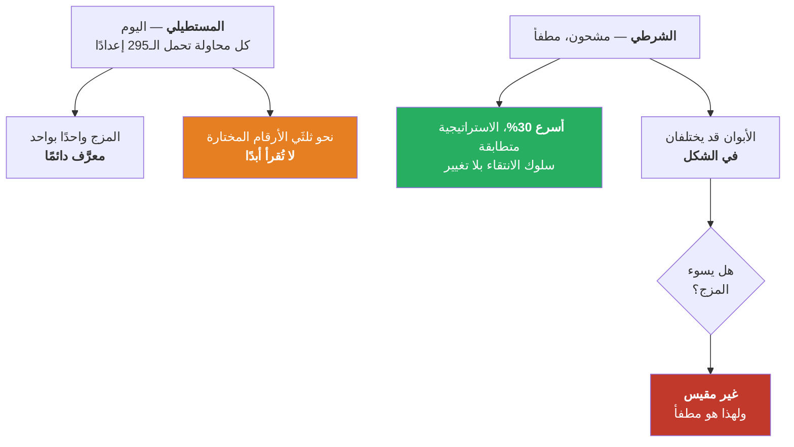
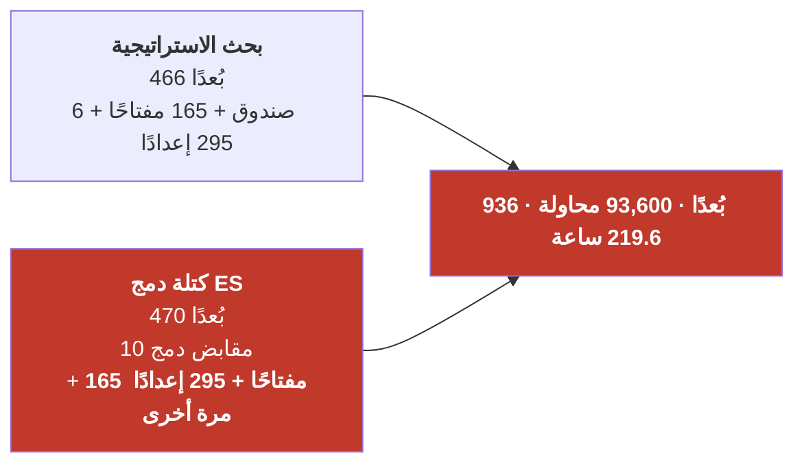

# شرحان

طلبتَ توضيح هذين الأمرين أكثر. أما السؤال المفتوح الثالث — *هل تفيد المؤشرات الثمانية* — فقد **أُوقف**،
وصار مُعلَّقًا في المسألة ‎#98‎، ولا يُبحث هنا.

---

# الجزء الأول — «موضوع الشرطية»

## 1.1 ماذا يفعل المُحسِّن اليوم

في كل محاولة، يختار المُحسِّن مجموعة كاملة من الأرقام ويختبرها. وفي طبقة المؤشرات يختار **نوعين من
الأشياء**:

| النوع | العدد | مثال |
|---|---:|---|
| مفتاح نعم/لا لكل مؤشر | 165 | *هل RSI مشتغل؟* |
| إعدادات كل مؤشر | 295 | *مدة RSI = 14، الحدّ الأدنى = 30، الأعلى = 70* |

**وهنا بيت القصيد: إنه يختار إعدادات المؤشرات الـ165 كلها، في كل محاولة — بما فيها تلك التي أطفأها
للتوّ.**

فإذا كانت في محاولةٍ ما 56 مؤشرًا مشتغلًا و109 مطفأة، فإنه مع ذلك يختار مدةً لكلٍّ من تلك الـ109. ثم
تُسلَّم هذه الأرقام إلى المحرّك، الذي لا ينظر إليها إطلاقًا، لأن المؤشر المطفأ لا يصوّت.

## 1.2 تتبّع محاولة واحدة بالتفصيل

```
المحاولة رقم 4,001
  مفتاح RSI            -> مشتغل    مدة 14، أدنى 30، أعلى 70      <- مستخدَم
  مفتاح MACD           -> مشتغل    سريع 12، بطيء 26، إشارة 9     <- مستخدَم
  مفتاح bollinger      -> مطفأ     مدة 45، k = 4.3               <- اختير ثم أُهمل
  مفتاح keltner        -> مطفأ     مدة 40، m = 5.0               <- اختير ثم أُهمل
  ... و105 مؤشرات مطفأة أخرى، ولكلٍّ إعدادات اختيرت للتوّ ...
```

أي أن **قرابة ثلثي الجهد في بناء المحاولة يُنفق على اختيار أرقام لا يقرؤها شيء**.

## 1.3 لماذا بُني هكذا — والسبب حقيقي

المُحسِّن **خوارزم جيني**. يعمل بأخذ محاولتين جيدتين («أبوين») ومزج أرقامهما لإنتاج محاولة جديدة
(«ابن»). وهذا المزج بسيط وآمن حين يصف الأبوان **القائمة نفسها** من الأرقام — فتُقابَل واحدةً بواحدة.

وسحب كل الإعدادات في كل مرة يضمن ذلك. فالشكل لا يتغيّر أبدًا، والمزج معرَّف دائمًا. يُسمّى هذا فضاء بحث
**مستطيليًّا**، وكان اختيارًا متعمّدًا لا سهوًا.

## 1.4 ما الذي يغيّره السحب الشرطي

**هذا فقط: إن كان المؤشر مطفأً، فلا تتعب نفسك باختيار إعداداته — استعمل قيمه الافتراضية.**

```
المحاولة 4,001، شرطيًّا
  مفتاح RSI            -> مشتغل    مدة 14، أدنى 30، أعلى 70      <- اختير واستُخدم
  مفتاح bollinger      -> مطفأ     (القيم الافتراضية، بلا اختيار)
```

المفتاح نفسه لم يُمسّ. والتشغيل/الإطفاء ما زال رمية عملة عادلة 50/50 لكل مؤشر — ولهذا تحديدًا **ليست
هذه فكرتك في الترميز بالقيمة**، وهي لا ترث فشلها.

## 1.5 ما الذي أُثبت

**الاستراتيجية متطابقة.** إعدادات المؤشر المطفأ لا تُقرأ أبدًا، فاستبدالها بالقيم الافتراضية لا يمكن
أن يغيّر صفقة واحدة. وهذا ليس ادّعاءً — هناك اختبار (`test_conditional_params.py`) يبني الاستراتيجية
بالطريقتين ويقارن: نفس المجموعة المشتغلة، ونفس إعداداتها، ونفس الكائنات المسلَّمة للمحرّك.

**وهو أسرع، مقيسًا على تشغيلتين متطابقتين بـ800 محاولة، نفس البذرة، والفارق هو الخيار فقط:**

| | اليوم | الشرطي | التغيّر |
|---|---:|---:|---:|
| زمن التنفيذ | 533 ث | 371 ث | **−30%** |
| الإعدادات المختارة لكل محاولة | 454 | 301 | **−34%** |

**وسلوك الانتقاء لم يتغيّر.** على مدى 400 محاولة، دفع الذراع الشرطي عدد المؤشرات المشتغلة من 83.4 إلى
56.3؛ ودفعه إعداد اليوم من 83.5 إلى 53.1. المنحنى نفسه عمليًّا.

## 1.6 الشيء الوحيد غير المُثبت — ولماذا هو مطفأ افتراضيًّا

**صار بإمكان الأبوين أن يصفا قائمتين مختلفتين من الأرقام.**

الأب A فيه 60 مؤشرًا مشتغلًا، فيحمل إعدادات 60. والأب B فيه 45، فيحمل إعدادات 45. وحين يمزجهما الخوارزم
الجيني، **لم يعد هناك تقابل نظيف واحدًا بواحد**.

المكتبة تتعامل مع ذلك — لا تنهار، وتنتج أبناءً صالحين. **لكن المجهول هو: هل يصير المزج *أسوأ*؟ هل تتدهور
قدرة الخوارزم على دمج حلّين جيدين في حلٍّ أفضل حين يختلف شكل الأبوين؟**

هذا سؤال عن **جودة** البحث، ويحتاج تشغيلة صحيحة للإجابة. و30% من التسريع ليست سببًا لتغيير طريقة تناسل
الحلول بناءً على الثقة.



## 1.7 أين يقف الأمر

مشحون باسم `--conditional-params`، **مطفأ افتراضيًّا**، ومثبَّت على الإطفاء باختبار يذكر السبب. متتبَّع
في **‎#99‎**. ولا يحتاج **كتلة الدمج** إطلاقًا — فهذا عمل مُحسِّن اعتيادي، بخلاف ‎#98‎/‎#100‎.

---

# الجزء الثاني — «النسخة الثانية»

## 2.1 ما هي، في جملة واحدة

**عندما تشغّل كتلة دمج ES، يُستنسَخ بحث المؤشرات الـ165 بأكمله ويُشغَّل مرة ثانية على تاريخ أسعار ES.**

## 2.2 من أين جاءت

كتلة الدمج تسأل: *«هل توافق السوق الأخرى على هذه الصفقة؟»* وللإجابة، لا تنظر إلى سعر ES فحسب، بل تشغّل
**لجنة كاملة من المؤشرات على شموع ES نفسها** — RSI على ES، وMACD على ES، وbollinger على ES، وهكذا —
ثم تأخذ أصواتها.

ولأن المُحسِّن يبحث، فهو لا يثبّت تلك اللجنة، بل **يبحث فيها أيضًا**: أيّ المؤشرات الـ165 داخل لجنة ES،
وبأي إعدادات.

## 2.3 الحساب

| | الأبعاد |
|---|---:|
| بحث الاستراتيجية نفسه | **466** |
| ↳ منها طبقة المؤشرات | 460 |
| **كتلة دمج ES** | **470** |
| ↳ مفاتيح اللجنة | 165 |
| ↳ إعدادات اللجنة | 295 |
| ↳ مقابض الدمج الثابتة (الحالة، الترميز، الوضع، 6 خلايا جدول الحقيقة، k) | 10 |
| **المجموع مع مساهم واحد** | **936** |

**مساهم واحد يُضاعف البحث.** ليس «يزيده» بل **يضاعفه**. وكل محاولة من تلك أغلى في التقييم بنحو **9×**،
لأن اللجنة تحسب المؤشرات على تاريخ ES الدقيقي الكامل البالغ 486,954 شمعة.



## 2.4 لماذا بقيت غير مرئية

لسببين، وكلاهما أُصلح الآن:

1. **الخطة لم تكن تراها.** لم يكن في `search_dims` **أي حدّ للمساهمين إطلاقًا**، فكان
   `--contributors ES --plan` يطبع الـ470 بُعدًا نفسها مع الكتلة وبدونها. وكل تشغيلة دمج أُطلقت بـ
   `--auto-trials` كانت مُحجَّمة لنحو **نصف** المساحة التي تبحثها.
2. **الخيار البديهي لا يحجّمها.** `--only-indicators` يقلّص طبقة الاستراتيجية ويترك النسخة الثانية بلا
   مساس. وأي شخص يحاول جعل تشغيلة الدمج ميسورة سيمدّ يده إليه أولًا وسيظلّ أمام مهمّة من خمسة أيام.

| الإعداد | الأبعاد | المحاولات | لكل ذراع |
|---|---:|---:|---:|
| بلا تحجيم | 936 | 93,600 | **219.6 ساعة** |
| `--only-indicators` وحده — **الفخّ** | 524 | 52,400 | ~5 أيام |
| **تحجيم الطبقتين** (`--contrib-only`) | **112** | **11,200** | **2.8 ساعة** |

## 2.5 ما الذي فُعل حيالها

**حُجِّمت، لا أُزيلت.** `--contrib-only` يقصر اللجنة على مجموعة مسمّاة — أرخص بـ78× عند تحجيم
الطبقتين. وكانت هذه الرافعة موجودة أصلًا داخل الشيفرة؛ لكن المُحسِّن لم يمرّرها قط، فتعذّر بلوغها من سطر
الأوامر.

**والكتلة كلها صارت خلف فعلين متعمّدين** — تسمية الرمز *و* `--enable-fusion-contributors` — فلا يمكن أن
تصل إلى العمل الاعتيادي بالخطأ. والتشغيلة العادية اليوم تطبع **466 بُعدًا وصفر أبعاد مساهمين**؛ وكلمتا
*committee* و*contributor* لا تظهران إطلاقًا.

## 2.6 ما الذي **لم** يُفعل — السؤال الذي يبقى مفتوحًا

**الازدواج نفسه ما زال قائمًا.** التحجيم يجعله رخيصًا، لكنه لا يزيله.

والسؤال البنيوي: هل النسخة الثانية **ضرورية**؟ بعض الاحتمالات، ولم يُختبر أيٌّ منها:

- **هل تحتاج لجنة ES أن تُبحَث أصلًا**، أم يمكن تثبيتها على مؤشرات بطل ES نفسه؟ هذا وحده يحذف 460 من
  الأبعاد الـ470 دفعةً واحدة.
- **هل يمكن مشاركة اللجنتين** بدل بحثهما مستقلّتين — مجموعة مؤشرات واحدة تُطبَّق على الأداتين؟
- **هل اللجنة هي الآلية الصحيحة أساسًا**، أم أن إشارة اتفاق واحدة من ES (وهي موجودة أصلًا في المقابض
  الثابتة العشرة) تحمل المعلومة نفسها بـ1/47 من المساحة؟

**هذه أفكارك أنت لتختبرها** — وقد قلتَ ذلك بنفسك. متتبَّعة في **‎#100‎**، مُعلَّقة إلى جانب ‎#98‎، لأن
المستهلك الوحيد لتحجيم اللجنة هو كتلة الدمج، وهي لا تُشغَّل عمدًا.

---

## الخلاصة

| | المعاملات الشرطية | النسخة الثانية |
|---|---|---|
| **ما هي** | التوقّف عن اختيار إعدادات للمؤشرات المطفأة | كتلة الدمج تعيد تشغيل بحث المؤشرات كاملًا على ES |
| **الحالة** | مشحونة، **مطفأة افتراضيًّا** | **محجَّمة** (أرخص 78×)، لا مُزالة |
| **المُثبت** | الاستراتيجية متطابقة · ‎−30%‎ زمنًا · الانتقاء بلا تغيير | الحساب، وأن الخطة صارت تراها |
| **غير المُثبت** | هل يتدهور المزج الجيني حين يختلف شكل الأبوين | هل الازدواج ضروري أصلًا |
| **يحتاج الدمج؟** | **لا** — عمل مُحسِّن اعتيادي | **نعم** — مُعلَّق مع ‎#98‎ |
| **المسألة** | **‎#99‎** | **‎#100‎** |
