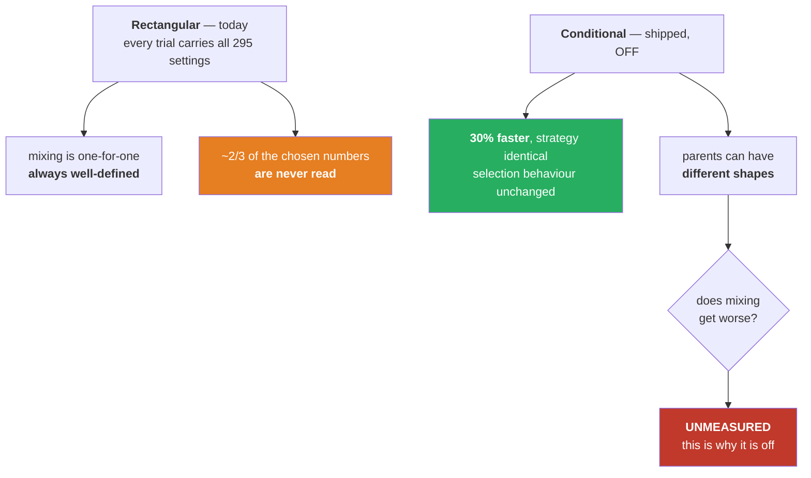
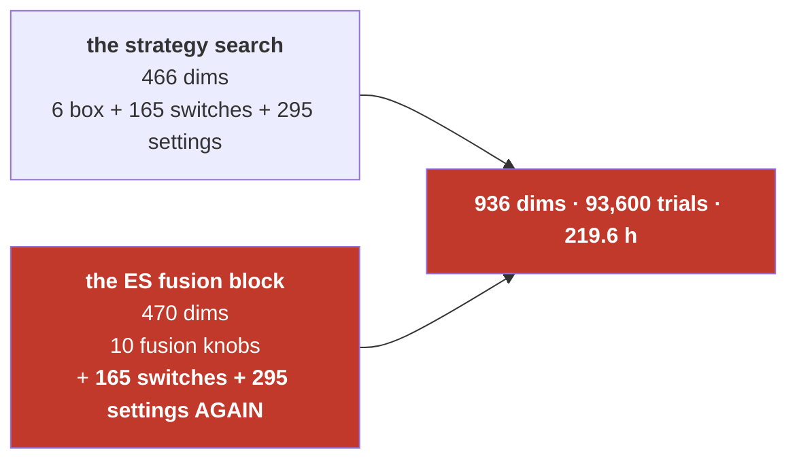

# Two explanations

You asked for these two to be explained further. The third open question — *do the eight indicators
help* — is **stopped**, parked in #98, and is not discussed here.

---

# PART 1 — "The conditional thing"

## 1.1 What the optimizer does today

Every trial, the optimizer picks a complete set of numbers and tests them. For the indicator layer it
picks **two kinds of thing**:

| kind | count | example |
|---|---:|---|
| a yes/no switch per indicator | 165 | *is RSI switched on?* |
| the settings of each indicator | 295 | *RSI period = 14, lower = 30, upper = 70* |

**Here is the part that matters: it picks the settings for all 165 indicators, every single trial —
including for the ones it just switched off.**

So on a trial where 56 indicators are on and 109 are off, it still chooses a period for every one of
those 109. Those numbers are then handed to the engine, which never looks at them, because a
switched-off indicator does not vote.

## 1.2 A concrete walk-through of one trial

```
trial #4,001
  switch RSI            -> ON      period 14, lower 30, upper 70     <- used
  switch MACD           -> ON      fast 12, slow 26, signal 9        <- used
  switch bollinger      -> OFF     period 45, k 4.3                  <- CHOSEN, then ignored
  switch keltner        -> OFF     period 40, m 5.0                  <- CHOSEN, then ignored
  ... 105 more switched-off indicators, all with freshly chosen settings ...
```

Roughly **two-thirds of the work of building a trial is spent choosing numbers that nothing reads.**

## 1.3 Why it was built that way — the reason is real

The optimizer is a **genetic algorithm**. It works by taking two good trials ("parents") and mixing
their numbers to make a new one ("child"). That mixing is simple and safe when both parents describe
the *same list* of numbers — you can pair them up one for one.

Drawing every setting every time guarantees that. The shape never changes, so mixing is always
well-defined. This is called a **rectangular** search space, and it was a deliberate choice, not an
oversight.

## 1.4 What conditional drawing changes

**Only this: if an indicator is switched off, don't bother choosing its settings — use its factory
defaults instead.**

```
trial #4,001, conditional
  switch RSI            -> ON      period 14, lower 30, upper 70     <- chosen and used
  switch bollinger      -> OFF     (factory defaults, not chosen)
```

The switch itself is untouched. On/off is still a straight 50/50 coin flip per indicator — which is
exactly why this is *not* your value-encoding idea and does not inherit its failure.

## 1.5 What is proven

**The strategy is identical.** A switched-off indicator's settings are never read, so substituting
defaults cannot change a single trade. This is not asserted — there is a test (`test_conditional_params.py`)
that builds the strategy both ways and compares: same switched-on set, same settings for those, same
objects handed to the engine.

**It is faster, measured on two matched 800-trial runs, same seed, only the flag differing:**

| | today | conditional | change |
|---|---:|---:|---:|
| wall clock | 533 s | 371 s | **−30%** |
| settings chosen per trial | 454 | 301 | **−34%** |

**Selection behaviour is unchanged.** Over 400 trials the conditional arm drove the number of
switched-on indicators 83.4 → 56.3; today's setup drove it 83.5 → 53.1. Practically the same curve.

## 1.6 The one thing not proven — and why it is off by default

**Two parents can now describe different lists of numbers.**

Parent A has 60 indicators on, so it carries settings for 60. Parent B has 45 on, so it carries
settings for 45. When the genetic algorithm mixes them, **there is no longer a clean one-for-one
pairing.**

The library handles this — it does not crash, and it produces valid children. **What is unknown is
whether the mixing gets *worse*: whether the algorithm's ability to combine two good solutions into a
better one degrades when the parents have different shapes.**

That is a question about search *quality*, and it needs a proper run to answer. A 30% speed-up is not
a reason to change how the search breeds solutions on faith.



## 1.7 Where it stands

Shipped as `--conditional-params`, **off by default**, pinned off by a test that states the reason.
Tracked in **#99**. It needs **no fusion block** — this is ordinary optimizer work, unlike #98/#100.

---

# PART 2 — "The second copy"

## 2.1 What it is, in one sentence

**When you switch on the ES fusion block, the entire 165-indicator search is duplicated and run a second
time on ES's price history.**

## 2.2 Where it comes from

The fusion block asks: *"does the other market agree with this trade?"* To answer that, it does not
just look at ES's price. It runs **a full committee of indicators on ES's own bars** — RSI on ES, MACD
on ES, bollinger on ES, and so on — and takes their votes.

And because the optimizer is searching, it does not fix that committee. **It searches it too:** which
of the 165 indicators are in the ES committee, and at what settings.

## 2.3 The arithmetic

| | dimensions |
|---|---:|
| the strategy's own search | **466** |
| ↳ of which the indicator layer | 460 |
| **the ES fusion block** | **470** |
| ↳ committee switches | 165 |
| ↳ committee settings | 295 |
| ↳ fusion's own fixed knobs (state, encoding, mode, 6 truth-table cells, k) | 10 |
| **total with one contributor** | **936** |

**One contributor doubles the search.** Not "adds to it" — doubles it. And each of those trials is
~9× more expensive to evaluate, because the committee computes indicators over ES's full 486,954-bar
one-minute history.



## 2.4 Why this stayed invisible

Two reasons, both now fixed:

1. **The plan could not see it.** `search_dims` had **no contributor term at all**, so
   `--contributors ES --plan` printed the same 470 dimensions with and without the block. Every fusion
   run launched with `--auto-trials` was sized for about *half* the space it was searching.
2. **The obvious flag does not scope it.** `--only-indicators` shrinks the strategy layer and leaves the
   second copy untouched. Anyone trying to make a fusion run affordable would reach for it first and
   still face a five-day job.

| configuration | dimensions | trials | per arm |
|---|---:|---:|---:|
| unscoped | 936 | 93,600 | **219.6 h** |
| `--only-indicators` alone — **the trap** | 524 | 52,400 | ~5 days |
| **both layers scoped** (`--contrib-only`) | **112** | **11,200** | **2.8 h** |

## 2.5 What was done about it

**Scoped, not removed.** `--contrib-only` restricts the committee to a named set — 78× cheaper when
both layers are scoped. That lever already existed inside the code; the optimizer simply never passed
it, so it could not be reached from a command line.

**And the whole block is now behind two deliberate acts** — naming the token *and*
`--enable-fusion-contributors` — so it cannot arrive in ordinary work by accident. A normal run today
prints **466 dimensions and zero contributor dimensions**; the words *committee* and *contributor* do
not appear at all.

## 2.6 What was NOT done — the question that stays open

**The duplication itself is still there.** Scoping makes it cheap; it does not remove it.

The structural question is whether the second copy is *necessary*. Some possibilities, none tested:

- **Does the ES committee need to be searched at all**, or could it be fixed to ES's own champion
  indicators? That would remove 460 of the 470 dimensions at a stroke.
- **Could the two committees be shared** rather than searched independently — one indicator set, applied
  to both instruments?
- **Is the committee the right mechanism at all**, or would a single ES agreement signal (which the
  fusion block already has, in its 10 fixed knobs) carry the same information for 1/47th of the space?

**These are your ideas to test** — you said as much. Tracked in **#100**, parked alongside #98, because
the only consumer of committee scoping is the fusion block and that is deliberately not being run.

---

## Summary

| | conditional parameters | the second copy |
|---|---|---|
| **what it is** | stop choosing settings for switched-off indicators | the fusion block re-runs the whole indicator search on ES |
| **status** | shipped, **off by default** | **scoped** (78× cheaper), not removed |
| **proven** | strategy identical · −30% wall clock · selection unchanged | the arithmetic, and that the plan now sees it |
| **unproven** | whether genetic mixing degrades when parents differ in shape | whether the duplication is necessary at all |
| **needs fusion?** | **no** — ordinary optimizer work | **yes** — parked with #98 |
| **issue** | **#99** | **#100** |
