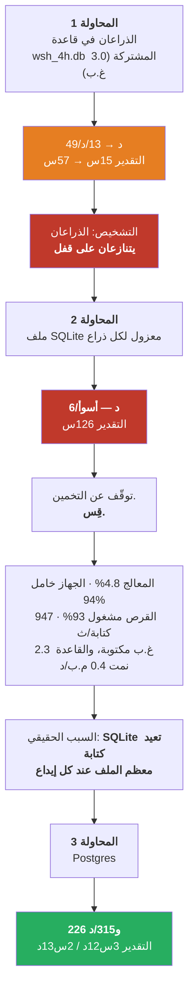
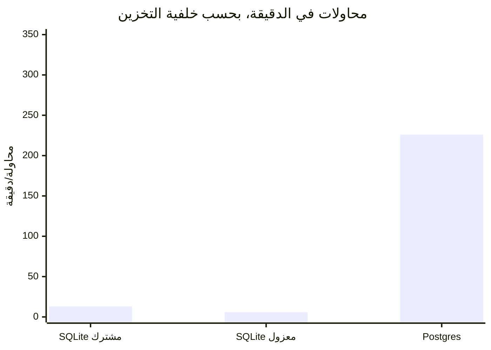

# احتاج تشغيل اختبار واحد ثلاث محاولات — ماذا حدث، وما الذي يعلّمنا إيّاه

---

## 1. ما الذي أردنا فعله، ولماذا

### القرار الأصلي (المسألة ‎#97‎)

سأل سؤال سابق: هل يمكن حذف مفتاح التشغيل/الإطفاء لكلٍّ من المؤشرات الـ165، بجعل **قيمة المؤشر نفسها**
تعني «مطفأ»؟ **قِيس ذلك ودُحض** — إذ بقي 93% من المكتبة مشتغلًا بشكل دائم.

لكن البحث في المسألة كشف شيئًا آخر. المُحسِّن يختار إعدادات **كل المؤشرات الـ165 في كل محاولة**، بما فيها
تلك التي أطفأها للتوّ. والمحاولة النموذجية فيها نحو 56 مشتغلًا من 165، أي أن **قرابة ثلثي الإعدادات التي
يختارها لا يقرؤها شيء إطلاقًا**.

والحلّ — أن تُسحب إعدادات المؤشر فقط حين يكون مشتغلًا — يُسمّى **المعاملات الشرطية**. بُني الحلّ، وشُحن
**مطفأً افتراضيًّا**.

### لماذا شُحن مطفأً — وهذا هو الجزء المهم

ثلاثة أمور كانت مُثبتة أصلًا:

| | |
|---|---|
| الاستراتيجية متطابقة | إعدادات المؤشر المطفأ لا تُقرأ أبدًا، فاستبدالها بالقيم الافتراضية لا يغيّر صفقة واحدة — مُثبت باختبار، لا مُدّعى |
| أسرع | ‎−30%‎ في الزمن، و‎−34%‎ في الإعدادات المختارة، على تشغيلتين متطابقتين بـ800 محاولة |
| الانتقاء بلا تغيير | على 400 محاولة دفع المؤشرات المشتغلة من 83.4 إلى 56.3، مقابل 83.5 إلى 53.1 للسلوك الحالي |

**وأمر واحد لم يكن مُثبتًا.** المُحسِّن خوارزم جيني: يأخذ محاولتين جيدتين ويمزج أرقامهما لإنتاج محاولة
جديدة. وحين تحمل كل محاولة القائمة نفسها من الإعدادات، يكون المزج تقابلًا نظيفًا واحدًا بواحد. **ومع
السحب الشرطي قد يحمل الأبوان قائمتين مختلفتَي الطول** — وهل يصير المزج *أسوأ* بسبب ذلك؟ لم يُقَس قط.

> **و30% من التسريع ليست سببًا لتغيير طريقة تناسل الحلول بناءً على الثقة.**

فكان القرار: **اشحنه، وأبقِه مطفأً، وشغّل اختبارًا صحيحًا.** وذلك الاختبار هو المسألة ‎#99‎، وهو ما كانت
محاولات الإطلاق الثلاث تحاول تشغيله.

---

## 2. ما هو الاختبار

ذراعان، متطابقان في كل شيء إلا خيارًا واحدًا:

| | |
|---|---|
| الأداة / الإطار الزمني | NQ 4h |
| ما يُبحث فيه | تجمّع الاستراتيجية فقط — 466 بُعدًا |
| الميزانية | **46,600 محاولة لكل ذراع** — أي 100 محاولة لكل بُعد بالتمام |
| الفارق | ذراع يستعمل `--conditional-params`، والآخر لا |

وقد **كُتب المعيار قبل وجود أي نتائج**: لا يُعتمد افتراضيًّا إلا إذا لم تُظهر جودة البحث تدهورًا جوهريًّا
*و* بقي سلوك الانتقاء بلا تغيير. والتسريع وحده لا يكفي.

---

## 3. ما الذي حدث — ثلاث محاولات إطلاق

### المحاولة 1 — الذراعان في قاعدة بيانات واحدة مشتركة

أُطلقت في قاعدة البيانات الافتراضية للإطار الزمني، `wsh_4h.db`، وكانت **تحتوي أصلًا 3.0 غيغابايت من
دراسات أخرى**. بدأت عند نحو 49 محاولة/دقيقة ثم انخفضت:

| الوقت | المستطيلي | الشرطي | التقدير |
|---|---:|---:|---:|
| 14:33 | 42.7/د | 68.1/د | 18س |
| 14:39 | 49.0/د | 57.8/د | 15س |
| 15:10 | 20.8/د | 29.0/د | 36س |
| 15:11 | **13.1/د** | **22.7/د** | **57س** |

**تشخيصي: الذراعان يكتبان في ملف SQLite واحد ويعرقل كلٌّ منهما الآخر على الأقفال.** وكان تشخيصًا معقولًا
— بل إن هذا المستودع يحوي تقرير حادثة من حزيران/يونيو تسبّب فيه تنازع أقفال SQLite بتجويع إطارَين زمنيَّين
في مسح سابق.

### المحاولة 2 — قاعدة بيانات معزولة لكل ذراع

الحلّ البديهي لتنازع الأقفال: أعطِ كل ذراع ملفه الخاص. الكلفة: نحو 50 دقيقة من التقدّم أُلقيت.

**فصار أسوأ. 6.1 محاولة/دقيقة. التقدير 126 ساعة.**

وهذه هي اللحظة المهمّة. الإصلاح الذي يجعل الأمور **أسوأ** ليس إصلاحًا ناجحًا جزئيًّا — **بل هو برهان على
أن التشخيص كان خاطئًا**. فلو كان الذراعان يتنازعان فعلًا، لما أمكن لفصلهما أن يبطّئهما.

---

## 4. كيف اكتُشف السبب الحقيقي

بدلًا من التخمين مرة ثالثة، قِيست ستة أشياء.

| القياس | القراءة | ما الذي يستبعده |
|---|---|---|
| المعالج لكل عملية | **4.8%** من نواة واحدة | ليس محدودًا بالحوسبة |
| خمول الجهاز | **94.5%**، والانتظار على الإدخال/الإخراج 4.9% | ليس تنازعًا على الأنوية — وهو تفسيري **الأول** للمستخدم، وكان خاطئًا أيضًا |
| إشغال القرص NVMe | **93% مشغول**، 947 كتابة/ثانية | القرص هو عنق الزجاجة |
| على ماذا كانت العمليتان محجوبتين | `submit_bio_wait`، `jbd2_log_wait_commit` | انتظار **إيداعات السجل**، أي كتابات قاعدة البيانات |
| البايتات المكتوبة لكل عملية | **2.3 غيغابايت في 22 دقيقة** (~104 م.ب/دقيقة) | حجم كتابة هائل |
| نموّ قاعدة البيانات | **200 كيلوبايت كل 30 ثانية** (~0.4 م.ب/دقيقة) | **البيانات لا تنمو — بل يُعاد كتابتها** |

### الزوج الحاسم

اقرأ آخر صفَّين معًا:

> **كتابة 104 ميغابايت في الدقيقة داخل قاعدة تنمو 0.4 ميغابايت في الدقيقة.**

أي نسبة نحو **260 إلى 1**. فلكل ميغابايت من المعلومات الجديدة، كان يُدفَع إلى القرص 260 ميغابايت.

هذا هو **تضخيم الكتابة**. فـSQLite تحمي الإيداع بنسخ الصفحات التي ستغيّرها أولًا إلى ملف سجلّ، ثم تكتب
الصفحات، ثم تحذف السجلّ. ومع إيداعات متكررة على قاعدة بهذا الشكل، ينتهي كل إيداع بإعادة كتابة جزء كبير من
الملف. فيتشبّع القرص عند 93% بينما تجلس المعالجات خاملة عند 94%.

**والأهم أن هذا لا علاقة له بالذراعين إطلاقًا.** عملية واحدة وحدها كانت ستصطدم بالجدار نفسه. ولهذا لم
يُحدث عزلهما فرقًا — بل قد يكون **أسوأ**، لأن ملفَّين جديدَين يعنيان سجلَّين منفصلَين يُعاد كتابتهما من
الصفر.

### لماذا لم يظهر أي خطأ

لم يفشل شيء. لا استثناء، ولا تحذير، ولا خطأ قفل في أيٍّ من السجلّين. **فـSQLite لا تفشل تحت هذا الحمل —
بل تنتظر.** وببساطة صارت التشغيلة أبطأ فأبطأ وهي تُبلغ عن صحة تامة.

> **هذا هو نمط الفشل الذي يستحق أن يُستوعب: النظام لم يكن معطّلًا، بل كان مخنوقًا — والنظام المخنوق يبدو
> تمامًا كالنظام السليم، لكن متأخّرًا.**

---

## 5. الإصلاح، والمقارنة

كانت هناك حاوية PostgreSQL تعمل على ذلك الجهاز منذ أحد عشر يومًا. وهي الخلفية الموثّقة للتخزين في هذا
المشروع، وتُختار بمتغيّر بيئة واحد — `WSH_STORAGE_URL` — كان المُحسِّن يعرف قراءته أصلًا.

وPostgres لا تعاني هذه المشكلة: فهي تستعمل سجلّ كتابة مسبقة، فيُلحق الإيداع سجلًّا صغيرًا بدل إعادة كتابة
الصفحات، وهي مبنيّة لكُتّاب متزامنين كثيرين.

| | المحاولة 2 (SQLite) | المحاولة 3 (Postgres) | التغيّر |
|---|---:|---:|---|
| المعالج لكل عملية | 4.8% | **77.8%** | **عمل أكثر بـ16×** |
| إشغال القرص | 93% | **2.5%** | لم يعد القرص عنق الزجاجة |
| محاولات/دقيقة — المستطيلي | 6.1 | **~226** | **37×** |
| محاولات/دقيقة — الشرطي | 8.7 | **~315** | **36×** |
| التقدير | 126 ساعة | **3س 12د** | |

ولم تكن محاولتا SQLite أقلّ كفاءة قليلًا فحسب. **بل كانتا الفرق بين تشغيلة من خمسة أيام وأخرى من ثلاث
ساعات.**

---

## 6. ما الذي يعلّمنا إيّاه هذا

### 6.1 الإصلاح الذي يزيد الأمر سوءًا قد أخبرك بشيء

الغريزة بعد المحاولة 2 هي تجريب تخمين ثالث. أما الانضباط فهو معاملة الفشل بوصفه **معلومة**: فصل الذراعين
ما كان ليساعد إلا *لو كان الذراعان هما المشكلة*، فتبيّن أنهما ليسا كذلك. وهذا الاستنتاج وحده هو ما حوّل
التحقيق من «من يتنازع مع من» إلى «على ماذا تنتظر هذه العملية فعلًا».

### 6.2 قِس المورد، لا العَرَض

«إنه بطيء» ليس تشخيصًا. والأسئلة المفيدة ضيّقة، وكلٌّ منها يستبعد شيئًا:

- هل **المعالج** مشغول؟ *(لا — 4.8%.)* ← ليست الحوسبة
- هل **الجهاز** مشغول؟ *(لا — خامل 94%.)* ← ليس تنازعًا على الأنوية
- هل **القرص** مشغول؟ *(نعم — 93%.)* ← وُجد المورد
- **على ماذا** ينتظر؟ *(`jbd2_log_wait_commit`.)* ← إيداعات السجل
- **كم** يُكتب مقابل ما يُخزَّن؟ *(104 م.ب/د مقابل 0.4 م.ب/د.)* ← **تضخيم الكتابة**

خمسة أسئلة رخيصة، بترتيبها، حلّت محلّ تخمينين مكلفين.

### 6.3 النسبة هي الاكتشاف، لا أيٌّ من الرقمين

‏104 م.ب/دقيقة تبدو برنامجًا مشغولًا. و0.4 م.ب/دقيقة تبدو برنامجًا هادئًا. **ولا يعني أيٌّ منهما شيئًا
وحده.** وحين يوضعان جنبًا إلى جنب يقولان: «هذا النظام يبذل 260 وحدة عمل ليخزّن وحدة نتيجة واحدة» — وهو ما
يسمّي المشكلة بدقّة تكفي لإصلاحها.

### 6.4 الصمت ليس صحّة

عملت محاولتا SQLite دون خطأ واحد. ولولا تتبّع الزمن المقدَّر، لكان التقرير الصادق عند الساعة السادسة هو
*«تعمل بشكل طبيعي»* — ولكان خاطئًا لخمسة أيام أخرى.

**ولهذا تحديدًا يوجد المراقِب**، ولهذا يُبلغ عن معدّل مقيس على **آخر نافذة** لا عن متوسّط منذ الإطلاق.
فالمتوسّط كان سيخفي الانحدار: تشغيلة تبدأ عند 49/د وتهبط إلى 13/د تُظهر متوسّطًا مريحًا لساعات.

### 6.5 المراقبة يجب أن تنجو من الإصلاح

انكسر المراقِب **ثلاث مرات** خلال هذه الحادثة، وكان كل انكسار يبدو وكأن التشغيلة ماتت:

| ما الذي تغيّر | ماذا فعل المراقِب |
|---|---|
| انتقال الدراسات إلى ملفات معزولة | أبلغ `NOT FOUND` عن تشغيلتين سليمتين |
| انتقال الدراسات إلى Postgres | انهار — لأنه افترض SQLite |
| موقع Postgres نصّ عرضي لا رابط | بنى `sqlite:///127.0.0.1:55432/wsh` وفشل |

أُصلح كلٌّ منها، لكن الدرس عام: **المراقِب الذي يموت حين يتغيّر شكل ما يراقبه ليس مراقِبًا**، ورسالة
`NOT FOUND` هي أخطر ما يمكن أن يُصدره، لأنها تُقرأ موتًا بينما تعني عمًى.

---

## 7. ما الذي **لم** يتغيّر

يستحق القول صراحةً، لأن حادثة بنية تحتية قد تلوّث تجربةً بصمت:

- **السؤال لم يُمَس.** هل يضرّ السحب الشرطي بمزج الخوارزم الجيني؟
- **المعيار لم يُمَس**، وقد كُتب قبل وجود أي نتائج.
- **المقارنة ما زالت عادلة.** فقد عمل الذراعان دائمًا في ظروف متطابقة — القاعدة المشتركة نفسها في
  المحاولة 1، والعزل نفسه في المحاولة 2، وPostgres نفسها الآن. وعنق الزجاجة أبطأ **كلا** الذراعين، ولم
  يحابِ أحدهما قط.
- **لم تُنقَذ أي نتيجة من المحاولتين الفاشلتين.** أُلقيت كلتاهما وأُعيد البدء من الصفر. فذراع مكتمل جزئيًّا
  يُقارَن بذراع كامل لا قيمة له.

الشيء الوحيد الذي تغيّر هو أن اختبارًا كان سيستغرق خمسة أيام صار يستغرق ثلاث ساعات.

---

## 8. أين يقف الأمر

في الساعة 15:52 من الإطلاق الثالث:

| الذراع | المحاولات | مكتملة | مُستبعَدة | المعدّل | التقدير |
|---|---:|---:|---:|---:|---:|
| المستطيلي | 3,217 / 46,600 | 10 | 3,206 | 225.6/د | 3س 12د |
| الشرطي | 4,547 / 46,600 | 19 | 4,527 | 315.0/د | 2س 13د |

كلاهما سليم، وكلاهما عند 78% من المعالج، والمعدّل ثابت لا منحدر.

**وثمة تحفّظ ظاهر أصلًا.** نحو 99.6% من المحاولات تُستبعَد مبكرًا، فالميزانية الكاملة تُسقِط إلى نحو
**145 و195 محاولة مكتملة** — توزيع حقيقي للمقارنة، لكنه رفيع. وإن تبيّن أنه أرفع من أن يفصل بين الذراعين،
فالجواب الصادق هو *«هذه الميزانية لا تستطيع الحسم»* لا إصدار حُكم. وهذا الاحتمال يُعلَن الآن، لا بعد وقوعه.

ويُبلغ المراقِب كل 15 دقيقة، ويشغّل المقارنة الكاملة المُسجَّلة مسبقًا تلقائيًّا حين ينتهي الذراعان.
