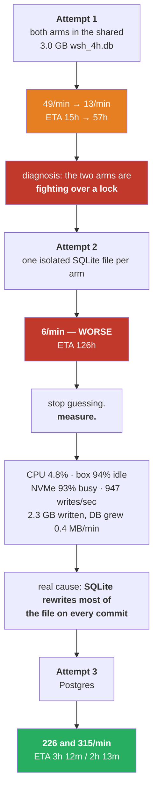
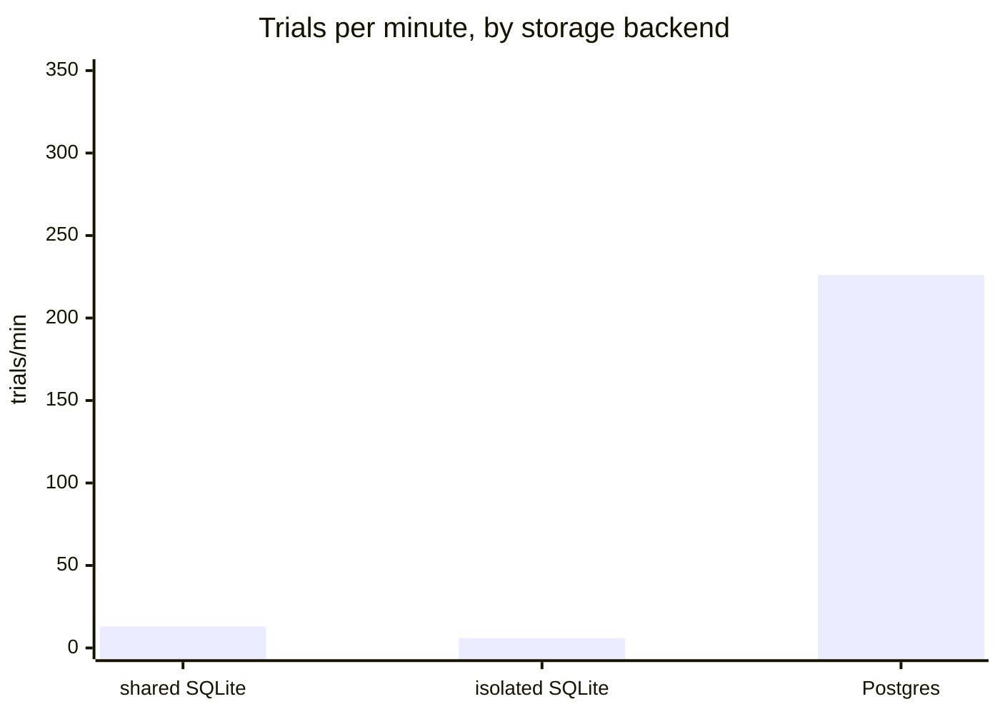

# It took three launches to run one test — what happened, and what it teaches

---

## 1. What we set out to do, and why

### The original decision (issue #97)

An earlier question asked whether the on/off switch for each of the 165 indicators could be deleted, by
letting the indicator's own value mean "off". **That was measured and refuted** — 93% of the library
stayed permanently on.

But investigating it surfaced something else. The optimizer picks settings for **all 165 indicators on
every trial**, including the ones it just switched off. A typical trial has ~56 of 165 switched on, so
**roughly two-thirds of the settings it chooses are never read by anything.**

The fix — draw an indicator's settings only when it is switched on — is called **conditional
parameters**. It was built, and it was shipped **switched off by default**.

### Why it shipped switched off — this is the important part

Three things were already proven:

| | |
|---|---|
| the strategy is identical | a switched-off indicator's settings are never read, so substituting defaults cannot change a single trade — proven by a test, not asserted |
| it is faster | −30% wall clock, −34% settings chosen, on two matched 800-trial runs |
| selection is unchanged | over 400 trials it drove switched-on indicators 83.4 → 56.3, against 83.5 → 53.1 for today's behaviour |

**And one thing was not proven.** The optimizer is a genetic algorithm: it takes two good trials and
mixes their numbers to make a new one. When every trial carries the same list of settings, that mixing
is a clean one-for-one pairing. **With conditional drawing, two parents can carry different-length
lists** — and whether the mixing gets *worse* because of that has never been measured.

> **A 30% speed-up is not a reason to change how the search breeds solutions on faith.**

So the decision was: **ship it, keep it off, and run a proper test.** That test is issue #99, and it is
what these three launches were trying to run.

---

## 2. What the test is

Two arms, identical in every way except one flag:

| | |
|---|---|
| instrument / timeframe | NQ 4h |
| what is searched | the strategy pool only — 466 dimensions |
| budget | **46,600 trials per arm** — a full 100 trials per dimension |
| difference | one arm uses `--conditional-params`, the other does not |

The criterion was **written down before any results existed**: adopt as default only if search quality
shows no material degradation *and* selection behaviour is unchanged. A speed-up alone does not carry it.

---

## 3. What went wrong — three launches

### Attempt 1 — both arms in one shared database

Launched into the default per-timeframe database, `wsh_4h.db`, which **already held 3.0 GB of other
studies**. It started at ~49 trials/minute and then fell:

| time | rectangular | conditional | ETA |
|---|---:|---:|---:|
| 14:33 | 42.7/min | 68.1/min | 18h |
| 14:39 | 49.0/min | 57.8/min | 15h |
| 15:10 | 20.8/min | 29.0/min | 36h |
| 15:11 | **13.1/min** | **22.7/min** | **57h** |

**My diagnosis: the two arms were writing to one SQLite file and blocking each other on locks.** It was
plausible — this repository even has an incident report from June where SQLite lock contention starved
two timeframes in an earlier sweep.

### Attempt 2 — one isolated database per arm

The obvious fix for lock contention: give each arm its own file. Cost: ~50 minutes of progress thrown
away.

**It got worse. 6.1 trials/minute. ETA 126 hours.**

This is the moment that matters. A fix that makes things *worse* is not a partially-successful fix —
**it is proof that the diagnosis was wrong.** If the arms had been fighting each other, separating them
could not have slowed them down.

---

## 4. How the real cause was found

Instead of guessing a third time, six things were measured.

| measurement | reading | what it rules out |
|---|---|---|
| CPU per process | **4.8%** of one core | not compute-bound |
| box idle | **94.5%**, iowait 4.9% | not competing for cores — my *first* explanation to the user, also wrong |
| NVMe utilisation | **93% busy**, 947 writes/sec | the disk is the bottleneck |
| what the processes were blocked in | `submit_bio_wait`, `jbd2_log_wait_commit` | waiting on **journal commits**, i.e. database writes |
| bytes written per process | **2.3 GB in 22 minutes** (~104 MB/min) | enormous write volume |
| database growth | **200 KB per 30 seconds** (~0.4 MB/min) | **the data is not growing — it is being rewritten** |

### The decisive pair

Read the last two rows together:

> **Writing 104 MB per minute into a database that grows by 0.4 MB per minute.**

That is a ratio of about **260 to 1**. For every megabyte of new information, 260 megabytes were being
pushed to disk.

That is **write amplification**. SQLite protects a commit by first copying the pages it is about to
change into a journal file, then writing the pages, then deleting the journal. With frequent commits
against a database of this shape, each commit ends up rewriting a large fraction of the file. The disk
saturates at 93% while the CPUs sit idle at 94%.

**Crucially, this has nothing to do with the two arms.** One process alone would have hit the same wall.
That is why isolating them made no difference — and why it could actually be *worse*, since two fresh
files meant two separate journals both being rewritten from scratch.

### Why no error appeared

Nothing failed. No exception, no warning, no lock error in either log. **SQLite does not fail under this
load — it waits.** The run simply got slower and slower while reporting perfect health.

> **This is the failure mode worth internalising: the system was not broken, it was throttled — and a
> throttled system looks exactly like a working one, only later.**

---

## 5. The fix, and the comparison

A PostgreSQL container had been running on that machine for eleven days. It is the documented storage
backend for this project, selected with a single environment variable — `WSH_STORAGE_URL` — which the
optimizer already knew how to read.

Postgres does not have this problem: it uses a write-ahead log, so a commit appends a small record
instead of rewriting pages, and it is built for many concurrent writers.

| | attempt 2 (SQLite) | attempt 3 (Postgres) | change |
|---|---:|---:|---|
| CPU per process | 4.8% | **77.8%** | **16× more work done** |
| NVMe utilisation | 93% | **2.5%** | disk no longer the bottleneck |
| trials/minute — rectangular | 6.1 | **~226** | **37×** |
| trials/minute — conditional | 8.7 | **~315** | **36×** |
| ETA | 126 h | **3h 12m** | |

The two SQLite attempts were not slightly suboptimal. **They were the difference between a five-day run
and a three-hour one.**

---

## 6. What this teaches

### 6.1 A fix that makes things worse has told you something

The instinct after attempt 2 is to try a third guess. The discipline is to treat the failure as
**information**: separating the arms could only have helped *if the arms were the problem*, so they were
not. That single inference is what redirected the investigation from "who is fighting whom" to "what is
this process actually waiting on".

### 6.2 Measure the resource, not the symptom

"It is slow" is not a diagnosis. The useful questions are narrow and each one eliminates something:

- Is the **CPU** busy? *(No — 4.8%.)* → not compute
- Is the **box** busy? *(No — 94% idle.)* → not competition for cores
- Is the **disk** busy? *(Yes — 93%.)* → found the resource
- **What** is it waiting on? *(`jbd2_log_wait_commit`.)* → journal commits
- **How much** is being written vs stored? *(104 MB/min vs 0.4 MB/min.)* → **write amplification**

Five cheap questions, asked in order, replaced two expensive guesses.

### 6.3 The ratio was the finding, not either number

104 MB/min looks like a busy program. 0.4 MB/min looks like a quiet one. **Neither number means anything
alone.** Put side by side they say "this system is doing 260 units of work to store 1 unit of result",
which names the problem precisely enough to fix it.

### 6.4 Silence is not health

Both SQLite attempts ran without a single error. Had the ETA not been tracked, the honest report at hour
six would have been *"running normally"* — and it would have been wrong for five more days.

**This is exactly why the watcher exists**, and why it reports a rate measured over the *last window*
rather than an average since launch. An average would have hidden the decay: a run that starts at 49/min
and falls to 13/min still shows a comfortable average for hours.

### 6.5 Monitoring must survive the fix

The watcher broke **three times** during this incident, and every failure looked like the run had died:

| what changed | what the watcher did |
|---|---|
| studies moved to isolated files | reported `NOT FOUND` for two healthy runs |
| studies moved to Postgres | crashed — it assumed SQLite |
| Postgres location is a display string | built `sqlite:///127.0.0.1:55432/wsh` and failed |

Each was fixed, but the lesson generalises: **a monitor that dies when the thing it monitors changes
shape is not a monitor**, and `NOT FOUND` is the most dangerous message it can emit, because it reads as
death when it means blindness.

---

## 7. What did NOT change

Worth stating plainly, because an infrastructure incident can quietly contaminate an experiment:

- **The question is untouched.** Does conditional drawing harm the genetic algorithm's mixing?
- **The criterion is untouched**, and was written down before any results existed.
- **The comparison is still fair.** Both arms always ran under identical conditions — the same shared
  database in attempt 1, the same isolation in attempt 2, the same Postgres now. The bottleneck slowed
  *both* arms; it never favoured one.
- **No result was salvaged from the failed attempts.** Both were discarded and restarted from zero. A
  partially-completed arm compared against a full one would be worthless.

The only thing that changed is that a test which would have taken five days now takes three hours.

---

## 8. Where it stands

As of 15:52 on the third launch:

| arm | trials | complete | pruned | rate | ETA |
|---|---:|---:|---:|---:|---:|
| rectangular | 3,217 / 46,600 | 10 | 3,206 | 225.6/min | 3h 12m |
| conditional | 4,547 / 46,600 | 19 | 4,527 | 315.0/min | 2h 13m |

Both healthy, both at 78% CPU, rate holding rather than decaying.

**One caveat already visible.** About 99.6% of trials are being discarded early, so the full budget
projects to roughly **145 and 195 completed trials** — a real distribution to compare, but a thin one. If
it turns out too thin to separate the arms, the honest answer is *"this budget cannot decide it"* rather
than a verdict. That possibility is being flagged now, not after the fact.

A watcher reports every 15 minutes and runs the full pre-registered comparison automatically when both
arms finish.
