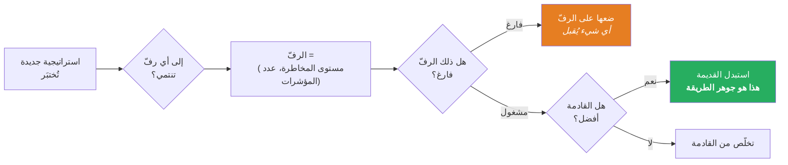
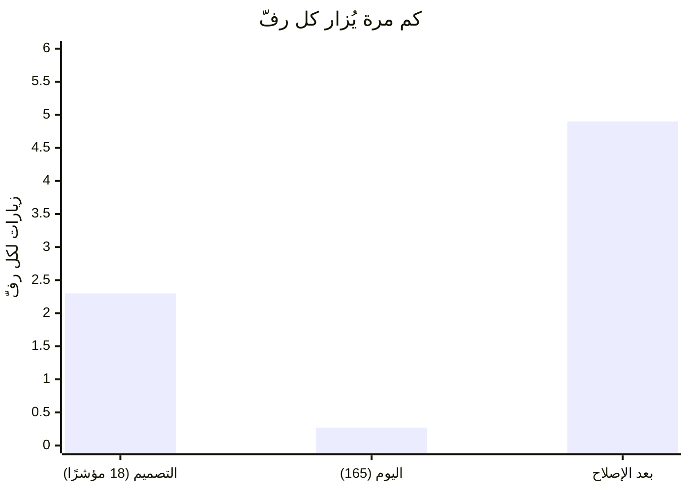
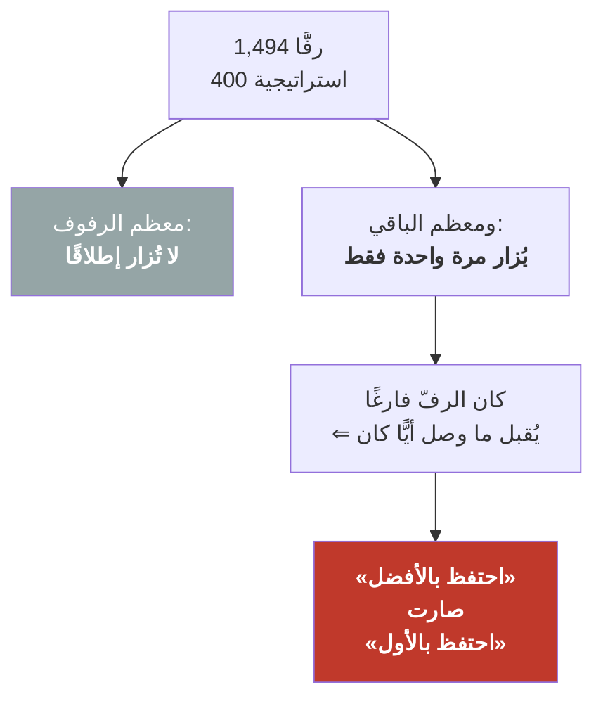
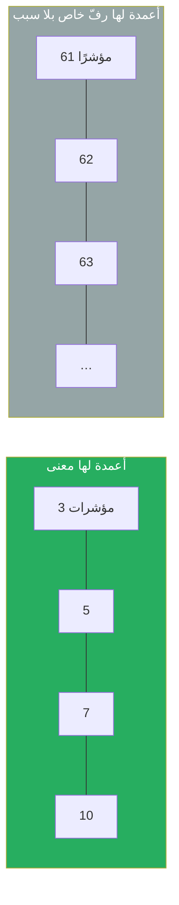
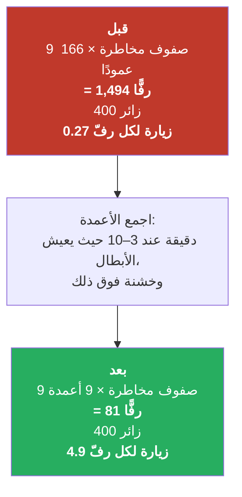
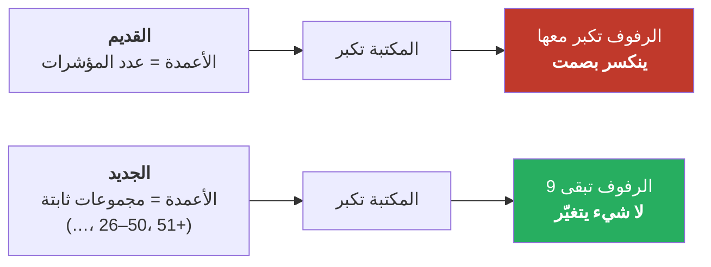
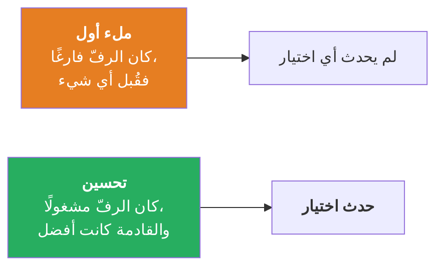
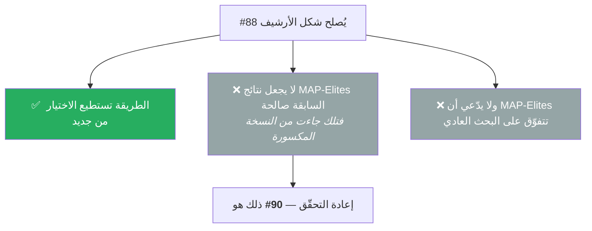

# ‎#88‎ — خزانة العرض ذات الرفوف الكثيرة جدًّا

*بلغة مبسّطة، والصورة أولًا. النسخة الإنجليزية: `ISSUE-88-explained-visually.md`*

---

## 1. ما الذي تحاول MAP-Elites فعله

تخيّل **خزانة عرض**. كل رفّ فيها محجوز لـ**نوع** واحد من الاستراتيجيات.

ويُختار الرفّ بأمرين:

- **مقدار المخاطرة** في الاستراتيجية (أسوأ هبوط لها)، و
- **عدد المؤشرات** التي تستعملها.

والقاعدة بسيطة: **كل رفّ يحمل أفضل استراتيجية واحدة من نوعه.**

**المربّع الأخضر هو الفكرة كلها.** فهو موضع اختيار «الأفضل». أما المربّع البرتقالي فمجرد ملء لفراغ — ولا
يحدث فيه أي اختيار.

---

## 2. المشكلة في صورة واحدة

للخزانة **9 صفوف للمخاطرة**. وعدد **الأعمدة** هو عدد المؤشرات التي يمكن أن تستعملها الاستراتيجية.

حين صُمّمت الطريقة كان هناك **18 مؤشرًا**، أي نحو 19 عمودًا:

| | 0 مؤشر | 1 | 2 | 3 | … | 18 |
|---|---|---|---|---|---|---|
| **مخاطرة 0** | 🟩 | 🟩 | 🟩 | 🟩 | … | 🟩 |
| **مخاطرة 1** | 🟩 | 🟩 | 🟩 | 🟩 | … | 🟩 |
| … | … | … | … | … | … | … |

**171 رفًّا. و400 استراتيجية تُختبَر.** فيُزار كل رفّ نحو **2–3 مرات**، أي أن سؤال «هل القادمة أفضل؟»
يُطرح فعلًا.

واليوم هناك **165 مؤشرًا**، أي **166 عمودًا**:

| | 0 مؤشر | 1 | 2 | … | 82 | … | 165 |
|---|---|---|---|---|---|---|---|
| **مخاطرة 0** | ⬜ | ⬜ | ⬜ | … | 🟩 | … | ⬜ |
| **مخاطرة 1** | ⬜ | ⬜ | ⬜ | … | 🟩 | … | ⬜ |
| … | … | … | … | … | … | … | … |

**1,494 رفًّا. وما زالت 400 استراتيجية.**

---

## 3. لماذا يكسر هذا الطريقة

مع **أقل من زيارة واحدة لكل رفّ**، يُملأ كل رفّ تقريبًا بـ**أول استراتيجية تصادف أن تصل إليه** — ولا
يعود أحد ليُنافسها.

**وهنا الضرر:** تظلّ الخزانة **تبدو** ممتلئة ومنظّمة. وتُقدَّم على أنها *«أفضل استراتيجية منخفضة
المخاطرة، وأفضل استراتيجية قليلة المؤشرات…»*. لكن لم تُقارَن أي واحدة بأي أخرى قط. لقد صارت **مجموعة من
الواصلين أولًا تحمل لافتة مجموعة من الأبطال.**

---

## 4. ولماذا معظم تلك الأعمدة عديم الفائدة أصلًا

انظر إلى ما تميّزه الأعمدة فعلًا.

**الاستراتيجيات التي تنشرها فعليًّا تستعمل من 3 إلى 10 مؤشرات.**

**هل استراتيجية بـ61 مؤشرًا **نوع** مختلف حقًّا عن استراتيجية بـ62؟** لا. لكن الخزانة تمنح كلًّا منهما
رفًّا خاصًّا، وكل رفّ من هذه يسرق زيارات من الرفوف التي تهمّ فعلًا.

---

## 5. الإصلاح — اجمع الأعمدة

بدل عمود لكل عدد بالضبط، نستعمل **مجموعات**، دقيقة حيث يهمّ الأمر وخشنة حيث لا يهمّ:

| المجموعة | 0 | 1–2 | 3–4 | 5–7 | 8–10 | 11–15 | 16–25 | 26–50 | 51+ |
|---|---|---|---|---|---|---|---|---|---|
| **لماذا** | لا شيء | قليل جدًّا | **منطقة الأبطال** | **منطقة الأبطال** | **منطقة الأبطال** | كثير | أكثر | كثير جدًّا | حشد |

**9 أعمدة بدل 166.**

ومع نحو 5 زيارات لكل رفّ، يُطرح سؤال **«هل القادمة أفضل؟»** مرارًا وتكرارًا — وهو السبب الوحيد لوجود
الطريقة أصلًا.

---

## 6. ويجب ألّا ينكسر مجددًا حين تكبر المكتبة

المكتبة انتقلت **15 ← 18 ← 143 ← 165**. وهذا النموّ هو ما كسر الأمر أول مرة.

فالمجموعة الأخيرة هي **«51 فأكثر»**، وهي مجموعة جامعة. وسواء حملت المكتبة 165 مؤشرًا أو 500، تبقى للخزانة
9 أعمدة.

---

## 7. كيف سأُثبت أنه نجح — لا أن أكتفي بالحجّة

عدّ الرفوف حساب بسيط. **أما الاختبار الحقيقي فهو: هل يحدث الاختيار فعلًا؟**

لذلك سيَعُدّ الأرشيف حدثين مختلفين:

| | قبل الإصلاح | بعد الإصلاح — التوقّع |
|---|---|---|
| الملء الأول | كل شيء تقريبًا | أقل بكثير |
| **التحسينات** | **شبه معدومة** | **نصيب معتبر** |

**وإن لم يرتفع عدد التحسينات، فالإصلاح لم ينجح** — وسأبلغ بذلك بدل الإشارة إلى حساب الرفوف وإعلان النصر.
وهذا مكتوب **قبل** التشغيل، فلا يمكن إعادة تفسيره بعده.

---

## 8. ما الذي **لا** يدّعيه هذا

فكل نتيجة من MAP-Elites قُبلت قبل هذا أنتجتها النسخة التي تحتفظ بالواصلين أولًا. وتلك النتائج **ليست
خاطئة — بل غير مُتحقَّق منها**، وهي حالة مختلفة وأكثر إحراجًا، وتُتابَع على حدة.

---

## 9. الأمر كله في سطر واحد

> **الخزانة التي رفوفها أكثر من قطعها تكفّ عن أن تكون مجموعةً للأفضل، وتصير مجموعةً للأول — وهي تبدو من
> الخارج كما هي تمامًا.**
