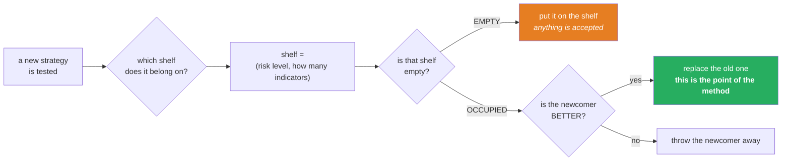
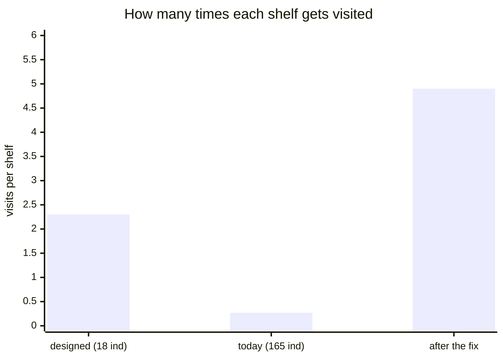
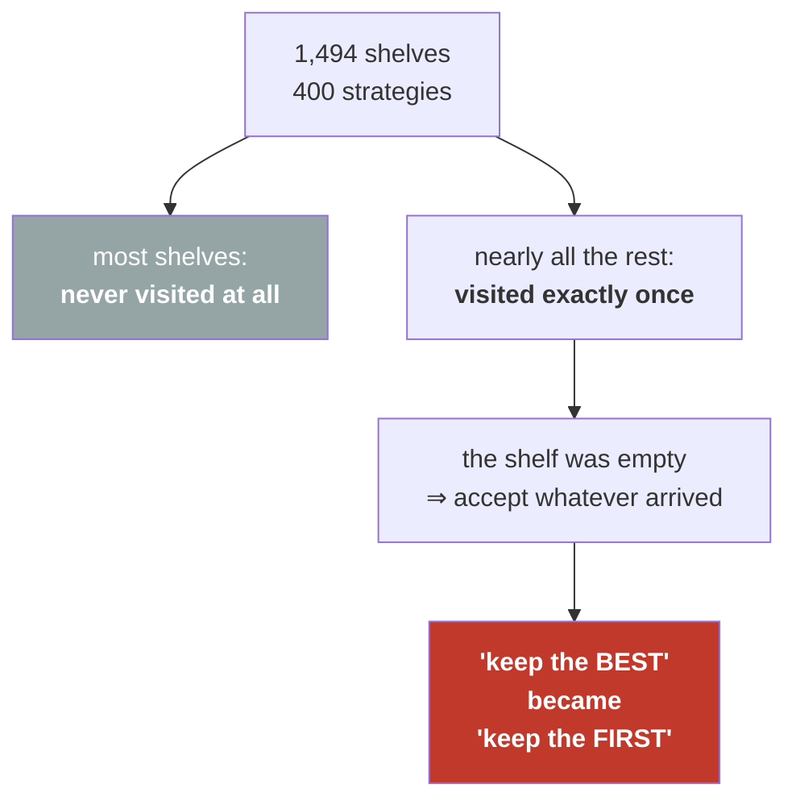
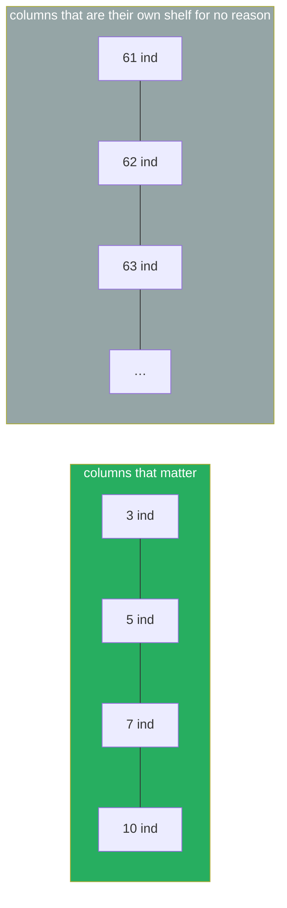
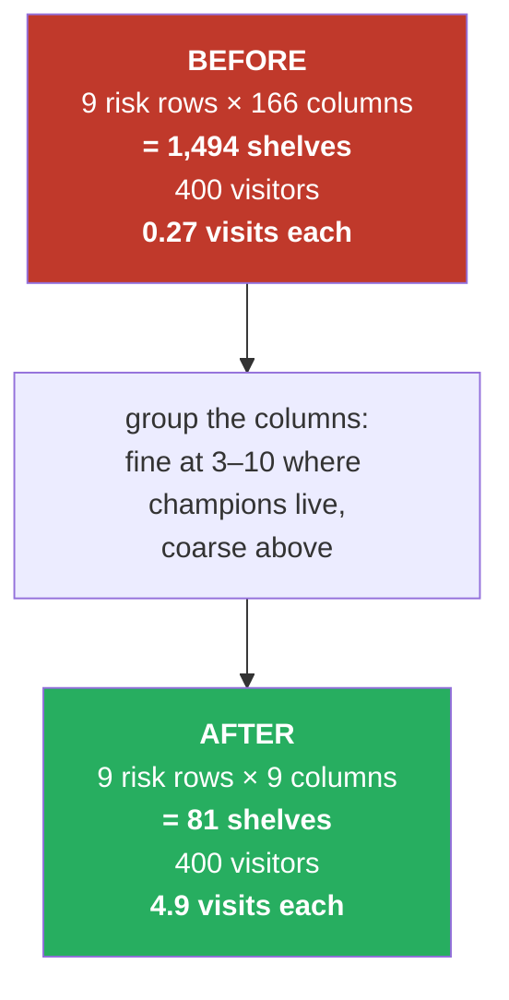
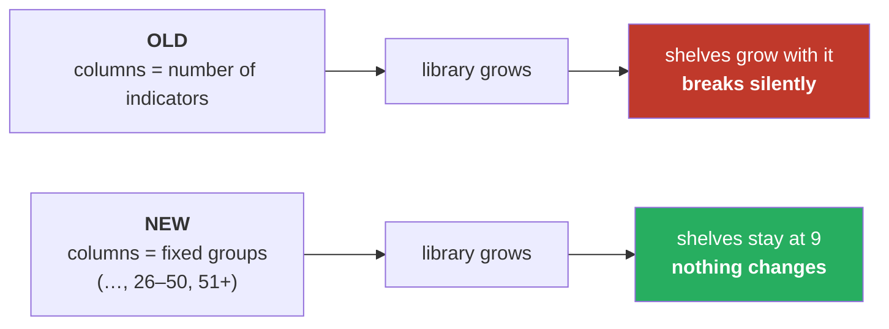
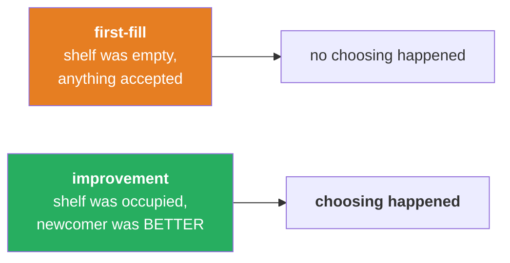
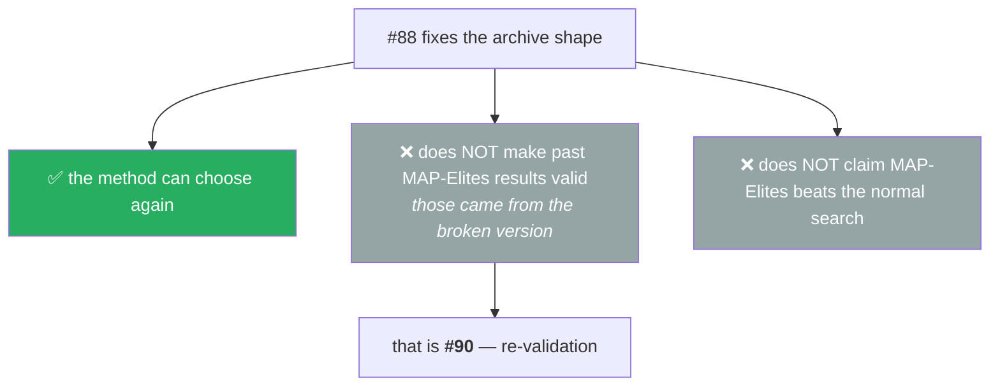

# #88 — the display cabinet with too many shelves

*Plain-language, picture-first. Arabic mirror: `ISSUE-88-explained-visually.ar.md`*

---

## 1. What MAP-Elites is trying to do

Imagine a **display cabinet**. Every shelf is reserved for one *kind* of strategy.

A shelf is chosen by two things:

- **how risky** the strategy is (its worst drawdown), and
- **how many indicators** it uses.

The rule is simple: **each shelf holds the single best strategy of that kind.**

**The green box is the whole idea.** It is where "the best" gets chosen. The orange box is just filling
an empty space — no choosing happens there.

---

## 2. The problem, in one picture

The cabinet has **9 risk rows**. The number of *columns* is the number of indicators a strategy can use.

When this was designed there were **18 indicators**, so ~19 columns:

| | 0 ind | 1 | 2 | 3 | … | 18 |
|---|---|---|---|---|---|---|
| **risk 0** | 🟩 | 🟩 | 🟩 | 🟩 | … | 🟩 |
| **risk 1** | 🟩 | 🟩 | 🟩 | 🟩 | … | 🟩 |
| … | … | … | … | … | … | … |

**171 shelves. 400 strategies get tested.** Every shelf gets visited about **2–3 times**, so the
"is the newcomer better?" question actually gets asked.

Today there are **165 indicators**, so **166 columns**:

| | 0 ind | 1 | 2 | … | 82 | … | 165 |
|---|---|---|---|---|---|---|---|
| **risk 0** | ⬜ | ⬜ | ⬜ | … | 🟩 | … | ⬜ |
| **risk 1** | ⬜ | ⬜ | ⬜ | … | 🟩 | … | ⬜ |
| … | … | … | … | … | … | … | … |

**1,494 shelves. Still 400 strategies.**

---

## 3. Why that breaks the method

With **less than one visit per shelf**, almost every shelf is filled by **the first strategy that
happens to land on it** — and nothing ever comes back to challenge it.

**This is the damage:** the cabinet still *looks* full and well-organised. It is still presented as
*"the best low-risk strategy, the best few-indicator strategy…"*. But nothing was ever compared to
anything. It became **a collection of first arrivals wearing the label of a collection of champions.**

---

## 4. Why so many columns are useless anyway

Look at what the columns actually distinguish.

**The strategies you actually deploy use 3 to 10 indicators.**

**Is a 61-indicator strategy a meaningfully different *kind* of thing from a 62-indicator one?** No. But
the cabinet gives each its own shelf, and each shelf steals visits from the ones that matter.

---

## 5. The fix — group the columns

Instead of one column per exact count, use **groups**, fine where it matters and coarse where it does
not:

| group | 0 | 1–2 | 3–4 | 5–7 | 8–10 | 11–15 | 16–25 | 26–50 | 51+ |
|---|---|---|---|---|---|---|---|---|---|
| **why** | none | very few | **champion zone** | **champion zone** | **champion zone** | many | lots | very many | crowd |

**9 columns instead of 166.**

With ~5 visits per shelf, the **"is the newcomer better?"** question gets asked again and again — which
is the entire reason the method exists.

---

## 6. It must not break again next time the library grows

The library went **15 → 18 → 143 → 165**. That growth is what broke this in the first place.

The last group is **"51 or more"**, a catch-all. Whether the library holds 165 indicators or 500, the
cabinet still has 9 columns.

---

## 7. How I will prove it worked — not just argue it

Counting shelves is arithmetic. **The real test is whether choosing actually happens.**

So the archive will count two different events:

| | before the fix | after the fix — the prediction |
|---|---|---|
| first-fills | almost everything | far fewer |
| **improvements** | **almost none** | **a healthy share** |

**If the improvement count does not rise, the fix did not work** — and I will report that instead of
pointing at the shelf arithmetic and declaring victory. This is written down before the run, so it
cannot be reinterpreted afterwards.

---

## 8. What this does *not* claim

Every MAP-Elites result accepted before this was produced by the version that kept first arrivals. Those
results are **not wrong — they are unvalidated**, which is a different and more awkward status, and it
is tracked separately.

---

## 9. The whole thing in one line

> **A cabinet with more shelves than items stops being a collection of the best and becomes a collection
> of the first — while looking exactly the same from the outside.**

---

## 10. What happened when it was measured (2026-08-03)

**The test in §7 was the wrong test, and it took two failures to see it.**

| round | what was counted | result |
|---|---|---|
| 1 | improvements ≥ 2× | **failed** — 1 of 8 seeds |
| 2 | improvements ≥ 2×, 10× the budget | **failed, and inverted** — the broken cabinet scored **2.5× MORE** |
| 3 | **how good the strategies on the shelves actually are** | **passed — 8 of 8** |

Why round 2 inverted, in one line:

> **A cabinet of junk is easy to improve on. A cabinet of genuinely good items is hard to improve on.**

So counting improvements *rewards* the broken cabinet. The counter went up as the thing got worse — not
a weak measurement, a wrong one.

### The number that settles it

The run is *handed* a strategy before it starts — the current champion, worth **$23,328**.

| | best strategy found in the part of the cabinet that matters |
|---|---|
| **broken cabinet** | **exactly the champion it started with, in 5 of 8 runs** |
| **fixed cabinet** | beat it in **8 of 8**, by **+23%** |

> **The broken cabinet spent 4,000 tries and handed back the strategy it was given** — while looking
> busy the whole time: 260 shelves filled, 299 "improvements" logged.

### Two corrections to this page

- **"4.9 visits per shelf" was optimistic.** It assumed every try reaches a shelf. **68% never do** —
  they lose money, barely trade, or drop too hard. The real figure is **1.46**. Still above the 1.0 that
  matters (the old cabinet achieved **0.08**), but the honest number is lower than the one drawn above.
- **§7's promise was kept, twice.** The criterion failed and was reported as failed both times. The
  third criterion was written down and committed *before* its run, so it could not be chosen for
  passing.

Full detail: `../reports-2026-08-03/ISSUE-88-FINAL-round3.md`
