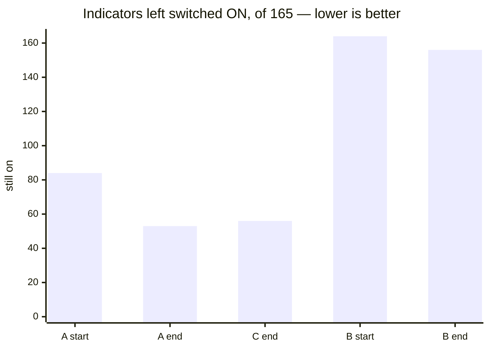
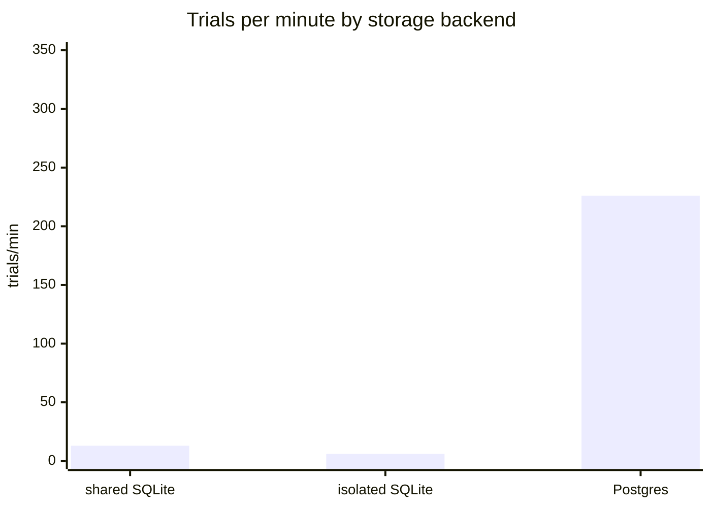
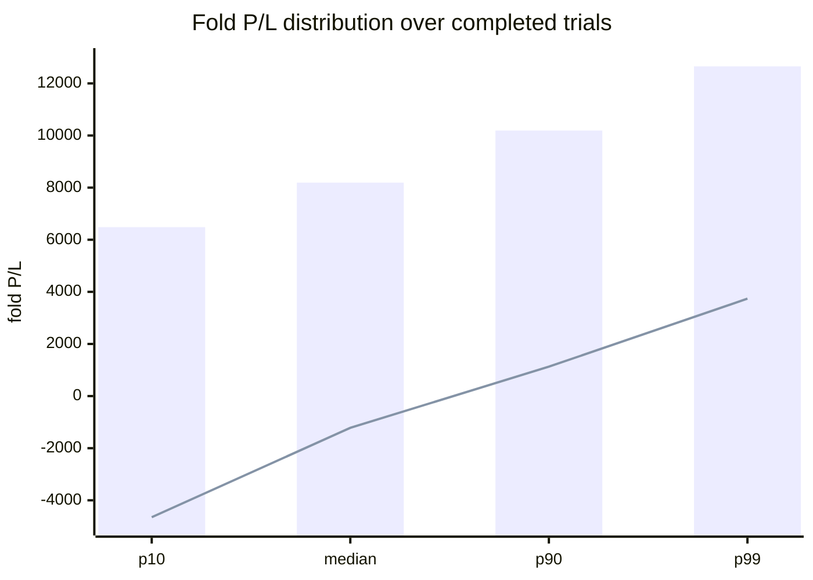

# Indicator-layer compression — complete experimental record

**The question:** the indicator layer is **460 of the strategy's 466 search dimensions** (165 on/off
switches + 295 parameters). Can it be compressed?

**The answer: no. Both proposals were tested and both were refuted.**

| proposal | verdict | why |
|---|---|---|
| **encode "off" inside a parameter value** | **REFUTED** | 93% of the library stays permanently switched on |
| **draw parameters only when switched on** | **REFUTED** | 26% faster, and it destroys the search |

---

## 0. Experiment index

Five experiments, ~94,000 optimizer trials, ~11 hours of server compute.

| # | experiment | scale | outcome |
|---|---|---|---|
| **1** | encoding reachability — 3 arms | 400 trials × 3 arms × 2 samplers | value-encoding refuted |
| **2** | strategy identity — unit tests | 6 assertions | conditional drawing is engine-invisible |
| **3** | matched speed runs | 800 trials × 2 arms | −30% wall clock, quality unmeasurable |
| **4** | infrastructure — 3 launch attempts | ~7,000 trials discarded | Postgres, 40× faster |
| **5** | **the decisive comparison** | **46,600 trials × 2 arms** | **conditional drawing refuted** |

---

## 1. Experiment 1 — can the search reach "off"?

### 1.1 Design

The proposal: delete the 165 on/off switches, and let an indicator's own first parameter mean "off"
when it sits at a sentinel value.

**This is a sampling question, not a profitability question** — it depends only on whether the search
can ever *reach* the off state. So no backtest was needed: run the production sampler over three
parameterisations and record how many indicators come out switched on per trial. Minutes, not days.

| arm | how "off" is expressed |
|---|---|
| **A — flags** | `en_<key>` categorical `[False, True]`; parameters always drawn *(today)* |
| **B — value-encoded** | no switch; off **iff** the first numeric parameter sits on its off value |
| **C — conditional** | switch kept; parameters drawn **only when switched on** |

**Three deliberate biases in favour of arm B:**

1. **The only reward was turning indicators off.** No competing objective. Maximum pressure toward the
   state under test.
2. **The off value was each parameter's own range minimum** — the most reachable candidate available. A
   sentinel outside the range would have been unreachable by construction and would have proved only
   that the setup was rigged against it.
3. **A uniform-random control ran alongside each arm**, so any result could be attributed to the search
   space rather than to the sampler.

### 1.2 Results — 400 trials per arm, seed 1, registry 165

| arm | first 50 | last 50 | best trial | worst trial | random control (min / mean) |
|---|---:|---:|---:|---:|---:|
| **A — flags** | 83.5 | **53.1** | **45** | 105 | 67 / 82.4 |
| **C — conditional** | 83.4 | **56.3** | **46** | 95 | 60 / 82.7 |
| **B — value-encoded** | 163.6 | **156.4** | **153** | 165 | 160 / 163.7 |

**Arm B's best trial out of 400 still had 153 of 165 indicators switched on — 93% of the library.**

The search in arm B *was* working: it beat its own random control (153 against 160). But it started from
a position where almost nothing could be switched off, so 400 trials of maximum pressure bought **eight
indicators**. Arm A moved thirty.

### 1.3 Why — and a correction to my own prediction

I predicted arm B would sit *at or very near 165*, on the argument that a decimal parameter's off value
has probability **exactly zero** — a single point on a continuous interval is never sampled.

**That argument is correct and covers only 9 of the 165 indicators.** The measurement forced precision:

| population | count | why "off" is hard to reach |
|---|---:|---|
| first parameter is a **decimal** | **9** | probability **exactly 0** — genuinely unreachable |
| first parameter is a **whole number** | **133** | one value out of a range: **~0.25–1%**, against **50%** with a switch |
| **no numeric parameter at all** | **23** | **nowhere to put "off"** — permanently on, inexpressible under the proposal |

**The encoding fails on probability, not impossibility.** And those 23 indicators are the case neither
of us had considered: under the proposal they could never be switched off at all.

**Arm C behaved like arm A** — 83.4 → 56.3 against 83.5 → 53.1. The switch is untouched, so P(off)
stays exactly 0.5. That is what promoted it to a real candidate.

---

## 2. Experiment 2 — is conditional drawing invisible to the engine?

Conditional drawing gives switched-off indicators their **schema defaults** instead of random values.
The claim that this changes nothing rests on "a switched-off indicator's parameters are never read" —
exactly the kind of obviously-true claim that has been wrong in this repository before (the intra-candle
flag, the cross-series reference, the `--max-enabled` repair).

So it was tested against the real spec builder rather than argued:

| assertion | result |
|---|---|
| the switched-on set is identical | ✅ |
| switched-on indicators keep their searched parameters | ✅ |
| switched-off indicators carry schema defaults | ✅ |
| the objects handed to the engine are identical | ✅ |
| a real trial draws measurably fewer parameters | ✅ |
| the flag is off by default | ✅ — and this one **caught a bug**: `conditional_params` never reached `run()`, so the CLI flag would have crashed on any real launch |

**Conclusion: the strategy is provably identical. Only the sampling differs.**

---

## 3. Experiment 3 — matched speed runs, 800 trials per arm

| | rectangular | conditional | change |
|---|---:|---:|---:|
| wall clock | 533 s | 371 s | **−30%** |
| parameters drawn per trial | 454 | 301 | **−34%** |
| **completed trials** | **2** | **4** | — |
| feasible solutions | 0 | 0 | — |

**The speed claim was confirmed. The quality question was unanswerable.** 800 trials over 466 dimensions
is **1.7 trials per dimension** against the 100/dim standard, and only 2 and 4 trials produced any score
at all. Comparing best-of-2 against best-of-4 is comparing noise, so nothing was concluded from it — the
numbers were reported and explicitly set aside.

**This is why the flag shipped OFF.** Three things were proven (identical strategy, faster, unchanged
selection) and the one thing that mattered — whether the genetic algorithm's recombination degrades when
parents carry different-length parameter lists — was not.

---

## 4. Experiment 4 — three launch attempts before the real test could run

The decisive comparison needed 46,600 trials per arm. Getting there took three attempts and two wrong
diagnoses from me.

### 4.1 Attempt 1 — both arms in the shared database

Launched into the default per-timeframe file, `wsh_4h.db`, **already 3.0 GB of other studies**.

| time | rectangular | conditional | ETA |
|---|---:|---:|---:|
| 14:33 | 42.7/min | 68.1/min | 18h |
| 14:39 | 49.0/min | 57.8/min | 15h |
| 15:10 | 20.8/min | 29.0/min | 36h |
| 15:11 | **13.1/min** | **22.7/min** | **57h** |

**My diagnosis: the two arms are blocking each other on SQLite locks.** Plausible — this repository has
an incident report from June where exactly that starved two timeframes.

### 4.2 Attempt 2 — one isolated database per arm

The obvious fix. Cost: ~50 minutes of progress discarded.

**It got worse: 6.1 trials/min, ETA 126 hours.**

> **A fix that makes things worse is not a partial success — it is proof the diagnosis was wrong.** If
> the arms had been blocking each other, separating them could not have slowed them down.

### 4.3 The measurements that found the real cause

| measurement | reading | what it eliminates |
|---|---|---|
| CPU per process | **4.8%** of one core | not compute-bound |
| box idle | **94.5%**, iowait 4.9% | not competing for cores — *my first explanation, also wrong* |
| NVMe utilisation | **93%**, 947 writes/sec | the disk is the bottleneck |
| blocked in | `submit_bio_wait`, `jbd2_log_wait_commit` | waiting on **journal commits** |
| bytes written per process | **2.3 GB in 22 min** (~104 MB/min) | huge write volume |
| database growth | **200 KB per 30 s** (~0.4 MB/min) | **the data is not growing — it is being rewritten** |

**Read the last two together: 104 MB/min written into a database growing 0.4 MB/min — a ratio of ~260:1.**

That is **write amplification**. SQLite protects a commit by copying the pages it will change into a
journal, writing the pages, then deleting the journal. With frequent commits this rewrites a large
fraction of the file each time. The disk saturates while the CPUs idle.

**It has nothing to do with the two arms.** One process alone would have hit the same wall.

**No error appeared in either log.** SQLite does not fail under this load — it waits. The run reported
perfect health while getting slower for two hours.

### 4.4 Attempt 3 — Postgres

| | SQLite (isolated) | Postgres | change |
|---|---:|---:|---|
| CPU per process | 4.8% | **77.8%** | **16×** |
| NVMe utilisation | 93% | **2.5%** | |
| rectangular | 6.1/min | **~226/min** | **37×** |
| conditional | 8.7/min | **~315/min** | **36×** |
| ETA | 126 h | **3h 12m** | |

### 4.5 One more correction — the direction of the original decision

Challenged on why Postgres would fix a problem it supposedly caused, I checked the record:

| date | document | what happened |
|---|---|---|
| 2026-06-11 | `INCIDENT_wsh4_sqlite_contention.md` | 30 writers on one SQLite file → `database is locked` |
| 2026-06-11 | `MIGRATION_per_tf_db.md` | first mitigation — per-timeframe SQLite files |
| **2026-06-12** | `UPDATE_phaseD_deploy_postgres.md` | **cutover TO Postgres**, verified 0 lock deaths |

**The project moved SQLite → Postgres. There is no record of a move back.**

So attempts 1 and 2 were not reverting a decision — **they were failing to apply one.** My launch
scripts never sourced `pg.env`, so `WSH_STORAGE_URL` was unset and the code fell back to its
June-superseded default. Two launches were spent rediscovering a problem solved seven weeks earlier.

---

## 5. Experiment 5 — the decisive comparison

### 5.1 Design

| | |
|---|---|
| instrument / timeframe | NQ 4h |
| search | strategy pool only — 466 dimensions, no cross-instrument anything |
| budget | **46,600 trials per arm** — a full **100 trials per dimension** |
| difference | `--conditional-params` on one arm; same seed, same everything else |
| storage | Postgres, both arms |

**The criterion was written down before any results existed:** adopt as default only if search quality
shows no material degradation **and** selection behaviour is unchanged.

### 5.2 Results

| | rectangular | conditional |
|---|---:|---:|
| trials | 46,600 | 46,600 |
| **completed** | **28,450** | **8,487** |
| **completion rate** | **61.1%** | **18.2%** |
| p10 fold P/L | 6,483 | **−4,650** |
| **median fold P/L** | **8,192** | **−1,218** |
| p90 | 10,189 | 1,128 |
| p99 | 12,655 | 3,737 |
| max | 12,756 | 10,796 |
| **feasible Pareto front** | **756** | **9** |
| enabled indicators — median | 80.0 | 72.0 |
| enabled indicators — mean | 79.7 | 71.8 |
| enabled indicators — range | 63–96 | 54–90 |
| wall clock | 14,146 s | **10,480 s** (−26%) |

*(bars = rectangular, line = conditional)*

### 5.3 Verdict — both criteria fail, and not marginally

**Search quality: catastrophically degraded.** Every percentile is worse, not just the tail. The
conditional arm's **median completed trial loses money** (−1,218) while the rectangular arm's makes
8,192. The feasible Pareto front — the set of solutions actually usable as champions — is **756 against
9**.

**Selection behaviour: changed.** Median enabled indicators 80 → 72.

**And it was 26% faster.** Exactly as promised, and completely irrelevant: it bought wall clock by
destroying the search.

### 5.4 Why — and it explains the design that was already there

With conditional drawing, a switched-off indicator's parameters revert to **schema defaults**. So when
crossover or mutation later switches that indicator **on**, it arrives carrying factory defaults instead
of a value the search had been evolving.

**The rectangular space keeps a searched value alive for every indicator even while it is switched
off** — latent memory that pays the moment a switch flips. Conditional drawing throws it away, so the
search must rediscover every parameter from scratch each time a switch changes.

That is precisely what the original code comment meant by *"rectangular — params always suggested so
NSGA crossover stays well-defined"*. **The two-thirds of parameter draws that "nothing reads" are not
waste. They are the search's memory.**

---

## 6. Two mid-run readings I got wrong

Recorded because the method matters more than the conclusion.

### 6.1 "The arms are behaving qualitatively differently"

At 16:52 the completion counts were 41 (rectangular) against 1,623 (conditional) — a 40× gap that had
grown from 1.6× in thirty minutes. I flagged it as a real behavioural split and said *"no material
difference is looking unlikely"*.

**It was an artifact of comparing at equal wall clock.** The conditional arm ran ~25% more trials per
minute, so it was always further along its own curve. Comparing at equal **trial numbers**:

| after N trials | rectangular | conditional |
|---:|---:|---:|
| 5,000 | 17 | 19 |
| 10,000 | 25 | 35 |
| 15,000 | 38 | 45 |
| 19,000 | **1,279** | 528 |

Nearly identical through 15,000, and *reversed* at 19,000. Both arms pass through the same transition;
the conditional arm simply reached it sooner in clock time.

**One query would have prevented that claim, and I had already noted the speed difference myself.**

### 6.2 "The arms are closely matched"

Having corrected the first error, I over-corrected — and at the end the completion rates really do
differ enormously (61.1% vs 18.2%). The final same-basis comparison is the one that counts.

**The lesson is not "be more careful mid-run". It is that a mid-run reading of a converging process is
not evidence, and should be labelled as an observation rather than a finding.**

---

## 7. What was kept

| | |
|---|---|
| `--conditional-params` | **kept as a capability, refuted as a default.** Someone re-testing on another timeframe must not have to re-implement it |
| the numbers | **pinned as assertions** in `test_conditional_params.py`, so a future proposal to flip the default has evidence to argue with rather than a stale comment (the #95 lesson) |
| the reasoning | pinned at the call site in `optimizer.py`, next to the code it justifies |
| `watch_study.py` | the progress watcher built during this work — reports rate over the last window, completed vs pruned, and ETA, across SQLite and Postgres |

---

## 8. What this cost, and what it bought

**Cost:** ~94,000 trials, ~11 hours of server compute, three launch attempts, two wrong diagnoses from
me, ~7,000 trials discarded.

**Bought:**

1. **Two compression proposals refuted with evidence**, closing a line of work that looked like the
   single biggest available saving (460 of 466 dimensions).
2. **An explanation of why the current design is correct** — the rectangular space is not wasteful, it
   is the search's memory. That was never written down before; the original comment said *what* it did,
   not *why it mattered*.
3. **A near-miss avoided.** Conditional drawing had identical strategies proven, −30% wall clock
   measured, and unchanged selection behaviour observed. Adopting on that evidence would have crippled
   every subsequent champion search — silently, since it produces valid-looking results 26% faster.
4. **A storage bottleneck found and fixed** — 40× on any future study.

> **The single most valuable decision in this whole sequence was refusing to let a 30% speed-up carry
> the default before the quality question was answered.**

---

## 9. Status

| issue | state |
|---|---|
| **#97** — indicator-layer compression | **CLOSED** — value-encoding refuted |
| **#99** — does conditional drawing harm crossover? | **CLOSED** — refuted; faster and far worse |
| #98 — do the 8 re-admitted indicators help? | parked, not wanted |
| #100 — committee scoping | parked with #98 |

**The 460-dimension indicator layer stands as it is, now for a measured reason rather than an unexamined
one.**
