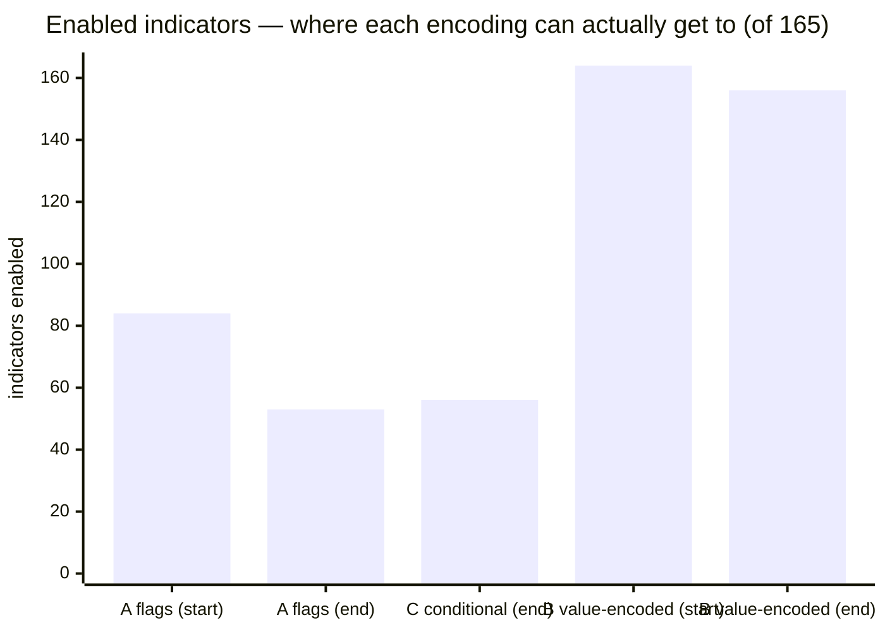

# #97 — Can "off" live inside a parameter value? Measured.

**Answer: no.** Under the encoding, **93% of the library stays permanently on** — and that is with the
search rewarded for *nothing except* turning indicators off.

**Conditional parameters, the other candidate, behave identically to today's flags.** That is the one
worth pursuing.

---

## 1. What was run

Whether the encoding is viable is a **sampling** question, not a profitability one: it turns on whether
the search can ever *reach* the off state. So this ran the production sampler (NSGA-III) over three
parameterizations of the same 165-indicator layer and recorded, per trial, how many indicators came out
enabled. No backtest — minutes instead of days.

| arm | how "off" is expressed |
|---|---|
| **A — flags** | `en_<key>` categorical `[False, True]`; parameters always drawn *(today)* |
| **B — value-encoded** | no flag; off **iff** the indicator's first numeric parameter sits on its off value |
| **C — conditional** | `en_<key>` categorical; parameters drawn **only when the flag is on** |

### The design is rigged in favour of arm B, on purpose

- **The objective is "minimise the number of enabled indicators", and nothing else.** Maximum possible
  pressure toward "off", with no competing goal.
- **The off sentinel is each parameter's own range minimum** — the most reachable candidate there is. A
  sentinel outside the range (`0` for a parameter bounded at 5) would be unreachable by construction
  and would prove only that the setup was rigged.
- **A uniform-random control runs alongside**, so a result can be attributed to the space rather than
  to the sampler.

If arm B cannot turn indicators off under those conditions, it cannot in a real search — where "off"
competes with fitting the price series.

---

## 2. The result

400 trials per arm, seed 1, registry 165.

| arm | first 50 trials | last 50 trials | best ever | random control (mean) |
|---|---:|---:|---:|---:|
| **A — flags** | 83.5 | **53.1** | **45** | 82.4 |
| **C — conditional** | 83.4 | **56.3** | **46** | 82.7 |
| **B — value-encoded** | 163.6 | **156.4** | **153** | 163.7 |



**Arm B's best trial in 400 still had 153 of 165 indicators on — 93% of the library.** Arm A reached 45
(27%). The search *is* working in arm B — it beats its own random control, 153 vs 160 — but from a
position where almost nothing can be switched off, so all that effort buys eight indicators.

---

## 3. Why, precisely — and one correction to my own prediction

I predicted arm B would sit *at or very near 165*, on the argument that a continuous parameter's off
value has probability exactly zero. **That argument is correct but it covers far fewer indicators than
I implied**, and the honest mechanism is a mix:

| population | count | why "off" is hard to reach |
|---|---:|---|
| float first parameter | **9** | probability **exactly 0** — a single point on a real interval. Genuinely unreachable |
| integer first parameter | **133** | one specific value out of the whole range — roughly **0.25–1%** per draw |
| **no numeric parameter at all** | **23** | **nowhere to put "off"**. Under this proposal they would be permanently on with no way to express otherwise |

So the refutation does not rest on the measure-zero argument. It rests on the ordinary arithmetic: for
133 indicators, "off" goes from a **50%** chance under a flag to well under **1%** — and for 23 more it
is not expressible at all. The measured 156/165 is the sum of those three effects, and it moved 8
indicators where arm A moved 30.

**Stating this plainly because I got the emphasis wrong beforehand:** the encoding fails mostly on
probability, not on impossibility.

---

## 4. What this says about the compression

The original attraction was removing 165 dimensions. Two things follow:

1. **Arm B buys the dimensions and loses the search.** A search that cannot switch indicators off is
   not selecting indicators — it is running all of them and tuning them. That is the exact failure the
   idea was raised to avoid.
2. **Arm C keeps the search and still removes the waste.** Its enabled-count curve is
   indistinguishable from today's (83.4 → 56.3 against 83.5 → 53.1), because the flag is untouched.
   What it removes is the **dead parameter draws**: `_suggest_indicators` currently draws every
   indicator's parameters on every trial regardless of `enabled`, so on a trial with ~56 enabled,
   roughly **two-thirds of the 295 parameter draws are read by nothing**.

---

## 5. Recommendation

**Drop the value encoding. Take conditional parameters to a measured trial.**

| | |
|---|---|
| **refuted** | value-encoded off — 93% of the library permanently on under maximum pressure |
| **cleared for the next step** | conditional parameters — identical selection behaviour, fewer dead draws |
| **still worth pairing with it** | count-then-membership (#81's MAP-Elites fix) — controls *how many* are on explicitly, and is immune to registry growth (rule S2) |

### What is NOT yet measured

- **The actual saving from arm C.** This PoC measured *selection behaviour*, not speed. The next step
  instruments parameter draws per trial and times a real study.
- **NSGA-III crossover across trials with different parameter sets.** Conditional spaces mean two
  parents can have different genomes. Optuna supports it; whether the genetic operators degrade is an
  open question this run does not answer.
- **Any P&L.** Deliberately — arm B was refuted without needing it, which is what the design was for.

## 6. Reproducing

```bash
cd ~/Mulham/code/subprojects/Parametric-Indicators
WSH_DATA_BASE=/home/dev/Mulham/wsg-i /home/dev/Mulham/.venv/bin/python3 \
    -m optimize.perf.poc_indicator_encoding --trials 400
```

Artifact: `optimize/perf/results/poc97_encoding.json` (carries its own provenance stamp).

---

## 7. Conditional parameters — measured (2026-08-01)

Shipped behind `--conditional-params`, **off by default**. Two matched studies, NQ 4h, 800 trials
each, same seed, same budget, only the flag differing.

### What is settled

| | rectangular | conditional | change |
|---|---:|---:|---:|
| **wall clock, 800 trials** | **533 s** | **371 s** | **−30%** |
| **parameters drawn per trial** | **454** | **301** | **−34%** |

The mechanism does what it claimed: a third of the parameter draws were being read by nothing, and
removing them takes a third off the wall clock at an identical trial count. Strategy identity is
proven separately (`test_conditional_params.py`): same enabled set, same parameters for enabled keys,
same objects out of `library.from_specs`.

### What is NOT settled — and this is the part that matters

**The crossover question remains open, and this run could not answer it.** Of 800 trials, only **2**
(rectangular) and **4** (conditional) produced objective values at all; the rest were pruned. Comparing
best-P&L across n=2 and n=4 would be comparing noise:

| | rectangular | conditional |
|---|---:|---:|
| trials with values | **2** | **4** |
| best median P&L | 3,865 | 3,508 |

**Those numbers are reported so they are not quietly omitted, not because they mean anything.** Neither
arm found a single feasible solution (DD ≤ 25% of P&L) — 800 trials over 466 dimensions is 1.7
trials/dim against the 100/dim standard, and the same under-sampling that blocks #96's comparison
blocks this one.

So: **the flag stays OFF by default.** The speed saving is real and measured; the claim that NSGA-III's
crossover is unharmed when parents carry different parameter sets is **still unsupported**, and a
30% speed-up is not a reason to adopt an unmeasured change to how the search recombines.

### What would settle it

A budget where enough trials survive pruning to compare distributions — which is the same blocker as
#96, and probably the same fix: scope the search (fewer indicators) so the trials/dim ratio is
defensible, rather than buying more days.
