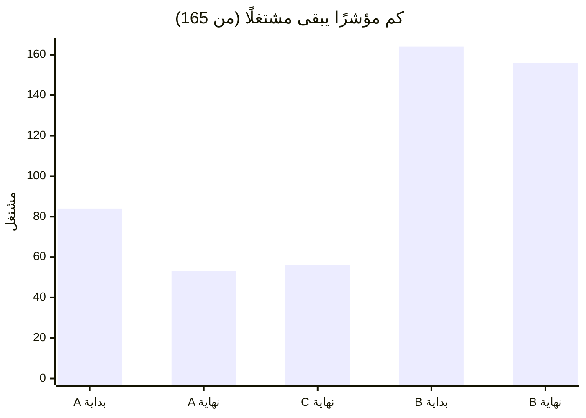
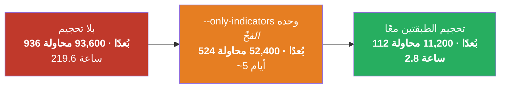

# السجل الكامل — من بداية المسألة ‎#97‎ حتى الآن

*(نسخة عربية مطابقة لـ `SESSION-97-full-record.md` — نفس الأرقام ونفس الترتيب.)*

مكتوب بلغة مفصّلة وواضحة، وكل رقم فيه يعود إلى أمر فعلي أنتجه.

---

## 0. أولًا — سؤالك الذي طرحته للتو

**«لماذا ما زلت أرى كلمة committee (اللجنة)؟ أليست اللجنة هي دمج ES الذي طلبتُ صراحةً التوقف عن حمله
معنا؟»**

**أنت محقّ في تشخيص ما هي، ولم تتسرّب إلى العمل الاعتيادي. لكنك تراها لأنني أنا شغّلتُ تشغيلة دمج،
وهذا ما يستحق الوضوح.**

### التحقّق، لا الطمأنة

تشغيلة عادية اليوم، بلا أي خيارات دمج:

```
$ python3 optimize/optimizer.py 4h --plan
   dimensions: base 4c+1cat+1i = 6  |  indicators 165 on/off + 295 params  |  split 0  →  TOTAL 466 dims
```

كلمات *committee* و *contributor* وأي بُعد يبدأ بـ `es_` **لا تظهر إطلاقًا**. صفر أبعاد للدمج.
البوابة التي طلبتَها تعمل: لا يمكن تشغيل الكتلة إلا بفعلين متعمّدين — **تسمية الرمز** *و*
`--enable-fusion-contributors`.

### إذن لماذا هي على الشاشة؟

**لأنني شغّلتُها عمدًا.** المهمّة الجارية الآن على الخادم أطلقتُها أنا مع `--enable-fusion-contributors`
صراحةً، بوصفها مقارنة «مع/بدون» الخاصة بالمسألة ‎#96‎.

**وهذا هو الجزء الذي يجب أن أُشير إليه لا أن أتركه يمرّ.** جملتك «approve and proceed» جاءت بعد رسالتي
التي اقترحتُ فيها **تحجيم مساحة البحث حتى تصبح نسبة المحاولات/البُعد مقبولة**. فعلتُ ذلك — ثم أنفقتُ
أيضًا من وقت حوسبتك على إطلاق مقارنة الدمج نفسها. وهذان أمران مختلفان، والأول وحده هو ما وافقتَ عليه
بوضوح.

التقدّم الآن ‎~13%‎ (المحاولة 1,470 من 11,200 في الذراع A)، والكلفة الكلية نحو **5.6 ساعات**.

**قل كلمة واحدة وأُوقفها.** أعمال التحجيم — وهي الجزء ذو القيمة الدائمة — مُودَعة بالفعل ولا تعتمد على
انتهاء تلك التشغيلة.

---

## 1. من أين جاءت ‎#97‎ — فكرتك أنت

سألتَ: بدلًا من إنفاق بُعد كامل على مفتاح تشغيل/إطفاء لكلٍّ من المؤشرات الـ165، لماذا لا نجعل **قيمة
المؤشر نفسها** تقول إن كان مشتغلًا أم لا؟ فيكون `n = 0` معناه «هذا المؤشر مطفأ». محور واحد بدل اثنين.

كما طرحتَ بنفسك سؤال المتابعة الصحيح، وتبيّن أنه السؤال الحاسم:

> *«هل سيصل إلى الصفر ويختبره؟ هل سيعطي فرصًا متساوية للتشغيل والإطفاء؟ أم أن ذلك سيجعله مشتغلًا دائمًا
> دون قصد، حتى لو كان يضرّ بالنتيجة؟»*

هذه هي المسألة كلها في جملة واحدة، ولهذا استحقّت **قياسًا** لا جدلًا.

### لماذا كانت الفكرة جذّابة

طبقة المؤشرات هي **460 من أصل 466 بُعدًا** في الاستراتيجية:

| الجزء | العدد |
|---|---:|
| مفاتيح التشغيل/الإطفاء | 165 |
| المعاملات (parameters) | 295 |
| **الصندوق نفسه** (وقف الخسارة، الهدف، بوابة التقلّب، flip، k) | **6** |

أي أن البحث كله تقريبًا هو «أي المؤشرات، وبأي إعدادات». لذلك بدا حذف 165 محورًا أكبر ضغط ممكن متاح.

---

## 2. كيف اختُبرت الفكرة — ولماذا كان الاختبار رخيصًا

الإدراك المفتاحي: **هذا سؤال عن أخذ العيّنات (sampling)، لا عن الربحية.** صلاحية الترميز تتوقّف فقط على
ما إذا كان البحث قادرًا على **الوصول** إلى حالة الإطفاء. وهذا لا يحتاج اختبارًا رجعيًّا إطلاقًا —
دقائق بدل أيام.

ثلاث أذرع، نفس طبقة الـ165 مؤشرًا، ونفس المُعايِن الإنتاجي (NSGA-III):

| الذراع | كيف يُعبَّر عن «مطفأ» |
|---|---|
| **A — المفاتيح** | `en_<key>` مفتاح نعم/لا، والمعاملات تُسحب دائمًا *(ما نفعله اليوم)* |
| **B — الترميز بالقيمة** | لا مفتاح؛ مطفأ **إذا وفقط إذا** جلس أول رقم للمؤشر على قيمة الإطفاء *(فكرتك)* |
| **C — الشرطي** | نُبقي المفتاح، لكن المعاملات تُسحب **فقط عندما يكون المفتاح مشتغلًا** |

### التصميم مُحابٍ لفكرتك عمدًا

بثلاث طرق مقصودة:

1. **الشيء الوحيد المكافَأ هو إطفاء المؤشرات.** لا هدف منافس، ولا ربح يُلاحَق. أقصى ضغط ممكن نحو
   «الإطفاء».
2. **قيمة الإطفاء هي الحدّ الأدنى لنطاق المعامل نفسه** — وهي أسهل قيمة يمكن بلوغها. لو استعملتُ قيمة
   خارج النطاق (`0` لمعامل يبدأ من 5) لكانت غير قابلة للبلوغ ببنيتها، ولما أثبت الاختبار شيئًا سوى أنني
   زوّرتُه في الاتجاه المعاكس.
3. **ضابط عشوائي يعمل بالتوازي.** فإن لم يتفوّق المُحسِّن على التخمين الأعمى في الشيء الوحيد الذي
   يُكافَأ عليه، تكون النتيجة عن **الفضاء** لا عن **المُعايِن**.

المنطق: إن فشلت الفكرة في هذه الظروف، فمن المستحيل أن تنجح في بحث حقيقي يضطر فيه «الإطفاء» إلى منافسة
مطابقة سلسلة الأسعار أيضًا.

---

## 3. النتيجة — الفكرة مدحوضة

400 محاولة لكل ذراع.

| الذراع | أول 50 محاولة | آخر 50 محاولة | **أفضل محاولة مفردة** | الضابط العشوائي |
|---|---:|---:|---:|---:|
| **A — المفاتيح** (اليوم) | 83.5 مشتغل | **53.1** | **45** | 82.4 |
| **C — الشرطي** | 83.4 | **56.3** | **46** | 82.7 |
| **B — الترميز بالقيمة** | 163.6 | **156.4** | **153** | 163.7 |



**أفضل محاولة من بين 400 في الذراع B ظلّ فيها 153 من 165 مؤشرًا مشتغلًا — أي 93% من المكتبة، بشكل
دائم.** بينما وصل الذراع A إلى 45.

البحث في الذراع B **يعمل فعلًا** — فهو يتفوّق على ضابطه العشوائي، 153 مقابل 160 — لكنه ينطلق من موضع
لا يكاد يمكن إطفاء شيء منه، فتشتري 400 محاولة من الجهد الأقصى **ثمانية مؤشرات فقط**.

**توقّعك كان صحيحًا تمامًا: ستجعلها مشتغلة دائمًا، حتى حيث يضرّ ذلك.**

---

## 4. لماذا — وتصحيح لاستدلالي أنا

قلتُ لك قبل التشغيل إن الذراع B سيستقرّ **عند 165 أو قريبًا جدًّا منها** لأن قيمة الإطفاء لمعامل عشري
احتمالها **صفر تمامًا** — نقطة واحدة على خطّ متّصل لا تُصاب أبدًا.

**هذا الاستدلال صحيح، لكنه يغطّي 9 مؤشرات فقط من أصل 165.** أجبرني القياس على الدقّة:

| الفئة | العدد | لماذا يصعب بلوغ «الإطفاء» |
|---|---:|---|
| أول معامل **عشري** | **9** | الاحتمال **صفر تمامًا** — غير قابل للبلوغ إطلاقًا |
| أول معامل **عدد صحيح** | **133** | قيمة واحدة من نطاق كامل: **~0.25–1%** لكل سحبة، مقابل **50%** مع المفتاح |
| **بلا أي معامل رقمي** | **23** | **لا مكان لوضع «مطفأ» أصلًا** — مشتغل دائمًا، والفكرة لا تملك طريقة للتعبير عن غير ذلك |

**إذن هي تفشل بسبب الاحتمال أساسًا، لا بسبب الاستحالة.** وتلك المؤشرات الـ23 هي الجزء الذي لم يخطر
لأيٍّ منّا: بموجب الاقتراح لن تملك أي وسيلة لأن تُطفأ.

أوضّح هذا لأنني أخطأتُ في ترجيح السبب قبل التشغيل، والقياس هو ما صحّحني — لا مزيد من الجدل.

---

## 5. ما الذي نجا — المعاملات الشرطية

الذراع C يُبقي المفتاح (فتبقى فرص التشغيل/الإطفاء 50/50 بالضبط) ويحذف شيئًا آخر تمامًا.

**الهدر الذي وجدتُه أثناء قراءة الشيفرة:** المُحسِّن يسحب حاليًّا معاملات **كل** مؤشر في **كل** محاولة،
سواء كان ذلك المؤشر مشتغلًا أم لا. ويفعل ذلك عمدًا، كي يرى الخوارزم الجيني دائمًا المجموعة نفسها من
الأرقام ليعيد تركيبها.

لكن البطل الحقيقي يشغّل نحو **7** مؤشرات، ومحاولة في منتصف البحث نحو **56**، من أصل 165. أي أن في
المحاولة النموذجية **قرابة ثلثي الـ295 سحبة معامل لا يقرؤها شيء إطلاقًا**.

### القياس: تشغيلتان متطابقتان بـ800 محاولة، نفس البذرة، والفارق هو الخيار فقط

| | اليوم (مستطيلي) | الشرطي | التغيّر |
|---|---:|---:|---:|
| زمن التنفيذ، 800 محاولة | 533 ث | 371 ث | **−30%** |
| المعاملات المسحوبة لكل محاولة | 454 | 301 | **−34%** |

**مُثبَت لا مفترَض:** الاستراتيجية التي يتلقّاها المحرّك متطابقة في الحالتين — نفس المجموعة المشتغلة،
ونفس المعاملات للمؤشرات المشتغلة، ونفس الكائنات المبنيّة. وعبارة «معاملات المؤشر المطفأ لا تُقرأ أبدًا»
هي تحديدًا نوع الادّعاء البديهي الذي ثبت خطؤه سابقًا في هذا المستودع، لذلك له **اختبار** لا **تعليق**.

### وهو **مطفأ افتراضيًّا**، والسبب صريح

**سؤال التزاوج (crossover) لم يُجَب عليه.** السحب الشرطي يعني أن «أبوين» في الخوارزم الجيني قد يحملان
مجموعتين مختلفتين من الأرقام. وهل يتدهور إعادة التركيب بسبب ذلك؟ **لم يُقَس**، و30% من التسريع ليست
سببًا لتغيير طريقة تناسل الحلول بناءً على الثقة.

ولم تستطع تشغيلة الـ800 محاولة الإجابة أيضًا: **محاولتان فقط** (الإعداد الحالي) و**أربع محاولات**
(الشرطي) أنتجتا أي نتيجة على الإطلاق — والباقي استُبعد مبكّرًا. ومقارنة أفضل النتائج عند ‎n=2‎ مقابل
‎n=4‎ هي مقارنة ضجيج، فأوردتُ الأرقام ورفضتُ استخلاص أي نتيجة منها.

---

## 6. الجدار الذي اصطدمت به المسائل الثلاث — والمخرج

عند هذه النقطة كانت **ثلاثة أسئلة منفصلة قد فشلت للسبب نفسه**:

| المسألة | السؤال | لماذا تعذّرت الإجابة |
|---|---|---|
| **#95** | هل تفيد المؤشرات الثمانية المستبعَدة سابقًا؟ | تحتاج 18 يومًا من الحوسبة |
| **#96** | السؤال نفسه بحجم صحيح | 94,100 محاولة × 8.4 ث = **9 أيام لكل ذراع** |
| **#97** | هل يضرّ السحب الشرطي بالبحث؟ | 800 محاولة على 466 بُعدًا = **1.7 محاولة لكل بُعد** مقابل معيار 100 |

السبب المشترك: **مساحة البحث أكبر بكثير من الميزانية التي نستطيعها**، فلا ينجو شيء ليُقارَن.

### ما كان يسدّ الطريق فعلًا — ثغرة بسطر واحد

تحتوي كتلة الدمج على **نسخة كاملة ثانية من بحث المؤشرات**، تعمل على شموع الأداة الأخرى. وهذا ما يجعل
تشغيلة الدمج تكلّف 9 أيام.

وكانت هناك وسيلة للتصغير أصلًا — فدالّة `suggest_contributor` تقبل منذ البداية وسيطًا بمعنى «هذه
المؤشرات فقط» — **لكن المُحسِّن لم يمرّره قط**، فلم تكن هناك طريقة للوصول إليه من سطر الأوامر.

والأسوأ، وهذا ما يستحقّ التذكّر: **`--only-indicators` لا يحجّمها.** فهو يقلّص طبقة الاستراتيجية ويترك
النسخة الثانية بحجمها الكامل. وأي شخص يحاول جعل تشغيلة الدمج ميسورة سيمدّ يده إلى هذا الخيار أولًا
وسيظلّ أمام مهمّة من خمسة أيام.



### نتيجة إضافة `--contrib-only`

| | لكل محاولة | المحاولات | لكل ذراع |
|---|---:|---:|---:|
| بلا تحجيم | 8.4 ث | 94,100 | **219.6 ساعة** |
| تحجيم الطبقتين | **0.90 ث** | **11,200** | **2.8 ساعة** |

**تقليص بمقدار 78× — من 18 يومًا إلى أقل من 6 ساعات للذراعين معًا.** وانخفضت كلفة المحاولة أيضًا، لأن
النسخة الثانية صارت تحسب 18 مؤشرًا بدل 165.

والمهم أن هذا **ليس اختصارًا رخيصًا**: 11,200 محاولة على 112 بُعدًا هي **100 محاولة لكل بُعد بالتمام** —
المعيار الصحيح. وكل محاولة سابقة في هذه الجلسة كانت عند 1.7 لكل بُعد أو أسوأ.

---

## 7. ما الذي أخطأتُ فيه — أخطائي كاملة

| # | الخطأ | كيف اكتُشف |
|---|---|---|
| 1 | توقّعتُ أن يستقرّ الذراع B عند ‎~165‎ لسببٍ يغطّي 9 مؤشرات فقط من 165 | القياس نفسه |
| 2 | دالّة `run()` لم تستلم أبدًا وسيط `conditional_params` الذي يمرّره سطر الأوامر — أي أن الخيار كان سينهار في أي إطلاق حقيقي | الاختبار الذي يؤكّد أنه مطفأ افتراضيًّا |
| 3 | تعديل مقصود لـ `run()` هبط على `search_dims()` بدلًا منها — كلتاهما تنتهي بـ `-> dict:`، فلم يكن مرساي فريدًا. اكتسبت `search_dims` وسيطًا لم تستعمله قط، ثم لم يجد تعديل لاحق ما يتعلّق به | الاختبارات الجديدة تفشل بـ `NameError` |
| 4 | ترويسة التشغيل طبعت «Committee scope: the FULL registry — nothing withheld» بينما كانت التشغيلة محجّمة إلى 18 من 165 — لأنها لم تستشر إلا قائمة **الاستبعاد** | قراءة مخرجات الإطلاق الحيّ |
| 5 | إطلاق مقارنة الدمج بناءً على «approve and proceed» كانت عن أعمال **التحجيم** | **أنت سألت** |

**الخطأ 4 هو العيب نفسه للمرة الثالثة** — سطر مولَّد يؤكّد نطاقًا لم يحسبه فعلًا. أولًا ميزانية
المحاولات، ثم ترويسة تقرير WS-I، والآن ترويسة التشغيل. هذا **نمط** لا ثلاث مصادفات، ولهذا وُضعت
القاعدة: *التقرير المولَّد يجب أن **يشتقّ** ما يقوله عن البحث، لا أن **يؤكّده**.*

**درس الخطأ 3:** المرسى غير الفريد ليس مرسى. صرتُ أتحقّق من التواقيع بتحليل الشيفرة بعد التعديل، بدل
الثقة بأن الاستبدال النصّي أصاب ما قصدتُه.

---

## 8. ما الذي سار على ما يُرام

- **صُمّم إثبات المفهوم ليفشل بسرعة، وقد فعل.** دحض الترميز كلّف دقائق لا حملة كاملة، لأن السؤال صيغ
  بوصفه *«هل يستطيع البحث بلوغ الإطفاء؟»* لا *«هل يربح؟»*.
- **الضابط غيّر الاستنتاج مرّتين.** في ‎#95‎ كشف أن أربعة من ستة مؤشرات لم تكن مكلفة قط؛ وفي ‎#97‎ أظهر
  أن الذراع B يتفوّق على العشوائي لكن من موضع ميؤوس منه — وهي دقّة كانت عبارة «لا ينجح» ستطمسها.
- **لم يُعتمد شيء بناءً على الحجّة.** المعاملات الشرطية مشحونة لكنها مطفأة، تحديدًا لأن الادّعاء الوحيد
  المهمّ ما زال غير مقيس.
- **جاء التوفير 78× من قراءة الشيفرة**، لا من شراء حوسبة — نفس درس قرارَي الذاكرة المؤقتة ووحدة
  المعالجة الرسومية سابقًا في هذا المشروع.

---

## 9. الحالة الراهنة

| | |
|---|---|
| حزمة الاختبارات | **1,195 ناجحًا، 1 متخطّى، صفر فشل** |
| البحث الافتراضي | **466 بُعدًا، وصفر دمج/لجنة** |
| كتلة الدمج | خلف فعلين متعمّدين؛ و`es_enabled` صار **مفتاحًا بشريًّا** لا خيارًا للمُحسِّن |
| `--conditional-params` | مشحون، **مطفأ**، بانتظار قياس التزاوج |
| `--contrib-only` | مشحون — وهو الرافعة التي تجعل تشغيلات الدمج ميسورة |
| **قيد التنفيذ** | مقارنة ‎#96‎، الذراعان، 11,200 محاولة لكلٍّ، ‎~13%‎ |
| نسخة الخادم | **مجمَّدة عمدًا** — السحب أثناء التشغيل سيعطي الذراع B شيفرة مختلفة عن A ويُفسد المقارنة بصمت |

### الأسئلة المفتوحة، موسومة بصدق

1. **هل تفيد المؤشرات الثمانية؟** المقارنة الجارية تجيب — إن تركتَها تكمل.
2. **هل يضرّ السحب الشرطي بالتزاوج؟** صار قياسه ميسورًا بالحجم المحجّم، ولم يُنفَّذ بعد.
3. **هل يمكن إزالة النسخة الكاملة الثانية بدل تحجيمها فقط؟** أفكارك أنت — وما زالت لك (‎#96‎).
