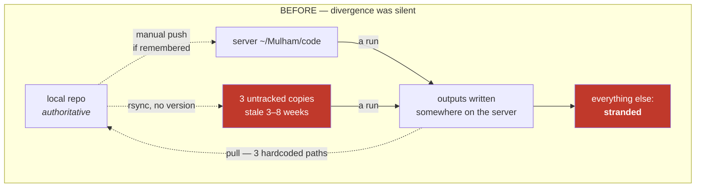
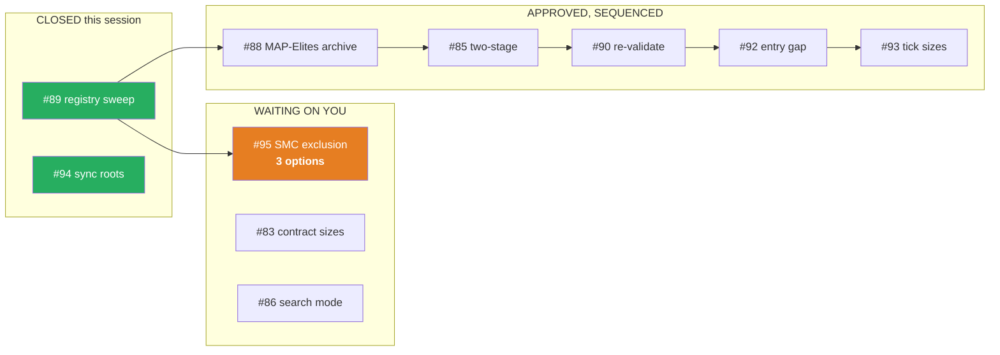

# Full status — what was done, what is open, what needs your decision
# ‏الحالة الكاملة — ما أُنجز، وما هو مفتوح، وما ينتظر قرارك

**Date / التاريخ:** 2026-08-01

**Contents:** [Part 1 — Professional English](#part-1--professional-english) ·
[Part 2 — Baby English](#part-2--baby-english) · [Part 3 — العربية](#part-3--العربية)

---

# ⚠️ READ FIRST — the two-sentence summary

**Three issues were worked: #89 (closed), #94 (closed), #95 (measured, waiting on you).** The work
uncovered that a *cost-based exclusion* has been keeping eight indicators out of every search on a
measurement that is now **wrong by a factor of 20**, and that local↔server drift is not one bug but
**six**, all of which are now fixed and verified on the live server.

**One decision is genuinely blocking:** how to admit the eight excluded indicators (#95, three options
in §4). Everything else is sequenced work you have already approved.

---

# Part 1 — Professional English

## 1. What was completed

### 1.1 Issue #89 — CLOSED. Sweep for constants calibrated when the library was small

The indicator library grew **15 → 18 → 143 → 165**. Nothing in the code errors when that number
changes, so constants written correctly at 18 silently came to mean something else.

**The class, in one sentence: a constant that is really a ratio.** `0.4` is not "a probability", it is
*"about 7 indicators"* — but only at 18. At 165 it means *"about 66"*.

The headline finding was that the **8× trial-budget defect existed at four separate call sites**, found
one at a time over two days:

| # | site | what it did |
|---|---|---|
| 1 | `optimizer.main()` | `--auto-trials` budgeted **47,100 trials for a 59-dimension search** |
| 2 | `control.plan()` | the UI displayed 47,100 for a 5,900 search |
| 3 | **`runner.target_trials()`** | **the watchdog chased 47,000 for a run needing 5,800 (8.1×)** |
| 4 | **`remote_wsi.sh`** | the server launcher recomputed it in shell |

Site 3 is the worst: it drives the *respawn loop*, so a scoped run would have been restarted
indefinitely chasing a target the search was never sized for. Site 4 had a deeper cause — `REMOTE_ENV`
never exported `WSH_ONLY`/`WSH_EXCLUDE`, so **the remote side could not have honoured the scope even in
principle**.

**The lesson, now a playbook rule:** fixing a defect at one call site is not fixing the defect. The test
(`test_budget_scope_everywhere.py`) enumerates every budget *consumer* and asserts they agree, so a
fifth site fails the day it appears.

Also fixed: the generated report header that said *"all 15 indicators"* on every run including scoped
ones (the rescued wshgap4 report claims "all 15" for a search of 18), and a contributor docstring
frozen at 18.

**Delivered:** `docs/AUDIT-2026-07-31-registry-sensitive-constants.md` — every registry-sensitive
constant marked *derived* / *exposed* / *justified safe* / *open* — plus playbook rules **S1–S7**, a
fourth rule family beside the performance and correctness ones.

> **A mistake worth recording:** my first version of the sweep test used a regex and produced **five
> false positives**. `stage_a_recommended_trials` merely ends with the same name, and one "offender" was
> the phrase sitting inside a docstring *documenting this very bug*. Rewritten using the AST, which sees
> calls rather than text.

### 1.2 Issue #95 — MEASURED. The SMC exclusion costs 4.4% of a trial, not 90%

`optimize/contributor_search.py` withholds eight indicators from the cross-instrument committee
**search space**. Not from display — from the search. No contributor search has ever been able to select
them. The stated reason was cost: `ifvg`=58.1 s and `breaker`=37.9 s were **90% of a 106.4 s trial**.

Measured on the **full 486,954-bar ES committee frame**, through the production call path, warmed:

| | measured |
|---|---:|
| committee as searched today (157 indicators) | **18.94 s** |
| the 8 excluded indicators | **0.83 s** |
| **admitting them costs** | **+4.4% per trial** |
| the original justification | **90%** |

Worst grid corner, all eight, measured at full scale: **0.94 s**.

**The control changed the story.** Re-measured with the accelerator forced off:

| indicator | reference path | accelerated | speed-up |
|---|---:|---:|---:|
| `ifvg` | 22.506 s | 0.224 s | **100×** |
| `breaker` | 14.702 s | 0.198 s | **110×** |
| `order_block` | 1.189 s | 0.058 s | 20× |
| `structure_trend` | 0.094 s | 0.091 s | — |
| `fvg` | 0.097 s | 0.100 s | — |
| `cisd` | 0.094 s | 0.092 s | — |
| `stochastic` | 0.019 s | 0.021 s | — |
| `adx` | 0.125 s | 0.126 s | — |

**Four of the six SMC indicators were never expensive.** They cost the same with the accelerator off as
on, because there was never anything to accelerate. **They were excluded by family membership, not by
measurement** — swept up for sitting in the same source file. Only `ifvg` and `breaker` were ever slow.

**Three caveats, recorded rather than smoothed over:**

1. **The old numbers do not reproduce.** 58.1 s / 37.9 s historically vs **22.5 s / 14.7 s** on the
   reference path today — about 2.5× lower, unexplained. It does not change the verdict, because the
   accelerated path is 100× faster than *either* number.
2. **Subset extrapolation under-predicted `ifvg` by 3.7×** (0.06 s projected vs 0.224 s measured). An
   extrapolation wrong in the *cheap* direction is exactly the one you must not lean on when the
   argument is "cheap enough to admit", so every headline here is a full-frame measurement.
3. **This measures cost only.** The exclusion's *reason* is gone. That is not the same as "these
   indicators help".

**I did not flip the default.** Changing it changes what every contributor search explores — that is a
measured decision, not a cleanup. **§4 has the three options.**

### 1.3 Issue #94 — CLOSED. Local↔server drift: six defects, one symptom

Measured on both machines rather than recalled:

- **Five copies of the code on the server.** Only two under version control. Three were rsync copies
  stale by **3–8 weeks** (2026-06-03, 06-19, 07-11) that **cannot answer "am I current?"** — no
  `git status` exists in them.
- `~/Mulham/wsg-i` was a git repo on `master` with **no remote** and **578 uncommitted files**.
- **Three data roots behind one variable** (`WSH_DATA_BASE`), which also doubled as the repo root.
- Study results in **four** stores. **Zero automation** — no hooks, no cron, no unit.

**The six root causes, each with the incident that proves it:**

| | root cause | incident |
|---|---|---|
| RC-1 | "the code" is not a thing that exists | **32 test failures** that looked exactly like regressions — all wrong-root `FileNotFoundError` |
| RC-2 | sync is a convention, not a mechanism | the server was **9 commits behind**, found only because I happened to run `git status` |
| RC-3 | a laptop path frozen in **49** source locations | import-time failure ⇒ pytest drops the file **at collection**: an **absent** test, not a failing one. The contributor tests had never run on the server |
| RC-4 | the two environments are different **programs** | **no local venv at all**; `njit` is a no-op locally, so a recursive kernel passed locally and **segfaulted** on the server |
| RC-5 | the return path is a hardcoded allow-list | `WS-I_RESULTS_GC` appears **zero times** in `remote_wsi.sh` ⇒ **9 of 10** per-instrument reports stranded |
| RC-6 | no output records the code that produced it | a green log from a **crashed build** was read as the current result |

**Why "be more careful" cannot work:** five manual steps per task, needed every time, where failure is
invisible. That does not fail from inattention. **It fails because the system has no way to tell you it
has diverged.**

**Design principle: do not try to keep two copies in sync — make it impossible for them to diverge
quietly.** Four layers, all shipped:

| layer | what it does |
|---|---|
| **1 — provenance** | every artifact carries commit, branch, dirty, host, **data root**, python, **numba version**, registry size, argv — embedded *inside* the result JSON |
| **2 — preflight** | **blocks** a dirty checkout, one behind upstream, or a missing data root; overrides are recorded in the stamp |
| **3 — roots** | repo root **derived** from `__file__`, data root **explicit**; AST sweep test |
| **4 — harvest** | asks git what it does not track, instead of maintaining an allow-list |

**The copies, as you chose:** `wsg-h`, `l2v2`, `fa-m1` are now **git worktrees**. `fa-m1` is **detached**
deliberately — `fundamental-analysis` is checked out elsewhere and belongs to another agent, and two
worktrees on one live branch invites two writers. `wsg-i` is a **data directory**; its `.git` was
*renamed*, not deleted, so it is fully reversible. **Nothing was deleted anywhere.**

**The harvest — 1,028 files, 595 MB,** selected by content hash against the entire local repo:

| category | files | size |
|---|---:|---:|
| source written on the server | 146 | 3.9 MB |
| result JSON | 288 | 13.8 MB |
| reports (`.md`) | 22 | 0.1 MB |
| plots | 515 | 271 MB |
| run logs | 57 | 333 MB |

> **115 of those scripts existed nowhere else**, and they are not miscellaneous: they are the
> 2026-07-13 end-of-day cap campaign and the 2026-07-14 precision investigation — **the chain that built
> and verified the champion set you have deployed.** The champions were committed; the code that
> produced and checked them was not. **The deployed set was running while no longer being
> reproducible.**

Logs and plots were included at your explicit request. The honest cost, stated once: git keeps blobs
forever, so this permanently adds ~595 MB to a public repository's history.

### 1.4 My own mistakes in this session, in full

Recorded because the pattern matters more than any single fix.

| # | mistake | how it was caught |
|---|---|---|
| 1 | A **30-test regression** — Layer 3 moved the instrument registry to load from the checkout (right for code), but that file derived the *ALL_STOCKS data* path from its own `__file__`, so moving the file moved the data | full suite |
| 2 | `xargs sh -c test` exits **123** on first failure; `set -e` killed harvest on the very symlink it was skipping | live probe file |
| 3 | `xargs find -type f` — find wants paths **before** its expression, xargs appends them **after**; it matched nothing and **reported a clean tree while a real untracked report sat there** | live probe file |
| 4 | `stat -c '%F\t…'` — the tab did not survive the ssh quoting layers; every field split failed. Same clean-tree lie | live probe file |
| 5 | The harvest landed **19 archived `test_*.py`**; pytest ran a June/July tree against today's engine — the suite went from 2m39s to **hung for 17 minutes** | suite timing |
| 6 | Two `.gitignore` false positives made the server tree **permanently "dirty"**, which would have made preflight refuse **every** run | running the gate for real |
| 7 | An ignore pattern ending in `/` matches **directories only** — on the server that path is a **symlink**, so it silently failed | checking on the server, not locally |

> **The rule these produced: a mechanism that cannot be observed failing will be trusted while it
> fails.** Bugs 2, 3 and 4 each reported *"nothing to harvest — the server tree is clean"* while a real
> untracked file sat on the server. I only found them because I planted a probe file instead of
> trusting the clean result. That probe is now the acceptance test.

**Also cleaned up: 21 orphaned poller loops** from previous sessions, some spinning for **21 days**, each
waiting on a `pgrep` pattern that matched its own command line. They had made every `pgrep -fc pytest`
check meaningless.

### 1.5 Verification

| check | result |
|---|---|
| full test suite (server, complete data root) | **1,160 passed, 1 skipped, 0 failed** |
| server tree cleanliness | **0 dirty entries** |
| preflight on a clean tree | passes, prints provenance |
| preflight on a dirty tree | **refuses, exit 3**, names the fix |
| preflight with `--allow-dirty` | proceeds, stamp records it as DIRTY |
| `--plan` on a dirty tree | still works (a dry run must stay usable) |
| harvest against a probe file | detected, pulled, cleaned, back to clean |

## 2. Every issue and its current state

### 2.1 Closed

| # | title | outcome |
|---|---|---|
| **89** | Sweep for constants calibrated when the registry was 18 | **CLOSED** — 8× budget defect at 4 sites; audit + playbook S1–S7 |
| **94** | Repo root hardcoded in 49 places | **CLOSED** — 6 root causes, 4 layers shipped, copies retired |
| 82 | Search in dollars instead of points? | CLOSED — units change only; dual display kept (#84) |
| 80 | `test_run_small_study_smoke` never finishes | CLOSED |
| 75 | `--ind-1min` drops the cross-series reference | CLOSED |
| 74 | Worst-case scan blind to cross-series indicators | CLOSED |
| 66 | 25 failing tests on dev/main | CLOSED |
| 62 | Work 17 over-budget indicators to the 2 s budget | CLOSED |
| 58, 57, 56, 54, 51, 49, 46, 43, 41 | earlier infrastructure and research | CLOSED |

### 2.2 Open — waiting on your decision

| # | title | what is needed |
|---|---|---|
| **95** | SMC exclusion rests on a cost now 20× smaller | **choose A, B or C — see §4** |
| **83** | Contract-size truth table (micro/mini/full) | scope confirmation |
| **86** | Dashboard: choose the search mode and report it | scope confirmation |
| **84** | Dashboard: show points AND dollars | agreed as display-only; not started |

### 2.3 Open — approved, sequenced, not started

| # | title | why it is next |
|---|---|---|
| **88** | MAP-Elites archive 9× too large for its budget | 1,494 niches vs 400 evaluations ⇒ "keep the best per niche" degenerated to "keep the first" |
| **85** | Two-stage: stop eliminating indicators at factory defaults | your objection: an indicator can lose at one value and win at another |
| **90** | Re-validate MAP-Elites and two-stage | their accepted results predate the recalibration ⇒ **unvalidated, not wrong** |
| **81** | 18→165 growth: components still calibrated for the old registry | parent of #88/#85/#90 |
| **92** | Entry gap: the entry fill is still optimistic | **your sequence: after the current issues** |
| **93** | Tick sizes: per-instrument table | **your sequence: after #92** |

### 2.4 Open — accepted or parked

| # | title | state |
|---|---|---|
| **79** | Intraday gaps on NG | **accepted deliberately** — "we take it as it is for now" |
| **87** | Price history is only 1.38 years | structural: no fair head-to-head is possible until there is more data |
| **91** | One RunSpec, one build_argv | largely delivered; shell launchers still hand-build some flags |

## 3. Two follow-ons I noted rather than silently doing

1. **Retire `cmd_pull`'s allow-list in favour of `harvest.sh`.** The new command works and is tested;
   replacing the old one changes a workflow you use, so it is yours to approve.
2. **Stamp provenance into the optimizer's own artifacts.** The perf benches carry it; the optimizer's
   result files do not yet.

## 4. THE DECISION — how to admit the eight excluded indicators (#95)

The cost reason is gone. What replaces it is your call, and the three options are not equivalent.

| option | what it does | argument for | argument against |
|---|---|---|---|
| **A — remove the exclusion entirely** | all 8 become searchable | the cost reason is gone; a search that cannot reach an indicator can never learn it is useless | widens the search space in one step, with no before/after |
| **B — remove it for the 6 that were never slow; keep `ifvg`/`breaker` out** | the two genuinely-expensive ones stay excluded | most conservative | they are now **0.22 s and 0.20 s** — the caution has no measurement behind it either |
| **C — make it a dashboard-controlled option, default unchanged** | you choose per run | matches your standing rule that a decision layer must be controllable by the human running the backtest; nothing changes until you ask | one more step before any answer |

**My recommendation: C, then A.** Ship the control, run the comparison with and without on out-of-sample
folds, and let the measurement set the default — rather than flipping a default and measuring
afterwards.

---

# Part 2 — Baby English

## What we did, in plain words

### The library got big, and old numbers stopped meaning what they said

Your system has a library of **indicators** — small rules that look at the price and vote *yes*, *no*,
or *nothing*. That library used to have **18** rules. It now has **165**.

Here is the problem. Somebody once wrote a line that said *"turn on 40% of the rules"*. With 18 rules,
40% is about **7 rules** — a sensible strategy. With 165 rules, the exact same line means about **66
rules** — something nobody would ever trade. **The line never changed. Its meaning did.**

Nothing broke. Nothing showed an error. The program ran, finished, and printed a result. That is the
dangerous kind of mistake: it looks exactly like everything working.

We went looking for every line like that. **We found the same budget mistake in four different
places** — and one of them was the *watchdog*, the thing that keeps restarting the search until it hits
a target. It was chasing a target **eight times too big**, so it would have kept restarting the search
for hours longer than intended, and nothing would have said a word.

**The lesson:** fixing a bug in one place is not fixing the bug. The new test does not check one place;
it checks *every place that asks "how big is this search?"* and makes sure they all give the same
answer.

### Eight indicators were locked out of the search, for a reason that expired

Imagine a hiring committee that refuses to interview eight candidates because *"they take too long to
interview"*. That was true once — two of them really did take an hour each.

Then we made the interviews faster. Much faster. **One of them went from 22 seconds to 0.2 seconds.**

But nobody re-checked the rule. So those eight candidates are *still* refused. And when we finally
measured it: interviewing all eight now adds **4.4%** to the time. The rule said **90%**.

**And here is the part I did not expect.** We turned the speed-up off, to check that the speed-up was
really the reason. It turns out **four of the six were never slow at all**. They were banned because
they *sit in the same file* as the two slow ones. They were never measured. They were guilty by
association, for months.

**This does not mean they will make money.** It only means the reason for banning them is gone. Whether
they actually help is a completely different question, and I have not answered it. **That is your
decision — three choices are in Part 1 §4.**

### Your two computers kept falling out of step, and it was never one bug

You said the same kind of error keeps coming back. **You were right, and here is why it kept coming
back: it was never one bug. It was six different bugs that all look the same from outside.**

What we actually found on the server:

- **Five copies of your code.** Only two of them were under version control. Three were plain copies —
  and a plain copy **cannot tell you whether it is out of date**. One had not been touched since
  **June 3rd**.
- The place that holds your data was chosen by **one setting that meant two different things** — where
  the code lives *and* where the data lives. On the server those are different places. Pick the wrong
  one and you get **32 test failures that look exactly like your own code being broken**. (That happened
  to me. Twice I nearly believed it.)
- The command that brings results home from the server had a **list of three file names**. Anything not
  on that list simply stayed on the server forever. When you added gold, silver, oil and the rest, their
  reports were written on the server — **and nine out of ten were never brought home.**
- **Nothing recorded which version of the code produced any result.** So "is this file current?" was
  never a question you could answer by looking at the file.

**Why "just be more careful" was never going to work.** There were **five** things a human had to
remember, every single time, and forgetting any one of them produced a result that *looked completely
normal*. That is not a discipline problem. **The system had no way to tell you it had gone wrong.**

So we did not try to make the two computers stay in step. **We made it impossible for them to drift
quietly:**

1. **Every result now carries a label** saying exactly which version of the code made it, on which
   machine, with which data.
2. **A run now refuses to start** if the code is out of date or has unsaved changes. It stops and tells
   you how to fix it. (You can override, and the override is written into the label.)
3. **The code now works out where it lives by itself**, instead of being told a fixed address that was
   only ever true on your laptop.
4. **Bringing work home now asks the computer "what have you got that I don't?"** instead of reading a
   list somebody has to remember to update.

### The thing we nearly lost

While cleaning up, we found **115 scripts that existed on the server and nowhere else**. They were not
junk. They are the scripts that **built and checked the champion set you are actually trading**.

The champions themselves were saved. The code that made them was not. So the system you are running was
still working — but **nobody could have explained where its numbers came from** if that one computer
had died. They are safe now.

### Where I got things wrong

Seven times, and I want to be plain about them:

- One of my own fixes **broke 30 tests**. I moved a file to a better place, but that file was working out
  where your *data* was by looking at where *it* was sitting. Move the file, move the data. **A path
  worked out from "where am I?" is right for code and wrong for data.**
- **Three times in a row**, my new "bring everything home" command told me *"nothing to bring home — the
  server is clean"*, while a real file sat right there. Three different reasons, all invisible. I only
  caught it because I deliberately planted a file to see whether it would notice.
- The archive I brought home contained **19 old test files**, and the test suite started running June's
  code against today's engine. It went from 2½ minutes to **hanging for 17 minutes**.
- Then the new "refuse to start" safety check started **complaining every single time**, because of two
  small mistakes of mine. That is worse than having no check at all — if it cries wolf constantly, you
  learn to ignore it. Fixed, and the server now reports **completely clean**.

**The rule I took from all of it:** *a safety mechanism you cannot watch fail is a mechanism you will
trust while it is failing.*

### Where everything stands

- **Everything passes: 1,160 tests, zero failures.** The server is clean.
- **Two issues closed** (#89, #94). **One measured and waiting for you** (#95).
- **Next up, in the order you set:** the MAP-Elites archive (#88), the two-stage search (#85), then
  re-checking both (#90) — then the **entry gap** (#92) and the **tick sizes** (#93).

---

# Part 3 — العربية

## ملخّص بجملتين

عملنا على ثلاث مسائل: **#89 (أُغلقت)** و **#94 (أُغلقت)** و **#95 (قِيست، وتنتظر قرارك)**. كشف العمل أن
**استبعادًا مبنيًّا على التكلفة** ظلّ يمنع ثمانية مؤشرات من دخول أي بحث، استنادًا إلى قياس صار اليوم
**خاطئًا بمقدار عشرين ضعفًا**، وأن انحراف الجهاز المحلي عن الخادم **ليس خطأً واحدًا بل ستة أخطاء**،
وقد أُصلحت جميعها وجرى التحقق منها على الخادم الحقيقي.

**قرار واحد فقط يعطّل التقدّم:** كيف نُدخِل المؤشرات الثمانية المستبعَدة (#95، والخيارات الثلاثة في §4).

## 1. المكتبة كبرت، والأرقام القديمة لم تعد تعني ما تقوله

مكتبة المؤشرات كانت **18** مؤشرًا، وصارت **165**. المشكلة أن سطرًا كُتب قديمًا يقول «شغّل 40% من
المؤشرات»: عند 18 مؤشرًا يعني ذلك **سبعة** تقريبًا — استراتيجية معقولة. وعند 165 يعني **ستة وستين** —
شيء لا يمكن تداوله أبدًا. **السطر لم يتغيّر، بل تغيّر معناه.**

ولا شيء يتعطّل. لا رسالة خطأ، ولا اختبار يفشل. البرنامج يعمل وينتهي ويطبع نتيجة. وهذا أخطر أنواع الخلل:
**يبدو تمامًا كأن كل شيء يعمل.**

**الاكتشاف الرئيسي:** خطأ ميزانية المحاولات (بمقدار **8 أضعاف**) كان موجودًا في **أربعة مواضع منفصلة**،
اكتُشفت واحدًا تلو الآخر على مدى يومين. وأسوأها موضع **المراقِب (watchdog)** الذي يعيد تشغيل البحث حتى
بلوغ هدف معيّن: كان يلاحق هدفًا **أكبر بثماني مرات** (47,000 بدل 5,800)، أي أنه كان سيُعيد التشغيل ساعات
طويلة دون أن ينبّه أحدًا.

**الدرس — وصار قاعدة موثّقة:** إصلاح الخلل في موضع واحد ليس إصلاحًا للخلل. الاختبار الجديد لا يفحص موضعًا
واحدًا، بل **يُحصي كل جهة تسأل «ما حجم هذا البحث؟»** ويتأكد أنها تعطي الجواب نفسه.

## 2. ثمانية مؤشرات مُقصاة من البحث لسبب انتهت صلاحيته

تخيّل لجنة توظيف ترفض مقابلة ثمانية مرشّحين لأن «مقابلتهم تستغرق وقتًا طويلًا». كان ذلك صحيحًا يومًا ما:
اثنان منهم كانا يستهلكان وقتًا هائلًا فعلًا.

ثم جعلنا المقابلات أسرع بكثير: **أحدهما انتقل من 22.5 ثانية إلى 0.224 ثانية**. لكن أحدًا لم يُراجع
القاعدة، فبقي الثمانية مرفوضين.

**والقياس على الإطار الكامل (486,954 شمعة):**

| | القياس |
|---|---:|
| اللجنة كما تُبحث اليوم (157 مؤشرًا) | **18.94 ثانية** |
| المؤشرات الثمانية المستبعَدة | **0.83 ثانية** |
| **كلفة إدخالها** | **+4.4% لكل محاولة** |
| المبرّر الأصلي | **90%** |

**وهنا ما لم أتوقّعه.** أطفأنا التسريع للتحقق من أن التسريع هو السبب فعلًا، فتبيّن أن **أربعة من الستة لم
تكن بطيئة أصلًا**: كلفتها واحدة سواء كان التسريع مشتغلًا أم مطفأً. **استُبعدت لأنها تقع في الملف نفسه**
مع المؤشرَين البطيئين — أي بحكم الانتماء لا بحكم القياس.

**تنبيه مهم:** هذا يقيس **التكلفة فقط**. انتفى سبب المنع، وهذا لا يعني أن هذه المؤشرات مفيدة. **القرار
لك، والخيارات الثلاثة في §4 من القسم الإنجليزي.**

## 3. الجهاز المحلي والخادم: ستة أخطاء لا خطأ واحد

قلتَ إن النوع نفسه من الأخطاء يتكرّر. **كنتَ محقًّا، والسبب أنه لم يكن خطأً واحدًا يتكرّر، بل ستة أخطاء
مختلفة تُنتج العَرَض نفسه.** ولذلك لم يكن إصلاح أحدها يمنع التالي.

ما وجدناه فعليًّا على الخادم:

- **خمس نسخ من الشيفرة.** اثنتان فقط تحت إدارة الإصدارات. وثلاث نسخ عادية — **والنسخة العادية لا تستطيع
  أن تخبرك إن كانت قديمة**. إحداها لم تُمَس منذ **3 حزيران/يونيو**.
- **ثلاثة مواقع للبيانات خلف متغيّر واحد** كان يعني شيئين في آن: موضع الشيفرة وموضع البيانات. اختيار
  الموقع الخطأ يُنتج **32 اختبارًا فاشلًا تبدو تمامًا كأنها أعطال في الشيفرة**. حدث هذا معي، وكدت أصدّقه.
- أمر إعادة النتائج من الخادم كان يعتمد على **قائمة بثلاثة أسماء ملفات**. وأي ملف خارجها يبقى على الخادم
  إلى الأبد. ولذلك — بعد إضافة الذهب والفضة والنفط وغيرها — **تسعة من عشرة تقارير لم تُنقل قط.**
- **ولا نتيجة كانت تسجّل إصدار الشيفرة الذي أنتجها**، فسؤال «هل هذا الملف حديث؟» لم يكن قابلًا للإجابة من
  الملف نفسه.

**لماذا «لنكن أكثر انتباهًا» لم يكن ليَنفع؟** لأن هناك **خمس خطوات يدوية** مطلوبة في كل مرة، ونسيان أيٍّ
منها يُنتج نتيجة **تبدو طبيعية تمامًا**. المشكلة ليست في الانتباه، **بل في أن النظام لا يملك وسيلة
لإخبارك أنه انحرف**.

**لذلك لم نحاول إبقاء النسختين متطابقتين، بل جعلنا الانحراف مستحيلًا أن يمرّ بصمت:**

1. **كل نتيجة تحمل الآن بطاقة تعريف**: أي إصدار من الشيفرة أنتجها، على أي جهاز، وبأي بيانات.
2. **التشغيل يرفض الانطلاق** إذا كانت الشيفرة قديمة أو فيها تعديلات غير محفوظة، ويشرح كيف تُصلح ذلك.
   (يمكن التجاوز، والتجاوز نفسه يُسجَّل في البطاقة.)
3. **الشيفرة تستنتج موقعها بنفسها** بدل عنوان ثابت لم يكن صحيحًا إلا على حاسوبك.
4. **إعادة العمل إلى المحلي تسأل الخادم: «ماذا لديك ممّا ليس لديّ؟»** بدل قراءة قائمة يجب أن يتذكّر أحدهم
   تحديثها.

## 4. ما كِدنا نفقده

أثناء التنظيف وجدنا **115 برنامجًا موجودة على الخادم فقط**. وليست ملفات هامشية: إنها البرامج التي
**بَنَت وتحقّقت من مجموعة الأبطال (champions) التي تعمل لديك الآن**.

الأبطال أنفسهم محفوظون، أما الشيفرة التي أنتجتهم فلم تكن كذلك. أي أن النظام يعمل — **لكن لم يكن بالإمكان
تفسير من أين جاءت أرقامه** لو تعطّل ذلك الجهاز. وقد صارت محفوظة الآن.

## 5. أخطائي في هذه الجلسة — كاملة

- إصلاحٌ من إصلاحاتي **أعطب 30 اختبارًا**: نقلتُ ملفًا إلى موضع أصحّ، لكن ذلك الملف كان يستنتج موقع
  **البيانات** من موقع **نفسه**. **المسار المستنتَج من «أين أنا؟» صحيح للشيفرة وخاطئ للبيانات.**
- **ثلاث مرات متتالية** أخبرني أمر «أعِد كل شيء» أن **الخادم نظيف ولا شيء لإعادته**، بينما كان هناك ملف
  حقيقي. ثلاثة أسباب مختلفة، وكلها غير مرئية. ولم أكتشفها إلا لأنني **زرعتُ ملفًا عمدًا** لأرى إن كان
  سيلاحظه.
- الأرشيف الذي أعدتُه ضمّ **19 ملف اختبار قديمًا**، فبدأت حزمة الاختبارات تُشغّل شيفرة تموز على محرّك
  اليوم: من دقيقتين ونصف إلى **تعليق دام 17 دقيقة**.
- ثم صار فحص «ارفض الانطلاق» **يشتكي في كل مرة** بسبب خطأين صغيرين منّي — وهذا **أسوأ من غياب الفحص**،
  لأن التحذير الدائم يُعلِّم تجاهله. أُصلح، والخادم الآن **نظيف تمامًا**.

**القاعدة المستخلصة: آليةُ أمانٍ لا تستطيع مراقبة فشلها، ستثق بها وهي تفشل.**

## 6. الحالة النهائية

| البند | الحالة |
|---|---|
| حزمة الاختبارات الكاملة | **1,160 ناجحًا، صفر فشل** |
| نظافة شجرة الخادم | **صفر تعديلات معلّقة** |
| #89 (كنس الثوابت) | **مغلقة** |
| #94 (جذور المزامنة) | **مغلقة** |
| #95 (استبعاد SMC) | **قِيست — تنتظر قرارك** |

**التالي بالترتيب الذي حدّدته:** أرشيف MAP-Elites (#88)، ثم البحث ثنائي المرحلة (#85)، ثم إعادة التحقق
منهما (#90) — ثم **فجوة الدخول (#92)** ثم **أحجام التِّك (#93)**.

---

## Files produced in this session

| file | what it is |
|---|---|
| `docs/AUDIT-2026-07-31-registry-sensitive-constants.md` | every registry-sensitive constant, classified |
| `docs/ISSUE-95-smc-exclusion-measurement-and-plan.md` | the measurement, the control, and the phased plan |
| `docs/ISSUE-94-local-server-sync-root-cause.md` | six root causes and the four-layer design |
| `docs/ISSUE-94-wsgi-inventory.md` | what was in the 578 uncommitted files |
| `docs/EXPANSION_ROUND_PLAYBOOK.md` §4 | new rule family **S1–S7** |
| `subprojects/Parametric-Indicators/roots.py` | the one resolver for repo/data roots |
| `subprojects/Parametric-Indicators/provenance.py` | provenance stamp + preflight gate |
| `subprojects/Parametric-Indicators/optimize/perf/bench_smc_committee.py` | the #95 measurement harness |
| `subprojects/Parametric-Indicators/optimize/server/harvest.sh` | exhaustive harvest |
| `subprojects/Parametric-Indicators/server-audit/2026-07/` | 1,028 rescued files (595 MB) |
