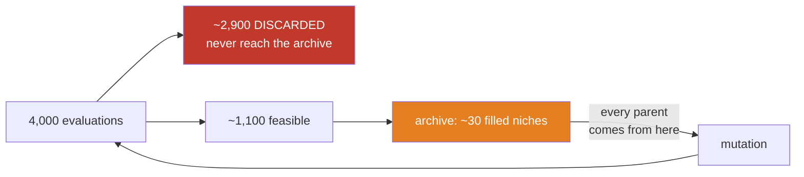

# #101 — 70–75% discarded, and what it actually costs

Diagnosis computed from the 32 runs already on disk (#88 rounds 3 and 4). No new compute was needed to
reach it.

---

## 1. The composition, warm vs cold

Medians over 8 seeds, 4,000 evaluations per arm:

| cause | warm (round 3) | cold (round 4) |
|---|---:|---:|
| **barely traded** — a fold under `min_trades`=5, `score_walkforward` invalid | **30.2%** | **45.5%** |
| drew down > 25% of profit | 30.1% | 21.9% |
| lost money | 8.9% | 7.2% |
| **total discarded** | **69.2%** | **74.6%** |

**The largest single cause is "barely traded", and removing the champion seed makes it much worse**
(30% → 46%). That is the honest reading of what cold start costs: without a seed, the search spends
nearly half its budget on configurations that do not trade enough to be scored at all.

---

## 2. The damage is not the discard rate. It is the population size.

MAP-Elites draws each parent **from the archive**:

```python
parent = rng.choice(list(archive.values()))["geno"]
```

So **the archive is the population.** And the archive only ever holds feasible solutions.

| | filled niches (median) |
|---|---:|
| warm, 4,000 evaluations | **33 of 81** |
| cold, 4,000 evaluations | **29 of 81** |

> **A 4,000-evaluation run mutates a pool of about thirty genomes, over and over.** A method whose
> entire purpose is to resist collapsing into a single basin is running with a population of thirty.

That reframes both #88 rounds. The axis fix raised the *quality* of those ~30 slots; it could not raise
their *number*, because the number is set by how many evaluations survive the feasibility gate.



---

## 3. The change being tested — stepping stones

A genome that made money but drew down 26% of it is not garbage. It is a near-miss, and in a
quality-diversity search near-misses are the **stepping stones** that reach the good regions.

- Keep scored-but-infeasible genomes in a **separate** archive, one per niche, ranked by how badly they
  miss (dollars outside the constraint).
- Let mutation draw parents from **elites ∪ stepping stones**.
- **Stepping stones never enter the result archive.** `best_overall`, `safest`, `simplest` and the saved
  portfolio stay feasible-only, so nothing downstream can adopt an infeasible strategy by accident.
  **Only parent selection widens.**

### What it cannot reach, stated up front

The **biggest** group — `invalid`, 45% of a cold run — has **no metrics at all**. `score_walkforward`
returns nothing, so there is no niche to place it in and no violation to rank it by. Reaching those would
require `evaluate` to score unconstrained, which changes far more than parent selection. **This fix
addresses ~30% of the discards, not 75%.**

---

## 4. The criterion — declared before the run

**Configuration:** NQ 4h · 1-minute frame · **cold start** · 4,000 evaluations · seeds 1–8 · bucketed
axis in both arms · the *only* difference is `--stepping-stones`.

**PRIMARY:**

> **`best_median_pnl` (stepping stones ON) > (OFF) in ≥ 6 of 8 seeds.**

Best elite anywhere in the archive. Chosen over the champion-zone metric deliberately: round 4 showed the
3–10 band is **empty in 3 of 8 cold runs**, so that metric cannot discriminate cold and would waste the
experiment.

**SECONDARY, reported:** parent-pool size, filled niches, `zone_best_median_pnl`, and the discard split.

### What each outcome means

- **Passes** → the feasibility gate was starving the search, and widening the parent pool is worth
  keeping. The flag becomes the default and #101 closes with a fix.
- **Fails** → the ~30-genome population is **not** what limits this search, and the discard rate is a
  property of the space rather than a defect. #101 closes as **measured and accepted**, with the
  population fact recorded so nobody re-derives it. The flag stays available and off.
- **Either way**, `invalid` (45%) remains untouched and becomes the follow-up question.

No second criterion will be invented after this run.
