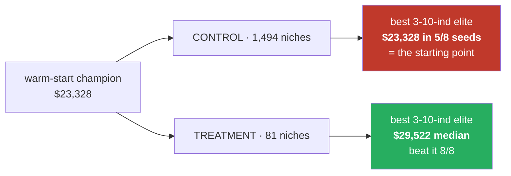

# #88 — the complete record

**MAP-Elites archive: "keep the best per niche" had silently become "keep the first per niche".**

Every experiment run, in order, including the ones that failed, the ones that measured the wrong thing,
and the three defects found in the measuring apparatus rather than in the subject.

---

## Part I — the defect

### 1. What MAP-Elites is supposed to do

Keep an **archive** holding the single best solution per *niche*, where a niche is a coordinate in
behaviour space. Ours has two axes:

| axis | meaning | design |
|---|---|---|
| `bd1` | worst-fold drawdown — how SAFE | `$2,000` buckets, capped at 8 ⇒ **9 rows** |
| `bd2` | number of indicators — how COMPLEX | **the raw count** ⇒ one column per possible value |

The archive only *selects* when a niche is visited more than once. The first visit fills an empty cell —
nothing is compared. The second visit asks **"is the newcomer better than the sitting elite?"** That
question is the entire method.

### 2. The defect

`bd2` was the raw count, so **the archive's width tracked the size of the indicator registry.**

| registry | columns | niches | evals (default) | visits per niche |
|---|---:|---:|---:|---:|
| 18 indicators (when written) | 19 | **171** | 400 | **2.34** |
| 165 indicators (today) | 166 | **1,494** | 400 | **0.27** |

Below one visit per niche, nearly every cell is filled by the first genome that lands in it and is never
challenged. **"Keep the best" becomes "keep the first"** — without failing, erroring, or looking any
different. The archive still comes back full and is still reported as a portfolio of elites.

**Class:** *a constant that is really a ratio* — the same family as #81 and the four call sites in #89.
Correct at the size it was written for, silently wrong afterwards.

### 3. The fix

Bucket the indicator axis: fine where champions live, coarse above, ending in an **unbounded catch-all**
so the width can never track the registry again.

| bucket | 0 | 1–2 | 3–4 | 5–7 | 8–10 | 11–15 | 16–25 | 26–50 | 51+ |
|---|---|---|---|---|---|---|---|---|---|
| rationale | none | very few | **champion zone** | **champion zone** | **champion zone** | many | lots | very many | crowd |

**9 columns instead of 166. 9 × 9 = 81 niches.** Registry-size independent by construction (rules
S2/S6).

---

## Part II — every experiment

### Round 0 — the local pilots (2 runs, discarded)

| # | config | result | disposition |
|---|---|---|---|
| 0a | 20 evals, local, **no `--ind-1min`** | **20/20 infeasible**, empty archive | **INVALID — wrong indicator frame** |
| 0b | 24 evals, local, `--ind-1min` | control completed, treatment never ran | **INVALID — my own `\| head -20` SIGPIPE'd the process** |

**0a** looked exactly like a broken fix. It was the wrong indicator frame: evaluating the *deployed* NQ
4h champion on the decision timeframe scores it **infeasible** (full DD $23,580 against the $9,623 the
25% rule allows), where the 1-minute frame scores it **$147,191 / $14,043 DD, feasible**. A MAP-Elites
run in the wrong frame therefore returns an empty archive and reads as a broken algorithm.

→ Fixed permanently: the 1-minute frame is now the **default** everywhere and `--tf-indicators` is the
explicit opt-out (commit `8c3c0ef`).

**0b** was a tooling error of mine: `| head -20` closed the pipe mid-run and SIGPIPE killed the process,
and because my `grep` filter did not match stderr it presented as a silent crash with exit code 0.

### Round 1 — 400 evaluations, 8 seeds (16 runs)

**Pre-registered criterion** (`ISSUE-88-explained-visually.md` §7, written before any run):

> improvements must rise **≥ 2×** over the control, or the fix did not work.

| seed | control improvements | treatment improvements | ratio | ≥2× |
|---:|---:|---:|---:|:--|
| 1 | 17 | 35 | 2.06 | ✅ |
| 2 | 15 | 26 | 1.73 | ❌ |
| 3 | 27 | 27 | 1.00 | ❌ |
| 4 | 23 | 36 | 1.57 | ❌ |
| 5 | 25 | 26 | 1.04 | ❌ |
| 6 | 15 | 23 | 1.53 | ❌ |
| 7 | 20 | 26 | 1.30 | ❌ |
| 8 | 17 | 30 | 1.76 | ❌ |

**FAILED — 1 of 8, median 1.55×.**

⚠️ **The single passing seed was seed 1, the first one run.** Stopping there would have produced a false
PASS. The noise check cost 3 minutes and inverted the verdict.

**What round 1 also found:** ~68% of evaluations never reach the archive at all. So the planned "4.9
visits per niche" was never achieved — the real figure is **1.46**. → became **#101**.

### Round 2 — 4,000 evaluations, 8 seeds (16 runs)

Budget raised 10× because at 400 evaluations only ~130 reach the archive. **Criterion unchanged**, plus a
seed-majority requirement (≥5/8) that makes it *harder*. Pre-registered in `ISSUE-88-prereg-round2.md`
and committed before the run.

| seed | control improvements | treatment improvements | ratio |
|---:|---:|---:|---:|
| 1 | 320 | 129 | 0.40 |
| 2 | 321 | 100 | 0.31 |
| 3 | 305 | 134 | 0.44 |
| 4 | 271 | 114 | 0.42 |
| 5 | 260 | 120 | 0.46 |
| 6 | 285 | 105 | 0.37 |
| 7 | 292 | 92 | 0.32 |
| 8 | 342 | 110 | 0.32 |

**FAILED — 0 of 8, median 0.39×.** Secondary (comparisons ≥2×): **FAILED — 0 of 8, median 1.30×.**

**The criterion did not merely fail. It inverted.** The control scored **2.5× MORE** improvements.

### The diagnosis that came out of the inversion

| | control (1,494 niches) | treatment (81 niches) |
|---|---:|---:|
| niches filled (median) | 260 | 33 |
| improvements | 299 | 112 |
| **comparisons** (improvements + rejections) | 962 | **1,291** |

The treatment did **more** comparing and **won fewer** of them. Because:

> **An archive full of weak first arrivals is EASY to improve. An archive of genuine elites is HARD to
> improve.** So the improvement count *rises* as the archive gets *worse*.

**The metric I registered was anti-correlated with the property it stood for.** No budget and no number
of seeds could have fixed that. **A counter that goes up when things get worse is not a weak
measurement, it is a wrong one.**

### Round 3 — same run, archive contents captured (16 runs)

Round 2 recorded only counters; the bench discarded the archive itself. Round 3 re-ran the identical
configuration with the contents captured.

**Reproducibility check, unplanned but useful:** round 3 reproduced round 2 **exactly on every seed** —
identical improvements, identical fill counts, ~25 minutes apart. **The harness is deterministic given a
seed.**

**Pre-registered criterion** (`ISSUE-88-prereg-round3.md`, committed before the run):

> `zone_best_median_pnl` (treatment) > (control) in **≥ 6 of 8** seeds

where the zone is **3–10 indicators** — the region every deployed champion occupies.

| seed | control zone best | treatment zone best | wins | ctl zone entries | trt zone entries |
|---:|---:|---:|:--:|---:|---:|
| 1 | $27,475 | $28,574 | ✅ | 12 | 13 |
| 2 | $23,709 | $30,847 | ✅ | 4 | 5 |
| 3 | $23,328 | $26,056 | ✅ | 11 | 13 |
| 4 | $23,328 | $28,005 | ✅ | 17 | 17 |
| 5 | $27,433 | $31,892 | ✅ | 8 | 7 |
| 6 | $23,328 | $32,870 | ✅ | 7 | 9 |
| 7 | $23,328 | $29,623 | ✅ | 4 | 8 |
| 8 | $23,328 | $29,422 | ✅ | 3 | 4 |

**PASSED — 8 of 8.** Median $23,328 → $29,522, **+23.1%** per-seed median.

Secondary:

| | control median | treatment median | treatment wins |
|---|---:|---:|---:|
| zone total elite P/L | $100,888 | $176,708 | 7/8 |
| best anywhere in archive | $32,923 | $35,035 | 6/8 |
| zone entries | 8 | 8 | 6/8 |

### The number that explains everything

**$23,328 is the median fold P/L of the warm-start champion** — the strategy the run is *handed* before
it starts.

| | best 3–10-indicator elite **is exactly the seeded champion** |
|---|---|
| control (broken axis) | **5 of 8 seeds** |
| treatment (bucketed) | **0 of 8** |

> **In 5 of 8 runs the broken archive spent 4,000 evaluations and gave back the strategy it started
> with** — while filling 260 niches and logging 299 "improvements".

### Round 4 — the cold-start replication (16 runs)

**Every round above ran `warm_start=True`.** That was the *default*, not a choice, and I neither stated
it nor questioned it.

Round 3's headline is defined in terms of the seeded champion — cold, there is no such object. And the
seeding plausibly *drives* the effect rather than merely enabling it: one strong genome dropped into a
1,494-niche archive gives mutation an enormous number of empty niches to spill into, which is precisely
the regime that produces first-fills instead of comparisons. **The axis and the seeding interact, and
rounds 1–3 measured them together.**

Correct status of round 3 until round 4 reports: **a result about warm-started MAP-Elites, not yet a
result about MAP-Elites.**

Criterion for round 4: **identical to round 3, unchanged**, so the two are directly comparable.
Pre-registered in `ISSUE-88-prereg-round4-coldstart.md`, committed before the run.

→ **Result: see `ISSUE-88-ROUND4-coldstart-result.md`.**

---

## Part III — the apparatus was wrong three times

Every one of these was a defect in the *measuring instrument*, not in the subject:

| # | defect | how it presented | consequence |
|---|---|---|---|
| 1 | **The `improvements` counter conflated first-fill with real improvement** — `consider()` returned `True` for both | a run that never compared anything logged hundreds of "improvements" | the degraded regime could never have appeared in any log |
| 2 | **`niche_label` indexed a 9-entry tuple with the control's raw coordinate** (up to 165) | `IndexError` at the **last step** of a completed run | 400 paid-for evaluations nearly lost. Presentation code must never be able to lose a measurement |
| 3 | **`infeasible` was one number covering three different failures** — invalid / lost money / drawdown | "70% infeasible" with no way to act on it | split into `invalid` / `pnl_neg` / `dd_over` + a bootstrap-vs-mutation breakdown → #101 |

And one in a test:

> **`test_behavior_binning` asserted `== (2, 8)` and was GREEN throughout.** It was not protecting the
> design — it **pinned the defect**, because it asked *"does the axis equal the count?"* instead of
> *"can the archive still choose?"*. Updated in place with the reason recorded at the assertion.

---

## Part IV — what the discards revealed (#101)

Measured across 4 seeds at 400 evaluations, medians:

| cause | share of all evaluations |
|---|---:|
| drew down > 25% of profit | **~36%** |
| barely traded (a fold under `min_trades`=5) | **~24%** |
| lost money (`full_pnl ≤ 0`) | **~9%** |
| **total discarded before reaching a niche** | **~68%** |

> **Archive coverage is capped by the feasibility rate, not by the niche count.** The fixed archive fills
> a median 22 of 81 niches. Adding niches back, or spending more evaluations, does not address that.

Identical in both arms, so it cannot explain a difference between them — but it caps what either can
achieve. Tracked as **#101**, open.

---

## Part V — what shipped

| commit | change |
|---|---|
| `fbf210a` | bucketed indicator axis; first-fill vs improvement counted separately; niche labels; 11 new tests |
| `8c3c0ef` | **1-minute indicator frame becomes the default**; `--tf-indicators` is the opt-out; one shared flag definition; `niche_label` made loss-proof |
| `dcf99b8` | round 1 result — criterion failed, recorded |
| `f1dfca2` | `infeasible` split three ways + by phase (#101) |
| `427c97d` | round 2 pre-registration |
| `9351acf` | round 3 pre-registration |
| `739d70f` | round 3 result — PASS 8/8 |
| `95e1ebe` | explainers + HTML updated with the measured outcome and the 4.9→1.46 correction |
| `414f94c` | **cold start becomes the default** (#102); `--warm-start` is the opt-in |
| `2c149de` | round 4 pre-registration |

**Server suite: 1,221 passed / 1 skipped / 0 failed.**

---

## Part VI — the process record

Four criteria, each written down and committed **before** its run:

| round | criterion | result |
|---|---|---|
| 1 | improvements ≥2×, 400 evals | **FAILED** — 1/8 |
| 2 | improvements ≥2×, 4,000 evals | **FAILED** — 0/8, inverted |
| 2 | comparisons ≥2× (secondary) | **FAILED** — 0/8 |
| 3 | best champion-zone elite (outcome) | **PASSED** — 8/8 |
| 4 | same, cold start | see the round-4 report |

**What kept it honest:** each criterion existed in git before its result did, so the two failures could
not be quietly dropped and the passing criterion could not have been chosen *because* it passed. When
round 2's secondary metric was one I had already seen at a smaller budget, that was disclosed in the
pre-registration rather than presented as a blind prediction.

**The lesson worth carrying:** rounds 1 and 2 measured the archive's **process** — how busy it was.
Round 3 measured what it **contained**. Only the second kind of measurement can answer "is this thing
any good?", and the first kind can point confidently in the wrong direction.

---

## Part VII — what is still not claimed

| | |
|---|---|
| ❌ | That earlier MAP-Elites results are valid — they came from the broken shape (**#90**, open) |
| ❌ | That MAP-Elites beats the ordinary optimizer — never compared |
| ❌ | That the 68% discard rate is acceptable (**#101**, open) |
| ⚠️ | That the benefit survives cold start — **round 4 answers this**; until it reports, the claim is scoped to warm-started search |
