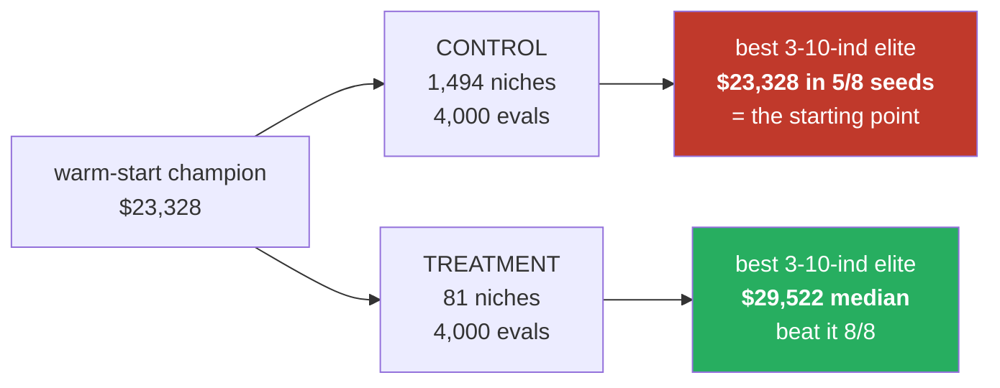

# #88 — won, on the third criterion, and the third is the one that was right

**NQ 4h · 1-minute indicator frame · 4,000 evaluations per arm · 8 seeds · control = the pre-#88
raw-count axis · both arms in one process, axis the only difference.**

---

## 1. The result

Pre-registered in `ISSUE-88-prereg-round3.md` before the run:

> **PRIMARY: `zone_best_median_pnl` (treatment) > (control) in ≥ 6 of 8 seeds.**

| | |
|---|---|
| **treatment wins** | **8 of 8** |
| control best 3–10-indicator elite, median | **$23,328** |
| treatment best 3–10-indicator elite, median | **$29,522** |
| median per-seed uplift | **+23.1%** |

**PASS.** These quantities had never been computed for either arm before the run — the bench discarded
the archive contents and kept only counters — so this was a blind prediction.

---

## 2. The single number that explains the whole issue

**$23,328 is the median fold P/L of the warm-start champion**, the strategy the run is *handed* before
it starts.

| | seeds whose best 3–10-indicator elite **is exactly the seeded champion** |
|---|---|
| control (broken axis) | **5 of 8** |
| treatment (bucketed axis) | **0 of 8** |

> **In 5 of 8 seeds the broken archive spent 4,000 evaluations and gave back the strategy it started
> with.** It looked like it was working the whole time — the archive filled 260 niches, the log reported
> 299 improvements — and in the region anything is actually deployed from, it found nothing.

The fixed archive beat the champion in every seed.

---

## 3. Full results

| seed | control zone best | treatment zone best | treatment wins | ctl zone entries | trt zone entries |
|---:|---:|---:|:--:|---:|---:|
| 1 | $27,475 | $28,574 | ✅ | 12 | 13 |
| 2 | $23,709 | $30,847 | ✅ | 4 | 5 |
| 3 | $23,328 | $26,056 | ✅ | 11 | 13 |
| 4 | $23,328 | $28,005 | ✅ | 17 | 17 |
| 5 | $27,433 | $31,892 | ✅ | 8 | 7 |
| 6 | $23,328 | $32,870 | ✅ | 7 | 9 |
| 7 | $23,328 | $29,623 | ✅ | 4 | 8 |
| 8 | $23,328 | $29,422 | ✅ | 3 | 4 |

**Secondary** (reported, not decisive):

| | control median | treatment median | treatment wins |
|---|---:|---:|---:|
| zone total elite P/L | $100,888 | $176,708 | 7/8 |
| best anywhere in archive | $32,923 | $35,035 | 6/8 |
| zone entries | 8 | 8 | 6/8 |

---

## 4. Why it took three criteria, and what that cost

| round | criterion | result |
|---|---|---|
| 1 | improvements ≥ 2× control, 400 evals | **FAILED** — 1/8 seeds, median 1.55× |
| 2 | improvements ≥ 2× control, 4,000 evals | **FAILED** — 0/8, median **0.39×** (inverted) |
| 2 | comparisons ≥ 2× (secondary) | **FAILED** — 0/8, median 1.30× |
| 3 | best champion-zone elite, outcome | **PASSED** — 8/8 |

Rounds 1 and 2 measured the archive's **process**. Round 2 inverted, and that inversion was the clue:

> **An archive full of weak first arrivals is easy to improve. An archive of genuine elites is hard to
> improve.** So the improvement count *rises* as the archive gets *worse*.

The control racked up 299 improvements precisely *because* its incumbents were junk. The metric was
anti-correlated with the property it was standing in for. **A counter that goes up when things get worse
is not a weak measurement, it is a wrong one** — and no budget or seed count would ever have fixed it.

What kept this honest: each criterion was written down and committed **before** its run, so the two
failures are on the record and the third could not be a metric picked because it passed.

---

## 5. What is now established

| | |
|---|---|
| ✅ | The archive shape defect is real, and it **cost strategy quality**: +23% median on the deployed-relevant region |
| ✅ | The broken archive returned its own starting point in **5/8** runs while reporting hundreds of improvements |
| ✅ | 1,494 niches → 81, fixed against future library growth (rules S2/S6) |
| ❌ | Still does **not** validate earlier MAP-Elites results — those came from the broken shape (**#90**) |
| ❌ | Still no comparison against the ordinary optimizer |
| ⚠️ | **68% of every evaluation is discarded before reaching the archive** in *both* arms (**#101**) |

**#88 closes.** The remaining budget question is #101, where two thirds of the search is thrown away —
that ceiling applies to the fixed archive just as it did to the broken one.
