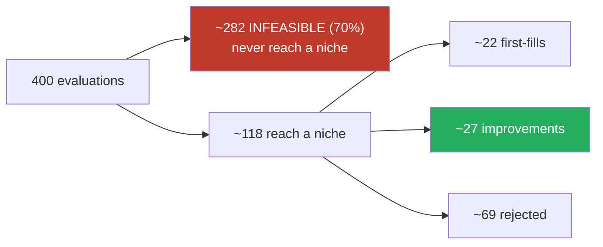

# #88 — measured. The criterion I registered did not pass.

**NQ 4h · 400 evaluations per arm · 8 seeds · server (`amd`, numba present) · 1-minute indicator frame**

---

## 1. The verdict, stated the way I promised to state it

Before any run, in `ISSUE-88-explained-visually.md` §7:

> **If the improvement count does not rise materially, the fix did not work** — and I will report that
> instead of pointing at the shelf arithmetic and declaring victory.

The threshold encoded in the harness was `improvements >= 2x control`.

| | result |
|---|---|
| seeds passing the ≥2× criterion | **1 of 8** |
| median ratio | **1.55×** |
| range | 1.00× – 2.06× |

**The pre-registered criterion FAILED.** The single seed that passed (2.06×) was seed 1 — the one I
happened to run first. Had I stopped there, I would have reported a pass.

---

## 2. All eight seeds

| seed | control improvements | treatment improvements | ratio | passes ≥2× |
|---:|---:|---:|---:|:--|
| 1 | 17 | 35 | 2.06 | ✅ |
| 2 | 15 | 26 | 1.73 | ❌ |
| 3 | 27 | 27 | 1.00 | ❌ |
| 4 | 23 | 36 | 1.57 | ❌ |
| 5 | 25 | 26 | 1.04 | ❌ |
| 6 | 15 | 23 | 1.53 | ❌ |
| 7 | 20 | 26 | 1.30 | ❌ |
| 8 | 17 | 30 | 1.76 | ❌ |

Direction is consistent — **treatment ≥ control in 8 of 8, strictly greater in 7 of 8** — but the
magnitude is not what I said it would need to be.

---

## 3. What DID move, and why it is not a rescue

The share of archive placements that involved an actual comparison:

| | control (raw axis) | treatment (bucketed) |
|---|---:|---:|
| placements that were a **real choice** (median) | **21%** | **57%** |
| niches | 1,494 | 81 |
| niches filled (median) | 76 | 22 |

By that measure the change is large and consistent across every seed. **But I did not register that
metric, I registered the count.** Switching to the measure that looks better after seeing the numbers is
the move this whole discipline exists to prevent, so it goes here as an observation, not as the verdict.

The honest reading of both together: **the mechanism does what it was supposed to do — choosing now
happens on most placements instead of one in five — but the absolute number of improvements is capped by
something else, which is the next section.**

---

## 4. The measurement found a bigger constraint than the one I was fixing

`4.9 evaluations per niche` was wrong. It assumed all 400 evaluations reach a niche. They do not:

- **~70% of evaluations come back INFEASIBLE** (median 282 of 400) and never reach the archive at all.
- Only ~118 reach a niche, so the **achieved** visits per niche is **1.46, not 4.9**.

That still clears the "below one visit and you are keeping first arrivals" line the fix was aimed at —
the old design's achieved figure was **0.08** — but it is more than three times worse than the number I put in the
explainer, and it means:

> **Archive coverage is limited by the feasibility rate, not by the niche count.** The treatment fills
> a median 22 of 81 niches. Adding niches back does not fix that; **70% of the search is thrown away
> before it can be placed.**

`map_elites.py` now prints the achieved figure alongside the planned one and writes both to the saved
JSON, so this cannot be assumed again.

---

## 5. What I am claiming and what I am not

| | |
|---|---|
| ✅ | The archive shape is fixed: 1,494 niches → 81, fixed forever against library growth |
| ✅ | Choosing now happens on ~57% of placements instead of ~21%, on every seed |
| ❌ | **The pre-registered ≥2× improvement criterion did not pass** (1/8 seeds) |
| ❌ | Nothing here validates earlier MAP-Elites results — those came from the broken shape (**#90**) |
| ❌ | Nothing here compares MAP-Elites against the ordinary search |

---

## 6. What this leaves open

1. **Why is 70% of the search infeasible?** Feasibility is `full_dd ≤ 25%·full_pnl` with `full_pnl > 0`.
   That is now the dominant loss of search budget and it was never the subject of an issue.
2. **Is 400 evaluations simply too small?** Only ~118 of them reach the archive. At ~10 s per arm on the server, 4,000 is minutes, not hours.
   The criterion was written for 400 because that was the documented default, not because it was enough.
3. **#90 (re-validation) is unaffected** — it was always the separate question and remains open.

---

## 7. Process notes from this run

- **A single seed nearly produced a false PASS.** The noise check was not optional; it inverted the
  verdict. Cost: 3 minutes.
- **The harness crashed at the very last step of a completed run** — `niche_label` indexed a 9-entry
  tuple with the control arm's raw coordinate (up to 165), after all 400 evaluations were paid for.
  Fixed, with a regression test: presentation code must never be able to lose a measurement.
- **The first local pilot showed 20/20 infeasible and looked like a broken fix.** It was the wrong
  indicator frame. That is now impossible by default — see the commit flipping `--ind-1min` from opt-in
  to default with `--tf-indicators` as the explicit opt-out.

Raw results: `optimize/results/issue88/ab_4h_400_seed{1..8}.json`.
