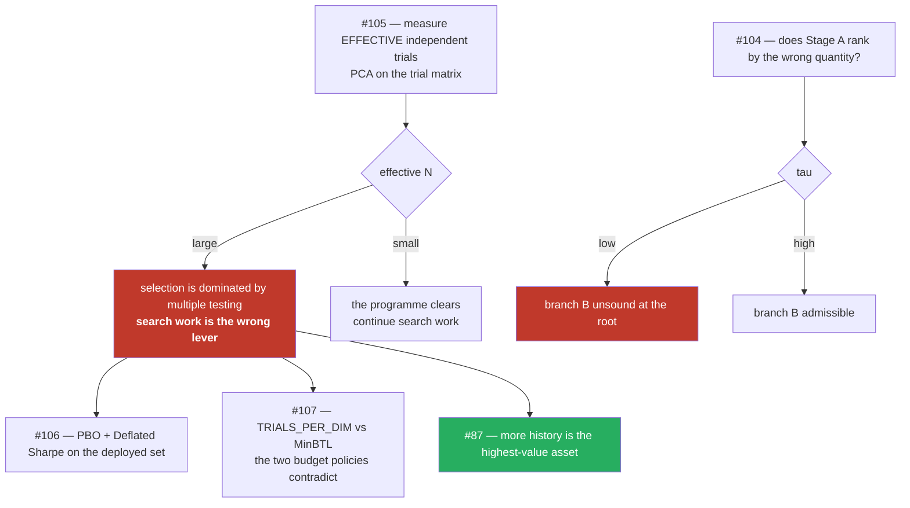

# #103 — the answers

*Read this first. Parts 1–5 are the working.*

The question behind #81, #85, #88, #89, #90 and #101 was: **we grew the indicator library ~10×, the
search keeps breaking, is this searchable at all?**

The answer is that **the search was never the binding constraint** — and the evidence for that comes
from three independent directions that agree.

---

## The one-paragraph answer

Selecting *which* 7 of 165 indicators is statistically easy: the sharp threshold for sparse recovery
needs ~79 observations and we have 2,119 — a **27× margin**. What is not easy, and is violated by three
orders of magnitude, is **validating** the winner: with 1.38 years of history, the number of independent
trials that keeps an in-sample Sharpe of 1 meaningful is **≈ 5**, and we run **4,000–47,100**. Making
the search better raises the in-sample maximum found per unit of budget, which is exactly the quantity
that is spurious at this sample size. That is why four of our five pre-registered search improvements
failed, and why the one that passed evaporated when a condition changed.

---

## Q1 — Is searching a space this size efficient, or even possible?

**Possible, but it cannot be justified by coverage.**

| | |
|---|---|
| on/off subsets | 2¹⁶⁵ = 10^49.7 |
| deployable region (which 7 of 165 × their parameters) | **10^36.9** |
| covered by 4,000 evaluations | 10⁻³³·³ |
| covered by **one trillion** evaluations | 10⁻²⁴·⁹ |

Eight orders of magnitude more compute moves the exponent by eight. **No budget makes this a covered
search.** It must be justified by structure in the objective or a prior — never by coverage.

---

## Q2 — Are the effects of our fixes linear? Proved? Predicted with a positive win score?

**No, no, and no — measured at 1 pass in 8.**

| criterion (all pre-registered) | result |
|---|---|
| #88 R1 improvements ≥2×, 400 evals | FAIL 1/8 |
| #88 R2 improvements ≥2×, 4,000 evals | FAIL 0/8, **inverted** |
| #88 R2 comparisons ≥2× | FAIL 0/8 |
| **#88 R3 champion-zone best, warm** | **PASS 8/8, +23.1%** |
| #88 R4 same, cold | FAIL 3/8 |
| #88 R5 best-anywhere, cold, fresh seeds | FAIL 5/8 |
| #101 stepping stones | FAIL 1/8, peak **worse** |
| #99 conditional parameters | FAIL, do not adopt |

Linearity cannot even be asked — there is no stable set of positive effects to compose. **And a 1-in-8
rate on carefully-reasoned interventions is itself evidence about the object being modified.**

---

## Q3 — Have we hit a dead end?

**Yes — but not the one the issue was framed around.** It is not that the algorithm cannot search
10^36.9. It is that **1.38 years cannot validate a selection from it.**

**Bailey, Borwein, López de Prado & Zhu (2014)**, Minimum Backtest Length — *verified against the
authors' own three worked examples before use*:

| what we run | N | years required | we have |
|---|---:|---:|---:|
| MAP-Elites run | 4,000 | **13.2** | 1.38 |
| full NSGA-III study | 47,100 | **17.8** | 1.38 |

> **1.38 years supports ≈ 5 independent trials. We run 4,000–47,100.**

Two further independent lines agree:

- **Adaptive data analysis** (Dwork et al., *Science* 2015): adaptive querying needs `n` scaling
  **linearly** with the number of queries, and that dependence is *"inherent"*. Our search is maximally
  adaptive. 4,000 evaluations needs ~4,000 observations; we have 2,119.
- **Empirically, in feature selection** (Reunanen, JMLR 2003): intensive search beat greedy search on
  cross-validation in **50 of 60** cases and **lost on test data in 32 of 60** — **+3.56 pp in-sample,
  −0.44 pp out-of-sample.**

### The corollary that reframes the whole programme

> **A better optimiser makes this worse.** It finds a higher in-sample maximum from the same `N`, and
> `E[max_N]` is precisely what MinBTL says is spurious at this sample size.

---

## Q4 — If this algorithm is exhausted, is there a better one?

**"We exceeded all available algorithms" is too strong.** But the honest answer is layered.

| | |
|---|---|
| our space | ~165 binary + 295 continuous ≈ **460 dimensions** |
| GP-based BO folk limit | ~10 dimensions |
| CoCaBO (2020) | 22 continuous + 5 categorical |
| Casmopolitan (2021) | 100 binary + 100 continuous |
| SMAC (2011) | 76 parameters |
| TPE (2013) | 238 |
| **Auto-WEKA (2013)** | **786** |

Methods exist at our scale — **random-forest surrogates (SMAC) and TPE** — and both are **joint**, not
staged. For the QD branch specifically, **CMA-MAE is explicitly designed to be resolution-invariant**,
which is precisely the defect #88 was. *But* it has a documented **performance cliff below 200×200**
archives and ours is **9×9**.

**And none of this touches the binding constraint.** A better algorithm searches better; it does not
create history.

---

## Q5 — Is the two-stage decomposition mathematically sound?

**No theorem supports it here.** This is the answer the owner asked for, and it is negative on three
levels.

**Level 1 — the formal condition.** Stage A ranks by `h(S) = f(S,θ₀)`, not `g(S) = max_θ f(S,θ)`. Two-
stage recovers the joint optimum **iff the parameter headroom `Δ(S) = g(S) − h(S)` is constant across
structures**. It cannot be: indicators carry 0–5 parameters (23 have none), grids from 1 to 2.3×10⁹.

**Level 2 — the measured blindness.** *Stage A judges the median indicator at 1 of 4,851 settings —
**0.02%** of its behaviour.* For the ~157 indicators absent from the champion, that one setting is the
**factory default from the schema**. Already in `two_stage.py`'s own docstring as **#85**, never fixed.

**Level 3 — the theory says no guarantee exists.** Tseng (JOTA 2001): *"If f is not (pseudo)convex,
then an example of Powell shows that the method may cycle without approaching any stationary point."*
Coordinate descent can stick at a non-stationary point even when f is **convex**, unless the non-smooth
part is **separable**. Our objective is non-convex, non-differentiable, non-separable (the k-of-n vote
gate couples indicators) and plateau-ridden — **not one sufficient condition holds**. Powell's
counterexample is *convex in each variable individually* and staging still fails.

**And the same proxy failure has been measured in a neighbouring field.** Neural architecture search
ranks structures by a shared-weight proxy exactly as our Stage A does:

| space size | Kendall τ, proxy vs truth |
|---:|---:|
| 91 | 0.441 |
| 2,500 | 0.314 |
| 64,000 | 0.214 |
| 423,000 | **0.195** |

> *"the ranking disorder increases with the space complexity."* **Our library went 18 → 165.**

**#104** runs this measurement on us. Its pre-registered failure threshold (τ < 0.4) sits inside the
band NAS reports.

---

## Q6 — Should the digital and analog halves get specialist algorithms?

**The idea is sound engineering and the field agrees with the diagnosis — but it is gated, and it does
not address the binding constraint.**

- **Gated by Q5.** Two excellent halves do not rescue a decomposition that ranks by the wrong quantity.
- **The field moved the other way.** Auto-WEKA/CASH: *"simultaneously selecting a learning algorithm
  and setting its hyperparameters, **going beyond previous work that addresses these issues in
  isolation**."* That is evidence for **branch A** (joint) over branch B (staged).
- **Neither branch changes `T`.** Both are search improvements, and Q3 says search improvements are the
  wrong lever right now.

Both branches exist (`research/arch-a-one-stage-mixed`, `research/arch-b-two-stage-specialist`).
**Nothing is implemented on either until #104 reports.**

---

## What the literature says we already got right

Worth recording, because most of this document is corrective:

- **#88's reasoning was published in 2016.** Vassiliades et al.: *"The increase in the number of niches
  results in **reduced selective pressure** … even when memory is not a problem"*, with **fewer niches**
  as the fix. We hit it independently and applied the same remedy (1,494 → 81).
- **#101's negative may be the cleanest ablation on record.** No published study runs a with/without
  test of an infeasible archive inside MAP-Elites; the one keep-vs-discard comparison that exists
  reports the answer is *"contingent on the particularities of the search space"*.
- **Our 2-D behaviour space is normal** (*"2 to 6 dimensions"*).
- **Our evaluations-per-cell is not.** Published settings run **6.6 to 2,048** evals/cell. We achieve
  **1.46**.

---

## The order of work this implies

**#105 first.** It is cheap, it uses data already on disk, and every other question is conditional on
its answer.

---

## What is NOT claimed

- **Not** that the deployed book is invalid. Champions are separately OOS-checked; #87 flags the same
  shortage from the other side. This says the *marginal* return on search improvement is
  negative-to-zero — not that past selections are worthless.
- **Not** that the library should be shrunk. Sparse recovery needs ~79 observations to identify 7 of
  165; we have 2,119.
- **Not** that MAP-Elites or NSGA-III are the wrong algorithms. They are unvalidated at this sample
  size, which is different.
- **Not** that #88's or #101's engineering was wrong. #88's fix matches the published remedy; #101's
  negative fills a gap in the literature.
