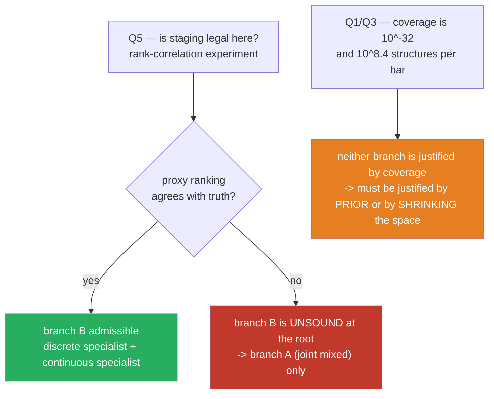

# #103 part 1 — how big is it really, and is staging even legal?

Everything in this document is computed from this repository's own schema and data. No literature is
used here; prior art is part 2. Every number is reproducible with the snippets quoted.

---

## 1. The size of the space, measured

From `indicators.library` as it stands (165 entries, 295 parameter dimensions, every parameter bounded
with a declared `step`):

| quantity | value |
|---|---|
| indicators | 165 |
| parameter dimensions | 295 |
| on/off subsets | 2¹⁶⁵ = **10^49.7** |
| parameter grid at declared step, all indicators | **10^592.7** |
| **joint space** (subset × its parameters) | **~10^642** |
| typical indicator's own parameter grid | median **4,851** settings |
| heaviest single indicator (`schaff_trend_cycle`) | 10^9.4 settings |
| indicators with no parameters at all | 23 |

The joint number is not the useful one — no search ever needs to consider a 165-indicator strategy.
The **deployable region** is what matters. Deployed champions use 3–10 indicators:

| quantity | value |
|---|---|
| choosing which 7 of 165 | C(165,7) = **580,688,008,560** = 10^11.8 |
| a 7-indicator strategy's own parameter grid | ~10^25.1 |
| **the 7-indicator region** | **~10^36.9** |

---

## 2. What a budget can cover

| budget | fraction of the 7-indicator region |
|---|---|
| 4,000 evaluations (a MAP-Elites run) | 10^−33.3 |
| 47,100 (a full NSGA-III study) | 10^−32.2 |
| 1,000,000 | 10^−30.9 |
| 1,000,000,000,000 | 10^−24.9 |

**A trillion evaluations would cover 10^−24.9 of the region.** Increasing the budget by eight orders of
magnitude moves the exponent by eight. There is no budget that makes this a covered search.

Even **ignoring parameters entirely** and asking only "which 7 indicators": a 47,100-trial study touches
**8.1 × 10⁻⁸** of the 580 billion structures.

> This is not an argument that the search is useless. It is an argument that the search **cannot be
> justified by coverage**, and therefore must be justified by something else — structure in the
> objective, or a prior that concentrates the budget. If neither exists, the search is sampling.

---

## 3. The constraint nobody has been costing: the data

| quantity | value |
|---|---|
| decision bars (NQ 4h) | **2,119** |
| span | 2025-01-01 → 2026-05-19 = **1.38 years** |
| bars per fold (5 folds) | **423** |
| 1-minute bars | 486,969 |

Set that against the structures alone:

> **10^8.4 candidate structures per decision bar.**
> 580 billion candidate 7-indicator structures. 2,119 observations to tell them apart.

Two immediate consequences, both already visible in closed issues:

- **#101's "45% barely traded" is explained by this line alone.** A fold is 423 bars. Requiring
  `min_trades = 5` in *every* fold, from a strategy that only enters on a gated multi-indicator vote,
  eliminates almost half the space before any optimiser is involved.
- **#87 already says the history is too short for a fair champion comparison.** This is the same
  constraint, arriving from the other direction.

---

## 4. Is staging legal? The condition, stated formally

Let a strategy be a pair **(S, θ)**: `S ⊆ {1…165}` the structure (which indicators), `θ ∈ Θ_S` their
parameters. Let `f(S, θ)` be the objective.

**Joint problem:**   maximise `f(S, θ)` over both.

**Two-stage as implemented:**

```
Stage A:   Ŝ = argmax_S  f(S, θ₀)      θ₀ FIXED  (champion values; factory defaults elsewhere)
Stage B:   θ̂ = argmax_θ  f(Ŝ, θ)
```

Define the **true value of a structure**  `g(S) = max_θ f(S, θ)` — what that structure is worth once
tuned. Stage A does not rank by `g`. It ranks by the proxy `h(S) = f(S, θ₀)`.

Since `θ₀` is one particular point, **`h(S) ≤ g(S)` always**, with equality only when `θ₀` happens to be
optimal for `S`. Write the gap as the **parameter headroom**:

```
Δ(S) = g(S) − h(S)  ≥ 0
```

### The theorem, in one line

> **Two-stage recovers the joint optimum if and only if the proxy ranking agrees with the true ranking
> at the top — which is guaranteed only when Δ(S) is constant across structures.**

If `Δ(·)` varies, `argmax h` and `argmax g` can differ, and the regret is `g(S*) − g(Ŝ)`, unbounded in
general.

### Is Δ constant here? No, and it cannot be

`Δ(S)` is the amount a structure gains from tuning. It depends on:

- how many parameters the selected indicators have (0 to 5 each, 23 have none at all),
- how large their grids are (median 4,851; largest 2.3 × 10⁹),
- how sensitive each is to its parameters near `θ₀`.

An indicator whose default happens to sit near its optimum has **Δ ≈ 0** and looks good. An indicator
whose default is poor has **large Δ** and looks useless — *even if its tuned form is the best available
in the library*. Stage A cannot distinguish "bad indicator" from "good indicator, wrong setting".

### The number that states the objection

**Stage A judges each indicator at exactly one setting.**

| | |
|---|---|
| median indicator | 1 of **4,851** settings = **0.0206%** of its behaviour |
| geometric mean across the library | **6.7 × 10⁻⁵** |

> **Stage A decides whether an indicator earns its place after seeing 0.02% of what that indicator can
> do.** For the ~157 indicators absent from the warm-start champion, the one setting it sees is the
> **factory default from the schema** — a number chosen by whoever wrote the indicator, never tuned for
> this market, this instrument, or this timeframe.

That is the owner's objection, and it is arithmetically correct.

### It is already documented in our own code

`two_stage.py`, in the module docstring, filed as **#85** and never fixed:

> *"freezing the indicator params means an indicator is judged at ONE parameter setting, and for the
> ~157 indicators absent from the warm-start champion that setting is the SCHEMA DEFAULT — never tuned
> for this market. An indicator that would win at a different value is eliminated before its values are
> explored."*

Verified in the source: `_stage_a_objective` evaluates `ctx.build_params(en, flip, ctx.champ_cont)`, and
`build_params` fills indicator parameters from `champ_ind_params`, which defaults to
`p["default"]` per the schema.

---

## 5. The experiment that decides it — and it is cheap

The condition above is **directly measurable**. It reduces to a rank correlation:

1. Sample **N structures** `S₁…S_N` from the deployable region (3–10 indicators).
2. For each, compute the proxy `h(Sᵢ) = f(Sᵢ, θ₀)` — **one evaluation each**.
3. For each, estimate the truth `g(Sᵢ) ≈ max over a fixed budget B of θ` — **B evaluations each**.
4. Measure **Kendall's τ** between the `h` ranking and the `g` ranking, and — more importantly —
   the **top-K overlap**: of the true best K structures, how many does the proxy put in its top K?

**Interpretation, fixed in advance:**

- **τ high and top-K overlap high** → staging is sound here, and Q6's branch B is admissible.
- **τ low or top-K overlap poor** → **two-stage is refuted as implemented**, regardless of how good
  either stage's algorithm is. No specialist optimiser for stage A can fix a stage that is ranking by
  the wrong quantity.

This is the same measurement the neural-architecture-search literature performs on weight-sharing
proxies, and it is the standard way that field decides whether a cheap proxy may stand in for the
expensive truth. (Prior art in part 2.)

---

## 6. The logical dependency that orders the whole programme

**Q5 gates Q6.**

The architecture proposal — split the problem physically, give the discrete half a discrete specialist
and the continuous half a continuous specialist — is *only sound if staging itself is sound*. Both
halves being individually excellent does not rescue a decomposition that ranks structures by the wrong
quantity.

So the order is forced:



---

## 7. What part 1 establishes

| question | status after part 1 |
|---|---|
| **Q1** — is search here efficient/possible? | Coverage is **10^−32 at best, at any budget**. The search cannot be justified by coverage. |
| **Q3** — dead end? | Not yet answered as a *search* question, but the **data** bound (10^8.4 structures per bar, 1.38 years) is a harder wall than the algorithm. |
| **Q5** — is two-stage sound? | **Condition derived** (Δ constant across structures), **shown to be violated in principle**, and the deciding experiment specified. Stage A sees **0.02%** of a typical indicator. |
| **Q6** — split architecture | **Gated by Q5.** Branches created; neither is justified until Q5 reports. |
| **Q2** — are the fixes' effects linear/predicted? | Not addressed here — needs the record of #81/#88/#89/#101 outcomes, part 3. |

**Nothing is implemented on either branch until Q5 has an answer.**
