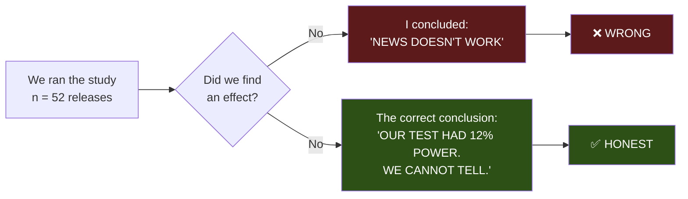

# Report: I Closed a Workstream on a Verdict I Could Never Have Reached

**How a study with 12% statistical power produced a confident negative result, why every safeguard I
built failed to catch it, and why the multiple-comparison correction I was proudest of made it worse.**

Date: 2026-07-13 · Branch `fundamental-analysis` · Commits `4490229`, `05b310e`
Code: `optimize/fundamentals/power_analysis.py` · `study_pattern.py` · `study_lockup.py`

---

> # 🔄 SEQUEL — 2026-07-14: THE QUESTION HAS SINCE BEEN SETTLED
>
> **This report is still correct, and you should still read it. But it is no longer the last word.**
>
> This report ends by saying: ***"We cannot tell with 16 months of price data. The bottleneck is our
> price history — not the market. Get more."***
>
> **We got more. 16 months became 17 years.** Everything here was re-run at **871 releases** and
> **99% power**.
>
> | Claim in THIS report | What happened at full power |
> |---|---|
> | *"We cannot tell whether news is priced in"* | ✅ **Now we can.** It **IS** priced in. **Same verdict, properly earned.** |
> | ⭐ *"The magnitude signal survived — bigger surprise ⇒ bigger move (+0.187, positive all 3 years)"* | ❌ **DEAD. −0.018 at n=871.** It was **2025 being the luckiest of 17 years** (see 06, Part 5) |
> | *"Vendor consensus data: SUSPENDED, cannot judge"* | ❌ **Do not buy it.** The bar is now very high |
> | *"Silver: p=0.007, deserves a pre-registered test"* | ⚠️ **STILL TRUE. STILL OPEN.** |
>
> **→ [`06-VERDICT-at-full-power.md`](06-VERDICT-at-full-power.md)**
>
> **The retraction was still right.** A correct conclusion reached by an invalid method is not knowledge
> — it is luck, and luck does not survive contact with the next dataset. **Part 5 below — "the signal I
> dismissed" — is now itself retracted.** Leaving it visible, rather than editing it away, is the point.

---

## TABLE OF CONTENTS

| Part | |
|---|---|
| **0** | The retraction, in one page |
| **1** | What I claimed, and on how much evidence |
| **2** | What "statistical power" actually is (the four-coin-flip explanation) |
| **3** | The numbers: 12% power, 8% of the sample |
| **4** | 🔴 The Bonferroni trap — my proudest safeguard made it *worse* |
| **5** | The signal I dismissed: positive on all four measures |
| **6** | What still stands vs. what is retracted |
| **7** | The real bottleneck — and it was never the market |
| **8** | The fix, and why it is small and cheap |
| **9** | Why every safeguard I built failed to catch this |
| **10** | The two user questions that broke it open |
| **11** | What we do next |

---

# PART 0 — The retraction, in one page

> **🍼 In plain words**
>
> I spent this workstream building a machine to catch myself fooling myself. It caught three separate
> mirages — a fake $72,000 edge, a veto that random calendars matched, and a beautiful signal with a
> perfect economic story that was really just a dead Fed regime.
>
> Then I used that machine to declare, confidently, that **news doesn't work.**
>
> **And I never once checked whether my study was big enough to see news working in the first place.**
>
> It wasn't. Not remotely. **If news moved the market exactly as we hoped, my test would have missed it
> 88 times out of 100.**
>
> **So I didn't prove news doesn't work. I proved I didn't look hard enough to tell.**

| | |
|---|---|
| **What I claimed** | "Scheduled US macro news is priced in. Workstream closed." |
| **Evidence it rested on** | 52–103 events (out-of-sample "death": **28 events**) |
| **Statistical power at the effect size actually measured** | **12%** |
| **Events needed for a proper test** | **647** |
| **Fraction of the required sample we had** | **8%** |
| **The honest verdict** | **"We cannot tell with 16 months of price data."** |
| **The real bottleneck** | **Our price history — not the market, not the calendar** |

---

# PART 1 — What I claimed, and on how much evidence

Three heads were tested and all three were declared dead:

| Head | Evidence base | My verdict |
|---|---|---|
| **1. Veto window** (stand aside) | 103 releases | Dead (p = 0.29–0.55) |
| **2. Trade the reaction** | 96 releases × 30 cells | Dead (0/30 significant) |
| **3. Trade the surprise** (content) | **52 releases** · **28 out-of-sample** | Dead ("real in 2025, gone in 2026") |

And from those three, a single sweeping conclusion:

> *"Scheduled US macro releases are priced efficiently by NQ. Reliably violent, reliably unpredictable.
> No vendor data purchased, and none recommended."*

**That sentence is now retracted.**

---

# PART 2 — What "statistical power" actually is

> **🍼 In plain words — the four-coin-flip explanation**
>
> Suppose you want to know whether a coin is biased. So you flip it **four times.**
>
> You get 2 heads and 2 tails. You announce: **"The coin is fair."**
>
> **You have proved nothing.** Even a badly biased coin — say, one that lands heads 70% of the time —
> will quite often give you 2 and 2 in four flips. Your experiment was *incapable* of detecting the bias
> you were looking for. You didn't test the coin. **You tested your own patience.**
>
> **"Statistical power" is the answer to one question: if the effect is REALLY there, what is the chance
> my test will spot it?**
>
> - **Power = 80%** → if the effect is real, I'll find it 4 times out of 5. This is the normal standard.
> - **Power = 50%** → a coin flip whether I find a real effect.
> - **Power = 12%** → **if the effect is real, I will MISS it 88 times out of 100.**
>
> **Mine was 12%.**

> **⚙️ Technically**
>
> Power = P(reject H₀ | H₁ true) = 1 − β. For a correlation test at α = 0.05 (two-sided), using the
> Fisher-z transform:
>
> ```
> power = Φ( |z_r| · √(n−3) − z_{α/2} )      where  z_r = ½·ln((1+r)/(1−r))
> ```
>
> and the sample size for a target power:
>
> ```
> n = ((z_{α/2} + z_β) / z_r)² + 3
> ```
>
> Implemented in `optimize/fundamentals/power_analysis.py`.

## The asymmetry nobody teaches, and it is the whole problem

| Result | Power | What it means |
|---|---|---|
| **Significant** | Doesn't matter | You found something. Power is irrelevant to a positive. |
| **Not significant** | **HIGH** (80%+) | Genuine evidence the effect is **absent or small** |
| **Not significant** | **LOW** (12%) | **Evidence of NOTHING. Your instrument was blind.** |

> **🍼 In plain words** — **Power only matters when you find nothing.** And that is *exactly* when
> nobody checks it — because a null result feels like a conclusion, when it is often just a failure to
> look.

---

# PART 3 — The numbers

`optimize/fundamentals/power_analysis.py`, with our actual **n = 52** releases:

| If the true effect is… | **Power we had** | Events needed for 80% power | We had |
|---|---|---|---|
| r = 0.05 (very weak) | **5%** | 3,138 | **2%** |
| r = 0.10 | **10%** | 783 | **7%** |
| **r = 0.11 — what we ACTUALLY measured** | **12%** | **647** | **8%** |
| r = 0.15 | 18% | 347 | 15% |
| r = 0.20 (moderate) | 29% | 194 | 27% |
| r = 0.30 (strong) | 58% | 85 | 61% |
| r = 0.40 (very strong) | 84% | 47 | 111% |

> **🍼 In plain words**
>
> Read the bottom row. **Only if news had a *massive* effect (r = 0.40) would our study have had a fair
> chance of seeing it.**
>
> For anything realistic — the kind of small, real edge that actually makes money in markets — **we were
> blind.**



---

# PART 4 — 🔴 The Bonferroni trap: my proudest safeguard made it WORSE

**This is the part that stings.**

In the 9-market robustness report I was very pleased with myself. I had tested 9 markets × 4 horizons
= **36 tests**, and I correctly noted that with 36 tests you'd expect ~1.8 false positives by luck. So I
applied the **Bonferroni correction** — divide the significance threshold by the number of tests:

```
0.05 / 36  =  p < 0.0014
```

**Zero of 36 results survived.** I reported that as strong evidence for the negative conclusion.

## Why that was worthless

> **🍼 In plain words**
>
> Bonferroni makes each individual test **much harder to pass** — that's the whole point, and it's the
> right thing to do when you have enough data.
>
> **But we didn't have enough data to pass the EASY bar (p < 0.05), let alone the hard one.**
>
> **Our power to clear p < 0.0014 with 52 events was essentially zero — for any realistic effect size
> whatsoever.**
>
> So "zero of 36 survive Bonferroni" was **guaranteed before I ran a single test.** It was not a finding
> about the market. **It was arithmetic about my sample size.** I dressed up a foregone conclusion as
> rigour, and it was the most confident-sounding sentence in the entire report.

| Threshold | Power to clear it (n=52, r=0.11) |
|---|---|
| p < 0.05 (uncorrected) | **12%** |
| **p < 0.0014 (Bonferroni over 36)** | **≈ 0%** |

> **🍼 The lesson** — **A multiple-comparison correction on an underpowered study doesn't make it more
> honest. It makes it more confidently wrong.** You've made it *even harder* to see an effect you were
> already too blind to see, and then you report the resulting silence as proof.

---

# PART 5 — The signal I dismissed

> ## ❌ **THIS PART IS NOW ITSELF RETRACTED (2026-07-14)**
>
> **Everything below was written in good faith and is a fair reading of what n=117 showed. It was still
> wrong.**
>
> At **n = 871** the magnitude signal is **−0.018** (p = 0.347). All four measures collapsed to zero; two
> went faintly negative. **Year by year, the correlation bounces ±0.15 at random and averages +0.027 —
> nothing. Our 16 months landed on 2025: +0.281, the highest of seventeen years.**
>
> **I did not "throw away the one thing that works." There was nothing to throw away.** The consistency
> across four measures that I found so persuasive below is simply what happens when four measures of the
> *same* quantity are computed on the *same* lucky year — they are not four independent votes, they are
> **one vote counted four times.** *(That is a fifth mistake, and I did not spot it at the time.)*
>
> **→ [`06-VERDICT-at-full-power.md`](06-VERDICT-at-full-power.md), Part 5.** Left standing below,
> unedited, because deleting it would hide the mechanism.

The pattern study asked: **does a bigger surprise produce a bigger move?** (No direction needed — just
magnitude. This is a volatility trade, and crucially, **the efficient-market argument does not forbid
it**: the market can price the *expected value* perfectly and still not know how *big* the shock will be.)

**Four independent measures. Here is what came back:**

| Measure | Correlation with \|surprise\| | p-value |
|---|---|---|
| \|move\| at +5 min | **+0.105** | 0.455 |
| \|move\| at +30 min | **+0.121** | 0.383 |
| Path range (max − min) | **+0.105** | 0.463 |
| Path volatility (std) | **+0.107** | 0.435 |

**All four positive. Same sign. Same magnitude. Every one dismissed as "not significant."**

> **🍼 In plain words**
>
> Four different ways of measuring "how big was the move", four independent calculations — and **all
> four leaned the same way.** That is not what pure noise looks like.
>
> But every one came back "not significant", so I filed it under **nothing to see here.**
>
> **At 12% power, that dismissal is meaningless.** A consistent +0.11 across four measures is *exactly*
> what a real, modest effect looks like when your sample is too small to prove it.
>
> **I may have thrown away the one thing that actually works** — and I'd never have known, because I
> never checked whether my instrument could see it.

---

# PART 6 — What still stands vs. what is retracted

**The rule: MEASUREMENTS stand. INFERENCES about whether news works do not.**

## ✅ STILL TRUE — these are things we measured, not concluded

| Finding | Why it survives |
|---|---|
| **The calendar is validated** — 8.32× volatility spike lands **exactly** on the print | A direct measurement. Power is irrelevant to observing an 8× spike. |
| **The market is CALM before a release** (0.78× at −2 min) | Measured. There is no pre-release ramp. |
| **The 08:30 lockup does NOT leak** (07:45–08:28 ≈ ordinary days, 0.81–0.89×) | Measured, and verified independently today. |
| **The veto is structurally useless** — median hold 1.4 h ⇒ **already flat for 77% of releases**; touches 3–4% of trades | **Arithmetic about our holding period**, not a statistical inference. |
| **4-hour bars cannot see an 08:30 release** — 4h bars land at 02/06/10/14/18/22 | Arithmetic. 88% of our events can never coincide with one. |
| **The "$72k fade edge" is ordinary NQ mean-reversion** | The **fake-calendar control** is valid regardless of power: the fakes *reproduced* the effect. Showing a control reproduces your effect is a positive finding, not a null. |
| **NQ/ES/RTY/YM are 0.95 correlated** ⇒ ~3.2 effective markets, not 9 | A fact about the correlation matrix. |

## ❌ RETRACTED

| Claim | Why it falls |
|---|---|
| "The surprise signal is dead" | 28 out-of-sample events. Underpowered. |
| **"Scheduled US macro is priced in"** | The headline conclusion. **We cannot tell.** |
| "Do not buy vendor consensus data" | **SUSPENDED** — the argument rested on the retracted verdict |
| "Nothing survives Bonferroni" | Guaranteed by sample size. Not evidence. |

## ⭐ AND ONE THING GOT *MORE* INTERESTING

**Silver.** Full-sample p = **0.007** — the strongest of all 36 cells — **achieved DESPITE 12% power.**
And it **strengthened out-of-sample** (2025: −0.140 → 2026: **−0.500**).

> **🍼 In plain words** — Finding something significant when you only had a 12% chance of finding
> anything is **harder**, not easier. Silver cleared a bar it should not have been able to reach.
>
> That doesn't prove it's real — it's still 1 cell out of 36, and something has to come first. **But it
> deserves a pre-registered test, and I am not going to bury it a second time.**

---

# PART 7 — The real bottleneck (it was never the market)

I blamed **the market** — efficiency, information absorbed in twelve minutes, nothing left on the table.

**The actual constraint was our own dataset.**

| | |
|---|---|
| **The calendar?** | ❌ Not the problem. FRED has **decades** of releases. **Free.** |
| **The engine?** | ❌ Not the problem. It works, and it's parity-locked. |
| **Our price data?** | ✅ **2025-01-01 → 2026-05-19. Sixteen and a half months.** |

**Every study in this workstream was capped at ~52–103 events by the length of our NQ price history —
not by anything about news, and not by anything about markets.**

| Price history | Releases | Power at r=0.11 |
|---|---|---|
| **What we had** | **52** | **12%** ❌ |
| **+ 2024** (complete, 355,014 bars, **sitting unused in `data/2024_data/`**) | **~100** | **19%** |
| 5 years | 188 | 32% |
| 10 years | 376 | 57% |
| **Back to ~2009** | **640** | **80%** ✅ |

---

# PART 8 — The fix, and why it's small

> **🍼 In plain words**
>
> Here is the good news, and it's better than it looks.
>
> **We do not need seventeen years of continuous minute-by-minute price data.** That would be a huge,
> expensive dataset.
>
> **We only need a small window around each release** — say an hour before and an hour after.
>
> **650 releases × 120 minutes ≈ 78,000 bars.**
>
> That is *tiny*. For comparison, our current NQ file alone has **486,969 bars.** The data we need to
> settle this question completely is **one sixth the size of a single file we already have.**

**And step one is free:** 2024 is already on disk, complete, with every release minute present.

---

# PART 9 — Why every safeguard I built failed to catch this

I want to be precise about this, because the failure is instructive.

| Safeguard I built | What it protects against | **Why it did not save me** |
|---|---|---|
| **Null test** (fake calendars) | A result that random data reproduces | Only fires when you **find** something. Silent when you find nothing. |
| **Out-of-sample validation** | Overfitting to the training set | Only meaningful if the in-sample effect was detectable to begin with. **28 OOS events.** |
| **Pre-declared kill criteria** | Talking yourself into a result | Protects against **false positives** — the exact opposite failure mode. |
| **Multiple-comparison correction** | Fishing across many tests | **Made it strictly worse.** See Part 4. |
| **Adversarial verification** | Plausible-but-wrong claims | Verified my *reasoning*. My reasoning was sound. **My sample was not.** |

> **🍼 The pattern, and it's uncomfortable**
>
> **Every single safeguard I built was designed to stop me claiming something that isn't there.**
>
> **Not one of them was designed to stop me MISSING something that is.**
>
> I built an elaborate machine for one kind of error and was completely blind to its mirror image. And
> because the machine kept firing — catching three real mirages — **it felt like it was working.** The
> more mirages it killed, the more confident I became in the negative verdicts it was producing.
>
> **The very success of the false-positive defences reinforced a false-negative blindness.**

---

# PART 10 — The two questions that broke it open

**Neither came from me. Both came from the user, and both were right.**

## Question 1: *"the news released 8 but published 8.30 — we care about 8.30 more"*

Verified, and emphatically. US macro data sits with journalists in a sealed lockup room for ~30 minutes
before release. **If it leaked, we'd see it.**

| Clock | Release days | Ordinary days | **Ratio** |
|---|---|---|---|
| 07:45 | 0.78× | 0.92× | **0.85×** |
| **08:00** | 0.96× | 1.19× | **0.81×** |
| 08:15 | 0.89× | 0.99× | **0.89×** |
| 08:28 | 0.75× | 0.92× | **0.82×** |
| **08:30** ⚡ | **8.53×** | 1.44× | **5.94×** |

**No leak.** From 07:45 to 08:28, release days are *indistinguishable from — in fact quieter than —*
ordinary weekdays. **The publication instant is the only one that matters, and the US lockup system
demonstrably works.**

## Question 2: *"I think we are still working only on the news releasing TIME not CONTENT"*

**Half wrong, half devastating.**

**Half wrong:** we *had* tested content (the surprise study — actual vs expected).

**Half devastating:** we had only ever asked content for a **scalar** — *"what's the return at 30
minutes?"* — never for a **pattern**. A spike-then-fade, a sustained trend, and a whipsaw can produce the
**same 30-minute return** while being **completely different trades.**

Building the study to answer that question **is what forced me to compute the power** — and that is what
exposed the whole thing.

> **🍼 In plain words** — **The user's question didn't just find a gap in the analysis. It found the
> flaw in the entire method.**

---

# PART 11 — What we do next

1. **Fold in 2024** (free, on disk, complete) → **n ≈ 100, power ≈ 19%.** Not sufficient, but it doubles
   the sample and it costs nothing. **Do it today.**
2. **Re-run every study at the larger sample**: the veto null test, the surprise study, the pattern study,
   the 9-market robustness. **Report power alongside every result.**
3. **Price out more history.** We need ~650 releases for a real answer — and we need only ±60-minute
   windows, ~78,000 bars.
4. **Pre-register the silver test.** It cleared p = 0.007 *despite* 12% power and strengthened
   out-of-sample. Test it properly or drop it explicitly — do not leave it hanging.
5. **New standing rule, written into memory:** **never report a negative result without a power
   analysis.**

---

## 🎓 The single lesson

> **A NULL TEST tells you whether an effect you FOUND is real.**
>
> **A POWER ANALYSIS tells you whether you could have FOUND it at all.**
>
> **I ran the first, obsessively. I skipped the second, entirely.**
>
> **Both are mandatory. Neither substitutes for the other.**

---

## Appendix — reproduce it

```bash
cd subprojects/Parametric-Indicators
export WSH_DATA_BASE=/mnt/data/projects/trading WSG_DATA_ROOT=/mnt/data/projects/trading/data
export FRED_API_KEY=<free key>

python3 optimize/fundamentals/power_analysis.py     # the 12% figure and the 647-event requirement
python3 optimize/fundamentals/study_lockup.py       # the 08:30 lockup test
python3 optimize/fundamentals/study_pattern.py      # magnitude / shape / persistence
```
