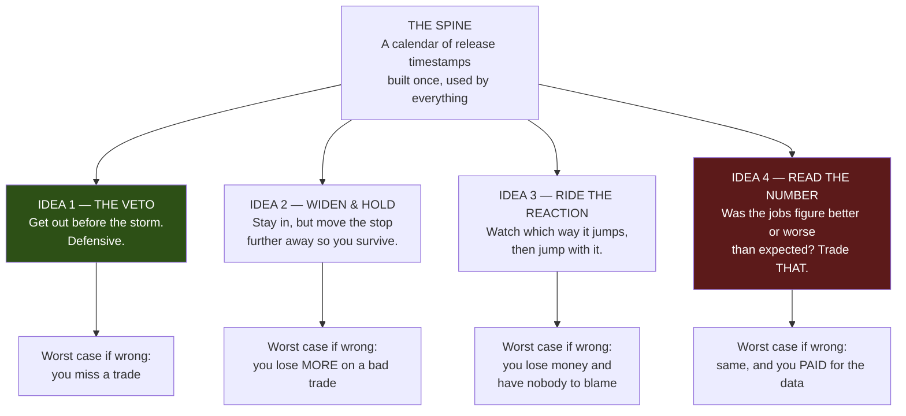
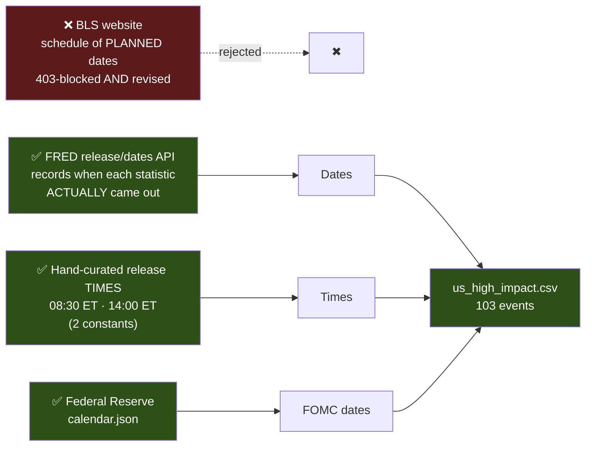
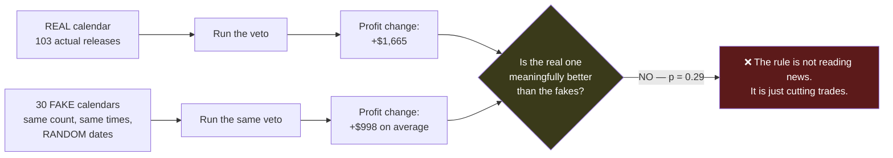
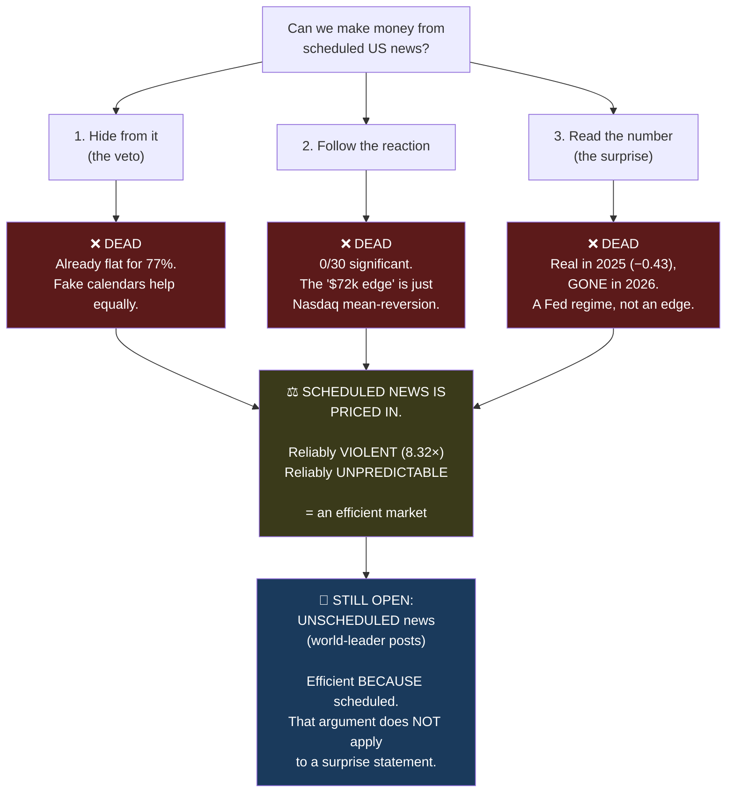

# Seminar: Building (and Killing) a News-Trading System

**A step-by-step walkthrough of the fundamental-analysis workstream — every decision, every mistake,
every number from our own data.**

Date: 2026-07-12 · Branch `fundamental-analysis`, merged to `dev` (`7b6a184`) · Nothing shipped

> 🇸🇦 النسخة العربية: [`03-SEMINAR-fundamental-analysis_AR.md`](03-SEMINAR-fundamental-analysis_AR.md)

---

# 🚨 CORRECTION — 2026-07-13. READ THIS FIRST.

**This seminar teaches a negative result with confidence it has not earned. I wrote it, and I was
wrong to be that certain.**

## The mistake

The whole document argues that scheduled US macro news is **"priced in"** — and it does so on
**52 to 103 events.** The out-of-sample "death" of the surprise signal rested on **28 events.**

**I never asked the most basic question of all: was the study big enough to detect anything?**

**It was not.**

| True effect size | **Power we actually had (n=52)** | Events needed for 80% power |
|---|---|---|
| r = 0.10 | **10%** | 783 |
| **r = 0.11 — the size we actually measured** | **12%** | **647** |
| r = 0.20 | 29% | 194 |

> **🍼 In plain words**
>
> **"Power" means: if the effect is really there, what's the chance our test would spot it?**
>
> **Ours was 12%.** That means **even if news genuinely moves the market exactly as we hoped, our test
> would have MISSED it 88 times out of 100.**
>
> Imagine testing whether a coin is biased — by flipping it four times. You get 2 heads and 2 tails and
> announce "the coin is fair." **You haven't shown the coin is fair. You've shown you didn't flip it
> enough.** That is what this seminar did.

**And there is a detail that makes it worse:** when we finally tested whether the surprise predicts the
*size* of the move, the answer came back **positive on all four independent measures** (+0.105, +0.121,
+0.105, +0.107) — the same sign, every time — and every single one was reported as "not significant."

**At 12% power, "not significant" means almost nothing.**

## So what is the honest verdict?

> ### NOT: *"Scheduled news does not work."*
> ### BUT: *"We cannot tell with sixteen months of price data."*

## The bottleneck — and it is NOT what this seminar blamed

This document blames the *market* (efficiency). **The real constraint is our own dataset.**

**It is not the calendar.** FRED has decades of releases, for free. **It is our price data:
2025-01-01 → 2026-05-19. Sixteen and a half months.**

| Price history | Releases | Power |
|---|---|---|
| **What we had** | **52** | **12%** ❌ |
| + 2024 (complete, sitting unused on disk) | ~100 | 19% |
| 5 years | 188 | 32% |
| 10 years | 376 | 57% |
| **Back to ~2009** | **640** | **80%** ✅ |

**And we don't need continuous history** — only ±60-minute windows around each release. About **78,000
bars** for 650 events. A small, cheap acquisition.

## What in this seminar still stands

**Everything that is a MEASUREMENT still stands.** Everything that is an INFERENCE about whether news
works does not.

| ✅ **Still true** | ❌ **Retracted** |
|---|---|
| The calendar is validated — 8.32× spike lands exactly on the print | "The surprise signal is dead" |
| The market is **calm** before a release (0.78× at −2 min) | "Scheduled US macro is priced in" |
| **The lockup does not leak** (verified 2026-07-13) | "Do not buy vendor consensus data" *(suspended)* |
| The veto is structurally near-useless — we're already flat for **77%** of releases | |
| 4-hour bars **cannot see** an 08:30 release | |
| The "$72k fade edge" is ordinary NQ mean-reversion — the fakes reproduce it | |

## 🎓 The lesson — and it is the most important one in this entire document

**I was rigorous about multiple comparisons. I was rigorous about out-of-sample validation. I built a
null-test harness and used it to catch three mirages. And then I never once asked whether the sample
was big enough to see anything at all.**

> **A NULL TEST tells you whether an effect you FOUND is real.**
>
> **A POWER ANALYSIS tells you whether you could have FOUND it in the first place.**
>
> **We ran the first and skipped the second. Both are mandatory. Neither substitutes for the other.**

**Read the rest of this seminar for the method, the traps, and the engineering — all of that is sound
and worth learning. But read its conclusion as "unproven", not as "disproven."**

---

## How to read this document

Every section has two voices:

> **🍼 In plain words** — no jargon, no assumed knowledge. If a term appears, it gets defined.

> **⚙️ Technically** — the exact mechanism, file, line, and number.

And every section answers four questions: **what we did, what happened before/after, what went wrong,
and how we would do it better.**

---

# PART 0 — The question we set out to answer

> **🍼 In plain words**
>
> Our trading robot currently looks only at *price* — how the Nasdaq futures contract has been moving.
> It knows nothing about *the world*. It doesn't know that at 8:30 this morning the US government
> published the jobs report, which is the single biggest scheduled market event of the month.
>
> The question: **if we told the robot about the news, would it make more money?**

> **⚙️ Technically**
>
> Inject an exogenous event stream into an L1 decision engine that currently consumes only
> `(df_dec, df1, box, vf)` — price frames and a volatility forecast. Test whether scheduled
> high-impact US macro releases carry exploitable information, measured against a strict
> permutation-based null.

**The answer, up front, so you can read the rest knowing where it lands:**

**No. Scheduled US macro news is already priced in. We tested three different ways to exploit it and
all three failed honestly. We spent $0 on data. The most valuable thing we built was the machine that
proved we were wrong.**

---

# PART 1 — The one minute that explains everything

Before any theory, look at **real NQ data** from Friday **2025-03-07**, the morning the US jobs report
was published. This is not a simulation. These are the actual 1-minute bars.

| Time (ET) | Open | High | Low | Close | **Range (pts)** | **Volume** |
|---|---|---|---|---|---|---|
| 08:27 | 20116.50 | 20121.25 | 20106.75 | 20112.50 | 14.5 | 223 |
| 08:28 | 20112.50 | 20119.00 | 20106.50 | 20113.25 | 12.5 | 228 |
| 08:29 | 20113.50 | 20119.50 | 20103.25 | 20110.25 | 16.25 | 410 |
| **08:30** ⚡ | **20107.50** | **20249.00** | **20061.50** | **20218.25** | **187.50** | **5,069** |
| 08:31 | 20219.00 | 20273.75 | 20204.25 | 20246.75 | 69.5 | 2,658 |
| 08:32 | 20250.75 | 20254.25 | 20207.00 | 20218.75 | 47.25 | 1,681 |

> **🍼 In plain words**
>
> For three minutes before 8:30, the market barely moves — it drifts in a 14-point range, and almost
> nobody is trading (about 220 contracts a minute). Everyone is *waiting*.
>
> Then the number lands. In **one single minute**, the price swings **187.5 points**. That is **13
> times** the range of the minute before. Volume explodes to 5,069 contracts — **twenty times** normal.
>
> On a Nasdaq futures contract, one point is worth **$20**. So that one minute contained **$3,750 of
> price movement** on a single contract.
>
> **And here is the cruel part.** Look at that 08:30 bar carefully. It *opened* at 20107.50. It first
> fell to **20061.50** (down 46 points). Then it rocketed to **20249.00** (up 141 points from the
> open). It went **both ways inside the same 60 seconds.**

> **⚙️ Technically**
>
> The 08:30 bar has `high - low = 187.5` against a trailing 3-bar mean true range of ~14.4 — a **13×
> range expansion** — with `volume = 5069` vs a trailing mean of ~287 (**17.7×**). The bar is a
> two-sided liquidity sweep: `low < open` by 46 pts and `high > open` by 141.5 pts. Directionally it
> resolved up (`close - open = +110.75`), but not before taking out the downside first.

### The trap this creates — with real money

Our champion strategy on the 4-hour timeframe uses a **hard stop-loss of 40 points**. Suppose it was
holding a **long** position (a bet that price goes up) into that release, entered near the 08:29 close
of **20110.25**.

- Its stop-loss sits at 20110.25 − 40 = **20070.25**.
- The 08:30 bar's **low was 20061.50** — *below* the stop.
- **The position is stopped out for a 40-point loss = −$800.**
- The price then closes the very same minute at **20218.25** — which would have been **+108 points =
  +$2,160.**

> **🍼 In plain words**
>
> The robot got thrown out of the trade at the worst possible moment, taking an $800 loss — and then
> the market immediately went exactly the way it had bet, which would have made $2,160.
>
> **This is the single most infuriating thing that can happen to a trader, and it is exactly what the
> news release does to you.** Our whole first idea was built to prevent this.

---

# PART 2 — The plan: four ideas, ranked by how badly they could embarrass us



> **🍼 In plain words**
>
> We deliberately started with the **safest** idea, not the most exciting one.
>
> Idea 1 (the veto) can only ever *remove* trades. If it's wrong, you miss out on some profit —
> annoying, but you can't lose money you weren't already risking.
>
> Idea 4 (read the number) is the one everybody actually wants: *"the jobs report was great, so buy!"*
> But if it's wrong, it loses money all by itself, with nothing else to blame — **and it needs data
> you have to pay for.**
>
> So we climb the ladder: prove the safe one works before you're allowed to build the dangerous one.

> **⚙️ Technically**
>
> An evidence ladder ordered by the *attributable* risk of each head. The veto only ever ANDs a
> `False` into the entry gate (monotonically reduces the trade set). The surprise head is the sole
> causal agent of its own P&L, so it carries the full estimation burden with no confounder to absorb
> error. Ordering by evidence burden, not by expected value.

**Honest admission, up front:** *this ordering was a mistake.* You told me later, and you were right:
**the whole point of reading the news is to make money from the volatility, not to hide from it.** I
built the umbrella first. More on that in Part 8.

---

# PART 3 — STEP 1: Getting the calendar (harder than it sounds)

**The task:** produce a list of every high-impact US economic release, with the exact minute it was
published.

> **🍼 In plain words**
>
> This sounds trivial. "Just download the schedule." It was the single most trap-filled step of the
> entire project.

### Trap 1 — The official source refuses to talk to computers

The US Bureau of Labor Statistics (BLS) publishes the jobs report, inflation, and producer prices.
Their website has the schedule. We tried to fetch it:

```
403  https://www.bls.gov/schedule/news_release/empsit.htm     ← even with a browser identity
403  https://www.bls.gov/schedule/schedule.ics
403  https://download.bls.gov/pub/time.series/
200  https://api.bls.gov/publicAPI/v2/...                      ← only the API responds
```

> **🍼 In plain words** — BLS blocks automated downloading. Their bot-protection returns "403
> Forbidden" to any program, even one pretending to be a web browser. You simply cannot scrape them.

### Trap 2 — The schedule itself was *revised* (the one nobody expects)

This is the finding that changed the design.

I had written in the design document that the release schedule "**cannot be revised after the fact**"
— that this was its great advantage over news articles. Then a web search surfaced a BLS page titled:

> *"Revised news release dates following the **2025 and 2026 lapses in appropriations**"*

plus a separate notice: *"September 2025 CPI Release **Rescheduled**"*.

> **🍼 In plain words**
>
> There were **government shutdowns** in 2025 and 2026. When the government shuts down, the statistics
> agencies stop working, and the reports come out **late** — on different days than originally planned.
>
> So the one dataset I had confidently called "un-revisable" **had been revised.** If we had built our
> calendar from the *originally planned* dates, we would have been standing aside on quiet days when
> nothing happened, and trading blindly straight into the days when the number actually landed. The
> feature would have been *worse than useless* — it would have been actively backwards.

### The solution: ask when things *actually happened*, not when they were *planned*



> **⚙️ Technically**
>
> `optimize/fundamentals/fetch_calendar.py` uses FRED's `/fred/release/dates` endpoint. FRED is the
> St. Louis Federal Reserve's database. Its `release_dates` records the date each statistic was
> *actually published* — so shutdown reschedules are captured for free, with no special-casing.
> The **time** of day is a per-release constant (08:30 or 14:00 Eastern), independently validated in
> Step 2. Free, official, needs only a no-cost API key.

### Trap 3 — A wrong ID that a guard caught

First run:

```
  nonfarm_payrolls     release_id=50   ->  17 dates
  cpi                  release_id=10   ->  17 dates
  ppi                  release_id=46   ->  17 dates
  gdp                  release_id=53   ->  17 dates
  pce                  release_id=54   ->  18 dates
  retail_sales         release_id=8    ->   0 dates      ← !!
RuntimeError: FRED returned 0 dates for retail_sales (release_id=8). Refusing to write a partial calendar.
```

> **🍼 In plain words**
>
> I had guessed the wrong ID number for retail sales. The program could have quietly written a
> calendar **missing all the retail-sales days** and everything downstream would have looked fine —
> and been silently wrong forever.
>
> Instead it **refused to write anything at all.** That guard was three lines of code and it is the
> reason we can trust the result.

**How we would do it better:** we shouldn't have guessed IDs at all. Look them up from
`https://api.stlouisfed.org/fred/releases` first. The correct one was **9** — "Advance Monthly Sales
for Retail and Food Services".

### Trap 4 — The Fed's calendar has three different "FOMC" events

The Federal Reserve's JSON has 135 entries of `type: FOMC`. They are **not the same thing**:

| Entry | Time | What it is | Kept? |
|---|---|---|---|
| **FOMC Meeting** | 2:00 pm | The interest-rate decision. Enormous. | ✅ **Yes** |
| FOMC Press Conference | 2:30 pm | The Chair takes questions. Also big — **but the feed only lists these from Sept 2025 onward**, so including them would leave holes in two-thirds of our window | ❌ No |
| FOMC Minutes | 2:00 pm | The *notes* from the meeting, released 3 weeks later. Moves markets far less. | ❌ No |

> **🍼 In plain words** — If we had naively taken everything labelled "FOMC", we'd have mixed the giant
> event (the rate decision) with a minor one (the notes, published three weeks later), and polluted the
> whole calendar.

### The known gap we refused to paper over: ISM

ISM (the Institute for Supply Management) publishes two big surveys at **10:00 am**. **FRED does not
carry them** — ISM is a private company and its data is proprietary.

I *could* have guessed the dates by rule ("first business day of the month"). **I chose not to.**

> **🍼 In plain words**
>
> Guessing dates is exactly the kind of assumed, unverified data this entire project was designed to
> avoid. We had *just* learned that even official published schedules lie (the shutdowns). Inventing
> our own schedule would have been worse.
>
> So we left a hole, wrote it down, and **measured how much the hole costs** (see Step 2).

### RESULT of Step 1

**103 events**, spanning 2025-01-01 → 2026-06-30:

| Event | Count |
|---|---|
| Consumer Price Index (inflation) | 17 |
| Non-Farm Payrolls (jobs) | 16 |
| Producer Price Index | 16 |
| Retail Sales | 16 |
| GDP | 13 |
| PCE (the Fed's preferred inflation gauge) | 13 |
| FOMC rate decision | 12 |

---

# PART 4 — STEP 2: Proving the calendar is right (and a discovery)

> **🍼 In plain words**
>
> We now have 103 timestamps. **How do we know they're correct?** A single wrong timezone, or one bad
> ID, and everything downstream is garbage — but it would still *run*, and still produce plausible-
> looking numbers. Silent wrongness is the enemy.
>
> **The trick:** if our timestamps are right, then the market should visibly explode *exactly* at those
> moments. So we let the market grade our homework.

> **⚙️ Technically**
>
> `optimize/fundamentals/window.py::measure_envelope` computes, for every minute-offset from −60 to
> +60 around each release, the mean absolute 1-minute return, normalised by the all-sample baseline.
> `test_envelope_peaks_at_offset_zero` asserts `argmax(ratio) ∈ [-1, +1]`. If a `release_id` or a
> clock time were wrong, the peak would land elsewhere and the test fails.

### The result — the calendar grades itself

*(ratio = how volatile that minute is compared to an ordinary minute. 1.0 = perfectly normal.)*

| Minutes from release | −6 | −5 | −4 | −3 | **−2** | −1 | **0 (PRINT)** | +1 | +6 | +12 | +25 |
|---|---|---|---|---|---|---|---|---|---|---|---|
| **Volatility** | 1.01× | 1.06× | 1.16× | 0.86× | **0.78×** | 1.34× | **8.32×** | 3.03× | 2.43× | 1.62× | 1.13× |

> **🍼 In plain words**
>
> **8.32×.** The release minute is over eight times more violent than a normal minute — and the spike
> lands **exactly** on the timestamp we predicted. Not one minute early, not one minute late.
>
> **That is our proof.** No wrong ID, no timezone error, no daylight-saving bug could produce that. The
> calendar is correct. We didn't have to trust anyone — the market confirmed it for us.

### 💡 THE DISCOVERY THAT KILLED AN ASSUMPTION

Look again at the minutes **before** the release: **1.01×, 1.06×, 1.16×, 0.86×, 0.78×, 1.34×**.

At two minutes before the jobs report, the market is at **0.78× normal** — it is **QUIETER than an
average minute.**

> **🍼 In plain words**
>
> Your original brief said: *"in the window before, while and after, usually we have high volatility."*
>
> **The data says the opposite.** Before a big number, the market goes **dead still.** Nobody trades.
> Everybody waits. It is the calm before the storm — literally.
>
> You can *see* it in the real bars from Part 1: 08:27, 08:28, 08:29 all had ~14-point ranges and ~220
> contracts of volume. Then 08:30 had a 187-point range and 5,069 contracts.
>
> **Why this matters enormously:** Idea 2 was *"widen the stop so you can survive the pre-release
> turbulence."* **There is no pre-release turbulence.** That idea was built to solve a problem that
> does not exist.

**So the measured window is: 0 minutes before, 12 minutes after.** Not "15 minutes each side" because
15 is a round number. *Zero and twelve, because that is what the data says.*

### The trap I nearly fell into: the 9:30 ghost

At **+60 minutes**, volatility jumps back up to **4.91×**. My first instinct: "wow, the release is
*still* echoing an hour later!"

**It isn't.** Most releases are at 08:30. Sixty minutes later is **09:30** — which is when the US stock
market opens. That's a completely different event.

> **🍼 In plain words** — We were about to credit the jobs report with a volatility spike that was
> actually just the opening bell. Different cause entirely.

There is a calm gap at +22 to +27 minutes (1.13×–1.35×) that cleanly separates the two, so our window
correctly stops at +12 and never swallows the whole morning. **This is now pinned in a test** so nobody
"fixes" it later.

### Measuring the cost of the ISM hole

Remember we dropped ISM (the 10:00 am surveys). Does that hurt?

| Clock time | Volatility vs normal |
|---|---|
| 08:30 (our releases) | 3.13× |
| **09:30 (stock market opens)** | **4.58×** |
| **10:00 (ISM — WE HAVE NO DATA)** | **3.61×** |
| 11:00 (nothing special) | 2.12× |
| 14:00 (FOMC) | 1.73× |

> **🍼 In plain words**
>
> 10:00 am runs at **3.61×** normal — clearly a disturbed minute, well above the 2.12× of an ordinary
> 11 o'clock. So **yes, the ISM hole is real and it costs us something.** We *measured* the cost
> instead of hand-waving it away. If we ever revisit this, ISM needs to be bought properly — not
> guessed.

---

# PART 5 — STEP 3: Teaching the engine (and a nasty surprise in our own code)

> **🍼 In plain words**
>
> We have a calendar. Now we must tell the trading robot: *"do not open a trade during these minutes,
> and if you're already in one, get out."*
>
> Sounds like a small change. It wasn't.

### Surprise 1: the thing called "veto" doesn't actually veto

The design document said: *"we just add one more veto mask — the machinery already exists."*

**That was wrong.** When we read the actual code:

> **⚙️ Technically**
>
> `engine.py` accepts a `veto_mask` parameter — but it **does not block trades with it**. It only uses
> it for flip logic, carry-abort, and intra-candle rescue. The thing that *actually* stops a trade is
> the composite `entry_gate`:
>
> - `engine.py:520` — `if not gated: continue`
> - `optimize/fast_engine.py:97` — `if gate is not None and not gate[idx]:`
>
> Callers pre-AND the veto into the gate (`indicators/runner.py:251`, `optimize/core.py:273`). So our
> mask had to join the **gate**, not the veto.

> **🍼 In plain words**
>
> The part of the code named "veto" is not the part that vetoes. If I had trusted the name instead of
> reading the code, the feature would have silently done nothing — and I'd have concluded "news doesn't
> work" for entirely the wrong reason. **Read the code, not the labels.**

### Surprise 2: there is no "am I in profit?" number anywhere

Our rule was: *"get out before the release — **unless you're already comfortably in profit**, in which
case ride it out."*

But the engine **has no running profit figure.** A trade is a dictionary with a fixed entry price and
three fixed price lines. Profit is computed **only at exit**.

**Solution:** check profit at a *single moment* — the bar we're about to exit on — instead of tracking
it continuously.

> **⚙️ Technically**
>
> "Comfortably in profit" is expressed in units the engine already speaks: **open profit ≥ `mult` ×
> hard-stop distance**. With `mult = 1.0`, this means *"already up by one stop's worth of risk"* — i.e.
> you're risking nothing you haven't already won. This point-in-time formulation is also the **only**
> thing expressible in `fast_engine`'s vectorised argmax-over-candidates exit model; a running tally
> would have been impossible to keep in parity.

### 💡 THE MOST IMPORTANT LINE OF CODE IN THE WHOLE PROJECT

When do we exit? The window opens **at** 08:30. So do we exit **at** 08:30?

**No. And getting this wrong would have faked a negative result.**

Go back to the real bars:

| Time | Close | |
|---|---|---|
| 08:29 | **20110.25** | ← the last calm minute. **THIS is where we exit.** |
| 08:30 | 20218.25 | ← the print. Range: **187.5 points.** Too late. |

> **🍼 In plain words**
>
> If we exit **at** 08:30, we are exiting *at the close of the explosion bar* — we have already ridden
> the entire 187-point whipsaw. We were **never actually protected**. The whole feature would be
> pointless, and we'd have blamed "news" for our own bad implementation.
>
> To be safe **during** the storm, you must be out **before** it. So we exit at the close of **08:29**,
> the last quiet bar.
>
> **"But isn't that cheating? Looking into the future?"**
>
> **No — and this distinction is the heart of the whole project.** At 08:29 we know a number lands at
> 08:30 because **the schedule was published months ago**. That is not the future; that is a calendar
> on the wall. Knowing *that a number is coming* is public knowledge. Knowing *what the number will
> say* would be cheating. We only ever use the first.

> **⚙️ Technically**
>
> `window.py::news_exit_targets` returns `open_idx - 1` — the last 1-minute bar strictly before the
> window opens. This is causal for exactly the same reason `trading_days.py::eod_targets` is causal:
> the 17:00 session close is also known in advance. Pinned by
> `test_the_exit_bar_lands_STRICTLY_BEFORE_the_release`.

### Surprise 3: two engines, one truth

The system has **two** engines: the exact/causal one (`engine.py`, walks every bar) and a 200× faster
vectorised one (`fast_engine.py`, skips bars). **They must produce identical trades**, or the optimiser
is optimising a lie.

**The safety net — before/after:**

| Gate | What it proves | Result |
|---|---|---|
| **Golden 6/6** | With the feature **off**, all six timeframes produce **byte-identical** results to before | ✅ 4h $148,670 · 2h $105,462 · 1h $80,339 · 15m $77,098 · 5m $23,926 · 2m $29,777 — **all unchanged** |
| **Engine parity** | With the feature **on**, both engines agree trade-for-trade | ✅ 11/11 cases, **zero mismatches** |

> **🍼 In plain words**
>
> "Byte-identical" means: we changed the engine, and when the new feature is switched off, **every
> single number is exactly what it was before, to the last cent.** Not "close enough" — *identical.*
> That proves the new code cannot secretly corrupt existing results.

---

# PART 6 — STEP 4: The null test — the machine that kept us honest

> **🍼 In plain words**
>
> **This is the most important thing we built, and it is the only reason this document isn't a lie.**
>
> Here is the problem it solves. Suppose we turn on the news veto and profit goes up by $1,665. Are we
> happy? **We shouldn't be.** Because there's another explanation: **maybe cutting trades short just
> helps, for reasons that have nothing to do with news at all.**
>
> How do we tell those apart?
>
> **We invent a fake calendar.** Same number of events. Same times of day (8:30 and 2:00). But the
> dates are **randomly chosen days when nothing happened.** Then we run the *exact same rule* on the
> fake calendar.
>
> If the fake calendar helps just as much as the real one — **then news is irrelevant**, and we've
> merely discovered that our robot cuts its losses too late. That's a fact about our stop placement,
> not about the world. It would not make us a single dollar in the future.

> **⚙️ Technically**
>
> `optimize/fundamentals/nulltest.py::fake_calendar` — a permutation test. Preserves event count and
> the time-of-day distribution exactly, permuting only the dates onto release-free days. Randomising
> the clock time too would merely rediscover that 08:30 is volatile, which is not the hypothesis under
> test. The empirical p-value is `(#fakes ≥ real + 1) / (N + 1)`.



### RESULT — before and after, on real money

| Timeframe | **Before** (no veto) | **After** (veto on) | Change | **Fake calendars** | p-value |
|---|---|---|---|---|---|
| 4h | $42,187 · 209 trades | $42,217 · 208 trades | **+$30** | +$573 avg | **0.548** |
| 15m | $4,239 · 323 trades | $5,904 · 321 trades | **+$1,665** | **+$998 avg** | **0.290** |
| 5m | $693 · 132 trades | $1,245 · 132 trades | **+$552** | +$614 avg | **0.290** |

*(p-value = the probability of seeing a result this good by pure luck. We needed below 0.05. We got
0.29–0.55 — i.e. this could easily be luck.)*

> **🍼 In plain words**
>
> **Look at the 15-minute row.** The real news calendar made **+$1,665**. That looks like a win!
>
> But a calendar of **completely made-up dates** made **+$998**. The real one is barely better than
> pure fiction. **Randomly cutting trades makes this strategy money** — that's the real discovery. It
> has nothing to do with news.

### 💡 WHY it failed — the number that explains everything

We dug into *why*, and found something more valuable than the verdict:

| Question | Answer |
|---|---|
| How long does a typical trade last? | **1.4 hours** (median) |
| Of the 103 releases, how many had a trade open? | **24** |
| So what fraction of releases are we exposed to? | **23%** |
| **What fraction are we ALREADY FLAT for?** | **77%** |
| How many trades does the veto actually touch? | **3–4%** (7 of 265 on 4h) |

> **🍼 In plain words**
>
> **The robot is already out of the market for 77% of all news releases.** It holds trades for about an
> hour and a half. The odds that it happens to be holding something at exactly 8:30 in the morning on
> one of 103 specific days are low.
>
> The whole idea — *"don't hold naked through a release"* — quietly assumed **you often hold through
> releases.** You don't. **There was almost nothing to protect.**
>
> We built an umbrella for a man who was already indoors.

### 🔴 MY BLUNDER: I nearly ran the entire test on the wrong timeframe

Look at the first row again: 4h. The veto changed profit by **+$30** and removed **one trade out of
209.** Why so little?

| | |
|---|---|
| 4h decision bars land at: | 02:00, 06:00, 10:00, 14:00, 18:00, 22:00 |
| Releases land at: | **08:30** and 14:00 |

> **🍼 In plain words**
>
> **The 8:30 releases — which are 88% of all our events — can never line up with a 4-hour bar. Ever.**
> The bars simply don't exist at 8:30. Only the twelve 2pm Fed decisions can ever match.
>
> So on the 4-hour timeframe, our news feature was almost entirely **switched off**, and I was busy
> measuring whether it worked. **That's like testing a drug on patients who never took it.**
>
> I should have spotted this the instant I saw a **12-minute** window being applied to a **240-minute**
> bar. Only the fast timeframes (15m, 5m, 2m) can even *see* an 8:30 release.

**How to do it better:** *Always check that your treatment actually applies to your test population
before measuring the effect.* One line of code (`mask.sum()`) would have told me: 11 bars out of 2,119.

---

# PART 7 — STEP 5: "Fine — then let's TRADE the volatility"

You corrected me here, and you were right:

> *"the final goal is not to avoid volatility — the whole reason of analysing the news content instead
> of just knowing its time is to invest in the volatility time smartly"*

So: **can we make money from the explosion?**

### Attempt A — Ride the reaction (free, no news content needed)

> **🍼 In plain words**
>
> Simple idea: watch which way the price jumps in the first few minutes after the number, then jump
> **with it**. If it rockets up, buy. If it craters, sell. You're not predicting the news — you're
> following the crowd's reaction.
>
> This needs **no paid data at all.** Just our free calendar and the price.

> **⚙️ Technically**
>
> `study_postrelease.py`. For each release at minute T: `reaction = close[T+k]/close[T-1] - 1` (known
> at T+k), `followthrough = close[T+h]/close[T+k] - 1` (entirely after). Swept k ∈ {1,2,3,5,10,15} ×
> h ∈ {15,30,60,120,240}. Fully causal. Scored against 50 fake calendars.

**RESULT: 0 of 30 combinations were significant.** (Chance alone predicts ~1.5.) Hit rates 42–57% —
coin flips.

### 💰 THE $72,000 MIRAGE

But there *was* a pattern. At long horizons, "riding the move" **lost money consistently** — at every
single value of k, the correlation was negative (−0.14 to −0.23).

Losing money reliably means **doing the opposite makes money.** Fading the move showed:

**+$760 per trade × 95 releases = +$72,170.**

> **🍼 In plain words**
>
> A $72,000 edge. That is a real, exciting, ship-it number.
>
> **Then we ran the fake calendars.** And the fake calendars showed **the same thing.** Fading a
> 4-hour move makes money on **random days with no news at all.**
>
> It isn't a news effect. It's just a property of the Nasdaq — the index tends to reverse over a few
> hours, on *any* day. We would have "discovered" a $72,000 strategy that is simply *"the Nasdaq
> mean-reverts"*, dressed up in a news costume.
>
> **The null test caught it. Without it, we'd have shipped it.**

### Attempt B — Read the number itself (the one you actually wanted)

> **🍼 In plain words**
>
> Now the real idea. **The jobs report said 250,000 new jobs. Economists expected 180,000. That's a big
> beat.** Does the Nasdaq go up or down?
>
> The gap between *what came out* and *what was expected* is called the **surprise**. That is the
> "content" — the actual meaning of the news, not just its timing.
>
> **The problem:** "what economists expected" is data you have to **buy**.

**But we found a free way to test the idea first.**

> **⚙️ Technically**
>
> A *statistical* expectation instead of the market's. `alfred.py` pulls **point-in-time vintages** —
> the statistic exactly as it stood on release morning. Expectation = mean of the previous 6 monthly
> changes *within that same vintage*. Surprise = (actual − expected), standardised per event type with
> an expanding (causal) standard deviation. Nothing peeks.

### 🚨 CASE STUDY: why "point-in-time" is not paranoia

We asked ALFRED (the Fed's archive) for the jobs number **as it was printed that morning**, and
compared to the number **in the database today**:

| Reference month | Printed that morning | In the database today | **Revised away** |
|---|---|---|---|
| Jan 2025 | 159,069,000 jobs | 158,268,000 | **−801,000** |
| Feb 2025 | 159,218,000 | 158,310,000 | **−908,000** |
| Mar 2025 | 159,398,000 | 158,377,000 | **−1,021,000** |
| Apr 2025 | 159,517,000 | 158,485,000 | **−1,032,000** |

> **🍼 In plain words**
>
> The jobs number gets **corrected** for months afterwards. **About a million jobs' worth of
> correction.**
>
> If you build a backtest using today's database, you are testing a strategy on a number **that nobody
> on Earth had that morning.** Your robot appears to be a genius, because it's reading a corrected
> version of history. Then you trade it live and it dies.
>
> ALFRED gives us the *original* number, free. This one detail separates a real backtest from a
> fantasy.

### 🎯 THE RESULT THAT ALMOST FOOLED US

**In-sample (all 52 priced releases):**

| Hold | Correlation | p-value |
|---|---|---|
| **5 min** | **−0.322** | **0.021** ✅ |
| 15 min | −0.225 | 0.105 |
| 30 min | −0.204 | 0.142 |
| 60 min | −0.236 | 0.084 |

**And on 2025 alone: correlation −0.432.**

> **🍼 In plain words**
>
> **We found it.** A statistically significant relationship (p = 0.021 — only a 2% chance of luck).
>
> And the *sign* makes perfect economic sense. **Negative** correlation means: **a BETTER-than-expected
> jobs number makes the Nasdaq go DOWN.**
>
> That sounds backwards, but it's a famous, well-documented phenomenon called **"good news is bad
> news"**: if the economy is running hot, the Federal Reserve will keep interest rates high to cool it
> down — and high interest rates are bad for tech stocks.
>
> **So we had: a significant number, AND a coherent story that a professional economist would nod at.**
>
> **This is exactly the moment where people ship a strategy and lose their money.**

### ⚰️ Then we tested it on data it had never seen

We froze the rule learned from **2025** and applied it, unchanged, to **2026**:

| Hold | **2025** correlation | **2026** correlation | Sign held? | **2026 profit** |
|---|---|---|---|---|
| 5 min | **−0.432** | −0.011 | yes | **−2.8 bp** |
| 15 min | **−0.377** | **+0.159** | ❌ **FLIPPED** | **−3.1 bp** |
| 30 min | **−0.362** | **+0.125** | ❌ **FLIPPED** | **−4.5 bp** |
| 60 min | **−0.252** | −0.021 | yes | **−6.4 bp** |

> **🍼 In plain words**
>
> **It vanished.** The correlation didn't get weaker — it went to **zero**, and at two of the four
> horizons it **reversed direction entirely**.
>
> Applying the 2025 rule to 2026 **lost money at every single horizon**, with a success rate of 32–41%
> — **reliably worse than flipping a coin.**
>
> **"Good news is bad news" was not a law of markets. It was a property of the Federal Reserve's mood
> in 2025.** The Fed's stance shifted, and the relationship shifted with it. We would have been trading
> a rule that had already stopped being true.
>
> **The ONLY reason we didn't ship this** is that we wrote down the kill criterion — *"abandon this if
> it fails out-of-sample"* — **before** we ran the test, while nobody was emotionally attached to a
> −0.43 correlation and a beautiful story.

---

# PART 8 — What went well, what went wrong, and how to do it better

### ✅ What went well

| | |
|---|---|
| **The null test** | Caught **three** separate mirages: a $72k "edge" that was just Nasdaq mean-reversion; a veto whose gains random calendars matched; and a p=0.021 signal with a perfect story that was a dead regime. **This is the single most valuable artifact of the project.** |
| **The calendar self-validated** | We didn't have to *trust* our timestamps. The 8.32× spike landing exactly on offset 0 *proved* them. |
| **Point-in-time discipline** | ALFRED first-prints. Without it, a million jobs of hindsight would have leaked into every test. |
| **The identity guarantee** | Golden 6/6 byte-identical. We modified two engines and can *prove* we broke nothing. |
| **The kill criterion, written first** | The only thing standing between us and shipping a −0.43 correlation that was worthless. |
| **Refusing to guess** | The retail-sales guard (refuse to write a partial calendar). The ISM gap (measured, not invented). |

### ❌ What went wrong

| Mistake | Cost | The lesson |
|---|---|---|
| **Built the defensive head first** | Wasted the first half of the project | *Build for the goal, not for safety. You corrected me: the point is to trade the volatility, not hide from it.* |
| **Ran the test on 4h bars** | Nearly produced a meaningless result | **88% of releases can't coincide with a 4h bar.** *Always verify your treatment actually applies to your test population.* Check `mask.sum()` first. |
| **Trusted a code label** | Would have silently done nothing | The parameter named `veto_mask` **doesn't veto.** *Read the code, not the names.* |
| **Assumed schedules can't be revised** | Would have inverted the whole feature | Government **shutdowns rescheduled releases**. *Prefer "when it actually happened" over "when it was planned."* |
| **Guessed a FRED ID** | Caught by a guard | *Look up identifiers; never guess them.* |
| **Assumed pre-release turbulence** | Invalidated a whole planned head | The market is **QUIET** before a release (0.78×). *Measure the premise before building on it.* |
| **Opened a new SSH connection per command** | Tripped the server's `fail2ban` | *Multiplex your connections.* |
| **Over-aggressive rsync excludes** | Broke the first golden run | Excluded `optimize/results/` — which holds the champion definitions. *Know what your code reads at runtime.* |

### 🔧 How we would implement it better

1. **Start with the entry head, not the veto.** The evidence ladder was intellectually tidy and
   strategically wrong. Build toward the goal.
2. **Check engagement before measuring effect.** A one-line assertion — *"does this feature touch more
   than X% of trades?"* — would have saved the entire 4h detour. **If it touches 3% of trades, it
   cannot move the needle, no matter how right it is.**
3. **Test on the timeframe where the feature can physically operate.** A 12-minute window needs bars
   finer than 12 minutes.
4. **Buy ISM.** It's a real, measured 3.61× hole in the calendar.
5. **Pre-register the whole grid.** We swept k×h (30 cells). With 103 events, some cells *will* look
   brilliant by chance. We handled it with fakes — but declaring the grid in advance is cleaner.
6. **The strategy's holding period is the binding constraint.** Median hold 1.4h ⇒ flat for 77% of
   releases ⇒ *no* release-timing feature can ever matter much. **If you want news to matter, the
   strategy must be designed to be IN the market at those moments** — which is an entry problem, not
   a risk problem.

---

# PART 9 — The verdict, and the door still open



> **🍼 In plain words — why this makes sense**
>
> The releases are impossible to trade **precisely because they are scheduled.**
>
> Everybody on Earth knows the jobs report lands at 8:30 on a published date. Every bank, every fund,
> every algorithm has already positioned itself. **Our own data shows it:** the market goes *quiet*
> beforehand (0.78×) — that's everyone holding their breath, already positioned. Then the number lands,
> the price explodes 8.3×, and within **twelve minutes** it has fully re-priced.
>
> **That is what an efficient market looks like.** The information is absorbed almost instantly, and
> there is nothing left on the table for us.
>
> **But — and this is the important part — that argument only works BECAUSE the event was scheduled.**
>
> **An unscheduled statement** — a world leader posting something unexpected at 3am — has **no
> pre-positioning**, **no consensus to price against**, and **no "everybody is waiting" quiet period.**
> The very logic that killed the calendar actually *predicts* that unscheduled news might behave
> completely differently.
>
> That was the **second source** in your original brief, and we never tested it. **The door is still
> open.** It is also the harder path: the research pass found **zero** verified sources with reliable
> timestamps, and it carries every trap we spent this project learning to avoid.

---

## Appendix — Where everything lives

| What | Where |
|---|---|
| The validated calendar (103 events) | `optimize/fundamentals/us_high_impact.csv` |
| Calendar builder (FRED + Fed) | `optimize/fundamentals/fetch_calendar.py` |
| Loader with the timezone guard | `optimize/fundamentals/release_calendar.py` |
| Volatility envelope + masks | `optimize/fundamentals/window.py` |
| **The null test (the hero)** | `optimize/fundamentals/nulltest.py` · `run_nulltest.py` |
| Point-in-time first prints | `optimize/fundamentals/alfred.py` |
| "Ride the reaction" study | `optimize/fundamentals/study_postrelease.py` |
| "Read the number" study | `optimize/fundamentals/study_surprise.py` |
| Engine wiring (OFF by default) | `engine.py` · `optimize/fast_engine.py` · `optimize/core.py` |
| Tests (27, all green) | `optimize/test_release_calendar.py` · `test_release_window.py` · `test_news_veto.py` |
| Full design + close-out | `docs/superpowers/specs/2026-07-11-fundamental-analysis-design.md` |

**To reproduce the headline result:**

```bash
cd subprojects/Parametric-Indicators
export WSH_DATA_BASE=/mnt/data/projects/trading WSG_DATA_ROOT=/mnt/data/projects/trading/data
export FRED_API_KEY=<free key from fred.stlouisfed.org>

python3 optimize/fundamentals/run_nulltest.py --tf 15m --n 30   # the veto: p = 0.290
python3 optimize/fundamentals/study_postrelease.py --n-fake 50   # the reaction: 0/30 significant
python3 optimize/fundamentals/study_surprise.py --n-shuffle 2000 # the surprise: dies out-of-sample
```
