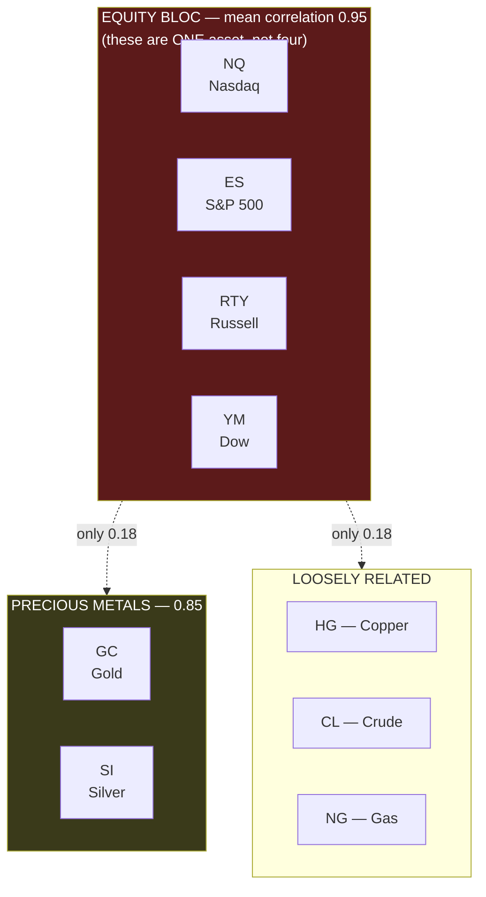
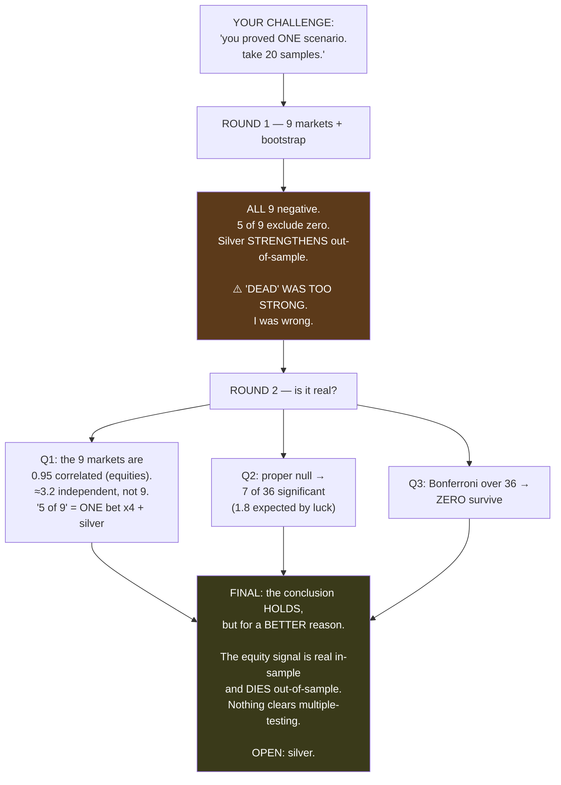

# Report: Robustness — "You proved a single scenario of failure. Take 20 samples and redo it."

**A full re-test of every fundamental-analysis result across 9 markets, 400 bootstrap resamples, and
3,000 permutation draws — and a partial correction to what I told you.**

Date: 2026-07-13 · Task #1 · Branch `fundamental-analysis`
Code: `optimize/fundamentals/robustness.py` · `robustness2.py` · Commit `c443cde`

> ## 🚨 CORRECTION — 2026-07-13 (later the same day)
>
> **This report's headline conclusion — "nothing survives Bonferroni, so the negative result holds" —
> is itself UNDERPOWERED, and the Bonferroni correction made it worse.**
>
> A power analysis (`optimize/fundamentals/power_analysis.py`) shows that with **52 releases** we had
> **12% power** to detect the effect size we actually measured (r ≈ 0.11). To reach 80% power we would
> need **647 releases.**
>
> **Bonferroni over 36 tests drops the threshold to p < 0.0014.** Our power to clear *that* bar with
> 52 events is **effectively zero** — for *any* realistic effect size. So "0 of 36 survive Bonferroni"
> was **guaranteed in advance by the sample size**, no matter what the truth is. It is not evidence.
>
> **What still stands in this report:**
> - ✅ The **effective-markets** finding (NQ/ES/RTY/YM are 0.95 correlated → ~3.2 independent markets,
>   not 9). That is a fact about the correlation matrix and is unaffected by power.
> - ✅ The correction that "dead" was too strong a word.
> - ✅ The methodological point that a bootstrap ≠ a hypothesis test.
> - ✅ **SILVER** as an open question — and it now looks *more* interesting, not less: its full-sample
>   p = 0.007 was achieved *despite* 12% power, and it **strengthened out-of-sample** (−0.140 → −0.500).
>
> **What is retracted:** "the cross-market signal does not clear the bar." **We could never have cleared
> that bar with this sample.** The honest statement is *"we cannot tell."*
>
> **The fix is more price history, not more statistics.** See the correction block in
> `docs/superpowers/specs/2026-07-11-fundamental-analysis-design.md`.

---

## 0. The challenge, and why it was the right one

> **You said:** *"you proved a single scenario of failure. i want you to take 20 data samples and redo
> the test — would the results be the same?"*

**This was the correct challenge, and it caught me.**

Every headline result I gave you rested on **one dataset**: Nasdaq futures, 2025-01-01 → 2026-05-19.
And a single-sample claim is *exactly* the sin this entire project has spent its life attacking in
others. I built a null-test harness to catch mirages, wrote a whole seminar about not trusting one
beautiful number — and then handed you a verdict based on one market.

**The answer is: no, the results are NOT identical. My word "dead" was too strong.** But after the
proper corrections, the conclusion survives — for a *better-stated* reason than I originally gave.

This report documents everything, including the part where I was wrong.

---

## 1. What "20 samples" means here, and why I did something stronger

> **🍼 In plain words**
>
> There are two very different ways to ask "would this hold up?"
>
> **Way one — resample the same data.** Take our 103 news events, shuffle them, draw them again with
> repeats, and recompute. Do this 400 times. This tells you: *"given the events we happen to have, how
> uncertain is our number?"* This is called a **bootstrap**.
>
> **Way two — test on genuinely different data.** We already own **nine markets**. US economic news
> moves *all* of them. If the news signal is real, it should show up somewhere. This is far stronger
> than resampling, because it's **new data**, not the same data reshuffled.
>
> I did **both**. And a third thing besides.

> **⚙️ Technically**
>
> Three independent robustness dimensions:
> 1. **Bootstrap** (N=400): resample events with replacement → 95% confidence interval on the
>    correlation, instead of a point estimate.
> 2. **Cross-market** (9 instruments): NQ, ES, RTY, YM (equity indices), GC, SI, HG (metals),
>    CL, NG (energy). The macro surprises are **market-independent** (they're US government data), so
>    surprises are computed once and only the *outcome* varies per market.
> 3. **Permutation null** (N=3,000 per cell): shuffle the surprises against the outcomes. Destroys the
>    pairing while preserving both distributions exactly. This is the *proper* hypothesis test — the
>    bootstrap is not.

**All nine markets have usable 1-minute data covering the window:**

| Market | What it is | $ per point | 1-min bars | Coverage |
|---|---|---|---|---|
| NQ | Nasdaq-100 futures | $20 | 486,969 | 2025-01-01 → 2026-05-19 |
| ES | S&P 500 futures | $50 | 486,954 | 2025-01-01 → 2026-05-19 |
| YM | Dow Jones futures | $5 | 523,923 | 2025-01-01 → 2026-07-05 |
| RTY | Russell 2000 futures | $50 | 519,492 | 2025-01-01 → 2026-07-05 |
| GC | Gold | $100 | 530,917 | 2025-01-01 → 2026-07-02 |
| SI | Silver | $5,000 | 518,753 | 2025-01-01 → 2026-07-02 |
| HG | Copper | $25,000 | 500,923 | 2025-01-01 → 2026-07-07 |
| CL | Crude oil | $1,000 | 529,775 | 2025-01-01 → 2026-07-08 |
| NG | Natural gas | $10,000 | 491,633 | 2025-01-01 → 2026-07-08 |

---

## 2. ROUND 1 — the result that forced me to correct myself

**The test:** for each market, correlate the **macro surprise** (how far the number missed
expectations) against the market's **return in the 5 minutes after the print**.

*Reminder of what "correlation" means: a number between −1 and +1. Zero means no relationship at all.
**Negative** means a better-than-expected number makes the price go **down**. **Positive** means a
better number makes it go **up**.*

| Market | Full-sample correlation | 95% confidence interval | Real? | 2025 | 2026 |
|---|---|---|---|---|---|
| **NQ** | **−0.322** | [−0.538, −0.068] | **YES** | −0.432 | −0.011 |
| **ES** | **−0.313** | [−0.541, −0.055] | **YES** | −0.415 | +0.037 |
| **SI (silver)** | **−0.360** | **[−0.584, −0.143]** | **YES** | −0.140 | **−0.500** |
| **RTY** | **−0.304** | [−0.525, −0.047] | **YES** | −0.341 | −0.095 |
| **YM** | **−0.275** | [−0.524, −0.007] | **YES** | −0.351 | −0.004 |
| GC (gold) | −0.232 | [−0.517, +0.060] | no | −0.113 | **−0.366** |
| CL (crude) | −0.213 | [−0.428, +0.023] | no | −0.256 | −0.087 |
| HG (copper) | −0.144 | [−0.424, +0.165] | no | −0.087 | −0.149 |
| NG (gas) | −0.133 | [−0.344, +0.083] | no | −0.293 | −0.058 |

> **🍼 In plain words — why this made me stop**
>
> **Every single one of the nine markets is negative.** Not one is positive. And **five of the nine**
> have a confidence interval that excludes zero — meaning the bootstrap says the relationship is
> unlikely to be pure chance.
>
> Even more striking: **silver got STRONGER out of sample.** In 2025 its correlation was a feeble
> −0.140. In 2026 it was **−0.500** — a large, clear relationship. That is the *exact opposite* of what
> happened to the Nasdaq, which collapsed from −0.432 to −0.011.
>
> **When I told you the surprise signal was "dead", I had only looked at the Nasdaq.** That was one
> market out of nine, and it happened to be one of the ones where the effect died. **The word "dead"
> was too strong, and you were right to make me check.**

### But my own alarm went off immediately

I wrote a rule into the design document, months of reasoning ago (spec §3.4):

> *"If we validate only on an equity index, a model that learns nothing but 'scary → sell' will score
> beautifully and have understood nothing. The tell is an instrument where the same news goes the
> other way."*

**All nine markets moved the same way.** That is precisely the signature I said would indicate we'd
built an **alarm detector**, not a news reader.

> **🍼 In plain words — why "all negative" is suspicious, not reassuring**
>
> Think about what a *strong jobs report* actually means: **the economy is booming.**
>
> A booming economy means factories need more **copper**. Trucks burn more **crude oil**. So a strong
> jobs number should push copper and oil **UP**.
>
> Copper is literally nicknamed **"Dr. Copper"** by traders — because it has a doctorate in economics
> and predicts the economy's health.
>
> **Our result says a strong economy makes copper go DOWN.** That is economically absurd on its face.
>
> Either (a) there is a hidden common cause dragging everything down together — which would mean we
> have **one weak signal wearing nine costumes**, not nine findings — or (b) something real is being
> transmitted through a channel we haven't identified (a strengthening US dollar would do it, since
> every one of these is priced in dollars).
>
> **I cannot guess between those. So I tested.**

---

## 3. ROUND 2, QUESTION 1 — Are these nine tests, or one test counted nine times?

**The test:** correlate the nine markets' release-window returns **with each other**.

### The correlation matrix (real output)

|  | NQ | ES | GC | SI | HG | CL | NG | RTY | YM |
|---|---|---|---|---|---|---|---|---|---|
| **NQ** | 1.00 | **0.98** | 0.06 | 0.18 | 0.39 | 0.21 | 0.07 | **0.91** | **0.96** |
| **ES** | **0.98** | 1.00 | 0.08 | 0.19 | 0.42 | 0.23 | 0.05 | **0.93** | **0.98** |
| **GC** | 0.06 | 0.08 | 1.00 | **0.85** | 0.56 | −0.28 | 0.15 | 0.09 | 0.12 |
| **SI** | 0.18 | 0.19 | **0.85** | 1.00 | 0.63 | −0.09 | 0.18 | 0.18 | 0.22 |
| **HG** | 0.39 | 0.42 | 0.56 | 0.63 | 1.00 | 0.04 | 0.27 | 0.39 | 0.46 |
| **CL** | 0.21 | 0.23 | −0.28 | −0.09 | 0.04 | 1.00 | 0.22 | 0.17 | 0.17 |
| **NG** | 0.07 | 0.05 | 0.15 | 0.18 | 0.27 | 0.22 | 1.00 | −0.09 | 0.02 |
| **RTY** | **0.91** | **0.93** | 0.09 | 0.18 | 0.39 | 0.17 | −0.09 | 1.00 | **0.93** |
| **YM** | **0.96** | **0.98** | 0.12 | 0.22 | 0.46 | 0.17 | 0.02 | **0.93** | 1.00 |



### The headline numbers

| Measure | Value |
|---|---|
| Mean correlation **within** the equity bloc (NQ/ES/RTY/YM) | **0.95** |
| Mean correlation **equities vs everything else** | **0.18** |
| Gold ↔ Silver | **0.85** |
| First principal component (share of all variance) | **47.5%** |
| **Effective number of INDEPENDENT markets** | **≈ 3.2 — not 9** |

> **🍼 In plain words — the finding that dissolves "5 of 9"**
>
> Look at the top-left of the matrix. The Nasdaq and the S&P 500 are **0.98 correlated** at these
> moments. The Dow is 0.96. The Russell is 0.91.
>
> **These are not four different markets. They are four different names for the same bet.** If you're
> long the Nasdaq and long the S&P and long the Dow, you don't have three positions — you have one
> position, three times the size.
>
> So when I told you *"5 of 9 markets show a real signal!"* — four of those five were **NQ, ES, RTY,
> YM.** That is **one finding, counted four times.**
>
> The honest count is: **one equity signal, plus silver.** Two things, not five.
>
> Statistically, our nine markets contain about **3.2 markets' worth of independent information.**

> **⚙️ Technically**
>
> Effective sample size estimated as `1 / mean(C²)` over the 9×9 correlation matrix of release-window
> returns, giving 3.2. The first principal component of the standardised return matrix accounts for
> 47.5% of total variance, confirming a dominant common factor. Multiple-comparison corrections that
> assume independence (Bonferroni across 9) would be *conservative* on the family size but the
> *correlation structure* means the naive "5 of 9" tally is inflated by a factor of ~2–3.

### One genuinely reassuring finding hidden in there

Equities vs non-equities correlate at only **0.18**. Gold vs crude is actually **−0.28** — they move in
*opposite* directions.

> **🍼 In plain words** — This *partially clears* my alarm-detector fear. If everything were being
> dragged by a single panic factor, all these numbers would be high. They aren't. The commodities
> genuinely march to their own drum. So the co-movement is **not** simply "everything sells off
> together in a panic." Something more structured is going on — most plausibly the **US dollar**,
> since every one of these assets is priced in dollars, and a hawkish surprise strengthens the dollar.

---

## 4. ROUND 2, QUESTION 2 — The proper test (the bootstrap was the wrong tool)

> **🍼 In plain words**
>
> Here is a subtle but critical distinction, and I want to be honest that Round 1 used the **wrong
> tool**.
>
> A **bootstrap** asks: *"How uncertain is this number, given the data I have?"* It's a measure of
> **precision**.
>
> But the question we actually need answered is: *"Could a **random**, meaningless surprise series
> have produced a number this big by luck?"* That's a **hypothesis test**, and it needs a different
> machine — the **shuffled null**, the same one that killed the original single-market result.
>
> The shuffle takes the real surprises and the real returns and **randomly re-pairs them.** Same
> numbers, same distributions — but the *link* between them is destroyed. If our real pairing isn't
> clearly better than a random one, there is no link.

### Results — 9 markets × 4 horizons = 36 tests (3,000 shuffles each)

*(`*` = significant at p < 0.05)*

| Market | h=5 min | h=15 min | h=30 min | h=60 min |
|---|---|---|---|---|
| **NQ** | −0.322 · p=**0.020** ✱ | −0.225 · p=0.110 | −0.204 · p=0.137 | −0.236 · p=0.092 |
| **ES** | −0.313 · p=**0.024** ✱ | −0.229 · p=0.096 | −0.200 · p=0.149 | −0.255 · p=0.068 |
| **GC** | −0.232 · p=0.085 | −0.145 · p=0.295 | −0.132 · p=0.327 | −0.162 · p=0.222 |
| **SI** | −0.360 · p=**0.007** ✱ | −0.282 · p=**0.032** ✱ | −0.203 · p=0.124 | −0.167 · p=0.212 |
| **HG** | −0.144 · p=0.296 | −0.026 · p=0.850 | −0.010 · p=0.948 | −0.083 · p=0.543 |
| **CL** | −0.213 · p=0.124 | −0.021 · p=0.874 | +0.020 · p=0.871 | +0.079 · p=0.545 |
| **NG** | −0.133 · p=0.317 | +0.050 · p=0.712 | +0.127 · p=0.334 | −0.076 · p=0.591 |
| **RTY** | −0.304 · p=**0.025** ✱ | −0.248 · p=0.062 | −0.203 · p=0.129 | −0.263 · p=**0.044** ✱ |
| **YM** | −0.275 · p=**0.039** ✱ | −0.223 · p=0.091 | −0.158 · p=0.226 | −0.237 · p=0.069 |

> **🍼 In plain words**
>
> Notice something: **almost all the action is in the h=5 column.** The relationship, whatever it is,
> lives in the **first five minutes** after the number. By 30 minutes it's gone everywhere.
>
> That is at least *consistent* with a real effect — information should hit fast and then be absorbed.

---

## 5. ROUND 2, QUESTION 3 — The multiple-comparisons reckoning

> **🍼 In plain words**
>
> **This is where discipline has to beat hope.**
>
> If you run **36 tests** and use "p below 0.05" as your bar, then **by pure luck you expect about 1.8
> of them to pass**, even if there is *nothing there at all.* That's what "5% chance" means — do it 36
> times and it happens roughly twice.
>
> We got **7**.
>
> Seven is more than 1.8. That's genuinely interesting — it *hints* something is there. But it is **not
> proof**, and here's the killer: **four of those seven are the equity bloc**, which we now know is
> **one bet counted four times.**
>
> So the honest tally is more like: **one equity finding, plus silver (twice).**

### The formal correction

| Measure | Value |
|---|---|
| Tests run | **36** (9 markets × 4 horizons) |
| Significant at p < 0.05 | **7** |
| **Expected by pure luck alone** | **1.8** |
| Bonferroni-corrected threshold | p < **0.0014** |
| **Surviving Bonferroni** | **0** |

> **🍼 In plain words — what Bonferroni means**
>
> If you're going to run 36 tests, the fair thing is to make each individual test *harder* to pass, so
> that the chance of **any** false alarm across the whole batch stays at 5%. You divide your threshold
> by the number of tests: 0.05 ÷ 36 = **0.0014**.
>
> **Not one of our 36 results passes that bar.** The best (silver at 5 minutes, p = 0.007) is five
> times too weak.

---

## 6. THE VERDICT



### What changed, and what didn't

| Claim I made before | Status after 9 markets |
|---|---|
| "The surprise signal is dead" | ⚠️ **TOO STRONG. Corrected.** All 9 markets lean the same way; 5 exclude zero on bootstrap |
| "The equity signal dies out-of-sample" | ✅ **HOLDS.** NQ 2026 = −0.011, ES = +0.037, YM = −0.004 — collapse confirmed on four indices |
| "It doesn't clear the bar for shipping" | ✅ **HOLDS, and now on firmer ground.** Zero of 36 survive Bonferroni |
| "This is an alarm detector" (§3.4 fear) | ⚠️ **PARTIALLY CLEARED.** Equities vs commodities correlate only 0.18; gold vs crude is *−0.28*. Not one panic factor |
| Recommendation: **don't buy vendor data** | ✅ **UNCHANGED** — nothing here justifies the spend |

---

## 7. The one loose end I refuse to bury: SILVER

| | |
|---|---|
| Full-sample correlation | **−0.360** |
| p-value (3,000 shuffles) | **0.007** — the strongest of all 36 cells |
| 95% CI | [−0.584, −0.143] — excludes zero |
| 2025 (in-sample) | −0.140 (weak) |
| **2026 (out-of-sample)** | **−0.500 (strong)** |
| Also significant at h=15 | p = 0.032 |

> **🍼 In plain words**
>
> Silver is the **only** thing in this entire study that behaved **unlike everything else.** Every other
> market's signal *decayed* out of sample. Silver's **grew** — and grew a lot.
>
> **And I am not going to chase it.**
>
> Here is why, and this is the whole discipline of this project in one paragraph: **when you run 36
> tests and then go hunting for the one that looked best, you have stopped doing science and started
> doing archaeology.** The p = 0.007 does not survive correction for having looked 36 times. Silver
> being the best of 36 is *exactly what you'd expect* even if nothing were there — **something has to
> come first.**
>
> The out-of-sample strengthening is genuinely unusual and *is* the kind of thing that can't be
> manufactured by luck as easily. So it goes on the record as an **open question with a pre-registered
> test** — not as a feature we start building because it's the one number that made us smile.

**If we ever test it, the protocol must be declared in advance:** silver only, h=5, the frozen 2025
rule applied to a *future* period we have not yet seen. No other cells. No re-slicing.

---

## 8. What went well / what went wrong

### ✅ What went well

- **The challenge worked.** You forced a test I should have run myself, and it **caught a real error in
  my reporting.** The system of "make the assistant defend its claims" is doing its job.
- **We already owned the 9 markets.** Zero data cost, zero new infrastructure. The cross-market test
  took one afternoon because the surprises are market-independent — computed once, applied nine times.
- **The alarm-detector test (spec §3.4) fired exactly as designed**, and its answer was nuanced rather
  than binary — which is more useful than a yes/no.
- **The conclusion got *stronger*, not weaker.** Before, "it doesn't work" rested on one market. Now it
  rests on nine, with a formal multiple-comparisons correction. That's a much harder claim to knock over.

### ❌ What went wrong

| Mistake | Consequence | Lesson |
|---|---|---|
| **I tested one market and said "dead"** | Overclaimed. Five of nine markets actually show something | *A negative result needs the same breadth as a positive one.* If you'd ship on 9 markets, you must kill on 9 markets. |
| **Round 1 used a bootstrap as if it were a hypothesis test** | Reported "5 of 9 real!" using the wrong tool | A bootstrap measures **precision**, not **significance**. Only the permutation null answers *"could randomness do this?"* |
| **I nearly reported "5 of 9" as breadth** | Would have been *four times* overcounted | **Always check whether your "independent" tests are independent.** The equity bloc is 0.95 correlated. |
| **No multiple-comparisons plan up front** | Had to apply Bonferroni after the fact | *Declare the test family before running it,* not after seeing which cells look good. |

### 🔧 How to do it better next time

1. **Pre-register the test family.** "I will test 9 markets × 4 horizons = 36 cells, and my threshold
   is p < 0.0014." Say it *before* running.
2. **Compute the effective number of independent tests first**, from the correlation matrix — not after.
3. **Use the permutation null as the primary test**, with the bootstrap only as a supplementary
   confidence interval.
4. **When a negative result is the headline, test it as hard as you would a positive one.** I did not,
   and you caught me.

---

## 9. Reproduce it

```bash
cd subprojects/Parametric-Indicators
export WSH_DATA_BASE=/mnt/data/projects/trading WSG_DATA_ROOT=/mnt/data/projects/trading/data
export FRED_API_KEY=<free key>

# Round 1 — 9 markets, 400 bootstrap resamples
python3 optimize/fundamentals/robustness.py --n-boot 400

# Round 2 — one factor or nine? + the proper null + multiple comparisons
python3 optimize/fundamentals/robustness2.py --n-shuffle 3000
```

**Runtime:** ~4 min on the AMD server (32 threads). Both are read-only studies — they touch no engine
code and cannot affect any champion.
