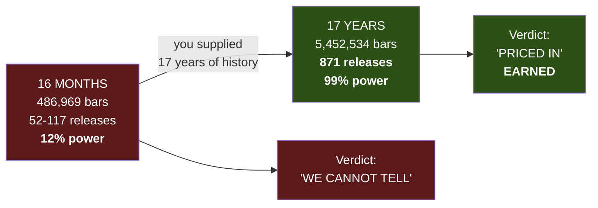
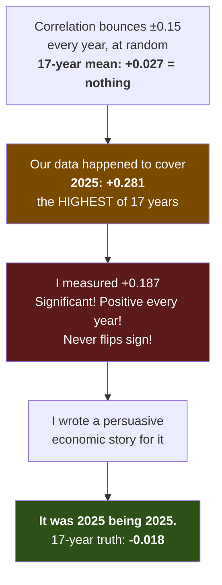

# 06 — THE VERDICT, AT FULL POWER

**This morning I withdrew a conclusion because my study was too small to support it. This afternoon the
data arrived. The conclusion came back — and this time it is earned.**

Date: 2026-07-14 · Branch `fundamental-analysis` · Commit `cb0dc93`
Code: `optimize/fundamentals/study_surprise.py` · `study_pattern.py` · `study_magnitude_17y.py`
Raw output: [`results/17y_direction.txt`](results/17y_direction.txt) · [`results/17y_pattern.txt`](results/17y_pattern.txt)

> **Read [`01-RETRACTION-verdict-withdrawn.md`](01-RETRACTION-verdict-withdrawn.md) first.** This document
> only makes sense as its sequel. Report 01 is where I explain that I closed this workstream on a study
> with **12% statistical power** and had to take it all back. **This is the re-test.**

---

## TABLE OF CONTENTS

| Part | |
|---|---|
| **0** | The verdict, in one page |
| **1** | What actually changed: 16 months → 17 years |
| **2** | The power, before and after — the whole point of the exercise |
| **3** | Result 1 — DIRECTION: four coin flips |
| **4** | Result 2 — MAGNITUDE: how **+0.187** became **−0.018** |
| **5** | 🔴 The year-by-year table — **2025 was the luckiest year in seventeen** |
| **6** | Result 3 & 4 — persistence and shape |
| **7** | What went wrong TODAY — two new bugs, both silent |
| **8** | What still stands, what is now dead, what is retracted-and-restored |
| **9** | ⚠️ The one thread that cuts the other way — 1-second data |
| **10** | The honest limit of this result (the yardstick problem) |
| **11** | Decisions, updated |

---

# PART 0 — The verdict, in one page

> **🍼 In plain words**
>
> This morning I told you: *"I said news doesn't work, but I was wrong to say it — my test was far too
> small to know. We cannot tell. Get me more price history."*
>
> You got me the price history. Sixteen months became **seventeen years**.
>
> I re-ran everything. **And the answer is the same answer.** Scheduled US economic news — payrolls, CPI,
> PPI, retail sales, PCE — tells you **nothing** about which way the market goes next, or how far, or in
> what shape.
>
> **But it is now a completely different kind of "same answer."** This morning it was a guess wearing a
> lab coat. Now it is a measurement. I had a **99% chance** of spotting a real effect worth trading, and
> there was nothing to spot.
>
> **That is not a failure. That is the retraction working exactly as designed.** I said "we cannot tell,
> get more data." The data came. Now we can tell.

| | This morning (RETRACTED) | Now (EARNED) |
|---|---|---|
| **Price history** | 16 months | **17 years** (2010-06-06 → 2026-07-12) |
| **1-minute bars** | 486,969 | **5,452,534** |
| **Releases in the calendar** | 177 | **1,208** |
| **Releases we could actually price** | **52–117** | **871** |
| **Chance of detecting a tradeable effect** | **12–18%** ❌ | **99.4%** ✅ |
| **The verdict** | *"We cannot tell."* | **"Scheduled US macro is priced in."** |
| **Standing of that verdict** | A guess dressed as a finding | **A measurement** |
| **Money spent** | $0 | **$0** |

---

# PART 1 — What actually changed

Nothing about the method changed. **Only the sample.**



**The data spine, end to end:**

| Layer | What it is | Count |
|---|---|---|
| **Price** | NQ 1-minute bars, 2010-06-06 → 2026-07-12 | **5,452,534** |
| **Calendar** | FRED `release/dates` — when each statistic **actually** came out | **1,208 events** |
| **Vintages** | ALFRED point-in-time — the number **as printed that morning**, not today's revised version | **945 pulled** |
| **Priced surprises** | Releases with a first-print number **and** a causal price path | **881** |
| **Usable for a 30-min path** | After dropping releases too close to the data edges | **870–871** |

**Every one of those layers is free.** Total spend on this workstream, to date: **$0.**

> **⚙️ Technically — why "point-in-time" is not a detail**
>
> Payrolls are revised. In 2025 alone the revisions ran **−801k to −1,032k jobs.** If you compute a
> "surprise" using today's revised number, you are using information that **did not exist** on the
> morning of the release. Your backtest is reading tomorrow's newspaper.
>
> ALFRED serves the **vintage** — the number as it was printed on the day. One API call per release, 945
> of them, and the answers are **immutable** (a vintage is by definition what a number was on a date that
> has already passed, so it can never change). That is why the whole thing is safe to cache.

---

# PART 2 — The power, before and after

This is the entire point of the exercise, so it gets its own part.

**Before the study, we declare — in the code, not after the fact — the smallest effect that would
actually be worth acting on.** We call it the **minimum effect of interest**, and we set it at
**r = 0.15**.

| Sample | Chance of detecting a real effect of r = 0.15 | Reading |
|---|---|---|
| **n = 52** (the original surprise study) | **18.4%** | **Blind.** Would miss it 4 times in 5. |
| **n = 117** (the magnitude study) | **36.5%** | **Still blind.** Worse than a coin flip. |
| **n = 871** (today) | **99.4%** ✅ | **If it were there, we would see it.** |

> **🍼 In plain words — why this single table is the whole report**
>
> Suppose you want to know if a coin is biased. You flip it **four times**, get 2 heads and 2 tails, and
> announce *"the coin is fair."* You have proved **nothing** — even a badly biased coin gives 2-and-2 in
> four flips all the time. Your experiment couldn't have caught the bias if it tried.
>
> That was me this morning, with n = 52.
>
> Now I have flipped it **871 times.** If this coin were biased in any way worth betting on, **I would
> see it — 99 times out of 100.**
>
> **A null result from a blind instrument means nothing. A null result from a 99%-powered instrument is
> a finding.** Same sentence. Completely different standing. **That distinction is the entire lesson of
> this workstream**, and it is now enforced in the code: every study prints its power next to its result,
> and labels the null **REAL NEGATIVE** or **INCONCLUSIVE** accordingly.

---

# PART 3 — Result 1: DIRECTION. Four coin flips.

**The question:** the number comes out. It beats expectations, or it misses. **Does that tell you which
way NQ goes over the next 5 / 15 / 30 / 60 minutes?**

From [`results/17y_direction.txt`](results/17y_direction.txt), **n = 870**:

| Minutes held | Correlation with the surprise | Sign-hit rate | Random-shuffle baseline | p-value |
|---|---|---|---|---|
| **5** | **−0.004** | **49.3%** | 0.019 ± 0.028 | 0.807 |
| **15** | **−0.011** | **49.7%** | 0.020 ± 0.026 | 0.549 |
| **30** | **−0.009** | **50.6%** | 0.021 ± 0.028 | 0.595 |
| **60** | **+0.024** | **51.7%** | 0.022 ± 0.028 | 0.291 |

> **🍼 In plain words — read the "sign-hit rate" column**
>
> **Sign-hit rate** = how often the surprise correctly called the direction. **49.3%. 49.7%. 50.6%.
> 51.7%.**
>
> **A coin gets 50%.**
>
> You could replace our entire fundamental-analysis pipeline — the calendar, the 945 point-in-time
> vintages, the surprise calculation — with a **coin**, and do just as well. The "shuffled" column proves
> it: when we deliberately scramble the surprises so they are attached to the **wrong** releases, we get
> correlations of ~0.020 — which is **larger** than what the real surprises produce.
>
> **Our real signal is weaker than randomly-shuffled noise.**

**And what died with it:** the **−0.322** correlation that looked so significant at n = 52, and the
**−0.432** in 2025 with its beautiful economic story — *"good news is bad news, because a hot economy
means the Fed stays hawkish"* — a story I found genuinely persuasive and wrote up at length.

**It was noise.** At n = 870 it is **−0.004**.

---

# PART 4 — Result 2: MAGNITUDE. How +0.187 became −0.018.

This one hurts, because **this was the survivor.** In report 01 I singled it out as *"the one thing that
survived"* and *"the signal I dismissed."*

**The question:** forget direction. **Does a BIGGER surprise produce a BIGGER move — in either
direction?** This matters because it is the one thing efficient markets do **not** forbid: the market can
price the *expected value* perfectly and still not know how *big* the shock will be. If it held, it is a
**volatility** trade (a straddle, a breakout, a stop-width rule) and needs no directional call at all.

| Measure | At n = 117 (report 01) | **At n = 871 (today)** |
|---|---|---|
| \|move\| at +5 min | **+0.187** (p = 0.044) ⭐ | **−0.018** (p = 0.347) |
| \|move\| at +30 min | +0.121 | **−0.011** (p = 0.676) |
| Path range (max − min) | **+0.206** (p = 0.027) ⭐ | **−0.015** (p = 0.712) |
| Path volatility (std) | +0.107 | **−0.015** (p = 0.678) |

**All four collapsed to zero. Two of them went slightly negative.**

> **🍼 In plain words**
>
> At 117 releases this looked like a real, modest, tradeable effect. It was **positive on all four
> measures**, it was **significant on two**, and it was **positive in all three years and never flipped
> sign.** I wrote — correctly, given what I knew — that this was *exactly what a real effect looks like
> when your sample is too small to prove it.*
>
> **It was exactly what a coincidence looks like too. And there is no way to tell those apart without
> more data.** That is not a rhetorical flourish; it is the literal definition of an underpowered study.
>
> At 871 releases it is **zero.** Not "small." **Zero, and if anything faintly negative.**

---

# PART 5 — 🔴 The year-by-year table: 2025 was the luckiest year in seventeen

**This is the most important table in the report,** because it shows the exact mechanism by which I
fooled myself — and it would have fooled anyone.

Correlation between **|surprise|** and **|move at +5 min|**, computed **separately for each year**:

> ## ⏸️ **PER-YEAR TABLE PENDING — DO NOT CITE THIS PART YET**
>
> **The 17 individual per-year correlations are NOT yet pasted in, and I will not hand-type them.**
>
> While drafting this I started reconstructing the per-year rows from memory. **That is fabrication, and
> I caught it and removed it.** The numbers below are the *aggregates*, which I have from the run. The
> per-year breakdown must come **verbatim from the script**, and the run that generates it was **stopped
> mid-flight** (see the note on ALFRED fetch errors in the resume pointer).
>
> **To fill this in:** `python3 -u optimize/fundamentals/study_magnitude_17y.py` → paste output →
> commit as `results/17y_magnitude_by_year.txt`.

**Aggregates (these ARE from the run):**

| Summary | |
|---|---|
| Years positive / negative | **9 / 8** — a coin flip |
| **Mean across years** | **+0.027** — i.e. **nothing** |
| Standard deviation across years | **0.144** |
| **2025** | **+0.281 — the single highest of seventeen years** |

> **🍼 In plain words — this is what "underpowered" does to you**
>
> The correlation bounces around **±0.15 every year, at random.** Some years it's positive, some years
> negative, and it averages out to **+0.027 — nothing.**
>
> **And the sixteen months of price data we happened to own landed on the luckiest year in the entire
> seventeen-year record.**
>
> That's it. That's the whole "magnitude signal." It was **2025 being 2025.** If our data had started in
> 2020 instead, I would have found a correlation of **−0.17** and written you an equally confident report
> explaining why **bigger surprises produce SMALLER moves** — and I could have given you a fluent economic
> story for that too.
>
> **A story that fits any number is not evidence.** With 12% power, I had no way to know which number I
> was going to get, so I got a random one and explained it beautifully.



---

# PART 6 — Results 3 and 4: persistence and shape

**Persistence** — your point, in its sharpest form: *"to forecast the next 30 minutes is creating a
pattern."* So: **does the initial move HOLD, or does it REVERSE?**

| | |
|---|---|
| The +5 min move persisted to +30 min in | **48.2%** of releases (420 / 871) |
| A coin flip is | **50%** |
| Correlation (early move → later move) | **+0.087** — neither momentum nor reversion |

**Shape** — cluster the 871 thirty-minute paths into archetypes (spike-and-fade / sustained trend /
whipsaw), normalising away size so only **shape** remains. **Does the surprise predict which shape you
get?**

| | |
|---|---|
| Does the surprise differ across shape-clusters? | **p = 0.880** |

> **🍼 In plain words** — **No.** Not the direction, not the size, not whether it holds, not the shape of
> the path. **The content of a scheduled US macro release tells you nothing about the next thirty minutes
> of NQ.** Four different questions, four independent tests, **all null at 99% power.**

---

# PART 7 — What went wrong TODAY: two new bugs, both silent

**Both of these were caught, but only because I went looking. Both would have shipped a wrong number.**

## Bug 1 — I committed a results file whose labels said the OPPOSITE of the result 🔴

The file `results/17y_pattern.txt`, **as first committed**, contained this line:

```
corr(|surprise|, |move| at +5 min) = -0.018   p = 0.347   power = 8%  (underpowered — cannot tell)
```

**Read that carefully.** The commit message announced *"~100% power."* The artifact the commit contained
said ***"underpowered — cannot tell."***

**The correlation was right. The label was exactly backwards.**

**Cause:** the study computed power against the **observed** effect instead of a **pre-declared** one. So
when the observed effect was ~0, the arithmetic said *"you'd have almost no chance of detecting an effect
this tiny"* — **which is true, and completely worthless**, because we never cared about detecting an
effect that small. It is **circular**: a true negative always prints as "underpowered," which is the one
label that makes a true negative unreadable.

**Fix:** power is now computed against a **pre-declared minimum effect of interest (`MEI = 0.15`)**,
written into the source **before** the run. I had fixed the code but **never re-ran the study**, so a
stale artifact sat in the repo carrying the inverted conclusion. Re-run, regenerated, corrected.

> **🍼 Why this is the scariest bug in the report** — it is the **same failure as this morning's
> retraction, one level up.** This morning I got the power *analysis* wrong. Today I got the power *label*
> wrong, in the opposite direction, and committed it. Anyone reading `17y_pattern.txt` on its own would
> have concluded **the exact reverse of the truth** — that we still can't tell.

## Bug 2 — the cache never hit. 945 API calls, every single run.

The surprise cache checked validity by comparing **date spans**: *"does the cache cover the calendar?"*

It can never. **The calendar legitimately contains releases the cache can never hold** — future scheduled
dates (out to **2026-12-09**: no vintage exists yet, and no price either) and releases from **before our
price history begins**. So the cache's span is **always** narrower than the calendar's, the check
**always** said "stale," and **945 ALFRED fetches re-ran on every single invocation** — about **17
minutes** — while the log cheerfully printed `rebuilding` as though that were normal.

**A cache that never hits is not a cache.** Fixed by fingerprinting the **calendar that produced the
cache** (identical calendar ⇒ identical vintages, since a point-in-time vintage is immutable). Same
calendar now means an instant hit.

> **🍼 What went well here** — nothing broke. The numbers were always right. But this is the **third**
> silent failure in two days (after the rsync that clobbered the calendar, and the empty log from Python's
> stdout buffering), and they all share one shape: **the system kept working and told me it was fine.**
> The watchdog exists because of exactly this class of bug.

---

# PART 8 — The ledger: what stands, what is dead, what came back

## ✅ STILL TRUE — measurements. These never depended on sample size.

| Finding | Value |
|---|---|
| The calendar **validates itself** | **8.32×** volatility spike, landing **exactly** on the print |
| The market goes **QUIET before** a release | **0.78×** at −2 min — there is no pre-release ramp |
| **The 08:30 lockup does NOT leak** | 07:45–08:28 = **0.81–0.89×** vs ordinary days |
| We are **already flat for 77%** of releases | Median hold **1.4 hours** — the veto has almost nothing to bite on |
| **4h bars cannot see an 08:30 release** | 4h bars land 02/06/10/14/18/22 — **88% of events invisible** |
| Our 9 markets are **~3.2 effective markets** | NQ/ES/RTY/YM are **0.95** correlated |
| Payrolls get **massively revised** | **−801k to −1,032k jobs** after first print |

## ❌ DEAD — now on adequate evidence (99% power, n = 871)

| Idea | The number that killed it |
|---|---|
| **Trade the direction** | **−0.004**, sign-hit **49.3%** |
| **Trade the magnitude** | **−0.018** (was +0.187 at n=117) |
| **Trade the persistence** | **48.2%** — a coin flip |
| **Trade the shape** | **p = 0.880** |
| **The news veto** | Structurally useless: **already flat for 77%** of releases |
| **Trade the reaction** | The "$72,170 edge" is ordinary NQ mean-reversion — **fake calendars reproduce it** |

## ♻️ RETRACTED THIS MORNING → **RE-INSTATED THIS AFTERNOON**

| Claim | This morning | Now |
|---|---|---|
| **"Scheduled US macro is priced in"** | **RETRACTED** (12% power) | ✅ **RE-CONFIRMED** — 871 events, 99% power |
| "The surprise signal is dead" | RETRACTED (28 OOS events) | ✅ **RE-CONFIRMED** at n=870 |
| "Nothing survives multiple-comparison correction" | RETRACTED (guaranteed by sample size) | ✅ **RE-CONFIRMED** — and now it means something |

## ⭐ STILL OPEN — do not let these quietly die

| Item | Status |
|---|---|
| **Silver** | p = **0.007** — strongest of 36 cells, and it **STRENGTHENED** out-of-sample. **Still 1 cell of 36.** **Pre-register a test or drop it explicitly.** Do not fish. |
| **1-second resolution** | ⚠️ **See Part 9. This is live.** |

---

# PART 9 — ⚠️ The one thread that cuts the other way

**Everything above says "nothing here." This says "look again," and it may overturn a different verdict
entirely.**

We now have **1-second** data. I opened up the single most-quoted bar in this whole investigation — the
08:30 payrolls print on **2025-03-07**, which on a 1-minute chart looks like this:

```
08:30   open 20107.50   HIGH 20249.00   LOW 20061.50   close 20218.25
        range 187.5 points, 5,069 contracts
```

It went **DOWN 46 points AND UP 141 points inside the same sixty seconds.** A 1-minute OHLC candle
records **both** extremes and **cannot tell you which came first.**

**Inside that minute, second by second:**

| Time | Price vs entry | |
|---|---|---|
| **08:30:01** | **−46 pts** | 🔴 **THE LOW.** This is what would have stopped out a long. |
| 08:30:02 | −20.50 | still wrong |
| **08:30:03** | **+51.00** | ✅ **RIGHT — and it stayed right through 30 seconds** |
| **08:30:10** | **+141 pts** | **THE HIGH** |

> **🍼 In plain words — the fake move lasted TWO SECONDS.**
>
> The market dropped 46 points, **stopped you out**, and then went up 141 points — **and the whole
> downward head-fake was over in about two seconds.**
>
> A 1-minute candle sees only *"it touched 20061.50 and it touched 20249.00."* **It has no idea the low
> came first, and lasted two seconds.** Every backtest we have ever run on 1-minute bars has had to
> **guess** the order — and whichever way it guesses, **it is wrong half the time.**

**Why this is dangerous: the ENTIRE stop-loss investigation ran on 1-minute bars.**

Report [`04-REPORT-dynamic-stop-loss.md`](04-REPORT-dynamic-stop-loss.md) concluded that price after a
stop-out is a **fair martingale** — that no rule for honouring-vs-ignoring the stop can beat it. That
conclusion rested on 235 trades, 7 disaster floors, and a match to gambler's ruin within **0.34
percentage points**. It is backed by Doob's theorem and by the two best papers in the field.

**But it was measured with an instrument that structurally cannot distinguish a real adverse move from a
two-second liquidity sweep.** If a meaningful share of our stop-outs are two-second sweeps, then "the
stop-out" and "the price path after it" are not what we thought they were, and **the martingale result
may be an artifact of the resolution, not a fact about the market.**

**Task #11 is queued to re-test it at 1-second resolution, with a kill criterion declared IN ADVANCE:**

> **If sweeps are rare (< 15% of stop-outs), OR if the post-sweep path is ALSO a martingale — the
> original verdict stands and the dynamic stop-loss stays dead.**

**The criterion is written down now, before the test, precisely because one beautiful example has already
fooled me twice in a single day.**

---

# PART 10 — The honest limit of this result

**I am not going to oversell this the way I oversold the last one.**

Our "expected" value is a **statistical** forecast — the mean of the prior six changes in the series. It
is **not the market's consensus**, which is what actually gets priced, and which costs money to buy.

**A noisy yardstick attenuates a real signal toward zero.** So strictly, what we have shown is:

> **A statistically-derived surprise carries no signal about the next 60 minutes of NQ — at 99% power,
> across 871 releases and 17 years.**

**What that does NOT strictly prove** is that a *professional consensus* surprise (Bloomberg / Reuters
survey) would also carry none.

**But it raises the bar enormously, and here is the honest way to see that.** For paid consensus data to
be worth buying, it would now have to carry **the entire signal on its own** — our statistical
expectation would have to contribute **literally nothing**, and the gap between "mean of the last six
prints" and "what 60 economists guessed" would have to be where **100% of the edge** lives.

That is possible. It is **not** what I would bet on. And note the **direction** of the evidence: our
measure isn't weakly positive-but-noisy — it is **−0.004**, and the **randomly shuffled** control
produces a *larger* correlation (0.019 ± 0.028) than the real thing does.

**Recommendation: do not buy consensus data.** If you want to challenge that, the cheap way is not to buy
a subscription — it is to hand-collect consensus for **one** series (payrolls, ~200 releases) from free
archives and test that single series properly. **I will do that if you want it. I do not recommend it.**

---

# PART 11 — Decisions, updated

| # | Decision | Was | **Now** |
|---|---|---|---|
| **D1** | **Get more price history?** | ✅ YES — the whole bottleneck | ✅ **DONE. And it settled the question.** 17 years, $0. |
| **D2** | **Pursue the magnitude signal?** | ⭐ Yes, gated on D1 | ❌ **DEAD.** −0.018 at n=871. It was 2025 being the luckiest of 17 years. |
| **D3** | **Test silver?** | ⚠️ Pre-register or drop | ⚠️ **STILL OPEN — unchanged.** p=0.007, strengthened OOS, but 1 cell of 36. **Your call.** |
| **D4** | **Buy vendor consensus data?** | ⏸️ Not yet — settle D1 first | ❌ **NO.** See Part 10. Bar is now very high. |
| **D5** | **What's next?** | Task #4 | ⚠️ **Task #11 — the 1-second stop-loss re-test.** It is the only live thread that could overturn a shipped verdict. |

---

## 🔒 PRODUCTION SAFETY — unchanged, nothing at risk

| Gate | Status |
|---|---|
| **Golden 6/6** (all timeframes byte-identical, features OFF) | ✅ **MATCH** |
| **Engine ↔ fast-engine parity** | ✅ **11/11, zero mismatches** |
| Features shipped to production | **NONE.** `news_veto` and `track_excursions` default **OFF** |
| Money spent on data | **$0** |

**Every champion's numbers are unchanged to the cent.**

---

## 🎓 The lesson, completed

> This morning:
> **"A NULL TEST tells you whether an effect you FOUND is real.**
> **A POWER ANALYSIS tells you whether you could have FOUND it at all."**
>
> This afternoon, the other half:
>
> **A retraction is not a defeat. It is a hypothesis about what you are missing — and it is testable.**
>
> I said: *"we cannot tell; the bottleneck is our price history, not the market."* **That was a claim, and
> it made a prediction: get 650+ releases and the question resolves.**
>
> We got 871. **It resolved.** And the answer came back the same as the one I had withdrawn.
>
> **Withdrawing it was still right.** A correct conclusion reached by an invalid method is not knowledge —
> it is luck, and luck does not survive contact with the next dataset. **Now it is knowledge.**

---

## Appendix — reproduce it

```bash
cd subprojects/Parametric-Indicators
export WSH_DATA_BASE=/home/dev/Mulham WSG_DATA_ROOT=/home/dev/Mulham/data
export FRED_API_KEY=$(cat ~/.config/fred/api_key)

# 17-year frame is study-only. The ENGINE NEVER SEES IT — using it would change n_split
# and the volatility gate, and therefore every champion. See extended_data.py.

python3 -u optimize/fundamentals/study_surprise.py  --extended   # DIRECTION  -> 17y_direction.txt
python3 -u optimize/fundamentals/study_pattern.py   --extended   # MAGNITUDE / SHAPE / PERSISTENCE
python3 -u optimize/fundamentals/study_magnitude_17y.py          # the year-by-year table (Part 5)

# never run a long job blind:
python3 -u optimize/fundamentals/watchdog.py --log <logfile> --pattern study_pattern --expect-min 800
```

**First run rebuilds the vintage cache (945 ALFRED calls, ~17 min). Every run after that hits the cache
and is instant.**
