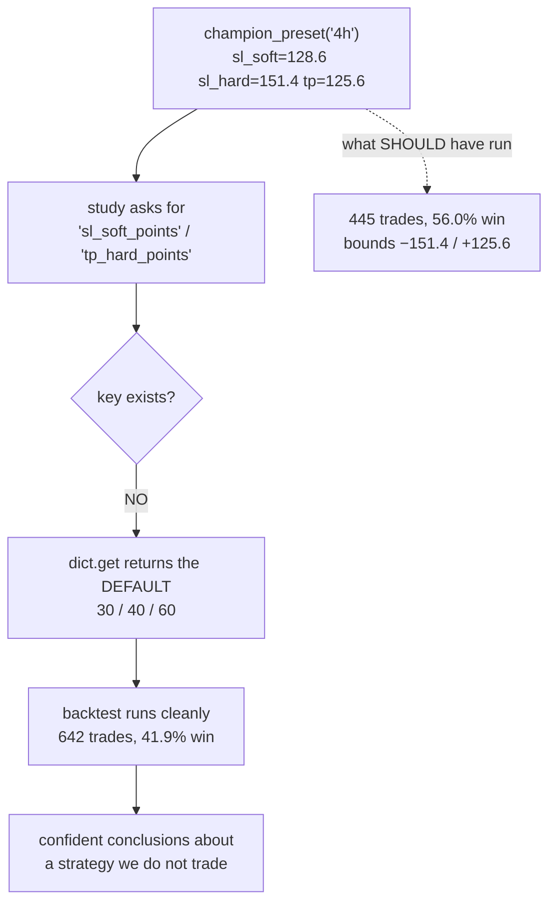

# 🚨 BUG — the sizing & distribution studies never ran the champions (2026-07-19)

**Six studies that produced two workstreams' headline conclusions (#7 own-distribution and #17 fat-tail
sizing) silently backtested a strategy we do not trade. They read champion stop-loss values under key
names that do not exist in the preset, so `dict.get(key, default)` handed them 30/40/60 every time. The
real NQ 4h champion uses 128.6/151.4/125.6. Different stops produce a different trade population — 642
trades at a 41.9% win rate instead of 445 at 56.0%. Every number downstream of that is wrong.**

Found while wiring Z3 for the GC out-of-sample test. Nothing was ever deployed from these studies, so
**no money was at risk** — but the sizing recommendation I gave you rests on this, and it must be
withdrawn pending a re-run.

---

## 1 — THE MECHANISM

The champion preset stores its stops as `sl_soft`, `sl_hard`, `tp`, `flip`:

```
  sl_hard   = 151.4424
  sl_soft   = 128.5770
  tp        = 125.5612
  flip      = False
  gate_pct  =  89.66     <- the ONLY key the studies read successfully
```

The studies ask for **different names**:

```python
float(p.get("sl_soft_points", 30))       # "sl_soft_points" does not exist -> 30
STOP = 40.0                              # hardcoded, ignores sl_hard=151.44
float(p.get("tp_hard_points", 60))       # "tp_hard_points" does not exist -> 60
bool(p.get("flip_entry_direction", False))  # wrong name too -> False by luck
```

`dict.get` with a default cannot fail. It does not warn. It returns a plausible number and the study
runs to completion, prints a clean table, and reports a confident answer about a strategy that does not
exist. **`gate_pct` is spelled correctly, which is exactly why this was invisible** — the preset was
clearly being loaded and used, so nothing looked broken.



---

## 2 — THE PROOF

Same signals, same gate, same data — only the stop parameters differ:

| NQ **4h** | What the studies ran (30/40/60) | The real champion (128.6/151.4/125.6) |
|---|---|---|
| trades | 642 | **445** |
| mean / trade | +3.43 pts | **+8.29 pts** |
| total | +2,201.8 pts | **+3,687.6 pts** |
| P&L bounds | −40.00 / +60.00 | **−151.44 / +125.56** |
| **win rate** | **41.9%** | **56.0%** |

| NQ **1h** | Studies ran (30/40/60) | Real champion (44.0/116.7/83.0) |
|---|---|---|
| trades | 1,157 | **995** |
| mean / trade | +2.94 pts | **+4.22 pts** |
| win rate | 41.4% | **43.0%** |

---

## 3 — WHAT THIS INVALIDATES

| Study | Claimed conclusion | Status |
|---|---|---|
| **D1** `study_pnl_distribution` | "per-trade P&L is **truncated at [−40, +60]**, not fat-tailed — the stop caps the tail" | ❌ **Circular.** −40/+60 *are the hardcoded inputs.* The study measured its own defaults and reported them as a discovery. The real champion's bounds are −151.4/+125.6. |
| **Z1** `study_kelly` | "full Kelly on our ledger = **2.5%**, CI [0.3%, 4.4%]" | ❌ Computed on a **41.9%** win-rate ledger; the champion wins **56.0%**. Kelly is highly sensitive to win rate — this number is not merely imprecise, it is about a different strategy. |
| **Z2** `study_ruin` | "drawdown binds, not ruin → quarter-half Kelly" | ❌ Same wrong ledger. |
| **Z3** `study_vol_target` | "vol-targeting promising, Sharpe 3.2→3.9" | ❌ Same wrong ledger (this is what I was about to OOS-test). |
| **Z4** `study_kelly_pnldd` | "PnL:DD flat half→full Kelly" | ❌ Same wrong ledger. |
| **D4** `study_vol_scaled_stop` | "vol-scaled stop REJECTED — fixed stop already regime-invariant" | ⚠️ Tested against a **40-pt** stop that is not the champion's. Conclusion may still hold (the gambler's-ruin argument is scale-invariant) but it is **unverified**. |

**⚠️ THE SIZING RECOMMENDATION IS WITHDRAWN.** "Risk ~0.6–1.2% per trade (quarter-to-half Kelly)" was
triangulated from Z1/Z2/Z4 — all three ran on the wrong trades. It may land in a similar place after a
correct re-run (a 56% win rate would imply a *larger* Kelly, so the recommendation was likely
**conservative** rather than reckless) but that is a guess until re-computed, and it must not be used.

**What is NOT affected:** everything measured directly off price rather than off champion trades — the
whole news/fundamental-analysis verdict, the GC replication, the sub-minute study, the session-window
work (S1/S3), and D2/D3 (raw-return tail index and conditional tail). Those never touch
`champion_preset`.

---

## 4 — WHY IT SURVIVED SO LONG

1. **`dict.get(key, default)` is a silent failure mode.** It cannot raise. A typo'd key is
   indistinguishable from a deliberately-defaulted one.
2. **One key was spelled right.** `gate_pct` worked, so the preset was demonstrably loaded — the code
   *looked* champion-aware.
3. **The defaults were plausible.** 30/40/60 are reasonable-looking numbers that produce a
   reasonable-looking backtest. Nothing was NaN, nothing crashed, no count went to zero.
4. **The output confirmed the premise.** D1 set out to ask "is our trade P&L fat-tailed or truncated?",
   hardcoded a 40-point stop, and found truncation at exactly −40. The answer matched the belief, so it
   read as confirmation instead of tautology.

**The generalizable lesson: never read a strategy parameter with a silent default.** A missing
parameter must be a hard failure. `p["sl_hard"]` would have raised `KeyError` on the first run and cost
five minutes; `p.get("sl_hard_points", 40)` cost two workstreams.

---

## 5 — THE FIX

1. **`perf/__init__.py` added** (this same session). `perf/` was only a *namespace* package, so on any
   machine with the Linux perf-tool Python bindings installed, the system `perf.so` shadowed it and
   every `from perf._common import ...` failed with "'perf' is not a package". That is why
   `optimize/test_news_veto.py` failed collection and why Z3 could not run locally at all.
2. **Replace every silent `.get(...)` for a strategy parameter with a strict lookup** across the six
   studies, using the real key names (`sl_soft`, `sl_hard`, `tp`, `flip`).
3. **Re-run D1, Z1, Z2, Z3, Z4** on the true champion ledger and re-derive the sizing recommendation.
4. **Then** run the Z3 GC out-of-sample test that started all this.

Until step 3 completes, treat #7's "truncated P&L" headline and all of #17's numbers as **retracted**.
