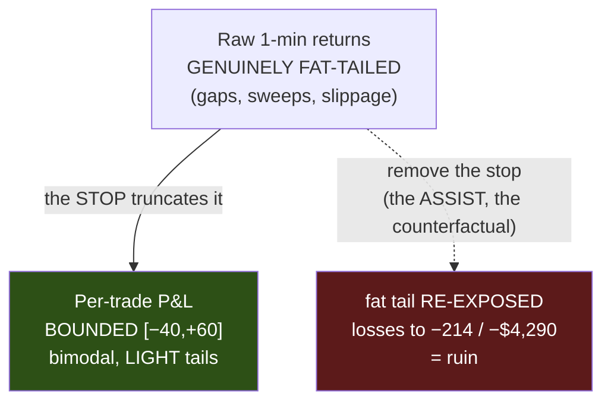

> # ⚠️ SUPERSEDED — THIS REPORT'S HEADLINE WAS CIRCULAR (corrected 2026-07-20)
> This study never ran the champions. It read the stops under key names that do not exist, so
> `dict.get` silently supplied **30/40/60** — and the report then 'discovered' that P&L is truncated
> at exactly **[−40,+60]**, which were its own hardcoded inputs.
> **The conclusion survives on the real ledger, the numbers do not:** bounds **[−151.4, +125.6]**,
> **3.89% of trades gap THROUGH the stop** (not 0%), worst loss **−$3,029** (not −$800), and the
> truncation is now demonstrated by an EVT fit (ξ<0) rather than asserted.
> → [`BUG-01`](BUG-01-sizing-studies-ran-the-wrong-strategy.md)

# DISTRIBUTION · 02 — D1: our per-trade P&L is TRUNCATED, not fat-tailed

**#7, first on-data test — and it corrects the plan. The research recipe (EVT / Generalized Pareto /
fat-tail fitting) was built for RAW RETURNS. But a strategy's per-trade P&L is shaped by a fixed stop and
take-profit, and the data is unambiguous: our champion's per-trade P&L is a BOUNDED, BIMODAL, light-tailed
distribution — the stop truncates the fat tail. This changes where the tail work should point.**

Date: 2026-07-15 · Branch `fundamental-analysis` · Code:
`optimize/fundamentals/study_pnl_distribution.py` · Raw:
[`results/pnl_distribution_nq.txt`](results/pnl_distribution_nq.txt) · 7,356 NQ champion trades across 6 TFs.

---

## ⚡ THE 60-SECOND VERSION

| | |
|---|---|
| **The per-trade P&L is truncated, not fat-tailed** | Bounded in **[−40, +60]** (stop → TP) on every TF; **0 of 7,356 trades** lose more than the −40 stop. |
| **It's bimodal, with LIGHT tails** | **Excess kurtosis −1.82** (fat-tailed would be *positive*). ~40% win at +60, ~37% lose at −40, ~23% in between. Two spikes, not a bell curve. |
| **The "±$1,600 fat tail" was imprecise** | The champion's per-trade spread is sd ≈ **48 pts ≈ $960** — a **bimodal win/lose spread**, not a fat tail. That spread (a near-binary outcome) is what makes small edges hard to detect. |
| **The stop is doing its job** | It *truncates* the fat tail. The fat tail only reappears when you **remove** the stop — the counterfactual, and the "assist". This is *why* the assist is ruinous (B3). |
| **What this changes** | EVT/GPD does **not** apply to the (bounded) trade P&L. It applies to **raw returns** (D2/D3) — the **gap/slippage risk** that could blow *through* the stop in live trading, which the backtest's clean fills don't show. |

---

## 1 — The measurement

Per-trade P&L in points, NQ champions (stop −40, TP +60):

| TF | n | mean | sd | skew | **excess kurt** | min | max | %@TP | %@stop | **%beyond stop** |
|---|---|---|---|---|---|---|---|---|---|---|
| 4h | 642 | +3.4 | 48.1 | +0.32 | **−1.89** | −40 | +60 | 41.9% | 36.6% | **0.0%** |
| 1h | 1157 | +2.9 | 48.0 | +0.34 | **−1.87** | −40 | +60 | 41.4% | 36.0% | **0.0%** |
| 15m | 1685 | +1.6 | 47.9 | +0.39 | **−1.83** | −40 | +60 | 40.1% | 38.1% | **0.0%** |
| 2m | 2268 | +0.1 | 47.7 | +0.45 | **−1.78** | −40 | +60 | 38.8% | 41.5% | **0.0%** |
| **pooled** | **7356** | **+1.3** | **47.7** | **+0.41** | **−1.82** | −40 | +60 | ~40% | ~37% | **0.00%** |

> **🍼 In plain words** — every trade ends in one of two places: a **win at +60** or a **loss at −40** (with
> a minority timing-out in between). That is a **bimodal** distribution — two peaks — and its "excess
> kurtosis" is **negative**, the mathematical signature of **light** tails (flatter than a bell curve),
> the *opposite* of fat. **Not one trade in 7,356 lost more than the stop.** The stop is a hard wall.

---

## 2 — Gaussian vs empirical: here the normal is too PESSIMISTIC

| Worst-loss quantile | Empirical | Gaussian | |
|---|---|---|---|
| 1% | **−40 pts** (the stop) | −110 pts | Gaussian over-states |
| 0.1% | **−40 pts** (the stop) | −146 pts | Gaussian over-states |

Because the real distribution is *truncated*, a Gaussian fit invents losses (−110, −146) that **cannot
happen** — the stop caps everything at −40. The GPD peaks-over-threshold fit confirms it: **zero
exceedances** beyond the stop; the loss tail is *bounded*, not heavy.

---

## 3 — What this corrects, and why it matters

**The whole project has cited a "fat per-trade tail (±$1,600)" as the thing that defeats every edge.** D1
sharpens that:

- The champion's per-trade P&L is **not fat-tailed** — it is a **truncated bimodal spread** (sd ~$960).
- **What actually makes edges hard to detect is the near-binary win/lose outcome** (+$1,200 or −$800 each
  trade). An $80/trade edge against a bimodal ±$960 spread still needs thousands of trades — but the
  mechanism is *variance from a binary outcome*, not a heavy tail.
- The **fat tail is real, but it lives elsewhere:** in the *raw returns* (gaps, sweeps, slippage) that
  could blow **through** the −40 stop in live trading. The backtest fills the stop cleanly at −40, so it
  shows 0% beyond-stop — but the 1-second sweep autopsy and the overnight-gap risk say live fills can be
  worse. **That** is the tail worth modelling, and it is exactly what the assist re-exposes at double size.

> **The coherent picture:** the stop converts a fat-tailed return process into a bounded, bimodal trade
> P&L. That is the stop *working*. The fat tail is not gone — it is held at bay by the stop, and it comes
> roaring back the moment you remove or double past it. D1 is the empirical proof of why report 04/06 (keep
> the stop) and B3 (never assist) are both right.

---

## 4 — VERDICT & where #7 goes next

- ✅ **Per-trade P&L (with the stop): truncated, bimodal, light-tailed.** Model it — for sizing — as a
  simple **mixture of a win outcome (+TP), a loss outcome (−stop), and a small in-between mode**, with a
  win probability. No EVT needed; the stop already bounds it. *(This is the honest sizing model.)*
- 🔬 **The real tail work moves to RAW RETURNS (D2/D3):** fit the tail index of NQ 1-min returns per
  session (Hill / GPD), then the **McNeil–Frey GARCH→GPD** conditional tail. That quantifies the **gap
  risk** — how bad a fill *through* the stop can be — which is the live risk the backtest hides and the
  number that should set stop *placement* and *size*, conditioned on the event-volatility state (A2).
- **Open:** whether live fills actually breach the −40 stop (backtest says never) — a question for the
  1-second data and real fills, tied to the sweep autopsy.

**→ Next: D2** — tail index of raw NQ 1-min returns, per session, with Hill/MRL diagnostics and a range
(not a point). That is where the genuine fat tail lives.
